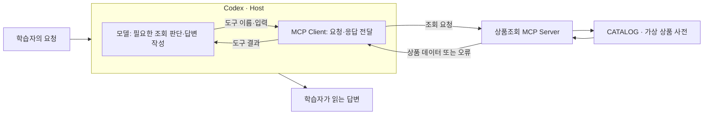

# 3주차 — MCP 서버와 클라이언트의 호출 계약 구성하기

> 이 README가 이번 주차의 상세 학습 본문입니다. 루트 `CURRENT_WEEK.md`는 여기로 돌아오는 짧은 대시보드입니다.

- 기본 작업 폴더: [`learning_lab_server`](learning_lab_server/)
- 전체 과정: [루트 README](../README.md)
- 현재 위치와 다음 명령: [CURRENT_WEEK](../CURRENT_WEEK.md)


이번 주에는 구매 검토라는 제공 업무에서 MCP 서버와 클라이언트를 사용하는 앱의 책임 경계를 도출합니다. 여러 작은 Tool의 호출을 앱 코드가 조합할지, 서버가 업무 단위 Tool 안에서 처리를 조합할지 선택하고 실제 실행 가능한 서버와 호출 앱을 AI와 구성합니다. SDK는 프로토콜을 맡고, 학습자는 어떤 작업을 공개하며 어느 쪽이 순서·결과·실패를 책임질지 판단합니다.

상품 자료·조회·견적 계산은 업무 부품으로 제공하고, CatalogServer·CatalogClient는 SDK 사용을 읽고 실행할 참고 구현으로 제공합니다. 새 구성은 이 클래스의 분기 하나를 채우는 과제가 아닙니다. 요구에 맞는 Tool 경계·호출 계약·Client 처리 흐름을 정한 뒤, 참고 코드와 SDK에서 필요한 부분을 재사용해 실제 서버와 Client의 진입점을 만듭니다. 기존 프로젝트나 외부 서비스 계정은 필요하지 않습니다.

## 시작 전에 알아둘 개념

### MCP: AI 앱이 외부 기능과 자료를 사용하는 공통 규격

**MCP(Model Context Protocol)**는 AI 앱과 다른 프로그램이 기능·자료를 발견하고 요청·결과를 주고받을 때 따르는 규격입니다. 예를 들어 “NOTE-01의 가격을 알려 줘”라는 요청을 받았을 때, 모델의 기억으로 가격을 답하는 대신 상품조회 프로그램이 제공하는 기능을 찾아 실제 데이터를 가져올 수 있게 합니다. MCP 자체가 가격을 알고 있거나 모델을 새로 학습시키는 것은 아닙니다.

조회 함수만 존재한다고 AI 앱이 그 함수를 어떻게 부를지 저절로 알지는 못합니다. 프로그램은 기능의 이름·설명·입력 형식을 알려 주고, AI 앱은 그 형식으로 요청을 보내 결과를 받아야 합니다. MCP는 이 연결에 공통 약속을 제공합니다. 각 서버가 실제로 무엇을 조회하고 수정할 수 있는지는 서버의 구현과 접근 권한에 따라 달라집니다. [MCP 아키텍처](https://modelcontextprotocol.io/docs/2026-07-28/learn/architecture)

2주차의 Skill은 반복 작업의 지침과 필요한 자료를 묶었습니다. MCP는 AI 앱에 다른 프로그램의 기능·자료를 연결합니다. 예를 들어 Skill에 “조회한 가격만 요약하라”는 규칙을 두고, MCP로 실제 가격을 가져와 함께 사용할 수 있습니다. Skill 파일만으로 상품조회 연결이 생기지는 않습니다. 이번 예제는 외부 쇼핑몰 API 대신 서버 코드 안의 가상 상품 자료 `CATALOG`를 조회하므로 계정과 API 키가 필요하지 않습니다.

### Host·Client·Server: 누가 요청을 판단하고 실행하나요?

**Host**는 사용자 대화·모델·외부 연결을 관리하는 AI 앱입니다. 이번에는 Codex가 Host입니다. **Client**는 Host 안에서 특정 MCP 서버와 통신하는 부분이고, **Server**는 조회 같은 기능과 자료를 제공하는 프로그램입니다. Codex를 사용할 때는 앱 안의 Client를 사용합니다. 이 주차의 Java 프로그램에서는 SDK Client를 이용해 초기화·발견·호출·결과 처리를 연결하는 앱 코드를 직접 구성합니다. 통신 규격 자체는 SDK가 구현합니다.

이하 **클라이언트 앱**은 SDK Client를 사용해 도구를 호출하고 업무 결과를 처리하는 실습 프로그램을 뜻합니다. MCP Client는 서버와의 통신을 맡고, 어떤 Tool을 어떤 순서로 호출하며 결과를 어떻게 조합할지는 앱 코드가 정합니다. 이 책임 구분은 구현 언어와 무관합니다.



이 예제의 `get_product` 함수는 ID에 해당하는 값을 반환합니다. 자연어 질문을 이해하고 조회 여부를 판단하는 부분은 Codex 쪽에 있습니다. 따라서 서버가 정확한 값을 반환해도 모델이 답변에 없는 정보를 덧붙일 수 있습니다. **도구의 원응답과 최종 답변을 나누어 확인하는 이유**입니다.

여기서 Server는 반드시 인터넷에 공개된 큰 컴퓨터를 뜻하지 않습니다. 이번에는 내 컴퓨터에서 실행하는 로컬 프로그램이 서버 역할을 합니다. 같은 MCP 규격을 사용해 원격 서비스에 연결할 수도 있지만, 이번 첫 실습은 로컬 프로그램을 대상으로 합니다.

### Tool·Resource·Prompt: 서버가 제공하는 세 가지

**Tool**은 입력을 받아 실행하는 기능입니다. 이번 `get_product`는 `product_id`를 받아 해당 상품의 가격·재고를 반환합니다. 조회도 Tool이며, Tool이라는 이름 자체가 쓰기 권한을 뜻하지는 않습니다. **Resource**는 앱에서 읽어 사용할 자료입니다. 이 예제의 `catalog://help`는 조회 가능한 ID와 주문을 지원하지 않는다는 안내를 제공합니다. URI는 자료의 식별자이며, 여기서는 일반 웹페이지 주소처럼 브라우저에서 여는 대신 MCP 연결을 통해 읽습니다.

**Prompt**는 서버가 제공하는 재사용 요청 문구입니다. `explain_product`에 상품 ID를 넣으면 “get_product로 해당 상품을 조회하고 가격과 재고를 설명하라”는 문장이 나옵니다. 문장을 가져온 것만으로 조회 함수가 실행되지는 않습니다. 다음 표는 제공 코드의 내용이며, 실제 화면의 통신 메시지 전체를 옮긴 것은 아닙니다.

| 제공 항목 | 이번 예제에서 보내는 것 | 받는 것 |
|---|---|---|
| Tool `get_product` | `product_id`에 `NOTE-01` | 노트의 가격 3000원·재고 있음 등 상품 데이터 |
| Resource `catalog://help` | 자료 URI | 두 상품만 조회할 수 있고 주문은 지원하지 않는다는 안내 |
| Prompt `explain_product` | `product_id`에 `NOTE-01` | 해당 상품을 조회하고 설명하라는 요청 문구 |

공식 문서는 Tool은 모델, Resource는 앱, Prompt는 사용자가 주도하는 사용 방식을 설명합니다. 실제 선택 화면과 지원 범위는 사용하는 앱에서 확인해야 합니다. 모든 서버가 세 종류를 전부 제공해야 하는 것도 아닙니다. 이번 예제는 역할 차이를 관찰하도록 세 종류를 함께 제공합니다. [MCP 서버 기능 설명](https://modelcontextprotocol.io/docs/2026-07-28/learn/server-concepts)

이번 조회·계산은 상품 자료를 읽어 결과를 돌려줍니다. 반면 **쓰기 도구**는 파일 저장처럼 호출 뒤에도 남는 변경을 만듭니다. 같은 요청을 다시 보냈을 때 기록이 중복되거나 다른 사람이 고친 내용을 덮어쓸 수 있어, 실행 전 확인과 자료 보존 규칙도 필요합니다. 이 주차의 구현은 가격·재고·예산을 읽고 구매를 검토하는 일입니다. 주문이나 예약은 요구에 없으므로 승인 입력을 만들지 않습니다. Day 3과 Day 5에서 이 허용 동작의 선택이 Tool 구성과 사람의 확인 책임에 어떻게 연결되는지 읽습니다.

### 입력 형식과 호출 결과: 연결한 다음 무엇이 오가나요?

제공 `get_product` 등록에서 `readOnly` 인자는 `true`이며, `ToolAnnotations`에 전달됩니다. 이는 도구의 성격을 알리는 정보입니다. 이 선언이 파일 쓰기를 막거나 사람의 승인을 확인하는 검사를 구현하지는 않습니다. 실제로 허용하는 동작은 함수와 접근·승인 설정에서 확인해야 합니다. 직접 공개하는 조회 Tool도 도구 정보와 실제 동작이 맞아야 합니다.

서버가 알리는 도구 정보에는 이름·설명과 **입력 스키마(schema)**가 있습니다. 스키마는 어떤 이름의 값을 어떤 형식으로 보내야 하는지 정한 정보입니다. 이번 함수의 입력 이름은 `product_id`이고 형식은 문자열입니다. Inspector의 도구 목록에서 이 정보를 확인한 뒤 입력을 채워 호출합니다. Codex에서도 서버가 제공하는 도구 정보를 바탕으로 사용할 도구와 인자를 정합니다.

이번 코드의 조회 흐름을 통신 포장 없이 줄여 쓰면 다음과 같습니다.

```text
도구 선택: get_product
입력 인자: {"product_id": "NOTE-01"}
    → 함수가 CATALOG에서 ID 확인
    → 상품 필드 반환: price_krw = 3000, in_stock = true, ...
    → Codex가 이 값을 근거로 답변
```

문자열이라는 형식을 지켜도 존재하는 상품인지는 별도 문제입니다. `UNKNOWN`도 문자열이지만 사전에 없는 ID여서 조회 함수가 오류를 냅니다. 연결 실패, 입력·조회 오류, 결과 해석 오류를 구분하면 실행 명령을 고칠지, 상품 ID를 고칠지, 답변 지침을 고칠지 판단할 수 있습니다. Day 1에서는 모델의 답변을 거치기 전에 정상값과 이런 오류를 직접 봅니다.

### Inspector·stdio·실행 명령: 브라우저로 무엇을 점검하나요?

**MCP Inspector**는 서버의 기능 목록을 보고 직접 입력을 보내 응답을 확인하는 도구입니다. 이번에는 브라우저 화면을 사용합니다. Codex처럼 모델이 조회를 선택하는 대신 학습자가 Tool과 인자를 고르므로, 같은 서버의 응답을 먼저 확인할 수 있습니다. [Inspector 실행 안내](https://modelcontextprotocol.io/docs/2026-07-28/tools/inspector)

**stdio**는 표준 입력·출력 스트림으로 로컬 프로세스와 메시지를 주고받는 연결 방식입니다. Inspector나 Codex에 “어떤 명령으로 서버를 시작할지”를 알려 주면, 해당 프로그램을 실행해 통신합니다. 원격 서버의 주소로 연결하는 **Streamable HTTP**와 달리 이번 설정에는 서버 실행 명령과 프로젝트 경로를 넣습니다. Inspector의 브라우저 화면을 여는 로컬 URL은 상품조회 MCP의 HTTP 서버 주소와는 역할이 다릅니다. [Codex의 MCP 연결 방식](https://learn.chatgpt.com/docs/extend/mcp?surface=cli)

Day 1에서는 빌드와 서버 실행을 구분합니다. IDE의 Gradle 창에서 `installDist`를 실행하면 코드와 의존성을 `build/install/learning-catalog/`에 준비합니다. Inspector의 `npx`는 점검 화면을 시작하고, 뒤의 `java -Dfile.encoding=UTF-8 -cp "build/install/learning-catalog/lib/*" lab.week03.CatalogServer`는 MCP 서버 프로세스를 시작합니다. Node.js는 Inspector에, JDK는 서버에 사용됩니다.

같은 공개 입력·결과를 제공하면 클라이언트는 서버 내부 언어를 몰라도 호출할 수 있습니다. 빌드 도구와 파일 이름은 그 역할을 구현한 이번 프로젝트의 예입니다. Gradle 로그를 프로토콜 메시지와 섞지 않도록 빌드를 먼저 완료하고 Inspector에는 Java 실행 명령을 전달합니다. 코드를 고치면 다시 빌드한 뒤 연결을 새로 시작합니다.

Codex는 다른 작업 폴더에서 시작할 수 있으므로 로컬 연결 설정에는 빌드된 라이브러리의 실제 경로를 사용합니다. Inspector와 Codex가 같은 프로그램을 각각 시작하므로 한쪽의 연결 성공이 다른 쪽 연결까지 보장하지는 않습니다.

### 제공 프로젝트 구조: 실행 명령이 조회 함수에 닿는 경로

```text
week03-mcp-integration/
├─ README.md                              # 주차 학습 안내
├─ mcp-use.md                             # 실습하면서 이어 쓸 기록
└─ learning_lab_server/
   ├─ README.md                           # 실행·연결·검사 명령
   ├─ build.gradle · settings.gradle      # 실행 진입점·의존성·빌드 설정
   ├─ gradlew · gradlew.bat · gradle/      # Gradle Wrapper
   ├─ src/main/java/lab/week03/
   │  ├─ CatalogService.java              # 제공 상품 자료·조회·계산 함수
   │  ├─ CatalogServer.java               # MCP 등록·입력 계약·응답 변환
   │  ├─ CatalogClient.java               # SDK Client로 발견·호출·결과 처리
   │  └─ Json.java                        # JSON 변환·외부 입력 확인
   └─ src/test/java/lab/week03/
      ├─ CatalogContractTest.java         # 실제 stdio 계약 검사
      └─ CatalogClientTest.java           # Client 결과 처리·제공 업무 규칙 검사
```

`mcp-use.md`는 기록할 때 만듭니다. `build.gradle`의 실행 진입점은 `lab.week03.CatalogServer`입니다. `CatalogServer.main()`이 SDK의 `StdioServerTransportProvider`를 만들고 `McpServer.sync(...)`에 기능을 등록하면 표준 입출력 요청을 처리합니다. **MCP SDK**는 도구 발견·호출·응답의 통신을 구현합니다. 학습자가 통신 규격을 재구현할 필요는 없습니다.

`CatalogService`의 `CATALOG`는 제공 상품값, `getProduct()`는 ID 검사와 상품 반환을 맡습니다. `CatalogServer`의 `get_product`는 클라이언트에 공개한 도구 이름입니다. 내부 메서드 이름과 외부 호출 이름은 연결돼 있지만 서로 다른 인터페이스입니다. Day 1에서는 호출하고, Day 3에서는 이 연결을 읽어 구매 검토의 서버·Client 경계를 구성합니다.

## 실습의 구조와 준비

| Day | 중심 활동 | 관찰할 의미 |
|---|---|---|
| 1 | Inspector에서 서버 연결·목록·성공·오류 확인 | 사람이 선택한 호출과 서버 원응답 |
| 2 | 제공 클라이언트 앱과 Codex로 같은 조회 사용 | 앱 코드의 호출 선택과 모델 판단의 차이 |
| 3 | 구매 검토 요구에서 서버와 클라이언트 앱의 경계를 고르고 서버 구성 | 작업 계약과 프로토콜 계약의 차이 |
| 4 | 클라이언트 앱의 호출 흐름·결과 처리·종료 구현 | 조합을 맡긴 위치와 실패의 의미 |
| 5 | 같은 구매 검토를 Codex에서 사용하고 구조 해석 | 지침·Tool·업무 부품의 실제 연결 |

작업 폴더는 `week03-mcp-integration/learning_lab_server/`입니다. JDK 17 이상과 제공 Wrapper를 사용합니다. Inspector의 Node 준비와 Codex 연결 명령은 프로젝트 README에 있습니다. 기록은 주차의 `mcp-use.md` 한 곳에 이어 쓰며, 이 작업 폴더에서는 `../mcp-use.md`입니다.

참고 서버의 `get_product`는 이미 연결돼 있습니다. `CatalogService`에는 상품 조회·조건 조회·견적 계산도 준비돼 있습니다. Day 1~2는 참고 구현으로 통신 경계를 읽고, Day 3~4는 제공 구매 요구에서 선택한 서버·Client 구성을 실제로 만듭니다. 상품 자료·금액 계산·MCP 메시지 처리를 다시 만들 필요는 없습니다. `inputs/purchase-request.json`과 `inputs/purchase-unknown.json`은 각각 정상적인 구매 검토와 알 수 없는 품목을 포함한 요청 자료입니다.

## Day 1 — Inspector에서 성공과 오류 보기

Inspector에서는 MCP 도구의 입력과 원응답을 직접 확인합니다. 자연어 답변으로 요약되기 전의 정상 값과 오류를 알아야, 다음 날 Codex의 답변이 서버가 반환한 사실을 제대로 사용했는지 대조할 수 있습니다. 같은 입력이 어떤 공개 인자를 거쳐 어떤 결과로 돌아오는지 먼저 봅니다.

### 1. 작업 폴더와 실행 환경 확인

IDE에서 `week03-mcp-integration/learning_lab_server/`를 Gradle 프로젝트로 엽니다. Inspector 시작에 터미널을 사용할 때도 이 폴더를 실행 위치로 지정합니다. **그 위치에 `build.gradle`과 `gradlew.bat`이 있어야 합니다.** 터미널이 학습 저장소 루트에서 시작됐다면 아래 명령으로 이동합니다. 이미 작업 폴더 안이면 이동 명령은 생략합니다.

Windows PowerShell·macOS·Linux·WSL 공통:

```text
cd ./week03-mcp-integration/learning_lab_server
```

JDK 17 이상과 **Node.js 22.19.0 이상**이 필요합니다. IDE의 프로젝트 SDK에서 JDK를 확인합니다. Inspector 시작에 사용할 런타임의 버전을 확인해야 할 때는 다음 명령을 사용하며, IDE와 터미널의 JDK가 다르면 실행 설정을 맞춥니다.

```text
java -version
node --version
```

Node가 기준보다 낮으면 [Node.js 설치](https://nodejs.org/en/download)를 확인하고 새 터미널에서 버전을 다시 확인합니다. JDK가 없다면 IDE의 JDK 다운로드 기능을 사용할 수 있습니다. Gradle은 프로젝트에 포함된 Wrapper로 실행합니다.

### 2. Inspector 실행

IDE의 Gradle 창에서 `installDist`를 실행해 서버와 의존성을 준비합니다. IDE를 사용할 수 없거나 빌드 자동화에 연결할 때는 Windows의 `.\gradlew.bat installDist`, macOS·Linux·WSL의 `bash ./gradlew installDist`를 사용할 수 있습니다.

이후 아래 명령으로 Inspector를 시작합니다. 이 단계의 CLI는 점검 화면과 연결할 서버 프로세스를 함께 지정하기 위해 사용합니다. 도구 선택·입력·결과 확인은 열린 브라우저 화면에서 진행합니다.

Windows PowerShell:

```powershell
npx @modelcontextprotocol/inspector@2.5.0 java -Dfile.encoding=UTF-8 -cp "build/install/learning-catalog/lib/*" lab.week03.CatalogServer
```

macOS·Linux·WSL:

```bash
npx @modelcontextprotocol/inspector@2.5.0 java -Dfile.encoding=UTF-8 -cp "build/install/learning-catalog/lib/*" lab.week03.CatalogServer
```

빌드가 오류 없이 끝난 뒤 Inspector를 시작합니다. 첫 npm 실행의 설치 질문에서는 패키지 이름·버전을 확인합니다. 출력된 로컬 URL을 열고 실습하는 동안 터미널을 켜 둡니다. 세션 토큰이 있는 URL은 공유 기록에 넣지 않습니다. 아래 화면 안내는 Inspector **2.5.0** 기준입니다.

### 3. 브라우저에서 연결하고 호출

1. **Servers** 화면에서 `java` 항목과 `lab.week03.CatalogServer` 실행 명령을 확인합니다. 이 항목 옆의 **연결 스위치**를 켭니다. `Read-only session` 안내는 실행할 서버 목록을 여기서 편집하지 않는다는 뜻이며, 연결이나 도구 호출을 막는 오류가 아닙니다.
2. 상태가 **Connected**로 바뀌고 상단에 `learning-catalog`와 **Tools**가 나타나는지 봅니다. 브라우저가 열렸다는 사실만으로 서버가 연결된 것은 아닙니다.
3. **Tools → get_product**를 선택합니다. 이 버전은 연결할 때 목록을 가져오므로 `List Tools` 버튼을 찾을 필요가 없습니다.
4. **Product Id** 입력칸에 `NOTE-01`을 넣고 **Execute Tool**을 누릅니다. 이 입력칸이 코드의 `product_id` 인자에 해당합니다. **Results**에서 `price_krw: 3000`, `in_stock: true`를 확인합니다.
5. 결과 영역의 닫기 버튼(**Close results**)으로 입력 화면에 돌아와 `PEN-02`, `UNKNOWN`으로 바꾸어 같은 방식으로 실행합니다.

| 입력 | 제공된 서버에서 예상하는 응답 |
|---|---|
| `NOTE-01` | 연습용 노트, `price_krw: 3000`, `in_stock: true` |
| `PEN-02` | 연습용 펜, `price_krw: 1500`, `in_stock: false` |
| `UNKNOWN` | `Unknown product ID` 오류, 상품 가격은 반환하지 않음 |

**Tools가 안 보이면 연결 상태부터 봅니다.** Servers에서 `Disconnected`이면 연결 스위치를 켜고, `Failed`이면 오른쪽 **Console**의 오류를 확인합니다. 실행 파일을 찾지 못하면 `java -version`, 현재 폴더, `build/install/learning-catalog/lib/`의 빌드 결과를 확인합니다. `ClassNotFoundException`이면 `installDist` 완료와 클래스패스를 확인합니다. 오류가 계속되면 실행 명령·작업 폴더·Console 오류를 도우미에게 전달합니다.

세 호출의 입력과 실제 응답을 `../mcp-use.md`에서 찾을 수 있게 기록합니다. 실습을 마치면 Inspector 실행 터미널에서 `Ctrl+C`로 종료합니다.

**남길 결과·완료 판단:** 세 ID의 실제 응답으로 정상 상품과 없는 ID의 처리를 구별합니다. Inspector에서는 직접 도구와 인자를 골랐고 서버가 상품값·오류를 반환했다는 경로를 결과와 연결하면 Day 1을 마칩니다. 코드의 상세 연결은 Day 3에서 읽습니다.

## Day 2 — 제공 클라이언트 앱과 Codex의 역할 비교하기

Inspector가 수행했던 초기화·목록 조회·호출을 작은 Java 프로그램에서도 할 수 있습니다. IDE에서 `CatalogClient.main()`의 실행 설정을 열고 작업 폴더를 `learning_lab_server/`로 지정합니다. 프로그램 인자를 `list`, `get NOTE-01`, `get UNKNOWN`으로 바꿔 실행하고 콘솔의 목록·정상 결과·오류를 확인합니다. 아래는 같은 입력을 반복 실행하거나 자동화할 때 사용할 CLI 대안입니다.

Windows PowerShell:

```powershell
.\gradlew.bat client --args="list"
.\gradlew.bat client --args="get NOTE-01"
.\gradlew.bat client --args="get UNKNOWN"
```

macOS·Linux·WSL:

```bash
./gradlew client --args="list"
./gradlew client --args="get NOTE-01"
./gradlew client --args="get UNKNOWN"
```

`UNKNOWN`에서는 서버의 오류를 보여 주고 프로그램을 성공으로 종료하지 않으므로 Gradle에도 실패가 표시됩니다. 이는 이번 입력에서 기대한 동작입니다. 서버를 시작하지 못한 연결 실패와는 오류 내용·경로가 다릅니다.

### 해설 — SDK Client를 사용하는 앱 코드는 무엇을 결정하나요?

`CatalogClient`의 생성자는 Java 서버 프로세스 실행 조건을 `ServerParameters`로 넘기고, `StdioClientTransport`와 `McpClient.sync(...)`를 연결한 뒤 `initialize()`를 호출합니다. `tools()`는 `listTools()`로 공개된 이름·설명·입력 형식을 가져옵니다. `call()`은 찾은 도구 이름과 인자를 `CallToolRequest`로 보내고 `isError`를 확인한 뒤 앱의 `ToolOutcome`으로 결과를 나눕니다. `close()`는 SDK 연결을 종료합니다. [공식 Java SDK Client](https://java.sdk.modelcontextprotocol.io/latest/client/)

```java
CallToolResult result = client.callTool(new CallToolRequest(toolName, arguments));
// 오류 내용은 사용자에게 전달하지만 성공한 상품 데이터로 사용하지 않습니다.
if (Boolean.TRUE.equals(result.isError()))
    return new ToolOutcome(false, null, message);
return new ToolOutcome(true, result.structuredContent(), message);
```

이 Client에는 상품 가격이 들어 있지 않습니다. `get NOTE-01`이라는 앱 입력을 `get_product`와 `product_id`로 바꾸는 부분은 앱 코드의 선택이고, 실제 가격은 서버가 반환합니다. 메시지 전송·응답 연결·프로토콜 초기화는 SDK가 맡습니다. 코드로 도구와 입력을 정하는 이 프로그램에는 모델이 없으며, 자연어를 이해하는 에이전트라고 부르지 않습니다.

이제 같은 서버를 Codex에 연결합니다. 앱의 MCP 설정에서 command는 `java`, arguments는 `-Dfile.encoding=UTF-8`, `-cp`, `<프로젝트>/build/install/learning-catalog/lib/*`, `lab.week03.CatalogServer`입니다. 실제 경로는 로컬 연결 설정에만 넣습니다. UI 대신 CLI를 쓸 때는 프로젝트 README의 OS별 명령을 사용합니다. 새 Codex 작업에서 요청합니다.

```text
learning-catalog의 get_product로 NOTE-01과 PEN-02의 가격과 재고를 확인해 주세요.
실제 도구 응답을 근거로 설명해 주세요. 도구를 사용할 수 없으면 연결 실패를 알려 주세요.
```

Codex에서는 모델이 자연어를 읽고 Tool과 인자를 선택하며 받은 결과로 답변합니다. 제공 클라이언트 앱에서는 그 선택을 앱 코드가 합니다. 비교하는 것은 호출·결과 해석을 정하는 주체입니다. 같은 ID의 원응답은 같아야 하지만, 모델의 최종 문장에는 반환값에 없는 배송일 같은 정보가 덧붙을 수도 있습니다. **연결 성공·Tool 호출 성공·최종 답변의 정확성**을 따로 보는 이유입니다.

**완료 판단:** 제공 클라이언트 앱과 Codex에서 실제 조회를 사용하고, 도구 이름·인자·원응답을 찾아 Inspector 결과와 대조합니다. 세 화면이 있다는 사실 대신, 어느 부분이 호출을 선택하고 결과를 해석했는지 설명합니다. Codex 연결을 못 했다면 실습 앱의 연결 성공으로 대신 기록하지 않습니다.

## Day 3 — 구매 검토 요구에서 서버와 클라이언트 앱의 경계를 도출하기

먼저 참고 서버의 공개 계약과 업무 함수가 연결되는 경로를 읽습니다. 이어 구매 담당자가 실제로 필요로 하는 결과에서 구성 대안을 도출하고 선택한 서버를 만듭니다. Tool 이름·개수나 기존 Client의 메서드 모양을 출발 요구로 삼지 않습니다.

### 해설 — 등록한 함수가 모델이 쓰는 Tool로 이어지는 경로

공개 호출 계약과 업무 처리를 연결한 실제 코드를 봅니다. 다음은 `CatalogServer.catalogTools()`의 등록에서 핵심 부분을 발췌한 것입니다.

```java
schema(Map.of("product_id", STRING), "product_id")
// STRING은 {"type":"string"}이며 product_id를 필수 입력으로 등록합니다.
```

도구 이름 `get_product`와 입력 스키마를 SDK에 등록하고, 호출 처리에서는 `Json.string(input, "product_id")`로 형식을 확인한 뒤 `catalog.getProduct(...)`에 전달합니다. 계약에 타입을 적어 두는 것과 실제 입력을 거부하는 것은 별도 책임입니다. 공개 스키마는 클라이언트에 형식을 알려 주고 입력 검사는 서버 실행 경계에서 이를 지킵니다.

`CatalogService.java`의 업무 함수는 다음과 같습니다.

```java
public Product getProduct(String productId) {
    Product product = CATALOG.get(productId);
    if (product == null) throw new IllegalArgumentException(
        "Unknown product ID. Available: NOTE-01, PEN-02.");
    return product;
}
```

문자열 형식이 맞아도 존재하지 않는 ID일 수 있습니다. 입력 형식 검사를 통과한 뒤 `CATALOG`에 실제 상품이 있는지 확인하는 이유입니다. `Product`는 반환할 ID·이름·가격·재고 필드를 정합니다. 성공 결과는 `CatalogServer.result()`에서 텍스트와 `structuredContent`로 연결하고, 예상된 입력·업무 오류는 등록 처리에서 `isError: true`로 돌려줍니다. JSON-RPC 메시지 전송과 연결은 SDK가 맡습니다.

```text
CatalogServer에서 get_product와 입력 스키마 등록
→ Client가 도구 정의를 발견하고 {"product_id":"NOTE-01"}로 호출
→ SDK 호출 처리 → 입력 형식 확인 → CatalogService.getProduct()
→ 실제 상품 또는 업무 오류 → MCP 결과 → Codex의 답변
```

Inspector에서는 사람이 도구와 인자를 고르고 반환값을 직접 봅니다. Codex에서는 모델이 요청에 맞는 도구·인자를 고르고, 받은 상품값을 답변으로 설명합니다. 같은 업무 함수를 이 호출 약속에 연결해 두면 각 클라이언트가 서버 내부 상품 자료 구조를 직접 알아야 할 필요가 줄어듭니다. 서버 내부의 자료·계산과 AI 앱에 공개할 도구의 입력·결과를 구분하는 이유입니다.

`NOTE-01`은 등록된 상품 ID이므로 해당 상품의 필드값을 반환합니다. 아래 상품값으로 답변을 뒷받침할 수 있는 범위를 먼저 봅니다. 가격과 재고는 있지만 배송일은 없습니다. `UNKNOWN`은 함수의 오류 경로로 들어가 상품값을 반환하지 않습니다. 아래는 제공 코드에서 예상되는 데이터이며 통신 메시지 전체나 실제 실행 기록은 아닙니다.

```json
{
  "product_id": "NOTE-01",
  "name": "연습용 노트",
  "price_krw": 3000,
  "in_stock": true
}
```

Codex의 실제 답변에서 가격·재고가 어느 반환 필드에 연결되는지 대조합니다. “내일 배송됩니다”라는 설명이 있다면 도구 결과에 없는 정보가 답변에 추가된 것입니다. 조회 오류에서 가격을 만들어 말했다면 함수의 오류 전달과 모델의 해석을 나누어 살펴야 합니다.

이 차이가 Inspector를 먼저 쓰는 이유입니다. 같은 서버 코드·데이터에 같은 ID를 보내면 같은 상품값을 받으므로, Inspector의 원응답을 자연어 답변과 대조할 기준으로 삼을 수 있습니다. 둘 다 실패하면 실행 명령·연결·입력을 보고, 원응답은 맞는데 답변이 틀리면 실제 호출 여부와 모델의 설명을 봅니다. 다만 Inspector에서 성공했다는 사실만으로 Codex의 별도 연결까지 성공했다고 볼 수는 없습니다.

도입에서 본 연결 경로를 이제 실제 설정과 코드에 대조합니다. `build.gradle`의 실행 진입점에서 `CatalogServer.main()`과 SDK 서버 생성으로 이어지는 위치를 찾고, 등록된 조회 함수가 위 상품 필드를 반환하는지 확인합니다. 연결 설정은 어떤 프로그램을 실행할지 정하고, 업무 함수는 받은 요청을 처리한다는 역할 차이를 실제 파일에서 확인할 수 있습니다.

### 해설 — Prompt 안에 함수 이름이 있어도 조회한 것은 아닙니다

`CatalogService.explainProduct()`는 ID가 존재하는지 확인한 뒤 요청 문구를 반환하며, `CatalogServer`가 이를 `explain_product` Prompt로 등록합니다.

```java
return "get_product로 " + productId + "를 조회하고 가격과 재고를 설명하세요. 주문하지 마세요.";
```

`get_product`는 따옴표 안의 글자입니다. ID 존재 여부 확인은 내부 검사를 재사용하지만, 반환하는 것은 상품 데이터가 아니라 조회를 요청할 문장입니다. 내부 확인과 공개 Tool 호출은 다릅니다. `NOTE-01`을 넣으면 가격 3000이 아니라 “get_product로 NOTE-01를 조회하고…”라는 문장이 나옵니다. **Prompt를 가져오기까지 성공한 상태와 Tool을 실행하기까지 성공한 상태가 다르다**는 것을 두 반환문에서 확인할 수 있습니다.

| 요청한 것 | 제공 코드의 결과 | 그 결과만으로 알 수 없는 것 |
|---|---|---|
| `get_product("NOTE-01")` | 상품의 가격·재고 데이터 | 배송일·주문 가능 여부 |
| `catalog://help` 읽기 | 고정 연습 자료이며 두 ID만 조회하고 주문은 지원하지 않는다는 안내 | 지금 조회한 특정 상품의 가격 |
| `explain_product("NOTE-01")` | “get_product로 NOTE-01를 조회하고 가격과 재고를 설명하세요. 주문하지 마세요.”라는 요청 문구 | 실제 Tool 호출 결과 |

이 결과를 기준으로 보면 **Tool**은 인자를 받아 실행하는 기능, **Resource**는 URI로 읽을 자료, **Prompt**는 재사용할 요청 문구입니다. 공식 문서는 각각 모델·앱·사용자가 주도하는 사용 방식을 설명합니다. 어떤 기능을 화면에 노출하고 어떻게 활용하는지는 클라이언트마다 확인해야 합니다. Tool이 조회에도 사용되므로 세 종류를 쓰기·읽기 권한 구분으로 외우면 맞지 않습니다. [MCP 서버 기능 설명](https://modelcontextprotocol.io/docs/2026-07-28/learn/server-concepts)

가격을 3500원으로 바꾸는 상황도 대조해 봅시다. `CATALOG`의 가격을 바꾸면 조회 데이터가 달라집니다. Prompt에 “3500원이라고 답해”만 넣으면 조회값은 여전히 3000원인데 답변 지침과 충돌합니다. 데이터와 요청 문구를 나눠 두면 사실이 바뀐 곳과 설명 방식을 바꿀 곳을 구별할 수 있습니다. `Product`는 반환할 필드를 정하고 `CATALOG`는 그 필드에 넣을 값을 가지므로 새 필드 추가와 기존 가격 변경도 수정 범위가 다릅니다.

또한 Tool 등록에는 `readOnlyHint: true`가 있지만, 이 표시만으로 접근 권한을 판단하지 않습니다. 이 예제가 조회 전용임을 설명할 직접 근거는 `get_product`가 고정 자료에서 상품을 반환하고 외부 쓰기를 수행하지 않는다는 코드입니다. 이 작은 서버에서 확인한 범위를 모든 MCP 서버의 성질로 확대할 수는 없습니다.

Inspector에서 Resource와 Prompt를 열어 반환값을 위 표와 대조하고, Codex의 실제 Tool 응답에서 가격·재고가 답변의 어느 문장으로 이어졌는지 찾습니다. 지원하지 않는 기능은 그 표면의 한계로 남깁니다. 이 분석은 이어지는 구매 검토의 설계·구현에서 필요한 역할을 고르는 근거입니다.

실행 명령에서 조회 함수까지 이어지는 위치, 응답의 가격·재고 필드, Tool과 Prompt의 반환 차이를 실제 코드·호출 결과와 연결해 `../mcp-use.md`에 남깁니다. AI에게 설명이나 기록 초안을 요청해도 됩니다. 초안에서 확인한 원문과 해석이 맞는지 검토하고, 관찰하지 못한 연결은 구분합니다. 이미 같은 분석을 남겼다면 그 기록을 이어 사용합니다.

### 해설 — 구매 요청에서 구성 대안을 도출합니다

> 행사 준비 담당자는 노트 2권과 펜 1개의 가격·재고를 확인하고 총액이 7000원 예산을 얼마나 넘는지 알고 싶습니다. 품절 상품도 목록과 총액에서 임의로 지우면 안 됩니다. 알 수 없는 상품이나 잘못된 수량은 금액을 추정하지 말고 어떤 입력을 고쳐야 하는지 알려 주세요. 이번 결과는 구매 검토이며 주문·예약·파일 저장은 하지 않습니다.

`inputs/purchase-request.json`은 다음 입력을 제공합니다. 이것은 **사용자가 원하는 작업의 입력**입니다. 공개 Tool의 인자 구조를 이 파일과 같게 할지, Client가 여러 호출로 나눌지는 아직 정하지 않았습니다.

```json
{"items":{"NOTE-01":2,"PEN-02":1},"budget_krw":7000}
```

제공 상품은 노트 3000원·재고 있음, 펜 1500원·재고 없음입니다. 따라서 총액은 `3000 × 2 + 1500 × 1 = 7500`, 초과액은 500원이며 품절 목록에 PEN-02가 남아야 합니다. 품절은 “조회 실패”가 아니라 이 요청에서 알아야 하는 정상 업무 결과입니다. NOTE-01 대신 UNKNOWN이 들어오면 가격을 알 수 없으므로 확정 총액을 반환할 수 없습니다.

필요한 책임을 순서대로 도출하면 입력 해석, 실제 상품 확인, 수량별 계산, 예산·품절 판단, 결과 전달입니다. `CatalogService.getProduct()`와 `quote()`가 상품 확인·계산을 이미 맡습니다. 남은 설계는 **어떤 책임을 MCP의 한 호출로 묶고 어느 쪽이 전체 작업을 이어갈 것인가**입니다.

| 구성 대안 | 서버가 공개할 것 | 클라이언트 앱이 맡을 것 | 요구에 비춰 본 효과 |
|---|---|---|---|
| 작은 기능의 호출을 앱에서 조합 | 개별 상품 조회와 여러 품목 견적 계산 | 품목별 조회 → 견적 요청 → 받은 값들을 구매 검토로 조립 | 상품 조회와 견적을 별도 작업에도 쓸 수 있음. 앱 코드가 호출 순서·중간 실패·결과 연결을 책임짐 |
| 업무 단위를 서버에서 조합 | 구매 검토 요청을 받는 한 Tool | 입력 준비 → 한 호출 → 검토 결과·오류 표시 | 여러 앱이 같은 구매 검토 규칙을 사용하기 쉬움. 서버 계약이 구매 업무에 더 밀접해짐 |

둘 다 유효한 출발점입니다. 이번 요구처럼 여러 앱에서 같은 검토 결과가 필요하면 두 번째가 단순합니다. 첫 번째를 선택하면 조합 책임을 호출 앱에 둘 이유와 필요한 호출 순서를 구현합니다. 한쪽을 배우기 위해 다른 쪽도 재구현할 필요는 없습니다. 선택한 구성에서 **같은 업무 입력이 실제로 몇 번의 호출을 거쳐 어떤 결과가 되는지** 보면 차이를 설명할 수 있습니다.

작은 기능 구성에서는 품목별 ID 조회 결과와 견적 계산의 원자료가 일치해야 합니다. 이 제공 자료는 실행 중 바뀌지 않으므로 같은 값을 얻습니다. 실제 가격이 호출 사이에 달라질 수 있다면 서버가 한 검토 단위의 기준 시점이나 버전을 정하는 방식이 필요할 수 있습니다. 한 Tool로 묶었다고 자동으로 트랜잭션이 생기는 것은 아닙니다. 이번에는 자료가 고정이라는 조건 안에서 선택을 실행합니다.

### 해설 — 작업 계약과 MCP 규격을 구분해 코드로 옮깁니다

작업 계약은 “품절도 금액에 포함”, “모르는 품목은 총액을 확정하지 않음”, “원 단위 정수와 양의 수량”, “검토 결과만 반환”입니다. MCP는 이를 대신 정하지 않습니다. MCP 계약은 공개 도구의 이름·설명·입력 스키마·결과 전달 방법이고, 초기화·발견·호출 메시지의 처리는 SDK가 제공합니다.

업무 단위 Tool을 택한 경우 가능한 결과 구조는 다음과 같습니다. 필드 이름과 클래스는 설계 예이며 강제하지 않습니다.

```json
{
  "products": [
    {"product_id":"NOTE-01","price_krw":3000,"in_stock":true},
    {"product_id":"PEN-02","price_krw":1500,"in_stock":false}
  ],
  "quote":{"total_krw":7500,"over_budget_krw":500,"out_of_stock":["PEN-02"]}
}
```

서버 내부에서는 아래와 같은 관계가 필요합니다. 코드는 책임의 연결을 보여 주는 발췌이며 입력 파싱을 포함한 완성 구현은 AI와 작성합니다.

```java
// quantities와 budget은 공개 입력을 검증해 만든 업무 값입니다.
var quote = catalog.quote(quantities, budget);
var products = quantities.keySet().stream()
    .sorted().map(catalog::getProduct).toList();
return Json.object("products", products, "quote", quote);
```

`quote()`를 먼저 실행하면 존재하지 않는 상품·잘못된 수량이 있는 요청에서 완성 결과를 만들기 전에 중단합니다. 순서를 바꿔 일부 상품을 먼저 읽어도 오류 입력의 총액을 확정하면 안 됩니다. 예상된 입력·업무 오류는 MCP의 `isError` 결과로, 정상적인 예산 초과·품절은 성공 데이터로 전달하면 Client가 다음 행동을 구별할 수 있습니다. 프로그램을 시작하지 못한 실패는 이 두 결과를 받기 전의 연결 실패입니다.

구현에는 참고 서버의 `McpServer.sync(transport)`·`Tool.builder()`·호출 handler·`CallToolResult` 사용을 재사용할 수 있습니다. `CatalogServer.create(...)`가 Resource·Prompt까지 모두 등록한다는 이유로 새 서버도 그대로 복사할 필요는 없습니다. Tool이 업무를 실행하고, 사용 범위처럼 읽을 자료가 필요하면 Resource, 반복 요청 문구가 필요하면 Prompt를 선택합니다. 기존 상품 Resource·Prompt의 역할은 앞에서 관찰했으므로 새 서버에 세 종류를 채워 넣는 것이 목표가 아닙니다.

JSON 스키마에 integer를 선언하는 것은 호출 방법을 알리는 일입니다. 실행 경계에서도 소수·음수·너무 큰 수를 조용히 자르지 않고 선택한 계약대로 거부해야 합니다. ID 존재·수량·금액 계산은 제공 업무 함수가 맡고, 공개 JSON을 그 함수의 값으로 옮기는 입력 확인과 오류 변환은 서버가 맡습니다. 참고 `Json`과 SDK를 사용하되 실제 숫자 범위에 맞는 변환을 구현합니다.

이번 요청에는 실제 변경이 없으므로 “승인됨” 인자를 받지 않습니다. `readOnlyHint`는 성격을 알려 주는 표시이고 권한 검사가 아닙니다. 나중에 주문이 추가되면 “검토했다”와 “주문을 승인했다”가 달라지므로, Host의 사람 확인과 서버의 승인 대상·재요청 처리가 별도로 필요합니다. 모델이 `approved=true`를 채우는 것으로 그 책임을 대신할 수 없습니다.

### 선택한 서버를 실제로 구성하기

```text
제공 구매 요구·두 inputs 파일과 CatalogService를 읽어 주세요.
작은 조회·견적 Tool의 호출을 앱 코드에서 조합하는 구성과, 구매 검토를 서버에서 묶는 구성을 비교하세요.
각 구성의 입력·결과·오류, 호출 순서, 가격·품절 판단 위치를 실제 7500원 결과로 설명하고 추천해 주세요.
내 수용·수정 의견을 받은 뒤 그 구성의 공개 계약과 서버 진입점을 제공 Java 프로젝트에 구현하세요.
참고 CatalogServer에서 SDK 사용을 재사용할 수 있지만 그 클래스 구조·Tool 수·이름은 고정하지 않습니다.
제공 상품·계산 함수는 활용하고, 이 업무에 필요한 등록·입력 확인·결과·오류를 구현하세요.
선택한 진입점을 빌드·실행할 방법을 프로젝트 README에 반영하고 실제 SDK 연결로 발견·호출하세요.
새 계약의 목록·입력·결과에 필요한 기존 검사만 맞추고 전체 검사 체계를 새로 만들지 마세요.
```

새 클래스로 구성하거나 참고 구현을 발전시킬 수 있습니다. 새 클래스를 선택했다면 IDE의 main 실행 또는 Gradle JavaExec 작업에 실제 진입점을 연결합니다. 서버를 `installDist`로 빌드한 뒤 Inspector 명령의 마지막 클래스 이름도 맞춥니다. 예를 들어 선택한 클래스가 `lab.week03.PurchaseServer`라면 두 OS에서 서버 명령은 `java -Dfile.encoding=UTF-8 -cp "build/install/learning-catalog/lib/*" lab.week03.PurchaseServer`입니다. 선택한 이름이 다르면 실제 이름을 사용합니다.

**완료 판단:** 요구에서 선택한 Tool 경계·입력·정상 결과·업무 오류가 실제 서버에 구현돼 발견·호출됩니다. 기존 함수 하나를 등록한 사실만으로 전체 구매 검토 경계를 구성했다고 판단하지 않습니다.

## Day 4 — 클라이언트 앱의 호출 흐름과 결과 처리 구현하기

클라이언트 앱을 구성할 때는 **구매 입력을 어떤 실행으로 바꿀 것인가**부터 정합니다. 작은 Tool 구성이면 앱 코드가 품목 조회와 견적 호출을 이어가고, 업무 단위 Tool 구성이면 한 요청의 결과를 해석합니다. 두 경우 모두 서버를 시작할 조건, 초기화, 실제 도구 발견, 필요한 호출, 결과·오류 처리, 연결 종료가 필요합니다.

참고 `CatalogClient`의 `ServerParameters → StdioClientTransport → McpClient.sync → initialize`는 통신을 여는 예입니다. 여기에 어떤 서버 진입점을 실행하고 어느 Tool을 어떤 순서로 부를지는 자기 구성에 맞춰 정합니다. 기존 `call()` 메서드를 반드시 통과해야 하거나 정해진 클래스에 코드를 채워야 하는 규칙은 없습니다. SDK가 메시지를 맡으므로 새로운 프로토콜이나 범용 에이전트 프레임워크를 작성할 필요도 없습니다.

### 해설 — 품절 결과와 앱의 처리 상태는 다릅니다

`purchase-request.json`에서 PEN-02가 품절이라는 사실은 프로그램 실패가 아닙니다. 클라이언트 앱은 총액 7500원·초과액 500원·품절 품목을 같이 보여 줘야 합니다. 품절 목록이 비었다는 사실만으로 주문을 실행해서도 안 됩니다. 이번 앱은 검토 결과를 보여 주고 끝납니다.

`purchase-unknown.json`은 NOTE-01과 UNKNOWN을 함께 담습니다. 작은 Tool을 조합하면 NOTE-01 조회까지 성공한 뒤 실패할 수 있습니다. 앞서 얻은 상품을 참고 정보로 보여 줄지는 선택할 수 있지만, 전체 요청이 검토 완료인 것처럼 총액을 쓰지 않습니다. 업무 단위 Tool은 전체 결과를 만들지 못한 오류를 돌려줄 수 있습니다. **부분적으로 조회한 값, 완성된 업무 결과, 연결 실패**를 구분해 사용자에게 전달하는 것은 호출 앱의 업무 처리 책임입니다.

MCP 도구 발견은 현재 서버가 제공하는 계약을 확인하는 단계입니다. 발견된 모든 Tool을 실행하거나 자연어로 자동 선택하는 엔진을 만들 필요는 없습니다. 이번 Client가 선택한 작업에 필요한 도구가 있는지 확인하고 그 계약으로 호출하면 됩니다. 공개 도구가 없거나 서버를 시작하지 못하면 입력을 “상품 없음”으로 바꾸지 말고 연결·구성 오류를 알립니다.

```text
Day 3에서 선택한 구성과 실제 서버 계약을 기준으로 클라이언트 앱의 호출 흐름과 결과 처리를 구성해 주세요.
제공 inputs JSON을 읽고 필요한 Tool을 발견한 뒤 선택한 호출 순서로 구매 검토 결과를 만들려 합니다.
서버 실행 조건, 입력에서 호출로의 변환, 중간 오류에서 멈출 위치, 결과 표시와 종료를 추천해 주세요.
내 수용·수정 의견 뒤 실제 진입점과 실행 설정을 구현하세요. 기존 Client의 메서드 모양에 맞출 필요는 없습니다.
제공 Java 프로젝트의 SDK 연결 코드는 참고하고, 서버의 상품 데이터·계산 규칙을 호출 앱에 복제하지 마세요.
두 제공 입력으로 실제 서버와 연결해 완성 결과와 불완전한 요청을 구별하는 동작을 확인하세요.
공개 계약과 실행 방법을 기존 프로젝트 README에 연결하고 예상과 실제 호출·결과의 차이를 설명해 주세요.
```

예를 들어 Client 클래스를 `lab.week03.PurchaseClient`로 정했다면 IDE의 메인 클래스 실행 설정에 그 클래스와 입력 파일 인자를 지정합니다. 자동 호출이나 터미널 실행이 필요하면 Gradle에 그 클래스와 `sourceSets.main.runtimeClasspath`를 사용하는 JavaExec 작업을 연결할 수 있습니다. 실제로 선택한 이름과 인자 형태로 실행 방법을 README에 안내합니다. 입력만 들어 있고 실행할 방법이 없는 초안은 이 단계의 완료가 아닙니다.

**완료 판단:** 선택한 클라이언트 앱이 SDK를 통해 실제 서버와 연결해 초기화·발견·호출·연결 종료를 수행하고 두 제공 입력을 계약대로 처리합니다. Tool의 결과에서 다음 호출이나 업무 처리를 끝내기로 결정한 위치를 앱 코드와 실제 결과로 설명합니다.

## Day 5 — 같은 업무를 Host에서 사용하고 구성의 효과 해석하기

구성한 서버의 실제 진입점으로 Codex 연결을 등록하거나 갱신합니다. 앞서 CatalogServer에 연결했던 설정을 그대로 두면 참고 서버를 호출하므로 서버 이름·클래스·빌드 결과를 대조합니다. 다음 요청을 새 작업에서 직접 보냅니다.

```text
연결한 구매 검토 MCP를 사용해 NOTE-01 2개와 PEN-02 1개를 예산 7000원으로 검토해 주세요.
가격·재고·총액·예산 초과를 실제 도구 결과로 설명하고 품절 항목도 남겨 주세요.
결과는 검토용이며 주문이나 예약을 요청한 것은 아닙니다.
```

작은 Tool 구성에서는 Codex의 모델이 필요한 호출을 선택해 이어가고, 업무 단위 구성에서는 서버가 검토를 조합합니다. 실습 앱에서는 코드로 정했던 호출 순서를 이제 모델이 공개 도구 설명과 사용자 요청을 보고 정한다는 차이를 봅니다. MCP Client는 각 경로에서 요청·응답의 통신을 맡습니다. Tool 개수나 응답 문장의 길이로 우열을 정하지 않고, 선택한 책임 배치가 실제 호출에 나타났는지 확인합니다.

2주차의 Skill을 여기에 함께 사용한다면 반복할 구매 검토 절차와 사실 사용 규칙을 보관할 수 있습니다. MCP 서버는 상품·계산을 제공하고, Host는 지침과 도구 결과를 사용해 작업을 이어갑니다. Tool에 연결 순서를 설명했다고 다른 Tool이 자동 실행되는 것은 아니며, Skill 본문에 도구 이름을 써도 서버 연결을 대신하지 않습니다. 이번에는 실제 요청과 MCP로 이 조합을 확인하고, 별도 구매 Skill까지 제작할 의무는 없습니다.

실제 원응답이 7500원인데 답변이 6000원이면 품절을 모델이 제외했는지 봅니다. 원응답부터 6000원이면 제공 계산을 어떤 입력으로 호출했는지 서버·Client의 조합을 확인합니다. Tool이 없다는 오류면 계산보다 발견·등록·연결 설정을 먼저 봅니다. 동일한 화면의 “틀린 합계”라도 책임에 따라 고칠 위치가 다릅니다.

이미 확인한 클라이언트 앱의 사례를 모두 반복할 필요는 없습니다. Codex의 실제 도구 선택·인자·원응답·최종 설명을 기존 노트에 연결하고, 자신의 구성에서 조합·오류·허용 동작을 담당한 위치와 선택 이유를 설명합니다. API나 데이터가 바뀔 때 어느 계약을 다시 정할지도 그 책임에서 도출합니다.

**완료 판단:** 선택한 서버를 Codex에서 사용하고 실제 도구 결과로 구매 검토를 설명합니다. SDK가 제공한 통신과 직접 구성한 업무 경계·호출 정책을 구별하고, 선택하지 않은 대안의 구현 없이도 책임이 이동하는 이유를 설명합니다.

## 완료 기준

- [ ] 참고 구현에서 Host·Client·Server와 Tool·Resource·Prompt의 역할을 실제 코드·응답으로 구별했습니다.
- [ ] 제공 구매 요구에서 조합 위치·Tool 경계·입력·결과·오류·허용 동작을 판단했습니다.
- [ ] SDK·업무 부품을 재사용해 선택한 서버와 클라이언트 앱의 공개 계약·호출 흐름·결과 처리·진입점·실행 설정을 구현했습니다.
- [ ] 두 제공 입력의 결과에서 정상 품절·예산 초과와 잘못된 요청을 구별하고, 중간 실패를 완성된 검토로 사용하지 않았습니다.
- [ ] 같은 서버를 Codex에서 사용하며 실제 호출과 최종 설명을 연결했습니다.
- [ ] 선택한 조합·실패·종료 책임이 실제 코드·결과에 나타나는 이유를 설명했습니다.

관련 검사는 IDE의 Gradle `test`, PowerShell의 `.\gradlew.bat test`, macOS·Linux·WSL의 `./gradlew test`로 실행합니다. 참고 구현의 테스트가 통과해도 자신이 구성한 진입점의 실행을 대신하지 않습니다. 필요한 실제 호출은 위 두 입력과 Host 사용으로 확인합니다. 실제 모델·Host 연결을 못 했다면 그 범위를 미확인으로 남깁니다.

## 이 주차의 파일

`learning_lab_server/`가 실행 프로젝트입니다. `CatalogService.java`는 제공 업무 함수, `CatalogServer.java`·`CatalogClient.java`는 실행 가능한 SDK 참고 구현, `Json.java`는 입력 확인과 JSON 변환을 맡습니다. `inputs/`는 구매 검토 업무 입력입니다. 새로 정한 서버·Client 파일과 실행 설정은 같은 프로젝트에 만들거나 참고 구현을 발전시켜 사용합니다. 빌드 설정의 SDK 버전은 1.1.4이며 통신 규격을 직접 구현하지 않습니다.

주차 `README.md`는 개념과 Day별 실습, 프로젝트 `README.md`는 실행·연결 명령입니다. `mcp-use.md`에 기존 실행 근거와 설계 해석을 이어 씁니다. `.gradle/`·`build/`는 실행 생성물이며 공유하는 원문 설명이나 실습 결과를 대신하지 않습니다.
