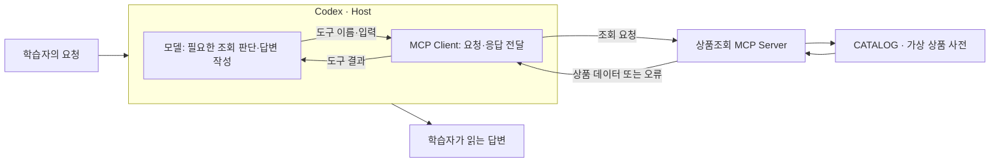

# 3주차 — MCP로 조회·계산과 승인한 초안 저장 기능 만들기

> 이 README가 이번 주차의 상세 학습 본문입니다. 루트 `CURRENT_WEEK.md`는 여기로 돌아오는 짧은 대시보드입니다.

- 기본 작업 폴더: [`learning_lab_server`](learning_lab_server/)
- 전체 과정: [루트 README](../README.md)
- 현재 위치와 다음 명령: [CURRENT_WEEK](../CURRENT_WEEK.md)


이번 주에는 AI 앱이 업무 함수를 발견하고 호출하는 경로를 이해한 뒤, 필요한 조회·계산과 사람이 확인한 로컬 초안 저장을 같은 MCP 서버에 만듭니다. 함수가 책임질 처리와 모델이 사용할 입력·결과를 정하고, 요구가 달라지면 도구 구성과 변경 범위를 어떻게 고칠지 배웁니다. 기존 서버·SDK와 Codex로 구현할 수 있습니다.
AI는 실제 코드와 대표 입력으로 추천 구성·이유·예상을 설명합니다. 새로운 중요한 구성에서는 학습자의 짧은 예상이나 수용·수정 의견을 받은 뒤 구현하고, 실행 결과에서 그 선택의 의미를 해석합니다. 이미 확인한 선택과 단순 수정에는 같은 설계 질문을 반복하지 않습니다. 기존 포트폴리오가 있으면 동등한 조회·새 기록 생성 업무로 바꿀 수 있고, 개인 프로젝트가 없으면 제공 상품 서버를 사용합니다.

**기존 학습자 보충 안내:** 2주차의 지침 구성에 이어 현재 서버·`mcp-use.md`로 Day 3의 대표 호출 경로와 Day 5의 업무 정책·도구 구성을 읽고, 다음으로 4주차의 작업 분할을 봅니다. 이미 구현한 기능의 실제 코드를 짚어 이해가 이어지지 않는 부분을 짧게 대화합니다. 설명 보충을 위한 재실행·노트 재작성은 필요하지 않으며, 새 해석은 원할 때만 기록합니다. 미실행 기능이나 실제 연결이 읽기만으로 완료되지는 않습니다.

## 시작 전에 알아둘 개념

### MCP: AI 앱이 외부 기능과 자료를 사용하는 공통 규격

**MCP(Model Context Protocol)**는 AI 앱과 다른 프로그램이 기능·자료를 발견하고 요청·결과를 주고받을 때 따르는 규격입니다. 예를 들어 “NOTE-01의 가격을 알려 줘”라는 요청을 받았을 때, 모델의 기억으로 가격을 답하는 대신 상품조회 프로그램이 제공하는 기능을 찾아 실제 데이터를 가져올 수 있게 합니다. MCP 자체가 가격을 알고 있거나 모델을 새로 학습시키는 것은 아닙니다.

조회 함수만 존재한다고 AI 앱이 그 함수를 어떻게 부를지 저절로 알지는 못합니다. 프로그램은 기능의 이름·설명·입력 형식을 알려 주고, AI 앱은 그 형식으로 요청을 보내 결과를 받아야 합니다. MCP는 이 연결에 공통 약속을 제공합니다. 각 서버가 실제로 무엇을 조회하고 수정할 수 있는지는 서버의 구현과 접근 권한에 따라 달라집니다. [MCP 아키텍처](https://modelcontextprotocol.io/docs/2026-07-28/learn/architecture)

2주차의 Skill은 반복 작업의 지침과 필요한 자료를 묶었습니다. MCP는 AI 앱에 다른 프로그램의 기능·자료를 연결합니다. 예를 들어 Skill에 “조회한 가격만 요약하라”는 규칙을 두고, MCP로 실제 가격을 가져와 함께 사용할 수 있습니다. Skill 파일만으로 상품조회 연결이 생기지는 않습니다. 이번 예제는 외부 쇼핑몰 API 대신 서버 코드 안의 가상 상품 자료 `CATALOG`를 조회하므로 계정과 API 키가 필요하지 않습니다.

### Host·Client·Server: 누가 요청을 판단하고 실행하나요?

**Host**는 사용자 대화·모델·외부 연결을 관리하는 AI 앱입니다. 이번에는 Codex가 Host입니다. **Client**는 Host 안에서 특정 MCP 서버와 통신하는 부분이고, **Server**는 조회 같은 기능과 자료를 제공하는 프로그램입니다. 학습자가 Client를 따로 구현하는 것이 아니라 앱에 포함된 연결 기능을 사용합니다.



이 예제의 `get_product` 함수는 ID에 해당하는 값을 반환합니다. 자연어 질문을 이해하고 조회 여부를 판단하는 부분은 Codex 쪽에 있습니다. 따라서 서버가 정확한 값을 반환해도 모델이 답변에 없는 정보를 덧붙일 수 있습니다. **도구의 원응답과 최종 답변을 나누어 확인하는 이유**입니다.

여기서 Server는 반드시 인터넷에 공개된 큰 컴퓨터를 뜻하지 않습니다. 이번에는 내 컴퓨터에서 실행하는 로컬 프로그램이 서버 역할을 합니다. 같은 MCP 규격을 사용해 원격 서비스에 연결할 수도 있지만, 이번 첫 실습은 로컬 프로그램을 대상으로 합니다.

### Tool·Resource·Prompt: 서버가 제공하는 세 가지

**Tool**은 입력을 받아 실행하는 기능입니다. 이번 `get_product`는 `product_id`를 받아 해당 상품의 가격·재고를 반환합니다. 조회도 Tool이며, Tool이라는 이름 자체가 쓰기 권한을 뜻하지는 않습니다. **Resource**는 앱에서 읽어 사용할 자료입니다. 이 예제의 `catalog://help`는 조회 가능한 ID와 주문을 지원하지 않는다는 안내를 제공합니다. URI는 자료의 식별자이며, 여기서는 일반 웹페이지 주소처럼 브라우저에서 여는 대신 MCP 연결을 통해 읽습니다.

**Prompt**는 서버가 제공하는 재사용 요청 문구입니다. `explain_product`에 상품 ID를 넣으면 “get_product로 해당 상품을 조회하고 가격과 재고를 설명하라”는 문장이 나옵니다. 문장을 가져온 것만으로 조회 함수가 실행되지는 않습니다. 다음 표는 제공 코드의 내용이며, 실제 화면의 통신 메시지 전체를 옮긴 것은 아닙니다.

| 제공 항목 | 이번 예제에서 보내는 것 | 받는 것 |
|---|---|---|
| Tool `get_product` | `product_id`에 `NOTE-01` | 노트의 가격 3000원·재고 있음 등 상품 데이터 |
| Resource `catalog://help` | 자료 URI | 두 상품만 조회할 수 있고 주문은 지원하지 않는다는 안내 |
| Prompt `explain_product` | `product_id`에 `NOTE-01` | 해당 상품을 조회하고 설명하라는 요청 문구 |

공식 문서는 Tool은 모델, Resource는 앱, Prompt는 사용자가 주도하는 사용 방식을 설명합니다. 실제 선택 화면과 지원 범위는 사용하는 앱에서 확인해야 합니다. 모든 서버가 세 종류를 전부 제공해야 하는 것도 아닙니다. 이번 예제는 역할 차이를 관찰하도록 세 종류를 함께 제공합니다. [MCP 서버 기능 설명](https://modelcontextprotocol.io/docs/2026-07-28/learn/server-concepts)

이번 조회·계산은 상품 자료를 읽어 결과를 돌려줍니다. 반면 **쓰기 도구**는 파일 저장처럼 호출 뒤에도 남는 변경을 만듭니다. 같은 요청을 다시 보냈을 때 기록이 중복되거나 다른 사람이 고친 내용을 덮어쓸 수 있어, 실행 전 확인과 자료 보존 규칙도 필요합니다. Day 1~4에서 조회를 만들고 확인한 뒤, Day 5의 구매 검토 업무에서 계산 결과를 사람이 확인한 새 초안으로 저장합니다. 기존 초안을 편집하는 기능은 뒤의 심화 활동으로 구분합니다.

### 입력 형식과 호출 결과: 연결한 다음 무엇이 오가나요?

제공 `get_product`의 `ToolAnnotations(readOnlyHint=True, ...)`는 도구의 성격을 알리는 정보입니다. 이 선언이 파일 쓰기를 막거나 사람의 승인을 확인하는 검사를 구현하지는 않습니다. 실제로 허용하는 동작은 함수와 접근·승인 설정에서 확인해야 합니다. Day 5에서 저장 기능을 추가할 때도 도구 정보와 실제 동작이 맞도록 고칩니다.

서버가 알리는 도구 정보에는 이름·설명과 **입력 스키마(schema)**가 있습니다. 스키마는 어떤 이름의 값을 어떤 형식으로 보내야 하는지 정한 정보입니다. 이번 함수의 입력 이름은 `product_id`이고 형식은 문자열입니다. Inspector의 도구 목록에서 이 정보를 확인한 뒤 입력을 채워 호출합니다. Codex에서도 서버가 제공하는 도구 정보를 바탕으로 사용할 도구와 인자를 정합니다.

이번 코드의 조회 흐름을 통신 포장 없이 줄여 쓰면 다음과 같습니다.

```text
도구 선택: get_product
입력 인자: {"product_id": "NOTE-01"}
    → 함수가 CATALOG에서 ID 확인
    → 상품 필드 반환: price_krw = 3000, in_stock = true, ...
    → Codex가 이 값을 근거로 답변
```

문자열이라는 형식을 지켜도 존재하는 상품인지는 별도 문제입니다. `UNKNOWN`도 문자열이지만 사전에 없는 ID여서 조회 함수가 오류를 냅니다. 연결 실패, 입력·조회 오류, 결과 해석 오류를 구분하면 실행 명령을 고칠지, 상품 ID를 고칠지, 답변 지침을 고칠지 판단할 수 있습니다. Day 1에서는 모델의 답변을 거치기 전에 정상값과 이런 오류를 직접 봅니다.

### Inspector·stdio·실행 명령: 브라우저로 무엇을 점검하나요?

**MCP Inspector**는 서버의 기능 목록을 보고 직접 입력을 보내 응답을 확인하는 도구입니다. 이번에는 브라우저 화면을 사용합니다. Codex처럼 모델이 조회를 선택하는 대신 학습자가 Tool과 인자를 고르므로, 같은 서버의 응답을 먼저 확인할 수 있습니다. [Inspector 실행 안내](https://modelcontextprotocol.io/docs/2026-07-28/tools/inspector)

**stdio**는 표준 입력·출력 스트림으로 로컬 프로세스와 메시지를 주고받는 연결 방식입니다. Inspector나 Codex에 “어떤 명령으로 서버를 시작할지”를 알려 주면, 해당 프로그램을 실행해 통신합니다. 원격 서버의 주소로 연결하는 **Streamable HTTP**와 달리 이번 설정에는 서버 실행 명령과 프로젝트 경로를 넣습니다. Inspector의 브라우저 화면을 여는 로컬 URL은 상품조회 MCP의 HTTP 서버 주소와는 역할이 다릅니다. [Codex의 MCP 연결 방식](https://learn.chatgpt.com/docs/extend/mcp?surface=cli)

Day 1에서는 빌드와 서버 실행을 구분합니다. IDE의 Gradle 창에서 `installDist`를 실행하면 코드와 의존성을 `build/install/learning-catalog/`에 준비합니다. Inspector의 `npx`는 점검 화면을 시작하고, 뒤의 `java -cp "build/install/learning-catalog/lib/*" lab.week03.CatalogServer`는 MCP 서버 프로세스를 시작합니다. Node.js는 Inspector에, JDK는 서버에 사용됩니다.

같은 공개 입력·결과를 제공하면 클라이언트는 서버 내부 언어를 몰라도 호출할 수 있습니다. 빌드 도구와 파일 이름은 그 역할을 구현한 이번 프로젝트의 예입니다. Gradle 로그를 프로토콜 메시지와 섞지 않도록 빌드를 먼저 완료하고 Inspector에는 Java 실행 명령을 전달합니다. 코드를 고치면 다시 빌드한 뒤 연결을 새로 시작합니다.

Codex는 다른 작업 폴더에서 시작할 수 있으므로 로컬 연결 설정에는 빌드된 라이브러리의 실제 경로를 사용합니다. Inspector와 Codex가 같은 프로그램을 각각 시작하므로 한쪽의 연결 성공이 다른 쪽 연결까지 보장하지는 않습니다.

### 제공 프로젝트 구조: 실행 명령이 조회 함수에 닿는 경로

```text
week03-mcp-integration/
├─ README.md                              # 주차 학습 안내
├─ mcp-use.md                             # 실습하면서 이어 쓸 기록
└─ learning_lab_server/
   ├─ README.md                           # 실행·연결·검사 명령
   ├─ build.gradle · settings.gradle      # 실행 진입점·의존성·빌드 설정
   ├─ gradlew · gradlew.bat · gradle/      # Gradle Wrapper
   ├─ src/main/java/lab/week03/
   │  ├─ CatalogService.java              # 상품 자료와 업무 함수
   │  ├─ CatalogServer.java               # MCP 등록·입력 계약·응답 변환
   │  └─ Json.java                        # JSON 변환·외부 입력 확인
   └─ src/test/java/lab/week03/
      └─ CatalogContractTest.java         # 실제 stdio 계약 검사
```

`mcp-use.md`는 기록할 때 만듭니다. `build.gradle`의 실행 진입점은 `lab.week03.CatalogServer`입니다. `CatalogServer.main()`이 SDK의 `StdioServerTransportProvider`를 만들고 `McpServer.sync(...)`에 기능을 등록하면 표준 입출력 요청을 처리합니다. **MCP SDK**는 도구 발견·호출·응답의 통신을 구현합니다. 학습자가 통신 규격을 재구현할 필요는 없습니다.

`CatalogService`의 `CATALOG`는 실제 상품값, `getProduct()`는 ID 검사와 상품 반환을 맡습니다. `CatalogServer`의 `get_product`는 클라이언트에 공개한 도구 이름입니다. 내부 메서드 이름과 외부 호출 이름은 연결돼 있지만 서로 다른 인터페이스입니다. Day 1에서는 호출하고, Day 3에서는 이 연결을 읽어 자기 조회의 입력·동작·결과를 구성합니다.

## 실습 대상과 준비

기본 실습은 위의 가상 상품조회 MCP로 진행합니다. 같은 입력으로 정상·오류를 재현하고, Day 3에서 Tool·Resource·Prompt를 비교할 수 있습니다. 이미 사용하는 MCP가 있다면 이후 자기 작업에 적용할 때 기능과 응답을 대조합니다.

Codex 앱·IDE에서 `week03-mcp-integration/learning_lab_server/`를 열고 아래 Day 1의 준비·실행 순서를 따릅니다. 첫 실행의 목표는 **상품 한 건의 실제 도구 응답을 보고, 뒤이어 오류 응답과 구별하는 것**입니다. 설치가 막히면 오류를 도우미와 해결하고, 연결하지 못한 상태를 실행 완료로 기록하지 않습니다.

## 이번 주의 도구와 결과

| 사용할 것 | 쓰는 이유 |
|---|---|
| MCP Inspector | 모델의 해석을 거치지 않고 입력과 응답을 확인 |
| Codex의 MCP 연결 | 같은 기능을 자연어 요청에서 사용 |
| 제공된 상품조회 서버 | 외부 계정 없이 성공·실패를 재현 |
| `mcp-use.md` | 자기 기능의 선택 이유·실제 호출·수정 결과를 이어 기록 |

제품 문서에는 [Inspector의 지원 Node 버전과 실행법](https://modelcontextprotocol.io/docs/2026-07-28/tools/inspector)이 있습니다.
설치·연결에 필요한 부분부터 찾아 씁니다. Day 1의 연결에 구현 검사를 선행하지 않으며, 자기 기능을 만드는 Day 3~4에서 관련 기능 테스트를 보완해 실행합니다.

이번 주 기록은 주차 폴더의 `mcp-use.md` 하나에 이어 씁니다. 작업 폴더 `learning_lab_server/`에서는 `../mcp-use.md`입니다. 실행 화면이나 대화에 결과가 있으면 다시 옮기지 않고 위치와 판단만 연결합니다.

## Day 1 — Inspector에서 성공과 오류 보기

Inspector에서는 MCP 도구의 입력과 원응답을 직접 확인합니다. 자연어 답변으로 요약되기 전의 정상 값과 오류를 알아야, 다음 날 Codex의 답변이 서버가 반환한 사실을 제대로 사용했는지 대조할 수 있습니다. 같은 입력이 어떤 공개 인자를 거쳐 어떤 결과로 돌아오는지 먼저 봅니다.

### 1. 작업 폴더와 실행 환경 확인

IDE에서 `week03-mcp-integration/learning_lab_server/`를 열고 통합 터미널도 이 폴더에서 시작합니다. **터미널의 현재 폴더에 `build.gradle`과 `gradlew.bat`이 있어야 합니다.** 학습 저장소 루트에서 시작했다면 아래 명령으로 이동합니다. 이미 작업 폴더 안이면 이동 명령은 생략합니다.

Windows PowerShell·macOS·Linux·WSL 공통:

```text
cd ./week03-mcp-integration/learning_lab_server
```

JDK 17 이상과 **Node.js 22.19.0 이상**이 필요합니다. IDE의 프로젝트 SDK와 터미널이 같은 JDK를 사용하는지 확인합니다.

```text
java -version
node --version
```

Node가 기준보다 낮으면 [Node.js 설치](https://nodejs.org/en/download)를 확인하고 새 터미널에서 버전을 다시 확인합니다. JDK가 없다면 IDE의 JDK 다운로드 기능을 사용할 수 있습니다. Gradle은 프로젝트에 포함된 Wrapper로 실행합니다.

### 2. Inspector 실행

IDE의 Gradle 창에서 `installDist`를 실행해도 됩니다. 터미널에서는 같은 프로젝트 폴더에서 다음을 사용합니다.

Windows PowerShell:

```powershell
.\gradlew.bat installDist
npx @modelcontextprotocol/inspector@2.5.0 java -cp "build/install/learning-catalog/lib/*" lab.week03.CatalogServer
```

macOS·Linux·WSL:

```bash
bash ./gradlew installDist
npx @modelcontextprotocol/inspector@2.5.0 java -cp "build/install/learning-catalog/lib/*" lab.week03.CatalogServer
```

빌드가 오류 없이 끝난 뒤 Inspector를 시작합니다. 첫 npm 실행의 설치 질문에서는 패키지 이름·버전을 확인합니다. 출력된 로컬 URL을 열고 실습하는 동안 터미널을 켜 둡니다. 세션 토큰이 있는 URL은 공유 기록에 넣지 않습니다. 아래 화면 안내는 Inspector **2.5.0** 기준입니다.

### 3. 브라우저에서 연결하고 호출

1. **Servers** 화면에서 `java` 항목과 `lab.week03.CatalogServer` 실행 명령을 확인합니다. 이 항목 옆의 **연결 스위치**를 켭니다. `Read-only session` 안내는 실행할 서버 목록을 여기서 편집하지 않는다는 뜻이며, 연결이나 도구 호출을 막는 오류가 아닙니다.
2. 상태가 **Connected**로 바뀌고 상단에 `learning-catalog`와 **Tools**가 나타나는지 봅니다. 브라우저가 열렸다는 사실만으로 서버가 연결된 것은 아닙니다.
3. **Tools → get_product**를 선택합니다. 이 버전은 연결할 때 목록을 가져오므로 `List Tools` 버튼을 찾을 필요가 없습니다.
4. **Product Id** 입력칸에 `NOTE-01`을 넣고 **Execute Tool**을 누릅니다. 이 입력칸이 코드의 `product_id` 인자에 해당합니다. **Results**에서 `price_krw: 3000`, `in_stock: true`를 확인합니다.
5. 결과 영역의 닫기 버튼(**Close results**)으로 입력 화면에 돌아와 `PEN-02`, `UNKNOWN`으로 바꾸어 같은 방식으로 실행합니다.

| 입력 | 제공된 서버에서 예상하는 응답 |
|---|---|
| `NOTE-01` | 연습용 노트, `price_krw: 3000`, `in_stock: true` |
| `PEN-02` | 연습용 펜, `price_krw: 1500`, `in_stock: false` |
| `UNKNOWN` | `Unknown product ID` 오류, 상품 가격은 반환하지 않음 |

**Tools가 안 보이면 연결 상태부터 봅니다.** Servers에서 `Disconnected`이면 연결 스위치를 켜고, `Failed`이면 오른쪽 **Console**의 오류를 확인합니다. 실행 파일을 찾지 못하면 `java -version`, 현재 폴더, `build/install/learning-catalog/lib/`의 빌드 결과를 확인합니다. `ClassNotFoundException`이면 `installDist` 완료와 클래스패스를 확인합니다. 오류가 계속되면 실행 명령·작업 폴더·Console 오류를 도우미에게 전달합니다.

세 호출의 입력과 실제 응답을 `../mcp-use.md`에서 찾을 수 있게 기록합니다. 실습을 마치면 Inspector 실행 터미널에서 `Ctrl+C`로 종료합니다.

**남길 결과·완료 판단:** 세 ID의 실제 응답으로 정상 상품과 없는 ID의 처리를 구별합니다. Inspector에서는 직접 도구와 인자를 골랐고 서버가 상품값·오류를 반환했다는 경로를 결과와 연결하면 Day 1을 마칩니다. 코드의 상세 연결은 Day 3에서 읽습니다.

## Day 2 — Codex에 연결해 같은 요청 보내기

같은 조회를 Codex에서 반복하면 자연어 요청을 도구 이름·인자로 바꾸고 원응답을 답변으로 사용하는 부분이 추가됩니다. Day 1의 Inspector 결과와 실제 호출 인자·답변을 나란히 보고, 연결 실패인지 도구 선택 문제인지 결과 해석 문제인지 구분합니다. 서버를 연결했다는 사실만으로 모델이 올바른 도구를 사용했다고 판단하지 않습니다.

앱의 MCP 설정에서 command는 `java`, arguments는 `-cp`, `<프로젝트>/build/install/learning-catalog/lib/*`, `lab.week03.CatalogServer`로 입력합니다. 실제 경로는 로컬 연결 설정에만 넣습니다. 등록 UI가 없으면 프로젝트 README의 Windows PowerShell·macOS·Linux·WSL별 `codex mcp add` 명령을 사용합니다. 같은 이름이 이미 등록돼 있으면 기존 연결을 확인하고 이 프로젝트에 맞게 갱신합니다.

설정 위치·지원 표면은 [공식 MCP 안내](https://learn.chatgpt.com/docs/extend/mcp?surface=cli)에서 확인합니다.

새 Codex 작업에서 다음 요청을 직접 보냅니다.

```text
learning-catalog의 get_product 도구로 NOTE-01과 PEN-02의 가격과 재고를 확인해 주세요.
실제 도구 응답을 근거로 설명하고 주문은 하지 마세요.
도구를 사용할 수 없으면 파일에서 답을 찾아 대신 성공 처리하지 말고 연결 상태를 알려 주세요.
```

실제 Tool 이름·입력·응답이 표시되는지 보고 최종 설명을 Inspector 결과와 대조합니다.
연결 목록에 이름이 있는 것만으로 호출 성공을 판정하지 않습니다.

다음 두 요청도 직접 보냅니다.

- “UNKNOWN 상품의 가격을 조회해 줘.” → 조회 오류를 설명하고 가격을 만들지 않아야 합니다.
- “MCP가 무엇인지 한 문장으로 설명해 줘.” → 이 상품조회 Tool은 필요하지 않습니다.

**남길 결과·완료 판단:** 정상·오류·조회가 불필요한 요청의 실제 Tool 사용 여부와 답변을 노트에 연결합니다. 정상값은 Inspector와 일치하고, 오류에는 가격을 만들지 않으며, 개념 질문에는 불필요한 조회를 하지 않는지 확인합니다. 연결·호출·답변이 어긋나면 실제 응답을 근거로 해당 부분을 고친 뒤 같은 요청으로 확인합니다. 확인하지 못한 부분은 구분해 남깁니다.

## Day 3 — 구조를 읽고 자기 조회 기능 만들기

이제 사용한 호출 경로를 바탕으로 자기 요구를 MCP 도구로 공개합니다. 검색 조건과 결과를 정하는 일은 업무 함수의 설계이고, 이를 외부에서 호출할 이름·입력·반환 형식으로 연결하는 일은 MCP 인터페이스의 설계입니다. 필터를 바꾼 요청이 공개 입력→서버 함수→원응답에 어떻게 이어지는지 확인하며 두 책임을 구분합니다.

**오늘은 대표 호출이 실제 함수에 도달하는 경로를 읽고, 같은 연결에 자기 조회 기능을 구성합니다.** 예산과 재고 조건으로 상품 후보를 찾는 요구에서, 어떤 입력을 받고 어느 처리를 서버가 맡아 어떤 결과를 반환할지 AI의 설명을 듣고 선택합니다. 아래 해설 뒤의 **「자기 요구를 조회 기능으로 만들기」**에서 구현·Inspector 호출로 이어갑니다. Day 4는 기존 사례의 동작 확인, Day 5는 구매 검토·새 초안 저장으로의 확장입니다.

현재 프로젝트의 `build.gradle`, `src/main/java/lab/week03/CatalogServer.java`, `CatalogService.java`를 함께 봅니다.
해설은 제공 코드에서 읽을 수 있는 동작입니다. Inspector 응답과 Codex 답변에서 같은 근거를 찾으며 읽습니다.

### 해설 — 등록한 함수가 모델이 쓰는 Tool로 이어지는 경로

공개 호출 계약과 업무 처리를 연결한 실제 코드를 봅니다. 다음은 `CatalogServer.catalogTools()`의 등록에서 핵심 부분을 발췌한 것입니다.

```java
schema(Map.of("product_id", STRING), "product_id")
// STRING은 {"type":"string"}이며 product_id를 필수 입력으로 등록합니다.
```

도구 이름 `get_product`와 입력 스키마를 SDK에 등록하고, 호출 처리에서는 `Json.string(input, "product_id")`로 형식을 확인한 뒤 `catalog.getProduct(...)`에 전달합니다. 계약에 타입을 적어 두는 것과 실제 입력을 거부하는 것은 별도 책임입니다. 공개 스키마는 클라이언트에 형식을 알려 주고 입력 검사는 서버 실행 경계에서 이를 지킵니다.

`CatalogService.java`의 업무 함수는 다음과 같습니다.

```java
public Product getProduct(String productId) {
    Product product = CATALOG.get(productId);
    if (product == null) throw new IllegalArgumentException(
        "Unknown product ID. Available: NOTE-01, PEN-02.");
    return product;
}
```

문자열 형식이 맞아도 존재하지 않는 ID일 수 있습니다. 입력 형식 검사를 통과한 뒤 `CATALOG`에 실제 상품이 있는지 확인하는 이유입니다. `Product`는 반환할 ID·이름·가격·재고 필드를 정합니다. 성공 결과는 `CatalogServer.result()`에서 텍스트와 `structuredContent`로 연결하고, 예상된 입력·업무 오류는 등록 처리에서 `isError: true`로 돌려줍니다. JSON-RPC 메시지 전송과 연결은 SDK가 맡습니다.

```text
CatalogServer에서 get_product와 입력 스키마 등록
→ Client가 도구 정의를 발견하고 {"product_id":"NOTE-01"}로 호출
→ SDK 호출 처리 → 입력 형식 확인 → CatalogService.getProduct()
→ 실제 상품 또는 업무 오류 → MCP 결과 → Codex의 답변
```

Inspector에서는 사람이 도구와 인자를 고르고 반환값을 직접 봅니다. Codex에서는 모델이 요청에 맞는 도구·인자를 고르고, 받은 상품값을 답변으로 설명합니다. 같은 업무 함수를 이 호출 약속에 연결해 두면 각 클라이언트가 서버 내부 상품 자료 구조를 직접 알아야 할 필요가 줄어듭니다. 서버 내부의 자료·계산과 AI 앱에 공개할 도구의 입력·결과를 구분하는 이유입니다.

`{"product_id": "NOTE-01"}`은 사전에 존재하므로 수정할 수 없는 상품 결과를 반환합니다. 아래 상품값으로 답변을 뒷받침할 수 있는 범위를 먼저 봅니다. 가격과 재고는 있지만 배송일은 없습니다. `UNKNOWN`은 함수의 오류 경로로 들어가 상품값을 반환하지 않습니다. 아래는 제공 코드에서 예상되는 데이터이며 통신 메시지 전체나 실제 실행 기록은 아닙니다.

```json
{
  "product_id": "NOTE-01",
  "name": "연습용 노트",
  "price_krw": 3000,
  "in_stock": true
}
```

Codex의 실제 답변에서 가격·재고가 어느 반환 필드에 연결되는지 대조합니다. “내일 배송됩니다”라는 설명이 있다면 도구 결과에 없는 정보가 답변에 추가된 것입니다. 조회 오류에서 가격을 만들어 말했다면 함수의 오류 전달과 모델의 해석을 나누어 살펴야 합니다.

이 차이가 Inspector를 먼저 쓰는 이유입니다. 같은 서버 코드·데이터에 같은 ID를 보내면 같은 상품값을 받으므로, Inspector의 원응답을 자연어 답변과 대조할 기준으로 삼을 수 있습니다. 둘 다 실패하면 실행 명령·연결·입력을 보고, 원응답은 맞는데 답변이 틀리면 실제 호출 여부와 모델의 설명을 봅니다. 다만 Inspector에서 성공했다는 사실만으로 Codex의 별도 연결까지 성공했다고 볼 수는 없습니다.

도입에서 본 연결 경로를 이제 실제 설정과 코드에 대조합니다. `build.gradle`의 실행 진입점에서 `CatalogServer.main()`과 SDK 서버 생성으로 이어지는 위치를 찾고, 등록된 조회 함수가 위 상품 필드를 반환하는지 확인합니다. 연결 설정은 어떤 프로그램을 실행할지 정하고, 업무 함수는 받은 요청을 처리한다는 역할 차이를 실제 파일에서 확인할 수 있습니다.

### 해설 — Prompt 안에 함수 이름이 있어도 조회한 것은 아닙니다

`CatalogService.explainProduct()`는 ID가 존재하는지 확인한 뒤 요청 문구를 반환하며, `CatalogServer`가 이를 `explain_product` Prompt로 등록합니다.

```java
return "get_product로 " + productId + "를 조회하고 가격과 재고를 설명하세요. 주문하지 마세요.";
```

`get_product`는 따옴표 안의 글자입니다. ID 존재 여부 확인은 내부 검사를 재사용하지만, 반환하는 것은 상품 데이터가 아니라 조회를 요청할 문장입니다. 내부 확인과 공개 Tool 호출은 다릅니다. `NOTE-01`을 넣으면 가격 3000이 아니라 “get_product로 NOTE-01를 조회하고…”라는 문장이 나옵니다. **Prompt를 가져오기까지 성공한 상태와 Tool을 실행하기까지 성공한 상태가 다르다**는 것을 두 반환문에서 확인할 수 있습니다.

| 요청한 것 | 제공 코드의 결과 | 그 결과만으로 알 수 없는 것 |
|---|---|---|
| `get_product("NOTE-01")` | 상품의 가격·재고 데이터 | 배송일·주문 가능 여부 |
| `catalog://help` 읽기 | 고정 연습 자료이며 두 ID만 조회하고 주문은 지원하지 않는다는 안내 | 지금 조회한 특정 상품의 가격 |
| `explain_product("NOTE-01")` | “get_product로 NOTE-01를 조회하고 가격과 재고를 설명하세요. 주문하지 마세요.”라는 요청 문구 | 실제 Tool 호출 결과 |

이 결과를 기준으로 보면 **Tool**은 인자를 받아 실행하는 기능, **Resource**는 URI로 읽을 자료, **Prompt**는 재사용할 요청 문구입니다. 공식 문서는 각각 모델·앱·사용자가 주도하는 사용 방식을 설명합니다. 어떤 기능을 화면에 노출하고 어떻게 활용하는지는 클라이언트마다 확인해야 합니다. Tool이 조회에도 사용되므로 세 종류를 쓰기·읽기 권한 구분으로 외우면 맞지 않습니다. [MCP 서버 기능 설명](https://modelcontextprotocol.io/docs/2026-07-28/learn/server-concepts)

가격을 3500원으로 바꾸는 상황도 대조해 봅시다. `CATALOG`의 가격을 바꾸면 조회 데이터가 달라집니다. Prompt에 “3500원이라고 답해”만 넣으면 조회값은 여전히 3000원인데 답변 지침과 충돌합니다. 데이터와 요청 문구를 나눠 두면 사실이 바뀐 곳과 설명 방식을 바꿀 곳을 구별할 수 있습니다. `Product`는 반환할 필드를 정하고 `CATALOG`는 그 필드에 넣을 값을 가지므로 새 필드 추가와 기존 가격 변경도 수정 범위가 다릅니다.

또한 Tool 등록에는 `readOnlyHint: true`가 있지만, 이 표시만으로 접근 권한을 판단하지 않습니다. 이 예제가 조회 전용임을 설명할 직접 근거는 `get_product`가 고정 자료에서 상품을 반환하고 외부 쓰기를 수행하지 않는다는 코드입니다. 이 작은 서버에서 확인한 범위를 모든 MCP 서버의 성질로 확대할 수는 없습니다.

Inspector에서 Resource와 Prompt를 열어 반환값을 위 표와 대조하고, Codex의 실제 Tool 응답에서 가격·재고가 답변의 어느 문장으로 이어졌는지 찾습니다. 지원하지 않는 기능은 그 표면의 한계로 남깁니다. 이 분석은 같은 노트에 이어지는 자기 조회 기능의 설계·구현에서 수정할 역할을 찾는 데 사용합니다.

실행 명령에서 조회 함수까지 이어지는 위치, 응답의 가격·재고 필드, Tool과 Prompt의 반환 차이를 실제 코드·호출 결과와 연결해 `../mcp-use.md`에 남깁니다. AI에게 설명이나 기록 초안을 요청해도 됩니다. 초안에서 확인한 원문과 해석이 맞는지 검토하고, 관찰하지 못한 연결은 구분합니다. 이미 같은 분석을 남겼다면 그 기록을 이어 사용합니다.

### 자기 요구를 조회 기능으로 만들기

**과제: 기존 상품조회 MCP에 예산과 재고 조건으로 상품 후보를 찾는 기능을 추가하세요.** 이 주차의 `learning_lab_server/`와 `CATALOG`를 사용하므로 개인 프로젝트나 외부 자료를 준비할 필요가 없습니다. 구매 전에 후보를 비교하려는 사용자가 다음 일을 할 수 있으면 됩니다.

- 예산을 원 단위의 0 이상 정수로 지정해, 그 금액 이하인 상품을 찾습니다.
- 품절 상품을 포함할지 선택하고, 후보의 ID·이름·가격·재고를 확인합니다.
- 조건에 맞는 상품이 없으면 성공한 조회의 빈 목록을 받습니다. 음수 예산 등 잘못된 입력은 조회 결과와 구별되게 거부합니다.
- 기존 `get_product` 조회도 계속 사용할 수 있습니다. 주문이나 재고 변경은 수행하지 않습니다.

**AI와 기존 SDK를 자유롭게 활용합니다.** 먼저 현재 `get_product`와 새 요구를 함께 보여 주고 추천 구성을 설명받습니다. 정확한 ID 한 건에서 예산·재고 조건으로 바뀌면 입력과 결과가 어떻게 달라지는지, 품절 포함의 기본값이나 빈 결과가 사용자에게 무엇을 뜻하는지 상품 예로 살펴봅니다. 학습자의 짧은 예상 또는 수용·수정 의견을 받은 뒤 구현합니다. 설계서나 완성된 프롬프트를 혼자 먼저 작성할 필요는 없습니다.

기존 `get_product(product_id)`는 정확한 ID 한 건을 찾고, 이번 기능은 조건에 맞는 후보를 찾습니다. 그래서 입력과 반환 형태가 달라집니다. 이 과제에서는 조건에 맞는 후보를 고르는 일을 서버가 처리해 **도구 결과 자체가 예산·재고 조건을 만족**하게 합니다. 전체 목록을 받은 모델이 답변에서만 걸러 주면, 같은 서버를 다른 클라이언트에서 사용할 때 그 조건을 다시 적용해야 하기 때문입니다.

적용할 다른 작업이 있다면 지정한 작업 목록 파일에서 미완료 항목을 조회하는 기능 등으로 바꿀 수 있습니다. 그때도 사용할 자료와 접근 범위, 정상·빈 결과·잘못된 입력의 동작을 정해 실제 MCP 기능으로 구현합니다. AI가 제안한 요구와 구현을 검토하는 방식으로 진행해도 됩니다. 상품 이름·가격 같은 자료 값만 바꾸는 것으로 기능 제작을 대신하지 않습니다.

도구 입력 계약은 클라이언트와 서버가 주고받을 값의 의미를 정합니다. 금액이 정수라는 형식만으로 예산이 0 이상이라는 업무 규칙까지 정해지지는 않습니다. 선택한 범위를 JSON Schema와 서버 입력 검사에 표현하고, 형식이 맞는 값에 대해서도 업무 함수가 필요한 조건을 지키는지 확인합니다. 예상된 거부는 `isError`와 설명으로 전달합니다. 공개 계약·실제 검사·업무 처리를 나누는 원리는 언어가 달라도 같습니다. [공식 MCP Java SDK 도구 등록](https://java.sdk.modelcontextprotocol.io/latest/server/)

구현한 기능에 필요한 검사는 기존 `src/test/java/` 방식으로 추가하고 실행합니다. AI에게 테스트 작성과 실행을 맡겨도 됩니다. 서버를 다시 시작·재연결한 뒤 Inspector의 **Tools**에서 실제 등록된 도구를 선택하고 정상 사례를 호출합니다. 입력칸과 결과가 코드의 인자·반환값에 어떻게 대응하는지 확인하고, 기존 상품 조회도 유지되는지 봅니다. 테스트 통과만으로 Inspector 호출까지 성공했다고 판단하지 않습니다.

실행 뒤에는 AI와 새 도구의 등록·스키마·호출 함수·반환값을 같은 입력으로 따라갑니다. 예산·재고 조건이 스키마나 함수의 어느 부분에서 적용됐고, Client가 어떤 결과를 받았는지 해석합니다. 그 관계와 선택 이유를 기존 `../mcp-use.md`의 코드·결과 근거에 연결합니다. 다른 기능이나 별도 서버를 만들었다면 자신의 실제 이름과 경로로 읽습니다.

**막히면 필요한 부분부터 도움을 요청합니다.** 예를 들어 입력 예시가 떠오르지 않으면 예산과 품절 조건을 어떤 값으로 전달할지 AI에게 제안받고, 제안된 반환 구조가 어렵다면 실제 상품 한 건으로 설명을 요청합니다. 요청문 예시가 필요한 경우에도 현재 막힌 단계에 맞춰 도움을 받으면 됩니다.

**남길 결과·완료 판단:** 선택한 조회 요구를 구현하고 기존 조회와 새 기능의 Inspector 호출을 확인합니다. 대표 입력이 도구 정의에서 업무 함수·반환값으로 이어지는 경로, 서버에 조건 처리를 둔 이유와 Tool·Prompt의 역할 차이를 대화에서 해석하고 기존 코드·결과에 연결하면 Day 3을 마칩니다. 설계 설명과 실제 제작·연결은 각각의 근거로 남깁니다.

## Day 4 — 만든 기능이 요구대로 동작하는지 검증하기

**오늘은 Day 3에서 선택한 입력·결과의 의미를 정상·경계·빈 결과·잘못된 입력에서 확인합니다.** 후보가 없다는 정상 결과와 입력 자체를 받아들일 수 없다는 오류는 모델과 사용자의 다음 행동이 달라지는 지점입니다. 아래 사례와 관련 테스트를 이미 마쳤다면 기존 결과로 이 차이를 해석하고 Day 5로 넘어갑니다. 아직 확인하지 않은 사례만 실행합니다.

기본 상품 후보 조회를 만들었다면 초기 상품 데이터에서 다음을 예상할 수 있습니다. 이미 상품값을 바꿨다면 현재 자료를 기준으로 예상합니다. 함수 이름과 JSON 키는 자신이 구현한 도구에 맞춥니다.

| 입력 예시 | 과제의 요구와 원자료에서 예상한 결과 |
|---|---|
| 예산 3000원, 재고만 조회 | 3000원 경계를 포함해 `NOTE-01` 반환 |
| 예산 2999원, 재고만 조회 | 예산을 초과하는 `NOTE-01`은 제외하고 빈 목록 반환 |
| 예산 2000원, 재고만 조회 | 성공한 조회의 빈 목록 |
| 예산 2000원, 품절도 포함 | `PEN-02` 반환 |
| 예산 -1원 | 잘못된 입력으로 거부하며 빈 조회 결과와 구별 |
| 기존 `get_product`로 `NOTE-01` 조회 | 기존 상품의 가격·재고 응답 유지 |

표의 기능을 선택하지 않았다면 자신의 규칙에 대응하는 사례를 사용합니다. AI에게 검증 사례와 예상 결과를 제안받아도 됩니다. 구현 코드를 그대로 베껴 기대값을 만들지 말고, 사용하기로 정한 규칙과 원자료에 대조합니다. 필터의 `<`와 `<=` 차이처럼 경계에서 동작이 달라지는지도 확인합니다.

Inspector에서 실제 도구를 호출해 예상과 대조합니다. **빈 목록을 반환하거나 음수 예산을 올바르게 거부했다면 검증 성공**입니다. 오류 메시지가 나왔다는 사실만으로 구현 결함이라고 판단하지 않습니다. 입력 폼에서 잘못된 값을 막아 서버까지 전달되지 않았다면 화면의 거부와 서버의 입력 검사를 구분해 기록하고, 서버 검사는 관련 테스트에서 확인합니다.

기대와 다르면 처음 어긋난 부분이 입력 제약·업무 함수·반환 형태·연결 설정 중 어디인지 찾고, AI와 고친 뒤 같은 사례를 재호출합니다. **모두 맞으면 코드나 조건을 바꾸지 않고 Day 4를 마칩니다.** 수정할 문제를 만들거나 기본값을 바꿀 필요가 없습니다. 새로운 업무 요구에 따른 기능 확장은 Day 5에서 진행합니다.

서버가 시작되지 않으면 실행 명령·작업 폴더·의존성을, 새 코드가 보이지 않으면 재연결과 새 호출 여부를 확인합니다. 입력 오류를 해결하려고 접근 범위를 넓히지 않습니다. 관련 테스트에서 새 기능과 기존 조회를 확인합니다. 빠진 사례가 있으면 AI와 보완하고 실행하며, 이미 같은 코드·자료로 실행한 결과가 있다면 그대로 사용합니다. 변경했다면 영향을 받는 검사를 다시 실행합니다. IDE의 Gradle `test` 또는 프로젝트 폴더의 다음 명령을 사용합니다.

Windows PowerShell: `.\gradlew.bat test`

macOS·Linux·WSL: `bash ./gradlew test`

**남길 결과·완료 판단:** 기존 사례의 실제 결과를 요구와 대조하고, 빈 목록과 입력 오류가 각각 어떤 업무 상태를 알리는지 코드·응답으로 연결합니다. 필요한 검사와 해석을 마치면 수정 없이 Day 4를 마칠 수 있습니다. 문제가 있어 고쳤다면 원인·변경·재확인 결과를 기존 노트에 덧붙입니다. 로컬 테스트만 했다면 Inspector 호출은 미확인으로 남깁니다.

## Day 5 — 구매 검토와 승인한 새 초안 저장으로 확장하기

조회에서 계산·저장으로 넓히면 도구를 호출할 수 있다는 것과 업무상 실행해도 된다는 것을 함께 판단해야 합니다. 견적 계산은 품목·가격의 규칙을, 초안 저장은 사람이 확인한 내용과 허용 동작을 도구 입력·반환값에 연결하는 실습입니다. 기본 연결 학습을 이 경로에 적용하고, 기존 초안 편집·취소·복구는 뒤의 선택 심화에서 다룹니다.

**오늘은 제공된 상품 조회 서버를 구매 검토와 새 초안 저장 업무에 맞춰 확장합니다.** 앞서 만든 조회를 재사용해 다품목 금액을 계산하고, 사람이 확인한 내용만 로컬에 남기도록 구성합니다. 개인 프로젝트가 없어도 이 주차의 `learning_lab_server/`와 상품 자료로 진행합니다. 설계안과 코드는 Codex에 맡길 수 있습니다. 학습자는 입출력·역할 분리·승인과 보존 방식이 요구에 맞는지 선택한 뒤 실제 결과를 판단합니다. 한 번에 끝낼 시간이 부족하면 같은 Day의 다음 단계부터 이어 하며, 조회·계산만 끝난 상태를 저장 제작까지 완료한 것으로 기록하지 않습니다.

### 1. 만든 기능을 다른 요청으로 사용하기

만든 서버를 Codex에 연결하고 검증한 기능을 호출합니다. 기본 과제의 상품 후보 조회를 만들었다면 다음 요청을 사용합니다. 도구 이름은 자신이 구현한 이름을 사용합니다.

```text
학습용 상품 목록에서 품절 상품도 포함해 2000원 이하 후보를 보여 주세요.
```

초기 자료라면 예산 2000원·품절 포함 조건으로 `PEN-02`가 반환됩니다. 실제 Tool·인자·반환값·답변을 확인하고, 가격과 품절 상태가 보존되는지 대조합니다. 조회 기능을 아직 구현하지 않았다면 Day 3의 기본 과제를 먼저 마칩니다.

### 2. 추가 업무 요구를 받고 Codex와 설계·구현하기

구매 담당자가 다음 기능을 요청했다고 가정합니다. **기본 실습에 제공하는 후속 요구**이므로 자기 업무를 새로 찾아올 필요는 없습니다.

> 후보 중 상품 여러 종류와 각 수량을 정했을 때 예상 총액, 예산 초과 여부와 품절 상품을 확인하고 싶습니다. 품절 상품도 예상 금액에는 포함하되 따로 표시해 주세요. 모르는 상품이 섞였다면 완전한 견적처럼 안내하면 안 됩니다. 검토한 내용을 확인한 뒤 동료에게 넘길 새 초안으로 로컬에 남기고 싶습니다. 같은 요청을 다시 해도 중복 초안이 생기거나 기존 초안이 덮어써지면 안 됩니다. 실제 주문·재고 변경·외부 전송은 하지 않습니다.

**과제: 위 구매 검토 요구를 앞서 만든 상품조회 MCP에 구현하세요.** 먼저 계산과 결과 확인을 연결하고, 이어지는 5번 단계에서 새 초안 저장을 구현합니다. 기존 서버·SDK·상품 자료와 조회 코드를 재사용하고, 기존 상품·후보 조회도 유지합니다. Day 3처럼 설계안과 코드·테스트를 AI와 만들 수 있으며, 입력 스키마나 설계 문서를 혼자 먼저 작성할 필요는 없습니다. 막히면 여러 상품과 수량을 어떤 입력으로 묶을지부터 구체적인 사용 예로 설명을 요청합니다.

AI에게 **기존 Tool 확장과 새 Tool 분리 중 추천하는 구성**을 설명하게 합니다. 상품·수량 묶음과 예산을 어떻게 받고, 기존 조회·계산을 어디서 재사용하며, 없는 ID가 섞였을 때 전체 오류와 불완전한 결과 중 어느 동작을 권하는지 실제 입력으로 봅니다. 추천 이유와 예상 결과에 학습자의 짧은 예상 또는 수용·수정 의견을 보낸 뒤 구현합니다. 이미 선택한 내용은 그대로 이어가며, 필요한 변경만 다시 논의합니다.

금액 계산을 함수가 맡는지 모델이 맡는지도 봅니다. 이번 구매 검토에서는 서버가 확인한 가격으로 계산한 금액을 도구 결과에서 확인할 수 있게 구성합니다. 품절 여부는 현재 `in_stock` 값으로 알 수 있지만, 이 자료에는 재고 수량이 없으므로 여러 개를 실제 주문할 수 있는지까지 보장하지 않습니다.

앞서 다른 기능을 만들고 검증했다면 그 기능에 대응하는 후속 업무 요구를 Codex에 제안받아 적용합니다. 입력이나 결과의 형태, 처리 규칙 중 실제 동작을 바꾸는 요구를 고르며 자료 값이나 함수 이름만 바꾸는 것으로 대신하지 않습니다. 같은 서버와 기존 코드를 이어 사용합니다.

### 3. 선택한 설계가 실제 요청을 처리하는지 확인하기

구현한 Tool을 Inspector에서 호출한 뒤 Codex에서도 사용합니다. 기본 과제의 정상 요청은 다음과 같습니다. 함수 이름·JSON 키는 실제 선택한 설계에 맞추며, 아래 문장은 Codex에 보낼 업무 요청입니다.

```text
학습용 상품 NOTE-01 두 개와 PEN-02 한 개를 검토하고 있습니다. 예산은 8000원입니다.
구매 검토 도구로 예상 총액, 예산 초과 여부와 품절 상품을 확인해 주세요. 주문은 하지 마세요.
```

초기 자료인 노트 3000원·펜 1500원이라면 총액은 7500원, 예산 초과는 없고 품절 상품은 `PEN-02`입니다. 앞선 실습에서 자료를 바꿨다면 현재 값으로 예상합니다. Tool 반환값과 답변을 함께 대조하고, 없는 상품이나 0·음수 수량을 넣었을 때도 선택한 규칙대로 처리하는지 봅니다. 기대와 다르면 원자료·입력 검사·계산·반환·답변 중 처음 어긋난 곳을 고쳐 같은 요청으로 확인합니다.

### 4. 자료가 바뀌어도 같은 설계를 재사용하기

**조회·계산 규칙은 유지한 채 원자료를 바꾸고 같은 요청을 다시 사용합니다.** 기본 과제에서는 `src/main/java/lab/week03/CatalogService.java`의 `CATALOG`에서 노트 가격을 3000원에서 3500원으로 바꿉니다. Codex에 해당 값의 수정을 맡겨도 됩니다.

| 확인할 것 | 변경 전 | 가격만 변경한 뒤의 예상 |
|---|---|---|
| 노트 두 개·펜 한 개의 총액 | 7500원 | 8500원 |
| 예산 8000원 초과 여부 | 초과하지 않음 | 500원 초과 |
| 품절 상품 | `PEN-02` | 그대로 `PEN-02` |

서버를 다시 시작·재연결하고 같은 요청을 Codex에서 새로 호출해 실제 반환값·답변을 대조합니다. 이전 답변이나 정해진 예시 금액을 반복하지 않고 새 자료로 계산하는지 확인합니다. 현재 자료가 표와 다르면 그 값에 맞는 변경을 선택하며 기존 학습 파일을 되돌릴 필요는 없습니다.

추가한 구매 검토 기능과 선택한 오류 처리도 기존 테스트에 반영합니다. 자료에 고정된 테스트 기대값은 선택한 새 자료에 맞추고, 기존 조회·오류 처리의 검사는 유지한 채 Day 4의 명령으로 관련 테스트를 실행합니다. 자료 변경 전후의 diff와 같은 요청의 결과는 `mcp-use.md`의 기존 기록에 연결합니다.

**여기까지의 확인:** 구매 검토의 선택 이유·코드·정상과 잘못된 입력 처리, 자료 변경 전후의 실제 Tool 응답·Codex 답변을 기존 노트에 연결합니다. 기존 조회를 유지하면서 새 자료로 계산하는지 확인했으면 저장 단계로 이어 갑니다. 입력이나 자료 값만 바꿨다면 계산 기능의 설계·구현도 남아 있습니다. Inspector에서만 확인했다면 Codex 사용은 `NOT_VERIFIED`로 남깁니다.

### 5. 사람이 확인한 결과만 새 로컬 초안으로 저장하기

#### 해설 — 저장 성공, 승인한 내용, 같은 요청은 서로 다른 확인 대상입니다

견적이 `NOTE-01 두 개 + PEN-02 한 개, 7500원`일 때 사람이 내용을 확인했다고 가정합니다. 그 뒤 상품 가격이 바뀌어 저장 시점의 재계산이 8500원이 됐다면, 7500원에 대한 확인을 8500원 저장의 승인으로 사용할 수 없습니다. 저장할 최종 내용을 다시 보여 주거나 확인했던 내용을 그대로 저장하는 등 **승인과 저장 내용을 연결하는 정책**이 필요합니다. 계산 결과가 불완전하다면 그 상태도 가리지 않고 보여 주어야 합니다.

또 저장 응답을 보지 못해 같은 요청을 다시 보냈다고 가정합니다. 새 파일을 하나 더 만들면 초안이 중복됩니다. 반대로 파일 이름이 같다는 이유만으로 덮어쓰면 다른 내용의 초안을 지울 수 있습니다. 같은 업무 요청·같은 내용의 재호출과, 이름이나 요청 식별자는 같은데 내용은 달라진 호출을 구별해야 합니다. 어떤 식별자와 저장 정보를 쓸지는 AI와 정하되 실제 내용에 대조합니다. 별도 큐나 범용 저장 시스템부터 만들 필요는 없습니다.

#### 선택할 구성과 지켜야 할 업무 기준

현재 서버와 계산 기능을 AI에게 보여 주고 조회·미리보기·저장의 구성을 추천받습니다. 저장할 내용과 승인 시점, 같은 요청을 구분할 기준을 실제 입력으로 설명받은 뒤 수용·수정 의견을 보냅니다. 아래 업무 기준에 맞는 도구 구성·입출력·변경 범위를 정하는 일이 중심입니다. 파일이나 DB에 어떻게 기록할지는 그 선택을 구현하는 수단으로 다룹니다.

MCP는 도구를 발견하고 호출·응답하는 약속을 제공합니다. 승인한 내용의 저장, 같은 요청의 재처리, 충돌 시 거부는 Host의 사람 확인 경로와 서버의 업무 코드·저장 처리가 맡습니다. `readOnlyHint` 같은 선언에 그 정책이 구현되는 것은 아닙니다. 저장소의 트랜잭션이나 파일 교체 방식은 필요한 일관성을 구현하는 방법이며, 이 개념을 배우기 위해 특정 DB나 파일 처리 기법을 모두 도입할 필요는 없습니다.

- 저장 전에 상품·수량·금액·불완전 여부와 저장 위치를 사람이 확인할 수 있어야 합니다. 미리보기만으로는 초안 파일을 만들지 않습니다. 승인한 내용과 저장할 내용이 다르면 새로 확인받습니다.
- 승인 여부는 **Host의 실제 사람 승인** 또는 **학습자가 미리보기를 읽고 Inspector에서 저장을 직접 실행하는 경로**로 확인합니다. 모델이 만든 `approved=true`를 사람의 승인으로 취급하지 않습니다. Host의 승인을 사용할 수 없다면 Inspector 경로로 진행하고, Codex에는 저장 도구가 노출되지 않도록 연결·허용 범위를 구성합니다. 선택한 경로를 실제 설정과 호출로 확인합니다.
- 기본 저장은 **새 초안 생성만** 지원합니다. 저장 루트는 `week03-mcp-integration/.local/drafts/`로 제한합니다. 프로젝트 `learning_lab_server/`에서 보면 `../.local/drafts/`이며 그 밖의 경로를 받지 않습니다. 초안 식별자를 경로로 그대로 사용하지 말고 `../` 같은 경로 이동을 거부합니다. 기존 학습 파일과 상품 원자료를 수정하지 않습니다.
- 같은 요청·같은 내용은 이미 저장한 동일 결과를 돌려주고 새 파일을 늘리지 않습니다. 같은 식별자의 다른 내용, 다른 요청이 차지한 저장 위치, 사람이 변경한 기존 초안은 덮어쓰지 않고 충돌을 알립니다. 무엇을 같은 요청으로 볼지, 내용이 일치하는지 확인할 정보를 어디에 둘지는 AI와 선택합니다.
- 저장 실패를 성공으로 알리지 않습니다. 기존 초안을 보존하고, 불완전한 파일을 승인된 초안으로 사용하지 않게 합니다. 기존 표준 파일 기능을 활용해 실패를 구별하고 재요청할 수 있는 방식을 고릅니다.

이 기본 활동은 **로컬 서버 하나에서 저장 요청을 한 번에 하나씩 처리하는 범위**입니다. 동시에 쓰는 요청을 지원하지 않는다면 실제 실행도 겹치지 않게 구성하고, 동시 호출까지 검증했다고 기록하지 않습니다. 기존 초안 편집·여러 서버의 동시 저장·버전 복구는 뒤의 심화 범위입니다. 다만 단일 요청이라도 기존 파일을 덮어쓰지 않는 검사와 같은 요청을 구별하는 규칙은 생략하지 않습니다.

```text
현재 구매 검토 기능에 사람이 확인한 새 초안의 로컬 저장을 붙이려고 합니다.
주차 README의 저장 범위, 승인과 내용의 연결, 재요청, 충돌, 실패 기준을 읽고
현재 서버에서 이를 지킬 추천 구성과 다른 구성을 고를 이유를 설명해 주세요.
정상 저장 한 건이 도구 등록·입력 스키마·호출 함수·기존 계산·저장·반환을 거치는
경로를 실제 코드와 제안한 입력으로 짚고, 사람 확인과 서버 판단이 어디서 이뤄지는지 알려 주세요.
새 구성에 대한 내 짧은 예상 또는 수용·수정 의견을 받은 뒤 기존 서버·SDK로 구현해 주세요.
이미 확인한 선택이나 그에 따른 단순 수정에는 같은 설계 질문을 반복하지 마세요.
먼저 승인한 정상 초안의 내용과 경로를 확인하고 그 결과를 만든 역할·정책을 설명해 주세요.
같은 구성에서 미승인·재요청·충돌·실패 사례도 확인하고,
구현·실행 결과와 대화에서 이해한 선택 이유를 기존 테스트와 mcp-use.md에 연결해 주세요.
```

#### 실제 요청과 파일로 확인하기

처음에는 새로운 연습 초안 ID를 사용합니다. 표의 금액은 앞 단계에서 선택한 현재 상품 자료를 기준으로 계산합니다. 구현한 필드 이름에 맞는 호출 입력은 AI와 만들고, 기대 결과는 코드의 현재 출력이 아니라 위 업무 기준과 원자료에 대조합니다.

| 상황 | 확인할 결과 |
|---|---|
| 구매 검토 결과를 미리보기만 하고 저장하지 않음 | 내용·위치가 보이며 초안 파일 수와 기존 내용은 그대로 |
| 미리본 내용을 사람이 확인하고 저장 | 승인한 내용의 새 초안 한 개와 실제 경로 반환 |
| 미리보기 뒤 수량·금액이 바뀜 | 이전 확인으로 바뀐 내용을 조용히 저장하지 않고 새 확인 필요 |
| 저장을 거절하거나 아직 승인하지 않음 | 승인된 초안 생성 없음 |
| 같은 요청·같은 내용으로 다시 저장 | 파일을 늘리거나 바꾸지 않고 동일한 저장 결과 반환 |
| 같은 식별자에 다른 내용 또는 사람이 바꾼 연습 초안을 저장하려 함 | 충돌 안내와 기존 내용 보존 |
| `../outside` 같은 초안 식별자나 잘못된 수량 | 저장 전에 거부하고 저장 루트 밖의 파일 생성 없음 |
| 기존 테스트의 임시 폴더에서 저장 실패를 재현 | 성공으로 보고하지 않고 기존 초안 보존, 불완전 파일을 정상 결과로 사용하지 않음 |

정상 저장·재요청·충돌은 실제 MCP 호출과 파일 내용으로 확인합니다. 미승인 사례는 선택한 승인 경로에서 확인합니다. Host 승인 경로라면 Codex에서 미리보기→사람 확인→저장을 실행하고, Inspector 경로라면 직접 저장을 실행하며 Codex가 저장 도구를 사용할 수 없는지도 확인합니다. 저장 중 실패처럼 안전한 재현이 필요한 사례는 기존 `src/test/java/`의 임시 폴더와 필요한 실패 대역으로 확인하고 실제 Host 실행과 구별합니다. 오류를 보려고 개인 파일의 권한을 바꾸거나 기존 학습 자료를 삭제하지 않습니다.

**남길 결과·완료 판단:** 기존 조회·계산, 바뀐 자료, 승인한 새 초안과 필수 보존 사례를 실제로 확인합니다. 정상 저장 한 건에서 도구의 입출력·기존 계산·사람 확인·저장 정책이 연결되는 경로를 해석하고, 재요청·충돌·실패의 결과가 선택한 업무 정책에 맞는지 대조하면 Day 5를 마칩니다. 그 설명과 코드·결과를 기존 `mcp-use.md`에 연결합니다. Inspector 저장을 선택했다면 Host를 통한 쓰기 승인·실행은 미확인으로 구분하며, AI의 구현·검사 성공만으로 학습자의 이해를 확인했다고 기록하지 않습니다.

## 완료 기준

- [ ] 제공 서버를 Inspector와 Codex에 연결하고 정상·오류 응답을 대조했습니다.
- [ ] 연결 설정·데이터·Tool·Resource·Prompt의 역할을 실제 코드와 응답에서 설명했습니다.
- [ ] 자기 목적에 맞는 조회의 입력·결과·접근 범위·실패 처리를 선택하고 기존 서버나 SDK로 구현했습니다.
- [ ] 만든 기능의 정상·경계·빈 결과·잘못된 입력 처리와 기존 조회의 유지를 실제로 확인하고 관련 기능 테스트를 실행했습니다. Day 3에서 확인한 결과도 사용할 수 있습니다.
- [ ] 기대와 다른 동작이 있었다면 원인을 고치고 다시 확인했습니다. 모두 요구에 맞았다면 추가 변경 없이 검증 결과를 남겼습니다.
- [ ] 제공된 후속 업무 요구에 맞춰 구성·입출력·실패 처리를 Codex와 결정해 구현하고, 기존 기능을 유지했습니다.
- [ ] 자기 기능을 Codex에서 실제로 호출해 다른 입력에서의 선택·인자·반환값·답변을 대조했습니다.
- [ ] 조회 규칙을 유지한 채 원자료를 바꾸고, 같은 요청의 새 호출이 변경된 자료를 반영하는지 반환값·답변과 관련 검사로 확인했습니다.
- [ ] 계산 결과와 사람이 확인한 내용을 연결해 새 로컬 초안을 저장하도록 구성·구현했습니다.
- [ ] 정상 저장·미승인·내용 변경·재요청·충돌·범위 밖 입력·저장 실패에서 선택한 동작과 기존 자료 보존을 확인했습니다.
- [ ] 선택한 구성의 이유와 대표 호출에서 MCP 연결·업무 함수·승인·저장 정책이 맡은 역할을 실제 코드·결과에 연결했습니다.
- [ ] 조회·계산은 Inspector와 Codex에서, 쓰기는 선택한 실제 사람 확인 경로에서 실행했습니다. 구현·로컬 검사·Inspector·Host 승인 중 미확인 범위를 구분하고, 선택한 필수 연결을 못 했다면 주차 전체를 완료 처리하지 않았습니다.

## 선택 심화 — 기존 초안 편집과 중단·복구까지 확장하기

Day 5의 기본 저장은 새 초안 생성입니다. 같은 식별자의 다른 내용을 거부하는 정책은 기존 초안을 덮어쓰지 않게 합니다. 그런데 업무가 “저장된 견적의 수량을 수정한다”로 바뀌면, 의도한 편집을 기존 요청의 잘못된 재전송과 구분할 새 정책이 필요합니다. 이 단계는 그런 업무가 필요한 경우에 선택하며, 필수 저장 완료 조건을 확대하지 않습니다.

다음은 구성의 차이를 설명하기 위한 **교육용 후속 요구**입니다. 제공 서버에는 편집 코드나 아래 결과가 미리 구현돼 있지 않습니다.

> 저장된 견적의 수량을 고치면 총액을 다시 계산하고 싶습니다. 견적에 남긴 검토 메모는 그대로 보존해 주세요. 미리보기 이후 다른 사람이 내용을 바꿨다면 덮어쓰지 말고 알려 주세요. 중단된 작업을 다시 요청할 때는 이미 반영된 변경을 구분하고, 취소가 이후의 수정까지 지우면 안 됩니다.

AI에게 현재 저장 정책의 어느 부분이 이 요구와 맞지 않는지, 기존 Tool 확장과 별도 편집 Tool 중 어떤 구성을 권하는지 설명하게 합니다. 편집 대상을 어떻게 식별하고, 수량 변경과 새 계산 결과를 어떻게 받고 돌려줄지, 수정할 항목과 보존할 항목을 어디서 구분할지 실제 코드·입력으로 봅니다. 학습자의 짧은 예상이나 수용·수정 의견을 받은 뒤 기존 조회·계산·저장을 재사용해 구현합니다. 이미 정한 정책과 단순 수정에는 같은 설계 질문을 반복하지 않습니다.

정상 편집에서는 **변경 범위**를 먼저 읽습니다. 수량을 바꾸면 금액도 다시 계산해야 하지만, 검토 메모는 수량 계산의 결과가 아닙니다. 초안 전체를 새 생성 결과로 교체하면 메모까지 사라질 수 있습니다. 현재 초안에서 바꿀 업무 필드와 보존할 필드를 정하고, 변경 전 내용을 기준으로 편집할지 확인하는 이유가 여기에 있습니다. 실제로 어떤 저장 수단을 쓰는지는 그 정책을 구현하는 다음 선택입니다.

같은 초안을 두 번 편집하는 경우에는 **어느 초안인가**와 **어느 변경 요청인가**가 서로 다른 질문입니다. 대상 식별자만으로는 두 번째 편집과 첫 번째 편집의 재전송을 구별하기 어렵습니다. 변경 요청을 구분할 정보와 적용 결과를 함께 관리하면 이미 반영한 요청인지 판단할 수 있습니다. 미리보기는 그 요청에서 사람이 확인할 변경 전후 내용을 가리키므로, 현재 내용을 다시 읽어 만든 미리보기와 이전 미리보기도 구별해야 합니다. 이름이나 필드 수를 정답으로 외우기보다 현재 입력·결과가 이 차이를 표현하는지 봅니다.

취소도 변경 범위의 문제입니다. 견적 편집 뒤 다른 사람이 메모를 추가했는데 편집 전 파일 전체를 복원하면 새 메모까지 사라집니다. 이후 변경이 있으면 취소를 거부할지, 취소할 필드의 변화만 별도로 판단할지에 따라 필요한 이력과 검사가 달라집니다. AI의 추천을 현재 문서의 변경 전후 예로 읽고 이번 업무에 맞는 한 정책을 선택합니다.

설명할 호출 경로는 다음과 같습니다. 이는 역할의 흐름이며 함수 이름·파일 배치의 정답은 아닙니다.

```text
편집 기능 등록 → Client가 도구 정의·입력 스키마 확인 → 편집 요청
→ 서버의 호출 함수가 현재 초안과 수정 범위 확인
→ 기존 상품 조회·계산 재사용 → 선택한 승인·충돌 정책으로 변경 반영
→ 변경 내용과 결과를 Client에 반환
→ Inspector에서는 사람이 확인 / Codex로 호출했다면 모델의 답변과 대조
```

AI와 현재 코드의 실제 위치를 따라가고, 정상 편집 결과에서 수량·금액과 메모가 왜 각각 바뀌거나 보존됐는지 해석합니다. 기존에 이 사례를 실행한 학습자는 코드·결과를 다시 읽으면 되며, 이 해설을 위해 같은 작업을 반복하지 않습니다. 사후에 이해한 역할 분리와 당시 선택한 이유는 구분합니다.

재요청·중단·복구는 같은 편집 정책이 유지되는지 확인하는 후속 사례로 묶습니다. 선택한 기능에서 미리보기 뒤 변경된 초안의 보존, 재시작 뒤 재요청, 저장 중단과 재시도, 이후 수정이 있는 초안의 취소를 기존 검사와 연습 자료로 확인합니다. 버전 정보, 트랜잭션, 파일 교체와 저장 동기화 같은 구현 수단은 실제로 채택한 코드의 동작을 이해하는 데 필요한 만큼 설명합니다. 파일 교체 하나가 성공해도 버전 확인부터 반영까지 다른 쓰기가 끼어드는 문제까지 해결된 것은 아닙니다. 동시 요청을 실제로 지원할 때는 그 범위에 맞는 잠금·저장 수단을 사용합니다.

기존 `mcp-use.md`에는 요구가 달라져 새 정책이 필요해진 이유, 선택한 도구·입출력·변경 범위와 정상 편집 결과를 연결합니다. 재요청·중단·복구의 확인은 그 정책에 대응하는 근거로 이어 두고, 실행하지 않은 연결·동시성은 미확인으로 구분합니다. 별도 서버·분산 저장이나 새 기록 양식을 만들 필요는 없습니다.

## 이 주차의 파일

`learning_lab_server/`는 상품조회 MCP 프로젝트입니다. `src/main/java/lab/week03/CatalogService.java`는 자료와 업무 처리, `CatalogServer.java`는 기능 등록·입력 계약·응답과 실행을 맡습니다. `Json.java`는 입력 확인과 JSON 변환, `build.gradle`은 진입점·의존성·테스트 설정을 담습니다. `gradlew`·`gradlew.bat`·`gradle/wrapper/`는 같은 Gradle을 사용하게 합니다. `src/test/java/`에는 실제 stdio 연결 검사가 있으며 자기 기능의 경계·실패 사례도 여기에 보완합니다.

Day 5의 `.local/drafts/`는 사람이 확인한 연습 초안을 남기는 주차 안의 저장 루트입니다. 저장 기능에서 필요할 때 만들고 Git 공개에서 제외합니다. 저장·검사 코드를 별도 파일로 나눴다면 그 역할과 서버에서 연결하는 위치를 실제 프로젝트 README에 짧게 설명합니다. 제공 파일에 완성된 저장 구현이 들어 있는 것은 아닙니다.

주차의 `README.md`는 Day별 학습 본문, `learning_lab_server/README.md`는 프로젝트를 다시 실행할 때 쓰는 안내입니다. `mcp-use.md`에는 분석·실행 결과의 위치와 판단을 이어 씁니다. 프로젝트를 작업 폴더로 열었다면 노트 경로는 `../mcp-use.md`입니다.
