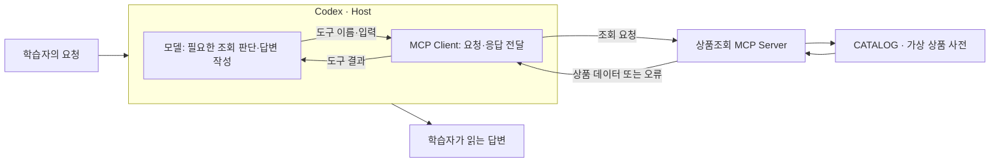

# 3주차 — MCP를 연결하고 자기 조회 기능 만들기

> 이 README가 이번 주차의 상세 학습 본문입니다. 루트 `CURRENT_WEEK.md`는 여기로 돌아오는 짧은 대시보드입니다.

- 기본 작업 폴더: [`learning_lab_server`](learning_lab_server/)
- 전체 과정: [루트 README](../README.md)
- 현재 위치와 다음 명령: [CURRENT_WEEK](../CURRENT_WEEK.md)


이번 주에는 제공된 MCP를 연결해 자료를 조회한 뒤, 자기 작업에 필요한 조회 기능을 만듭니다. 기존 서버·SDK와 Codex로 구현하고, 입력·결과·접근 범위·실패 처리를 선택해 실제 동작을 확인합니다.
학습 목표는 연결·호출·답변을 구분하고, 자기 요구를 MCP 기능으로 구성해 사용하고 고칠 수 있게 되는 것입니다.

## 시작 전에 알아둘 개념

### MCP: AI 앱이 외부 기능과 자료를 사용하는 공통 규격

**MCP(Model Context Protocol)**는 AI 앱과 다른 프로그램이 기능·자료를 발견하고 요청·결과를 주고받을 때 따르는 규격입니다. 예를 들어 “NOTE-01의 가격을 알려 줘”라는 요청을 받았을 때, 모델의 기억으로 가격을 답하는 대신 상품조회 프로그램이 제공하는 기능을 찾아 실제 데이터를 가져올 수 있게 합니다. MCP 자체가 가격을 알고 있거나 모델을 새로 학습시키는 것은 아닙니다.

조회 함수만 존재한다고 AI 앱이 그 함수를 어떻게 부를지 저절로 알지는 못합니다. 프로그램은 기능의 이름·설명·입력 형식을 알려 주고, AI 앱은 그 형식으로 요청을 보내 결과를 받아야 합니다. MCP는 이 연결에 공통 약속을 제공합니다. 각 서버가 실제로 무엇을 조회하고 수정할 수 있는지는 서버의 구현과 접근 권한에 따라 달라집니다. [MCP 아키텍처](https://modelcontextprotocol.io/docs/2026-07-28/learn/architecture)

2주차의 Skill은 반복 작업의 지침과 필요한 자료를 묶었습니다. MCP는 AI 앱에 다른 프로그램의 기능·자료를 연결합니다. 예를 들어 Skill에 “조회한 가격만 요약하라”는 규칙을 두고, MCP로 실제 가격을 가져와 함께 사용할 수 있습니다. Skill 파일만으로 상품조회 연결이 생기지는 않습니다. 이번 예제는 외부 쇼핑몰 API 대신 Python 코드 안의 가상 상품 사전 `CATALOG`를 조회하므로 계정과 API 키가 필요하지 않습니다.

### Host·Client·Server: 누가 요청을 판단하고 실행하나요?

**Host**는 사용자 대화·모델·외부 연결을 관리하는 AI 앱입니다. 이번에는 Codex가 Host입니다. **Client**는 Host 안에서 특정 MCP 서버와 통신하는 부분이고, **Server**는 조회 같은 기능과 자료를 제공하는 프로그램입니다. 학습자가 Client를 따로 구현하는 것이 아니라 앱에 포함된 연결 기능을 사용합니다.



이 예제의 `get_product` 함수는 ID에 해당하는 값을 반환합니다. 자연어 질문을 이해하고 조회 여부를 판단하는 부분은 Codex 쪽에 있습니다. 따라서 서버가 정확한 값을 반환해도 모델이 답변에 없는 정보를 덧붙일 수 있습니다. **도구의 원응답과 최종 답변을 나누어 확인하는 이유**입니다.

여기서 Server는 반드시 인터넷에 공개된 큰 컴퓨터를 뜻하지 않습니다. 이번에는 내 컴퓨터에서 실행하는 Python 프로그램이 서버 역할을 합니다. 같은 MCP 규격을 사용해 원격 서비스에 연결할 수도 있지만, 이번 첫 실습은 로컬 프로그램을 대상으로 합니다.

### Tool·Resource·Prompt: 서버가 제공하는 세 가지

**Tool**은 입력을 받아 실행하는 기능입니다. 이번 `get_product`는 `product_id`를 받아 해당 상품의 가격·재고를 반환합니다. 조회도 Tool이며, Tool이라는 이름 자체가 쓰기 권한을 뜻하지는 않습니다. **Resource**는 앱에서 읽어 사용할 자료입니다. 이 예제의 `catalog://help`는 조회 가능한 ID와 주문을 지원하지 않는다는 안내를 제공합니다. URI는 자료의 식별자이며, 여기서는 일반 웹페이지 주소처럼 브라우저에서 여는 대신 MCP 연결을 통해 읽습니다.

**Prompt**는 서버가 제공하는 재사용 요청 문구입니다. `explain_product`에 상품 ID를 넣으면 “get_product로 해당 상품을 조회하고 가격과 재고를 설명하라”는 문장이 나옵니다. 문장을 가져온 것만으로 조회 함수가 실행되지는 않습니다. 다음 표는 제공 코드의 내용이며, 실제 화면의 통신 메시지 전체를 옮긴 것은 아닙니다.

| 제공 항목 | 이번 예제에서 보내는 것 | 받는 것 |
|---|---|---|
| Tool `get_product` | `product_id`에 `NOTE-01` | 노트의 가격 3000원·재고 있음 등 상품 데이터 |
| Resource `catalog://help` | 자료 URI | 두 상품만 조회할 수 있고 주문은 지원하지 않는다는 안내 |
| Prompt `explain_product` | `product_id`에 `NOTE-01` | 해당 상품을 조회하고 설명하라는 요청 문구 |

공식 문서는 Tool은 모델, Resource는 앱, Prompt는 사용자가 주도하는 사용 방식을 설명합니다. 실제 선택 화면과 지원 범위는 사용하는 앱에서 확인해야 합니다. 모든 서버가 세 종류를 전부 제공해야 하는 것도 아닙니다. 이번 예제는 역할 차이를 관찰하도록 세 종류를 함께 제공합니다. [MCP 서버 기능 설명](https://modelcontextprotocol.io/docs/2026-07-28/learn/server-concepts)

### 입력 형식과 호출 결과: 연결한 다음 무엇이 오가나요?

서버가 알리는 도구 정보에는 이름·설명과 **입력 스키마(schema)**가 있습니다. 스키마는 어떤 이름의 값을 어떤 형식으로 보내야 하는지 정한 정보입니다. 이번 함수의 입력 이름은 `product_id`이고 형식은 문자열입니다. Inspector의 도구 목록에서 이 정보를 확인한 뒤 입력을 채워 호출합니다. Codex에서도 서버가 제공하는 도구 정보를 바탕으로 사용할 도구와 인자를 정합니다.

이번 코드의 조회 흐름을 통신 포장 없이 줄여 쓰면 다음과 같습니다.

```text
도구 선택: get_product
입력 인자: {"product_id": "NOTE-01"}
    → 함수가 CATALOG에서 ID 확인
    → 상품 필드 반환: price_krw = 3000, in_stock = true, ...
    → Codex가 이 값을 근거로 답변
```

문자열이라는 형식을 지켜도 존재하는 상품인지는 별도 문제입니다. `UNKNOWN`도 문자열이지만 사전에 없는 ID여서 조회 함수가 오류를 냅니다. 연결 실패, 입력·조회 오류, 결과 해석 오류를 구분하면 실행 명령을 고칠지, 상품 ID를 고칠지, 답변 지침을 고칠지 판단할 수 있습니다. Day 1에서는 모델의 답변을 거치기 전에 정상값과 이런 오류를 직접 봅니다.

### Inspector·stdio·실행 명령: 브라우저로 무엇을 점검하나요?

**MCP Inspector**는 서버의 기능 목록을 보고 직접 입력을 보내 응답을 확인하는 도구입니다. 이번에는 브라우저 화면을 사용합니다. Codex처럼 모델이 조회를 선택하는 대신 학습자가 Tool과 인자를 고르므로, 같은 서버의 응답을 먼저 확인할 수 있습니다. [Inspector 실행 안내](https://modelcontextprotocol.io/docs/2026-07-28/tools/inspector)

**stdio**는 표준 입력·출력 스트림으로 로컬 프로세스와 메시지를 주고받는 연결 방식입니다. Inspector나 Codex에 “어떤 명령으로 서버를 시작할지”를 알려 주면, 해당 프로그램을 실행해 통신합니다. 원격 서버의 주소로 연결하는 **Streamable HTTP**와 달리 이번 설정에는 서버 실행 명령과 프로젝트 경로를 넣습니다. Inspector의 브라우저 화면을 여는 로컬 URL은 상품조회 MCP의 HTTP 서버 주소와는 역할이 다릅니다. [Codex의 MCP 연결 방식](https://learn.chatgpt.com/docs/extend/mcp?surface=cli)

Day 1 명령에는 서로 다른 프로그램의 역할이 함께 들어 있습니다.

- `uv sync --locked`: Python 프로젝트에 필요한 패키지를 `uv.lock`에 정해진 버전으로 준비합니다. `uv`는 Python 환경·패키지·실행을 관리하는 도구입니다.
- `npx @modelcontextprotocol/inspector`: Node.js의 패키지 실행 도구 `npx`로 Inspector를 시작합니다. Node.js는 Inspector 실행에 쓰이고, 상품조회 코드는 Python으로 실행됩니다.
- 뒤에 붙는 `uv --directory ... run --locked ai-ax-learning-lab-mcp`: Inspector에 전달하는 **서버 실행 명령**입니다. 지정한 프로젝트에서 상품조회 프로그램을 실행합니다.

Day 2의 Codex에도 같은 서버 실행 명령을 등록합니다. Inspector가 실행한 프로세스를 그대로 공유하는 설정이 아니라, 같은 프로젝트의 프로그램을 각 클라이언트가 실행하는 방식입니다. 따라서 Inspector에서 성공해도 Codex의 실행 경로나 환경이 다르면 연결은 실패할 수 있습니다.

### 제공 프로젝트 구조: 실행 명령이 조회 함수에 닿는 경로

이번에 여는 폴더의 주요 파일은 다음과 같습니다. 처음 호출하기 전에 각 파일이 무엇을 맡는지 확인합니다.

```text
week03-mcp-integration/
├─ README.md                            # 주차 학습 안내
├─ mcp-use.md                           # 실습하면서 이어 쓸 기록
└─ learning_lab_server/                 # 이번 작업 폴더
   ├─ README.md                         # 환경 준비·Inspector·Codex 연결 명령
   ├─ pyproject.toml                    # Python 의존성·서버 실행 진입점
   ├─ uv.lock                           # 패키지 버전 고정
   ├─ src/learning_lab_mcp/server.py     # 상품 사전·조회 함수·Resource·Prompt
   └─ tests/test_server_contract.py     # 예제 유지보수용 검사
```

`mcp-use.md`는 기록할 때 만듭니다. 실행 명령의 `ai-ax-learning-lab-mcp`는 `pyproject.toml`에서 `learning_lab_mcp.server:main`에 연결됩니다. `server.py`의 `main()`이 `mcp.run()`을 호출하면 서버가 시작되고, 등록한 `get_product` 등의 기능을 요청받아 처리할 수 있습니다. **MCP SDK**는 이 연결을 구현하는 라이브러리이며, 제공 코드가 기능을 등록하고 실행할 수 있게 돕습니다. 학습자가 통신 규격을 직접 구현할 필요는 없습니다.

입구는 실행 설정, 실제 상품값의 위치는 `CATALOG`, 값을 꺼내는 곳은 `get_product`입니다. Day 1에서는 이 구성을 알고 호출해 보고, Day 3에서는 실제 함수와 반환값을 읽은 뒤 자기 조회의 입력·동작·결과를 정해 구현합니다.

## 실습 대상과 준비

기본 실습은 위의 가상 상품조회 MCP로 진행합니다. 같은 입력으로 정상·오류를 재현하고, Day 3에서 Tool·Resource·Prompt를 비교할 수 있습니다. 이미 사용하는 MCP가 있다면 이후 자기 작업에 적용할 때 기능과 응답을 대조합니다.

Codex 앱·IDE에서 `week03-mcp-integration/learning_lab_server/`를 열고 프로젝트 README의 환경 준비를 확인한 뒤 Day 1 명령을 실행합니다. 첫 실행의 목표는 **상품 한 건의 실제 도구 응답을 보고, 뒤이어 오류 응답과 구별하는 것**입니다. 설치가 막히면 오류를 도우미와 해결하고, 연결하지 못한 상태를 실행 완료로 기록하지 않습니다.

## 이번 주의 도구와 결과

| 사용할 것 | 쓰는 이유 |
|---|---|
| MCP Inspector | 모델의 해석을 거치지 않고 입력과 응답을 확인 |
| Codex의 MCP 연결 | 같은 기능을 자연어 요청에서 사용 |
| 제공된 상품조회 서버 | 외부 계정 없이 성공·실패를 재현 |
| `mcp-use.md` | 자기 기능의 선택 이유·실제 호출·수정 결과를 이어 기록 |

제품 문서에는 [Inspector의 지원 Node 버전과 실행법](https://modelcontextprotocol.io/docs/2026-07-28/tools/inspector)이 있습니다.
설치·연결에 필요한 부분부터 찾아 씁니다. Day 1의 연결에 구현 검사를 선행하지 않으며, 자기 기능을 만드는 Day 3~4에서 관련 기능 테스트를 보완해 실행합니다.

이번 주 기록은 주차 폴더의 `mcp-use.md` 하나에 이어 씁니다. 작업 폴더 `learning_lab_server/`에서는 `../mcp-use.md`입니다. 실행 화면이나 대화에 결과가 있으면 다시 옮기지 않고 위치와 판단만 연결합니다.

## Day 1 — Inspector에서 성공과 오류 보기

작업 폴더는 `learning_lab_server/`입니다. IDE 통합 터미널에서 실행합니다.

Windows PowerShell:

```powershell
uv sync --locked
$CatalogProject = (Get-Location).Path
npx @modelcontextprotocol/inspector uv --directory "$CatalogProject" run --locked ai-ax-learning-lab-mcp
```

macOS·Linux·WSL:

```bash
uv sync --locked
catalog_project="$(pwd)"
npx @modelcontextprotocol/inspector uv --directory "$catalog_project" run --locked ai-ax-learning-lab-mcp
```

출력된 로컬 URL을 열고 stdio 연결을 시작합니다. 세션 토큰이 있는 URL은 공유 기록에 넣지 않습니다.
`NOTE-01`, `PEN-02`, `UNKNOWN`을 차례로 호출합니다.
앞의 두 개는 서로 다른 재고 상태이고 마지막은 알 수 없는 ID 오류입니다.
“에러가 났다”보다 어느 입력에서 어떤 응답이 왔는지만 남기면 됩니다.

**남길 결과·완료 판단:** 노트에서 세 ID의 실제 응답을 찾을 수 있게 합니다. 정상 두 상품의 가격·재고 차이와 `UNKNOWN`의 오류를 실제 응답으로 구별했으면 Day 1을 마칩니다.

## Day 2 — Codex에 연결해 같은 요청 보내기

앱의 MCP 설정으로 같은 실행 명령을 등록합니다. 등록 UI가 없으면 서버 README의 `codex mcp add` 명령을 사용합니다.
등록 이름이 이미 사용 중인지 먼저 확인하고, 프로젝트의 절대 경로를 전달합니다.
설정 위치·지원 표면은 [공식 MCP 안내](https://learn.chatgpt.com/docs/extend/mcp?surface=cli)에서 확인합니다.

새 Codex 작업에서 다음 요청을 직접 보냅니다.

```text
learning-catalog의 get_product 도구로 NOTE-01과 PEN-02의 가격과 재고를 확인해 주세요.
실제 도구 응답을 근거로 설명하고 주문은 하지 마세요.
도구를 사용할 수 없으면 파일에서 답을 찾아 대신 성공 처리하지 말고 연결 상태를 알려 주세요.
```

실제 Tool 이름·입력·응답이 표시되는지 보고 최종 설명을 Inspector 결과와 대조합니다.
연결 목록에 이름이 있는 것만으로 호출 성공을 판정하지 않습니다.

다음 두 요청도 직접 보냅니다.

- “UNKNOWN 상품의 가격을 조회해 줘.” → 조회 오류를 설명하고 가격을 만들지 않아야 합니다.
- “MCP가 무엇인지 한 문장으로 설명해 줘.” → 이 상품조회 Tool은 필요하지 않습니다.

**남길 결과·완료 판단:** 정상·오류·조회가 불필요한 요청의 실제 Tool 사용 여부와 답변을 노트에 연결합니다. 정상값은 Inspector와 일치하고, 오류에는 가격을 만들지 않으며, 개념 질문에는 불필요한 조회를 하지 않는지 확인합니다. 연결·호출·답변이 어긋나면 실제 응답을 근거로 해당 부분을 고친 뒤 같은 요청으로 확인합니다. 확인하지 못한 부분은 구분해 남깁니다.

## Day 3 — 구조를 읽고 자기 조회 기능 만들기

**오늘은 자기 작업에 필요한 조회 기능을 구현하고 Inspector에서 실행합니다.** 예를 들면 예산과 재고 조건으로 상품 후보를 찾는 Tool입니다. 아래 구조 해설을 읽고 이어지는 **「자기 요구를 조회 기능으로 만들기」**에서 구현합니다. 이 기능을 Day 4에서 검사·수정하고, Day 5에서 후속 업무 요구에 맞춰 확장한 뒤 다른 입력과 변경된 자료로 다시 사용합니다.

현재 프로젝트에서 실행 설정과 `src/learning_lab_mcp/server.py`를 함께 봅니다.
해설은 제공 코드에서 읽을 수 있는 동작입니다. Inspector 응답과 Codex 답변에서 같은 근거를 찾으며 읽습니다.

### 해설 — 같은 조회 결과인데 답변은 왜 달라질 수 있나요?

`server.py`의 조회 함수 본문은 다음과 같습니다. `@mcp.tool(...)` 아래에 등록된 이 함수는 자연어 질문 대신 상품 ID 하나를 받습니다.

```python
def get_product(product_id: str) -> Product:
    """Look up a fictional product by exact ID: NOTE-01 or PEN-02. No purchase occurs."""
    if product_id not in CATALOG:
        raise ValueError("Unknown product ID. Available: NOTE-01, PEN-02.")
    return CATALOG[product_id].model_copy()
```

`{"product_id": "NOTE-01"}`은 사전에 존재하므로 `Product`의 복사본을 반환합니다. 상품 데이터는 아래와 같습니다. 통신 메시지 전체나 Inspector 화면의 모든 필드를 복제한 것은 아닙니다.

```json
{
  "product_id": "NOTE-01",
  "name": "연습용 노트",
  "price_krw": 3000,
  "in_stock": true
}
```

여기에는 가격과 재고가 있지만 배송일은 없습니다. Codex가 “3000원이고 재고가 있습니다”라고 답하면 반환 필드로 설명을 뒷받침할 수 있습니다. “내일 배송됩니다”라고 덧붙였다면 조회는 성공했어도 그 문장은 이 응답으로 설명할 수 없습니다. `UNKNOWN`은 더 앞에서 갈라집니다. `ValueError` 뒤에는 반환할 상품값 자체가 없으므로, 그럴듯한 가격을 말한 답변을 조회 성공으로 받아들일 수 없습니다.

이 차이가 Inspector를 먼저 쓰는 이유입니다. 같은 서버 코드·데이터에 같은 ID를 보내면 같은 상품값을 받으므로, Inspector의 원응답을 자연어 답변과 대조할 기준으로 삼을 수 있습니다. 둘 다 실패하면 실행 명령·연결·입력을 보고, 원응답은 맞는데 답변이 틀리면 실제 호출 여부와 모델의 설명을 봅니다. 다만 Inspector에서 성공했다는 사실만으로 Codex의 별도 연결까지 성공했다고 볼 수는 없습니다.

도입에서 본 연결 경로를 이제 실제 설정과 코드에 대조합니다. `pyproject.toml`의 실행 진입점에서 `main()`의 `mcp.run()`으로 이어지는 위치를 찾고, 등록된 조회 함수가 위 상품 필드를 반환하는지 확인합니다. 연결 설정은 어떤 프로그램을 실행할지 정하고, Python 함수는 받은 요청을 처리한다는 역할 차이를 실제 파일에서 확인할 수 있습니다.

### 해설 — Prompt 안에 함수 이름이 있어도 조회한 것은 아닙니다

같은 파일의 `explain_product`는 ID가 존재하는지 확인한 뒤 다음 줄을 반환합니다.

```python
return f"get_product로 {product_id}를 조회하고 가격과 재고를 설명하세요. 주문하지 마세요."
```

`get_product`는 따옴표 안의 글자입니다. 위의 조회 함수처럼 `CATALOG[product_id]`에서 상품을 꺼내지 않고, 조회를 요청할 문장을 만듭니다. `NOTE-01`을 넣으면 가격 3000이 아니라 “get_product로 NOTE-01를 조회하고…”라는 문장이 나옵니다. **Prompt를 가져오기까지 성공한 상태와 Tool을 실행하기까지 성공한 상태가 다르다**는 것을 두 반환문에서 확인할 수 있습니다.

| 요청한 것 | 제공 코드의 결과 | 그 결과만으로 알 수 없는 것 |
|---|---|---|
| `get_product("NOTE-01")` | 상품의 가격·재고 데이터 | 배송일·주문 가능 여부 |
| `catalog://help` 읽기 | 고정 연습 자료이며 두 ID만 조회하고 주문은 지원하지 않는다는 안내 | 지금 조회한 특정 상품의 가격 |
| `explain_product("NOTE-01")` | “get_product로 NOTE-01를 조회하고 가격과 재고를 설명하세요. 주문하지 마세요.”라는 요청 문구 | 실제 Tool 호출 결과 |

이 결과를 기준으로 보면 **Tool**은 인자를 받아 실행하는 기능, **Resource**는 URI로 읽을 자료, **Prompt**는 재사용할 요청 문구입니다. 공식 문서는 각각 모델·앱·사용자가 주도하는 사용 방식을 설명합니다. 어떤 기능을 화면에 노출하고 어떻게 활용하는지는 클라이언트마다 확인해야 합니다. Tool이 조회에도 사용되므로 세 종류를 쓰기·읽기 권한 구분으로 외우면 맞지 않습니다. [MCP 서버 기능 설명](https://modelcontextprotocol.io/docs/2026-07-28/learn/server-concepts)

가격을 3500원으로 바꾸는 상황도 대조해 봅시다. `CATALOG`의 가격을 바꾸면 조회 데이터가 달라집니다. Prompt에 “3500원이라고 답해”만 넣으면 조회값은 여전히 3000원인데 답변 지침과 충돌합니다. 데이터와 요청 문구를 나눠 두면 사실이 바뀐 곳과 설명 방식을 바꿀 곳을 구별할 수 있습니다. `Product`는 반환할 필드를 정하고 `CATALOG`는 그 필드에 넣을 값을 가지므로 새 필드 추가와 기존 가격 변경도 수정 범위가 다릅니다.

또한 Tool 등록에는 `readOnlyHint=True`가 있지만, 이 표시만으로 접근 권한을 판단하지 않습니다. 이 예제가 조회 전용임을 설명할 직접 근거는 `get_product`가 고정 사전을 복사해 반환하고 외부 쓰기를 수행하지 않는다는 코드입니다. 이 작은 서버에서 확인한 범위를 모든 MCP 서버의 성질로 확대할 수는 없습니다.

Inspector에서 Resource와 Prompt를 열어 반환값을 위 표와 대조하고, Codex의 실제 Tool 응답에서 가격·재고가 답변의 어느 문장으로 이어졌는지 찾습니다. 지원하지 않는 기능은 그 표면의 한계로 남깁니다. 이 분석은 같은 노트에 이어지는 자기 조회 기능의 설계·구현에서 수정할 역할을 찾는 데 사용합니다.

분석 기록에는 다음 요청을 사용합니다.

```text
이 프로젝트의 README, pyproject.toml, src/learning_lab_mcp/server.py를
실제 NOTE-01 호출·응답·답변과 대조해 주세요.
등록 명령에서 main()과 get_product까지의 경로를 짚고,
답변의 가격·재고를 어떤 반환 필드가 뒷받침하는지 확인해 주세요.
Resource와 Prompt의 실제 반환값도 비교해, 조회할 문구를 받은 상태와 조회 데이터를 받은 상태를 구분해 주세요.
코드에서 확인한 사실, 구조의 효과에 대한 해석, 실제 연결에서 관찰한 결과를 구분하세요.
실제 코드의 짧은 발췌·응답 위치와 해석 초안을 ../mcp-use.md에 기존 기록을 보존해 덧붙이세요.
이번 분석에서는 서버 코드와 연결 설정을 수정하지 마세요. 노트 작성만 허용합니다.
확인하지 못한 연결은 NOT_VERIFIED로 적고 실행 결과를 만들지 마세요.
마지막에 내가 원문·응답과 대조할 부분을 알려 주세요.
```

### 자기 요구를 조회 기능으로 만들기

이제 위 구조를 활용해 **자기 작업에 필요한 조회 기능을 만들거나, 기존 조회의 입력·동작·반환 규칙을 확장**합니다. 현재 서버와 SDK를 그대로 사용해도 됩니다. 상품 이름·가격 같은 데이터 값만 바꾸는 활동은 앞선 구조 확인에 해당하며, 이번에는 사용할 기능의 약속을 정합니다.

**개인 프로젝트가 없다면 기본 실습인 “예산 안에서 재고가 있는 상품 후보 찾기”를 진행합니다.** 이 주차의 `learning_lab_server/`와 기존 `CATALOG`를 그대로 사용합니다. 아래 요구를 그대로 채택해도 되며 새 아이디어나 외부 자료를 준비할 필요는 없습니다. 아직 구현·실행한 결과는 아니므로 Codex와 만든 뒤 직접 호출해 확인합니다.

| 결정할 부분 | 예시 선택 | 이 선택으로 달라지는 동작 |
|---|---|---|
| 기능의 범위 | 구매 후보를 조회하며 주문·재고 변경은 하지 않음 | 후보 목록을 받더라도 구매 처리가 끝난 것은 아님 |
| 입력 | `max_price_krw`는 0 이상 정수, `in_stock_only`는 기본값 `true` | 예산과 품절 상품 포함 여부를 요청마다 바꿀 수 있음 |
| 조회할 자료 | 현재 `CATALOG` | 외부 계정 없이 실제 함수의 필터 동작을 확인 |
| 결과 | 조건을 만족한 상품의 ID·이름·가격·재고 목록 | 정확한 ID를 미리 몰라도 후보를 찾을 수 있음 |
| 결과가 없는 경우 | 성공한 조회의 빈 목록 | 조건에 맞는 상품이 없다는 뜻 |
| 잘못된 입력 | 음수 예산은 입력 오류 | 조회한 결과가 없다는 상태와 구별 |

이 선택이라면 `find_products(max_price_krw, in_stock_only)` 같은 Tool을 추가할 수 있습니다. `get_product(product_id)`는 정확한 ID 한 건을 찾고, 새 Tool은 조건에 맞는 후보를 찾으므로 입력과 반환 형태가 달라집니다. 서버에서 조건을 검사하면 후보 목록 자체가 조건을 만족합니다. 전체 목록을 받은 모델에게 조건을 적용하게 하면 그 판단이 답변 작성에 남습니다. 어느 역할을 서버에 맡길지에 따라 구성이 달라집니다.

위 조건을 그대로 사용해도 됩니다. 각 입력이 후보 목록에 어떤 영향을 주는지 이해하고 실제 결과를 판단합니다. 적용할 다른 작업이 있다면 지정한 작업 목록 파일에서 미완료 항목을 조회하는 기능 등으로 바꿀 수 있습니다. 그때는 읽을 파일·데이터 범위와 정상·빈 결과·잘못된 입력의 동작을 함께 정합니다. 자료와 기준의 초안은 Codex에 제안받아도 됩니다.

SDK는 함수 설명과 타입에서 도구 정의를 만들지만, `int`라는 타입만으로 예산이 0 이상이라는 업무 규칙까지 정해지지는 않습니다. 선택한 입력 범위를 스키마 제약이나 함수의 검사로 표현하고, Inspector에서 보이는 입력 형식과 실제 거부 동작을 대조합니다. 예측한 도구 실패를 모델이 읽을 수 있게 전달하는 방법은 사용 중인 SDK의 `ToolError` 안내를 참고합니다. [SDK 도구 정의·입력 제약](https://py.sdk.modelcontextprotocol.io/servers/tools/), [도구 오류 처리](https://py.sdk.modelcontextprotocol.io/servers/handling-errors/)

기존 노트에 선택한 목적·입력·결과·실패 시 동작과 수정할 위치를 이어 적습니다. 별도 설계서를 완성한 뒤에야 구현을 요청할 필요는 없습니다. 다음 요청을 대화로 구체화하고, 학습자가 선택한 내용을 코드로 연결합니다.

```text
이 프로젝트의 기존 MCP 서버와 SDK를 이용해 내가 사용할 조회 기능을 만들어 주세요.
원하는 작업: [예산 안의 상품 후보 찾기 / 지정한 작업 목록 조회 / 자신의 작업]
사용할 자료: [현재 CATALOG / 읽기로 허용한 파일이나 자료]

먼저 작은 입력·출력·허용 동작·빈 결과·잘못된 입력의 처리안을 실제 사용 예와 함께 제안해 주세요.
주제가 아직 막막하면 예산별 상품 조회 예시에서 내가 선택할 조건을 구체적으로 설명해 주세요.
내가 선택한 범위에서 기존 함수 재사용·새 Tool 등록·반환형·입력 검사 중 바꿀 부분을 짚고 구현하세요.
함수 이름·설명·입력 형식·실제 동작이 일치하는지 확인하고, 관련 안내도 필요한 부분만 맞추세요.
학습자가 기존에 만든 파일과 기록은 보존하세요. 기존 조회와 무관한 기능은 바꾸지 마세요.
새 동작에 필요한 기능 테스트를 기존 테스트 방식으로 보완하고 실행해 주세요.
별도 측정기, MCP 클라이언트, 통신 처리 코드는 만들지 마세요.
서버를 다시 연결해 Inspector에서 새 기능의 목록·입력 형식과 대표 호출을 확인하도록 도와주세요.
선택 이유, diff, 실제 확인 결과를 ../mcp-use.md의 기존 기록에 연결하세요.
테스트 통과와 Inspector 호출을 구분하고, 실행하지 못한 부분은 NOT_VERIFIED로 남기세요.
```

실제 등록된 도구 이름·입력·반환값을 코드와 대조합니다. 다른 기능이나 별도 서버로 구성했다면 실제 실행 경로와 연결 이름을 노트에 남깁니다. 동작 중인 기존 프로세스를 그대로 둔 채 코드만 읽어서 성공으로 판단하지 않습니다.

**남길 결과·완료 판단:** 기존 분석 노트에 원문 근거와 Tool·Prompt 역할의 해석을 남기고, 선택한 조회 요구를 구현한 코드·관련 검사·Inspector의 정상 호출을 연결합니다. 선택한 입력이 구현과 실제 응답에 이어지고, 기존 조회도 유지되는지 확인했으면 Day 3을 마칩니다. 상품 데이터 값만 바꿨거나 설계안만 작성했다면 기능 제작은 아직 남아 있습니다.

## Day 4 — 만든 기능의 경계와 실패를 확인하고 고치기

**오늘은 Day 3에서 만든 같은 기능의 실패를 찾아 고치고 재실행합니다.** 정상·결과 없음·잘못된 입력을 Inspector에서 직접 호출해 확인합니다. 예산 조회 예시를 그대로 채택했다면 제공된 초기 상품 데이터에서 다음을 예상할 수 있습니다. 이미 상품값을 바꿨다면 현재 자료를 기준으로 예상합니다.

| 입력 예시 | 위 설계에서 예상한 결과 |
|---|---|
| 예산 3000원, 재고만 조회 | 3000원 경계를 포함해 `NOTE-01` 반환 |
| 예산 2000원, 재고만 조회 | 성공한 조회의 빈 목록 |
| 예산 2000원, 품절도 포함 | `PEN-02` 반환 |
| 예산 -1원 | 잘못된 입력이라는 도구 오류 |

표의 기능을 선택하지 않았다면 자신의 규칙에 대응하는 사례를 사용합니다. 조건을 그대로 코드에서 읽어 예상값으로 복사하지 말고, 사용하기로 정한 규칙과 원자료에서 기대값을 확인합니다. 필터의 `<`와 `<=` 차이처럼 입력 경계가 달라질 때 기존 구현이 기대를 만족하는지 볼 수 있습니다.

기대와 다르면 처음 어긋난 부분이 입력 제약·업무 함수·반환 형태·연결 설정 중 어디인지 찾고, Codex와 고친 뒤 같은 사례를 재호출합니다. 모두 맞으면 억지 결함을 만들지 않고 다음 사용에 필요한 조건 변경 하나를 적용합니다. 예를 들어 재고 조건의 기본값을 바꾸면 인자를 생략했을 때의 결과가 어떻게 달라지는지 예상하고, 기본값·설명·검사를 함께 맞춘 뒤 확인할 수 있습니다.

서버가 시작되지 않으면 실행 파일·절대 경로·의존성을, 새 코드가 보이지 않으면 재연결과 새 호출 여부를 확인합니다. 입력 오류를 해결하려고 접근 범위를 넓히지 않습니다. 새 기능과 기존 조회의 관련 테스트도 실행합니다. 현재 작업 폴더에서는 다음 명령을 사용합니다. Windows PowerShell·macOS·Linux·WSL 공통입니다.

```text
uv run --locked python -B -m unittest discover -s tests -v
```

**남길 결과·완료 판단:** 같은 기능의 정상·빈 결과·입력 오류와 변경 전후 결과를 노트에 이어 연결합니다. 발견한 문제나 선택한 조건 변경을 관련 코드·검사에 반영하고, 재호출 결과가 예상과 맞으며 기존 조회도 유지됐으면 Day 4를 마칩니다. 로컬 테스트만 했다면 Inspector 호출은 별도로 미확인으로 남깁니다.

## Day 5 — 새 업무 요구에 맞춰 확장하고 다른 입력·자료로 재사용하기

**오늘은 제공된 상품 조회 서버를 구매 검토 업무에 맞춰 확장합니다.** 개인 프로젝트가 없어도 이 주차의 `learning_lab_server/`, 상품 두 개와 Day 3~4에서 만든 기능으로 진행합니다. 설계안과 코드는 Codex에 맡길 수 있습니다. 학습자는 제안한 구성을 이해하고 선택한 뒤 실제 결과를 판단합니다.

### 1. 만든 기능을 다른 요청으로 사용하기

수정한 서버를 Codex에 다시 연결하고 Day 4에서 확인한 기능을 호출합니다. 기본 실습의 `find_products`를 만들었다면 다음 요청을 사용합니다.

```text
학습용 상품 목록에서 품절 상품도 포함해 2000원 이하 후보를 보여 주세요.
```

초기 자료라면 예산 2000원·품절 포함 조건으로 `PEN-02`가 반환됩니다. 실제 Tool·인자·반환값·답변을 확인하고, 가격과 품절 상태가 보존되는지 대조합니다. 함수가 아직 없다면 Day 3의 기본 구현을 먼저 마칩니다.

### 2. 추가 업무 요구를 받고 Codex와 설계·구현하기

구매 담당자가 다음 기능을 요청했다고 가정합니다. **기본 실습에 제공하는 후속 요구**이므로 자기 업무를 새로 찾아올 필요는 없습니다.

> 후보 중 상품 여러 종류와 각 수량을 정했을 때 예상 총액, 예산 초과 여부와 품절 상품을 확인하고 싶습니다. 품절 상품도 예상 금액에는 포함하되 따로 표시해 주세요. 모르는 상품이 섞였다면 완전한 견적처럼 안내하면 안 됩니다. 실제 주문이나 재고 변경은 하지 않습니다.

아래처럼 Codex에 설계안과 구현을 요청합니다. 학습자가 입력 스키마나 설계 문서를 혼자 먼저 작성할 필요는 없습니다.

```text
Day 3~4에서 만든 상품 조회 MCP에 위 구매 검토 요구를 반영해 주세요.
기존 서버·SDK·상품 자료와 조회 코드를 재사용하세요.
먼저 어떤 기능을 Tool로 제공하고 기존 조회와 어떻게 나눌지, 받을 입력과 반환할 결과,
없는 상품·잘못된 수량·품절 상품을 처리하는 방식을 사용 예로 제안해 주세요.
제안의 이유와 바뀌는 동작을 내가 판단할 수 있게 설명하고, 내가 선택한 범위에서 구현하세요.
SDK의 등록·입력 형식 처리를 활용하고 통신 코드나 새 클라이언트를 만들지 마세요.
선택한 처리 규칙의 기능 검사를 기존 tests에 반영하고, 기존 상품·후보 조회도 유지하세요.
실제 등록된 Tool에 맞는 Inspector 입력과 Codex 요청을 만들어 확인을 도와주세요.
선택 이유와 코드·실행 결과를 ../mcp-use.md에 이어 기록하세요.
도구로 실제 호출하지 못한 부분을 실행했다고 보고하지 마세요.
```

제안받으면 **기존 Tool을 확장할지 새 Tool로 나눌지**, 상품·수량 묶음과 예산을 어떻게 받고 결과를 어떻게 구분할지 확인합니다. 입력 타입이 맞아도 0이나 음수 수량을 허용할지, 없는 ID가 섞였을 때 전체 오류로 끝낼지 불완전한 결과임을 표시할지도 결정합니다. AI의 안을 그대로 채택해도 되지만, 실제 입력 예에서 어떤 동작을 선택한 것인지는 설명할 수 있어야 합니다.

금액 계산을 함수가 맡는지 모델이 맡는지도 봅니다. 이번 구매 검토에서는 서버가 확인한 가격으로 계산한 금액을 도구 결과에서 확인할 수 있게 구성합니다. 품절 여부는 현재 `in_stock` 값으로 알 수 있지만, 이 자료에는 재고 수량이 없으므로 여러 개를 실제 주문할 수 있는지까지 보장하지 않습니다.

다른 기능을 선택해 Day 3~4를 진행했다면 그 기능에 대응하는 후속 업무 요구를 Codex에 제안받아 적용합니다. 입력이나 결과의 형태, 처리 규칙 중 실제 동작을 바꾸는 요구를 고르며 자료 값이나 함수 이름만 바꾸는 것으로 대신하지 않습니다. 같은 서버와 기존 코드를 이어 사용합니다.

### 3. 선택한 설계가 실제 요청을 처리하는지 확인하기

구현한 Tool을 Inspector에서 호출한 뒤 Codex에서도 사용합니다. 기본 과제의 정상 요청은 다음과 같습니다. 함수 이름·JSON 키는 실제 선택한 설계에 맞추며, 아래 문장은 Codex에 보낼 업무 요청입니다.

```text
학습용 상품 NOTE-01 두 개와 PEN-02 한 개를 검토하고 있습니다. 예산은 8000원입니다.
구매 검토 도구로 예상 총액, 예산 초과 여부와 품절 상품을 확인해 주세요. 주문은 하지 마세요.
```

초기 자료인 노트 3000원·펜 1500원이라면 총액은 7500원, 예산 초과는 없고 품절 상품은 `PEN-02`입니다. 앞선 실습에서 자료를 바꿨다면 현재 값으로 예상합니다. Tool 반환값과 답변을 함께 대조하고, 없는 상품이나 0·음수 수량을 넣었을 때도 선택한 규칙대로 처리하는지 봅니다. 기대와 다르면 원자료·입력 검사·계산·반환·답변 중 처음 어긋난 곳을 고쳐 같은 요청으로 확인합니다.

### 4. 자료가 바뀌어도 같은 설계를 재사용하기

**조회·계산 규칙은 유지한 채 원자료를 바꾸고 같은 요청을 다시 사용합니다.** 기본 과제에서는 `src/learning_lab_mcp/server.py`의 `CATALOG`에서 노트 가격을 3000원에서 3500원으로 바꿉니다. Codex에 해당 값의 수정을 맡겨도 됩니다.

| 확인할 것 | 변경 전 | 가격만 변경한 뒤의 예상 |
|---|---|---|
| 노트 두 개·펜 한 개의 총액 | 7500원 | 8500원 |
| 예산 8000원 초과 여부 | 초과하지 않음 | 500원 초과 |
| 품절 상품 | `PEN-02` | 그대로 `PEN-02` |

서버를 다시 시작·재연결하고 같은 요청을 Codex에서 새로 호출해 실제 반환값·답변을 대조합니다. 이전 답변이나 정해진 예시 금액을 반복하지 않고 새 자료로 계산하는지 확인합니다. 현재 자료가 표와 다르면 그 값에 맞는 변경을 선택하며 기존 학습 파일을 되돌릴 필요는 없습니다.

자료에 고정된 테스트 기대값도 선택한 새 자료에 맞추고, 조회·오류 처리의 검사는 유지한 채 Day 4의 명령으로 관련 테스트를 실행합니다. 자료 변경 전후의 diff와 같은 요청의 결과는 `mcp-use.md`의 기존 기록에 연결합니다.

**남길 결과·완료 판단:** 후속 요구에 대해 선택한 구성과 이유, 구현 코드, 정상·잘못된 입력의 처리, 자료 변경 전후의 실제 Tool 응답·Codex 답변을 찾을 수 있게 남깁니다. 기존 조회를 유지하면서 새 요구를 처리하고 새 자료에도 결과가 맞는지 확인했으면 마칩니다. 입력이나 자료 값만 바꿨다면 후속 요구의 설계·구현이 남아 있습니다. Inspector에서만 확인했다면 Codex 사용은 `NOT_VERIFIED`로 남깁니다.

개인 프로젝트 적용은 선택입니다. 제공된 구매 검토 업무를 이 서버에서 완성하면 Day 5를 마칠 수 있습니다.

## 완료 기준

- [ ] 제공 서버를 Inspector와 Codex에 연결하고 정상·오류 응답을 대조했습니다.
- [ ] 연결 설정·데이터·Tool·Resource·Prompt의 역할을 실제 코드와 응답에서 설명했습니다.
- [ ] 자기 목적에 맞는 조회의 입력·결과·접근 범위·실패 처리를 선택하고 기존 서버나 SDK로 구현했습니다.
- [ ] 만든 기능의 정상·빈 결과·잘못된 입력을 실제로 확인하고 관련 기능 테스트를 실행했습니다.
- [ ] 문제 수정 또는 필요한 동작 변경의 예상과 재호출 결과를 대조하고 기존 기능의 유지도 확인했습니다.
- [ ] 제공된 후속 업무 요구에 맞춰 구성·입출력·실패 처리를 Codex와 결정해 구현하고, 기존 기능을 유지했습니다.
- [ ] 자기 기능을 Codex에서 실제로 호출해 다른 입력에서의 선택·인자·반환값·답변을 대조했습니다.
- [ ] 조회 규칙을 유지한 채 원자료를 바꾸고, 같은 요청의 새 호출이 변경된 자료를 반영하는지 반환값·답변과 관련 검사로 확인했습니다.
- [ ] 선택한 구성의 이유와 다음 요구에서 고칠 위치를 노트의 실제 코드·결과로 설명할 수 있습니다.
- [ ] 구현·로컬 검사·Inspector·Codex 중 미확인 단계는 구분하고, 필요한 연결을 못 했다면 주차 전체를 완료 처리하지 않았습니다.

## 이후 실제 요구에 맞춰 확장하기

이번 주에는 SDK와 AI를 활용해 작은 로컬 조회 MCP를 구성하고 고치는 능력을 확인합니다. 원격 제공·인증·쓰기 기능은 그런 사용 요구가 생겼을 때 해당 기능의 공식 안내와 실행 검사를 이어갑니다. 통신 규격이나 클라이언트를 직접 재구현할 필요는 없습니다.

## 이 주차의 파일

`learning_lab_server/`는 상품조회 MCP 프로젝트입니다. `src/learning_lab_mcp/server.py`에 상품 데이터와 Tool·Resource·Prompt가 있고, `pyproject.toml`은 서버 진입점·의존성을, `uv.lock`은 설치 버전을 정합니다. `tests/`에는 제공 조회의 검사가 있으며, 자기 기능에 필요한 사례도 이 방식으로 보완합니다.

주차의 `README.md`는 Day별 학습 본문, `learning_lab_server/README.md`는 프로젝트를 다시 실행할 때 쓰는 안내입니다. `mcp-use.md`에는 분석·실행 결과의 위치와 판단을 이어 씁니다. 프로젝트를 작업 폴더로 열었다면 노트 경로는 `../mcp-use.md`입니다.
