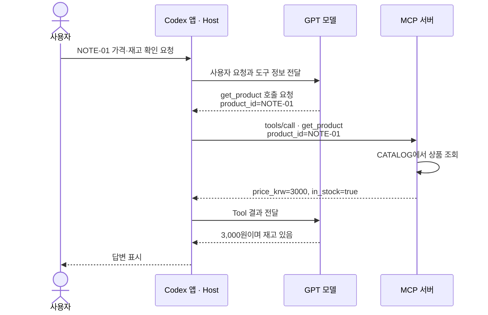
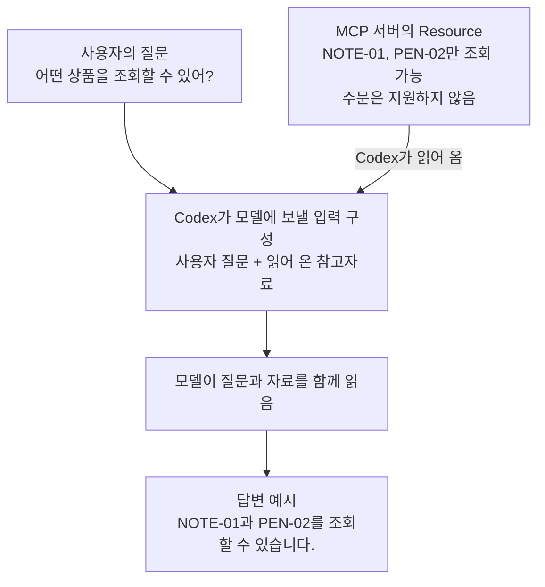
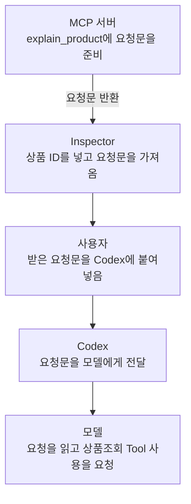

# 3주차 MCP 학습 기록

## Day 1 — Inspector에서 성공과 오류 보기

- 기록일: 2026-09-07
- 대상: 제공된 상품조회 MCP 서버의 `get_product` 도구
- 실습: Inspector에서 세 상품 ID로 `get_product` 호출.

### 입력과 실제 응답

| 입력 `product_id` | 반환된 상품 이름 | `price_krw` | `in_stock` | `isError` | 확인 결과 |
|---|---|---:|---|---|---|
| `NOTE-01` | 연습용 노트 | 3000 | `true` | `false` | 상품 정보 조회 성공, 재고 있음 |
| `PEN-02` | 연습용 펜 | 1500 | `false` | `false` | 상품 정보 조회 성공, 재고 없음 |
| `UNKNOWN` | 반환 없음 | 반환 없음 | 반환 없음 | `true` | 존재하지 않는 상품 ID에 대한 오류 |

정상 두 호출의 `content` 안에는 상품 정보를 담은 텍스트가 있었고, `structuredContent`에도 같은 상품 ID·이름·가격·재고 값이 있었다.

`UNKNOWN` 호출의 실제 오류 문구:

```text
Error executing tool get_product: Unknown product ID. Available: NOTE-01, PEN-02.
```

### 응답을 비교해 확인한 점

- `NOTE-01`과 `PEN-02`는 가격과 재고 상태가 다르지만 두 호출 모두 `isError: false`다. 품절 여부와 조회 성공 여부는 서로 다른 정보다.
- `UNKNOWN`은 상품 정보 대신 `isError: true`와 알 수 없는 상품 ID라는 오류를 반환했다. 서버에서 도구 오류 응답을 받았으므로 이번 결과는 연결 실패와 구별된다.
- 존재하지 않는 상품에는 가격이나 재고 값이 반환되지 않고 에러 메시지만 반환되었다.

**Day 1 완료.**

## Day 2 — Codex에 연결해 같은 요청 보내기

- 기록일: 2026-09-07
- 관련 대화: get_product로 상품 재고 확인.

### 보낸 요청

```text
learning-catalog의 get_product 도구로 NOTE-01과 PEN-02의 가격과 재고를 확인해 주세요.
실제 도구 응답을 근거로 설명하고 주문은 하지 마세요.
도구를 사용할 수 없으면 파일에서 답을 찾아 대신 성공 처리하지 말고 연결 상태를 알려 주세요.
```

### 실제 도구 호출과 답변 대조

정상 조회 요청에서 Codex는 `learning-catalog` 서버의 `get_product`를 상품별로 한 번씩 호출했다.

| 실제 입력 | 원응답의 상품 이름 | `price_krw` | `in_stock` | `isError` | Codex 최종 답변 | Day 1과 비교 |
|---|---|---:|---|---|---|---|
| `{"product_id":"NOTE-01"}` | 연습용 노트 | 3000 | `true` | `false` | 3,000원·재고 있음 | 일치 |
| `{"product_id":"PEN-02"}` | 연습용 펜 | 1500 | `false` | `false` | 1,500원·재고 없음 | 일치 |

두 원응답의 `content`와 `structuredContent`에 같은 상품 정보가 들어 있었고, 두 호출 모두 `isError: false`였다. 최종 답변은 반환된 가격과 재고 상태를 그대로 설명했으며, 응답에 재고 수량은 포함되지 않았다고 밝혔다. 이 정상 조회 요청의 상품 도구 호출은 두 건이고 주문 동작은 없었다.

### 결과에서 확인한 점

- 서버가 목록에 등록된 상태를 넘어, Codex가 실제 Tool 이름과 `product_id` 인자를 사용해 호출하고 응답을 받은 것을 확인했다.
- Inspector에서 학습자가 직접 호출한 값과 Codex가 호출한 값이 일치했다. 같은 서버의 결과를 Codex가 자연어 답변으로 옮기는 흐름을 대조했다.
- `PEN-02`의 품절 상태도 정상 조회 결과다. Codex는 이를 조회 오류로 바꾸거나 재고가 있다고 설명하지 않았다.
- 반환되지 않은 재고 수량을 추정해 추가하지 않았다.

### 추가 요청 1 — 존재하지 않는 상품의 오류 처리

보낸 요청: `UNKNOWN 상품의 가격을 조회해 줘.`

Codex는 `learning-catalog.get_product`에 `{"product_id":"UNKNOWN"}`을 전달했다. 실제 원응답은 `isError: true`였고, 아래 오류 문구를 반환했다.

```text
Error executing tool get_product: Unknown product ID. Available: NOTE-01, PEN-02.
```

최종 답변은 존재하지 않는 상품 ID라는 오류로 가격을 확인할 수 없다고 설명하고, 조회 가능한 ID인 `NOTE-01`, `PEN-02`를 안내했다. 가격을 만들어 내지 않았으며, 서버에서 받은 조회 오류를 연결 실패와 구별했다. Day 1 Inspector에서 확인한 오류와 일치한다.

### 추가 요청 2 — 조회가 필요 없는 개념 질문

보낸 요청: `MCP가 무엇인지 한 문장으로 설명해 줘.`

해당 요청의 실행 기록에는 도구 호출이 없었다. Codex는 다음 한 문장으로 답했다.

> MCP(Model Context Protocol)는 AI가 `get_product` 같은 외부 도구나 데이터에 연결해 정보를 조회하고 작업을 수행할 수 있도록 정해 놓은 표준 통신 규약입니다.

답변에 `get_product`라는 이름을 예로 든 것은 실제 호출과 다르다. 이 요청은 개념 설명이므로 상품 데이터가 필요하지 않았고, 상품조회 Tool을 불필요하게 사용하지 않았다.

### 요청별 차이

| 확인 조건 | 실제 확인 결과 |
|---|---|
| 정상 조회 | 두 상품의 실제 Tool 입력·응답과 최종 답변이 일치하고, Day 1 Inspector 결과와도 일치 |
| 오류 처리 | `UNKNOWN`을 실제로 호출해 오류를 받고, 가격을 만들어 내지 않고 조회 불가 이유를 설명 |
| 조회가 불필요한 요청 | MCP 개념 질문에 도구 호출 없이 한 문장으로 답변 |

**Day 2 완료.**

## Day 3 — 실행 구조와 Tool·Resource·Prompt 비교

- 기록일: 2026-09-07
- 현재 코드: [실행 설정](learning_lab_server/build.gradle), [MCP 등록](learning_lab_server/src/main/java/lab/week03/CatalogServer.java), [업무 처리](learning_lab_server/src/main/java/lab/week03/CatalogService.java), [실행 안내](learning_lab_server/README.md).

### 1. 실행 명령에서 상품 응답까지

연결 설정은 프로그램을 실행하고, 서버의 공개 입력 계약은 요청을 업무 함수에 연결한다. 업무 함수의 결과를 MCP 응답으로 전달하면 모델은 그 근거로 답변한다. 이 역할 구분은 실습 언어가 바뀌어도 유지된다.

현재 Java 구현에서는 IDE의 Gradle `installDist`로 실행 파일과 의존성을 준비하고 다음 서버를 시작한다.

```text
java -cp "build/install/learning-catalog/lib/*" lab.week03.CatalogServer
→ CatalogServer.main()
→ 공식 SDK의 stdio 전송과 Tool·Resource·Prompt 등록
→ 도구 이름과 입력 JSON을 서버 호출 처리에 전달
→ 외부 입력 검사 → CatalogService의 상품 조회·업무 계산
→ CatalogServer의 MCP 결과 변환 → Client → 모델 답변
```

`CatalogServer.catalogTools()`의 `get_product` 등록은 필수 문자열 `product_id`와 조회 함수를 연결한다. 형식이 맞는 ID여도 자료에 존재하는지는 별도로 확인해야 한다.

```java
public Product getProduct(String id) {
    Product product = catalog.get(id);
    if (product == null) throw new IllegalArgumentException(
        "Unknown product ID. Available: NOTE-01, PEN-02.");
    return product;
}
```

`NOTE-01`은 실제 상품을 반환하고 `UNKNOWN`은 업무 오류가 된다. 정상 결과의 텍스트와 `structuredContent`, 예상된 오류의 `isError`는 등록 계층에서 연결하고 JSON-RPC 통신은 SDK에 맡긴다. 품절 상품도 조회 자체가 성공했다면 정상 응답이다.

| 현재 코드 | 역할 |
|---|---|
| `CatalogService.Product` | 반환할 ID·이름·가격·재고 필드 |
| `catalog` | 현재 자료: 노트 3500원·재고 있음, 펜 1500원·재고 없음 |
| `getProduct()` | 상품 존재 검사와 반환 |
| `catalogHelp()` | 자료·동작 범위 안내 |
| `explainProduct()` | 상품 조회를 요청하는 문구 |
| `CatalogServer` | 공개 입력 계약·호출 등록·응답 변환 |

Day 1~2의 3000원은 당시 자료의 실제 결과이며, 현재 3500원은 Day 5의 자료 변경을 반영한 값이다.

### 2. Tool·Resource·Prompt의 역할과 실제 결과

세 기능은 MCP 서버가 AI 앱에 제공하는 서로 다른 인터페이스다. 이번 서버에서 같은 서버 안에 구현되어 있어도, 등록 방식과 요청·응답의 의미가 다르다.

여기서 **앱은 사용자가 대화하는 Codex 프로그램**을 뜻한다. 모델과 앱은 역할이 다르다. 아래 그림에서는 다음 이름으로 구분한다.

| 대상 | 이번 예제에서 맡는 역할 |
|---|---|
| Codex 앱 · Host | 사용자 입력과 대화를 관리하고, 모델에 입력을 보내며, MCP 서버와 요청·응답을 주고받는다. 모델의 답변을 화면에 표시한다. |
| GPT 모델 | 전달받은 질문·자료를 읽고, 답변이나 필요한 Tool 호출 요청을 생성한다. |
| MCP 서버 | `get_product`를 실행하거나 `catalog://help`의 자료, `explain_product`의 요청 메시지를 반환한다. |
| Inspector | 사람이 MCP 서버의 기능을 직접 요청하고 응답을 확인하는 테스트 도구다. |

#### Tool — 이름과 인자로 요청하는 실행 기능

Tool은 서버가 수행할 동작을 이름·설명·입력 스키마와 함께 공개한 것이다. 모델이 상황에 맞는 도구와 인자를 선택하면 Host의 MCP Client가 `tools/call`을 보내고, 서버가 기능을 실행해 결과를 돌려준다. 조회·계산뿐 아니라 서버가 구현한 파일 수정이나 주문도 Tool로 제공할 수 있다. [Tool 명세](https://modelcontextprotocol.io/specification/2026-07-28/server/tools)

이번 `get_product`는 조회 전용 Tool이다. `{"product_id":"NOTE-01"}`을 받으면 `CATALOG`에서 해당 상품을 찾아 `Product`를 반환한다. 모델이 상품값을 만들어 내는 것이 아니라 업무 함수가 반환한 값을 답변의 근거로 사용한다. Tool이라는 이름이 쓰기 권한이나 정확한 답변 자체를 보장하지는 않는다.



Day 2의 조회 흐름이다. 모델이 호출할 도구와 인자를 요청하고, Codex가 MCP 서버에 실제 요청을 전달하며, 서버가 반환한 결과를 모델이 답변에 사용한다.

#### Resource — URI로 읽어 문맥에 보태는 자료

Resource는 서버가 URI로 식별하여 제공하는 자료다. Client가 `resources/read`로 내용을 가져오면 Host는 이를 모델의 참고 문맥에 넣거나 사용자에게 보여 줄 수 있다. 문서·파일·DB 스키마·현재 상태 등 여러 자료를 제공할 수 있고, 정적 문자열에 한정되지 않는다. URI에 따라 내용을 조회하거나 동적으로 만들 수도 있다. 목록에 존재하는 모든 Resource가 자동으로 모델에 전달되는 것은 아니다. [Resource 명세](https://modelcontextprotocol.io/specification/2026-07-28/server/resources)

이번 `catalog://help`는 상품조회 서버의 사용 범위를 알려 주는 자료다. 읽으면 두 ID와 주문 미지원 안내를 받는다. 이것이 안내문인 이유는 이번 서버가 그렇게 구현했기 때문이며, Resource 전체가 도움말 전용이라는 뜻은 아니다. 상품 상세를 URI로 읽는 Resource를 설계할 수도 있다. Tool도 데이터를 조회할 수 있으므로 두 개념의 구분은 데이터가 있느냐가 아니라, 이름·인자로 기능을 실행하는 인터페이스인가, URI로 자료를 읽는 인터페이스인가에 있다.

이때 **참고 문맥에 넣는다**는 말은 질문과 함께 모델이 읽을 입력에 자료를 포함한다는 뜻이다. 예를 들어 Codex가 `catalog://help`의 응답을 가져와 질문과 함께 전달하면, 모델은 두 ID와 주문 미지원 안내를 읽고 답변할 수 있다. “앱이 읽는다”는 것은 프로그램이 서버에 자료를 요청하고 응답을 받는다는 의미이고, 그 자료를 바탕으로 답변을 만드는 역할은 모델이 맡는다.



그림은 Resource를 질문과 함께 모델에 전달하는 활용 예시다. 질문만 보내면 항상 이 Resource를 자동으로 읽는다는 뜻은 아니다.

#### Prompt — 인자를 채워 사용하는 재사용 메시지 템플릿

Prompt는 사용자가 선택한 작업을 모델에 요청하기 위한 메시지 템플릿이다. 이름과 인자를 담은 `prompts/get` 요청에 대해 서버는 인자를 반영한 메시지 목록을 반환하고, Host는 이를 모델과의 대화에 사용할 수 있다. 일반 대화에서 직접 입력한 요청과 달리, MCP Prompt는 서버가 이름을 붙여 공개하고 재사용할 수 있게 제공한다. [Prompt 역할 설명](https://modelcontextprotocol.io/docs/2026-07-28/learn/server-concepts#prompts)

이번 `explain_product`는 `NOTE-01`을 넣으면 상품을 조회하고 설명하라는 사용자 역할의 메시지를 만든다. 가격을 조회하는 코드나 모델에게 답변을 생성시키는 코드는 이 함수에 없다. 이번 Prompt를 활용해 조회까지 진행하려면 반환 문구를 Codex에 전달하고 별도의 `get_product` 호출이 이루어져야 한다. “주문하지 마세요”라는 문구도 지시이며 주문 권한을 차단하는 장치는 아니다. 이 서버가 주문하지 않는 직접 근거는 주문 기능을 제공하지 않고 조회 함수에도 쓰기 동작이 없다는 코드다.

이번에 사용한 Inspector에서는 `explain_product`와 `product_id=NOTE-01`을 지정해 요청문을 가져왔다. 서버는 미리 작성된 틀에 상품 ID를 넣어 사용자 역할의 메시지를 돌려준다. 이 단계에서 모델에 요청문이 전달되거나 상품 조회가 실행되는 것은 아니다.



Inspector에서 받은 요청문을 Codex에 붙여 넣는 활용 예시다. 그림에서 붙여 넣기 이후의 흐름은 실제 실행 기록이 아니다.

따라서 이번 Prompt는 **인자를 넣어 받아서 실제 요청으로 사용할 수 있는 문구**다. `NOTE-01` 대신 `PEN-02`를 넣으면 같은 요청 틀에서 상품 ID가 달라진다. 사용자는 매번 조회 방법과 설명할 항목을 새로 쓰지 않고, 서버가 준비한 요청을 가져와 사용할 수 있다.

공식 설명의 Tool은 모델 주도, Resource는 앱 주도, Prompt는 사용자 주도라는 구분은 전형적인 사용 방식을 가리킨다. 각각 모델이 실행할 기능을 선택하고, 앱이 어떤 자료를 문맥으로 제공할지 정하며, 사용자가 재사용할 요청을 고르는 방식이다. 실제 선택 화면·승인·사용 방법은 Host 구현에 따라 달라지며 이 구분 자체가 접근 권한 규칙은 아니다. [서버 기능 개요](https://modelcontextprotocol.io/docs/2026-07-28/learn/server-concepts)

세 기능이 항상 함께 실행되거나 정해진 순서로 이어지는 것도 아니다. Day 2에서는 사용자가 직접 상품조회를 요청했고 Codex가 Tool을 호출했다. MCP Prompt를 먼저 가져오는 단계는 없었다.

#### 실제 요청·응답 비교

| 구분 | 실제 요청 | 실제 반환 내용 | 확인 경로 |
|---|---|---|---|
| Tool | `get_product`, `{"product_id":"NOTE-01"}` | `product_id: NOTE-01`, `name: 연습용 노트`, `price_krw: 3000`, `in_stock: true`, `isError: false` | 현재 Codex의 MCP 연결 |
| Resource | `resources/read`, URI `catalog://help` | `mimeType: text/plain`의 사용 안내 | 현재 Codex의 Resource 읽기와 Inspector CLI stdio 연결 |
| Prompt | `prompts/get`, 이름 `explain_product`, 인자 `product_id=NOTE-01` | `role: user`, `type: text`의 요청 문구 | Inspector CLI stdio 연결 |

Resource의 실제 본문:

```text
연습용 고정 자료입니다. NOTE-01, PEN-02만 조회할 수 있고 주문은 지원하지 않습니다.
```

Prompt의 실제 메시지 본문(원문 그대로):

```text
get_product로 NOTE-01를 조회하고 가격과 재고를 설명하세요. 주문하지 마세요.
```

Tool 응답의 `price_krw: 3000`은 Day 2 답변의 “3,000원”을, `in_stock: true`는 “재고 있음”을 뒷받침한다. Resource에는 조회 가능한 ID와 주문 미지원 안내가 있지만 해당 상품의 가격은 없다. Prompt에는 조회하라는 문장이 있지만 조회 결과인 가격·재고 값은 없다.

특히 `explain_product`의 반환문은 다음과 같다.

```java
return "get_product로 " + id + "를 조회하고 가격과 재고를 설명하세요. 주문하지 마세요.";
```

따옴표 안의 `get_product`는 함수 호출이 아니라 문장에 들어갈 글자다. 함수 본문에는 `get_product(...)` 호출이나 상품 가격을 꺼내는 처리가 없다. 따라서 **Prompt를 가져온 것만으로 상품 조회가 실행된 것은 아니다.** 이번 Prompt 응답도 상품 객체 대신 사용자 역할의 메시지를 담았다. 그 문구를 AI가 받아 실제 조회를 수행하는 것은 별도의 Tool 호출 단계다.

### 3. 구조에서 배운 점

- 실행 설정은 어떤 프로그램을 시작할지, `get_product`는 받은 ID를 어떻게 처리할지를 맡는다. 그래서 연결 경로 문제와 조회 입력 문제를 서로 다른 위치에서 살펴볼 수 있다.
- `Product`는 결과의 형태, `CATALOG`는 실제 값을 맡는다. 배송일처럼 새 필드를 추가하는 일과 기존 가격을 고치는 일의 수정 범위가 다르다. 현재 반환 필드만으로 배송일이나 재고 수량을 설명할 수는 없다.
- 데이터와 요청 문구가 나뉘어 있어 사실의 변경과 설명 방식의 변경을 구별할 수 있다. 예를 들어 `CATALOG`의 노트 가격만 3500원으로 바꾸고 서버를 새로 실행하면 Tool 결과의 가격이 달라질 것으로 예상한다. 가격을 포함하지 않는 Resource·Prompt의 문자열은 그대로일 것이다. 이는 코드에 근거한 예상이며 이번에는 가격을 수정하거나 이 변경을 실행하지 않았다.
- 반환된 결과의 변경이 원자료에 영향을 주지 않도록 분리해야 한다. 현재 상품 결과는 수정할 수 없고 조회 목록도 수정할 수 없으며, 편집·저장 미리보기는 내부 스냅샷과 별도로 반환된다. 이는 공유 상태의 뜻하지 않은 변경을 막는 원리다.

## Day 3–4 — 예산·재고 조회 구현과 검증

- 기록일: 2026-09-08
- 선택한 요구: 기존 `CATALOG`에서 예산 이하의 상품 후보를 찾는다. `max_price_krw`는 필수인 0 이상 정수, `in_stock_only`는 기본값 `true`다. 결과는 상품 목록이며, 해당 상품이 없으면 빈 목록, 음수 예산이나 잘못된 형식은 입력 오류로 처리한다. 주문·재고 변경은 허용하지 않는다.
- 변경 파일: [서버 코드](learning_lab_server/src/main/java/lab/week03/CatalogService.java), [기능 테스트](learning_lab_server/src/test/java/lab/week03/PurchaseContractTest.java), [프로젝트 사용 안내](learning_lab_server/README.md).

### 사용한 요청

```text
Day 3 기본 실습으로 find_products Tool을 만들어 주세요.

기존 CATALOG에서 최대 예산 이하인 상품을 찾습니다.
max_price_krw는 0 이상 정수,
in_stock_only는 기본값 true로 해주세요.
결과는 상품 목록, 해당 상품이 없으면 빈 목록,
음수 예산은 입력 오류로 처리합니다. 조회만 허용합니다.

바꿀 코드와 그 이유를 설명하고 구현·관련 테스트를 진행해 주세요.
기존 get_product와 학습 기록은 보존하세요.
이후 Inspector에서 새 Tool을 직접 호출하도록 안내해 주세요.
```

### 요청을 구현 구조로 연결한 방식

| 요청에 담긴 요구 | 만들어진 구조와 처리 위치 | 실제 검증에서 확인한 동작 |
|---|---|---|
| 기존 `CATALOG`에서 예산 이하인 상품 찾기 | `CatalogService.findProducts()`가 상품 자료를 읽고 가격 상한과 재고 조건으로 후보를 고른다. | Inspector에서 예산 3000에 가격 3000인 노트가 포함됐다. 테스트에서도 1500원 경계의 펜 포함과 1499원에서 제외를 확인했다. |
| 예산은 0 이상 정수, 음수는 입력 오류 | 공개 스키마에 정수·최솟값을 표시하고, 호출 경계의 입력 검사와 업무 함수의 범위 검사로 조건을 지킨다. | 테스트에서 예산 0은 정상 빈 목록이었고, Inspector의 -1 호출은 `isError: true`와 예산 검증 오류를 반환했다. |
| `in_stock_only` 기본값은 `true` | 선택 인자의 기본값을 `true`로 두고 `(!inStockOnly || p.in_stock())`를 가격 조건과 함께 적용했다. | Inspector에서 재고 인자를 생략한 예산 3000 호출은 노트만 반환했다. 예산 2000에서 `true`는 빈 목록, `false`는 품절인 펜을 반환했다. |
| 상품 목록 반환, 해당 상품이 없으면 빈 목록 | 조건을 통과한 상품만 목록에 넣고 등록 계층이 `structuredContent.result`에 연결한다. | Inspector에서 해당 상품이 없을 때 `result: []`, `isError: false`를 확인했다. 빈 결과를 입력 오류와 구분했다. |
| 조회만 수행하고 기존 `get_product` 보존 | 기존 함수는 유지하고 같은 서버에 새 Tool을 등록했다. 현재 반환값은 수정할 수 없는 결과이며, 조회가 원자료를 변경하지 않게 구성한다. | 반환 객체를 수정해도 `CATALOG`는 그대로였다. 기존 상품 조회 결과도 유지됐다. |

### 필터 구조

`get_product`는 알고 있는 ID 한 건을 찾고, `find_products`는 예산·재고 조건으로 후보를 찾는다. 두 Tool은 같은 `CATALOG`와 `Product`를 사용한다.

외부 입력의 형식과 업무 조건을 나누어 확인한다. 예산은 0 이상 정수, 재고 조건은 불리언이며 생략 시 재고 있는 상품만 찾는다. 문자열·실수·불리언을 금액으로 자동 변환하면 잘못된 입력이 정상 조회로 바뀔 수 있으므로 실행 경계에서 거부한다.

현재 `InspectorServer`의 입력 스키마가 이 계약을 공개하고 `DraftStore.integer()`와 입력 검사가 실제 값을 확인한다. `CatalogService.findProducts()`는 금액 경계와 재고 조건에 맞는 후보를 고른다. 타입 선언이나 화면의 입력 제한만으로 서버 검증을 대신하지 않는다.

```java
return catalog.values().stream()
    .filter(p -> p.price_krw() <= maximum && (!inStockOnly || p.in_stock()))
    .toList();
```

`<=`는 예산과 같은 가격도 포함하고, 재고 조건을 끄면 품절 상품도 후보가 된다. 후보가 없다는 정상 결과와 받아들일 수 없는 입력은 다른 상태다. [공식 MCP Java SDK](https://java.sdk.modelcontextprotocol.io/latest/server/)

### Day 4 검증 — 입력에 따른 결과

| Inspector 입력 | 실제 반환 내용 | `isError` |
|---|---|---|
| `find_products`, `{"max_price_krw":3000}` | `NOTE-01`, 연습용 노트, 3000원, 재고 `true` | `false` |
| `find_products`, `{"max_price_krw":2000,"in_stock_only":true}` | `structuredContent.result: []` | `false` |
| `find_products`, `{"max_price_krw":2000,"in_stock_only":false}` | `PEN-02`, 연습용 펜, 1500원, 재고 `false` | `false` |
| `find_products`, `{"max_price_krw":-1}` | `max_price_krw` 검증 오류, 상품 목록 없음 | `true` |
| `get_product`, `{"product_id":"NOTE-01"}` | 기존과 같은 노트 3000원·재고 `true` | `false` |

이 결과에서 예산 3000원에 같은 가격의 노트가 포함된 것은 요청의 “이하” 조건이 `<=`로 구현됐다는 근거다. 예산을 2000원으로 고정하고 재고 조건만 바꿨을 때 빈 목록에서 펜으로 달라졌으므로, 품절 포함 여부가 실제 후보 선택에 반영되는 것을 확인했다. 유효한 입력의 빈 목록은 성공 응답이고 음수 예산은 오류 응답이어서, 요청에 있던 두 실패·결과 조건도 서로 구분됐다.

음수 예산의 실제 오류 본문에서 확인한 부분:

```text
Error executing tool find_products: 1 validation error for find_productsArguments
max_price_krw
  Input should be greater than or equal to 0 [type=greater_than_equal, input_value=-1, input_type=int]
```

음수 예산은 조건에 맞는 상품이 없는 상태가 아니라 입력 조건을 위반한 상태이므로 `isError: true`다.

### 직접 호출해 본 결과

Inspector에서 예산 `3000`, 재고 조건 `true`로 호출하니 `NOTE-01` 한 건이 반환됐다. 이름은 `연습용 노트`, `price_krw`는 `3000`, `in_stock`은 `true`였다.

예산과 가격이 같은 상품도 포함되며, 재고 조건도 적용됐다.

**Day 3–4 완료.**

## Day 5 — 만든 기능의 Codex 사용과 구매 검토 확장

### 1. 만든 기능을 다른 요청으로 사용하기

- 기록일: 2026-09-08
- 관련 대화: 품절 포함 2000원 이하 상품 찾기.

보낸 요청:

```text
학습용 상품 목록에서 품절 상품도 포함해 2000원 이하 후보를 보여 주세요.
```

Codex는 `learning-catalog.find_products`를 다음 인자로 한 번 호출했다.

```json
{"max_price_krw":2000,"in_stock_only":false}
```

“2000원 이하”는 예산 인자로, “품절 상품도 포함”은 기본 재고 제한을 해제하는 `in_stock_only: false`로 전달됐다. 서버의 기존 예산·재고 필터를 같은 코드로 재사용했다.

| 확인 대상 | 실제 결과와 해석 |
|---|---|
| 도구 원응답 | `structuredContent.result`에 `PEN-02` 한 건. 이름은 `연습용 펜`, `price_krw: 1500`, `in_stock: false`. `isError: false`였다. |
| 최종 답변 | 후보 1개로 `PEN-02 / 연습용 펜 / 1,500원 / 품절`을 표시하고 사용한 Tool과 인자를 밝혔다. |
| 요청·응답·답변 대조 | 예산 이하인 품절 상품이 포함됐고, 가격과 품절 상태가 최종 답변에도 보존됐다. Day 3–4 Inspector CLI의 같은 조건 결과와 일치했다. |

**Day 5의 1번 완료.**

### 2. 구매 검토 Tool 구현과 검증

- 기록일: 2026-09-08
- 요청 범위: 기존 서버와 `CATALOG`에 `review_purchase(items, budget_krw)`를 추가한다. 상품 ID·수량 목록과 예산을 받아 상품별 단가·수량·소계, 총액, 예산 초과 여부·초과액, 품절 상품 목록을 반환한다. 품절도 금액에 포함하고, 없는 ID가 하나라도 있으면 전체 오류로 처리한다. 빈 목록·잘못된 수량·예산도 오류다. 주문·재고 변경은 하지 않는다.
- 사용 자료: 노트 3000원·펜 1500원. 상품 가격은 변경하지 않는다.
- 변경 위치: [서버 코드](learning_lab_server/src/main/java/lab/week03/CatalogService.java), [새 구매 검토 테스트](learning_lab_server/src/test/java/lab/week03/PurchaseContractTest.java), [사용 안내](learning_lab_server/README.md).

#### 구현을 요청한 프롬프트

```text
review_purchase Tool을 만들어 주세요.

기존 MCP 서버와 CATALOG를 이용해 여러 상품과 수량의 예상 금액을 계산합니다.
입력은 상품 ID·수량 목록(items)과 예산(budget_krw)입니다.
수량은 1 이상 정수, 예산은 0 이상 정수로 받습니다.

상품별 단가·수량·소계, 예상 총액, 예산 초과 여부·초과액,
품절 상품 목록을 반환해 주세요.
품절 상품도 예상 금액에 포함하되 따로 표시합니다.
총액이 예산과 같으면 초과가 아닙니다.

모르는 상품 ID가 하나라도 있으면 전체 요청을 오류로 처리하고,
일부 상품만 계산한 금액을 완전한 견적처럼 반환하지 마세요.
빈 상품 목록이나 잘못된 수량·예산도 입력 오류로 처리합니다.
금액은 서버가 현재 상품 가격으로 계산하며, 주문이나 재고 변경은 하지 않습니다.

정상 예시는 NOTE-01 두 개와 PEN-02 한 개, 예산 8000원입니다.
현재 자료에서는 총액 7500원, 예산 초과 없음, 품절 상품 PEN-02가 예상됩니다.

바꿀 코드와 그 이유를 설명하고 구현·관련 테스트를 진행해 주세요.
기존 get_product, find_products와 학습 기록은 보존하세요.

상품 가격을 변경하지 마세요.
```

#### 선택한 구조와 이유

단건 조회, 후보 검색, 수량을 반영한 금액 검토는 필요한 입력과 결과가 달라 별도 Tool로 나뉜다. `review_purchase`는 선택한 상품과 수량의 금액을 계산하고, 통신과 응답 포장은 MCP SDK가 맡는다.

- `PurchaseItem`: 상품 ID와 수량 입력을 묶는다. 수량 입력은 1 이상 정수만 받는다. 항목의 추가 필드를 거부하므로 호출자가 단가를 전달해 계산에 끼워 넣을 수 없다.
- 공개 입력 계약과 실행 검사: 빈 목록·음수 예산·양수가 아닌 수량을 거부하고 문자열·실수·불리언을 수량이나 금액으로 자동 변환하지 않는다. 외부 형식은 입력 경계에서, 상품 존재·전체 견적 거부·금액 계산은 업무 함수에서 확인한다.
- `PurchaseLine(Product)`: 기존 상품 결과의 ID·이름·단가(`price_krw`)·재고 필드를 재사용하고 수량과 `subtotal_krw`를 더한다. `CATALOG`의 객체를 수정하지 않고 새 결과 객체를 만든다.
- `review_purchase`: 계산 전에 전체 입력에서 모르는 ID를 찾는다. 하나라도 있으면 `ValueError`를 발생시키고 SDK가 `isError: true`로 전달한다. 상품별 소계나 합계가 담긴 `structuredContent`는 반환하지 않는다.
- 금액 계산: 서버가 상품 단가 × 수량로 소계를 계산해 더한다. `total_krw > budget_krw`일 때만 초과이고, 초과액은 `max(total_krw - budget_krw, 0)`이다. 품절 여부는 합계에서 제외하는 조건으로 사용하지 않는다.
- `PurchaseReview`: 상품별 결과, 예산, 총액, 초과 여부·초과액, 품절 ID 목록을 한 객체로 반환한다. 같은 상품을 여러 줄에 보내면 각 줄을 유지해 합산하고, 품절 ID는 입력 순서로 한 번씩 표시한다. 결과는 `structuredContent`의 최상위 필드에 있으며 `find_products`의 목록 결과처럼 `result`로 감싸지 않는다.

#### 정상 입력과 응답

`review_purchase`의 입력과 Inspector CLI 응답:

```json
{"items":[{"product_id":"NOTE-01","quantity":2},{"product_id":"PEN-02","quantity":1}],"budget_krw":8000}
```

```json
{
  "items": [
    {"product_id":"NOTE-01","name":"연습용 노트","price_krw":3000,"in_stock":true,"quantity":2,"subtotal_krw":6000},
    {"product_id":"PEN-02","name":"연습용 펜","price_krw":1500,"in_stock":false,"quantity":1,"subtotal_krw":1500}
  ],
  "budget_krw": 8000,
  "total_krw": 7500,
  "over_budget": false,
  "over_budget_krw": 0,
  "out_of_stock_product_ids": ["PEN-02"]
}
```

노트 2개의 6000원에 펜 1개의 1500원을 더해 총액은 7500원이다. 품절인 펜도 금액에 포함되며, `out_of_stock_product_ids`에 따로 표시된다. 예산 8000원 안에 들어가므로 초과액은 0원이다.

#### 조건을 바꿨을 때의 결과

| Inspector CLI 입력 | 반환 결과 | `isError` |
|---|---|---|
| 노트 2개·펜 1개, 예산 8000 | 총액 7500, 초과 없음·초과액 0, 품절 PEN-02 | `false` |
| 같은 목록, 예산 7500 | 총액 7500, 초과 없음·초과액 0 | `false` |
| 같은 목록, 예산 7499 | 총액 7500, 1원 초과 | `false` |
| 노트 2개 뒤에 UNKNOWN 1개, 예산 8000 | Unknown product ID 오류, 견적 객체 없음 | `true` |
| 노트 수량 0, 예산 8000 | `items.0.quantity` 입력 오류, 견적 객체 없음 | `true` |
| 노트 2개·펜 1개, 예산 -1 | `budget_krw` 입력 오류, 견적 객체 없음 | `true` |
| 빈 목록, 예산 8000 | `items` 입력 오류, 견적 객체 없음 | `true` |
| 기존 `get_product`, NOTE-01 | 단가 3000, 재고 있음 | `false` |
| 기존 `find_products`, 예산 2000·품절 포함 | PEN-02, 단가 1500, 품절 | `false` |

없는 상품이 섞인 요청의 실제 오류:

```text
Error executing tool review_purchase: Unknown product ID(s): UNKNOWN. No purchase estimate was calculated.
```

모르는 상품이 섞이면 정상 상품인 노트의 부분 금액도 반환하지 않는다. 품절이나 예산 초과는 계산 결과에 표시하지만, 잘못된 입력은 `isError: true`로 구분된다.

### 3. 구매 검토 Tool의 Codex 호출과 답변 대조

- 기록일: 2026-09-09
- 대상: Codex에 연결된 `learning-catalog.review_purchase`
- 입력: `NOTE-01` 두 개와 `PEN-02` 한 개, 예산 8000원. 예상 총액·예산 초과 여부와 초과액·품절 상품을 확인하고 실제 호출 인자와 원응답을 대조한다.

#### 실제 호출 인자와 원응답

`learning-catalog.review_purchase`의 실제 MCP 호출은 1회이며 입력 인자는 다음과 같다.

```json
{
  "items": [
    {"product_id": "NOTE-01", "quantity": 2},
    {"product_id": "PEN-02", "quantity": 1}
  ],
  "budget_krw": 8000
}
```

응답의 `isError`는 `false`였고, `structuredContent`는 다음과 같다.

```json
{
  "items": [
    {"product_id":"NOTE-01","name":"연습용 노트","price_krw":3000,"in_stock":true,"quantity":2,"subtotal_krw":6000},
    {"product_id":"PEN-02","name":"연습용 펜","price_krw":1500,"in_stock":false,"quantity":1,"subtotal_krw":1500}
  ],
  "budget_krw": 8000,
  "total_krw": 7500,
  "over_budget": false,
  "over_budget_krw": 0,
  "out_of_stock_product_ids": ["PEN-02"]
}
```

#### 원응답과 최종 답변 대조

| 확인 대상 | 실제 결과와 해석 |
|---|---|
| 상품별 계산 | 노트는 단가 3000원 × 2개 = 6000원, 펜은 단가 1500원 × 1개 = 1500원으로 반환됐다. |
| 총액·예산 | `total_krw: 7500`, `over_budget: false`, `over_budget_krw: 0`이었고 최종 답변의 총액 7500원·초과 없음과 일치했다. |
| 품절 처리 | 펜의 `in_stock: false`와 품절 목록 `PEN-02`가 최종 답변에도 반영됐다. 품절인 펜의 1500원은 총액에 포함됐다. |
| 남은 예산 | 최종 답변의 500원은 원응답의 예산 8000원에서 총액 7500원을 뺀 값이다. 별도의 잔여 예산 필드가 반환된 것은 아니다. |
| 기존 결과와 비교 | 앞서 기록한 Inspector CLI의 동일 입력 결과와 상품별 소계·총액·예산 초과 여부·품절 목록이 일치했다. |

상품과 수량은 `items`, 예산은 `budget_krw`로 전달됐고, 서버의 계산 결과가 최종 답변에 반영됐다. 이번 결과는 구매 검토 정상 요청의 Codex 실제 호출과 답변 대조를 확인한 근거다.

### 4. 가격 변경 후 같은 구매 검토 요청 재사용

- 기록일: 2026-09-09
- 대상: [서버의 상품 자료](learning_lab_server/src/main/java/lab/week03/CatalogService.java)의 `CATALOG`와 `learning-catalog.review_purchase`의 실제 Codex 호출.
- 변경: `NOTE-01` 단가를 3000원에서 3500원으로 조정했다. 입력은 앞 단계와 같은 노트 두 개·펜 한 개, 예산 8000원이다.

#### 자료 변경과 예상

서버 코드의 변경은 `CATALOG` 안의 노트 가격 한 곳이다.

```diff
-    "NOTE-01": Product(product_id="NOTE-01", name="연습용 노트", price_krw=3000, in_stock=True),
+    "NOTE-01": Product(product_id="NOTE-01", name="연습용 노트", price_krw=3500, in_stock=True),
```

`review_purchase`는 현재 `CATALOG`의 단가에 입력 수량을 곱해 소계를 만들고 합산한다. 노트 한 개의 가격이 500원 올랐으므로 두 개의 소계와 총액은 각각 1000원 늘어날 것으로 예상했다. 합계가 예산보다 큰지 비교하는 계산 규칙은 그대로 적용된다.

| 확인 대상 | 변경 전 실제 결과 | 변경 후 예상 | 재연결 후 실제 결과 |
|---|---|---|---|
| 노트 단가 | 3000원 | 3500원 | 3500원 |
| 노트 두 개 소계 | 6000원 | 7000원 | 7000원 |
| 펜 한 개 소계 | 1500원 | 1500원 | 1500원 |
| 총액 | 7500원 | 8500원 | 8500원 |
| 예산 8000원 초과 여부 | `false` | `true` | `true` |
| 초과액 | 0원 | 500원 | 500원 |
| 품절 상품 | `PEN-02` | `PEN-02` | `PEN-02` |

#### 실제 MCP 호출과 결과

파일 변경 후 재연결 전의 Codex 호출은 노트 단가 3000원·총액 7500원을 반환했다. 서버 재시작·재연결 후 같은 도구와 인자로 다시 호출했을 때 노트 단가 3500원·총액 8500원이 반환됐다. `CATALOG`는 서버 모듈이 로드될 때 생성되므로, 파일을 고친 것과 실행 중인 서버에 새 값이 반영된 것은 구분해야 한다.

재연결 후 `learning-catalog.review_purchase`의 실제 입력:

```json
{
  "items": [
    {"product_id": "NOTE-01", "quantity": 2},
    {"product_id": "PEN-02", "quantity": 1}
  ],
  "budget_krw": 8000
}
```

`isError`는 `false`였고, `structuredContent`는 다음과 같다.

```json
{
  "items": [
    {"product_id":"NOTE-01","name":"연습용 노트","price_krw":3500,"in_stock":true,"quantity":2,"subtotal_krw":7000},
    {"product_id":"PEN-02","name":"연습용 펜","price_krw":1500,"in_stock":false,"quantity":1,"subtotal_krw":1500}
  ],
  "budget_krw": 8000,
  "total_krw": 8500,
  "over_budget": true,
  "over_budget_krw": 500,
  "out_of_stock_product_ids": ["PEN-02"]
}
```

도구 결과에 근거한 답변은 총액 8500원·예산 500원 초과·품절 `PEN-02`다. 변경 전의 예산 500원 잔여에서 500원 초과로 달라졌다. 품절인 펜도 소계와 총액에 포함되며, 예산 초과는 계산 오류가 아니라 정상 결과 안의 상태로 반환됐다.

#### 관련 테스트와 사용 안내 갱신

[조회 테스트](learning_lab_server/src/test/java/lab/week03/PurchaseContractTest.java)와 [구매 검토 테스트](learning_lab_server/src/test/java/lab/week03/PurchaseContractTest.java)의 기대값을 새 단가에 맞췄다. [프로젝트 사용 안내](learning_lab_server/README.md)의 호출 예시도 현재 가격과 예상 금액으로 갱신했다.

- 후보 검색: 예산 3000원·기본 재고 조건에서는 빈 목록, 3500원에서는 노트 한 건이다. 품절 포함 조건에서는 3000원에 펜만, 3500원에 노트와 펜이 반환된다.
- 구매 검토: 총액 8500원 기준으로 예산 8501원과 8500원은 초과 없음, 8499원은 1원 초과, 0원은 8500원 초과다. 노트 세 개의 총액은 10500원이며 펜의 중복 입력 계산도 확인했다.
- 기존 계약: 단건 조회, Resource·Prompt, 입력 스키마, 없는 상품·잘못된 수량·예산·빈 목록의 오류 처리, 반환 객체와 원자료의 분리를 함께 검사했다.

프로젝트 폴더에서 실행한 명령:

Windows PowerShell: `.\gradlew.bat test`

macOS·Linux·WSL: `bash ./gradlew test`

결과는 **14개 테스트 통과(`OK`)**였다. 이 테스트는 SDK의 메모리 연결을 확인하고, 위의 재연결 후 도구 원응답은 Codex의 실제 MCP 호출에서 얻었다. 변경 전후에 같은 입력을 사용했으며 새 자료가 계산과 답변에 반영되는 것을 확인했다.

### 5. 미리보기와 새 초안 저장 구현

- 기록일: 2026-09-09
- 선택한 요구: 기존 구매 검토 결과를 Inspector에서 읽고, 확인한 내용을 새 로컬 초안으로 저장한다. 미리보기 시점의 견적을 보존하며 같은 요청의 재호출과 다른 내용의 충돌을 구분한다.
- 승인 경로: Inspector에서 미리보기 확인 후 저장 도구를 직접 실행하는 방식. 기본 Codex 서버에는 저장 도구를 등록하지 않는다.

#### 요구를 코드로 연결한 구성

| 요구 | 구현 위치와 처리 |
|---|---|
| 기존 조회·계산을 재사용 | [CatalogServer.java](learning_lab_server/src/main/java/lab/week03/CatalogServer.java)의 `catalogTools()`와 `create()`가 Tool 세 개와 Resource·Prompt를 등록한다. 계산 함수의 상품 조회·소계·합계 규칙은 같은 코드다. |
| Inspector에서 저장 기능 사용 | [InspectorServer.java](learning_lab_server/src/main/java/lab/week03/InspectorServer.java)의 `InspectorServer.create()`가 공통 서버를 만들고 미리보기·저장 도구를 추가한다. |
| 상품·수량·예산 검증 | 미리보기 도구의 입력 계약과 실행 검사가 목록·수량·예산을 확인하고 `CatalogService.reviewPurchase()`가 상품 ID와 계산을 처리한다. |
| 미리본 내용과 저장 내용 연결 | [DraftStore.java](learning_lab_server/src/main/java/lab/week03/DraftStore.java)의 `DraftStore.preview()`가 견적을 JSON 바이트로 확정해 서버 메모리에 보관한다. `save()`는 그 바이트를 사용한다. |
| 같은 요청·다른 미리보기 구분 | `request_id`는 업무 요청을, `preview_id`는 그 요청의 특정 미리보기를 식별한다. 같은 요청의 새 미리보기가 생기면 이전 미리보기 ID는 무효화된다. |
| 저장 위치 제한 | `destination()`이 요청 ID를 검사하고 고정 루트 안의 파일명을 만든다. `checkRoot()`와 `checked()`이 경로의 링크·junction 등을 검사한다. |
| 중복·기존 파일 충돌 처리 | `existing()`이 기존 파일의 실제 바이트와 저장할 바이트를 비교한다. 같으면 기존 결과를 반환하고 다르면 `DRAFT_CONFLICT`로 처리한다. |
| 완성본만 새 파일로 확정 | `save()`가 임시 파일을 쓰고 동기화한 뒤 `publish()`에서 `Files.createLink()`로 사용되지 않은 최종 파일명에 연결한다. 기존 파일을 대체하지 않는다. |

기존 계산을 다른 파일에 복사하는 대신 서버 등록 부분을 함수로 분리했다. 기본 진입점은 등록한 도구를 실행하고, Inspector용 진입점은 여기에 두 도구를 추가한다. 따라서 상품값·계산 규칙의 수정 위치는 기존 서버 코드이며, 파일 저장 규칙의 수정 위치는 `DraftStore.java`다.

#### 미리보기 입력이 확정된 견적으로 이어지는 과정

미리보기 도구가 기존 계산과 저장소를 연결하는 핵심은 다음과 같다.

```java
return store.preview(requestId, catalog.reviewPurchase(items, budget));
```

`items`의 상품·수량과 `budget_krw`는 기존 계산 함수로 전달된다. 노트 두 개·펜 한 개, 예산 8000원에서는 총액 8500원·500원 초과·품절 `PEN-02`가 나온다. 없는 상품이 섞이면 기존 함수가 전체 오류를 반환하므로 저장 가능한 미리보기도 생기지 않는다.

`DraftStore.preview()`는 요청 ID, 견적, 계산의 완전 여부와 가격 정책을 JSON 바이트로 만든다. 내부 `Snapshot.payload`는 외부에 노출하지 않는 확정된 바이트이며, 응답의 `quote`는 별도의 복사본이다. 반환된 미리보기 객체를 고치거나 원자료의 단가를 바꾸더라도 보관된 스냅샷은 달라지지 않는다.

미리보기 응답에는 `preview_id`, `request_id`, 실제 저장 예정 `path`, `pricing_policy: "preview_snapshot"`, `estimate_complete: true`, `quote`가 들어간다. 미리보기는 초안 파일과 저장 폴더를 만들지 않는다.

`request_id`는 예를 들어 `purchase-001`처럼 같은 업무 요청을 다시 찾는 이름이다. `preview_id`는 매번 새로 생성되는 미리보기의 식별자다. 같은 요청 ID로 수량을 바꿔 새 미리보기를 만들면 이전 미리보기 ID를 제거한다. 실제 저장에서 이전 ID를 보내면 `INVALID_PREVIEW`가 반환되므로 수정 전 미리보기로 새 내용을 저장할 수 없다.

#### 사람이 확인한 내용과 저장 내용을 연결하는 정책

저장 도구의 입력은 `preview_id` 한 개다. 가격·수량·견적을 저장 호출에서 다시 받거나 재계산하지 않는다. 새 가격이나 다른 수량을 반영하려면 새 미리보기를 만들고 확인한다. 저장된 문서의 가격 정책은 미리보기 시점의 견적을 보존하는 `preview_snapshot`이다.

사람의 확인은 Inspector에서 미리보기를 읽고 저장을 직접 실행하는 절차로 확인한다. 서버는 미리보기의 유효성과 저장 조건을 검사하며, 미리보기 ID를 사람의 승인 증거로 취급하지 않는다. `approved=true` 같은 승인 입력도 없다.

실행 명령으로 제공 도구를 구분한다.

| 실행 방식 | 명령의 서버 부분 | 제공 도구 |
|---|---|---|
| 기존 Codex 연결 | `java -cp "build/install/learning-catalog/lib/*" lab.week03.CatalogServer` | `get_product`, `find_products`, `review_purchase` |
| 저장 실습용 Inspector | `java -cp "build/install/learning-catalog/lib/*" lab.week03.InspectorServer` | 기존 세 도구와 `preview_purchase_draft`, `save_purchase_draft` |

기본 진입점의 실제 stdio 테스트에서는 세 도구만 목록에 나타났고 저장 도구 이름을 직접 호출해도 오류였다. 이는 이 실행 구성에서 저장 도구가 제공되지 않는다는 근거이며, 사람이 Inspector에서 내용을 확인했다는 근거와는 구분한다.

#### 같은 요청과 충돌을 구별하는 방법

저장 문서에는 `schema_version`, `request_id`, `pricing_policy`, `estimate_complete`, `quote`를 넣는다. 실행마다 달라지는 `preview_id`는 문서에 넣지 않는다. 같은 요청·같은 견적이 새 미리보기 ID 때문에 다른 문서가 되지 않도록 한 구성이다.

JSON의 키 순서와 들여쓰기를 고정해 UTF-8 바이트를 만든다. 기존 파일이 있으면 파일명만 확인하지 않고 실제 바이트를 대조한다. 문서 안에 요청 ID도 있으므로 다른 요청의 파일을 해당 위치에 복사한 경우에는 내용이 달라 충돌한다. 사람이 파일 끝에 줄바꿈만 추가해도 현재 정책에서는 수정된 파일로 판정한다.

- 첫 저장은 `saved`와 실제 경로를 반환한다.
- 같은 요청·같은 내용의 재저장은 `already_saved`와 같은 경로를 반환한다. 파일 수·내용·수정 시각은 바뀌지 않았다.
- 같은 요청 ID에 예산을 8000원에서 9000원으로 바꾼 뒤 저장하면 `DRAFT_CONFLICT`가 반환되고 원래 파일은 보존됐다.
- 사람이 수정한 파일과 다른 요청의 내용으로 점유된 위치도 충돌로 처리됐다.

미리보기는 서버 메모리에 있으므로 서버를 다시 시작하면 이전 ID는 유효하지 않다. 새 미리보기를 읽은 뒤 저장할 수 있으며, 같은 요청·같은 내용이면 저장 문서로 재요청을 판별한다. 이전 미리보기 자체를 복구하거나 수정 이력에 따라 되돌리는 기능은 이후 편집·중단 복구·취소 실습에서 다룬다.

#### 저장 위치와 실패 처리

기본 저장 루트는 코드 위치를 기준으로 계산한 주차 폴더의 `.local/drafts/`다. MCP 호출에서 저장 루트나 임의 경로를 받지 않는다. 요청 ID는 영문 소문자·숫자·하이픈·밑줄의 제한된 이름이며, `../outside`, 경로 구분자, Windows 예약 장치 이름 등을 거부한다. 기존 `.gitignore`의 `.local/` 규칙이 초안에 적용된다.

한 서버 프로세스 안의 미리보기·저장 처리는 공유 잠금으로 직렬화한다. 저장할 때는 다음 순서로 처리한다.

```text
미리보기 조회 → 저장 경로 검사 → 기존 파일 내용 대조
→ 완성된 임시 파일 작성·저장 동기화 → 사용되지 않은 최종 파일명에 게시
→ 임시 파일 정리 → 저장 결과 반환
```

`Files.createLink()`는 완성된 파일 내용을 새 이름에 연결하는 표준 파일 기능이다. 최종 경로가 이미 존재하면 덮어쓰지 않고 실패한다. 최초 검사 뒤 파일이 생긴 경우에도 다시 실제 내용을 대조하므로 다른 파일을 대체하지 않는다. 파일시스템이 하드링크를 지원하지 않으면 안전하지 않은 대체 방식으로 진행하지 않고 저장 실패를 반환한다.

쓰기·동기화·게시 실패에서 `SAVE_FAILED`를 반환하고 기존 초안을 보존했다. 임시 파일은 `.pending-*.tmp` 이름을 사용하며 정상 초안으로 읽지 않는다. 최종 초안 게시 후 임시 파일 정리만 실패하면 `saved`와 `cleanup_pending: true`를 반환해 저장 결과와 정리 상태를 구분한다.

#### 구현 검증의 실제 결과

프로젝트 폴더에서 실행한 명령:

Windows PowerShell: `.\gradlew.bat test`

macOS·Linux·WSL: `bash ./gradlew test`

결과: **31개 중 30개 통과, 1개 건너뜀**. 건너뛴 검사는 실제 심볼릭 링크 생성이며 Windows의 링크 생성 권한 부족(`WinError 1314`) 때문이었다. 이를 링크를 통한 경로 우회까지 실제 검증한 것으로 기록하지 않는다.

[저장 기능 테스트](learning_lab_server/src/test/java/lab/week03/DraftStoreTest.java)는 임시 폴더에서 다음 결과를 확인했다.

| 확인 범위 | 실제 결과 |
|---|---|
| 미리보기만 실행 | 견적·위치 반환, 저장 폴더와 파일 생성 없음 |
| 스냅샷 보존 | 미리보기 반환 객체와 상품 단가를 바꿔도 저장된 노트 단가 3500원·총액 8500원 유지 |
| 새 미리보기 생성 | 이전 ID 저장은 오류, 노트 한 개·펜 한 개의 새 미리보기 저장은 총액 5000원 |
| 재요청 | 같은 미리보기와 새 미리보기의 같은 내용 모두 `already_saved`, 파일 내용·개수·수정 시각 유지 |
| 충돌 | 다른 예산·사람이 수정한 내용·다른 요청의 파일 모두 오류와 기존 바이트 보존 |
| 입력 오류 | 잘못된 요청 ID·수량·예산·추가 단가·없는 상품에서 저장 가능한 결과 없음 |
| 저장 실패 | 게시 실패 후 기존 파일 보존과 재시도 성공, 동기화 실패에서 불완전 초안 게시 없음 |
| 검사 이후 경로 점유 | 새로 생긴 다른 파일을 덮어쓰지 않고 충돌 반환 |
| 임시 파일 정리 실패 | 완성된 초안과 정리 대기 상태를 구분해 반환 |
| 실제 stdio 연결 | 별도 서버 프로세스에서 미리보기·저장·재요청·충돌과 실제 JSON 파일을 확인 |
| 기존 기능 | 상품·후보 조회, 구매 계산, Resource·Prompt와 기존 입력 오류 검사 통과 |

stdio 저장 검사는 테스트용 임시 루트를 주입한 Inspector 서버로 실행했다. 요청 ID `stdio-001`, 노트 두 개·펜 한 개, 예산 8000원에서 실제 `stdio-001.json`의 총액 8500원·초과액 500원을 확인했다. 같은 요청은 `already_saved`, 예산 9000원의 같은 요청 ID는 충돌이었다.

기본 저장의 실제 Inspector 응답과 파일 대조 결과는 다음 절에 모았다. 실행 명령과 입력은 [프로젝트의 저장 실습 안내](learning_lab_server/README.md#초안을-미리보고-저장하기--inspector-전용)에 있다.

### 6. Inspector에서 미리보기와 실제 파일 상태 확인

#### 저장·재요청과 미리보기의 효력

기본 입력은 `purchase-001`, 노트 두 개·펜 한 개, 예산 8000원이다. Inspector의 실제 응답은 노트 소계 7000원·펜 소계 1500원, 총액 8500원·초과액 500원·품절 `PEN-02`였다. `estimate_complete: true`는 모든 입력 상품이 계산됐다는 뜻이며 재고 충족을 뜻하지 않는다. `pricing_policy: "preview_snapshot"`은 미리본 견적을 그대로 저장하는 정책이다.

| 입력·실행 | 실제 응답과 파일 대조 | 확인한 의미 |
|---|---|---|
| `purchase-001` 미리보기 | 저장 예정 위치는 `.local/drafts/purchase-001.json`. 이 시점에는 저장 폴더와 파일이 모두 없었다. | 미리보기는 파일 생성과 분리된다. |
| 반환된 ID로 첫 저장 | `saved`, 총액 8500원, `cleanup_pending: false`. 초안 한 개가 생성됐고 상품·소계·예산·초과액·품절·가격 정책이 미리보기와 일치했다. | 읽었던 견적이 실제 파일로 이어졌다. |
| 같은 미리보기 ID로 재저장 | `already_saved`, 같은 경로·8500원, 정리 대기 없음. 파일 내용·수정 시각·개수 유지. | 같은 저장 요청은 중복 적용되지 않았다. |
| 같은 요청·같은 견적의 새 미리보기로 저장 | `already_saved`, 같은 경로·8500원, 정리 대기 없음. 파일 내용·수정 시각·개수 유지. | 새 미리보기 ID가 같은 업무 요청을 다른 문서로 만들지 않았다. |
| `purchase-hold-001`은 미리보기만 실행 | 8500원·500원 초과·품절 표시와 저장 예정 위치가 반환됐지만 파일은 없었다. 당시 기존 두 초안의 내용·수정 시각 유지. | 저장 호출을 생략하면 파일이 생성되지 않았다. |

최초 저장 문서에는 `schema_version: 1`, `request_id: "purchase-001"`이 있었고 실행별 미리보기 ID는 없었다. 저장 문서에서 미리보기 ID를 제외하고 요청 ID·견적을 대조하는 구성이 두 재요청 결과와 연결된다.

`purchase-change-001`은 같은 예산에서 노트 수량을 두 개에서 한 개로 바꿨다. **8500원 미리보기 → 5000원 새 미리보기 → 새 ID로 저장 성공 → 이전 ID로 저장 시도** 순서였고, 마지막 호출은 `INVALID_PREVIEW: preview again after replacement or server restart.`로 거부됐다. 새 파일에는 노트 소계 3500원·펜 소계 1500원·총액 5000원·예산 초과 없음·초과액 0원·품절 `PEN-02`가 저장됐다. 가격 정책과 계산 완전 여부도 미리보기와 같았다. 기존 초안의 전체 내용·수정 시각은 유지됐고 초안은 두 개가 됐다. 새 미리보기가 이전 ID를 무효화하는 규칙을 이 실제 순서로 확인했다.

#### 충돌·입력 오류와 기존 파일 보존

저장 충돌은 `purchase-001`의 원래 견적을 기준으로, 잘못된 입력은 `purchase-invalid-001`의 노트 두 개·펜 한 개·예산 8000원을 기준으로 값을 바꿨다. 오류는 모두 Inspector의 서버 측 Tool Error 응답으로 확인했다.

| 변경한 입력·파일 | 실제 오류 | 파일 대조와 의미 |
|---|---|---|
| 같은 요청 ID에서 예산만 9000원으로 변경해 저장 | `DRAFT_CONFLICT: the destination already contains different or edited content.` | 기존 예산 8000원·총액 8500원·초과액 500원과 전체 내용·수정 시각 유지. 같은 요청 ID라도 문서가 다르면 충돌이다. |
| 원래 견적을 미리본 뒤 `purchase-001.json`에 `manual_note: "직접 수정 보존 확인"` 추가·저장 후 적용 | 같은 `DRAFT_CONFLICT` | 메모가 보존됐고 나머지 JSON 필드는 최초 저장 결과와 같았다. 다른 초안의 내용·수정 시각도 유지됐다. |
| 요청 ID `../outside` | `INVALID_REQUEST_ID` | `DraftStore._destination()`에서 경로 이동을 포함한 이름 거부. |
| 노트 수량 `0` | `items.0.quantity`, `greater_than_equal`, 최소값 1 | 입력 스키마에서 계산 전 거부. |
| 예산 `-1` | `budget_krw`, `greater_than_equal`, 최소값 0 | 입력 스키마에서 계산 전 거부. |
| 상품 ID `UNKNOWN-99` | `Unknown product ID(s): UNKNOWN-99. No purchase estimate was calculated.` | 기존 계산 함수가 전체 요청을 거부하고 정상 상품만의 부분 견적을 반환하지 않았다. |

입력 오류 확인 후 `purchase-invalid-001.json`, `purchase-hold-001.json`, 경로 이동 시 가리킬 수 있는 `.local/outside.json`은 없었다. 기존 두 초안의 전체 내용과 수정 시각은 직전 상태와 같았고 직접 추가한 메모도 남아 있었다.

#### 기본 실습 확인 범위

**Inspector에서 직접 미리보고 저장하는 경로의 Day 5 기본 제작·실행을 확인했다.** 정상 저장·두 종류의 재요청·예산 변경 충돌·이전 미리보기 거부·저장 보류·직접 수정 보존·입력 오류를 실제 호출과 파일로 대조했다. 저장 실패와 다른 요청이 차지한 파일의 보존은 앞 절의 임시 폴더 검사 결과를 함께 사용한다.

기본 Codex 연결의 도구는 `get_product`, `find_products`, `review_purchase` 세 개였다. 기본 서버의 stdio 도구 목록·저장 호출 거부와 실제 Inspector 저장 결과가 이 구성과 일치했다. Host 자체의 사람 승인 기능을 통한 쓰기 실행은 미확인이다. 기본 구현 당시 자동 검사는 31개 중 30개 통과·Windows 링크 생성 권한으로 1개 건너뜀이었으며, 아래 심화에는 확장 후 검사 결과를 구분해 기록한다.

### 7. 선택 심화 구현 — 기존 초안 편집과 중단 복구·취소

기본 실습에서는 같은 요청의 재저장은 파일을 바꾸지 않고, 다른 내용의 저장은 충돌로 끝났다. 다음 요구는 이미 저장된 초안을 검토해 수정하는 것이다. 예를 들어 노트 한 개·펜 한 개인 5000원 초안의 노트 수량을 두 개로 바꾸면 같은 파일의 견적이 8500원이 돼야 한다. 동시에 직접 추가한 메모, 미리보기 이후의 수정, 응답을 잃은 저장 요청도 보존해야 한다.

#### 기본 생성 규칙을 약화시키지 않고 편집을 추가한 이유

기본 `DraftStore.save()`의 기존 파일 보존 규칙을 단순 덮어쓰기로 바꾸면, 기본 실습에서 확인한 재요청·충돌의 의미가 달라진다. 따라서 기존 생성 코드를 재사용하면서 [DraftChanges.java](learning_lab_server/src/main/java/lab/week03/DraftChanges.java)의 `DraftChanges`가 기존 파일의 편집·복구·취소를 맡도록 구성했다. [InspectorServer.java](learning_lab_server/src/main/java/lab/week03/InspectorServer.java)는 MCP 입력을 받고 기존 `reviewPurchase()`의 계산 결과를 편집 저장소로 전달한다.

| 실제로 생길 수 있는 문제 | 선택한 구현과 의도 |
|---|---|
| 수량만 바꾸려다 직접 추가한 메모가 사라짐 | 기존 문서의 필드를 복사하고 견적·편집 식별자만 갱신한다. 수정하지 않은 메모를 보존한다. |
| 미리본 뒤 다른 내용으로 수정된 파일을 덮어씀 | 미리보기의 원본 바이트·수정 시각·파일 식별 정보와 저장 직전 상태를 비교한다. |
| 응답을 잃고 같은 편집을 재요청해 중복 적용됨 | 별도 `operation_id`로 변경 전·후 내용과 결과를 영속 기록한다. |
| 파일은 바뀌었지만 완료 기록 전에 프로세스가 중단됨 | 파일 교체 전 `prepared`와 게시할 파일의 식별 정보를 기록하고, 재개 시 실제 파일과 대조한다. |
| 예전 요청을 재개하며 더 최신 편집을 되돌림 | 완료된 요청은 과거 결과만 반환하고 파일을 다시 쓰지 않는다. 현재 파일 일치는 별도 필드로 알린다. |
| 취소가 이후 수정까지 지움 | 대상 편집이 마지막 적용 작업이고 실제 파일도 그 결과일 때만 직전 파일을 복원한다. |

기존 코드의 가격·품절·입력 검사를 다시 구현하지 않았다. 품절은 표시하면서 계산에 포함하고, 없는 상품이 섞이면 전체 견적을 거부하는 규칙이 편집 미리보기에도 이어진다.

#### 입력부터 편집 미리보기까지

대표 입력은 초안 `purchase-change-001`, 편집 요청 `edit-001`, 노트 두 개·펜 한 개, 예산 8000원이다. 현재 초안의 5000원 견적을 읽고 기존 계산 함수로 8500원 견적을 만든다.

```java
return changes.previewEdit(draftId, operationId, catalog.reviewPurchase(items, budget));

// 기존 문서에서 바꿀 업무 필드만 갱신한다.
before.put("quote", quote(quote));
before.put("revision", operationId);
```

응답의 `before`와 `after`는 메모까지 포함한 전체 문서다. 저장에서는 응답 객체를 다시 받아 쓰지 않고 내부 `Change.after`에 보관한 확정된 JSON 바이트를 사용한다. 응답 객체나 상품 단가가 이후 바뀌어도 읽었던 견적이 바뀌지 않도록 한 구성이다. 새로운 가격을 반영하려면 새 미리보기를 만들어 읽는다.

변경 전 파일은 바이트 그대로 보관한다. 취소할 때 견적을 재계산하거나 JSON을 다시 조립하면 메모·필드 순서·들여쓰기까지 달라질 수 있으므로, 직전 파일을 정확히 복원하는 데 이 바이트를 사용한다.

`preview_draft_edit`와 `preview_draft_undo`는 초안·이력 파일을 만들거나 수정하지 않는다. 실제 적용은 내용을 확인한 뒤 Inspector에서 `apply_draft_change`를 직접 호출하는 경로다. 미리보기 ID를 사람의 승인 증거로 간주하지 않는다. 기본 Codex 진입점에는 기존 조회·계산 도구 세 개만 제공한다. 기존 파일을 바꾸는 적용·재개 도구에는 `readOnlyHint: false`, `destructiveHint: true`를 선언해 도구 정보도 실제 동작에 맞췄다.

#### 초안·요청·미리보기 식별자를 나눈 이유

| 식별자 | 예 | 무엇을 구별하는가 |
|---|---|---|
| `draft_id` | `purchase-change-001` | 편집할 초안 파일 |
| `operation_id` | `edit-001`, `undo-002` | 재시작 후에도 다시 찾을 하나의 편집 또는 취소 요청 |
| `preview_id` | 실행 때 반환되는 값 | 이번 서버 프로세스에서 읽은 특정 변경 전·후 내용 |
| 문서의 `revision` | 적용한 편집 요청 ID | 같은 금액인 편집도 서로 다른 변경으로 식별 |
| 응답의 `base_version` | 원본 내용에서 계산한 값 | 미리보기 원본을 식별하는 참고 정보 |

`base_version`은 원본 바이트의 SHA-256 값이지만, 실제 충돌 검사는 이것 하나로 끝내지 않는다. `파일 버전`의 전체 바이트·수정 시각·파일 식별 정보와 SQLite의 마지막 적용 순서를 함께 사용한다. 학습자가 해시를 계산하거나 제출하는 절차는 없다.

같은 `operation_id`의 기록이 있으면 초안 ID·변경 종류·확정된 견적을 대조한다. 다른 예산이나 다른 초안에 그 ID를 재사용하면 `OPERATION_CONFLICT`다. 같은 초안의 새 편집·취소 미리보기는 이전 미리보기 ID를 무효화하지만, 이미 적용을 요청해 영속 기록된 작업은 요청 ID로 상태를 확인하고 재개할 수 있다.

#### 파일 교체와 완료 기록 사이의 틈을 처리한 이유

요청별 변경 전·후 내용과 상태를 SQLite에 기록한다. 현재 Java 구현은 JDBC로 `.local/drafts-java/.history/changes.sqlite3`에 연결한다. SQLite는 별도 서버 없이 트랜잭션을 제공하므로 요청 기록의 원자적 확정과 중단 복구를 기존 저장 도구에 맡길 수 있다. [SQLite 트랜잭션](https://www.sqlite.org/lang_transaction.html)

다만 **SQLite의 트랜잭션이 초안 JSON의 파일 교체까지 한 번에 묶어 주지는 않는다.** 이 차이 때문에 적용을 다음 순서로 구성했다.

```text
원본 버전 확인
→ SQLite에 변경 전·후 바이트와 prepared 상태 커밋
→ 완성된 임시 파일 작성·저장 동기화
→ 게시할 임시 파일의 수정 시각·식별 정보 커밋
→ 잠금 재획득과 원본 버전·마지막 적용 순서 재확인
→ 확인한 초안 파일의 원자적 교체
→ SQLite에 applied와 반영된 파일 정보 커밋
```

첫 커밋은 어떤 변경을 적용하려고 했는지를 파일 교체 전에 남긴다. 임시 파일의 식별 정보를 남기는 커밋은 아래의 복구 중 외부 재저장을 구별하는 데 필요하다. 마지막 커밋은 실제 반영 결과를 기록한다. SQLite의 `synchronous=FULL`을 사용하며, DB 자체의 중단 복구는 SQLite에 맡긴다. [SQLite 커밋과 복구 설명](https://www.sqlite.org/atomiccommit.html)

기본 생성은 사용되지 않은 이름에만 게시하고, 편집은 확인한 기존 버전을 교체한다. 현재 구현에서는 각각 `Files.createLink()`와 `Files.move(..., ATOMIC_MOVE, REPLACE_EXISTING)`로 그 조건을 구현한다. 바꾸려는 동작이 달라 표준 파일 기능의 선택도 달라졌다. 임시 파일의 작성과 동기화가 끝난 뒤 원본 버전을 다시 비교하는 이유는, 느린 파일 쓰기 동안 바뀐 내용을 가능한 한 교체 직전에 발견하기 위해서다.

한 서버의 생성·편집은 같은 요청 직렬화 잠금을 사용하고, 이력의 검사·갱신 구간은 `BEGIN IMMEDIATE`로 묶었다. 외부 편집기는 이 잠금을 따르지 않으므로, 실제 실습은 외부 편집기의 저장이 끝난 뒤 적용·재개하는 조건이다. 동시에 실행되는 외부 편집기의 파일 교체와 검사까지 하나의 원자적 작업으로 보장한 것은 아니다.

#### 복구에서 내용만 비교하면 놓치는 변경

JSON 교체 직후 완료 기록 전에 프로세스가 중단됐다고 가정한다. 그 사이 외부 편집기에서 내용을 바꿨다가 원래 바이트와 같은 내용으로 다시 저장하면, 내용 비교만으로는 외부 저장을 구별할 수 없다. 이 상태를 해당 작업의 정상 게시 결과로 채택하면 이후 취소까지 허용해 버릴 수 있다.

그래서 `replace()`는 완성된 임시 파일의 수정 시각·파일 식별 정보를 SQLite에 먼저 확정한다. 같은 파일시스템에서 교체할 때 이어지는 이 정보와 변경 후 바이트를 복구 과정에서 함께 확인한다. 실제 회귀 검사에서는 교체 직후 오류 → 외부 변경 후 같은 내용 재저장 → 재시작을 재현했다. 수정 시각이 달라진 파일은 `RECOVERY_CONFLICT`로 보존됐고 그 작업의 취소도 허용되지 않았다.

#### 재시작 후 실제 파일로 완료 여부를 판단하는 방법

`get_draft_operation`은 조회만 하고, `resume_draft_operation`이 기록된 적용 요청을 재개한다. 미리보기만 만든 요청에는 영속 기록이 없으므로 `UNKNOWN_OPERATION`이며 재개로 새 변경을 승인할 수 없다.

| 이력과 실제 파일 상태 | 재개 동작 | 이유 |
|---|---|---|
| `prepared`, 파일이 기록된 변경 전 버전과 같음 | 기록된 변경 후 내용으로 적용 | 교체 전 중단된 요청을 이어 수행 |
| `prepared`, 파일이 변경 후 바이트·게시 식별 정보와 같음 | 파일을 다시 쓰지 않고 완료 기록 확정 | 교체는 됐지만 완료 응답·기록을 잃은 경우 처리 |
| `prepared`, 파일이 어느 쪽과도 다름 | `RECOVERY_CONFLICT`, 충돌 상태 기록 | 중단 후 추가된 내용을 임의로 덮어쓰지 않음 |
| `applied` | `already_applied` 반환 | 예전 요청 재개가 최신 파일을 되돌리지 않음 |
| `conflict` | 재개 거부, 새 요청으로 다시 검토 | 이미 발견한 다른 내용을 자동으로 대체하지 않음 |

`status: "applied"`는 그 요청의 과거 적용 완료다. `current_matches`는 해당 결과가 현재 파일과도 같은지 나타낸다. 예를 들어 8500원 편집 뒤 12000원 편집을 한 경우, 첫 요청의 결과는 계속 8500원·적용 완료이지만 `current_matches: false`다. 첫 요청을 재개해도 최신 12000원 파일은 바뀌지 않아야 한다.

DB의 완료 기록 직전에 프로세스가 종료된 경우 SQLite 자체의 복구가 필요할 수도 있다. 재개는 기존 DB에 쓰기 가능한 연결을 열어 SQLite가 자신의 저널을 복구하게 한다. 조회에서 읽을 수 없는 이력을 빈 목록이나 성공으로 숨기지 않고 `HISTORY_UNAVAILABLE`로 구분한다. 이력에 연결된 임시 파일은 정상 초안으로 사용하지 않으며, 적용·충돌 처리 후 정리가 실패하면 `cleanup_pending`으로 구분한다.

#### 취소를 마지막 편집 한 건으로 제한한 이유

취소는 초안 삭제가 아니라 대상 편집의 **직전 파일 복원**이다. `preview_draft_undo`는 대상이 가장 최근에 적용된 편집인지, 현재 파일의 바이트·수정 시각·식별 정보가 그 편집의 적용 결과인지 확인한다.

예를 들어 편집 A 뒤 편집 B가 있었다면 A 취소는 거부한다. B를 취소해 파일 내용이 A의 결과와 같아져도, 마지막 적용 이력은 B의 취소이므로 A를 다시 취소할 수 없다. 금액이나 현재 파일 내용만 비교하면 놓치는 이후 변경 이력을 보존하기 위한 선택이다.

정상 취소도 별도 `operation_id`와 미리보기를 사용하고 동일한 준비·적용·복구 흐름을 지난다. 취소 재요청이나 취소 중 중단도 편집과 같은 방식으로 처리한다. `get_draft_history`에서 편집과 취소의 기록 순서를 확인할 수 있다.

#### 자동 검사·stdio 실행 결과

당시 구현의 자동 검사 결과는 **54개 중 53개 통과, 1개 건너뜀**이었다. 실제 심볼릭 링크 생성은 Windows 권한 부족으로 건너뛰었다.

[심화 테스트](learning_lab_server/src/test/java/lab/week03/DraftChangesTest.java)는 임시 초안으로 다음을 확인했다.

| 검증 대상 | 실제 결과 |
|---|---|
| 편집 미리보기 | 5000원 → 8500원, 메모 보존, 미리보기만으로 이력 파일 생성 없음 |
| 확정된 변경 내용 | 응답 객체·상품 단가를 바꿔도 저장 견적은 미리본 8500원 |
| 미리보기 뒤 직접 수정 | 적용 거부와 수정 내용 보존, 다시 미리본 편집은 메모를 이어 보존 |
| 재시작 후 재요청 | 요청 상태 조회와 `already_applied`, 파일 내용·수정 시각 유지 |
| 이후 편집 뒤 옛 요청 재개 | 과거 결과 반환, 현재 파일 불일치 표시, 최신 파일 보존 |
| 정상 취소 | 메모·들여쓰기를 포함한 직전 파일의 정확한 바이트 복원 |
| 이후 변경이 있는 취소 | 후속 편집·취소 또는 외부 수정 시 거부 |
| 중단 후 외부 재저장 | 내용이 달라졌거나 같은 바이트로 다시 저장돼도 파일 버전이 다르면 충돌·보존 |
| 기본 기능 | 조회·계산·새 초안 생성과 기존 보존 검사 통과 |

당시 별도 프로세스에서는 적용 준비 후, 임시 파일 20바이트 작성 후, 게시 식별 정보 커밋 직전·직후, JSON 교체 후, 완료 상태의 DB 커밋 직전에 각각 프로세스를 즉시 종료했다. 여섯 중단 지점 모두 새 저장소 인스턴스의 재개로 8500원 편집이 확정됐다. 교체 후 중단된 두 경우에는 파일 수정 시각이 바뀌지 않아 재개가 파일을 다시 쓰지 않았음을 확인했다. 불완전한 임시 파일은 정상 초안으로 사용되지 않았고 재개 후 정리됐다. 취소도 JSON 교체 직전·직후에 프로세스를 종료한 두 경우를 확인했으며, 재개 후 원래 5000원 초안의 바이트가 정확히 복원됐다.

실제 stdio 서버도 한 번 종료한 뒤 새 프로세스로 연결했다. 편집 적용 → 재시작 후 상태 조회 → 재요청 → 취소 미리보기·적용 → 이력 두 건 확인까지 통과했다. 기존 Codex용 서버에는 조회·계산 세 도구만 있고 심화 쓰기 도구는 호출할 수 없는 경계도 검사했다.

자동 검사와 stdio 실행은 임시 초안으로 수행했다. 다음은 실제 학습 초안을 대상으로 한 Inspector 응답과 파일·이력 대조 결과다.

#### Inspector 실습 — 편집과 재시작 후 재요청

대상은 기본 실습에서 저장한 `purchase-change-001`의 5000원 초안이다. `edit-001`에 노트 두 개·펜 한 개·예산 8000원을 입력해 노트 소계를 3500원에서 7000원으로, 총액을 5000원에서 8500원으로 바꿨다.

| 실행 | 실제 응답 | 파일·이력 대조 |
|---|---|---|
| `preview_draft_edit`로 `edit-001` 미리보기 | `new`, 변경 전 5000원 → 변경 후 8500원, 초과액 500원, 변경 후 `revision: "edit-001"` | 파일은 기존 5000원 상태이며 두 초안의 내용·수정 시각 유지. 이력 DB도 아직 없었다. |
| 해당 미리보기로 `apply_draft_change` | `applied`, 8500원 | 실제 문서가 변경 후 내용과 일치했고 `.local/drafts/.history/changes.sqlite3`에 편집 한 건이 기록됐다. 변경 전·후 바이트와 반영된 파일 정보도 일치했다. |
| 같은 미리보기로 적용 재호출 | `already_applied`, 8500원 | 파일 내용·수정 시각과 이력 한 건 유지. |
| Inspector 재시작 후 `get_draft_operation`에 `edit-001` 전달 | `applied`, 8500원 | 이전 미리보기 ID 없이 저장된 요청 결과 조회. 파일과 이력 유지. |
| 같은 요청 ID로 `resume_draft_operation` | `already_applied`, 8500원 | 완료된 요청을 재개해도 파일을 다시 쓰거나 이력을 늘리지 않았다. |

적용·조회·재개 성공 응답은 모두 `current_matches: true`, `cleanup_pending: false`였다. 대상 초안의 품절 `PEN-02` 표시와 다른 초안의 내용·수정 시각도 유지됐다. 이 단계의 대상 초안에는 메모가 없었으므로 메모 보존은 뒤의 실제 편집으로 확인했다.

미리보기와 적용을 나눈 이유는 전체 변경 내용을 읽기 전에 파일이 바뀌지 않도록 하기 위해서다. 재요청 결과는 응답을 잃어도 같은 변경을 중복 적용하지 않는 멱등성과 연결된다. 서버 메모리와 별도로 요청·결과를 SQLite에 남겼으므로 재시작 후에도 요청 ID로 상태를 찾고 재개할 수 있었다. 이 직접 실습은 완료된 작업의 재개이며, 저장 중 중단된 `prepared` 작업의 복구는 앞 절의 프로세스 종료 검사로 확인했다.

#### Inspector 실습 — 외부 수정의 충돌과 보존

`edit-conflict-001`은 같은 초안의 노트를 세 개로 바꾸는 미리보기였다. 응답은 `new`, 변경 전 8500원·초과액 500원·`revision: "edit-001"`, 변경 후 12000원·초과액 4000원·`revision: "edit-conflict-001"`이었다. 미리보기만으로 파일·이력은 바뀌지 않았다.

그 뒤 실제 파일에 `manual_note: "심화 충돌 보존 확인"`을 추가하고 저장한 상태로 아래 호출을 진행했다.

| 입력 | 실제 오류 | 보호하려는 내용 |
|---|---|---|
| 기존 `edit-conflict-001` 미리보기로 `apply_draft_change` | `VERSION_CONFLICT: the draft changed after preview.` | 미리본 변경안에 없는 새 메모를 덮어쓰지 않음. |
| `preview_draft_undo`, 대상 `edit-001`, 취소 요청 `undo-old-001` | `UNDO_CONFLICT: a later edit or external file change must be preserved.` | 해당 편집 직전으로 돌아가며 이후 추가한 메모를 지우지 않음. |

두 오류 뒤에도 메모·총액 8500원·초과액 500원·`revision: "edit-001"`이 보존됐다. 메모를 제외한 JSON은 원래 적용 결과와 같았고, 취소 거부 후에는 메모를 추가한 파일의 전체 내용과 수정 시각도 그대로였다. 다른 초안도 유지됐다. 이력은 `edit-001` 한 건이며 두 거부된 요청의 기록과 임시 파일은 없었다. 적용 전 버전 검사와 취소 미리보기 검사에서 각각 거부된 결과다.

이력상 마지막 편집이라는 조건만으로는 취소를 허용할 수 없다. 외부 편집기의 저장은 별도 작업 이력 없이 실제 파일을 바꾸므로, 현재 파일이 대상 편집의 결과와 같은지도 확인해야 이후 수정을 보존할 수 있다.

#### Inspector 실습 — 메모를 보존한 편집과 취소

현재 메모를 포함해 새 편집 `edit-002`를 만들었다. 입력은 노트 세 개·펜 한 개·예산 8000원이다. 이어 취소 요청 `undo-002`로 이 편집의 직전 파일을 복원했다.

| 실행 | 실제 응답과 내용 |
|---|---|
| `edit-002` 편집 미리보기 | `new`, 8500원 → 12000원, 초과액 500원 → 4000원, `revision`은 `edit-001` → `edit-002`. 변경 전·후 모두 메모 포함. 파일과 이력은 그대로였다. |
| 편집 적용 | `applied`, 12000원. 실제 전체 문서가 미리보기와 일치하며 메모가 보존됐다. 이력은 편집 두 건이 됐다. |
| `preview_draft_undo`, 대상 `edit-002`, 요청 `undo-002` | `new`, 12000원 → 8500원. 양쪽에 메모가 있고 복원할 문서의 `revision`은 `edit-001`이었다. |
| 취소 미리보기로 `apply_draft_change` | `action: "undo"`, `target_operation_id: "edit-002"`, `status: "applied"`, 8500원. |

편집·취소 적용 응답은 모두 `current_matches: true`, `cleanup_pending: false`였다. 최종 파일은 노트 두 개·펜 한 개·예산 8000원·총액 8500원·초과액 500원·품절 `PEN-02`이며, **메모와 서식을 포함한 전체 바이트가 `edit-002` 직전 파일과 정확히 일치**했다. 다른 초안의 전체 내용과 수정 시각도 유지됐고 남은 임시 파일은 없었다.

SQLite에는 `edit-001`(5000원 → 8500원), `edit-002`(8500원 → 12000원), `undo-002`(12000원 → 8500원)가 순서대로 `applied` 상태로 남았다. 취소의 변경 전 바이트는 `edit-002`의 결과와, 변경 후 바이트는 현재 파일과 같았고 반영된 파일 정보도 일치했다.

새 편집은 현재 문서를 읽어 견적·편집 식별자만 바꾸므로 메모를 보존할 수 있었다. 취소는 재계산이 아니라 직전 파일 복원이므로 문서의 `revision`도 `edit-001`로 돌아온다. 취소 자체의 식별자 `undo-002`는 별도 이력에 남아, 파일 내용이 과거와 같아져도 이후 취소가 있었다는 사실을 잃지 않는다.

**선택 심화의 Inspector 직접 실행을 마쳤다.** 편집·재시작 후 조회와 재개·충돌 보존·정상 취소를 실제 응답과 파일·이력으로 확인했다. 중단 시점별 복구와 반복 조건은 앞서 통과한 자동 검사·stdio 실행 결과를 사용한다. [프로젝트 실행 안내](learning_lab_server/README.md#기존-초안-편집복구취소--선택-심화)에 도구 입력과 사용 순서를 두었다.
