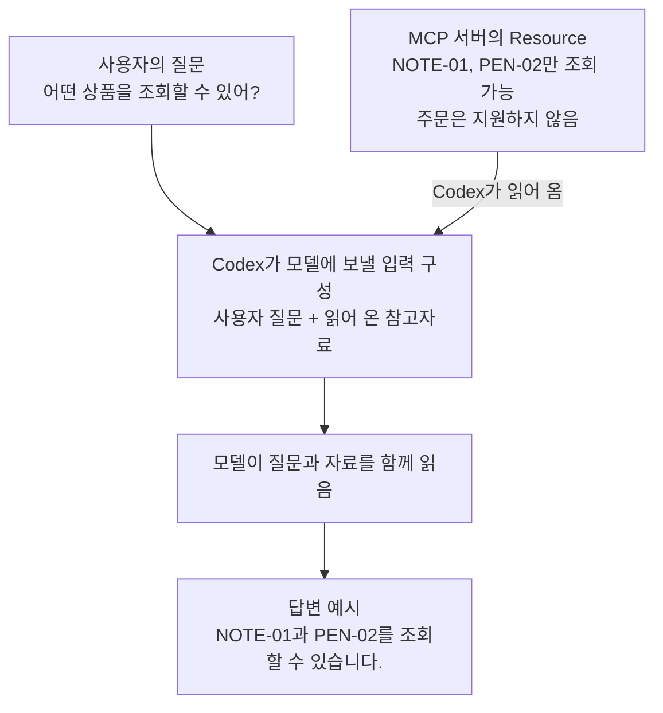
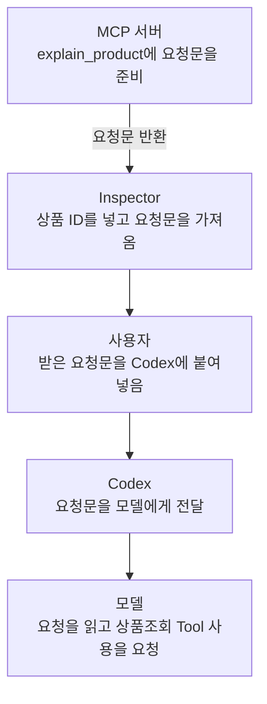

# 3주차 MCP 학습 기록

## Day 1 — Inspector에서 성공과 오류 보기

- 기록일: 2026-09-07
- 대상: 제공된 상품조회 MCP 서버의 `get_product` 도구
- 실습: Inspector에서 세 상품 ID로 `get_product` 호출.

### 입력과 실제 응답

| 입력 `product_id` | 반환된 상품 이름 | `price_krw` | `in_stock` | `isError` | 확인 결과 |
|---|---|---:|---|---|---|
| `NOTE-01` | 연습용 노트 | 3000 | `true` | `false` | 상품 정보 조회 성공, 재고 있음 |
| `PEN-02` | 연습용 펜 | 1500 | `false` | `false` | 상품 정보 조회 성공, 재고 없음 |
| `UNKNOWN` | 반환 없음 | 반환 없음 | 반환 없음 | `true` | 존재하지 않는 상품 ID에 대한 오류 |

정상 두 호출의 `content` 안에는 상품 정보를 담은 텍스트가 있었고, `structuredContent`에도 같은 상품 ID·이름·가격·재고 값이 있었다.

`UNKNOWN` 호출의 실제 오류 문구:

```text
Error executing tool get_product: Unknown product ID. Available: NOTE-01, PEN-02.
```

### 응답을 비교해 확인한 점

- `NOTE-01`과 `PEN-02`는 가격과 재고 상태가 다르지만 두 호출 모두 `isError: false`다. 품절 여부와 조회 성공 여부는 서로 다른 정보다.
- `UNKNOWN`은 상품 정보 대신 `isError: true`와 알 수 없는 상품 ID라는 오류를 반환했다. 서버에서 도구 오류 응답을 받았으므로 이번 결과는 연결 실패와 구별된다.
- 존재하지 않는 상품에는 가격이나 재고 값이 반환되지 않고 에러 메시지만 반환되었다.

**Day 1 완료.**

## Day 2 — Codex에 연결해 같은 요청 보내기

- 기록일: 2026-09-07
- 관련 대화: [get_product로 상품 재고 확인](thread://01a07bf6-6cc2-7010-9bc7-4c787e743711?hostId=local).

### 보낸 요청

```text
learning-catalog의 get_product 도구로 NOTE-01과 PEN-02의 가격과 재고를 확인해 주세요.
실제 도구 응답을 근거로 설명하고 주문은 하지 마세요.
도구를 사용할 수 없으면 파일에서 답을 찾아 대신 성공 처리하지 말고 연결 상태를 알려 주세요.
```

### 실제 도구 호출과 답변 대조

정상 조회 요청에서 Codex는 `learning-catalog` 서버의 `get_product`를 상품별로 한 번씩 호출했다.

| 실제 입력 | 원응답의 상품 이름 | `price_krw` | `in_stock` | `isError` | Codex 최종 답변 | Day 1과 비교 |
|---|---|---:|---|---|---|---|
| `{"product_id":"NOTE-01"}` | 연습용 노트 | 3000 | `true` | `false` | 3,000원·재고 있음 | 일치 |
| `{"product_id":"PEN-02"}` | 연습용 펜 | 1500 | `false` | `false` | 1,500원·재고 없음 | 일치 |

두 원응답의 `content`와 `structuredContent`에 같은 상품 정보가 들어 있었고, 두 호출 모두 `isError: false`였다. 최종 답변은 반환된 가격과 재고 상태를 그대로 설명했으며, 응답에 재고 수량은 포함되지 않았다고 밝혔다. 이 정상 조회 요청의 상품 도구 호출은 두 건이고 주문 동작은 없었다.

### 결과에서 확인한 점

- 서버가 목록에 등록된 상태를 넘어, Codex가 실제 Tool 이름과 `product_id` 인자를 사용해 호출하고 응답을 받은 것을 확인했다.
- Inspector에서 학습자가 직접 호출한 값과 Codex가 호출한 값이 일치했다. 같은 서버의 결과를 Codex가 자연어 답변으로 옮기는 흐름을 대조했다.
- `PEN-02`의 품절 상태도 정상 조회 결과다. Codex는 이를 조회 오류로 바꾸거나 재고가 있다고 설명하지 않았다.
- 반환되지 않은 재고 수량을 추정해 추가하지 않았다.

### 추가 요청 1 — 존재하지 않는 상품의 오류 처리

보낸 요청: `UNKNOWN 상품의 가격을 조회해 줘.`

Codex는 `learning-catalog.get_product`에 `{"product_id":"UNKNOWN"}`을 전달했다. 실제 원응답은 `isError: true`였고, 아래 오류 문구를 반환했다.

```text
Error executing tool get_product: Unknown product ID. Available: NOTE-01, PEN-02.
```

최종 답변은 존재하지 않는 상품 ID라는 오류로 가격을 확인할 수 없다고 설명하고, 조회 가능한 ID인 `NOTE-01`, `PEN-02`를 안내했다. 가격을 만들어 내지 않았으며, 서버에서 받은 조회 오류를 연결 실패와 구별했다. Day 1 Inspector에서 확인한 오류와 일치한다.

### 추가 요청 2 — 조회가 필요 없는 개념 질문

보낸 요청: `MCP가 무엇인지 한 문장으로 설명해 줘.`

해당 요청의 실행 기록에는 도구 호출이 없었다. Codex는 다음 한 문장으로 답했다.

> MCP(Model Context Protocol)는 AI가 `get_product` 같은 외부 도구나 데이터에 연결해 정보를 조회하고 작업을 수행할 수 있도록 정해 놓은 표준 통신 규약입니다.

답변에 `get_product`라는 이름을 예로 든 것은 실제 호출과 다르다. 이 요청은 개념 설명이므로 상품 데이터가 필요하지 않았고, 상품조회 Tool을 불필요하게 사용하지 않았다.

### 요청별 차이

| 확인 조건 | 실제 확인 결과 |
|---|---|
| 정상 조회 | 두 상품의 실제 Tool 입력·응답과 최종 답변이 일치하고, Day 1 Inspector 결과와도 일치 |
| 오류 처리 | `UNKNOWN`을 실제로 호출해 오류를 받고, 가격을 만들어 내지 않고 조회 불가 이유를 설명 |
| 조회가 불필요한 요청 | MCP 개념 질문에 도구 호출 없이 한 문장으로 답변 |

**Day 2 완료.**

## Day 3 — 실행 구조와 Tool·Resource·Prompt 비교

- 기록일: 2026-09-07
- 관련 코드: [실행 설정](learning_lab_server/pyproject.toml), [서버 코드](learning_lab_server/src/learning_lab_mcp/server.py), [실행 안내](learning_lab_server/README.md).

### 1. 실행 명령에서 상품 응답까지

서버 실행 명령은 `uv run --locked ai-ax-learning-lab-mcp`다. Codex의 등록 안내에는 실행 위치가 달라도 프로젝트를 찾도록 `uv --directory <프로젝트 절대 경로> run --locked ai-ax-learning-lab-mcp`를 사용한다. 아래는 파일에서 확인한 경로다.

```text
uv가 지정한 프로젝트에서 서버 명령 실행
→ pyproject.toml의 실행 진입점
→ learning_lab_mcp.server 모듈 로드
→ MCPServer 객체 생성과 Tool·Resource·Prompt 등록
→ main()에서 mcp.run() 실행
→ SDK가 요청 종류·이름에 맞는 등록 함수를 실행
→ 함수 반환값을 MCP 응답으로 전달
→ Codex가 응답을 근거로 최종 답변 작성
```

`pyproject.toml`의 실행 진입점은 명령 이름을 Python 모듈의 함수에 연결한다.

```toml
[project.scripts]
ai-ax-learning-lab-mcp = "learning_lab_mcp.server:main"
```

`server.py`의 `MCPServer("learning-catalog", ...)` 객체에 `@mcp.tool`, `@mcp.resource`, `@mcp.prompt`가 기능을 등록한다. `main()`은 서버 실행을 SDK에 맡긴다.

```python
def main() -> None:
    mcp.run()
```

`get_product`는 입력 ID를 검사하고 상품을 반환한다.

```python
def get_product(product_id: str) -> Product:
    if product_id not in CATALOG:
        raise ValueError("Unknown product ID. Available: NOTE-01, PEN-02.")
    return CATALOG[product_id].model_copy()
```

`NOTE-01`은 사전에 있으므로 `Product`의 복사본을 반환한다. `UNKNOWN`은 사전에 없어 오류가 발생한다. 이 함수는 `content`, `structuredContent`, `isError`를 직접 조립하지 않는다. 함수 등록과 반환값·오류의 MCP 응답 처리는 SDK가 맡는 부분이며, Day 1~2에서 실제 데이터 응답과 오류 응답을 확인했다.

| 코드 위치 | 맡는 역할 | 코드에서 확인한 내용 |
|---|---|---|
| `Product` | 상품 결과의 필드와 타입 | ID·이름은 문자열, 가격은 정수, 재고 여부는 불리언 |
| `CATALOG` | 조회 대상 값 | 노트 3000원·재고 있음, 펜 1500원·재고 없음 |
| `get_product` | ID 검사와 상품 조회 | 없으면 오류, 있으면 상품 모델 복사본 반환 |
| `catalog_help` | 조회 범위에 관한 안내 제공 | `catalog://help`에 등록된 고정 문자열 |
| `explain_product` | 재사용할 요청 문구 생성 | ID를 확인하고 조회를 지시하는 문자열 반환 |

### 2. Tool·Resource·Prompt의 역할과 실제 결과

세 기능은 MCP 서버가 AI 앱에 제공하는 서로 다른 인터페이스다. 이번 서버에서 모두 Python 함수로 작성되어 있어도, 등록 방식과 요청·응답의 의미가 다르다.

여기서 **앱은 사용자가 대화하는 Codex 프로그램**을 뜻한다. 모델과 앱은 역할이 다르다. 아래 그림에서는 다음 이름으로 구분한다.

| 대상 | 이번 예제에서 맡는 역할 |
|---|---|
| Codex 앱 · Host | 사용자 입력과 대화를 관리하고, 모델에 입력을 보내며, MCP 서버와 요청·응답을 주고받는다. 모델의 답변을 화면에 표시한다. |
| GPT 모델 | 전달받은 질문·자료를 읽고, 답변이나 필요한 Tool 호출 요청을 생성한다. |
| MCP 서버 · Python | `get_product`를 실행하거나 `catalog://help`의 자료, `explain_product`의 요청 메시지를 반환한다. |
| Inspector | 사람이 MCP 서버의 기능을 직접 요청하고 응답을 확인하는 테스트 도구다. |

#### Tool — 이름과 인자로 요청하는 실행 기능

Tool은 서버가 수행할 동작을 이름·설명·입력 스키마와 함께 공개한 것이다. 모델이 상황에 맞는 도구와 인자를 선택하면 Host의 MCP Client가 `tools/call`을 보내고, 서버가 기능을 실행해 결과를 돌려준다. 조회·계산뿐 아니라 서버가 구현한 파일 수정이나 주문도 Tool로 제공할 수 있다. [Tool 명세](https://modelcontextprotocol.io/specification/2026-07-28/server/tools)

이번 `get_product`는 조회 전용 Tool이다. `{"product_id":"NOTE-01"}`을 받으면 `CATALOG`에서 해당 상품을 찾아 `Product`를 반환한다. 모델이 상품값을 만들어 내는 것이 아니라 Python 함수가 반환한 값을 답변의 근거로 사용한다. Tool이라는 이름이 쓰기 권한이나 정확한 답변 자체를 보장하지는 않는다.


Day 2의 조회 흐름이다. 모델이 호출할 도구와 인자를 요청하고, Codex가 MCP 서버에 실제 요청을 전달하며, 서버가 반환한 결과를 모델이 답변에 사용한다.

#### Resource — URI로 읽어 문맥에 보태는 자료

Resource는 서버가 URI로 식별하여 제공하는 자료다. Client가 `resources/read`로 내용을 가져오면 Host는 이를 모델의 참고 문맥에 넣거나 사용자에게 보여 줄 수 있다. 문서·파일·DB 스키마·현재 상태 등 여러 자료를 제공할 수 있고, 정적 문자열에 한정되지 않는다. URI에 따라 내용을 조회하거나 동적으로 만들 수도 있다. 목록에 존재하는 모든 Resource가 자동으로 모델에 전달되는 것은 아니다. [Resource 명세](https://modelcontextprotocol.io/specification/2026-07-28/server/resources)

이번 `catalog://help`는 상품조회 서버의 사용 범위를 알려 주는 자료다. 읽으면 두 ID와 주문 미지원 안내를 받는다. 이것이 안내문인 이유는 이번 서버가 그렇게 구현했기 때문이며, Resource 전체가 도움말 전용이라는 뜻은 아니다. 상품 상세를 URI로 읽는 Resource를 설계할 수도 있다. Tool도 데이터를 조회할 수 있으므로 두 개념의 구분은 데이터가 있느냐가 아니라, 이름·인자로 기능을 실행하는 인터페이스인가, URI로 자료를 읽는 인터페이스인가에 있다.

이때 **참고 문맥에 넣는다**는 말은 질문과 함께 모델이 읽을 입력에 자료를 포함한다는 뜻이다. 예를 들어 Codex가 `catalog://help`의 응답을 가져와 질문과 함께 전달하면, 모델은 두 ID와 주문 미지원 안내를 읽고 답변할 수 있다. “앱이 읽는다”는 것은 프로그램이 서버에 자료를 요청하고 응답을 받는다는 의미이고, 그 자료를 바탕으로 답변을 만드는 역할은 모델이 맡는다.



그림은 Resource를 질문과 함께 모델에 전달하는 활용 예시다. 질문만 보내면 항상 이 Resource를 자동으로 읽는다는 뜻은 아니다.

#### Prompt — 인자를 채워 사용하는 재사용 메시지 템플릿

Prompt는 사용자가 선택한 작업을 모델에 요청하기 위한 메시지 템플릿이다. 이름과 인자를 담은 `prompts/get` 요청에 대해 서버는 인자를 반영한 메시지 목록을 반환하고, Host는 이를 모델과의 대화에 사용할 수 있다. 일반 대화에서 직접 입력한 요청과 달리, MCP Prompt는 서버가 이름을 붙여 공개하고 재사용할 수 있게 제공한다. [Prompt 역할 설명](https://modelcontextprotocol.io/docs/2026-07-28/learn/server-concepts#prompts)

이번 `explain_product`는 `NOTE-01`을 넣으면 상품을 조회하고 설명하라는 사용자 역할의 메시지를 만든다. 가격을 조회하는 코드나 모델에게 답변을 생성시키는 코드는 이 함수에 없다. 이번 Prompt를 활용해 조회까지 진행하려면 반환 문구를 Codex에 전달하고 별도의 `get_product` 호출이 이루어져야 한다. “주문하지 마세요”라는 문구도 지시이며 주문 권한을 차단하는 장치는 아니다. 이 서버가 주문하지 않는 직접 근거는 주문 기능을 제공하지 않고 조회 함수에도 쓰기 동작이 없다는 코드다.

이번에 사용한 Inspector에서는 `explain_product`와 `product_id=NOTE-01`을 지정해 요청문을 가져왔다. 서버는 미리 작성된 틀에 상품 ID를 넣어 사용자 역할의 메시지를 돌려준다. 이 단계에서 모델에 요청문이 전달되거나 상품 조회가 실행되는 것은 아니다.



Inspector에서 받은 요청문을 Codex에 붙여 넣는 활용 예시다. 그림에서 붙여 넣기 이후의 흐름은 실제 실행 기록이 아니다.

따라서 이번 Prompt는 **인자를 넣어 받아서 실제 요청으로 사용할 수 있는 문구**다. `NOTE-01` 대신 `PEN-02`를 넣으면 같은 요청 틀에서 상품 ID가 달라진다. 사용자는 매번 조회 방법과 설명할 항목을 새로 쓰지 않고, 서버가 준비한 요청을 가져와 사용할 수 있다.

공식 설명의 Tool은 모델 주도, Resource는 앱 주도, Prompt는 사용자 주도라는 구분은 전형적인 사용 방식을 가리킨다. 각각 모델이 실행할 기능을 선택하고, 앱이 어떤 자료를 문맥으로 제공할지 정하며, 사용자가 재사용할 요청을 고르는 방식이다. 실제 선택 화면·승인·사용 방법은 Host 구현에 따라 달라지며 이 구분 자체가 접근 권한 규칙은 아니다. [서버 기능 개요](https://modelcontextprotocol.io/docs/2026-07-28/learn/server-concepts)

세 기능이 항상 함께 실행되거나 정해진 순서로 이어지는 것도 아니다. Day 2에서는 사용자가 직접 상품조회를 요청했고 Codex가 Tool을 호출했다. MCP Prompt를 먼저 가져오는 단계는 없었다.

#### 실제 요청·응답 비교

| 구분 | 실제 요청 | 실제 반환 내용 | 확인 경로 |
|---|---|---|---|
| Tool | `get_product`, `{"product_id":"NOTE-01"}` | `product_id: NOTE-01`, `name: 연습용 노트`, `price_krw: 3000`, `in_stock: true`, `isError: false` | 현재 Codex의 MCP 연결 |
| Resource | `resources/read`, URI `catalog://help` | `mimeType: text/plain`의 사용 안내 | 현재 Codex의 Resource 읽기와 Inspector CLI stdio 연결 |
| Prompt | `prompts/get`, 이름 `explain_product`, 인자 `product_id=NOTE-01` | `role: user`, `type: text`의 요청 문구 | Inspector CLI stdio 연결 |

Resource의 실제 본문:

```text
연습용 고정 자료입니다. NOTE-01, PEN-02만 조회할 수 있고 주문은 지원하지 않습니다.
```

Prompt의 실제 메시지 본문(원문 그대로):

```text
get_product로 NOTE-01를 조회하고 가격과 재고를 설명하세요. 주문하지 마세요.
```

Tool 응답의 `price_krw: 3000`은 Day 2 답변의 “3,000원”을, `in_stock: true`는 “재고 있음”을 뒷받침한다. Resource에는 조회 가능한 ID와 주문 미지원 안내가 있지만 해당 상품의 가격은 없다. Prompt에는 조회하라는 문장이 있지만 조회 결과인 가격·재고 값은 없다.

특히 `explain_product`의 반환문은 다음과 같다.

```python
return f"get_product로 {product_id}를 조회하고 가격과 재고를 설명하세요. 주문하지 마세요."
```

따옴표 안의 `get_product`는 함수 호출이 아니라 문장에 들어갈 글자다. 함수 본문에는 `get_product(...)` 호출이나 상품 가격을 꺼내는 처리가 없다. 따라서 **Prompt를 가져온 것만으로 상품 조회가 실행된 것은 아니다.** 이번 Prompt 응답도 상품 객체 대신 사용자 역할의 메시지를 담았다. 그 문구를 AI가 받아 실제 조회를 수행하는 것은 별도의 Tool 호출 단계다.

### 3. 구조에서 배운 점

- 실행 설정은 어떤 프로그램을 시작할지, `get_product`는 받은 ID를 어떻게 처리할지를 맡는다. 그래서 연결 경로 문제와 조회 입력 문제를 서로 다른 위치에서 살펴볼 수 있다.
- `Product`는 결과의 형태, `CATALOG`는 실제 값을 맡는다. 배송일처럼 새 필드를 추가하는 일과 기존 가격을 고치는 일의 수정 범위가 다르다. 현재 반환 필드만으로 배송일이나 재고 수량을 설명할 수는 없다.
- 데이터와 요청 문구가 나뉘어 있어 사실의 변경과 설명 방식의 변경을 구별할 수 있다. 예를 들어 `CATALOG`의 노트 가격만 3500원으로 바꾸고 서버를 새로 실행하면 Tool 결과의 가격이 달라질 것으로 예상한다. 가격을 포함하지 않는 Resource·Prompt의 문자열은 그대로일 것이다. 이는 코드에 근거한 예상이며 이번에는 가격을 수정하거나 이 변경을 실행하지 않았다.
- `model_copy()`는 저장된 상품 모델 자체 대신 복사본을 반환한다. 현재처럼 단순한 필드로 된 모델에서는 반환 객체의 변경과 사전의 원본을 분리하는 효과를 해석할 수 있다. 작성자가 이 방식을 선택한 의도까지 확인한 것은 아니다.
- 조회 전용이라는 판단의 직접 근거는 고정 사전을 읽어 복사본을 반환하고 주문·파일 쓰기·외부 서비스 작업을 하지 않는 구현이다. `readOnlyHint=True`라는 표시만으로 모든 서버의 권한이나 동작을 판단하지 않는다.

## Day 3–4 — 예산·재고 조회 구현과 검증

- 기록일: 2026-09-08
- 선택한 요구: 기존 `CATALOG`에서 예산 이하의 상품 후보를 찾는다. `max_price_krw`는 필수인 0 이상 정수, `in_stock_only`는 기본값 `true`다. 결과는 상품 목록이며, 해당 상품이 없으면 빈 목록, 음수 예산이나 잘못된 형식은 입력 오류로 처리한다. 주문·재고 변경은 허용하지 않는다.
- 변경 파일: [서버 코드](learning_lab_server/src/learning_lab_mcp/server.py), [기능 테스트](learning_lab_server/tests/test_server_contract.py), [프로젝트 사용 안내](learning_lab_server/README.md).

### 사용한 요청

```text
Day 3 기본 실습으로 find_products Tool을 만들어 주세요.

기존 CATALOG에서 최대 예산 이하인 상품을 찾습니다.
max_price_krw는 0 이상 정수,
in_stock_only는 기본값 true로 해주세요.
결과는 상품 목록, 해당 상품이 없으면 빈 목록,
음수 예산은 입력 오류로 처리합니다. 조회만 허용합니다.

바꿀 코드와 그 이유를 설명하고 구현·관련 테스트를 진행해 주세요.
기존 get_product와 학습 기록은 보존하세요.
이후 Inspector에서 새 Tool을 직접 호출하도록 안내해 주세요.
```

### 요청을 구현 구조로 연결한 방식

| 요청에 담긴 요구 | 만들어진 구조와 처리 위치 | 실제 검증에서 확인한 동작 |
|---|---|---|
| 기존 `CATALOG`에서 예산 이하인 상품 찾기 | `server.py`의 새 `find_products`가 `CATALOG.values()`를 읽고 `product.price_krw <= max_price_krw`로 후보를 고른다. | Inspector에서 예산 3000에 가격 3000인 노트가 포함됐다. 테스트에서도 1500원 경계의 펜 포함과 1499원에서 제외를 확인했다. |
| 예산은 0 이상 정수, 음수는 입력 오류 | `max_price_krw`에 `Annotated[int, Field(ge=0, strict=True)]`를 사용해 SDK가 MCP 호출 인자를 검사하게 했다. | 테스트에서 예산 0은 정상 빈 목록이었고, Inspector의 -1 호출은 `isError: true`와 예산 검증 오류를 반환했다. |
| `in_stock_only` 기본값은 `true` | 선택 인자의 기본값을 `True`로 두고 `(not in_stock_only or product.in_stock)`를 가격 조건과 함께 적용했다. | Inspector에서 재고 인자를 생략한 예산 3000 호출은 노트만 반환했다. 예산 2000에서 `true`는 빈 목록, `false`는 품절인 펜을 반환했다. |
| 상품 목록 반환, 해당 상품이 없으면 빈 목록 | 함수 반환형은 `list[Product]`이고 조건을 통과한 상품만 목록에 넣는다. SDK가 이 목록을 `structuredContent.result`로 감싼다. | Inspector에서 해당 상품이 없을 때 `result: []`, `isError: false`를 확인했다. 빈 결과를 입력 오류와 구분했다. |
| 조회만 수행하고 기존 `get_product` 보존 | 기존 함수는 유지하고 같은 서버에 새 Tool을 등록했다. 반환에는 `model_copy()`를 사용했으며 주문·재고 수정 동작을 추가하지 않았다. | 반환 객체를 수정해도 `CATALOG`는 그대로였다. 기존 상품 조회 결과도 유지됐다. |

### 필터 구조

`get_product`는 알고 있는 ID 한 건을 찾고, `find_products`는 예산·재고 조건으로 후보를 찾는다. 두 Tool은 같은 `CATALOG`와 `Product`를 사용한다.

입력의 `Annotated[int, Field(ge=0, strict=True)]`에서 `ge=0`은 음수를 거부하고, `strict=True`는 문자열·실수·불리언을 예산 정수로 자동 변환하지 않도록 한다. 재고 조건도 불리언만 허용하며 생략하면 `True`가 적용된다. SDK가 입력 스키마를 만들고 MCP 호출의 인자를 검사하므로 함수 본문은 상품 필터에 집중한다. 이 제약은 MCP 요청 경로의 검증이며, Python 함수를 직접 호출할 때 타입 주석만으로 검증이 실행되는 것은 아니다. [SDK 입력 제약](https://py.sdk.modelcontextprotocol.io/servers/tools/#richer-schemas-with-field)

필터와 반환 부분:

```python
return [
    product.model_copy()
    for product in CATALOG.values()
    if product.price_krw <= max_price_krw
    and (not in_stock_only or product.in_stock)
]
```

`<=`이므로 예산과 가격이 같아도 포함한다. 재고 조건이 `True`이면 재고가 있는 상품만 통과하고, `False`이면 재고 여부에 관계없이 가격 조건으로 고른다. 후보를 고르는 판단은 서버 함수가 수행한다. 반환 목록은 상품 사전의 순서를 유지하며, 각 상품은 복사본이므로 반환 객체를 고쳐도 사전 원본이 바뀌지 않는다.

반환형은 `list[Product]`다. 실제 MCP 응답에서는 SDK가 목록을 `structuredContent.result`에 넣었다. 빈 결과는 `content: []`, `structuredContent: {"result": []}`, `isError: false`였고, 음수 예산의 오류와 구분됐다. [SDK 목록 반환 설명](https://py.sdk.modelcontextprotocol.io/servers/structured-output/#lists)

### Day 4 검증 — 입력에 따른 결과

| Inspector 입력 | 실제 반환 내용 | `isError` |
|---|---|---|
| `find_products`, `{"max_price_krw":3000}` | `NOTE-01`, 연습용 노트, 3000원, 재고 `true` | `false` |
| `find_products`, `{"max_price_krw":2000,"in_stock_only":true}` | `structuredContent.result: []` | `false` |
| `find_products`, `{"max_price_krw":2000,"in_stock_only":false}` | `PEN-02`, 연습용 펜, 1500원, 재고 `false` | `false` |
| `find_products`, `{"max_price_krw":-1}` | `max_price_krw` 검증 오류, 상품 목록 없음 | `true` |
| `get_product`, `{"product_id":"NOTE-01"}` | 기존과 같은 노트 3000원·재고 `true` | `false` |

이 결과에서 예산 3000원에 같은 가격의 노트가 포함된 것은 요청의 “이하” 조건이 `<=`로 구현됐다는 근거다. 예산을 2000원으로 고정하고 재고 조건만 바꿨을 때 빈 목록에서 펜으로 달라졌으므로, 품절 포함 여부가 실제 후보 선택에 반영되는 것을 확인했다. 유효한 입력의 빈 목록은 성공 응답이고 음수 예산은 오류 응답이어서, 요청에 있던 두 실패·결과 조건도 서로 구분됐다.

음수 예산의 실제 오류 본문에서 확인한 부분:

```text
Error executing tool find_products: 1 validation error for find_productsArguments
max_price_krw
  Input should be greater than or equal to 0 [type=greater_than_equal, input_value=-1, input_type=int]
```

음수 예산은 조건에 맞는 상품이 없는 상태가 아니라 입력 조건을 위반한 상태이므로 `isError: true`다.

### 직접 호출해 본 결과

Inspector에서 예산 `3000`, 재고 조건 `true`로 호출하니 `NOTE-01` 한 건이 반환됐다. 이름은 `연습용 노트`, `price_krw`는 `3000`, `in_stock`은 `true`였다.

예산과 가격이 같은 상품도 포함되며, 재고 조건도 적용됐다.

**Day 3–4 완료.**

## Day 5 — 만든 기능의 Codex 사용과 구매 검토 확장

### 1. 만든 기능을 다른 요청으로 사용하기

- 기록일: 2026-09-08
- 관련 대화: [품절 포함 2000원 이하 상품 찾기](thread://01a07c96-cd00-7ab1-aaf2-ecc8655479bc?hostId=local).

보낸 요청:

```text
학습용 상품 목록에서 품절 상품도 포함해 2000원 이하 후보를 보여 주세요.
```

Codex는 `learning-catalog.find_products`를 다음 인자로 한 번 호출했다.

```json
{"max_price_krw":2000,"in_stock_only":false}
```

“2000원 이하”는 예산 인자로, “품절 상품도 포함”은 기본 재고 제한을 해제하는 `in_stock_only: false`로 전달됐다. 서버의 기존 예산·재고 필터를 같은 코드로 재사용했다.

| 확인 대상 | 실제 결과와 해석 |
|---|---|
| 도구 원응답 | `structuredContent.result`에 `PEN-02` 한 건. 이름은 `연습용 펜`, `price_krw: 1500`, `in_stock: false`. `isError: false`였다. |
| 최종 답변 | 후보 1개로 `PEN-02 / 연습용 펜 / 1,500원 / 품절`을 표시하고 사용한 Tool과 인자를 밝혔다. |
| 요청·응답·답변 대조 | 예산 이하인 품절 상품이 포함됐고, 가격과 품절 상태가 최종 답변에도 보존됐다. Day 3–4 Inspector CLI의 같은 조건 결과와 일치했다. |

**Day 5의 1번 완료.**

### 2. 구매 검토 Tool 구현과 검증

- 기록일: 2026-09-08
- 요청 범위: 기존 서버와 `CATALOG`에 `review_purchase(items, budget_krw)`를 추가한다. 상품 ID·수량 목록과 예산을 받아 상품별 단가·수량·소계, 총액, 예산 초과 여부·초과액, 품절 상품 목록을 반환한다. 품절도 금액에 포함하고, 없는 ID가 하나라도 있으면 전체 오류로 처리한다. 빈 목록·잘못된 수량·예산도 오류다. 주문·재고 변경은 하지 않는다.
- 사용 자료: 노트 3000원·펜 1500원. 상품 가격은 변경하지 않는다.
- 변경 위치: [서버 코드](learning_lab_server/src/learning_lab_mcp/server.py), [새 구매 검토 테스트](learning_lab_server/tests/test_review_purchase.py), [사용 안내](learning_lab_server/README.md).

#### 구현을 요청한 프롬프트

```text
review_purchase Tool을 만들어 주세요.

기존 MCP 서버와 CATALOG를 이용해 여러 상품과 수량의 예상 금액을 계산합니다.
입력은 상품 ID·수량 목록(items)과 예산(budget_krw)입니다.
수량은 1 이상 정수, 예산은 0 이상 정수로 받습니다.

상품별 단가·수량·소계, 예상 총액, 예산 초과 여부·초과액,
품절 상품 목록을 반환해 주세요.
품절 상품도 예상 금액에 포함하되 따로 표시합니다.
총액이 예산과 같으면 초과가 아닙니다.

모르는 상품 ID가 하나라도 있으면 전체 요청을 오류로 처리하고,
일부 상품만 계산한 금액을 완전한 견적처럼 반환하지 마세요.
빈 상품 목록이나 잘못된 수량·예산도 입력 오류로 처리합니다.
금액은 서버가 현재 상품 가격으로 계산하며, 주문이나 재고 변경은 하지 않습니다.

정상 예시는 NOTE-01 두 개와 PEN-02 한 개, 예산 8000원입니다.
현재 자료에서는 총액 7500원, 예산 초과 없음, 품절 상품 PEN-02가 예상됩니다.

바꿀 코드와 그 이유를 설명하고 구현·관련 테스트를 진행해 주세요.
기존 get_product, find_products와 학습 기록은 보존하세요.

상품 가격을 변경하지 마세요.
```

#### 선택한 구조와 이유

단건 조회, 후보 검색, 수량을 반영한 금액 검토는 필요한 입력과 결과가 달라 별도 Tool로 나뉜다. `review_purchase`는 선택한 상품과 수량의 금액을 계산하고, 통신과 응답 포장은 MCP SDK가 맡는다.

- `PurchaseItem`: 상품 ID와 수량 입력을 묶는다. `quantity`의 `Field(ge=1, strict=True)`는 1 이상 정수만 받는다. 항목의 추가 필드를 거부하므로 호출자가 단가를 전달해 계산에 끼워 넣을 수 없다.
- `items`의 `min_length=1`과 `budget_krw`의 `Field(ge=0, strict=True)`: 빈 목록과 음수 예산을 거부한다. 수량·예산의 문자열, 실수, 불리언도 자동 변환하지 않는다. 이 검사는 MCP 요청을 받을 때 SDK가 수행하며 Python 타입 주석만으로 일반 함수 직접 호출까지 검증하는 것은 아니다.
- `PurchaseLine(Product)`: 기존 상품 결과의 ID·이름·단가(`price_krw`)·재고 필드를 재사용하고 수량과 `subtotal_krw`를 더한다. `CATALOG`의 객체를 수정하지 않고 새 결과 객체를 만든다.
- `review_purchase`: 계산 전에 전체 입력에서 모르는 ID를 찾는다. 하나라도 있으면 `ValueError`를 발생시키고 SDK가 `isError: true`로 전달한다. 상품별 소계나 합계가 담긴 `structuredContent`는 반환하지 않는다.
- 금액 계산: 서버가 `product.price_krw * item.quantity`로 소계를 계산해 더한다. `total_krw > budget_krw`일 때만 초과이고, 초과액은 `max(total_krw - budget_krw, 0)`이다. 품절 여부는 합계에서 제외하는 조건으로 사용하지 않는다.
- `PurchaseReview`: 상품별 결과, 예산, 총액, 초과 여부·초과액, 품절 ID 목록을 한 객체로 반환한다. 같은 상품을 여러 줄에 보내면 각 줄을 유지해 합산하고, 품절 ID는 입력 순서로 한 번씩 표시한다. 결과는 `structuredContent`의 최상위 필드에 있으며 `find_products`의 목록 결과처럼 `result`로 감싸지 않는다.

#### 정상 입력과 응답

`review_purchase`의 입력과 Inspector CLI 응답:

```json
{"items":[{"product_id":"NOTE-01","quantity":2},{"product_id":"PEN-02","quantity":1}],"budget_krw":8000}
```

```json
{
  "items": [
    {"product_id":"NOTE-01","name":"연습용 노트","price_krw":3000,"in_stock":true,"quantity":2,"subtotal_krw":6000},
    {"product_id":"PEN-02","name":"연습용 펜","price_krw":1500,"in_stock":false,"quantity":1,"subtotal_krw":1500}
  ],
  "budget_krw": 8000,
  "total_krw": 7500,
  "over_budget": false,
  "over_budget_krw": 0,
  "out_of_stock_product_ids": ["PEN-02"]
}
```

노트 2개의 6000원에 펜 1개의 1500원을 더해 총액은 7500원이다. 품절인 펜도 금액에 포함되며, `out_of_stock_product_ids`에 따로 표시된다. 예산 8000원 안에 들어가므로 초과액은 0원이다.

#### 조건을 바꿨을 때의 결과

| Inspector CLI 입력 | 반환 결과 | `isError` |
|---|---|---|
| 노트 2개·펜 1개, 예산 8000 | 총액 7500, 초과 없음·초과액 0, 품절 PEN-02 | `false` |
| 같은 목록, 예산 7500 | 총액 7500, 초과 없음·초과액 0 | `false` |
| 같은 목록, 예산 7499 | 총액 7500, 1원 초과 | `false` |
| 노트 2개 뒤에 UNKNOWN 1개, 예산 8000 | Unknown product ID 오류, 견적 객체 없음 | `true` |
| 노트 수량 0, 예산 8000 | `items.0.quantity` 입력 오류, 견적 객체 없음 | `true` |
| 노트 2개·펜 1개, 예산 -1 | `budget_krw` 입력 오류, 견적 객체 없음 | `true` |
| 빈 목록, 예산 8000 | `items` 입력 오류, 견적 객체 없음 | `true` |
| 기존 `get_product`, NOTE-01 | 단가 3000, 재고 있음 | `false` |
| 기존 `find_products`, 예산 2000·품절 포함 | PEN-02, 단가 1500, 품절 | `false` |

없는 상품이 섞인 요청의 실제 오류:

```text
Error executing tool review_purchase: Unknown product ID(s): UNKNOWN. No purchase estimate was calculated.
```

모르는 상품이 섞이면 정상 상품인 노트의 부분 금액도 반환하지 않는다. 품절이나 예산 초과는 계산 결과에 표시하지만, 잘못된 입력은 `isError: true`로 구분된다.
