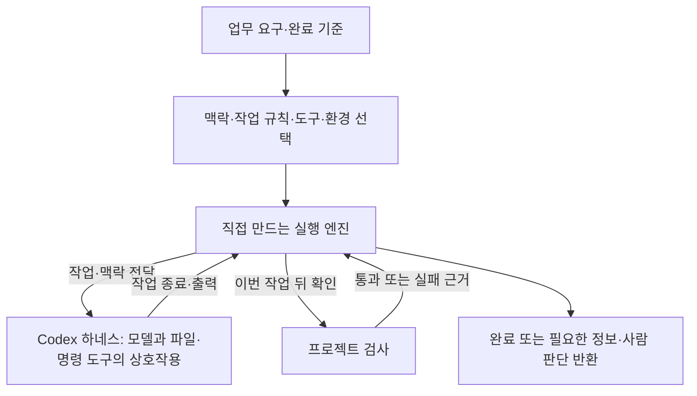

# 5주차 — 개발 하네스 v1: 작업 환경과 실행 흐름 설계하기

> 이 README가 이번 주차의 상세 학습 본문입니다. 루트 `CURRENT_WEEK.md`는 여기로 돌아오는 짧은 대시보드입니다.

- 기본 작업 폴더: [`quality_demo`](quality_demo/)
- 전체 과정: [루트 README](../README.md)
- 현재 위치와 다음 명령: [CURRENT_WEEK](../CURRENT_WEEK.md)


이번 주에는 **AI가 무엇을 알고, 어떤 도구와 규칙으로 작업하며, 결과를 어떻게 확인하고 이어갈지** 설계합니다. 필요한 맥락·작업 지침·도구·실행 환경·검사·피드백을 연결하고, 그 안에서 작업의 시작·복구·종료를 조율할 작은 실행 엔진을 AI와 만듭니다. 이렇게 구성한 개발 절차 전체가 하네스 v1의 결과입니다.

환불·배치 업무와 입력·기대값은 `quality_demo/`에 완성해서 제공합니다. 이 자료로 하네스의 각 요소가 필요한 이유를 이해하고, 작업에 맞는 구성과 엔진의 중심 계약·구조를 선택합니다. AI의 설계안과 구현 도움을 사용하며, 선택한 맥락·규칙·실행 흐름이 실제 결과에 어떻게 연결됐는지 판단합니다. 참고 엔진의 실행 성공이나 정해진 인터페이스 구현만으로 자신의 설계를 완료했다고 판단하지 않습니다.

| Day | 중심 질문 | 실제 결과 |
|---:|---|---|
| 1 | 이 작업에 어떤 맥락·규칙·도구·검사가 필요하며 누가 연결하는가? | 업무 요구에서 도출한 하네스 구성과 실행 책임 |
| 2 | 같은 요구를 어떤 구조로 표현할 수 있는가? | 두 완성 예제의 구조 비교와 내 설계 방향 |
| 3 | 선택한 맥락·규칙·도구·검사를 어떤 실행 흐름으로 연결하는가? | 자기 작업 입력과 엔진·진입점을 가진 하네스 v1 |
| 4 | 실제 작업·검사 실패·피드백이 올바른 다음 행동으로 이어지는가? | 실제 정상 실행과 핵심 실패의 해석·필요한 수정 |
| 5 | 이 구조를 선택한 이유와 바꿔야 하는 조건은 무엇인가? | 완성된 v1과 선택·실행 근거의 연결 |

## 하네스란 무엇인가

### 모델의 응답을 실제 작업으로 연결하는 실행 체계

**하네스(harness)는 모델이 작업을 수행하도록 맥락과 도구를 제공하고, 실행 조건·진행 상태·결과·후속 행동을 연결하는 주변 실행 체계입니다.** 개발 하네스에서는 그 작업이 코드 읽기·수정·실행·검토입니다. 특정 프레임워크나 정해진 폴더 이름을 뜻하지 않으며, 목적에 맞게 기존 실행 도구와 프로젝트 자료·설정을 조합해 구성할 수 있습니다.

모델은 전달받은 정보에서 응답이나 도구 호출 요청을 생성합니다. 파일을 실제로 읽고 바꾸는 동작, 명령을 실행하는 환경, 도구 결과를 다음 모델 요청에 포함하는 처리는 모델 주변의 소프트웨어가 맡습니다. 이 때문에 같은 모델이라도 어떤 자료를 전달하고 어떤 도구를 연결하며 언제 결과를 확인하게 하는지에 따라 수행할 수 있는 작업과 결과가 달라집니다. Codex의 하네스도 맥락·대화 상태, 도구 실행, 설정된 실행 정책 등을 담당합니다. [OpenAI 공식 문서: Codex 하네스의 역할](https://developers.openai.com/blog/codex-as-a-platform)

예를 들어 “환불 배치를 확인해 주세요”라는 요구에는 아직 여러 결정이 남아 있습니다. 어떤 코드와 입력을 볼지, 입력 오류도 결과에 남겨야 하는지, 어떤 명령으로 확인할지, 검사 실패 뒤 무엇을 다시 전달할지가 정해져야 합니다. **그 결정을 자료·지침·도구·실행 흐름으로 만들고 서로 연결하는 일이 하네스 설계**입니다. 실행 루프가 있어도 잘못된 기대값을 쓰면 잘못된 완료를 반환할 수 있고, 정확한 기준이 문서에 있어도 실행에 전달되지 않으면 판단 근거로 쓰이지 못합니다.

### 하네스를 구성하는 요소와 필요한 이유

다음은 이번 개발 작업에서 나누어 볼 책임입니다. 각 행이 별도 서비스나 새 파일이어야 한다는 뜻은 아닙니다.

| 구성 요소 | 정해야 할 내용 | 제공 배치에서의 의미 |
|---|---|---|
| 맥락 | 지금 판단에 필요한 요구·코드·자료·이전 결과 | 작업 목적과 `harness/contract.md`를 전달하고 해당 코드·입력을 읽게 함 |
| 작업 규칙 | 작업 중 지킬 절차와 기준 | `AGENTS.md`의 기대값을 낮추지 않는 규칙, 실제 결과에 근거한 수정·보고 |
| 도구와 실행 환경 | 가능한 동작, 실행 위치·의존성·권한 | Codex의 파일·명령 도구, 작업 폴더, JDK·Gradle, 설정된 실행 범위 |
| 실행 제어 | 어떤 조건에서 시작하고 다음 행동으로 갈지 | 작업 준비 → Codex 실행 → 프로젝트 검사라는 순서 |
| 검증과 피드백 | 무엇을 수용 근거로 삼고 차이를 어떻게 전달할지 | 8개 요청의 결과를 검사하고 누락·불일치를 다음 수정 요청에 포함 |
| 상태와 기록 | 현재 진행과 다음 판단에 필요한 정보를 어떻게 유지할지 | 시도 수·검사 결과·종료 이유를 보관하고 이번 실행 결과를 식별 |
| 복구·사람 개입·종료 | 자동으로 다시 할 범위와 사람이 결정할 조건 | 검사 실패는 근거를 붙여 최대 한 번 복구, 정보 부족·해결 불가는 이유를 반환 |

맥락은 저장소 전체를 매번 복사한 내용이 아닙니다. 이 작업을 판단하는 데 필요한 정보입니다. 참고 예제의 `Job.prompt()`는 작업 목적에 `context_files`의 **실제 본문**을 붙여 전달합니다. 배치 입력과 코드는 작업 폴더에서 Codex가 도구로 읽습니다. 따라서 `harness/contract.md`를 저장해 두는 것과 그 기준이 이번 실행에 전달되는 것은 구분해야 합니다. 자료가 늘어나면 처음부터 전달할 핵심 기준과 필요할 때 읽을 상세 자료를 나눌 수 있습니다.

상태도 맥락과 쓰임이 다릅니다. `attempts`는 엔진이 복구 상한을 판단할 값이고, 실패 출력은 모델이 수정할 대상을 이해하는 근거입니다. 참고 예제의 `.local/reference-engine/current.json`은 이번 실행의 결과를 보여 주는 기록입니다. 다음 실행을 그 지점에서 재개하는 기능은 구현하지 않았습니다. 기록을 남긴다고 자동으로 기억·재개 기능이 생기는 것은 아니며, 다음 작업에서 쓸 정보는 언제 저장하고 다시 읽을지까지 연결해야 합니다.

### 요청문·작업 규칙·실행 코드의 차이

요청문은 이번에 만들 결과를 전달합니다. 작업 규칙은 여러 작업에서 반복할 판단 기준을 전달합니다. 예를 들어 `AGENTS.md`의 “기대값을 현재 출력에 맞춰 낮추지 않는다”는 문장은 모델이 수정 방향을 판단하는 지침입니다. 그 문장을 읽는 기능과 실제 검사 실행은 별도의 동작입니다.

참고 엔진은 Codex 작업이 끝나면 지정한 검사 명령을 직접 실행하고, 그 결과를 받아 완료·복구·중단으로 분기합니다. “검사한 뒤 끝내라”는 문장을 전달하는 것과 “이번 검사가 통과한 경우에만 성공을 반환한다”는 실행 경로를 코드로 연결하는 것은 서로 다른 책임을 맡습니다. 또한 검사가 통과해도 검사에 없는 요구까지 맞았다고 보장되지는 않습니다. **규칙의 내용, 그 규칙을 확인할 근거, 근거에 따라 움직이는 제어가 함께 맞아야 합니다.**

권한도 같은 방식으로 구분합니다. 지침은 어떤 행동이 적절한지 설명하고, 실행 환경의 권한 정책은 실제로 허용되는 동작을 제한합니다. 엔진은 그 범위 안에서 실행을 요청하며, 권한 부족을 만났을 때 필요한 판단을 반환합니다. 지침 파일이나 복구 루프를 추가한다고 실행 권한이 생기지는 않습니다.

### Codex 하네스와 직접 만드는 실행 엔진

여기서 **실행 엔진**은 개발 작업 한 건의 준비·실행·검사·후속 행동을 조율하는 코드입니다. 이번 설계에서 하네스의 실행 제어를 맡는 구성 요소이며, 하네스 전체와 같은 뜻으로 사용하지 않습니다. 맥락·지침·도구·환경·검사도 엔진과 연결되어 실제로 작동해야 합니다.



그림의 엔진을 중심으로 자료·도구·검사와 결과 반환이 연결된 전체가 이번 개발 하네스입니다. Codex 내부에서는 모델의 도구 선택과 실제 도구 실행이 반복됩니다. 그 바깥의 자기 엔진에서는 Codex 작업 한 번을 실행 단위로 삼고, 업무 검사를 언제 실행하며 실패 뒤 무엇을 할지 결정합니다. 작업을 표현하는 방법과 이 외부 흐름의 구조는 직접 선택합니다.

1주차의 요청과 실행 관찰은 맥락·수용 기준에, 2주차 Skill은 반복할 판단 절차에, 3주차 MCP는 필요한 외부 기능의 연결에, 4주차 Worktree와 인계는 작업 격리·정보 전달에 이어집니다. 모두 하네스에 사용할 수 있지만, 이번 배치에는 기존 파일·명령 도구만으로 필요한 동작이 가능합니다. Skill·MCP·병렬 작업은 해당 요구가 있을 때 선택합니다.

기존 Codex에 적절한 지침·자료·검사를 연결하는 것도 하네스를 구성하는 작업입니다. 이번에는 그 요소를 이해한 뒤, 작업 실행 밖에서 검사·복구·종료를 일관되게 결정할 필요까지 직접 코드로 표현합니다. 하네스의 개념 이해와 자체 엔진 제작을 같은 요구에서 이어서 배웁니다.

## 엔진으로 구체화할 실행 책임

### 작업 계약: 엔진이 받아야 할 정보

작업 계약은 엔진의 입력이 무엇을 뜻하는지 정한 약속입니다. 예를 들어 “배치 결과를 확인해라”만 전달하면 어떤 코드와 입력을 사용하고 어디까지 맞아야 완료인지 알기 어렵습니다. 작업 위치, 목적, 사용할 자료, 완료 근거, 허용할 실행과 복구 범위를 정해야 합니다.

이를 요청 파일과 명령행 인자로 나누어도 되고 작업 객체 하나로 표현해도 됩니다. 중요한 것은 이름이나 파일 형식보다 **그 정보가 어느 행동과 판정을 결정하는지**입니다. 완료 기준이 없다면 임의로 통과시킬 것이 아니라 어떤 기준이 필요한지 반환해야 합니다.

### 상태·사건·전이: 현재 상황과 다음 행동

상태는 지금 작업이 어디에 있는지, 사건은 다음 판단을 촉발한 결과, 전이는 그 결과를 받아 다음 상태로 가는 규칙입니다. “실행 중”과 “검사 중”은 서로 다른 책임이 진행 중인 상태입니다. “Codex 프로세스 종료”와 “검사 통과”도 다른 사건입니다.

Codex가 끝나기 전에 검사를 실행하면 변경 전 코드의 결과를 볼 수 있습니다. 따라서 **검사는 이번 작업 실행의 종료에 의존**합니다. 실패한 검사의 출력이 준비되기 전에 복구를 시작하면 수정해야 할 근거가 없습니다. 이 의존 관계를 함수 호출 순서로 표현할 수도 있고 상태 전이로 드러낼 수도 있습니다.

### 실행 경계: 엔진이 결정할 것과 도구가 수행할 것

엔진은 어떤 작업을 어떤 맥락으로 시작하고 결과에 따라 무엇을 할지 결정합니다. 실행 도구는 실제 프로그램을 시작하고 입력을 전달하며 종료 코드·출력·시간 초과를 돌려줍니다. 이 둘을 나누면 Codex를 실행하는 보조 코드를 활용하면서 작업 정책을 스스로 설계할 수 있습니다.

`ProcessRunner.java`는 명령 배열·작업 폴더·입력·시간 제한을 받아 프로세스 결과를 반환하는 보조 코드입니다. 하네스의 상태나 작업 객체를 요구하지 않습니다. 자기 엔진에서는 이 결과를 그대로 사용할지, 자신의 실행 결과로 변환할지 선택합니다.

### 검사·피드백·복구·종료

검사는 실제 결과를 요구와 대조합니다. 피드백은 그 차이를 다음 실행의 근거로 전달합니다. 복구는 필요한 수정을 하는 행동이고, 종료 정책은 계속할 근거와 범위를 결정합니다. 이 책임들은 같은 개념이 아닙니다.

예를 들어 “완료했습니다”라는 모델 응답 뒤 검사에서 `invalid-waiver`의 결과가 빠졌다면, 모델 문장으로 완료하지 않습니다. 누락 근거와 원래 요구를 함께 보내 수정한 뒤 같은 검사를 사용합니다. 한 번 복구해도 실패하거나 실행 환경을 확인할 수 없다면 필요한 정보를 남기고 멈춥니다. v1에서 이 기본 흐름을 완성합니다.

### 6주차 Tool Calling 루프와의 관계

| 구분 | 5주차 엔진 | 6주차 앱의 모델·도구 루프 |
|---|---|---|
| 실행 단위 | Codex의 개발 작업 한 번 | 모델 요청 한 번과 반환된 도구 호출 |
| 도구 호출 처리 | Codex가 파일·명령 도구를 실행 | 앱이 인자 확인·함수 실행·결과 전달 |
| 이번에 설계할 중심 | 작업 계약·상태·검사·복구·종료 | 모델 응답과 함수 실행을 이어가는 루프 |

Codex 내부의 모든 도구·대화 처리를 다시 만들어야 엔진 설계를 배우는 것은 아닙니다. 현재 요구에 필요한 책임을 어디까지 소유하고 어떤 기존 실행 기능을 연결할지 판단하는 것이 설계의 일부입니다.

## 제공 프로젝트와 운영 요구

`week05-development-harness/quality_demo/`를 IDE의 JDK 17 이상 Gradle 프로젝트로 엽니다.

| 제공 파일 | 실제 역할 |
|---|---|
| `Refund.java`, `RefundInput.java` | 환불 계산과 외부 JSON 입력 경계 |
| `BatchRefund.java`, `data/` | 요청 8개의 성공·오류 처리와 기대 결과 |
| `BatchRefundTest.java` | 입력별 id·순서·값·오류를 비교하는 기존 검사 |
| `ProcessRunner.java` | 독립적인 프로세스 입출력·시간 제한 보조 코드 |
| `src/main/java/lab/week05/example/` | 같은 요구를 두 구조로 완성한 비교 예제 |
| `examples/job.json` | 비교 예제가 선택한 작업 입력의 한 예 |
| `harness/contract.md`, `harness/task.md` | 제공 업무의 완료 조건과 작업 요구 |

이번 하네스의 운영 요구는 다음과 같습니다.

> 지정한 코드와 배치 자료로 개발 작업을 수행한다. 작업에 필요한 목적·자료·완료 기준이 준비되지 않았다면 필요한 내용을 알린다. 준비되면 Codex로 작업하고 실제 프로젝트 검사로 결과를 판단한다. 업무 검사에 실패하면 근거를 전달해 필요한 수정을 최대 한 번 허용한다. 다시 검사해 완료하거나, 더 진행할 근거가 없으면 이유와 필요한 사람 판단을 남긴다.

개인 프로젝트가 없어도 이 요구와 자료만으로 진행합니다. 별도의 측정 시스템·영속 작업 큐·범용 작업 관리 플랫폼은 이 작은 운영 요구에 필요하지 않습니다. 실습 결과는 실제 코드·설정·시작 명령과 주차의 `failure-recovery.md` 한 곳에 누적합니다.

## Day 1 — 업무에서 하네스의 구성 도출하기

제공 배치를 먼저 실행합니다. IDE에서 `test`, `batch` 작업을 사용할 수 있습니다.

Windows PowerShell:

```powershell
.\gradlew.bat test
.\gradlew.bat -q batch --args="data/batch-requests.json"
```

macOS·Linux·WSL:

```bash
./gradlew test
./gradlew -q batch --args="data/batch-requests.json"
```

입력 8개에 성공 3행과 입력 오류 5행이 반환됩니다. `regular`는 8000, `waived`는 10000이고 `invalid-waiver`에는 형식 오류가 있습니다. 오류 행도 요청을 처리한 결과입니다. 성공 행 3개만 남긴다면 다른 5개 요청이 처리됐는지 알 수 없습니다.

`BatchRefundTest`의 다음 실제 코드는 배열 전체를 비교합니다.

```java
assertEquals(read("batch-expected.json"),
             BatchRefund.process(read("batch-requests.json")));
```

행 수뿐 아니라 id·순서·환불액·오류 내용이 대조됩니다. 프로그램의 정상 종료와 업무 결과의 완전성을 구분할 수 있는 근거입니다. 이 검사를 언제 실행하고 어떤 결과로 끝낼지는 엔진이 결정해야 합니다.

이제 `examples/job.json`에서 다음 설정을 찾습니다. 비교 예제의 일부를 발췌한 것입니다.

```json
"context_files": ["AGENTS.md", "harness/contract.md"],
"repair_limit": 1,
"timeout_seconds": 600
```

`context_files`는 모델에 전달할 기준을, `repair_limit`은 검사 실패 뒤 다시 작업할 범위를, `timeout_seconds`는 한 프로세스를 기다릴 한도를 정합니다. `Job.prompt()`가 지침·업무 계약의 본문을 작업 목적과 연결하고, 실행 명령은 그 입력을 Codex에 전달합니다. `commands`의 `execute`와 `verify`가 따로 있는 이유는 작업 수행과 수용 판단에 서로 다른 도구 결과가 필요하기 때문입니다.

예를 들어 오류 행을 남겨야 한다는 기준은 업무 계약에서 전달되고, `BatchRefundTest`가 그 행의 실제 존재와 내용을 확인합니다. 검사가 실패하면 `Execution.repairPrompt()`가 원래 작업과 실패 출력을 다시 연결합니다. **기준 → 맥락 전달 → 실행 → 검사 → 피드백**이 이 파일들을 가로질러 이어집니다. 실패 원인이 잘못된 기준 전달인지, 검사 범위인지, 실행 순서인지에 따라 바꿀 위치도 달라집니다.

운영 요구에서 구성을 도출하면 다음 연결이 나옵니다.

| 요구의 구체적인 부분 | 하네스에 필요한 구성과 책임 | 필요한 이유 |
|---|---|---|
| 지정한 코드·자료로 작업 | 작업 위치와 맥락 준비 | 다른 파일이나 오래된 자료로 실행하지 않기 위해 |
| 목적·완료 기준이 있어야 시작 | 입력의 의미 확인과 정보 보충 분기 | 없는 조건을 임의로 정해 실행하지 않기 위해 |
| Codex 실행 후 실제 검사 | 실행과 검사의 순서·결과 구분 | 모델 보고와 독립된 업무 근거를 사용하기 위해 |
| 실패 근거로 한 번 수정 | 피드백 구성과 복구 횟수 상태 | 어떤 차이를 고칠지 전달하고 반복을 제한하기 위해 |
| 완료 또는 필요한 판단 반환 | 종료 결과와 이유 | 실행한 사실과 수용한 결과를 구분해 전달하기 위해 |

**복사할 요청:** 내용을 읽고 제공 프로젝트의 Codex 대화창에 직접 보냅니다.

```text
제공 배치와 검사를 실행하고 운영 요구를 코드·입력·결과와 연결해 설명해 주세요.
AGENTS.md·harness/contract.md·examples/job.json·Job.prompt()를 짚어 맥락·규칙·도구·환경·검사가 실제 실행에 어떻게 연결되는지 설명해 주세요.
이 하네스에서 기존 Codex가 맡는 부분과 내 엔진이 받아야 할 정보·직접 결정할 흐름을 도출해 주세요.
모델의 완료 응답, 프로그램 정상 종료, 업무 검사 통과를 구분해 주세요.
내 짧은 의견을 받은 뒤 필요한 책임과 이유를 기존 주차 노트에 연결해 주세요.
업무 코드는 제공 구현을 활용합니다.
```

**남길 결과·완료 판단:** 실제 업무 결과와 그 운영에 필요한 하네스 구성을 연결합니다. 어떤 자료·규칙·도구·검사가 왜 필요하고 실행 엔진은 그중 어떤 연결을 맡는지 현재 파일과 결과로 설명합니다. 분석은 기존 주차 노트에 이어 쓰며 별도 구성표를 제출하지 않습니다.

## Day 2 — 두 완결된 구조를 비교하고 내 설계 선택하기

### 대안 A: 작업을 받는 순서 함수

`example/LinearEngine.java`는 같은 요구를 준비 → 실행 → 검사 → 필요한 복구로 표현합니다. 작업 목적과 검사 명령이 없으면 정보를 요청하는 결과로 끝내고, 실행 실패나 복구 상한에 도달하면 중단합니다.

```java
Result execution = executor.run(job.executeCommand(), job.workspace(), prompt, job.timeoutSeconds());
if (execution.kind() != Kind.OK) return new Outcome("STOPPED", attempt, Execution.evidence(execution));
Result verification = executor.run(job.verifyCommand(), job.workspace(), "", job.timeoutSeconds());
if (verification.kind() == Kind.OK) return new Outcome("SUCCEEDED", attempt, Execution.evidence(verification));
```

앞 함수가 끝난 뒤 다음 함수를 호출하므로 순서 자체가 의존 관계를 표현합니다. 흐름이 짧고 최종 결과·실패 이유만 필요하면 읽고 수정할 지점이 적습니다. 검사 실패 뒤 복구 조건을 확인하고 `repairPrompt()`로 원래 작업과 실패 근거를 연결하는 코드도 같은 함수에 있습니다.

### 대안 B: 상태와 사건을 드러낸 실행 엔진

`example/StateEngine.java`는 현재 상태를 보관하고 사건에 따른 다음 상태를 `next()`에 표현합니다. 작업 목적·검사 명령 등이 준비되지 않으면 `NEEDS_INPUT`, 실행되면 `EXECUTING`, 실행 결과가 정상일 때 `VERIFYING`으로 갑니다.

```java
case EXECUTING -> switch (event) {
    case EXECUTION_OK -> State.VERIFYING;
    case EXECUTION_FAILED -> State.STOPPED;
    default -> invalid(state, event);
};
```

`run()`은 그 상태에서 해야 할 실제 행동을 실행하고 결과를 사건으로 전달합니다. 상태 이름만 붙이는 것이 아니라 **프로세스 결과 → 사건 → 다음 상태 → 다음 실제 행동**이 연결됩니다.

```text
NEW → READY → EXECUTING → VERIFYING
                              ├─ 검사 통과 → SUCCEEDED
                              └─ 검사 실패 → CHECK_FAILED
                                                ├─ 복구 조건 충족 → REPAIRING → EXECUTING
                                                └─ 중단 필요 → STOPPED
NEW → 정보 부족 → NEEDS_INPUT
```

복구 요청은 원래 작업과 실패 출력의 필요한 부분으로 만듭니다. 복구 후에는 다시 실행하고 새 검사를 사용합니다. `attempts`는 실행마다 늘어나며, 조건을 넘으면 다음 실행으로 가지 않습니다. 실행 시작 불가·시간 초과는 업무 코드 수정으로 해결된다고 가정하지 않고 멈춥니다.

이 예제는 “어느 단계에서 무엇 때문에 다음 단계로 갔는가”를 보여 줄 필요 때문에 상태 방식을 선택했습니다. 순서 함수보다 상태와 사건을 정의할 코드가 늘지만 정보 보충·작업 실행·검사 실패의 구분을 직접 읽을 수 있습니다. 현재 실행이 짧고 최종 결과만 필요하다면 대안 A도 타당합니다.

### 같은 입력으로 구조의 차이 확인하기

IDE의 `referenceEngineJar` 또는 Windows `.\gradlew.bat referenceEngineJar`, macOS·Linux·WSL `./gradlew referenceEngineJar`로 비교 예제를 준비합니다.

```text
java -jar build/libs/reference-engine.jar examples/job.json linear demo-repair
java -jar build/libs/reference-engine.jar examples/job.json state demo-repair
```

이 명령은 “Codex는 완료라고 응답 → 검사는 누락으로 실패 → 복구 후 새 검사 통과”라는 **교육용 응답**을 두 구현에 넣습니다. 순서 방식은 `SUCCEEDED`, 시도 2회와 이유를 반환합니다. 상태 방식은 같은 결과에 더해 검사 실패→복구 허용→재실행의 전이도 반환합니다. 실제 모델이 코드를 수정했다는 기록은 아닙니다.

두 구조는 같은 맥락·작업 규칙·검사와 실행 보조 도구를 사용하므로 이 비교에서는 실행 제어의 표현 방법 차이를 볼 수 있습니다. 하네스의 다른 요소를 고정하고 엔진의 구조를 바꾼 비교입니다. 서로 다른 모델·입력·업무를 섞어 상태 방식의 품질이 더 높다고 해석하지 않습니다.

### 내 엔진이 소유할 계약 결정하기

참고 예제의 `Job`은 목적·작업 위치·맥락 파일·실행/검사 명령·복구 상한을 묶었습니다. 이 클래스가 학습자의 확장 지점은 아닙니다. 자기 엔진에서 다음을 AI와 선택합니다.

- 작업을 요청 파일·명령행 인자·작업 객체 중 어떻게 받으면 현재 요구가 분명한가?
- 어떤 기준을 시작 맥락에 넣고 어떤 자료는 도구로 읽게 할 것인가? 작업 규칙과 검사 명령은 어디에서 연결할 것인가?
- 지금 필요한 결과는 최종 상태뿐인가, 단계와 전이의 이유도 필요한가?
- 정보 부족·실행 실패·업무 검사 실패를 어떤 결과와 다음 행동으로 구분할 것인가?
- 기존 프로세스 결과와 자기 엔진의 판단 사이에 어떤 변환이 필요한가?
- 사람이 더 정해야 할 정보와 자동으로 복구해도 되는 범위를 어디에 둘 것인가?

이것을 별도 설계 서류로 먼저 완성할 필요는 없습니다. AI가 실제 요구로 추천과 예상을 보여 주면 짧게 수용하거나 바꿀 점을 말합니다.

```text
같은 운영 요구를 표현한 LinearEngine과 StateEngine을 실제 코드와 제공 실행 결과로 비교해 주세요.
같은 맥락·작업 규칙·도구·검사를 유지하면서 작업 계약·상태·실행 경계·복구·종료를 각각 어디에 둔 결과인지 설명해 주세요.
이제 내 엔진을 요구에서 설계하려고 합니다. 입력 표현과 중심 실행 구조, 정보 보충과 실패 분기, 시작 방법의 대안을 추천해 주세요.
내 짧은 판단을 받은 뒤 선택한 구조를 정리해 주세요. 제공 예제의 Job·클래스·반환 타입을 따라야 한다고 가정하지 마세요.
```

**남길 결과·완료 판단:** 자신의 작업 계약과 중심 구조를 선택한 이유를 요구에 연결합니다. 두 예제를 복제하는 활동이나 이름만 바꾸는 활동으로 끝내지 않습니다.

## Day 3 — 자기 계약과 진입점으로 v1 구현하기

선택한 맥락·작업 규칙·도구·검사를 연결하고 **작업 입력을 받아 실제 결과를 반환하는 엔진 전체의 기본 흐름**을 AI와 구현합니다. Java를 기본으로 사용하고 기존 `ProcessRunner`와 업무 코드를 활용합니다. 클래스 이름·파일 배치·작업 형식·상태 이름·실행 명령은 정한 설계에 맞춥니다.

구현에는 다음 연결이 있어야 합니다. 이 목록은 고정 함수 시그니처가 아니라 요구에 따른 책임입니다.

1. 작업 입력과 필요한 맥락을 읽고 준비 여부를 판단합니다.
2. 준비된 작업을 Codex 실행 경계에 전달합니다.
3. 실행 결과를 받아 현재 상태 또는 다음 행동을 결정합니다.
4. 지정한 실제 검사로 수용 여부를 판단합니다.
5. 필요한 실패 근거를 다음 요청에 연결하고 복구 범위를 적용합니다.
6. 완료·정보 보충 필요·중단을 실제 결과와 이유로 반환합니다.

`Execution.java`는 예제에서 프로세스의 종료 코드·시간 초과를 엔진의 결과로 바꾸는 위치입니다. 자신의 설계에서는 이 변환을 어댑터 함수에 둘 수도 있고 실행 결과 타입 자체를 사용할 수도 있습니다. 모델 문장의 표현을 수용 기준으로 해석하는 방식은 실제 검사 결과와 의미가 다릅니다.

진입점도 자신의 구조에 맞게 만듭니다. 예를 들어 요청 파일을 인자로 받는 Java main을 만들거나, 작업 객체를 읽는 별도 실행 명령을 둘 수 있습니다. 현재 엔진을 실행 중인 Gradle 작업이 같은 프로젝트의 Gradle 검사를 중첩 실행하면 충돌할 수 있으므로 실행기와 검사 프로세스의 관계를 고려합니다. 비교 예제는 JAR로 바깥 실행을 시작한 뒤 Gradle 검사를 호출합니다.

```text
Day 2에서 선택한 작업 계약과 실행 구조로 개발 하네스 v1을 구현해 주세요.
내 엔진의 작업 입력·현재 상태 또는 순서 흐름·실행 경계·검사 정책·실패 피드백·복구 상한·종료 결과·진입점을 하나로 연결하세요.
선택한 맥락과 작업 규칙이 실제 요청에 전달되고, 도구가 정한 작업 환경에서 실행되며, 이번 검사 결과가 후속 행동에 쓰이도록 연결하세요.
기존 Codex와 ProcessRunner, 제공 업무·검사를 활용하세요. 작업을 받는 중심 계약과 엔진 구조는 우리가 정한 요구에 맞게 만드세요.
아직 필요한 새 선택이 있으면 실제 코드에 근거한 추천·이유·예상을 설명하고 내 짧은 의견을 받은 뒤 이어가세요.
이미 정한 선택을 반복해서 묻거나 학습 대상이 아닌 업무 코드를 다시 만들지 마세요.
마지막에 실제 사용할 시작 명령과 입력→실행→검사→결과 경로를 보여 주세요.
```

**남길 결과·완료 판단:** 맥락·지침·실행 도구·검사와 자기 엔진이 연결된 하네스 v1이 구현됩니다. 자기 입력과 시작 명령에서 정보 준비·검사·복구·종료까지 이어지는 기본 흐름을 10주차로 미루지 않습니다. 다음 Day에서 실제 실행을 해석하고 필요한 수정을 마칩니다.

## Day 4 — 실제 실행과 핵심 실패로 연결 확인하기

Day 3에서 만든 **자기 엔진의 실제 시작 명령**을 사용합니다. 참고 엔진의 CLI로 바꾸어 실행 완료를 대신하지 않습니다. 실제 Codex 실행에는 설치·로그인과 계정 사용량이 필요합니다. 명령·입력 전달·권한 범위는 현재 CLI와 연결한 실행 도구에서 확인합니다. [Codex 비대화형 실행](https://learn.chatgpt.com/docs/non-interactive-mode)

정상 배치를 한 번 실행해 다음 경로를 읽습니다.

```text
선택한 작업 입력 → 준비된 맥락 → 실제 Codex 작업
  → 이번 작업 뒤 실행한 검사 → 내 엔진의 완료 결과
```

이 실행에서 실제 전달한 맥락과 작업 규칙, 사용한 도구·작업 폴더, 검사 결과가 다음 판단에 들어간 위치를 확인합니다. 앞서 읽은 파일이 단지 존재하는지보다 이번 흐름에서 어떻게 사용됐는지를 봅니다. 모델의 마지막 응답, Codex 프로세스 종료, 실제 검사의 결과, 엔진이 반환한 완료 상태를 구분합니다. 실행이 막혔다면 그 위치와 필요한 정보가 드러나야 하며 실행하지 않은 모델 연결·검사를 완료로 바꾸지 않습니다.

다음으로 이번 원리를 보여 주는 **핵심 실패 한 상황**을 확인합니다. 실제 검사 실패가 있었다면 그 결과를 재사용합니다. 정상 실행만 있었다면 제공 예제처럼 실행 경계에 교육용 응답을 넣어 “완료 응답 뒤 검사 누락 → 실패 근거 전달 → 복구·재검사 또는 중단”을 확인합니다. 이 응답을 자기 엔진의 실제 결과 계약에 맞추는 작은 어댑터는 AI가 도울 수 있습니다. 올바른 업무 코드나 기대값을 손상시킬 필요는 없습니다.

여기서 보는 것은 실패 목록의 개수가 아니라 연결입니다. 검사 실패를 받았는데 성공 상태가 남는지, 다음 요청에서 원래 요구나 실패 근거가 사라지는지, 복구 횟수가 새 실행에서 초기화되어 무한 반복되는지처럼 중심 설계가 드러나는 지점을 봅니다. 이미 같은 근거가 있으면 반복 실행하지 않습니다.

정보 보충 분기는 목적이나 완료 기준이 없는 작업을 어떻게 표현했는지 코드와 반환 결과의 의미를 확인합니다. “기준을 알 수 없음”은 “업무 검사가 실패함”과 다릅니다. 전자는 필요한 정보를 받아야 시작할 수 있고, 후자는 실제 차이에 근거해 복구 여부를 판단할 수 있습니다.

```text
우리가 만든 엔진의 실제 진입점으로 제공 업무를 실행하고 입력·맥락·실행·검사·최종 결과를 연결해 주세요.
정상 결과와 이번 원리를 드러내는 핵심 실패에서 실제 다음 행동을 확인해 주세요.
실제 실패가 없다면 실행 경계에 교육용 응답을 넣되 자기 엔진의 중심 흐름을 사용하세요.
예상과 실제가 다른 이유를 작업 계약·상태 변화·실행 결과 해석·검사·복구 정책에서 설명하고 필요한 부분을 수정해 주세요.
실제 모델 작업과 가상 응답 기반 제어 확인의 범위를 구분하세요. 반복 검사나 별도 보고서 체계를 추가하지 마세요.
```

**남길 결과·완료 판단:** 자기 엔진의 실제 정상 흐름과 핵심 실패의 다음 행동을 확인합니다. 수정했다면 영향을 받은 연결과 기존 정상 결과만 다시 확인합니다. 제공 예제의 제작용 검사를 학습자의 별도 일일 과제로 옮기지 않습니다.

### 로컬 환경과 Hook

Windows의 Gradle 소켓 문제가 발생하면 프로젝트 README의 [로컬 소켓 안내](quality_demo/windows-gradle.md)를 사용합니다. 기존 프로젝트 로컬 `.codex/config.toml`의 `JAVA_TOOL_OPTIONS`를 보존하고 일반 `TEMP`·`TMP`나 전역 설정을 바꾸지 않습니다.

Hook은 사건이 발생한 시점에 피드백을 더하는 연결입니다. 제공 Hook은 종료 코드 0에 `{}`를 반환하므로 결과 누락을 판정하지 않습니다. 선택한 엔진의 업무 검사·수용·복구·종료가 먼저 연결되어야 하며 Hook은 필요한 경우의 참고 자료입니다.

## Day 5 — 완성한 하네스의 구성과 선택 이유 설명하기

자기 작업 입력에서 최종 결과까지 자료·지침·설정·코드의 경로를 따라가며 왜 그 구성을 선택했는지 설명합니다. 실행 엔진의 분기뿐 아니라 어떤 정보를 전달하고 어떤 도구·검사를 연결했기에 그 판단이 가능했는지 읽습니다. 같은 원리가 조건에 따라 어떻게 다른 설계로 이어지는지도 현재 결과에서 해석합니다.

| 조건이 이와 같다면 | 다시 판단할 설계 | 유지되는 원리 |
|---|---|---|
| 필요한 업무 기준이 전달되지 않아 엉뚱한 결과를 냄 | 맥락에 어떤 기준을 넣고 언제 최신 자료를 읽게 할 것인가 | 판단에 필요한 정보의 전달 |
| 실행은 성공했지만 중요한 결과 누락을 검사가 놓침 | 요구와 검사 범위를 어떻게 맞출 것인가 | 완료 주장과 독립된 수용 근거 |
| 정해진 한 작업이고 최종 결과만 필요함 | 순서 함수와 간단한 결과 반환으로 충분한가 | 실행·검사·실패 뒤 행동의 의존 관계 |
| 정보 보충·검사 실패·중단 원인을 구분해 보여야 함 | 상태와 전이의 이유를 명시할 필요가 있는가 | 사건을 근거로 다음 행동을 결정 |
| 두 작업의 결과가 뒤 작업의 입력이 됨 | 어떤 결과가 준비돼야 다음 작업을 시작할 수 있는가 | 파일 격리와 별개인 정보 의존 |
| 다음 실행에 이전 판단을 남겨야 함 | 어떤 작업 상태와 근거를 저장할 것인가 | 필요한 맥락과 전체 대화의 구분 |

표의 확장 조건을 모두 구현하는 과제가 아닙니다. 예를 들어 의존 작업이 실제 요구에 없다면 범용 그래프 실행기를 만들 이유가 없습니다. 반대로 그런 요구가 생기면 단순히 역할 이름을 늘리는 것으로 해결되지 않고 작업 결과의 계약과 실행 조건을 다시 정해야 합니다.

**남길 결과·완료 판단:** v1은 필요한 맥락·작업 규칙·도구·환경·검증·피드백과 자체 실행 엔진의 기본 연결이 완성된 개발 하네스입니다. 엔진은 그 안에서 작업 계약·정보 준비·실행·복구·종료를 실제로 조율합니다. 구성의 선택 이유와 실제 실행 근거를 노트 한 곳에 연결합니다. 10주차 v2는 이 기반 위에서 비교로 발견한 문제를 개선하는 결과입니다.

## 완료 기준

- [ ] 제공 업무에서 하네스의 맥락·작업 규칙·도구·환경·검증·피드백이 필요한 이유와 실행 엔진의 역할을 설명했습니다.
- [ ] 요구에서 작업 입력·완료 근거·실행 책임을 도출하고 각 자료·지침·설정이 실제로 사용되는 위치를 연결했습니다.
- [ ] 순서 함수와 명시 상태 방식의 완결된 코드를 비교하고 자기 구조를 선택한 이유를 설명했습니다.
- [ ] AI와 자기 엔진의 중심 입력 계약, 상태 또는 순서 흐름, 실행 경계와 진입점을 정하고 실제 구현했습니다.
- [ ] 정보 준비·실제 실행·독립 검사·실패 피드백·제한된 복구·종료가 v1 안에서 연결됩니다.
- [ ] 자기 엔진의 정상 실행과 핵심 실패의 다음 행동을 실제 근거로 해석했습니다. 모델 연결과 가상 응답 확인은 구분했습니다.
- [ ] 조건이 달라질 때 바뀔 구성과 유지할 원리를 현재 코드·결과로 설명했습니다.
