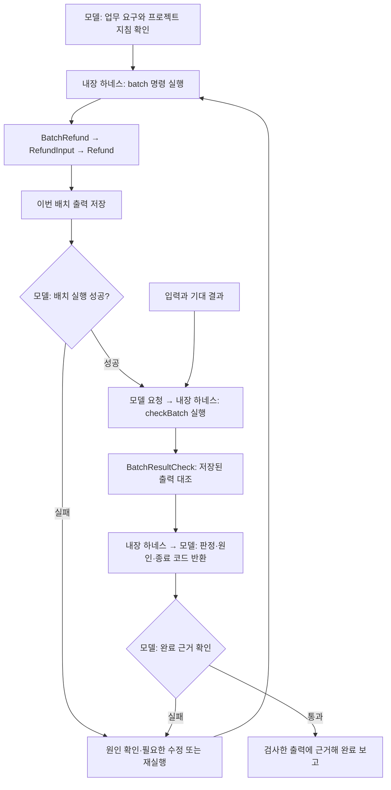

# 5주차 개발 하네스와 실패 대응

하네스는 모델에 맥락과 도구를 연결하고 실행 결과를 다음 판단으로 돌려주는 실행 시스템이다. 이번 실습은 Codex 내장 하네스 위에 프로젝트의 업무 요구·작업 지침·결과 검사를 연결하는 과정이었다. 환불 프로그램은 작업 대상이고, 프로젝트에 추가한 지침과 검사는 그 대상을 어떻게 확인하고 완료할지 정하는 구성이다.

## Day 1 — 내장 하네스의 실행과 피드백 경로

기본 실행을 통해 **모델의 도구 요청 → 실제 실행 → 결과 반환 → 해석**을 확인했다. Day 1에 적용된 하네스는 Codex 내장 하네스다. 프로그램이 어떤 값을 낼 것이라는 설명을 실제 출력과 대조하면서, 모델의 판단과 실행 환경의 역할을 구분하는 활동이었다.

### 시작 기능과 실제 결과

시작 기능은 결제액에서 수수료를 빼고 환불액 하한을 0으로 둔다. 결제액이나 수수료가 음수이면 계산 전에 거부한다.

| 입력 | 결과 | 확인한 규칙 |
|---|---|---|
| 결제 10000, 수수료 2000 | 8000 | 기본 차감 |
| 결제 1000, 수수료 2000 | 0 | 유효한 입력으로 계산한 환불액의 하한 |
| 결제 -1, 수수료 0 | 금액 오류 | 잘못된 결제액 거부 |
| 결제 1, 수수료 -1 | 금액 오류 | 잘못된 수수료 거부 |

`1000, 2000`은 두 입력이 유효하지만 차감 결과가 음수여서 0을 반환한다. `-1, 0`은 입력부터 유효하지 않으므로 거부한다. 두 경우를 모두 0으로 보정하면 잘못된 결제액을 정상 요청처럼 처리하게 된다. 입력의 유효성과 결과의 하한은 각각 확인해야 한다.

기본 출력은 `8000`이었고, 시작 테스트 세 개는 기본 차감·음수 입력 거부·환불액 하한을 확인했다.

### 실행 결과가 판단 근거가 되는 과정

모델은 요구와 소스를 읽고 실행할 명령을 선택한다. Codex 내장 하네스는 파일 읽기·명령 실행을 연결하고 도구의 출력과 종료 상태를 모델에 돌려준다. 환불 계산은 업무 코드가, 기대값 비교는 테스트가 수행한다. 모델은 돌아온 결과를 해석해 보고하거나 다음 도구 사용을 결정한다.

실제 출력 `8000`과 검사 결과가 이 경로를 거쳐 판단 근거가 됐다. 테스트는 모델을 호출하지 않고 입력과 결과를 비교한다. 계산 코드와 기대값을 분리하면 구현을 바꾼 뒤에도 같은 요구를 만족하는지 확인할 수 있다.

## Day 2 — 업무 요구와 운영 지침을 변경 작업에 적용하기

수수료 면제를 추가하면서 **무엇이 올바른 결과인지 정하는 업무 요구**와 **어떤 자료를 읽고 언제 검사할지 정하는 운영 지침**을 구분했다. 새 기능과 기존 동작을 함께 확인하는 지침을 실제 편집·검사·완료 판단에 적용한 단계다.

### 요구에서 검사 기준으로

[프로젝트 지침](quality_demo/AGENTS.md)은 업무 요구에 근거해 기대값을 정하고 현재 요구와 기존 동작을 함께 검사하도록 안내한다. 요구 A에서는 수수료 면제 조건과 [입력·기대값 자료](quality_demo/data/refund-cases.json)가 기준이 됐다. 실제 출력에 맞춰 기대값을 정하면 잘못된 구현도 통과시킬 수 있으므로, 기대값은 요구에서 정해야 한다.

작업 지침은 모델의 작업 순서를 안내한다. 프로젝트 폴더는 파일과 명령의 기준 위치이며, 실제 편집·도구 사용 권한은 Codex의 권한 설정이 결정한다. 지침에 작업 방법을 적는 것과 도구 실행 권한을 부여하는 것은 역할이 다르다.

### 입력 경계와 계산을 나눈 이유

수수료 면제는 계산 방법을 바꾸지만 잘못된 금액을 허용하지 않는다. 처리 순서는 금액 검사 → 면제 여부 검사 → 계산이며, 둘 다 잘못되면 금액 오류를 먼저 알린다.

```text
외부 JSON 요청
  → RefundInput: JSON 구조·금액 표현·면제 여부 검사
  → Refund: 음수 입력 거부와 면제·차감·하한 계산
  → 환불액 또는 입력 오류
```

`RefundInput`은 Gson으로 JSON을 읽고 금액이 정수 숫자인지 확인한다. 문자열 `"1000"`이나 불리언 `true`를 금액으로 바꾸지 않고 거부한다. `fee_waived`는 불리언만 허용하며 생략하면 비면제다. 계산 코드도 음수를 거부하므로 JSON을 거치지 않는 호출에 같은 업무 규칙이 적용된다.

면제 계산을 금액 검사보다 먼저 하면 잘못된 수수료나 음수 결제액을 통과시킬 수 있다. 따라서 공통 검사 뒤에서 계산을 나눴다. 정수 원 단위와 64비트 범위를 사용하고 소수점·지수 표기·범위 초과를 거부한다. 소수 단위 금액을 받아야 한다면 금액 표현과 기대 결과를 함께 바꿔야 한다.

면제 결과는 `10000`, 비면제는 `8000`, 환불 하한은 `0`이었다. 음수·문자열·불리언 금액과 잘못된 면제 형식도 거부됐으며, 전체 검사 11개가 통과했다. 이 결과를 요구 A의 완료 근거로 사용했다.

이 실습에서 하네스에 연결한 것은 참고할 요구와 작업 지침, 실행 가능한 검사다. 환불 함수의 책임 분리는 업무 프로그램의 구조이며, 하네스는 이 프로그램을 수정하고 검사한 결과가 다음 판단으로 돌아오도록 연결한다.

## Day 3 — 실행 성공과 업무 완료를 구분하기

여러 환불 요청을 처리하도록 확장한 뒤 **각 답이 맞는지와 모든 요청에 답이 있는지**를 비교했다. 하네스가 전달하는 정상 종료 신호와 업무 완료의 근거를 구분하고, 출력에서 대조할 기준을 정한 단계다.

### 배치 처리와 실패의 단위

`BatchRefund`는 파일의 여러 요청을 차례로 `RefundInput`과 `Refund`에 전달한다. 환불액이나 거부 사유에 원래 요청의 `id`를 붙여 입력 순서대로 모으므로 Day 2의 입력 검사와 계산을 재사용한다.

한 요청의 금액이 잘못되면 그 요청에 거부 사유를 남기고 다음 요청을 처리한다. 파일을 읽지 못하거나 JSON 문법이 깨졌다면 요청 목록을 해석할 수 없어 실행을 실패로 끝낸다. 파일 전체를 해석한 뒤 처리하므로 뒤쪽 문법 오류 때문에 앞부분 결과만 출력하는 일은 없다. 대용량 입력을 나누어 처리한다면 부분 결과와 재시작 기준도 함께 정해야 한다.

### 실제 입력과 결과

[배치 입력](quality_demo/data/batch-requests.json) 8건의 결과는 [기대 결과](quality_demo/data/batch-expected.json)와 일치했다.

| 순서 | id | 입력의 핵심 | 실제 결과 |
|---:|---|---|---|
| 1 | regular | 결제 10000, 수수료 2000, 비면제 | 환불액 8000 |
| 2 | negative-paid | 결제 -1 | 금액 오류 |
| 3 | waived | 결제 10000, 수수료 2000, 면제 | 환불액 10000 |
| 4 | text-amount | 결제액이 문자열 `"10000"` | 금액 오류 |
| 5 | lower-bound | 결제 1000, 수수료 2000, 비면제 | 환불액 0 |
| 6 | boolean-amount | 결제액이 `true` | 금액 오류 |
| 7 | negative-fee-waived | 수수료 -1, 면제 | 금액 오류 |
| 8 | invalid-waiver | 면제 여부가 문자열 `"true"` | 면제 형식 오류 |

두 번째 요청의 거부 뒤에도 세 번째 요청에서 환불액 `10000`이 나왔다. 환불액 3개와 올바른 거부 사유 5개가 모두 남았고, 배치는 종료 코드 0으로 끝났다. 잘못된 요청에 다음과 같이 답하는 것도 요구한 정상 처리다.

```json
{"id":"negative-paid","status":"error","error":"금액은 0 이상의 정수여야 합니다."}
```

면제 형식 오류의 메시지는 `fee_waived는 불리언이어야 합니다.`였다. 빈 요청 목록은 `[]`를 반환했고, 파일 읽기 실패나 잘못된 문서는 결과 배열 없이 실패했다. 기존 기능과 배치 기능을 확인한 검사 18개가 통과했다.

### 누락 반례로 정한 완료 기준

실제 출력의 복사본에서 오류 결과 5개를 지우면 맞는 환불액 `8000`, `10000`, `0`만 남는다. 두 출력을 대조한 결과, 복사본은 남은 답이 모두 맞아도 5개 요청의 답이 빠져 있었다. 거부 사유가 있으면 처리 결과를 알 수 있지만, 답이 없으면 거부했는지 처리하지 않았는지 알 수 없다.

**정확성은 각 답의 내용이 맞는지, 완전성은 모든 요청에 답이 있는지다.** 결과가 8개여도 같은 `id`가 중복되면 요청별 대응은 깨진다. 따라서 개수·식별자·순서·환불액·거부 사유를 입력과 기대 결과에 대조하는 기준이 필요하다.

이번 활동은 실제 출력과 의도적으로 누락시킨 복사본을 비교하도록 요청한 실험이었다. 확인한 것은 누락을 지적하는 판단과 그 근거다. 이 기준을 실행 가능한 검사와 실패 이후의 행동에 연결하는 작업은 Day 4에서 이어졌다.

## Day 4 — 완료 검사를 실행하고 판정을 다음 행동에 연결하기

Day 3의 기준을 **이번 출력에 적용할 검사**로 만들고, 검사 결과가 **완료 보류 → 원인 확인 → 수정 또는 재실행 → 재검사**로 이어지도록 구성했다. 하네스에서 결과를 받는 것뿐 아니라 그 결과로 다음 행동을 정하는 부분을 다룬 단계다.

### 검사와 피드백 방식을 선택한 이유

기존 배치 테스트는 프로그램을 새로 실행해 결과를 비교했다. 이미 저장된 출력에서 5개 결과가 빠져 있어도 새 실행의 8개 결과가 맞으면 테스트는 통과할 수 있었다. 완료 근거로 사용할 바로 그 출력 파일을 검사할 경로가 필요했다.

제공 Hook은 명령 종료 코드가 0이면 빈 응답을 반환하고, 실패하면 원인 확인·재검사 안내를 만든다. 배치 결과의 내용을 읽어 누락을 판정하지 않으므로, 출력의 완전성은 별도 검사가 맡아야 한다. Hook 코드 검사 5개와 예시 실패 입력의 피드백 생성은 확인했다. 실제 Codex 명령 뒤의 자동 연결 여부는 미확인이며, 이때 후속 행동은 일반 명령 출력을 근거로 이어졌다.

선택한 구성은 **이번 출력 검사 + 완료 전 검사 지침**이다. 기존 비교 기준을 재사용하고, 판정을 검사 명령의 출력으로 전달하도록 했다. 모델이 이미 도구 결과를 받으므로 이 경로로 누락 원인과 대응 지침을 연결할 수 있다.

### 구현과 실제 후속 행동

`BatchResultCheck.compare`로 비교 기준을 공통화했다. 기존 배치 테스트와 새 `checkBatch` 명령이 같은 함수를 사용한다. `checkBatch`는 입력·기대 결과·저장된 실제 출력 파일을 받고, 프로젝트 `AGENTS.md`는 완료 전에 그 검사를 실행하고 실패 원인을 확인하도록 안내한다.

| 검사 대상 | 실제 판정 | 이어진 행동 |
|---|---|---|
| 정상 출력 8개 | 식별자·순서·내용 일치로 통과 | 완료 근거로 사용 |
| 오류 결과 5개를 지운 복사본 | 결과 3개, 요청 5개의 답 누락으로 거부 | 완료 보류, 원본과 비교해 삭제된 오류 결과 확인 |
| 두 번째 `negative-paid`를 `regular`로 바꾼 복사본 | 중복·누락·식별자 불일치로 거부 | 완료 보류, 원본 식별자와 변경 내용 확인 |
| 배치를 재실행한 출력 | 같은 검사에서 8개 결과 모두 일치 | 재검사한 출력을 완료 근거로 사용 |

검사기는 통과하면 종료 코드 0을, 실패하면 종료 코드 1과 원인을 반환한다. 실패 판정 뒤에는 원본과 복사본을 비교했고, 삭제와 식별자 변경이 원인으로 확인됐다. 같은 입력의 배치를 다시 실행해 `recovered.json`을 얻고 동일한 검사로 확인했다. 원인이 출력 복사본의 변경이었기 때문에 올바른 출력을 다시 생성하는 조치가 맞았다.

### 검사기 자체의 결함을 보완한 사례

환불액 `8000`을 `8000.0000000000001`로 바꾼 복사본이 보완 전 검사에서 통과했다. JSON 라이브러리의 숫자 동등 비교가 이 차이를 놓친 것이다. 현재 금액 계약에 맞춰 정수 형식·64비트 범위·정확한 값 비교를 더하자 같은 파일에서 `결과 내용 불일치: id=regular`가 나왔다. 최대 정수와 그보다 1 작은 값도 구분됐다.

이 사례에서는 잘못된 결과를 놓치던 검사기를 수정했다. 검사 통과를 완료 근거로 삼으려면 검사 기준 자체가 업무 계약을 정확히 표현해야 한다. 보완 뒤 기존 기능과 출력 검사 28개가 통과했다.

완료 보류와 재검사는 검사 판정과 프로젝트 지침을 읽은 모델의 실제 후속 행동으로 확인했다. 검사기는 판정을 만들고, 다음 명령을 선택하는 책임은 모델에 있다.

## Day 5 — 새 작업에서 저장된 구성 재사용하기

앞선 대화 전문 없이 새 작업에서 **프로젝트에 저장된 맥락·검사 경로·실패 대응 지침을 다시 찾아 사용할 수 있는지** 확인했다. Day 4의 연결을 대화 밖의 파일에 남겨 두는 이유를 검증한 단계다.

[주차 README의 Day 5](README.md#day-5--새-세션에서-설계한-구성을-재사용하기), 프로젝트 `AGENTS.md`, 실습 README, `build.gradle`에서 실행·검사 경로를 찾아 재사용했다. 이번 요청문으로 정상·누락·식별자·출력 오류를 확인할 활동을 지정했고, 구체적인 실행 방법과 완료 기준은 저장된 구성을 따랐다.

### 새 실행과 반례의 판정

새 기본 출력은 `8000`, 배치 출력은 Day 3과 같은 환불액 3개와 올바른 거부 사유 5개였으며, 업무·출력 검사 28개가 통과했다. 새 실제 출력과 그 복사본으로 다음 사례를 확인했다.

| 대상 | 바꾼 조건 | 실제 검사 결과 |
|---|---|---|
| 정상 출력 | 환불액 3개와 거부 사유 5개 | 요청 8개와 결과가 모두 일치해 통과 |
| 결과 한 개 누락 | 마지막 `invalid-waiver` 결과 삭제 | 해당 요청의 결과 누락으로 거부 |
| 식별자 중복 | 두 번째 `negative-paid`를 `regular`로 변경 | 중복·누락·순서 불일치로 거부 |
| 알 수 없는 식별자 | 두 번째 식별자를 `unrecognized`로 변경 | 알 수 없는 식별자와 원래 요청의 누락으로 거부 |
| 빈 출력 | 파일 내용을 비움 | 확인할 출력 내용이 없어 거부 |
| 읽을 수 없는 JSON | 마지막 닫는 대괄호 제거 | JSON 해석 실패로 거부 |
| 파일 없음 | 검사할 위치에서 복사본을 옮김 | 파일 읽기 실패로 거부 |
| 잘못된 환불액 | `8000`을 `8000.0000000000001`로 변경 | 결과 내용 불일치로 거부 |
| 잘못된 거부 사유 | 오류 문구를 `다른 오류`로 변경 | 결과 내용 불일치로 거부 |

정상 출력은 통과했고, 8개 반례는 모두 거부됐다. 요청 자체가 없는 경우의 정상 출력 `[]`와 요청 8건의 결과를 받지 못한 빈 출력도 구분했다. Day 4에서 보완한 금액 비교는 같은 잘못된 금액을 다시 거부했다.

### 새 작업에서도 이어진 실패 대응

실패한 결과의 완료 판단을 보류하고 원본과 복사본의 개수·식별자·내용·파일 상태를 대조했다. 각 반례에 가한 변경이 원인이었으므로 배치를 다시 실행했다. 새 `recovered.json`을 같은 검사에 넣은 결과 8개 요청과 결과가 일치해 통과했고, 이 출력을 최종 완료 근거로 사용했다.

저장된 검사와 지침은 새 작업에서도 판정 → 원인 확인 → 재실행 → 해당 출력 재검사로 이어졌다. 이 실습은 기존 대화의 성공 보고를 기억하는 대신, 프로젝트의 기준을 찾아 새 실행 결과로 완료 근거를 다시 만드는 과정을 확인했다.

## 최종 하네스 구조

이번에 구현한 것은 **Codex 내장 하네스를 기반으로 한 환불 업무용 검사·운영 구성**이다. 직접 추가한 부분은 저장된 출력의 완료 검사, 그 검사를 실행하는 명령, 실패 뒤의 원인 확인·수정·재검사를 안내하는 지침이다. 이 구성은 Day 4에서 구현하고 Day 5의 새 작업에서 재사용했다.

모델 호출·도구 실행·권한 적용·실행 결과 반환을 담당하는 실행 엔진은 Codex의 것을 사용했다. 따라서 하네스 전체를 독립 실행기로 새로 구현한 단계와는 구분된다. 기존 실행 환경에 업무별 판정 도구와 운영 규칙을 추가하는 방식으로 하네스를 구성한 것이다.

### 구성별 책임

| 구성 | 실제 대상 | 제공·구현 구분 | 맡은 역할 |
|---|---|---|---|
| 모델 | Codex에서 동작하는 모델 | Codex에서 제공 | 요구와 지침을 읽고 도구를 요청하며, 결과에 따라 수정·재실행·완료 보고를 결정 |
| 실행 환경 | Codex 내장 하네스 | Codex에서 제공 | 파일 읽기·명령 실행·권한 적용과 도구 결과 반환을 연결 |
| 작업 맥락과 운영 지침 | [AGENTS.md](quality_demo/AGENTS.md), [실습 README](quality_demo/README.md) | 제공 지침에 이번 출력 검사와 실패 대응 순서 추가 | 요구, 실행 방법, 완료 전 검사와 실패 대응 순서를 안내 |
| 업무 입력과 기대 결과 | [배치 입력](quality_demo/data/batch-requests.json), [기대 결과](quality_demo/data/batch-expected.json) | 과정의 제공 자료 재사용 | 처리할 요청과 요구에 맞는 답을 제공 |
| 업무 실행 | [BatchRefund](quality_demo/src/main/java/lab/week05/BatchRefund.java) → [RefundInput](quality_demo/src/main/java/lab/week05/RefundInput.java) → [Refund](quality_demo/src/main/java/lab/week05/Refund.java) | 시작 코드에 Day 2의 면제·입력 검사와 Day 3의 배치 기능 구현 | 요청을 읽고 검증·계산한 뒤 요청별 결과를 출력 |
| 완료 검사 | [BatchResultCheck](quality_demo/src/main/java/lab/week05/BatchResultCheck.java) | Day 4에 기존 비교 기준을 공통화해 구현하고 금액 비교 보완 | 입력·기대 결과·이번 출력을 대조해 통과 또는 구체적인 실패 원인을 반환 |
| 명령 연결 | [build.gradle](quality_demo/build.gradle) | 제공 실행·검사 구성에 `batch`와 `checkBatch` 추가 | 업무 실행, 저장된 출력 검사, 기존 기능 검사를 각각 실행 |

환불 프로그램은 하네스가 다루는 업무 대상이다. `BatchResultCheck`는 결과 판정 도구이며, `AGENTS.md`와 이를 읽은 모델의 판단이 이 도구를 완료 보고 앞에 배치한다. `batch`와 `checkBatch`는 별도 명령이다. 배치 실행만으로 검사가 자동 실행되지는 않으므로, 지침에 따라 이번 출력을 저장하고 검사하는 도구 요청이 이어져야 한다.

### 실제로 사용한 실행과 피드백 흐름



코드 변경의 정상·경계·오류 동작은 기존 테스트로 함께 확인한다. 테스트와 저장된 출력 검사는 같은 비교 함수를 사용하지만 대상이 다르다. 테스트는 새로 실행한 프로그램의 동작을, `checkBatch`는 전달받은 특정 출력 파일을 확인한다.

실행·저장·검사 순서는 [실습 README](quality_demo/README.md#이번-출력-검사와-완료-판단)에 있다. 검사기는 파일을 비교하므로, 이번 실행에서 얻은 파일을 전달할 책임은 실행 흐름에 있다. 현재 기대 자료는 제공된 환불 요청에 맞춰져 있다. 입력이나 업무 요구가 바뀌면 그 요구에 맞는 기대 결과를 준비하고 같은 검사 경로에 연결해야 한다.

### Hook의 구성과 확인한 범위

제공 Hook은 명령 결과 뒤에 실패 대응 안내를 추가하는 구성이다. [Hook 설정](quality_demo/.codex/config.toml)의 `hooks = true`, [이벤트 정의](quality_demo/.codex/hooks.json)의 `PostToolUse`와 `Bash` 매칭, [PostToolUseReview](quality_demo/.codex/hooks/PostToolUseReview.java)로 연결되어 있다.

코드는 이벤트 JSON의 `tool_response.exit_code`를 읽는다. 0이면 `{}`, 실패 코드이면 `systemMessage`에 경고와 `hookSpecificOutput.additionalContext`에 원인 확인·재검사 안내를 만든다. 종료 코드를 읽지 못하면 실행 결과 확인을 안내한다. 다음 명령은 이 피드백을 받은 모델이 선택한다.

Hook 코드 검사와 예시 입력에 대한 피드백 생성은 확인했으며, Host가 실제 명령 뒤에 Hook을 자동 실행하는 연결은 미확인이다. Day 4·5에서 실제 사용한 경로는 `checkBatch`의 도구 출력과 프로젝트 지침이다. 이 경로에서 완료 보류와 재검사는 확인됐으며, 모든 완료 보고를 강제로 차단하는 장치로 구현한 것은 아니다. Hook의 실행 준비와 세부 입출력은 [실습 README의 Hook 설명](quality_demo/README.md#hook-명령-결과를-다음-판단에-연결하기)에 있다.
