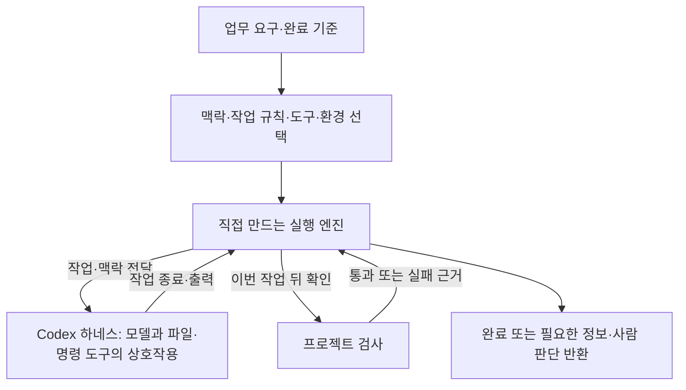

# 5주차 개발 하네스 학습 기록

## Day 1 — 업무에서 하네스의 구성 도출하기 (2026-09-10)

하네스는 작업에 필요한 맥락·규칙·도구·실행 환경·검사·피드백을 연결하는 실행 체계다. 실행 엔진은 그 안에서 준비 여부와 실행 순서, 검사 뒤 복구·종료를 조율한다. 환불 계산은 업무 코드가 맡고, 실제 결과를 수용할 근거는 검사에서 얻는다.

### 업무 완료를 판단하는 근거

이 단계에서는 배치 프로그램을 직접 실행했다. `quality_demo/`에서 사용한 명령은 Windows PowerShell의 `.\gradlew.bat -q batch --args="data/batch-requests.json"`이며, macOS·Linux·WSL에서는 `./gradlew -q batch --args="data/batch-requests.json"`이다.

**프로그램에 전달한 입력**

```json
[
  {"id": "regular", "paid": 10000, "fee": 2000, "fee_waived": false},
  {"id": "negative-paid", "paid": -1, "fee": 0, "fee_waived": false},
  {"id": "waived", "paid": 10000, "fee": 2000, "fee_waived": true},
  {"id": "text-amount", "paid": "10000", "fee": 2000, "fee_waived": false},
  {"id": "lower-bound", "paid": 1000, "fee": 2000, "fee_waived": false},
  {"id": "boolean-amount", "paid": true, "fee": 0, "fee_waived": false},
  {"id": "negative-fee-waived", "paid": 10000, "fee": -1, "fee_waived": true},
  {"id": "invalid-waiver", "paid": 10000, "fee": 2000, "fee_waived": "true"}
]
```

**실제 반환된 출력**

```json
[
  {"id": "regular", "status": "ok", "refund": 8000},
  {"id": "negative-paid", "status": "error", "error": "금액은 0 이상의 정수여야 합니다."},
  {"id": "waived", "status": "ok", "refund": 10000},
  {"id": "text-amount", "status": "error", "error": "금액은 0 이상의 정수여야 합니다."},
  {"id": "lower-bound", "status": "ok", "refund": 0},
  {"id": "boolean-amount", "status": "error", "error": "금액은 0 이상의 정수여야 합니다."},
  {"id": "negative-fee-waived", "status": "error", "error": "금액은 0 이상의 정수여야 합니다."},
  {"id": "invalid-waiver", "status": "error", "error": "fee_waived는 불리언이어야 합니다."}
]
```

[저장된 배치 출력](quality_demo/.local/day01-20260910-220611-544/batch-result.json)과 같은 내용이다. `BatchRefund.process()`는 먼저 요청 식별자를 확인한 뒤, 입력 순서대로 `RefundInput.calculate()`를 호출하고 각 결과를 배열에 추가한다.

- `regular`는 금액 검사를 거쳐 10000에서 2000을 빼므로 8000이 된다.
- `negative-fee-waived`는 면제 여부를 적용하기 전에 수수료의 유효성을 검사하므로 오류가 된다.
- `invalid-waiver`의 `"true"`는 문자열이어서 불리언 검사에 실패한다. `BatchRefund`가 이 오류를 잡아 원래 식별자와 오류 이유를 결과에 넣는다.

따라서 오류 행도 처리 결과의 일부다. `BatchRefundTest`는 이 배열 전체를 기대값과 비교한다. 프로그램이 정상 종료해도 요청이 누락될 수 있으므로, 하네스의 완료 판단에는 이 업무 검사가 필요하다.

### 맥락과 실패 근거의 전달

[작업 지침](quality_demo/AGENTS.md)은 실제 결함을 근거로 수정하고 기대값을 낮추지 않도록 안내한다. [업무 계약](quality_demo/harness/contract.md)은 요청별 식별자·순서·내용과 올바른 오류 결과를 완료 기준으로 정한다.

참고 구현의 [작업 설정](quality_demo/examples/job.json)은 목적·작업 폴더·맥락 파일·실행/검사 명령·복구 상한·시간 제한을 묶는다. [Job.prompt()](quality_demo/src/main/java/lab/week05/example/Job.java)는 목적에 지침과 업무 계약의 본문을 붙인다. 규칙을 파일에 보관하는 데서 그치지 않고 이번 작업의 입력으로 전달하는 연결이다. 상세 코드와 배치 입력은 지정한 작업 폴더에서 도구로 읽는다.

`ProcessRunner`는 명령·입력·출력·종료 코드·시간 제한을 연결하고, [Execution.repairPrompt()](quality_demo/src/main/java/lab/week05/example/Execution.java)는 원래 작업과 검사 실패 근거를 다음 요청에 함께 전달한다. 엔진은 이 근거로 재시도 또는 중단을 결정한다.

### 복구 상한과 품질 기준

품질 기준은 어떤 결과를 완료로 받아들일지, 복구 상한은 그 기준에 도달하려고 자동으로 얼마나 더 시도할지 정한다. 이번 실습에서는 최초 작업 뒤 검사에 실패하면 Codex 작업을 한 번 더 실행하도록 선택했다. 복구 뒤에도 검사가 실패하면 이유를 포함해 중단한다.

1회는 작은 작업의 자동 실행 범위를 제한하는 선택이다. 횟수를 늘리면 해결할 기회와 시간·비용이 함께 늘지만, 검사가 놓치는 결함까지 해결되지는 않는다. 작업 규모와 실패 원인, 수정 가능성, 허용 시간·비용이 달라지면 복구 범위를 다시 판단해야 한다.

## Day 2 — 요청 파일과 순서 함수 선택 (2026-09-10)

### 실행 요청과 교육용 응답

`quality_demo/`에서 두 참고 엔진에 같은 요청 파일과 `demo-repair`를 전달했다. 다음 실행 명령은 Windows·macOS·Linux·WSL에서 같다.

```text
java -jar build/libs/reference-engine.jar examples/job.json linear demo-repair
java -jar build/libs/reference-engine.jar examples/job.json state demo-repair
```

요청 파일의 작업 요구(`goal`)는 다음과 같다.

```text
제공 환불 배치를 실행하고 모든 요청에 같은 id·순서의 처리 결과가 있는지 확인하세요. 실제 결함이 있으면 필요한 코드만 수정하고 기존 검사를 사용하세요. 변경·실제 결과·남은 문제를 짧게 보고하세요.
```

`Job.prompt()`는 이 요구에 프로젝트 지침과 업무 계약을 `근거: AGENTS.md`, `근거: harness/contract.md` 순서로 붙인다. 두 문서의 본문은 이 기록의 [Day 4 요청 전문](#codex에-전달한-요청)에 실려 있다. 작업 폴더는 `quality_demo/`, 복구 상한은 1회다.

이번 실행에서는 실제 Codex 대신 `EngineCli.simulatedRepair()`가 아래 고정 응답을 순서대로 반환했다. 중간 응답과 복구 문구는 실행에 사용한 코드에 근거한다.

| 호출 | 엔진이 전달하는 입력 | 교육용 응답 | 이어지는 행동 |
|---|---|---|---|
| 첫 작업 | 작업 요구 + 지침·계약 본문 | `OK`: “완료했습니다” | 업무 검사 호출 |
| 첫 검사 | 검사 명령, 표준입력은 빈 문자열 | `FAILED`: “누락 id: invalid-waiver” | 원래 요청에 실패 근거를 붙임 |
| 복구 작업 | 원래 요청 + 아래 복구 문구 | `OK`: “수정했습니다” | 재검사 호출 |
| 재검사 | 같은 검사 명령, 표준입력은 빈 문자열 | `OK`: “8개 입력과 결과가 일치합니다” | 완료 반환 |

`Execution.repairPrompt()`가 원래 요청 뒤에 붙이는 문구는 다음과 같다.

```text
독립 검사가 실패했습니다. 근거에서 원인을 확인하고 필요한 수정을 수행하세요. 요구와 기대값을 낮추지 마세요. 해결할 근거가 없으면 필요한 정보를 알려 주세요.
FAILED (exit=1): 누락 id: invalid-waiver
```

두 엔진의 실제 최종 결과는 모두 `SUCCEEDED`, 작업 시도 2회였고, 이유는 `OK (exit=0): 8개 입력과 결과가 일치합니다`였다. [순서 방식 결과](quality_demo/.local/day02-20260910-221357-630/linear.json)와 [상태 방식 결과](quality_demo/.local/day02-20260910-221357-630/state.json)에 남아 있다.

### 같은 응답이 완료에 도달하는 과정

`LinearEngine.run()`은 작업의 `OK` 뒤 검사를 호출하고, 검사의 `FAILED`를 받으면 복구 상한을 확인해 다음 반복의 요청을 바꾼다. “완료했습니다”는 검사를 시작할 신호이며, 엔진의 완료를 결정하는 신호는 재검사의 `OK`다.

`StateEngine`은 같은 판단을 상태와 사건으로 나누어 다음 전이를 기록했다.

```text
NEW --PREPARED--> READY --START--> EXECUTING
EXECUTING --EXECUTION_OK--> VERIFYING
VERIFYING --VERIFICATION_FAILED--> CHECK_FAILED
CHECK_FAILED --REPAIR_ALLOWED--> REPAIRING --START--> EXECUTING
EXECUTING --EXECUTION_OK--> VERIFYING --VERIFICATION_OK--> SUCCEEDED
```

순서 방식은 반복문과 분기에서, 상태 방식은 `next()`의 상태·사건 대응에서 다음 행동을 읽을 수 있다.

현재 목표는 정해진 작은 작업의 준비·실행·검사·복구를 연결하는 것이므로 **요청 파일 + 순서 함수**를 선택했다. 호출 순서로 흐름을 읽고 최종 상태·실패 단계·이유·시도 수로 결과를 판단할 수 있다. 단계별 전이를 별도로 표현할 필요가 생기면 상태 방식을 다시 검토할 수 있다.

## Day 3 — 자기 요청과 진입점으로 하네스 연결 (2026-09-10)

### 요청 파일과 첫 작업 입력

실행에 사용한 `refund-work.json`의 내용은 다음과 같다.

```json
{
  "workspace": "..",
  "task": "harness/task.md",
  "context": [
    "AGENTS.md",
    "harness/contract.md"
  ],
  "verify": {
    "windows": [
      "cmd",
      "/d",
      "/c",
      "gradlew.bat",
      "--no-daemon",
      "test"
    ],
    "posix": [
      "sh",
      "gradlew",
      "--no-daemon",
      "test"
    ]
  },
  "maxRepairs": 1,
  "timeoutSeconds": 600
}
```

`WorkRequest.prompt()`가 이 파일을 읽어 만드는 첫 작업 입력은 아래 [Day 4 요청 전문](#codex에-전달한-요청)과 같다. Day 3에서는 `--demo-repair`로 교육용 응답을 연결했고, Day 4에서는 같은 입력을 실제 Codex에 전달했다.

### 요청에서 실행까지의 책임 분리

[작업 요청](quality_demo/harness/refund-work.json)은 작업 위치, 요구·맥락 파일, 운영체제별 검사 명령, 복구 상한과 시간 제한을 담는다. 작업 위치는 요청 파일의 폴더를 기준으로, 요구·맥락 파일은 작업 폴더를 기준으로 해석한다. `workspace: ".."`는 `quality_demo/`를 가리킨다. 터미널을 시작한 위치에 따라 읽을 자료가 달라지지 않도록 한 선택이다.

[WorkRequest](quality_demo/src/main/java/lab/week05/harness/WorkRequest.java)는 필요한 자료를 확인하고 요구·규칙 본문을 연결한다. [DevelopmentHarness](quality_demo/src/main/java/lab/week05/harness/DevelopmentHarness.java)는 준비 → 작업 → 검사 → 필요한 복구를 순서대로 실행하며, 완료·정보 보충·중단의 결과와 이유를 반환한다.

[HarnessCli](quality_demo/src/main/java/lab/week05/harness/HarnessCli.java)는 실행 진입점이다. `ProcessRunner`로 Codex 작업을 호출하고 [GradleVerifier](quality_demo/src/main/java/lab/week05/harness/GradleVerifier.java)로 검사를 연결한다. 도구 호출을 맡은 `StepRunner`가 통과·업무 검사 실패·실행 불가·시간 초과를 `StepResult`로 전달하므로, 순서 엔진은 프로세스 호출 방식과 분리해 다음 행동을 결정할 수 있다.

복구 요청에는 원래 작업·맥락과 이번 실패 근거를 함께 넣고, 같은 실행의 시도 수를 유지한다. 수정해야 할 차이를 전달하면서 원래 요구와 복구 상한을 잃지 않게 하는 구조다.

### 검사 실패와 실행 불가의 구분

Gradle은 이전 결과를 재사용하고도 정상 종료할 수 있다. `GradleVerifier`는 `--rerun-tasks`와 `--no-build-cache`로 검사를 다시 실행하고, 이번 실행의 별도 폴더에 JUnit 결과를 받는다. 배치 입력과 기대값 파일도 Gradle 검사 입력으로 등록했다.

존재하지 않는 검사 명령도 셸에서 종료 코드 1을 반환했다. 따라서 비정상 종료만으로 코드 수정을 요청하면 검사 환경의 문제를 업무 결함으로 오인할 수 있다. 비정상 종료와 새 JUnit 실패 결과가 함께 있을 때 업무 검사 실패로 분류하고, 결과가 없거나 서로 모순되면 실행 불가로 중단한다.

### 교육용 실행의 요청·응답과 결과

`quality_demo/`에서 다음 명령을 사용했다. Windows·macOS·Linux·WSL에서 같은 형태다.

```text
java -jar build/libs/development-harness.jar harness/refund-work.json --demo-repair
```

`HarnessCli.demoRunner()`는 단계와 시도 수에 따라 다음 응답을 반환한다.

| 호출 | 전달한 입력 | 교육용 응답 | 엔진의 다음 행동 |
|---|---|---|---|
| 첫 작업 | `WorkRequest.prompt()`의 작업·지침·계약 본문 | `OK`: “교육용 완료 응답” | 검사 호출 |
| 첫 검사 | 빈 문자열 | `FAILED`: “누락 id: invalid-waiver” | 복구 요청 구성 |
| 복구 작업 | 원래 요청 + 아래 문구 | `OK`: “교육용 완료 응답” | 재검사 호출 |
| 재검사 | 빈 문자열 | `OK`: “교육용 검사 응답: 요청 8개의 결과가 일치합니다.” | 완료 반환 |

복구 작업에 전달하는 입력은 원래 요청을 유지하고 다음 문구를 붙인 것이다.

```text
이번 작업 뒤 독립 검사가 실패했습니다.
FAILED (종료 코드 1)
누락 id: invalid-waiver
원래 요구와 실패 근거를 대조해 필요한 부분을 수정하세요. 통과시키려고 요구나 기대값을 낮추지 마세요. 해결할 정보가 부족하면 필요한 내용을 알려 주세요.
```

이 문구와 중간 응답은 `DevelopmentHarness.run()`과 `demoRunner()`의 코드에서 확인할 수 있다. `run()`은 첫 검사 실패 뒤에도 원래 요청과 시도 수를 유지하고, 두 번째 검사가 통과한 뒤 반환한다. [실제 교육용 실행 결과](quality_demo/.local/development-harness/38ab5b2a-0686-4bef-a907-8c795823a1a0/result.json)의 `outcome`은 다음과 같다.

```json
{
  "status": "SUCCEEDED",
  "stage": "VERIFY",
  "attempts": 2,
  "reason": "OK (종료 코드 0)\n교육용 검사 응답: 요청 8개의 결과가 일치합니다."
}
```

### 검사 명령이 없는 요청

위 요청에서 `verify` 항목 전체를 제거한 입력의 [반환 결과](quality_demo/.local/development-harness/060e15ef-60fb-4bcb-bbe7-19e9c181c961/result.json)는 다음과 같다.

```json
{
  "status": "NEEDS_INPUT",
  "stage": "PREPARE",
  "attempts": 0,
  "reason": "IllegalArgumentException: 완료를 판정할 verify 검사 명령이 필요합니다."
}
```

`WorkRequest.load()`가 검사 명령의 누락을 발견해 요청 준비를 끝내지 못하므로, `HarnessCli`가 정보 보충을 반환한다. 작업 실행에 도달하지 않아 교육용 작업 응답도 소비하지 않는다. 업무 검사를 실행한 뒤 실패하는 경우와 달리, 무엇으로 완료를 판단할지부터 보충해야 하는 상황이다.

별도로 실제 `GradleVerifier`를 통한 업무 검사와 하네스 검사도 통과했다. 세부 결과는 [JUnit 기록](quality_demo/.local/day03-verifier-20260910-223631-825/junit/)에 있다. 실행 명령과 결과 형식은 [하네스 실행 안내](quality_demo/harness/run.md)를 참고한다.

## Day 4 — 실제 작업과 검사로 완료 판단 연결하기 (2026-09-10)

`refund-work.json`을 자기 하네스의 진입점으로 실행했다. `WorkRequest.prompt()`가 배치 확인 요구에 작업 지침과 업무 계약을 붙이고, `HarnessCli`가 `quality_demo/`를 작업 폴더로 삼아 Codex에 전달한다. 요청 파일은 작업의 목적과 기준을, Codex의 도구는 코드와 입력을 읽고 실행하는 행동을 연결한다.

### Codex에 전달한 요청

하네스가 `codex exec`의 표준입력으로 전달한 요청이다. 작업 요구 뒤에 프로젝트 지침과 업무 계약의 본문이 붙는다.

```text
작업 요구
# 배치 완료 확인 작업

제공 환불·배치 코드와 data/batch-requests.json을 읽고 배치를 실행하세요.
모든 요청에 같은 id와 순서의 성공 또는 오류 결과가 있는지 확인하세요.
실제 결과가 요구와 다를 때만 코드를 수정하고 기존 검사를 사용하세요.
최종 응답에 변경 여부, 실제 확인한 결과, 남은 문제를 짧게 적으세요.


기준: AGENTS.md
# 프로젝트 작업 지침

이 프로젝트는 완성된 환불·배치 업무를 사용해 개발 하네스의 설계를 배우는 환경이다.

- 하네스의 맥락·작업 규칙·도구·환경·검증·피드백이 필요한 이유와 실제 연결을 설명하고, 실행 엔진은 그 안에서 준비·실행·후속 행동을 조율하는 구성 요소로 다룬다. 본문·요청·완료 판단을 엔진의 상태와 분기만으로 축소하지 않는다.
- 학습자는 요구에서 작업·맥락 계약, 상태와 사건 또는 순서 흐름, 실행 경계, 검사·피드백·복구·종료, 실제 진입점을 AI와 선택하고 구현한다. 제공 예제의 특정 인터페이스나 이름을 채워 넣는 과제로 바꾸지 않는다.
- AI는 실제 요구·코드·입력에 근거한 구성 대안과 이유·예상 동작을 설명하고 학습자의 짧은 수용·수정 의견 뒤 구현한다. 이미 선택한 구조의 구현·오류 수정에서 같은 질문을 반복하지 않는다.
- `harness/contract.md`와 제공 업무 결과를 읽는다. `data/`의 기대값을 현재 출력에 맞춰 낮추지 않는다. 올바른 오류 행도 요청을 처리한 결과다.
- 업무 코드와 `ProcessRunner`는 재사용할 수 있다. 비교 예제의 Job·상태·진입점은 그 예제가 선택한 설계이며 학습자의 엔진에 강제하지 않는다. 예제 실행만으로 자기 엔진 제작을 완료했다고 기록하지 않는다.
- IDE의 Gradle `test` 또는 Windows `.\gradlew.bat test`, macOS·Linux·WSL `./gradlew test`로 제공 요구를 확인한다. 필요한 실제 정상 동작과 현재 원리를 드러내는 실패를 확인하며 같은 검사를 반복 과제로 늘리지 않는다.
- 실제 모델 연결과 교육용 실행 응답을 구분한다. 모델의 완료 문장과 독립 검사의 수용 근거를 구분한다. 실행 실패·정보 부족·복구 상한 이후에는 필요한 정보를 알리고 멈춘다.
- 기존 프로젝트 로컬 `.codex/config.toml`의 소켓용 `JAVA_TOOL_OPTIONS` 설정을 유지한다. 전역 설정이나 일반 `TEMP`·`TMP`를 수정하지 않는다.
- 결과는 선택 이유·실제 코드·실행 근거를 주차 노트 한 곳에 연결한다. 전체 대화·중복 보고서·학습자 점수표를 추가하지 않는다.


기준: harness\contract.md
# 완료 판단에 필요한 업무 계약

입력 8개의 순서를 유지하여 결과 8개를 반환합니다. 성공 3행, 입력 오류 5행입니다.
data/batch-expected.json은 요구로 정한 기대값이며 현재 출력에 맞춰 바꾸지 않습니다.
정상 행은 환불액을, 입력 오류 행은 오류 이유를 남깁니다. 오류 행도 처리된 결과입니다.
파일 읽기·전체 JSON 형식 오류는 배치 자체의 실행 실패로 구분합니다.
외부 검사는 BatchRefundTest를 포함한 기존 Gradle test입니다.
엔진이 완료를 반환하려면 이 검사를 실제 실행해 통과한 근거가 있어야 합니다. 모든 가능한 입력에 대한 보장은 아닙니다.
```

### Codex의 최종 응답

```text
- 변경: 코드·기대값 수정 없음. 주차 노트에 확인 결과를 추가했습니다.
- 실제 결과: 8건 모두 동일한 id·순서로 반환됐으며, 성공 3건·입력 오류 5건의 내용이 기대값과 일치했습니다.
- 검사: `BatchRefundTest` 포함 기존 Gradle 검사를 실제 재실행해 모두 통과했습니다.
- 남은 문제: 이번 확인 범위에서 없습니다.
```

### 요청과 응답이 완료 판단으로 이어진 경로

코드와 기대값의 변경은 없었고, 모델 응답 뒤 하네스가 실행한 [업무 검사](quality_demo/.local/development-harness/53c1421f-51f9-443a-9290-2d5dd6a896dc/check-1/)도 통과해 [완료 결과](quality_demo/.local/development-harness/53c1421f-51f9-443a-9290-2d5dd6a896dc/result.json)를 반환했다. 복구는 필요하지 않았다.

완료를 결정한 지점은 모델의 마지막 문장이 아니라 `DevelopmentHarness`가 `GradleVerifier`의 통과 결과를 받은 뒤다. 작업 수행과 수용 판단을 나누어, 모델의 보고를 이번 실행의 검사 근거로 대조하는 흐름이 실제로 연결됐다.

앞선 실행에서는 CLI와 모델의 버전 호환 문제로 호출이 실패했고, 엔진은 업무 검사나 코드 복구로 넘어가지 않고 중단했다. CLI 업데이트 후 같은 요청이 정상 완료됐다. 실행 환경의 문제와 업무 검사 실패를 구분하면, 코드 수정으로 해결할 수 없는 상황에 복구 시도를 소모하지 않는다.

## Day 5 — 완성한 하네스의 구조와 선택 이유 (2026-09-10)

### 전체 구조

주차 안내의 구성도를 현재 구현에 대응시켰다. 엔진을 중심으로 작업 요구·맥락·도구·검사·결과 반환이 연결된 전체가 이번 개발 하네스다.



| 그림의 구성 | 현재 구현에서의 연결 |
|---|---|
| 업무 요구·완료 기준 | `harness/task.md`가 배치 확인 작업을, `harness/contract.md`가 요청별 결과의 수용 기준을 정한다. |
| 맥락·작업 규칙·도구·환경 | `refund-work.json`이 자료·작업 폴더·검사 명령·실행 한도를 지정하고, `WorkRequest`가 작업 요구와 `AGENTS.md`·업무 계약 본문을 요청에 넣는다. |
| 직접 만드는 실행 엔진 | `DevelopmentHarness.run()`이 준비 → 작업 → 검사 → 복구 또는 종료를 조율한다. |
| Codex 하네스 | `HarnessCli`의 `StepRunner`가 `ProcessRunner`로 Codex CLI를 호출한다. Codex 내부의 모델과 파일·명령 도구가 환불 코드와 배치 입력을 읽고 작업한다. |
| 프로젝트 검사 | `GradleVerifier`가 작업 뒤 Gradle 검사를 실행하고 이번 JUnit 결과를 판별한다. `BatchRefundTest`는 배치 결과를 기대값과 비교한다. |
| 결과 반환 | 엔진의 `Outcome`에 완료·정보 보충·중단과 그 이유가 담기고, `HarnessCli`가 실행 결과를 저장한다. |

작업 폴더와 시간 제한은 프로세스 호출에 적용되고, Codex의 `workspace-write` 설정은 모델이 사용하는 도구의 실행 범위를 정한다. 자료를 전달하는 설정과 실제 실행에 적용되는 설정이 각자의 위치에서 연결된다.

### 완료와 복구를 결정하는 지점

그림에서 Codex가 엔진으로 돌려주는 것은 작업 종료와 출력이다. 정상 종료하면 엔진은 프로젝트 검사를 호출하고, 그 검사가 통과해야 완료를 반환한다. Day 4의 실제 실행은 이 경로를 따라 코드 변경 없이 완료됐다.

검사에서 업무 실패가 돌아오면 엔진은 복구 상한을 확인하고, 원래 요청에 실패 근거를 붙여 Codex를 다시 호출한다. Day 3에서는 `invalid-waiver` 누락 응답이 이 경로를 거쳐 복구·재검사로 이어졌다. 자료 부족은 작업 전에 정보 보충으로, 실행 불가나 복구 상한 이후의 실패는 중단으로 반환된다.

### 순서 함수를 선택한 이유

현재 요구는 정해진 작업 하나를 실행하고 검사한 뒤 필요한 경우 한 번 복구하는 흐름이다. `DevelopmentHarness.run()`의 호출 순서와 조건문으로 다음 행동을 읽을 수 있어 순서 함수로 구성했다. 결과를 해석하는 데 필요한 단계·이유·시도 수는 반환값에 남긴다.

Codex는 모델과 도구의 상호작용을 맡고, 바깥 엔진은 업무 검사와 후속 행동을 결정한다. 작업 수행 기능을 재사용하면서 이번 요구에 필요한 완료·복구 정책을 직접 제어하는 책임 분담이다.

### 요구가 달라질 때 바꿀 부분

| 달라진 요구 | 다시 판단할 구성과 이유 |
|---|---|
| 새로운 환불 유형을 처리해야 함 | 작업 요구·업무 계약·검사 사례를 함께 갱신한다. 이전 사례만 통과하는 검사로는 새 요구의 충족 여부를 알 수 없다. |
| 앞 작업의 결과가 다음 작업에 필요함 | 전달할 결과의 형식과 다음 작업의 시작 조건을 정한다. 작업 사이의 정보 의존 관계가 실행 순서를 결정한다. |
| 중단된 작업을 다음 실행에서 이어야 함 | 완료한 단계와 재개에 필요한 근거를 저장한다. 현재의 최종 결과 기록에 더해 실행 상태를 보존할 필요가 생긴다. |

어떤 경우에도 판단에 필요한 정보를 전달하고, 실제 결과를 요구와 대조하며, 그 근거로 다음 행동을 결정하는 원리는 유지된다.
