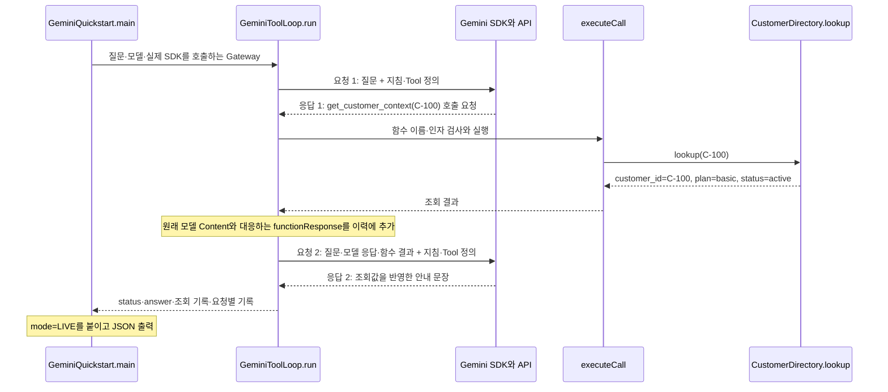

# 6주차 API 학습 노트

## Day 1 — Gemini 일반 호출과 응답 해석

### 입력과 지침을 분리하는 이유

대상은 도구 없이 메모를 한 문장으로 요약하는 요청이다. 실행 진입점은 [GeminiQuickstart.java](llm_lab/src/main/java/lab/week06/GeminiQuickstart.java)의 `main()`이다. 실행 결과의 `request.input`은 다음 기본 메모와 일치한다.

> 메모를 한 문장으로 요약해줘: 로그인 수정 완료, 배포 확인 필요.

사용자 입력은 처리할 내용이고, `INSTRUCTIONS`는 그 내용을 처리할 때 적용할 원칙이다.

> 한국어로 간결하게 요약하세요. 입력의 사실과 완료 여부를 보존하고, 확인 필요나 미완료인 일을 완료된 사실로 바꾸지 마세요.

`requestConfig()`는 이 지침을 `systemInstruction`에 넣어 사용자 입력과 함께 전달할 요청 설정을 만든다. 요약할 메모와 처리 원칙이 분리되어 있으므로 다른 메모를 넣어도 같은 사실 보존 지침을 재사용할 수 있다.

이번 입력에는 요약에 필요한 사실이 모두 들어 있다. 따라서 요청 설정에 고객 조회 Tool을 추가하지 않으며, 실제 출력에서도 `tools`와 `tool_results`가 빈 목록이다. 외부 고객 정보가 필요한 질문에서는 조회 기능을 연결할 필요가 생긴다.

### 설정에서 실제 호출까지의 경로

실행 모델은 `gemini-3.8-flash`, SDK는 [build.gradle](llm_lab/build.gradle)에 고정한 Google GenAI Java SDK 1.70.0이다. `main()`은 `GEMINI_API_KEY`, `GEMINI_MODEL`, `AI_AX_LIVE=1`을 확인하고 실제 호출용 클라이언트를 구성한다.

```java
result = run(text, environment.get("GEMINI_MODEL"),
        (model, input, config) ->
                client.models.generateContent(model, input, config));
```

`run()` 안에서는 다음 호출이 위 SDK 연결로 이어진다.

```java
response = gateway.generate(model, text, requestConfig());
```

앱은 입력·지침·제한을 구성하고, SDK는 API 통신과 응답 객체를 제공한다. `Gateway`는 이 연결을 전달하는 자리다. 고정 응답을 사용하는 실행과 실제 API 실행에서 연결 부품을 바꿀 수 있으면서, 요청 구성과 응답 해석 흐름을 함께 확인할 수 있다.

출력의 `request` 객체는 `run()`에서 앱이 만든 설정 요약이다. 서버가 반환한 원본 요청 내역은 아니다. `model_requests=1`도 앱이 호출 직전에 기록한 시도 수이며, SDK에는 `attempts(1)`을 설정해 자동 재시도 없이 한 번만 시도한다.

### 응답 종료와 사실 보존은 별도로 확인한다

실제 답변:

> 로그인 수정은 완료되었으며, 배포 확인이 필요합니다.

`mode=LIVE`인 실행에서 모델의 종료 이유는 `STOP`, 앱이 분류한 결과는 `MODEL_RESPONSE`였다.

`run()`은 응답의 첫 번째 후보에서 `finishReason`을 읽고, `response.text()`에서 답변을 꺼낸다. 이어 차단 여부, 종료 이유, 빈 답변과 예상하지 않은 함수 호출을 검사한다. 이번 응답은 차단 없이 `STOP`으로 끝났고 답변이 있으며 함수 호출도 없어 `MODEL_RESPONSE`로 분류되었다.

| 입력의 사실 | 실제 답변 | 해석 |
|---|---|---|
| 로그인 수정 완료 | 로그인 수정은 완료되었으며 | 완료 상태가 유지됨 |
| 배포 확인 필요 | 배포 확인이 필요합니다 | 아직 필요한 작업으로 유지됨 |

`STOP`은 모델이 보고한 생성 종료 이유이고, `MODEL_RESPONSE`는 응답을 검사한 앱의 분류다. 이 코드에는 원문과 답변의 사실 일치를 자동 평가하는 기능이 없다. 이번 요약의 정확성은 위 두 문장을 대조한 결과로 확인된다.

앞서 실행한 `Quickstart --offline --plain`도 `MODEL_RESPONSE`를 출력했지만 답변은 “이 문장은 고정된 오프라인 예시입니다.”였고 모드는 `SCRIPTED_OFFLINE`이었다. 같은 결과 분류라도 오프라인 실행은 연결 구조를 확인한 근거이며, 이번 실제 응답은 Gemini의 요약 결과를 확인한 근거다.

<details>
<summary>실행 참고 정보: 요청 설정과 보고된 사용량</summary>

| 항목 | 값 |
|---|---:|
| 출력 토큰 상한 | 2,048 |
| 추론 수준 | `LOW` |
| `promptTokenCount` | 60 |
| `candidatesTokenCount` | 15 |
| `thoughtsTokenCount` | 319 |
| `totalTokenCount` | 394 |

</details>


## Day 2 — Gemini 고객 조회 요청과 실제 결과 연결

이 절의 계약과 코드 발췌는 전체 고객 레코드를 반환하던 Day 2 실행 시점의 근거다. 요청 항목을 선택하는 현재 계약과 변경 위치는 아래 Day 3에 연결한다.

### 호출 구조와 역할을 나눈 이유

제공 고객 조회 업무에서 선택한 구조는 **모델이 조회를 요청하고, 앱이 검사·실행한 결과를 다시 모델에 전달해 안내를 만드는 흐름**이다. `get_customer_context(customer_id)` 하나로 요금제와 상태를 함께 반환하고, 한 응답당 호출 하나와 모델 요청 최대 세 번을 허용하기로 했다. 두 정보가 같은 고객 레코드에 있으므로 이번 요구에서는 한 번의 조회로 충분하다.

[GeminiQuickstart.java](llm_lab/src/main/java/lab/week06/GeminiQuickstart.java)의 `main`은 실행 인자·환경 설정·SDK 연결·콘솔 출력을 맡는다. [GeminiToolLoop.java](llm_lab/src/main/java/lab/week06/GeminiToolLoop.java)의 `run`은 입력 이력과 반복을 관리하며 응답에 따라 조회·다음 요청·종료를 결정한다. 같은 파일의 `executeCall`은 모델이 요청한 함수 이름과 인자를 검사한다. [CustomerDirectory.java](llm_lab/src/main/java/lab/week06/CustomerDirectory.java)의 `lookup`은 제공된 메모리 자료에서 고객을 찾아 반환한다. 이번 실습의 조회는 외부 DB 접속이 아니라 로컬 업무 함수 호출이다.

다음은 Day 2의 실제 정상 결과와 당시 코드를 연결한 호출 순서다. SDK와 API 통신은 하나의 참여자로 묶었으며, 각 메시지는 요청·응답 원문 전체가 아닌 역할 요약이다.



### 첫 요청: 실행 진입점에서 SDK까지

IDE의 실행 인자는 `--tools --text "C-100 고객의 요금제를 알려주세요."`다. `main`은 `--tools`로 고객 조회 경로를 선택하고 `--text` 뒤의 문장을 `text`로 받는다. 실제 실행에서는 `GEMINI_API_KEY`, `GEMINI_MODEL`, `AI_AX_LIVE=1` 설정을 확인한 뒤 기존 Google GenAI Java SDK 1.70.0 클라이언트를 만든다. SDK 연결에는 요청 시간 제한과 `attempts(1)`이 설정되어 있다.

다음 실제 코드에서 마지막 인자는 `Gateway`의 동작을 전달한다.

```java
if (tools) result = GeminiToolLoop.run(text, environment.get("GEMINI_MODEL"),
        (model, history, config) -> client.models.generateContent(model, history, config));
```

`Gateway`는 `run`이 모델을 요청할 때 호출하는 앱 내부 연결점이다. 위 연결을 사용하면 공식 SDK의 `generateContent`가 실행되고 `GenerateContentResponse`가 돌아온다. 대역 실행에서는 같은 자리에 고정 응답을 돌려주는 함수를 넣는다. 그래서 모델 경계를 바꿔도 앱의 인자 검사·업무 조회·이력 전달·종료 흐름을 그대로 확인할 수 있다.

`run`은 최초 질문을 `history`에 넣는다.

```java
history.add(Content.builder().role("user").parts(Part.fromText(text)).build());
```

반복문 안의 다음 호출이 위 SDK 연결로 이어진다.

```java
response = gateway.generate(model, List.copyOf(history), requestConfig());
```

전달하는 값은 모델, 대화 이력, 요청 설정이다. `List.copyOf(history)`는 이번 요청 시점의 이력 목록을 전달한다. `requestConfig()`는 Day 1의 출력 제한·추론 수준을 재사용하면서 고객 조회 지침을 `systemInstruction`에 넣고 `tools(TOOL)`로 함수 정의를 추가한다. 지침과 Tool 정의는 `history`의 항목이 아니라 별도의 설정으로 매 요청에 함께 전달된다.

Tool 정의에는 공개 이름 `get_customer_context`, 설명, 필수 문자열 인자 `customer_id`가 들어 있다. 이는 모델이 어떤 기능을 어떤 입력으로 요청할지 알려주는 계약이다. 실제 조회 함수의 데이터나 실행 코드를 모델에 보내는 것은 아니다. 콘솔의 `request.tools`는 앱이 만든 이름 목록 요약이며, SDK에 전달된 전체 함수 스키마를 출력한 값은 아니다.

### 첫 응답: 생성 종료와 함수 실행 판단

실제 첫 응답에 대응하는 앱 기록은 다음 호출을 담고 있다.

```text
name: get_customer_context
call_id: call_2870933
arguments: {customer_id: C-100}
```

`run`은 차단 여부와 `finishReason`을 확인한 뒤 첫 번째 응답 후보의 `Content`를 읽는다. 그 안의 `parts`에서 함수 호출을 모으는 실제 코드는 다음과 같다.

```java
Content content = response.candidates().orElseThrow().get(0).content().orElseThrow();
var parts = content.parts().orElse(List.of());
var calls = parts.stream().flatMap(part -> part.functionCall().stream()).toList();
```

이번 첫 요청의 `finish_reason`은 `STOP`이었다. 이 값은 이번 모델 응답의 생성이 끝났다는 뜻이다. 응답 안에는 실행을 요청하는 `functionCall`이 있었으므로 앱은 최종 답변으로 반환하지 않고 조회 경로를 계속 진행했다. 함수 호출이 하나인지, 추가 조회 결과를 전달할 다음 요청 여유가 있는지도 실행 전에 검사한다.

`executeCall`의 핵심 검사는 다음과 같다.

```java
if (!TOOL_NAME.equals(name)) return Map.of("error", "UNKNOWN_TOOL");
if (args == null || !args.keySet().equals(Set.of("customer_id"))
        || !(args.get("customer_id") instanceof String id) || id.isBlank())
    return Map.of("error", "INVALID_ARGUMENTS");
return CustomerDirectory.lookup(id);
```

공개한 함수 이름과 일치하고, 키가 `customer_id` 하나이며, 값이 비어 있지 않은 문자열이어야 조회한다. 모델에 스키마를 알려주는 것과 실제 실행 입력을 앱에서 검사하는 것은 서로 다른 책임이다. 특히 이 스키마에는 추가 키 금지 조건이 없지만 앱의 키 집합 검사는 추가 인자도 거부한다.

`lookup("C-100")`은 메모리의 `CUSTOMERS`에서 `{plan: basic, status: active}`를 찾아 복사하고 `customer_id`를 붙인다. 모델이 고객 값을 만들어 실행하는 것이 아니라, 앱이 제공 업무 자료에서 얻은 값이 반환된다.

### 두 번째 요청: 어떤 호출의 결과인지 이어 붙이기

앱은 조회값을 `functionResponse`로 포장한다. 이때 함수 이름을 넣고, 모델에서 호출 ID를 받았다면 그 ID도 그대로 넣는다. 이번 실제 호출에서는 `call_2870933`이 있었다.

```java
var value = executeCall(name, args);
var functionResponse = FunctionResponse.builder().name(name).response(value);
call.id().ifPresent(functionResponse::id);
history.add(content);
history.add(Content.builder().role("user")
        .parts(Part.builder().functionResponse(functionResponse.build()).build()).build());
```

여기서 `history.add(content)`는 모델이 반환한 원래 응답을 보존한다. 함수 이름과 인자만 뽑아 새 응답을 만들면 다른 응답 항목이나 `thoughtSignature` 같은 메타데이터를 잃을 수 있다. Gemini의 함수 호출 결과는 원래 호출과 대응시켜 전달해야 하며, 받은 서명도 원래 위치에 보존해야 한다. [Gemini 함수 호출](https://ai.google.dev/gemini-api/docs/generate-content/function-calling?authuser=0&hl=en), [응답 메타데이터 보존](https://ai.google.dev/gemini-api/docs/generate-content/thought-signatures)

두 번째 요청에 전달하는 이력은 다음 세 항목이다. 이는 코드와 실행 기록에 근거해 필요한 부분만 표시한 구조이며 API 원문 덤프는 아니다.

```text
history[0] user: "C-100 고객의 요금제를 알려주세요."
history[1] model: 원래 응답 Content
                 └ functionCall: get_customer_context, id=call_2870933,
                                  args={customer_id: C-100}
history[2] user: functionResponse
                └ name=get_customer_context, id=call_2870933,
                  response={customer_id: C-100, plan: basic, status: active}
```

세 번째 항목의 역할이 `user`여도 사람이 새 문장을 입력한 것은 아니다. 앱이 함수 결과를 전달하는 Content이며, `parts` 안에 일반 텍스트 대신 `functionResponse`가 들어 있다. 고객 번호는 조회할 대상을, 호출 ID는 이 결과가 어느 요청에 대응하는지를 나타낸다.

다음 반복에서 같은 `gateway.generate`를 다시 호출한다. 실제 출력의 `input_contents`가 1에서 3으로 늘어난 것은 위 이력 변화와 일치한다. 이 값은 앱이 센 Content 항목 수이며, 토큰 수나 지침·Tool 정의까지 합친 전체 입력 개수는 아니다. `tool_results`는 조회 근거를 콘솔에 남기는 기록이고, 다음 SDK 요청에는 별도로 구성한 `history`가 전달된다.

### 두 번째 응답: 안내 문장을 결과로 반환하기

두 번째 요청도 `STOP`으로 끝났고, 앱은 함수 호출이 없는 응답에서 답변 텍스트를 모았다.

```java
if (calls.isEmpty()) {
    String answer = parts.stream().filter(part -> !part.thought().orElse(false))
            .flatMap(part -> part.text().stream()).reduce("", String::concat);
    result.put("answer", answer);
    result.put("status", answer.isBlank() ? "INVALID_OUTPUT" : "MODEL_RESPONSE");
    return result;
}
```

`thought`로 표시된 부분을 제외한 텍스트를 합치고, 비어 있지 않으면 앱 결과를 `MODEL_RESPONSE`로 분류해 반복을 끝낸다. `main`은 반환된 결과에 `mode=LIVE`를 붙이고 `print(result)`로 콘솔에 JSON을 출력한다. 콘솔의 최상위 `status`, `answer`, `tool_results`, `turns`는 앱이 구성한 결과이며, SDK 응답 원문 전체가 아니다. `turns[].finish_reason`과 `usage`에는 모델 응답에서 읽은 정보가 들어 있다.

실제 모델 `gemini-3.8-flash`의 최종 답변:

> C-100 고객의 현재 요금제는 **basic**이며, 계정 상태는 **활성(active)**입니다.

실제 반환값의 `plan=basic`, `status=active`와 답변의 두 값이 일치한다. 모델 요청 두 번과 조회 한 번으로 끝났으므로, 첫 요청에서 조회를 요청하고 두 번째 요청에서 결과를 설명한다는 예상 경로와도 일치했다. `MODEL_RESPONSE` 분기에는 조회값과 문장의 사실 일치를 자동으로 평가하는 기능이 없다. 이번 답변의 사실 보존은 실제 조회값과 문장을 대조한 근거로 판단한다.

요금제만 물었는데 계정 상태도 답변에 포함됐다. 이번 Tool이 전체 고객 레코드를 반환했으므로 모델이 두 정보를 모두 참조할 수 있었다. 짧게 답하라는 지침만으로 모델에 전달되는 고객 정보를 줄일 수는 없다. Day 3의 후속 요구는 이 연결에서 공개할 조회 항목과 반환값을 바꾸는 문제다.

### 업무 오류 전달과 호출 종료의 차이

없는 고객도 같은 함수 요청·조회·결과 전달 경로를 사용한다. `lookup("C-404")`는 `CUSTOMER_NOT_FOUND`를 반환하고, 앱은 그 오류를 `functionResponse.response`에 넣는다. 모델이 조회 부재를 알아야 고객 번호 확인 같은 다음 행동을 안내할 수 있다. 성공과 실패를 모두 빈 객체로 돌려주면 무엇을 보완해야 하는지 판단할 근거가 사라진다.

확인한 대역 결과는 다음과 같다. 모델 경계의 호출 선택을 고정한 상태에서 앱의 검사·실제 업무 함수·결과 전달을 실행했다.

| 입력 | 실제 조회값 | 대역 최종 안내 |
|---|---|---|
| `C-100 고객의 요금제를 알려주세요.` | `customer_id=C-100, plan=basic, status=active` | `C-100 고객의 요금제는 basic입니다.` |
| `C-404 고객의 요금제를 알려주세요.` | `error=CUSTOMER_NOT_FOUND` | `고객을 찾을 수 없습니다. 고객 번호를 확인해 주세요.` |

없는 고객 경로도 최종 분류는 `MODEL_RESPONSE`였다. 이 값은 API 응답을 코드가 해석해 붙인 앱의 응답 상태이며, 고객 조회의 성공을 의미하지 않는다. 현재 분기는 차단·종료 이유와 함수 호출 여부를 확인하고 비어 있지 않은 답변이 있을 때 이 상태를 반환한다. 고객 조회 성공 여부는 `tool_results[].result`의 조회값 또는 업무 오류로 판단한다. 전송 실패는 SDK 호출에서 정상 응답을 얻지 못한 상황이어서 `PROVIDER_ERROR`로 끝내고, 앞서 조회했다면 그 근거를 남긴다.

반복 종료는 조회의 성공 여부와도 다르다. 현재 앱은 모델 요청을 최대 세 번 허용하고, 세 번째 응답도 조회를 요청하면 실행 전에 `STOPPED`로 끝낸다. 더 조회해도 결과를 전달할 다음 요청이 없기 때문이다. 반복 대역에서 모델 요청 세 번·조회 두 번으로 이 경계를 확인했다. 순차 조회해야 할 기능이 늘어나면 필요한 왕복 수에 맞춰 한도를 다시 판단해야 한다.

### 대역으로 확인한 응답 보존

정상 고객의 실제 모델 호출은 위 IDE 출력으로 확인했다. 없는 고객의 안내와 반복 종료는 대역으로 확인했으며, 이 대역 결과가 실제 Gemini의 선택이나 답변을 확인한 것은 아니다. 실제 콘솔 출력에는 원래 모델 Content와 서명 전문이 없으므로, 해당 항목의 보존은 구현과 대역 검사에 근거해 설명한다.

[GeminiToolLoopTest.java](llm_lab/src/test/java/lab/week06/GeminiToolLoopTest.java)의 `normalAndMissingCustomerReturnActualResultsWithOriginalModelContent`는 다음 모델 요청을 받는 지점에서 원래 Content 객체, 호출 ID와 실제 조회값이 전달되는지 검사한다. 자세한 검사 결과는 `llm_lab/build/reports/tests/test/index.html`, 메인 클래스의 대역 실행 결과는 `llm_lab/.local/day2-normal.json`과 `llm_lab/.local/day2-unknown.json`에 있다.


## Day 3 — 조회 항목을 인자로 받고 공개할 결과 구성하기

### 후속 요구와 선택한 계약

Day 2의 실제 질문은 요금제만 요청했지만 모델에 전달한 결과에는 `basic`과 `active`가 모두 있었고, 최종 답변에도 두 정보가 포함됐다. 후속 요구는 **요금제·계정 상태 중 질문한 항목만 모델에 반환하고, 둘 다 물으면 두 항목을 반환하는 것**이다.

기존 `get_customer_context`에 `fields` 인자를 추가하고, 앱이 그 인자에 따라 조회 결과에서 필요한 항목을 골라 반환하는 구조를 선택했다. 두 항목은 같은 `CustomerDirectory.lookup`에서 나오므로 공개 기능 하나로 한 번에 조회할 수 있다. 항목별로 Tool을 분리하면 두 정보를 요청했을 때 호출과 결과를 각각 연결해야 한다. 권한이나 데이터 제공자가 항목별로 달라지는 요구라면 그 분리를 다시 판단할 수 있다.

### 모델의 항목 선택에서 실제 조회까지

[GeminiToolLoop.java](llm_lab/src/main/java/lab/week06/GeminiToolLoop.java)의 `TOOL`은 이제 필수 인자로 `customer_id`와 `fields`를 공개한다. `fields`는 하나 이상의 문자열을 담는 목록이고, 스키마의 허용 값은 `plan`과 `status`다. `INSTRUCTIONS`도 요금제 질문에는 `plan`, 계정 상태 질문에는 `status`, 둘 다 묻는 질문에는 두 항목을 지정하도록 설명한다. `fields`라는 이름과 허용 항목은 앱이 선택한 업무 계약이며 Gemini API가 모든 Tool에 요구하는 공통 필드는 아니다.

`GeminiQuickstart.main → GeminiToolLoop.run → Gateway → SDK`로 요청을 전달하는 경로에서 모델은 다음과 같은 인자를 보낼 수 있다. 아래는 요금제 질문의 예상 호출 형태다.

```json
{"customer_id":"C-100","fields":["plan"]}
```

`run`이 응답의 함수 호출을 읽어 `executeCall(name, args)`에 넘기면 앱은 이름·고객 번호·항목 목록을 검사한다. 인자는 두 키를 모두 가져야 하며, 고객 번호는 비어 있지 않은 문자열, `fields`는 비어 있지 않은 목록이어야 한다.

```java
if (args == null || !args.keySet().equals(Set.of("customer_id", "fields"))
        || !(args.get("customer_id") instanceof String id) || id.isBlank()
        || !(args.get("fields") instanceof List<?> fields) || fields.isEmpty())
    return Map.of("error", "INVALID_ARGUMENTS");
```

목록의 각 값도 허용 항목인지 검사한다. 예를 들어 `["plan", "email"]`이 들어오면 지원하지 않는 항목을 무시하고 일부 성공을 반환하는 대신 인자 오류를 반환한다. 중복된 `plan`은 같은 선택으로 묶어 한 번만 반환한다.

```java
var selected = new LinkedHashSet<String>();
for (Object field : fields) {
    if (!(field instanceof String requested) || !ALLOWED_FIELDS.contains(requested))
        return Map.of("error", "INVALID_ARGUMENTS");
    selected.add(requested);
}
```

검사가 끝나면 업무 함수에서 실제 고객을 조회한다. 업무 함수는 여전히 고객 ID·요금제·상태 전체를 반환한다. 전체 자료를 관리하는 책임과 모델에게 공개할 범위를 고르는 책임이 여기서 나뉜다.

### 조회값에서 모델에 전달할 결과까지

`executeCall`의 반환 부분은 다음과 같다.

```java
var customer = CustomerDirectory.lookup(id);
if (customer.containsKey("error")) return customer;
var result = new LinkedHashMap<String, Object>();
result.put("customer_id", customer.get("customer_id"));
for (String field : selected) result.put(field, customer.get(field));
return result;
```

먼저 업무 오류가 있으면 그대로 반환한다. `C-404`의 결과에는 `plan`이나 `status` 대신 `error=CUSTOMER_NOT_FOUND`가 있으므로, 성공 필드만 고르는 처리를 먼저 하면 오류가 사라질 수 있다. 성공한 경우에는 새 결과에 고객 ID와 선택한 필드만 넣는다. 원래 고객 자료를 지우거나 수정하지 않으므로 다른 질문에서도 같은 업무 함수를 재사용할 수 있다.

요금제 질문에서 반환값이 연결되는 경로는 다음과 같다.

```text
모델 호출 인자: customer_id=C-100, fields=[plan]
  → executeCall: 인자 검사
  → CustomerDirectory.lookup: {customer_id:C-100, plan:basic, status:active}
  → 결과 선택: {customer_id:C-100, plan:basic}
  → FunctionResponse.response: 선택한 결과만 넣음
  → history: 원래 모델 Content + 대응하는 functionResponse 추가
  → 다음 SDK 요청: 질문·모델 응답·선택한 함수 결과 전달
  → 모델의 최종 답변을 앱의 answer로 반환
```

`run`의 연결부는 `executeCall`이 반환한 값을 그대로 `functionResponse`에 넣는다.

```java
var value = executeCall(name, args);
var functionResponse = FunctionResponse.builder().name(name).response(value);
call.id().ifPresent(functionResponse::id);
```

따라서 필터링은 콘솔 표시 직전이 아니라 **다음 모델 요청에 결과를 넣기 전**에 적용된다. `tool_results[].result`에도 같은 선택 결과가 기록된다. 원래 모델 Content와 호출 ID의 보존, 답변을 `main`으로 돌려주는 흐름은 Day 2에서 확인한 연결을 계속 사용한다. 두 항목을 함께 요청해도 함수 호출 하나로 처리할 수 있어 기존 요청 한도로 정상 왕복을 처리할 수 있다.

앱이 검사하는 것은 모델이 보낸 `fields`와 실제 반환 필드의 일치다. 자연어 질문에 맞게 `fields`를 골랐는지는 별도로 실제 모델의 인자를 읽어 확인해야 한다. 예를 들어 요금제만 질문했는데 모델이 두 항목을 요청하면, 두 값 모두 허용 항목이므로 앱은 둘 다 반환한다. 스키마와 필터링 검사만으로 자연어 해석의 정확성을 확인할 수 없는 이유다.

### 세 대역에서 모델에 전달한 반환값

대역을 각각 `normal`, `status`, `both`로 정해 다른 `fields`를 가진 호출을 보내고, 같은 앱의 검사·조회·결과 전달을 실행했다.

| 질문 | 대역이 보낸 fields | 대역에 전달한 실제 함수 결과 |
|---|---|---|
| `C-100 고객의 요금제를 알려주세요.` | `["plan"]` | `customer_id=C-100, plan=basic` |
| `C-100 고객의 계정 상태를 알려주세요.` | `["status"]` | `customer_id=C-100, status=active` |
| `C-100 고객의 요금제와 계정 상태를 알려주세요.` | `["plan","status"]` | `customer_id=C-100, plan=basic, status=active` |

세 경우 모두 모델 경계 요청 두 번과 조회 한 번으로 안내가 반환됐다. 요금제 대역에는 상태 값이, 상태 대역에는 요금제 값이 전달되지 않았다. 두 항목 대역에서는 두 값이 모두 전달돼 선택한 계약의 예상과 일치했다. 대역 안내는 각각 반환된 값으로 구성하며, 실제 모델의 항목 선택·답변을 확인한 결과와 구분한다.

[GeminiToolLoopTest.java](llm_lab/src/test/java/lab/week06/GeminiToolLoopTest.java)의 `eachRequestedFieldSetIsProjectedBeforeTheNextModelRequest`는 두 번째 모델 요청을 받는 지점에서 실제 `functionResponse.response`를 기대 결과와 비교한다. 이 검사는 화면에서 필드를 숨긴 것만으로 통과할 수 없으며, SDK 경계로 전달한 필드 자체를 확인한다.

메인 클래스 실행 결과는 `llm_lab/.local/day3-normal.json`, `llm_lab/.local/day3-status.json`, `llm_lab/.local/day3-both.json`에 있다.

### 실제 모델의 항목 선택과 최종 답변

같은 세 질문의 IDE 출력에서 `mode=LIVE`, 모델 `gemini-3.8-flash`의 결과를 확인했다. 이번에는 실제 모델이 선택한 인자, 앱의 반환값과 최종 답변을 함께 대조했다.

| 질문 | 실제 arguments.fields | 실제 result | 실제 answer |
|---|---|---|---|
| 요금제 | `["plan"]` | 고객 ID와 `plan=basic` | C-100 고객의 요금제는 **basic**입니다. |
| 계정 상태 | `["status"]` | 고객 ID와 `status=active` | C-100 고객의 계정 상태는 활성(active) 상태입니다. |
| 요금제와 계정 상태 | `["plan","status"]` | 고객 ID와 `plan=basic`, `status=active` | C-100 고객의 요금제는 **basic**이며, 계정 상태는 **active**입니다. |

세 실행 모두 질문에 맞는 항목을 선택했고, 반환값에 요청하지 않은 고객 정보가 포함되지 않았다. 최종 답변도 전달한 조회값을 보존했다. 요금제만 물었을 때 상태까지 안내했던 Day 2 결과와 비교하면, 이번에는 모델이 `plan`만 요청하고 앱이 `status`를 함수 결과에서 제외해 요금제만 안내했다.

이 차이는 모델의 항목 선택과 앱의 결과 구성이 함께 맞아야 요구를 만족한다는 점을 보여 준다. 지침과 Tool 정의가 자연어 질문을 인자로 연결하고, `executeCall`이 그 인자를 실제 반환 범위로 적용한다. 모델이 올바른 항목을 선택했더라도 전체 레코드를 그대로 보내면 정보 범위 제한은 구현되지 않은 것이다. 반대로 필터링 코드만 정확해도 모델이 질문과 다른 유효 항목을 선택할 수 있어, 실제 실행에서는 두 위치를 함께 읽는다.

각 성공 실행은 모델 요청 두 번·조회 한 번이며, 이력 항목 수는 1에서 3으로 늘었다. 요청 항목을 고르는 처리는 기존 조회와 결과 전달 사이에 들어갔고, 두 항목을 함께 요청해도 한 번의 함수 호출로 처리되어 예상 경로와 일치했다. 이 관찰은 제공한 세 실제 입력에 대한 결과다.


## Day 4 — 업무 오류의 전달과 반복 종료의 책임

### 모델 요청과 업무 함수 호출을 구분하기

이 앱의 처리에는 두 종류의 호출이 있다. `gateway.generate(...)`는 실제 연결에서 Gemini API에 입력을 보내 모델 응답을 받는다. `executeCall(...) → CustomerDirectory.lookup(...)`은 앱 내부에서 제공 고객 자료를 조회한다. 모델 응답의 `functionCall`은 이 로컬 함수를 실행해 달라는 요청 데이터다. 모델이 로컬 함수를 직접 실행하거나 다음 API 요청을 스스로 전송하는 것은 아니다. 다음 행동을 실행하는 주체는 `GeminiToolLoop.run`의 코드다.

Day 3의 세 실제 성공 결과는 각각 **모델 요청 두 번과 고객 조회 한 번**이었다. 이 둘을 모두 단순히 “호출”이라고 부르면 왜 다음 요청이 필요한지와 무엇을 제한하는지가 섞인다.

### 조회가 성공했는데 두 번째 모델 요청이 필요한 이유

첫 모델 요청에는 사용자 질문, 지침과 Tool 정의가 들어 있다. 모델은 현재 고객 자료를 직접 읽지 못하므로 `get_customer_context(customer_id="C-100", fields=["plan"])`을 요청한다. 이 응답이 생성될 때에는 앱의 고객 조회가 아직 실행되지 않았으므로, 이번 조회로 확인할 `basic` 값도 첫 요청의 입력에는 없다.

앱이 그 응답을 읽어 함수를 실행하면 비로소 고객 ID와 `plan=basic`을 얻는다. 그러나 조회 함수가 반환한 값은 앱 메모리에 생긴 데이터다. 이미 응답을 마친 모델에게 저절로 전달되지는 않는다. 이 앱은 모델에게 실제 조회값을 바탕으로 자연어 안내를 만들게 하므로, 조회값을 포함한 **새 모델 요청**이 필요하다.

```text
모델 요청 1: “C-100 고객의 요금제를 알려주세요.” + Tool 정의
  ← 모델 응답 1: “get_customer_context(C-100, fields=[plan])을 실행해 달라”

로컬 조회 1: CustomerDirectory.lookup("C-100")
  → 앱이 선택한 결과: {customer_id:C-100, plan:basic}

모델 요청 2: 최초 질문 + 모델의 호출 요청 + 실제 함수 결과
  ← 모델 응답 2: “C-100 고객의 요금제는 basic입니다.”

앱이 최종 답변을 반환하고 이번 처리를 종료
```

이는 정상 처리에서도 필요한 두 단계다. SDK의 전송 실패 재시도와는 역할이 다르다. 현재 실제 SDK 연결의 `attempts(1)`은 자동 재시도를 끄지만, 앱이 조회 결과를 전달하려고 두 번째 `generateContent`를 호출하는 흐름은 그대로 존재한다.

결과를 정해진 화면이나 문장에 넣어 보여주는 요구라면 일반 코드가 조회값을 표시하고 끝낼 수도 있다. 이번에는 모델이 질문을 해석하고 조회 결과를 설명하는 구조를 선택했기 때문에 이 왕복을 사용한다.

### 두 번째 모델 응답이 반드시 최종 안내는 아닌 이유

`requestConfig()`는 다음 요청에도 지침과 Tool 정의를 함께 보낸다. 따라서 두 번째 응답에도 텍스트 안내뿐 아니라 새로운 `functionCall`이 들어올 수 있다. 이번 지침에는 “조회 결과가 있으면 답하세요”가 있지만, 앱 코드가 두 번째 응답을 무조건 최종 문장으로 고정하는 것은 아니다.

일반적인 Tool Calling에서는 추가 정보가 필요해 다른 함수를 요청하는 흐름도 가능하다. 현재 한 고객을 조회하는 요구에서는 한 번의 조회로 충분하지만, 모델이 이미 받은 정보를 다시 요청하는 응답도 앱이 처리할 수 있는 형태다. 같은 유효한 조회를 계속 보내는 반복 대역은 그 상황에서 앱이 어떻게 움직이는지 확인하기 위한 입력이다. 실제 Gemini가 이번 실습에서 반복했다는 기록은 아니다.

여기서는 세 종료를 구분해야 한다.

| 종료한 대상 | 의미 | 그 다음에 가능한 처리 |
|---|---|---|
| 한 번의 모델 응답 생성 | 이번 응답을 만드는 작업이 끝남. 실제 첫 응답도 `STOP`이었음 | 응답 안에 함수 요청이 있으면 앱이 조회할 수 있음 |
| 한 번의 고객 조회 | 업무 함수가 고객값 또는 업무 오류를 반환함 | 앱이 그 결과를 모델에 전달할 수 있음 |
| 앱의 이번 요청 처리 | `run`이 최종 결과를 반환함 | 현재 반복문을 더 진행하지 않음 |

따라서 `STOP`이나 조회 성공만으로 전체 처리의 종료를 결정할 수 없다. `run`은 응답 안의 함수 호출 여부와 앱의 실행 정책을 함께 판단한다.

### 다음 요청으로 넘어가는 실제 코드 위치

[GeminiToolLoop.java](llm_lab/src/main/java/lab/week06/GeminiToolLoop.java)의 `run`은 반복문 시작에서 모델에 요청한다.

```java
for (int index = 1; index <= MAX_REQUESTS; index++) {
```

반복문의 본문에서 수행하는 모델 요청은 다음과 같다.

```java
response = gateway.generate(model, List.copyOf(history), requestConfig());
```

응답을 검사한 뒤 함수 호출이 없으면 텍스트를 모아 반환한다. 아래는 Day 4 시점의 분기로, `return result`가 **`run` 전체를 끝낸다**. Day 5에서는 이 반환 직전에 최종 응답을 이력에 저장하는 코드를 추가했다.

```java
if (calls.isEmpty()) {
    String answer = parts.stream().filter(part -> !part.thought().orElse(false))
            .flatMap(part -> part.text().stream()).reduce("", String::concat);
    result.put("answer", answer);
    result.put("status", answer.isBlank() ? "INVALID_OUTPUT" : "MODEL_RESPONSE");
    return result;
}
```

함수 호출이 하나 있고 남은 요청 여유가 있으면, 앱은 실제 함수를 실행하고 결과를 이력에 붙인다.

```java
var value = executeCall(name, args);
var functionResponse = FunctionResponse.builder().name(name).response(value);
call.id().ifPresent(functionResponse::id);
history.add(content);
history.add(Content.builder().role("user")
        .parts(Part.builder().functionResponse(functionResponse.build()).build()).build());
```

이 정상적인 함수 실행 경로에서는 `toolResults`에 실행 기록을 추가한 뒤 **`return` 없이 반복문 본문 끝에 도달**한다. 그러면 `index++`가 실행되고 반복 조건을 검사한 뒤 다음 `gateway.generate`로 들어간다. 이때 앞선 호출 요청과 실제 결과가 추가된 이력이 새 요청으로 전달된다. 다음 요청은 모델이 뒤에서 자동 실행하는 것이 아니라 이 반복문 때문에 발생한다.

### 종료 조건이 있어도 횟수 상한은 별도로 필요한 이유

“종료 조건이 없다”와 “몇 번 안에 종료되는지 보장하지 못한다”는 다른 문제다. 횟수 제한이 없더라도 “함수 호출 없는 최종 답변이 오면 종료”라는 조건은 둘 수 있다. 하지만 그 조건은 다음 모델 응답의 내용에 달려 있다.

예를 들어 **횟수 제한을 둔 현재 반복문을 제한 없는 반복으로 바꾸고, 요청 한도 분기도 없앴다**고 가정하면 다음 경로가 가능하다. 이는 현재 코드의 실행 결과가 아니라 제한을 제거했을 때의 설명용 흐름이다.

```text
요청 1 → 유효한 조회 요청 → 조회 성공 → 결과를 붙여 다음 요청
요청 2 → 유효한 조회 요청 → 조회 성공 → 결과를 붙여 다음 요청
요청 3 → 유효한 조회 요청 → 조회 성공 → 결과를 붙여 다음 요청
...
```

각 응답이 올바른 형식의 조회 요청이면 인자 검사나 업무 오류 처리에 걸리지 않는다. 모델이 함수 호출 없는 답변을 내면 종료하겠지만, 이 조건만으로는 “반드시 N번째 요청 이전에 그런 답변이 온다”는 경계를 정할 수 없다. 현실에서 서비스 제한이나 연결 오류로 멈출 수도 있으나, 그 외부 사건을 기다리는 것으로 앱의 실행 횟수 상한을 정한 것은 아니다. 모델에 “곧 답하라”고 지시하는 것도 앱의 횟수 조건을 대신하지 않는다.

현재 앱에는 이미 `index <= MAX_REQUESTS`와 아래 한도 분기가 있으므로 이 제한 없는 가정과 다르다. 특히 **한도 분기 하나만 없앤다고 현재 `for`가 무한 반복으로 바뀌는 것은 아니다.** 반복문의 조건 자체도 최대 요청 수를 제한한다. 여기서 다루는 문제는 모델 응답만 종료 기준으로 삼고 앱의 횟수 제한을 두지 않은 설계다.

### 현재 앱은 어느 위치에서 상한을 보장하는가

`MAX_REQUESTS=3`이고 `index`는 한 번의 `run`에서 모델 요청마다 증가한다. `index <= MAX_REQUESTS` 때문에 네 번째 모델 요청은 시작할 수 없다. 여기에 함수 실행 전의 다음 분기가 중단 이유를 결과로 반환하고, 결과를 전달할 기회가 없는 추가 조회도 막는다.

```java
if (index == MAX_REQUESTS) {
    result.put("status", "STOPPED");
    result.put("message", "모델 요청 한도에 도달해 추가 함수를 실행하지 않습니다.");
    return result;
}
```

이 분기는 `executeCall(name, args)`보다 앞에 있다. 반복 대역에서 확인한 결과는 다음과 같다.

```text
모델 요청 1 → 조회 요청 → 실제 조회 1 → 결과 전달
모델 요청 2 → 조회 요청 → 실제 조회 2 → 결과 전달
모델 요청 3 → 조회 요청 → 한도 분기에서 STOPPED
                         실제 조회 3은 시작하지 않음
```

세 번째 응답 뒤에도 조회를 실행하면 그 결과를 설명할 네 번째 모델 요청이 필요하지만, 선택한 한도에는 그 요청이 없다. 그래서 조회 뒤 중단하는 대신 실행 전에 멈춘다. 중복 이름·인자를 비교해 중단하는 정책은 아니므로, 호출 ID가 새로 생겨도 요청 횟수가 세 번에 도달하면 같은 경계가 적용된다.

앞서 본 **함수 호출 없는 응답의 반환 분기는 한도 분기보다 앞에 있다.** 따라서 세 번째 응답이 정상적인 최종 안내라면 `MODEL_RESPONSE`로 끝난다. 세 번째 요청 자체가 실패인 것이 아니라, 그 응답이 또 함수를 요구할 때 추가 실행을 거부하는 구조다.

이렇게 모델이 어떤 응답을 보내는지와 별개로 앱이 한 실행의 최대 요청 수를 정한다. 조회가 모두 성공해도 제한 없는 반복은 무료 사용 한도를 소모하거나 유료 호출 비용을 누적시킬 수 있다. 반복 종료 조건은 그 불필요한 호출 누적을 제한하는 실행 정책이다.

### 없는 고객 오류를 전달하는 경로와의 차이

`customer_id=C-404, fields=["plan"]`은 형식은 맞지만 실제 고객을 찾지 못하는 요청이다. `executeCall`은 다음 분기에서 오류를 그대로 반환한다.

```java
var customer = CustomerDirectory.lookup(id);
if (customer.containsKey("error")) return customer;
```

이 분기가 성공 필드를 고르는 코드보다 앞에 있으므로 `CUSTOMER_NOT_FOUND`가 사라지지 않는다. `run`은 이 값을 원래 함수 이름·호출 ID에 대응하는 `functionResponse`에 넣고 다음 모델 요청에 전달한다. 그 결과를 받은 대역의 안내는 “고객 번호를 확인해 주세요.”였다.

오류 전달은 모델이 다음 안내를 만드는 데 필요한 정보를 제공한다. 한도 검사는 추가 실행을 허용할지 앱이 결정한다. 업무 오류가 없어도 반복은 발생할 수 있고, 오류를 돌려줬다는 사실만으로 다음 모델 응답이 반드시 최종 안내일 것이라고 보장할 수도 없다. 그래서 두 책임이 모두 필요하다.

### 대역으로 오류 전달과 반복 경계를 확인하는 방법

[GeminiToolLoopTest.java](llm_lab/src/test/java/lab/week06/GeminiToolLoopTest.java)의 `normalAndMissingCustomerReturnActualResultsWithOriginalModelContent`는 없는 고객의 오류가 원래 Content와 호출 ID에 대응해 두 번째 요청에 전달되는지 검사한다. `projectionPreservesErrorsAndDoesNotMutateBusinessData`는 항목 선택 과정에서도 업무 오류가 보존되는지 확인한다. `repeatedCallsStopBeforeThirdExecution`는 같은 유효 호출을 계속 보내 모델 요청 세 번·실행 결과 두 개 뒤 `STOPPED`가 되는지 확인한다.

대역은 모델 응답을 고정하지만 실제 앱의 검사·업무 함수·이력 구성·종료 분기를 실행한다. 따라서 이번 대상인 오류 전달과 실행 횟수 경계는 이 방법으로 확인할 수 있다. 모델이 실제로 어느 항목을 선택하고 어떤 문장으로 설명하는지는 실제 응답을 대조하는 별도의 확인이며, Day 3의 세 실제 입력에서는 정상적인 항목 선택과 최종 안내를 확인했다.


## Day 5 — 파생 질문을 이어받는 대화 이력

### 이력을 유지하고 입력마다 호출 한도를 새로 적용하는 이유

고객 조회는 한 번의 질문으로 끝나지 않고 파생 질문으로 이어질 수 있다. 예를 들어 “C-100 고객의 요금제를 알려주세요.” 다음의 “그 고객의 계정 상태는?”은 앞선 고객 번호를 전제로 한다. 새 문장만 전달하면 “그 고객”이 누구인지 연결할 근거가 없으므로 질문·답변·도구 호출·결과를 이력에 보관하고 다음 요청에 함께 전달하는 구성을 선택했다. “요금제를 알려주세요”에 고객 번호를 묻는 응답이 오고, 이어 “C-100”을 입력하는 경우도 앞선 질문과 확인 응답이 있어야 무엇을 조회할지 연결된다.

새 입력마다 조회와 최종 답변에 필요한 호출 기회를 주기 위해 호출 한도도 새로 적용한다. 첫 질문에서 조회 요청과 조회 결과를 설명하는 데 모델 요청 두 번을 썼을 때, 대화 전체에 세 번을 나누어 쓰면 다음 질문에는 한 번만 남는다. 다음 질문도 조회가 필요하면 결과를 모델에 전달하고 답변받는 과정까지 진행하기 어렵다. 따라서 이력은 질문 사이에 유지하되, 최대 세 번의 모델 요청은 각각의 사용자 입력에 적용하는 구성을 선택했다.

### 실행 옵션에서 실제 모델 연결까지

[GeminiQuickstart.java](llm_lab/src/main/java/lab/week06/GeminiQuickstart.java)의 인자 해석에 `--chat` 분기를 추가했다. 실제 실행에서는 환경변수를 확인하고 SDK Client를 만든 다음 아래 분기로 들어간다. 아래 코드 블록은 현재 파일의 실제 구현을 발췌한 것이다.

```java
if (chat) {
    chat(environment.get("GEMINI_MODEL"),
            (model, history, config) -> client.models.generateContent(model, history, config), "LIVE");
    return;
}
```

여기서 전달한 `(model, history, config) -> client.models.generateContent(...)`가 실제 API를 호출하는 연결 함수다. `GeminiToolLoop`가 이 함수를 호출할 때 요청이 발생한다. Client는 대화 전체 동안 열려 있고 콘솔 실행이 끝나면 닫힌다. `--chat --offline`은 별도 분기에서 `GeminiChat.offline()`을 전달하므로 같은 대화 처리 코드를 고정 응답으로 실행한다.

콘솔 입출력은 다음 메서드에서 연결한다.

```java
private static void chat(String model, GeminiToolLoop.Gateway gateway, String mode) throws IOException {
    GeminiChat.run(model, gateway, mode,
            new BufferedReader(new InputStreamReader(System.in, StandardCharsets.UTF_8)),
            new PrintWriter(System.out, true, StandardCharsets.UTF_8));
}
```

`System.in`으로 들어오는 한 줄을 읽고 `System.out`으로 결과를 표시한다. `build.gradle`의 `tasks.withType(JavaExec).configureEach`에는 `standardInput = System.in`을 추가해 Gradle로 시작한 앱에도 콘솔 입력이 전달되도록 했다. 따라서 Program arguments에는 모드인 `--chat`만 넣고, 실제 질문은 실행된 콘솔에 입력한다.

### 콘솔 반복문 밖에서 이력을 만들고 같은 객체를 전달하기

[GeminiChat.java](llm_lab/src/main/java/lab/week06/GeminiChat.java)의 대화 처리 메서드는 다음과 같다.

```java
static void run(String model, GeminiToolLoop.Gateway gateway, String mode,
                BufferedReader input, PrintWriter output) throws IOException {
    var history = new ArrayList<Content>();
    output.println("대화를 시작합니다. 질문을 입력하세요. 종료: /exit");
    while (true) {
        output.print("입력> ");
        output.flush();
        String text = input.readLine();
        if (text == null || "/exit".equals(text.strip())) {
            output.println("대화를 종료합니다.");
            output.flush();
            return;
        }
        if (text.isBlank()) continue;
        var result = GeminiToolLoop.run(text.strip(), model, gateway, history);
        result.put("mode", mode);
        output.println(GeminiQuickstart.JSON.writerWithDefaultPrettyPrinter().writeValueAsString(result));
        if (!"MODEL_RESPONSE".equals(result.get("status"))) {
            output.println("대화를 중단합니다: " + result.get("status")
                    + ". 위 결과를 확인하세요. 다시 실행하면 새 대화가 시작됩니다.");
            output.flush();
            return;
        }
    }
}
```

`history`를 `while`보다 앞에서 한 번 만든다는 점이 핵심이다. `input.readLine()`으로 새 줄을 받을 때마다 같은 `history`를 `GeminiToolLoop.run`에 넘긴다. 이력 생성이 반복문 안에 있었다면 `C-100`을 입력하는 순간 앞선 질문과 확인 응답을 잃게 된다.

`GeminiToolLoop.run`이 결과를 반환하면 JSON을 출력한다. 정상 모델 응답이면 반복문 끝에서 다음 `readLine()`으로 돌아가 **새 사용자 입력을 기다린다**. 입력 대기의 반복이 자동 모델 요청을 뜻하지는 않는다. 빈 줄은 처리 함수를 부르기 전에 `continue`하고, `/exit`이나 입력 스트림 종료는 `return`한다. 응답이 실패·중단 상태이면 출력 후 `return`하므로 그 대화의 다음 입력을 처리하지 않는다.

### 입력별 처리 함수에서 횟수를 새로 시작하기

[GeminiToolLoop.java](llm_lab/src/main/java/lab/week06/GeminiToolLoop.java)의 대화용 `run`은 이력을 인자로 받도록 확장했다. 메서드 시작부터 모델 요청 반복문까지의 실제 부분이다.

```java
static Map<String, Object> run(String text, String model, Gateway gateway, List<Content> history) {
    var result = new LinkedHashMap<String, Object>();
    var toolResults = new ArrayList<Map<String, Object>>();
    var turns = new ArrayList<Map<String, Object>>();
    history.add(Content.builder().role("user").parts(Part.fromText(text)).build());
    result.put("request", Map.of("model", model, "input", text,
            "instructions", INSTRUCTIONS, "tools", List.of(TOOL_NAME), "max_model_requests", MAX_REQUESTS,
            "context_messages", contextMessages(history)));
    result.put("status", "NOT_VERIFIED");
    result.put("answer", "");
    result.put("model_requests", 0);
    result.put("tool_results", toolResults);
    result.put("turns", turns);
    for (int index = 1; index <= MAX_REQUESTS; index++) {
        result.put("model_requests", index);
```

이 메서드는 새 이력을 만들지 않고, 받은 이력에 이번 사용자 입력을 추가한다. 반면 `result`, `toolResults`, `turns`는 호출마다 새로 만든다. 모델 요청의 `index`도 매번 1부터 시작하며 `MAX_REQUESTS=3`까지 증가한다. 이 배치 때문에 대화 맥락은 이어지고 각 결과 JSON에는 이번 입력의 요청·함수 실행 결과가 담긴다.

반복문 안의 실제 요청은 다음 한 줄에서 발생한다.

```java
response = gateway.generate(model, List.copyOf(history), requestConfig());
```

이 호출이 앞서 연결한 `client.models.generateContent(model, history, config)`로 이어진다. `List.copyOf`는 그 요청에 넘길 목록을 고정하며, 목록 안의 원래 Content를 다시 만들지는 않는다. 함수 호출 응답을 처리해 이력을 추가한 뒤 반복문 끝에 도달하면 같은 입력을 처리하는 다음 모델 요청으로 넘어간다. 최종 답변을 반환하면 이 내부 반복은 끝나고 바깥 콘솔 반복으로 복귀한다.

기존 단일 질문용 진입점은 새 이력을 만들어 같은 메서드를 부르는 형태로 남겼다.

```java
static Map<String, Object> run(String text, String model, Gateway gateway) {
    return run(text, model, gateway, new ArrayList<>());
}
```

단일 입력과 대화 모드는 인자 검사·항목 선택·함수 결과 전달 코드를 함께 사용한다. 차이는 이력을 누가 생성하고 얼마나 오래 보관하는가다. 이력을 기억하는 주체는 앱이며, SDK 연결 객체를 재사용하는 것만으로 대화가 기억되는 것은 아니다. 입력 대기를 어느 클래스에 둘지는 앱의 설계 선택이고, 모델 응답과 함수 결과를 API 형식에 맞춰 전달하는 것은 연결에 필요한 계약이다.

### 최종 답변과 확인 질문도 원래 응답으로 보존하기

Day 4까지는 함수 호출 응답과 함수 결과를 저장했지만, 함수 호출 없는 응답은 바로 반환했다. Day 5에서는 그 반환 직전에 다음 처리를 추가했다.

```java
if (calls.isEmpty()) {
    String answer = parts.stream().filter(part -> !part.thought().orElse(false))
            .flatMap(part -> part.text().stream()).reduce("", String::concat);
    result.put("answer", answer);
    result.put("status", answer.isBlank() ? "INVALID_OUTPUT" : "MODEL_RESPONSE");
    // Clarifications and final answers must survive the next user input too.
    if (!answer.isBlank()) history.add(content);
    return result;
}
```

이제 “고객 번호를 알려주세요.”라는 확인 질문도, 조회 뒤의 최종 안내도 다음 입력까지 남는다. 보이는 답변 문자열로 모델 응답을 재구성하지 않고 원래 `Content`를 저장하므로 `parts`와 응답에 붙은 `thoughtSignature`도 함께 보존된다. 서명은 앱이 해석하거나 생성하는 값이 아니다. 함수 호출 응답 역시 원래 Content를 저장하고, 실제 조회값은 기존대로 함수 이름과 받은 ID에 대응하는 `functionResponse`에 넣는다.

그 함수 실행·이력 추가 경로는 다음 실제 코드다. 앞에서 함수 호출 수와 이번 입력의 요청 한도를 검사한 뒤 이 부분에 도달한다.

```java
var value = executeCall(name, args);
var functionResponse = FunctionResponse.builder().name(name).response(value);
call.id().ifPresent(functionResponse::id);
// Preserve every model part, including thoughtSignature, without reconstruction.
history.add(content);
history.add(Content.builder().role("user")
        .parts(Part.builder().functionResponse(functionResponse.build()).build()).build());
```

`executeCall`이 인자를 검사하고 요청한 필드만 선택한 실제 결과를 만든다. 첫 `history.add`에는 **모델이 보낸 호출 응답**, 두 번째에는 **앱이 만든 함수 결과**가 들어간다. 함수 결과의 역할도 `user`이지만 자연어 사용자 입력이 아니라 `functionResponse`라는 Part로 구분된다. 그 뒤 다음 모델 요청에 이 목록을 보내면 모델이 조회값을 읽고 최종 안내를 만들 수 있다. 위의 함수 호출 없는 분기가 그 안내 Content를 저장하고 콘솔로 반환한다.

한도 때문에 실행하지 못한 함수 호출은 앞서 본 콘솔의 중단 분기에서 대화가 끝나므로 다음 입력의 작업으로 넘어가지 않는다. 프로세스를 다시 실행하면 `GeminiChat.run`이 새 메모리 이력을 만든다.

### 두 입력이 실제 요청으로 이어진 오프라인 결과

`--chat --offline`으로 같은 콘솔에 “요금제를 알려주세요”, “C-100”, `/exit`을 순서대로 전달했다. 모델 응답은 고정 대역이고 이력 구성·함수 실행·결과 선택·종료는 실제 앱 코드다.

| 처리 위치 | 모델에 전달한 Content | 확인된 결과 |
|---|---|---|
| 첫 입력의 요청 1 | 사용자: 요금제를 알려주세요 | 조회 없이 고객 번호를 묻는 응답 |
| 두 번째 입력의 요청 1 | 최초 질문 → 모델의 확인 질문 → 사용자: C-100 | `customer_id=C-100`, `fields=["plan"]`인 함수 호출 |
| 두 번째 입력의 요청 2 | 위 세 항목 → 원래 함수 호출 응답 → 실제 함수 결과 | `customer_id=C-100`, `plan=basic`을 근거로 요금제 안내 |

`turns[].input_contents`는 이 순서에서 1 → 3 → 5였다. 첫 결과의 `model_requests`는 1, 두 번째는 2이며 두 번째 결과의 `request_number`는 다시 1부터 시작했다. 마지막 안내까지 저장한 이력은 여섯 항목이 된다. 숫자가 늘어난 이유는 최초 질문과 확인 응답을 버리지 않은 상태에서 새 사용자 입력과 함수 호출·결과를 순서대로 추가했기 때문이다.

결과의 `request.context_messages`는 **이번 사용자 입력을 처리하는 첫 모델 요청에 실린 맥락의 표시용 요약**이다. 역할·보이는 텍스트·함수 이름을 보여 주며 서명이나 전체 SDK 응답은 출력하지 않는다. 실제 전송에는 위에서 설명한 원래 Content를 사용한다. 두 번째 입력의 요약에는 앞선 질문, 모델의 확인 질문, `C-100`이 순서대로 나왔다. 그 뒤 내부 왕복에서 추가된 실제 값은 `tool_results`에, 각 모델 요청의 이력 개수는 `turns`에 나타난다.

[GeminiChatTest.java](llm_lab/src/test/java/lab/week06/GeminiChatTest.java)는 다음 요청의 Content가 앞서 받은 원래 응답 객체인지 검사한다. 별도의 두 질문 대역에서는 요금제 조회 후 “그 고객의 계정 상태는?”을 이어 보내, 첫 최종 답변이 다음 요청에 보존되고 각 질문이 두 번씩 요청해 처리되는 것을 확인했다. 두 번째 조회 결과에는 고객 ID와 `status=active`만 포함되었다.

대역의 확인 질문과 도구 선택은 정해 둔 응답이다. 같은 진입점의 실제 모델 결과는 다음 절에서 대조한다. 실행 순서는 [프로젝트 실행 안내](llm_lab/README.md#gemini-대화-이어가기)에 있다.

### 실제 Gemini에서 확인한 대화 이어받기

`--chat`, `gemini-3.7-flash`, `mode=LIVE`로 같은 실행 콘솔에서 “요금제를 알려주세요” → “C-100” → `/exit`을 이어 입력한 결과다.

첫 입력의 답변은 “요금제를 조회하려면 고객 번호가 필요합니다. 고객 번호를 알려주시겠어요?”였다. `tool_results`는 비어 있고 모델 요청은 한 번이었다. 고객 번호를 임의로 만들어 조회하지 않고, 필요한 정보를 묻는 모델 응답으로 이번 입력의 처리가 끝났다.

두 번째 입력의 `request.context_messages`에는 “요금제를 알려주세요”, 위 확인 응답, “C-100”이 순서대로 포함됐다. 모델이 받은 것은 고객 번호 한 줄만이 아니라 앞선 요금제 질문을 포함한 맥락이었다. 그 결과 `get_customer_context`에 `customer_id=C-100`, `fields=["plan"]`을 지정했고, 실제 함수 결과에는 `customer_id=C-100`과 `plan=basic`만 담겼다. 최종 답변 “고객님의 현재 요금제는 **basic**입니다.”는 그 조회값과 일치했다. 고객 번호를 보완하는 후속 입력에서 앞선 조회 목적을 이어받았고 Day 3의 요청 항목 선택도 유지됐다.

첫 입력의 모델 요청에는 Content 한 개가, 두 번째 입력의 첫 요청에는 세 개가 전달됐다. 이어 원래 함수 호출 응답과 실제 함수 결과를 추가한 요청에서는 다섯 개가 전달됐다. 이 1 → 3 → 5의 변화는 대역에서 예상한 연결 경로와 같았다. 실제 확인 질문의 문장은 대역과 달랐지만, 그 실제 문장 자체가 다음 요청 맥락에 남아 고객 번호 입력과 연결됐다. 두 번째 입력의 `request_number`는 다시 1부터 시작하고 `model_requests`는 2로 끝났으며, 앞선 입력의 1회와 분리되어 표시됐다. 입력별 횟수를 관리하면서 이력을 유지하는 코드와 일치하는 결과다.

최종 답변 뒤 콘솔은 다음 입력을 기다렸고 `/exit`에 “대화를 종료합니다.”를 출력했다. 이번 실제 실행으로 고객 번호 확인 → 같은 대화의 후속 입력 → 요청한 요금제 조회 → 조회값에 근거한 안내 → 명시적 종료까지 확인했다.

