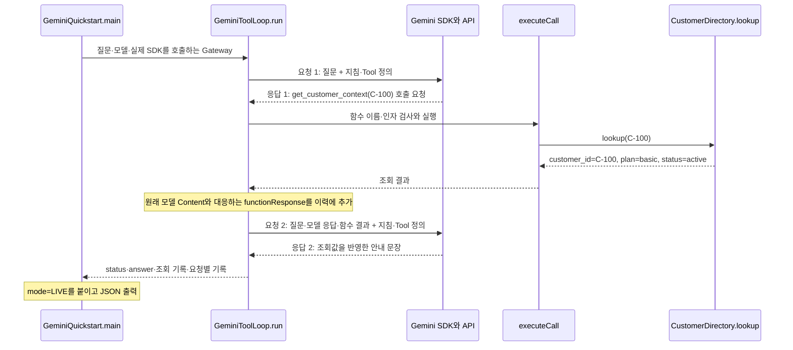

# 6주차 API 학습 노트

## Day 1 — Gemini 일반 호출과 응답 해석

### 입력과 지침을 분리하는 이유

대상은 도구 없이 메모를 한 문장으로 요약하는 요청이다. 실행 진입점은 [GeminiQuickstart.java](llm_lab/src/main/java/lab/week06/GeminiQuickstart.java)의 `main()`이다. 실행 결과의 `request.input`은 다음 기본 메모와 일치한다.

> 메모를 한 문장으로 요약해줘: 로그인 수정 완료, 배포 확인 필요.

사용자 입력은 처리할 내용이고, `INSTRUCTIONS`는 그 내용을 처리할 때 적용할 원칙이다.

> 한국어로 간결하게 요약하세요. 입력의 사실과 완료 여부를 보존하고, 확인 필요나 미완료인 일을 완료된 사실로 바꾸지 마세요.

`requestConfig()`는 이 지침을 `systemInstruction`에 넣어 사용자 입력과 함께 전달할 요청 설정을 만든다. 요약할 메모와 처리 원칙이 분리되어 있으므로 다른 메모를 넣어도 같은 사실 보존 지침을 재사용할 수 있다.

이번 입력에는 요약에 필요한 사실이 모두 들어 있다. 따라서 요청 설정에 고객 조회 Tool을 추가하지 않으며, 실제 출력에서도 `tools`와 `tool_results`가 빈 목록이다. 외부 고객 정보가 필요한 질문에서는 조회 기능을 연결할 필요가 생긴다.

### 설정에서 실제 호출까지의 경로

실행 모델은 `gemini-3.8-flash`, SDK는 [build.gradle](llm_lab/build.gradle)에 고정한 Google GenAI Java SDK 1.70.0이다. `main()`은 `GEMINI_API_KEY`, `GEMINI_MODEL`, `AI_AX_LIVE=1`을 확인하고 실제 호출용 클라이언트를 구성한다.

```java
result = run(text, environment.get("GEMINI_MODEL"),
        (model, input, config) ->
                client.models.generateContent(model, input, config));
```

`run()` 안에서는 다음 호출이 위 SDK 연결로 이어진다.

```java
response = gateway.generate(model, text, requestConfig());
```

앱은 입력·지침·제한을 구성하고, SDK는 API 통신과 응답 객체를 제공한다. `Gateway`는 이 연결을 전달하는 자리다. 고정 응답을 사용하는 실행과 실제 API 실행에서 연결 부품을 바꿀 수 있으면서, 요청 구성과 응답 해석 흐름을 함께 확인할 수 있다.

출력의 `request` 객체는 `run()`에서 앱이 만든 설정 요약이다. 서버가 반환한 원본 요청 내역은 아니다. `model_requests=1`도 앱이 호출 직전에 기록한 시도 수이며, SDK에는 `attempts(1)`을 설정해 자동 재시도 없이 한 번만 시도한다.

### 응답 종료와 사실 보존은 별도로 확인한다

실제 답변:

> 로그인 수정은 완료되었으며, 배포 확인이 필요합니다.

`mode=LIVE`인 실행에서 모델의 종료 이유는 `STOP`, 앱이 분류한 결과는 `MODEL_RESPONSE`였다.

`run()`은 응답의 첫 번째 후보에서 `finishReason`을 읽고, `response.text()`에서 답변을 꺼낸다. 이어 차단 여부, 종료 이유, 빈 답변과 예상하지 않은 함수 호출을 검사한다. 이번 응답은 차단 없이 `STOP`으로 끝났고 답변이 있으며 함수 호출도 없어 `MODEL_RESPONSE`로 분류되었다.

| 입력의 사실 | 실제 답변 | 해석 |
|---|---|---|
| 로그인 수정 완료 | 로그인 수정은 완료되었으며 | 완료 상태가 유지됨 |
| 배포 확인 필요 | 배포 확인이 필요합니다 | 아직 필요한 작업으로 유지됨 |

`STOP`은 모델이 보고한 생성 종료 이유이고, `MODEL_RESPONSE`는 응답을 검사한 앱의 분류다. 이 코드에는 원문과 답변의 사실 일치를 자동 평가하는 기능이 없다. 이번 요약의 정확성은 위 두 문장을 대조한 결과로 확인된다.

앞서 실행한 `Quickstart --offline --plain`도 `MODEL_RESPONSE`를 출력했지만 답변은 “이 문장은 고정된 오프라인 예시입니다.”였고 모드는 `SCRIPTED_OFFLINE`이었다. 같은 결과 분류라도 오프라인 실행은 연결 구조를 확인한 근거이며, 이번 실제 응답은 Gemini의 요약 결과를 확인한 근거다.

<details>
<summary>실행 참고 정보: 요청 설정과 보고된 사용량</summary>

| 항목 | 값 |
|---|---:|
| 출력 토큰 상한 | 2,048 |
| 추론 수준 | `LOW` |
| `promptTokenCount` | 60 |
| `candidatesTokenCount` | 15 |
| `thoughtsTokenCount` | 319 |
| `totalTokenCount` | 394 |

</details>


## Day 2 — Gemini 고객 조회 요청과 실제 결과 연결

이 절의 계약과 코드 발췌는 전체 고객 레코드를 반환하던 Day 2 실행 시점의 근거다. 요청 항목을 선택하는 현재 계약과 변경 위치는 아래 Day 3에 연결한다.

### 호출 구조와 역할을 나눈 이유

제공 고객 조회 업무에서 선택한 구조는 **모델이 조회를 요청하고, 앱이 검사·실행한 결과를 다시 모델에 전달해 안내를 만드는 흐름**이다. `get_customer_context(customer_id)` 하나로 요금제와 상태를 함께 반환하고, 한 응답당 호출 하나와 모델 요청 최대 세 번을 허용하기로 했다. 두 정보가 같은 고객 레코드에 있으므로 이번 요구에서는 한 번의 조회로 충분하다.

[GeminiQuickstart.java](llm_lab/src/main/java/lab/week06/GeminiQuickstart.java)의 `main`은 실행 인자·환경 설정·SDK 연결·콘솔 출력을 맡는다. [GeminiToolLoop.java](llm_lab/src/main/java/lab/week06/GeminiToolLoop.java)의 `run`은 입력 이력과 반복을 관리하며 응답에 따라 조회·다음 요청·종료를 결정한다. 같은 파일의 `executeCall`은 모델이 요청한 함수 이름과 인자를 검사한다. [CustomerDirectory.java](llm_lab/src/main/java/lab/week06/CustomerDirectory.java)의 `lookup`은 제공된 메모리 자료에서 고객을 찾아 반환한다. 이번 실습의 조회는 외부 DB 접속이 아니라 로컬 업무 함수 호출이다.

다음은 Day 2의 실제 정상 결과와 당시 코드를 연결한 호출 순서다. SDK와 API 통신은 하나의 참여자로 묶었으며, 각 메시지는 요청·응답 원문 전체가 아닌 역할 요약이다.


```mermaid
sequenceDiagram
    participant Entry as GeminiQuickstart.main
    participant AppLoop as GeminiToolLoop.run
    participant Model as Gemini SDK와 API
    participant Tool as executeCall
    participant Data as CustomerDirectory.lookup
    Entry->>AppLoop: 질문·모델·실제 SDK를 호출하는 Gateway
    AppLoop->>Model: 요청 1: 질문 + 지침·Tool 정의
    Model-->>AppLoop: 응답 1: get_customer_context(C-100) 호출 요청
    AppLoop->>Tool: 함수 이름·인자 검사와 실행
    Tool->>Data: lookup(C-100)
    Data-->>Tool: customer_id=C-100, plan=basic, status=active
    Tool-->>AppLoop: 조회 결과
    Note over AppLoop: 원래 모델 Content와 대응하는 functionResponse를 이력에 추가
    AppLoop->>Model: 요청 2: 질문·모델 응답·함수 결과 + 지침·Tool 정의
    Model-->>AppLoop: 응답 2: 조회값을 반영한 안내 문장
    AppLoop-->>Entry: status·answer·조회 기록·요청별 기록
    Note over Entry: mode=LIVE를 붙이고 JSON 출력
```

### 첫 요청: 질문과 공개 기능을 모델에 전달하기

IDE 인자 `--tools --text "C-100 고객의 요금제를 알려주세요."`로 고객 조회 경로를 실행했다. `GeminiQuickstart.main`은 입력과 Google GenAI Java SDK 1.70.0 연결을 준비하고, `GeminiToolLoop.run`은 질문을 이력에 넣어 모델에 보낸다. 당시 연결은 요청 시간 제한과 `attempts(1)`을 사용했다. `Gateway`가 실제 SDK의 `generateContent`와 고정 응답 대역을 교체하는 경계다.

```java
response = gateway.generate(model, List.copyOf(history), requestConfig());
```

`history`는 현재 질문과 앞선 결과, `requestConfig()`는 공통 지침·출력 제한·Tool 정의를 담는다. Tool 정의는 공개 이름 `get_customer_context`와 필수 문자열 인자 `customer_id`를 설명하며 실제 고객 데이터나 실행 코드를 모델에게 보내지 않는다. `request.tools`는 콘솔의 이름 요약이고 전체 스키마는 요청 설정에 있다. 모델은 이 계약을 보고 조회를 요청하고, 다음 단계에서 앱이 실제 함수를 실행한다.

### 첫 응답: 생성 종료와 함수 실행 판단

실제 첫 응답에 대응하는 앱 기록은 다음 호출을 담고 있다.

```text
name: get_customer_context
call_id: call_2870933
arguments: {customer_id: C-100}
```

`run`은 차단 여부와 `finishReason`을 확인한 뒤 첫 번째 응답 후보의 `Content`를 읽는다. 그 안의 `parts`에서 함수 호출을 모으는 실제 코드는 다음과 같다.

```java
Content content = response.candidates().orElseThrow().get(0).content().orElseThrow();
var parts = content.parts().orElse(List.of());
var calls = parts.stream().flatMap(part -> part.functionCall().stream()).toList();
```

이번 첫 요청의 `finish_reason`은 `STOP`이었다. 이 값은 이번 모델 응답의 생성이 끝났다는 뜻이다. 응답 안에는 실행을 요청하는 `functionCall`이 있었으므로 앱은 최종 답변으로 반환하지 않고 조회 경로를 계속 진행했다. 함수 호출이 하나인지, 추가 조회 결과를 전달할 다음 요청 여유가 있는지도 실행 전에 검사한다.

`executeCall`의 핵심 검사는 다음과 같다.

```java
if (!TOOL_NAME.equals(name)) return Map.of("error", "UNKNOWN_TOOL");
if (args == null || !args.keySet().equals(Set.of("customer_id"))
        || !(args.get("customer_id") instanceof String id) || id.isBlank())
    return Map.of("error", "INVALID_ARGUMENTS");
return CustomerDirectory.lookup(id);
```

공개한 함수 이름과 일치하고, 키가 `customer_id` 하나이며, 값이 비어 있지 않은 문자열이어야 조회한다. 모델에 스키마를 알려주는 것과 실제 실행 입력을 앱에서 검사하는 것은 서로 다른 책임이다. 특히 이 스키마에는 추가 키 금지 조건이 없지만 앱의 키 집합 검사는 추가 인자도 거부한다.

`lookup("C-100")`은 메모리의 `CUSTOMERS`에서 `{plan: basic, status: active}`를 찾아 복사하고 `customer_id`를 붙인다. 모델이 고객 값을 만들어 실행하는 것이 아니라, 앱이 제공 업무 자료에서 얻은 값이 반환된다.

### 두 번째 요청: 어떤 호출의 결과인지 이어 붙이기

앱은 조회값을 `functionResponse`로 포장한다. 이때 함수 이름을 넣고, 모델에서 호출 ID를 받았다면 그 ID도 그대로 넣는다. 이번 실제 호출에서는 `call_2870933`이 있었다.

```java
var value = executeCall(name, args);
var functionResponse = FunctionResponse.builder().name(name).response(value);
call.id().ifPresent(functionResponse::id);
history.add(content);
history.add(Content.builder().role("user")
        .parts(Part.builder().functionResponse(functionResponse.build()).build()).build());
```

여기서 `history.add(content)`는 모델이 반환한 원래 응답을 보존한다. 함수 이름과 인자만 뽑아 새 응답을 만들면 다른 응답 항목이나 `thoughtSignature` 같은 메타데이터를 잃을 수 있다. Gemini의 함수 호출 결과는 원래 호출과 대응시켜 전달해야 하며, 받은 서명도 원래 위치에 보존해야 한다. [Gemini 함수 호출](https://ai.google.dev/gemini-api/docs/generate-content/function-calling?authuser=0&hl=en), [응답 메타데이터 보존](https://ai.google.dev/gemini-api/docs/generate-content/thought-signatures)

두 번째 요청에 전달하는 이력은 다음 세 항목이다. 이는 코드와 실행 기록에 근거해 필요한 부분만 표시한 구조이며 API 원문 덤프는 아니다.

```text
history[0] user: "C-100 고객의 요금제를 알려주세요."
history[1] model: 원래 응답 Content
                 └ functionCall: get_customer_context, id=call_2870933,
                                  args={customer_id: C-100}
history[2] user: functionResponse
                └ name=get_customer_context, id=call_2870933,
                  response={customer_id: C-100, plan: basic, status: active}
```

세 번째 항목의 역할이 `user`여도 사람이 새 문장을 입력한 것은 아니다. 앱이 함수 결과를 전달하는 Content이며, `parts` 안에 일반 텍스트 대신 `functionResponse`가 들어 있다. 고객 번호는 조회할 대상을, 호출 ID는 이 결과가 어느 요청에 대응하는지를 나타낸다.

다음 반복에서 같은 `gateway.generate`를 다시 호출한다. 실제 출력의 `input_contents`가 1에서 3으로 늘어난 것은 위 이력 변화와 일치한다. 이 값은 앱이 센 Content 항목 수이며, 토큰 수나 지침·Tool 정의까지 합친 전체 입력 개수는 아니다. `tool_results`는 조회 근거를 콘솔에 남기는 기록이고, 다음 SDK 요청에는 별도로 구성한 `history`가 전달된다.

### 두 번째 응답: 안내 문장을 결과로 반환하기

두 번째 요청도 `STOP`으로 끝났고, 앱은 함수 호출이 없는 응답에서 답변 텍스트를 모았다.

```java
if (calls.isEmpty()) {
    String answer = parts.stream().filter(part -> !part.thought().orElse(false))
            .flatMap(part -> part.text().stream()).reduce("", String::concat);
    result.put("answer", answer);
    result.put("status", answer.isBlank() ? "INVALID_OUTPUT" : "MODEL_RESPONSE");
    return result;
}
```

`thought`로 표시된 부분을 제외한 텍스트를 합치고, 비어 있지 않으면 앱 결과를 `MODEL_RESPONSE`로 분류해 반복을 끝낸다. `main`은 반환된 결과에 `mode=LIVE`를 붙이고 `print(result)`로 콘솔에 JSON을 출력한다. 콘솔의 최상위 `status`, `answer`, `tool_results`, `turns`는 앱이 구성한 결과이며, SDK 응답 원문 전체가 아니다. `turns[].finish_reason`과 `usage`에는 모델 응답에서 읽은 정보가 들어 있다.

실제 모델 `gemini-3.8-flash`의 최종 답변:

> C-100 고객의 현재 요금제는 **basic**이며, 계정 상태는 **활성(active)**입니다.

실제 반환값의 `plan=basic`, `status=active`와 답변의 두 값이 일치한다. 모델 요청 두 번과 조회 한 번으로 끝났으므로, 첫 요청에서 조회를 요청하고 두 번째 요청에서 결과를 설명한다는 예상 경로와도 일치했다. `MODEL_RESPONSE` 분기에는 조회값과 문장의 사실 일치를 자동으로 평가하는 기능이 없다. 이번 답변의 사실 보존은 실제 조회값과 문장을 대조한 근거로 판단한다.

요금제만 물었는데 계정 상태도 답변에 포함됐다. 이번 Tool이 전체 고객 레코드를 반환했으므로 모델이 두 정보를 모두 참조할 수 있었다. 짧게 답하라는 지침만으로 모델에 전달되는 고객 정보를 줄일 수는 없다. Day 3의 후속 요구는 이 연결에서 공개할 조회 항목과 반환값을 바꾸는 문제다.

### 업무 오류 전달과 호출 종료의 차이

없는 고객도 같은 함수 요청·조회·결과 전달 경로를 사용한다. `lookup("C-404")`는 `CUSTOMER_NOT_FOUND`를 반환하고, 앱은 그 오류를 `functionResponse.response`에 넣는다. 모델이 조회 부재를 알아야 고객 번호 확인 같은 다음 행동을 안내할 수 있다. 성공과 실패를 모두 빈 객체로 돌려주면 무엇을 보완해야 하는지 판단할 근거가 사라진다.

확인한 대역 결과는 다음과 같다. 모델 경계의 호출 선택을 고정한 상태에서 앱의 검사·실제 업무 함수·결과 전달을 실행했다.

| 입력 | 실제 조회값 | 대역 최종 안내 |
|---|---|---|
| `C-100 고객의 요금제를 알려주세요.` | `customer_id=C-100, plan=basic, status=active` | `C-100 고객의 요금제는 basic입니다.` |
| `C-404 고객의 요금제를 알려주세요.` | `error=CUSTOMER_NOT_FOUND` | `고객을 찾을 수 없습니다. 고객 번호를 확인해 주세요.` |

없는 고객 경로도 최종 분류는 `MODEL_RESPONSE`였다. 이 값은 API 응답을 코드가 해석해 붙인 앱의 응답 상태이며, 고객 조회의 성공을 의미하지 않는다. 현재 분기는 차단·종료 이유와 함수 호출 여부를 확인하고 비어 있지 않은 답변이 있을 때 이 상태를 반환한다. 고객 조회 성공 여부는 `tool_results[].result`의 조회값 또는 업무 오류로 판단한다. 전송 실패는 SDK 호출에서 정상 응답을 얻지 못한 상황이어서 `PROVIDER_ERROR`로 끝내고, 앞서 조회했다면 그 근거를 남긴다.

조회 성공과 실행 종료는 별개의 판단이다. 반복 대역의 중단 위치와 요청 한도를 선택한 이유는 Day 4에 연결한다.

### 대역으로 확인한 응답 보존

정상 고객의 실제 모델 호출은 위 IDE 출력으로 확인했다. 없는 고객의 안내와 반복 종료는 대역으로 확인했으며, 이 대역 결과가 실제 Gemini의 선택이나 답변을 확인한 것은 아니다. 실제 콘솔 출력에는 원래 모델 Content와 서명 전문이 없으므로, 해당 항목의 보존은 구현과 대역 검사에 근거해 설명한다.

[GeminiToolLoopTest.java](llm_lab/src/test/java/lab/week06/GeminiToolLoopTest.java)의 `normalAndMissingCustomerReturnActualResultsWithOriginalModelContent`는 다음 모델 요청을 받는 지점에서 원래 Content 객체, 호출 ID와 실제 조회값이 전달되는지 검사한다. 자세한 검사 결과는 `llm_lab/build/reports/tests/test/index.html`, 메인 클래스의 대역 실행 결과는 `llm_lab/.local/day2-normal.json`과 `llm_lab/.local/day2-unknown.json`에 있다.


## Day 3 — 조회 항목을 인자로 받고 공개할 결과 구성하기

### 후속 요구와 선택한 계약

Day 2의 실제 질문은 요금제만 요청했지만 모델에 전달한 결과에는 `basic`과 `active`가 모두 있었고, 최종 답변에도 두 정보가 포함됐다. 후속 요구는 **요금제·계정 상태 중 질문한 항목만 모델에 반환하고, 둘 다 물으면 두 항목을 반환하는 것**이다.

기존 `get_customer_context`에 `fields` 인자를 추가하고, 앱이 그 인자에 따라 조회 결과에서 필요한 항목을 골라 반환하는 구조를 선택했다. 두 항목은 같은 `CustomerDirectory.lookup`에서 나오므로 공개 기능 하나로 한 번에 조회할 수 있다. 항목별로 Tool을 분리하면 두 정보를 요청했을 때 호출과 결과를 각각 연결해야 한다. 권한이나 데이터 제공자가 항목별로 달라지는 요구라면 그 분리를 다시 판단할 수 있다.

### 모델의 항목 선택에서 실제 조회까지

[GeminiToolLoop.java](llm_lab/src/main/java/lab/week06/GeminiToolLoop.java)의 `TOOL`은 이제 필수 인자로 `customer_id`와 `fields`를 공개한다. `fields`는 하나 이상의 문자열을 담는 목록이고, 스키마의 허용 값은 `plan`과 `status`다. `INSTRUCTIONS`도 요금제 질문에는 `plan`, 계정 상태 질문에는 `status`, 둘 다 묻는 질문에는 두 항목을 지정하도록 설명한다. `fields`라는 이름과 허용 항목은 앱이 선택한 업무 계약이며 Gemini API가 모든 Tool에 요구하는 공통 필드는 아니다.

`GeminiQuickstart.main → GeminiToolLoop.run → Gateway → SDK`로 요청을 전달하는 경로에서 모델은 다음과 같은 인자를 보낼 수 있다. 아래는 요금제 질문의 예상 호출 형태다.

```json
{"customer_id":"C-100","fields":["plan"]}
```

`run`이 응답의 함수 호출을 읽어 `executeCall(name, args)`에 넘기면 앱은 이름·고객 번호·항목 목록을 검사한다. 인자는 두 키를 모두 가져야 하며, 고객 번호는 비어 있지 않은 문자열, `fields`는 비어 있지 않은 목록이어야 한다.

```java
if (args == null || !args.keySet().equals(Set.of("customer_id", "fields"))
        || !(args.get("customer_id") instanceof String id) || id.isBlank()
        || !(args.get("fields") instanceof List<?> fields) || fields.isEmpty())
    return Map.of("error", "INVALID_ARGUMENTS");
```

목록의 각 값도 허용 항목인지 검사한다. 예를 들어 `["plan", "email"]`이 들어오면 지원하지 않는 항목을 무시하고 일부 성공을 반환하는 대신 인자 오류를 반환한다. 중복된 `plan`은 같은 선택으로 묶어 한 번만 반환한다.

```java
var selected = new LinkedHashSet<String>();
for (Object field : fields) {
    if (!(field instanceof String requested) || !ALLOWED_FIELDS.contains(requested))
        return Map.of("error", "INVALID_ARGUMENTS");
    selected.add(requested);
}
```

검사가 끝나면 업무 함수에서 실제 고객을 조회한다. 업무 함수는 여전히 고객 ID·요금제·상태 전체를 반환한다. 전체 자료를 관리하는 책임과 모델에게 공개할 범위를 고르는 책임이 여기서 나뉜다.

### 조회값에서 모델에 전달할 결과까지

`executeCall`의 반환 부분은 다음과 같다.

```java
var customer = CustomerDirectory.lookup(id);
if (customer.containsKey("error")) return customer;
var result = new LinkedHashMap<String, Object>();
result.put("customer_id", customer.get("customer_id"));
for (String field : selected) result.put(field, customer.get(field));
return result;
```

먼저 업무 오류가 있으면 그대로 반환한다. `C-404`의 결과에는 `plan`이나 `status` 대신 `error=CUSTOMER_NOT_FOUND`가 있으므로, 성공 필드만 고르는 처리를 먼저 하면 오류가 사라질 수 있다. 성공한 경우에는 새 결과에 고객 ID와 선택한 필드만 넣는다. 원래 고객 자료를 지우거나 수정하지 않으므로 다른 질문에서도 같은 업무 함수를 재사용할 수 있다.

요금제 질문에서 반환값이 연결되는 경로는 다음과 같다.

```text
모델 호출 인자: customer_id=C-100, fields=[plan]
  → executeCall: 인자 검사
  → CustomerDirectory.lookup: {customer_id:C-100, plan:basic, status:active}
  → 결과 선택: {customer_id:C-100, plan:basic}
  → FunctionResponse.response: 선택한 결과만 넣음
  → history: 원래 모델 Content + 대응하는 functionResponse 추가
  → 다음 SDK 요청: 질문·모델 응답·선택한 함수 결과 전달
  → 모델의 최종 답변을 앱의 answer로 반환
```

`run`의 연결부는 `executeCall`이 반환한 값을 그대로 `functionResponse`에 넣는다.

```java
var value = executeCall(name, args);
var functionResponse = FunctionResponse.builder().name(name).response(value);
call.id().ifPresent(functionResponse::id);
```

따라서 필터링은 콘솔 표시 직전이 아니라 **다음 모델 요청에 결과를 넣기 전**에 적용된다. `tool_results[].result`에도 같은 선택 결과가 기록된다. 원래 모델 Content와 호출 ID의 보존, 답변을 `main`으로 돌려주는 흐름은 Day 2에서 확인한 연결을 계속 사용한다. 두 항목을 함께 요청해도 함수 호출 하나로 처리할 수 있어 기존 요청 한도로 정상 왕복을 처리할 수 있다.

앱이 검사하는 것은 모델이 보낸 `fields`와 실제 반환 필드의 일치다. 자연어 질문에 맞게 `fields`를 골랐는지는 별도로 실제 모델의 인자를 읽어 확인해야 한다. 예를 들어 요금제만 질문했는데 모델이 두 항목을 요청하면, 두 값 모두 허용 항목이므로 앱은 둘 다 반환한다. 스키마와 필터링 검사만으로 자연어 해석의 정확성을 확인할 수 없는 이유다.

### 세 대역에서 모델에 전달한 반환값

대역을 각각 `normal`, `status`, `both`로 정해 다른 `fields`를 가진 호출을 보내고, 같은 앱의 검사·조회·결과 전달을 실행했다.

| 질문 | 대역이 보낸 fields | 대역에 전달한 실제 함수 결과 |
|---|---|---|
| `C-100 고객의 요금제를 알려주세요.` | `["plan"]` | `customer_id=C-100, plan=basic` |
| `C-100 고객의 계정 상태를 알려주세요.` | `["status"]` | `customer_id=C-100, status=active` |
| `C-100 고객의 요금제와 계정 상태를 알려주세요.` | `["plan","status"]` | `customer_id=C-100, plan=basic, status=active` |

세 경우 모두 모델 경계 요청 두 번과 조회 한 번으로 안내가 반환됐다. 요금제 대역에는 상태 값이, 상태 대역에는 요금제 값이 전달되지 않았다. 두 항목 대역에서는 두 값이 모두 전달돼 선택한 계약의 예상과 일치했다. 대역 안내는 각각 반환된 값으로 구성하며, 실제 모델의 항목 선택·답변을 확인한 결과와 구분한다.

[GeminiToolLoopTest.java](llm_lab/src/test/java/lab/week06/GeminiToolLoopTest.java)의 `eachRequestedFieldSetIsProjectedBeforeTheNextModelRequest`는 두 번째 모델 요청을 받는 지점에서 실제 `functionResponse.response`를 기대 결과와 비교한다. 이 검사는 화면에서 필드를 숨긴 것만으로 통과할 수 없으며, SDK 경계로 전달한 필드 자체를 확인한다.

메인 클래스 실행 결과는 `llm_lab/.local/day3-normal.json`, `llm_lab/.local/day3-status.json`, `llm_lab/.local/day3-both.json`에 있다.

### 실제 모델의 항목 선택과 최종 답변

같은 세 질문의 IDE 출력에서 `mode=LIVE`, 모델 `gemini-3.8-flash`의 결과를 확인했다. 이번에는 실제 모델이 선택한 인자, 앱의 반환값과 최종 답변을 함께 대조했다.

| 질문 | 실제 arguments.fields | 실제 result | 실제 answer |
|---|---|---|---|
| 요금제 | `["plan"]` | 고객 ID와 `plan=basic` | C-100 고객의 요금제는 **basic**입니다. |
| 계정 상태 | `["status"]` | 고객 ID와 `status=active` | C-100 고객의 계정 상태는 활성(active) 상태입니다. |
| 요금제와 계정 상태 | `["plan","status"]` | 고객 ID와 `plan=basic`, `status=active` | C-100 고객의 요금제는 **basic**이며, 계정 상태는 **active**입니다. |

세 실행 모두 질문에 맞는 항목을 선택했고, 반환값에 요청하지 않은 고객 정보가 포함되지 않았다. 최종 답변도 전달한 조회값을 보존했다. 요금제만 물었을 때 상태까지 안내했던 Day 2 결과와 비교하면, 이번에는 모델이 `plan`만 요청하고 앱이 `status`를 함수 결과에서 제외해 요금제만 안내했다.

이 차이는 모델의 항목 선택과 앱의 결과 구성이 함께 맞아야 요구를 만족한다는 점을 보여 준다. 지침과 Tool 정의가 자연어 질문을 인자로 연결하고, `executeCall`이 그 인자를 실제 반환 범위로 적용한다. 모델이 올바른 항목을 선택했더라도 전체 레코드를 그대로 보내면 정보 범위 제한은 구현되지 않은 것이다. 반대로 필터링 코드만 정확해도 모델이 질문과 다른 유효 항목을 선택할 수 있어, 실제 실행에서는 두 위치를 함께 읽는다.

각 성공 실행은 모델 요청 두 번·조회 한 번이며, 이력 항목 수는 1에서 3으로 늘었다. 요청 항목을 고르는 처리는 기존 조회와 결과 전달 사이에 들어갔고, 두 항목을 함께 요청해도 한 번의 함수 호출로 처리되어 예상 경로와 일치했다. 이 관찰은 제공한 세 실제 입력에 대한 결과다.


## Day 4 — 업무 오류의 전달과 반복 종료의 책임

### 조회 오류는 다음 판단의 자료이고, 호출 한도는 앱의 실행 정책이다

Day 3의 실제 세 성공 사례는 각각 모델 요청 두 번과 로컬 조회 한 번이었다. 모델이 조회를 요청한 뒤 앱이 얻은 값을 다시 보내 안내를 받는 경로는 Day 2에서 확인했다. 이 두 번째 요청은 전송 오류의 자동 재시도가 아니다. 연결의 `attempts(1)`과 앱이 조회 결과를 전달하는 요청은 서로 다른 동작이다.

`customer_id=C-404, fields=["plan"]`은 형식에 맞지만 고객이 없는 입력이다. `executeCall`은 조회 오류를 성공 필드 선택보다 먼저 반환하므로 `CUSTOMER_NOT_FOUND`가 빈 성공 값으로 바뀌지 않는다. 모델 대역은 원래 호출에 대응하는 오류를 받고 고객 번호 확인 문장을 반환했다. 이때 `MODEL_RESPONSE`는 안내 응답을 얻었다는 분류이며 조회 성공을 뜻하지 않는다.

반면 조회가 성공해도 다음 모델 응답이 다시 함수를 요청할 수 있다. 한 번의 응답 생성이 `STOP`으로 끝난 것, 조회 함수가 값을 반환한 것, 앱의 `run`이 최종 결과를 반환한 것은 종료 대상이 다르다. 실제 첫 응답도 `STOP`이었지만 함수 요청이 있어 앱의 처리가 계속됐다. 같은 조회를 계속 보내는 입력은 반복 대역으로 만들었으며 실제 Gemini가 반복했다는 기록은 아니다.

### 추가 조회보다 먼저 한도를 검사하는 이유

당시 `GeminiToolLoop.run`은 모델 요청을 최대 세 번 허용했다. 함수 호출 없는 응답을 먼저 반환하고, 또 함수를 요청했을 때 다음 분기를 `executeCall` 앞에서 적용했다.

```java
if (index == MAX_REQUESTS) {
    result.put("status", "STOPPED");
    result.put("message", "모델 요청 한도에 도달해 추가 함수를 실행하지 않습니다.");
    return result;
}
```

반복 대역의 실제 경로는 다음과 같았다.

```text
모델 요청 1 → 조회 요청 → 실제 조회 1 → 결과 전달
모델 요청 2 → 조회 요청 → 실제 조회 2 → 결과 전달
모델 요청 3 → 조회 요청 → STOPPED, 실제 조회 3은 시작하지 않음
```

세 번째 조회까지 실행하면 그 결과를 설명할 네 번째 모델 요청이 필요하다. 선택한 한도에는 그 여유가 없으므로 실행 전에 멈췄다. 세 번째 응답이 최종 안내라면 앞선 반환 분기에서 정상 종료한다. 요청 수는 `index <= MAX_REQUESTS`가 제한하고, 이 분기는 사용하지 못할 추가 조회를 막으며 중단 이유를 반환한다. 같은 이름·인자를 비교하는 중복 호출 차단 정책은 아니다.

조회 오류 전달은 모델이 보완할 정보를 주고, 호출 한도는 모델의 다음 응답과 무관하게 앱이 실행을 통제한다. 지침만으로 모델의 종료를 보장할 수 없어 두 책임을 나눴다. 순차 조회할 기능이 늘어나면 필요한 왕복 수와 실행 효과를 기준으로 한도를 다시 정하게 된다.

### 확인 근거

[GeminiToolLoopTest.java](llm_lab/src/test/java/lab/week06/GeminiToolLoopTest.java)의 `normalAndMissingCustomerReturnActualResultsWithOriginalModelContent`는 고객 부재가 원래 응답·호출 ID와 함께 다음 요청에 전달되는지 확인한다. `projectionPreservesErrorsAndDoesNotMutateBusinessData`는 필드 선택에서 오류와 원자료가 보존되는지, `repeatedCallsStopBeforeThirdExecution`는 모델 요청 세 번·조회 두 번 뒤 중단하는지 확인한다.

대역은 실제 앱의 검사·조회·이력·종료 분기를 실행한다. 이 근거로 오류 전달과 한도는 확인할 수 있지만 실제 모델의 반복 성향이나 문장 품질을 판단할 수는 없다. Day 3의 정상 항목 선택과 안내는 별도의 실제 모델 결과다.

## Day 5 — 파생 질문을 이어받는 대화 이력

### 이력을 유지하고 입력마다 호출 한도를 새로 적용하는 이유

고객 조회는 한 번의 질문으로 끝나지 않고 파생 질문으로 이어질 수 있다. 예를 들어 “C-100 고객의 요금제를 알려주세요.” 다음의 “그 고객의 계정 상태는?”은 앞선 고객 번호를 전제로 한다. 새 문장만 전달하면 “그 고객”이 누구인지 연결할 근거가 없으므로 질문·답변·도구 호출·결과를 이력에 보관하고 다음 요청에 함께 전달하는 구성을 선택했다. “요금제를 알려주세요”에 고객 번호를 묻는 응답이 오고, 이어 “C-100”을 입력하는 경우도 앞선 질문과 확인 응답이 있어야 무엇을 조회할지 연결된다.

새 입력마다 조회와 최종 답변에 필요한 호출 기회를 주기 위해 호출 한도도 새로 적용한다. 첫 질문에서 조회 요청과 조회 결과를 설명하는 데 모델 요청 두 번을 썼을 때, 대화 전체에 세 번을 나누어 쓰면 다음 질문에는 한 번만 남는다. 다음 질문도 조회가 필요하면 결과를 모델에 전달하고 답변받는 과정까지 진행하기 어렵다. 따라서 이력은 질문 사이에 유지하되, 최대 세 번의 모델 요청은 각각의 사용자 입력에 적용하는 구성을 선택했다.

### 대화의 실행 진입점

Day 5에는 `GeminiQuickstart`의 `--chat` 경로를 추가해 `GeminiChat`의 콘솔 입력과 기존 모델 연결을 사용했다. Program arguments에는 모드를 넣고 실제 질문은 실행된 콘솔에 입력한다. Gradle 실행에서도 입력을 받도록 `standardInput = System.in`을 연결했다. `--chat --offline`은 같은 대화 코드의 모델 경계만 대역으로 바꾼다.

다음 코드 발췌는 구조화 응답 옵션과 공통 코드 분리 전, Day 5 실행 당시의 구조를 보여 준다. 현재 진입점은 링크한 파일에서 확인하며 당시 결과를 현재 코드의 모든 옵션에 대한 실행 근거로 해석하지 않는다.

### 콘솔 반복문 밖에서 이력을 만들고 같은 객체를 전달하기

[GeminiChat.java](llm_lab/src/main/java/lab/week06/GeminiChat.java)의 대화 처리 메서드는 다음과 같다.

```java
static void run(String model, GeminiToolLoop.Gateway gateway, String mode,
                BufferedReader input, PrintWriter output) throws IOException {
    var history = new ArrayList<Content>();
    output.println("대화를 시작합니다. 질문을 입력하세요. 종료: /exit");
    while (true) {
        output.print("입력> ");
        output.flush();
        String text = input.readLine();
        if (text == null || "/exit".equals(text.strip())) {
            output.println("대화를 종료합니다.");
            output.flush();
            return;
        }
        if (text.isBlank()) continue;
        var result = GeminiToolLoop.run(text.strip(), model, gateway, history);
        result.put("mode", mode);
        output.println(GeminiQuickstart.JSON.writerWithDefaultPrettyPrinter().writeValueAsString(result));
        if (!"MODEL_RESPONSE".equals(result.get("status"))) {
            output.println("대화를 중단합니다: " + result.get("status")
                    + ". 위 결과를 확인하세요. 다시 실행하면 새 대화가 시작됩니다.");
            output.flush();
            return;
        }
    }
}
```

`history`를 `while`보다 앞에서 한 번 만든다는 점이 핵심이다. `input.readLine()`으로 새 줄을 받을 때마다 같은 `history`를 `GeminiToolLoop.run`에 넘긴다. 이력 생성이 반복문 안에 있었다면 `C-100`을 입력하는 순간 앞선 질문과 확인 응답을 잃게 된다.

`GeminiToolLoop.run`이 결과를 반환하면 JSON을 출력한다. 정상 모델 응답이면 반복문 끝에서 다음 `readLine()`으로 돌아가 **새 사용자 입력을 기다린다**. 입력 대기의 반복이 자동 모델 요청을 뜻하지는 않는다. 빈 줄은 처리 함수를 부르기 전에 `continue`하고, `/exit`이나 입력 스트림 종료는 `return`한다. 응답이 실패·중단 상태이면 출력 후 `return`하므로 그 대화의 다음 입력을 처리하지 않는다.

### 이력은 대화 단위로, 호출 예산은 입력 단위로 관리하기

대화용 `GeminiToolLoop.run`은 전달받은 이력에 이번 사용자 입력을 더한다. `result`, `toolResults`, `turns`와 모델 요청 횟수는 호출마다 새로 만든다. 그래서 앞선 문의는 이어지지만 이번 결과에는 이번 입력의 조회와 요청 기록이 담긴다.

단일 질문용 진입점은 새 이력을 만들어 같은 처리 함수를 호출한다. 두 모드가 공유하는 인자 검사·조회·결과 전달은 Day 2~3의 경로이며, 차이는 이력을 누가 만들고 얼마나 보관하는가다. SDK Client를 재사용하는 것만으로 대화가 기억되는 것은 아니다.

### 최종 답변과 확인 질문도 원래 응답으로 보존하기

Day 4까지는 함수 호출 응답과 함수 결과를 저장했지만, 함수 호출 없는 응답은 바로 반환했다. Day 5에서는 그 반환 직전에 다음 처리를 추가했다.

```java
if (calls.isEmpty()) {
    String answer = parts.stream().filter(part -> !part.thought().orElse(false))
            .flatMap(part -> part.text().stream()).reduce("", String::concat);
    result.put("answer", answer);
    result.put("status", answer.isBlank() ? "INVALID_OUTPUT" : "MODEL_RESPONSE");
    // Clarifications and final answers must survive the next user input too.
    if (!answer.isBlank()) history.add(content);
    return result;
}
```

이제 “고객 번호를 알려주세요.”라는 확인 질문도, 조회 뒤의 최종 안내도 다음 입력까지 남는다. 보이는 답변 문자열로 모델 응답을 재구성하지 않고 원래 `Content`를 저장하므로 `parts`와 응답에 붙은 `thoughtSignature`도 함께 보존된다. 서명은 앱이 해석하거나 생성하는 값이 아니다. 함수 호출 응답 역시 원래 Content를 저장하고, 실제 조회값은 기존대로 함수 이름과 받은 ID에 대응하는 `functionResponse`에 넣는다.

함수 호출 응답과 실제 결과의 대응은 Day 2의 연결을 재사용한다. Day 5에서 달라진 점은 함수 호출 없는 확인 질문과 최종 안내도 다음 사용자 입력까지 보관한다는 것이다. 이 앱은 실패·한도 중단이면 콘솔 대화를 끝내고, 다시 실행하면 메모리 이력을 새로 만든다. 이는 이 실습의 종료·상태 수명 정책이다.

### 두 입력이 실제 요청으로 이어진 오프라인 결과

`--chat --offline`으로 같은 콘솔에 “요금제를 알려주세요”, “C-100”, `/exit`을 순서대로 전달했다. 모델 응답은 고정 대역이고 이력 구성·함수 실행·결과 선택·종료는 실제 앱 코드다.

| 처리 위치 | 모델에 전달한 Content | 확인된 결과 |
|---|---|---|
| 첫 입력의 요청 1 | 사용자: 요금제를 알려주세요 | 조회 없이 고객 번호를 묻는 응답 |
| 두 번째 입력의 요청 1 | 최초 질문 → 모델의 확인 질문 → 사용자: C-100 | `customer_id=C-100`, `fields=["plan"]`인 함수 호출 |
| 두 번째 입력의 요청 2 | 위 세 항목 → 원래 함수 호출 응답 → 실제 함수 결과 | `customer_id=C-100`, `plan=basic`을 근거로 요금제 안내 |

`turns[].input_contents`는 이 순서에서 1 → 3 → 5였다. 첫 결과의 `model_requests`는 1, 두 번째는 2이며 두 번째 결과의 `request_number`는 다시 1부터 시작했다. 마지막 안내까지 저장한 이력은 여섯 항목이 된다. 숫자가 늘어난 이유는 최초 질문과 확인 응답을 버리지 않은 상태에서 새 사용자 입력과 함수 호출·결과를 순서대로 추가했기 때문이다.

결과의 `request.context_messages`는 **이번 사용자 입력을 처리하는 첫 모델 요청에 실린 맥락의 표시용 요약**이다. 역할·보이는 텍스트·함수 이름을 보여 주며 서명이나 전체 SDK 응답은 출력하지 않는다. 실제 전송에는 위에서 설명한 원래 Content를 사용한다. 두 번째 입력의 요약에는 앞선 질문, 모델의 확인 질문, `C-100`이 순서대로 나왔다. 그 뒤 내부 왕복에서 추가된 실제 값은 `tool_results`에, 각 모델 요청의 이력 개수는 `turns`에 나타난다.

[GeminiChatTest.java](llm_lab/src/test/java/lab/week06/GeminiChatTest.java)는 다음 요청의 Content가 앞서 받은 원래 응답 객체인지 검사한다. 별도의 두 질문 대역에서는 요금제 조회 후 “그 고객의 계정 상태는?”을 이어 보내, 첫 최종 답변이 다음 요청에 보존되고 각 질문이 두 번씩 요청해 처리되는 것을 확인했다. 두 번째 조회 결과에는 고객 ID와 `status=active`만 포함되었다.

대역의 확인 질문과 도구 선택은 정해 둔 응답이다. 같은 진입점의 실제 모델 결과는 다음 절에서 대조한다. 실행 순서는 [프로젝트 실행 안내](llm_lab/README.md#gemini-대화-이어가기)에 있다.

### 실제 Gemini에서 확인한 대화 이어받기

`--chat`, `gemini-3.7-flash`, `mode=LIVE`로 같은 실행 콘솔에서 “요금제를 알려주세요” → “C-100” → `/exit`을 이어 입력한 결과다.

첫 입력의 답변은 “요금제를 조회하려면 고객 번호가 필요합니다. 고객 번호를 알려주시겠어요?”였다. `tool_results`는 비어 있고 모델 요청은 한 번이었다. 고객 번호를 임의로 만들어 조회하지 않고, 필요한 정보를 묻는 모델 응답으로 이번 입력의 처리가 끝났다.

두 번째 입력의 `request.context_messages`에는 “요금제를 알려주세요”, 위 확인 응답, “C-100”이 순서대로 포함됐다. 모델이 받은 것은 고객 번호 한 줄만이 아니라 앞선 요금제 질문을 포함한 맥락이었다. 그 결과 `get_customer_context`에 `customer_id=C-100`, `fields=["plan"]`을 지정했고, 실제 함수 결과에는 `customer_id=C-100`과 `plan=basic`만 담겼다. 최종 답변 “고객님의 현재 요금제는 **basic**입니다.”는 그 조회값과 일치했다. 고객 번호를 보완하는 후속 입력에서 앞선 조회 목적을 이어받았고 Day 3의 요청 항목 선택도 유지됐다.

첫 입력의 모델 요청에는 Content 한 개가, 두 번째 입력의 첫 요청에는 세 개가 전달됐다. 이어 원래 함수 호출 응답과 실제 함수 결과를 추가한 요청에서는 다섯 개가 전달됐다. 이 1 → 3 → 5의 변화는 대역에서 예상한 연결 경로와 같았다. 실제 확인 질문의 문장은 대역과 달랐지만, 그 실제 문장 자체가 다음 요청 맥락에 남아 고객 번호 입력과 연결됐다. 두 번째 입력의 `request_number`는 다시 1부터 시작하고 `model_requests`는 2로 끝났으며, 앞선 입력의 1회와 분리되어 표시됐다. 입력별 횟수를 관리하면서 이력을 유지하는 코드와 일치하는 결과다.

최종 답변 뒤 콘솔은 다음 입력을 기다렸고 `/exit`에 “대화를 종료합니다.”를 출력했다. 이번 실제 실행으로 고객 번호 확인 → 같은 대화의 후속 입력 → 요청한 요금제 조회 → 조회값에 근거한 안내 → 명시적 종료까지 확인했다.


## 최종 구조화 응답과 후속 처리

### 후속 처리 요구에서 이 구성을 해석하기

이 앱은 조회 결과를 이미 가지고 있으므로 요금제 표시 자체는 코드가 직접 만들 수 있다. 현재 `CustomerAnswer.consume`의 `display`도 정상 값은 조회 근거에서 가져온다. 구조화 응답은 모델의 결과를 정해진 필드로 받아 검사하고 다음 코드에 넘기는 경계를 확인하려고 연결한 구성이다. 단순 조회 화면에 반드시 필요한 추가 단계는 아니다.

모델이 생성하는 안내·확인 문장과 앱이 결정하는 표시·질문·보류를 구분한다. `needs_follow_up`은 모델의 출력이며 조회 사실과 대조할 대상이고, `next_action`은 대조 후 앱의 결정이다. `needs_follow_up=true`인 유효한 확인 질문은 `ASK_CUSTOMER_ID`로 사용하고, 사실 불일치나 응답 실패는 `HOLD`로 사용을 중단한다. 이 코드의 보류는 자동 재시도를 기다리는 상태가 아니다.

도구 선택과 최종 스키마 응답을 별도 요청으로 둬 출력 계약을 따로 적용했지만, 번호가 없는 경우에도 두 요청이 발생한다. 조회 근거가 비면 번호를 다시 묻는 현재 정책은 이미 번호가 있는데 도구를 사용하지 않은 상황을 별도로 구별하지 못한다. 호출 비용과 이 한계는 선택한 구현의 성질이며 구조화 출력의 필수 규칙이 아니다. 아래는 당시 구현·실행 결과이고, 이 절의 해설은 그 결과에서 읽을 수 있는 선택과 한계를 정리한 것이다.

### 조회 인자와 안내 결과의 계약

기존 Day 3의 실제 Gemini 실행에서는 요금제·상태·두 항목의 선택과 반환 범위를, Day 5에서는 고객 번호 확인 뒤 같은 대화를 이어 조회하는 흐름을 확인했다. 그때 `MODEL_RESPONSE`는 비어 있지 않은 자연어 답변을 받았다는 분류였다. 답변에 업무 필드가 갖춰졌는지, 조회값과 일치하는지를 자동으로 검사하는 분기는 없었다.

[GeminiToolLoop.java](llm_lab/src/main/java/lab/week06/GeminiToolLoop.java)의 `TOOL`은 모델이 실행을 요청할 인자를 정한다. `customer_id=C-100, fields=["plan"]`을 `executeCall`이 검사하고 조회하면 모델에게 돌려주는 사실은 `{customer_id:C-100, plan:basic}`이다. 현재 사실을 다음 모델 입력으로 공급하는 것이며, 고객 자료를 바꾸는 일이 모델 재학습을 뜻하지는 않는다.

[GeminiStructuredAnswer.java](llm_lab/src/main/java/lab/week06/GeminiStructuredAnswer.java)의 `SCHEMA`는 조회 뒤 다음 코드가 읽을 결과를 정한다. `customer_id`와 `answer`는 문자열, `needs_follow_up`은 불리언, `plan`과 `account_status`는 문자열 또는 null이다. 다섯 필드를 필수로 두고 추가 필드는 허용하지 않는다. 도구 결과의 `status`는 최종 응답의 `account_status`에 대응한다. 요금제만 조회했다면 `account_status=null`이며, 이는 계정 비활성이 아니라 이번 조회에서 상태를 제공하지 않았다는 뜻이다.

다음은 대역에서 사용한 정상 응답 예다.

```json
{
  "customer_id": "C-100",
  "plan": "basic",
  "account_status": null,
  "needs_follow_up": false,
  "answer": "basic 요금제입니다."
}
```

`plan`을 `premium`으로 바꿔도 JSON의 필드와 자료형은 유효하다. 그러나 이번 조회는 `basic`이므로 사실 대조에서 `FACT_MISMATCH`로 보류한다. 스키마 계약과 업무 사실 검사가 다른 책임인 이유다. `plan=basic`을 유지한 채 자유 문장만 “premium 요금제입니다.”로 바꾼 대역은 필드 검사를 통과한다. 따라서 검증한 표시 값은 `display`에 따로 구성하고, `answer`의 문장은 실제 조회 근거와 함께 읽어야 한다.

### 선택한 구조와 실제 코드의 연결

선택한 구성은 기존 Gemini 연결에서 조회 단계와 최종 구조화 응답 단계를 나누고, 앱이 후속 행동을 정하는 방식이다. 이 추천 구성에 대한 수용 의견은 “네 이 구성이 괜찮아보입니다.”였다. 실제 실행 근거는 아래 결과 절에 이어 남기고, 학습 내용에 대한 해석은 대화에서 확인한 의견을 바탕으로 정리한다.

`GeminiQuickstart`의 `--structured` 옵션이 기존 고객 조회·대화 경로로 전달된다. 모델 ID와 인증 연결은 기존 IDE 실행 구성을 사용한다. `GeminiToolLoop.run(..., structured)`은 첫 요청에 기존 Tool 계약을 제공한다. 조회가 끝나면 `finalPhase=true`로 전환해 다음 요청에 `GeminiStructuredAnswer.config(toolResults)`를 사용한다.

```java
// 실제 최종 요청 설정의 핵심
.responseMimeType("application/json").responseJsonSchema(SCHEMA)
```

이 설정은 단순히 지침에 “JSON으로 써라”를 넣는 것과 다르다. SDK의 응답 형식 설정에 스키마를 넘긴다. 최종 단계에는 도구를 제공하지 않고, 원래 함수 호출 Content와 그 호출에 대응하는 실제 결과는 기존 이력에 보존한다. 이번 조회 근거만 최종 필드에 옮기도록 지침을 주며, `consume`은 같은 근거와 응답을 대조한다. 모델이 안내를 결정했다는 말만 믿는 대신 앱이 받아들일 수 있는 결과인지 확인하는 경계다.

정상 조회는 모델의 도구 선택 → 로컬 조회 → 구조화 응답의 두 요청이다. 첫 응답에 도구 호출 없이 확인 문장이 오면 그 초안을 표시하거나 이력에 확정하지 않고, 같은 사용자 입력으로 구조화 응답을 한 번 더 요청한다. 이 경우 이번 조회 근거는 비어 있으며 고객 ID는 빈 문자열, 두 고객 값은 null, `needs_follow_up=true`여야 한다. 이는 조회 근거를 얻지 못한 경우 번호를 다시 확인하는 이 앱의 정책이다. 사용자가 이미 번호를 제시했는데 모델이 조회하지 않은 경우도 여기에 들어가므로, 실제 입력과 `tool_results`를 함께 읽어 도구 선택이 적절했는지 확인한다.

수용한 최종 Content는 다음 사용자 입력에 그대로 전달한다. 번호 확인 결과와 정상 안내는 대화를 계속하고, 보류는 콘솔 대화를 중단한다. 각 입력의 조회 근거는 새 목록에 담으므로 이전 요금제를 이번 상태 조회의 필드 검사 근거로 재사용하지 않는다.

| 이번 입력의 근거·응답 | 후속 처리 | 판단 이유 |
|---|---|---|
| 조회 성공, 응답 필드와 조회값 일치 | `SHOW_ACCOUNT` | 검증한 고객 값을 `display`에 구성 |
| 조회 근거 없음 | `ASK_CUSTOMER_ID` | 번호 확인 질문을 `display.question`에 구성 |
| `CUSTOMER_NOT_FOUND`, 고객 값 null, 추가 확인 true | `ASK_CUSTOMER_ID` | 존재하지 않는 번호를 다시 확인 |
| 다른 요금제·고객 번호·조회하지 않은 상태 값 | `HOLD`, `FACT_MISMATCH` | 이번 조회 근거와 불일치 |
| 필드 누락·잘못된 타입·중복 키·뒤에 붙은 JSON | `HOLD`, `INVALID_OUTPUT` | 한 개의 유효한 최종 결과로 수용할 수 없음 |
| 거절·불완전 응답·전송 실패 | `HOLD`와 해당 원인 | 정상 고객 결과를 확정할 수 없음 |
| 허용하지 않은 Tool·인자 오류 | `HOLD`, `TOOL_ERROR` | 고객 번호 부재와 다른 실행 계약 오류 |

### 대역으로 확인한 결과

[GeminiStructuredAnswerTest.java](llm_lab/src/test/java/lab/week06/GeminiStructuredAnswerTest.java)에서 모델 응답을 고정하고 실제 앱의 조회·스키마 요청·응답 수용·대화 분기를 실행했다. 요금제 조회는 `plan=basic, account_status=null`, 상태 조회는 `plan=null, account_status=active`, 두 항목 조회는 두 값을 수용했다. 없는 고객은 번호 확인으로 넘어갔다. “요금제를 알려주세요” → “C-100” 대역에서도 첫 구조화 확인 응답이 다음 요청에 보존되고 후속 입력에서 정상 안내로 전환됐다. 각 입력은 모델 요청 두 번이며 첫 입력에는 조회가 없었다.

틀린 요금제와 고객 번호, 조회하지 않은 상태 값을 보류하는 결과를 확인했다. 거절·출력 중단·최종 단계의 추가 도구 요청·전송 실패에서도 확정 데이터가 생성되지 않았고, 실패 응답을 정상 대화 이력에 넣지 않았다. 기존 일반 호출·Tool 루프·대화 테스트와 함께 통과했다. 상세 검사 출력은 `llm_lab/.local/structured-validation/test-result.txt`에 있다. 이 대역 실행은 앱의 처리 경계를 확인한다. 실제 모델의 스키마 수용·도구 선택·문장은 아래 실제 실행 결과에서 별도로 대조한다.

### IDE에서 실제 결과 확인하기

기존 `lab.week06.GeminiQuickstart` 실행 구성을 사용한다. Working directory는 학습 저장소의 `week06-llm-api-tool-calling/llm_lab`, 모듈은 기존 main 모듈이다. 기존 비공유 설정의 `GEMINI_API_KEY`, `GEMINI_MODEL`, `AI_AX_LIVE=1`을 사용하며 실제 실행에서는 `--offline`을 넣지 않는다.

먼저 Program arguments를 아래처럼 지정한다.

```text
--tools --structured --text "C-100 고객의 요금제를 알려주세요."
```

정상 예상은 `mode=LIVE`, `next_action=SHOW_ACCOUNT`다. `tool_results`의 `plan=basic`과 `data.plan`을 대조하고 `data.account_status=null`인지 본다. `response_schema`는 최종 단계에 지정할 스키마이고, `turns`의 `STRUCTURED_ANSWER` 단계와 `structured_response`로 실제 최종 요청·응답까지 도달했는지 확인한다. `structured_response`는 모델의 JSON 텍스트여서 바깥 출력 안에서는 따옴표가 이스케이프되어 보이고, `data`는 앱이 파싱·검증해 수용한 객체다.

같은 구성에서 번호만 `C-404`로 바꾸면 `tool_results`의 `CUSTOMER_NOT_FOUND`, `data.customer_id=C-404`, 고객 값 둘 다 null, `needs_follow_up=true`, `next_action=ASK_CUSTOMER_ID`를 예상한다.

번호 보충은 Program arguments를 `--chat --structured`로 바꾸고 콘솔에 다음 순서로 입력한다.

```text
요금제를 알려주세요
C-100
/exit
```

첫 입력은 조회 없이 `ASK_CUSTOMER_ID`, 두 번째는 요금제 조회 뒤 `SHOW_ACCOUNT`를 예상한다. 화면 문장은 대역과 달라도 된다. 실제 조회값과 문장의 의미가 일치하는지, 예상과 달랐다면 도구 선택·조회·최종 응답·수용 검사 중 어디에서 달라졌는지 해석한다.

공유할 근거는 해당 입력의 `mode`, `request.model`, `tool_results`, `turns`, `structured_response`, `data`, `next_action`, `status`와 안내 문장이다. 키나 인증 헤더를 공유하지 않는다. 실제 결과와 그에 대한 해석은 이 노트에 이어 기록한다.


### 실제 Gemini의 정상 구조화 응답과 안내 선택

2026-09-21의 IDE 출력에서 `mode=LIVE`, 모델 `gemini-3.5-flash`, 입력 “C-100 고객의 요금제를 알려주세요.”를 확인했다. `TOOL_SELECTION` 단계에서 `get_customer_context`의 인자는 `customer_id=C-100, fields=["plan"]`이었고, 실제 반환값은 `{customer_id:C-100, plan:basic}`이었다. 질문에 맞게 요금제만 요청하고 반환한 결과다.

다음 `STRUCTURED_ANSWER` 단계의 실제 응답은 다음과 같다. 출력의 `structured_response`에 담긴 JSON 내용을 풀어 적었다.

```json
{
  "customer_id": "C-100",
  "plan": "basic",
  "account_status": null,
  "needs_follow_up": false,
  "answer": "C-100 고객님의 요금제는 basic입니다."
}
```

고객 번호와 요금제는 실제 조회값과 일치했고, 조회하지 않은 계정 상태는 null로 남았다. `account_status=null`은 정보 부족 때문에 이번 요금제 질문을 해결하지 못했다는 뜻이 아니다. 요청한 요금제는 확인했으므로 `needs_follow_up=false`와 함께 정상 안내로 처리할 수 있다. 안내 문장의 `basic`도 이번 조회값과 일치했다.

앱이 수용한 `data`에는 위 다섯 필드가 있었고, `next_action=SHOW_ACCOUNT`, `display={customer_id:C-100, plan:basic}`으로 이어졌다. 최종 응답 스키마에는 `next_action`이 없다. 모델은 결과 필드를 생성하고, `consume`이 형식·조회 사실·추가 확인 여부를 대조한 뒤 앱의 후속 행동을 정한 것이다. JSON 형식이 맞다는 사실만으로 정상 안내를 선택한 것은 아니다.

모델 요청은 도구 선택과 최종 구조화 응답의 두 단계로 끝났다. 입력 Content가 1개에서 3개로 늘어난 것은 사용자 질문에 모델의 함수 호출과 앱의 함수 결과를 추가한 흐름과 맞는다. 정상 입력의 예상과 실제 결과가 일치했으며 실제 스키마 응답이 앱의 표시 처리까지 연결됐다. 이후 없는 고객과 번호 보충의 실제 결과는 아래 OpenAI 실행 기록에 있다.


### OpenAI 연결로 전환한 이유와 공유한 업무 계약

Gemini 정상 고객의 실제 구조화 응답은 앞 절에서 확인했다. 이후 연속 요청 중 503 오류가 발생했다는 실행 상황이 있어, 이미 준비한 OpenAI API 결제를 사용해 보충 실습의 연결 제공자를 바꾸기로 했다. 503이라는 코드만으로 무료 할당량 소진이 원인이라고 확정하지는 않는다. 기존 Gemini 실습과 블로그의 코드·실행 결과는 당시 확인한 근거로 남기고, 이후 결과를 이 절에 이어 구분한다.

현재 실행 진입점은 같은 프로젝트의 [OpenAiCustomerAssistant.java](llm_lab/src/main/java/lab/week06/OpenAiCustomerAssistant.java)다. 새 프로젝트를 만드는 대신 기존 OpenAI Java SDK 의존성과 요청·응답 타입을 사용한다. [CustomerTool.java](llm_lab/src/main/java/lab/week06/CustomerTool.java)는 기존 `GeminiToolLoop.executeCall`의 인자 검사·조회·항목 선택을 옮긴 공통 코드다. Gemini의 기존 메서드도 이 코드를 호출한다. [CustomerAnswer.java](llm_lab/src/main/java/lab/week06/CustomerAnswer.java)는 기존 최종 스키마·지침·사실 대조·후속 처리 규칙을 공유하며, `GeminiStructuredAnswer`는 Gemini 요청 설정과 공통 검사 연결을 맡는다.

이렇게 분리한 이유는 요금제와 상태의 의미, 조회하지 않은 값은 null이라는 계약, 사실 불일치의 보류 기준이 API 제공자에 따라 달라지지 않기 때문이다. 반면 메시지를 보내고 돌려받는 형식은 SDK 계약에 맞춰야 한다.

| 역할 | 기존 Gemini 연결 | OpenAI 연결 |
|---|---|---|
| 모델 요청 | `client.models.generateContent` | `client.responses().create` |
| 도구 요청 | `Content.parts`의 `functionCall` | 응답 `output`의 `function_call` |
| 실제 조회 결과 반환 | `functionResponse` | `function_call_output`, 같은 `call_id` |
| 최종 스키마 설정 | `responseJsonSchema` | `text.format`의 `json_schema`, `strict=true` |
| 다음 대화의 이력 | 원래 `Content` 보관 | 원래 응답 출력 항목을 SDK 입력 형식으로 보관 |

OpenAI 요청은 `store(false)`와 앱이 가진 이력을 사용한다. 함수 호출뿐 아니라 응답에 포함된 reasoning 항목도 함께 보존하고, 실제 함수 결과를 원래 `call_id`에 연결한다. 최종 단계에서는 도구를 제공하지 않고 같은 고객 응답 스키마를 지정한다. 정상 조회는 도구 선택과 최종 구조화 응답의 두 요청이며, 번호 확인도 기존 구조화 모드와 같은 처리 정책을 따른다. 응답이 거절되거나 완성되지 않으면 사실 검사에 앞서 보류한다. 앱이 수용한 최종 출력만 다음 사용자 입력의 이력에 남긴다.

요청은 제한된 횟수 안에서 진행하고 SDK 자동 재시도는 기존처럼 끈다. 제공자를 바꾸는 작업에 별도의 자동 재시도 정책을 함께 추가하지 않았다. 전송 오류는 `PROVIDER_ERROR`와 가능한 HTTP 상태 코드로 확인한다.

#### 대역에서 확인한 연결과 직렬화 차이

[OpenAiCustomerAssistantTest.java](llm_lab/src/test/java/lab/week06/OpenAiCustomerAssistantTest.java)에서 정상 고객·상태만 조회·두 항목·없는 고객을 확인했다. 두 번째 OpenAI 요청에 실제 항목 선택 결과가 같은 호출 ID로 전달되고, 최종 스키마가 적용되며 공통 검사 결과에 따라 표시 또는 번호 확인으로 이어졌다. 번호 없는 질문 뒤 `C-100`을 보완하는 대화에서도 앞서 수용한 확인 응답이 다음 요청에 보존됐다. 잘못된 요금제·거절·불완전 출력·추가 도구 요청·전송 실패는 보류됐고, 기존 Gemini 검사도 함께 통과했다. 상세 대역 출력은 `llm_lab/.local/openai-validation/test-result.txt`에 있다.

OpenAI SDK의 JSON 매퍼로 업무 결과를 출력하면 null인 Map 항목이 생략됐다. 이번 최종 계약에서 `account_status`는 필수 항목이며, 조회하지 않았다는 의미를 null로 표현하므로 생략하면 필드 누락이 된다. `OpenAiCustomerAssistant.json`은 업무 출력의 null을 보존하는 매퍼를 사용하고, SDK 응답 항목을 다음 요청 타입으로 옮기는 작업은 SDK 매퍼에 맡긴다. 전송용 객체의 직렬화와 앱이 보여 줄 업무 결과의 직렬화가 같은 목적을 갖지 않는 사례다.

#### 현재 OpenAI 실행 방법

같은 `llm_lab`의 `OpenAiCustomerAssistant.main`을 IDE에서 실행한다. 당시 실제 실행 모델은 `gpt-4.1-mini`였으며 모델 이름은 실행 설정에서 바꿀 수 있다. 비공유 설정의 `OPENAI_API_KEY`, `OPENAI_MODEL`, `AI_AX_LIVE=1`을 앱이 사용한다. 기존 Gemini 실행 경로도 남아 있다.

| 실행 | Program arguments·콘솔 입력 |
|---|---|
| 정상 요금제 | `--tools --structured --text "C-100 고객의 요금제를 알려주세요."` |
| 없는 고객 | 같은 인자에서 `C-404` 사용 |
| 번호 보충 | `--chat --structured` 후 콘솔에 “요금제를 알려주세요” → “C-100” → `/exit` |
| 모델 대역 | 실제 API 인수에 `--offline` 추가 |

`provider`·`mode`·`request.model`로 실제 연결을 구별하고, `tool_results`, `structured_response`, 수용한 `data`, 앱의 `next_action`을 이어 읽는다. OpenAI의 `input_items`와 Gemini의 Content 수가 항상 같아야 하는 것은 아니며, 실제 전달 의미가 대응하는지를 확인한다. 아래 실행 기록에는 각 연결에서 확인된 결과를 구분해 남긴다.

#### 실제 OpenAI 정상 조회와 구조화 응답

입력 “C-100 고객의 요금제를 알려주세요.”의 IDE 출력에서 `provider=OPENAI`, `mode=LIVE`, 모델 `gpt-4.1-mini`를 확인했다. 모델은 `get_customer_context`에 `customer_id=C-100, fields=["plan"]`을 지정했고, 실제 함수 결과는 `{customer_id:C-100, plan:basic}`이었다. 다음 요청의 최종 구조화 응답은 아래와 같았다.

```json
{
  "customer_id": "C-100",
  "plan": "basic",
  "account_status": null,
  "needs_follow_up": false,
  "answer": "고객님의 요금제는 basic 요금제입니다."
}
```

`data`에 같은 다섯 필드가 수용됐으며 `next_action=SHOW_ACCOUNT`, `display={customer_id:C-100, plan:basic}`으로 이어졌다. 요금제만 물은 요청이므로 상태를 조회하거나 추측할 필요가 없었고, `account_status=null`은 추가 확인이 필요한 오류로 처리되지 않았다. 실제 조회값과 응답의 요금제 필드, 안내 문장의 `basic`이 일치했다.

`TOOL_SELECTION` 뒤 `STRUCTURED_ANSWER`가 이어지는 두 요청으로 끝났다. 두 번째 요청의 `input_items`가 3인 것은 사용자 질문에 함수 호출과 그 결과를 추가한 흐름과 맞는다. 기존 Gemini 정상 사례와 안내 문구는 달랐지만 요청 항목 선택·사실 보존·정상 안내의 의미는 같았다. 이번 입력에서는 공급자 연결을 바꾼 뒤에도 같은 업무 계약과 후속 처리 기준을 사용할 수 있었다. 실행 시간 자료는 없어 속도 개선까지 판단하지 않는다.

없는 고객의 구조화된 번호 확인 결과는 다음 절에서 정상 사례와 비교한다.


#### 실제 OpenAI의 없는 고객 응답과 추가 질문

같은 `gpt-4.1-mini` 연결에 “C-404 고객의 요금제를 알려주세요.”를 입력한 실제 결과다. 모델의 인자는 `customer_id=C-404, fields=["plan"]`으로 계약에 맞았지만, 업무 함수는 `{error:CUSTOMER_NOT_FOUND}`를 반환했다. 유효한 조회 요청을 실행한 결과 고객이 없었던 것이며, 요청 형식 오류나 API 연결 실패와 구별된다.

최종 구조화 응답은 `customer_id=C-404`, `plan=null`, `account_status=null`, `needs_follow_up=true`였다. 안내 문장은 “죄송합니다만, 고객 번호 C-404에 해당하는 정보를 찾을 수 없습니다. 고객 번호를 다시 한 번 확인해 주시겠습니까?”였다. 존재하지 않는 고객의 요금제를 추측하지 않고 조회 실패를 번호 확인 요청으로 연결했다.

`CustomerAnswer.consume`은 고객 번호가 원래 인자와 같은지, 조회값이 없는 두 항목이 null인지, 추가 확인 여부가 업무 오류와 일치하는지 대조한다. 이번 결과는 그 조건을 충족해 `status=MODEL_RESPONSE`, `next_action=ASK_CUSTOMER_ID`로 수용됐고 `display.question`에 실제 확인 문장이 담겼다. `MODEL_RESPONSE`는 고객 조회 성공을 의미하지 않는다. 이번에는 조회 실패를 올바르게 반영한 최종 응답을 수용했다는 뜻이다.

| 같은 요금제 질문 | 실제 업무 결과 | 최종 응답의 요금제·추가 확인 | 후속 처리 |
|---|---|---|---|
| C-100 | `plan=basic` | `plan=basic`, `needs_follow_up=false` | `SHOW_ACCOUNT`, 고객 값 표시 |
| C-404 | `CUSTOMER_NOT_FOUND` | `plan=null`, `needs_follow_up=true` | `ASK_CUSTOMER_ID`, 번호 확인 질문 |

두 실행 모두 도구 선택 뒤 조회 근거를 전달하고 구조화 응답을 받는 경로로 끝났다. 업무 결과가 달라지면 같은 스키마 안의 값과 앱의 후속 행동이 달라진다. 없는 고객이라도 사실에 맞는 확인 질문이면 수용할 수 있고, 형식이 맞아도 없는 고객의 요금제를 채우거나 추가 확인이 필요 없다고 반환하면 사실 대조에서 보류한다. 이 보류 동작의 실행 근거는 앞서 기록한 대역 검사이며, 이번 실제 실행은 추가 질문 분기를 확인한 근거다.


#### 실제 OpenAI의 번호 보충 대화

`--chat --structured`, 모델 `gpt-4.1-mini`, `mode=LIVE`로 “요금제를 알려주세요” → “C-100” → `/exit`을 같은 콘솔에 입력한 결과다.

첫 입력에서는 `tool_results`가 비어 있었고, 최종 결과는 `customer_id=""`, `plan=null`, `account_status=null`, `needs_follow_up=true`였다. 고객 번호를 추측해 조회하지 않고 `ASK_CUSTOMER_ID`를 선택했으며, `display.question`에는 “고객 번호를 알려주시면 요금제를 확인해 드리겠습니다.”가 담겼다.

이 첫 입력도 모델 요청은 두 번이었다. 첫 단계는 도구 사용 여부를 판단하고, 다음 단계는 확인 질문을 최종 스키마에 맞춰 반환하는 요청이다. 두 요청의 `input_items`가 모두 1인 것은 첫 자유 문장 초안을 이력에 넣지 않고 같은 사용자 입력에 최종 스키마와 지침을 적용했기 때문이다. 항목 개수가 같아도 요청 설정과 출력 계약은 달랐다.

후속 입력 “C-100”에서는 앞선 요금제 질문과 수용한 구조화 확인 응답을 함께 전달했다. 실제 모델은 `customer_id=C-100, fields=["plan"]`을 요청했고 조회 결과는 `{customer_id:C-100, plan:basic}`이었다. 최종 결과의 `plan=basic`, `account_status=null`, `needs_follow_up=false`가 수용되어 `SHOW_ACCOUNT`로 이어졌다. 안내 문장 “고객님의 요금제는 basic입니다.”도 조회값과 일치했다. 번호만 입력해도 앞선 조회 목적을 이어받은 결과다.

두 번째 입력의 첫 요청에는 이전 질문·확인 응답·새 고객 번호가 들어가 `input_items=3`이었고, 도구 호출과 실제 결과를 더한 최종 요청은 5였다. 각 사용자 입력의 요청 번호는 다시 1부터 시작했다. 최종 안내 뒤 `/exit`으로 대화를 종료했다. 이력은 입력 사이에 유지하면서 실행 횟수는 입력마다 관리하는 구조가 OpenAI 연결에서도 동작했다.

정상 안내·없는 고객의 번호 확인·번호 보충 뒤 정상 안내는 실제 모델 결과로 확인했다. 다른 요금제·거절·불완전 응답의 보류는 앞서 대역으로 확인했다. 같은 최종 응답 계약을 사용하더라도 후속 처리는 실제 조회 근거와 응답의 일치 여부에 따라 달라지며, 자유 안내 문장의 의미까지 필드 검사만으로 보장되지는 않는다.
