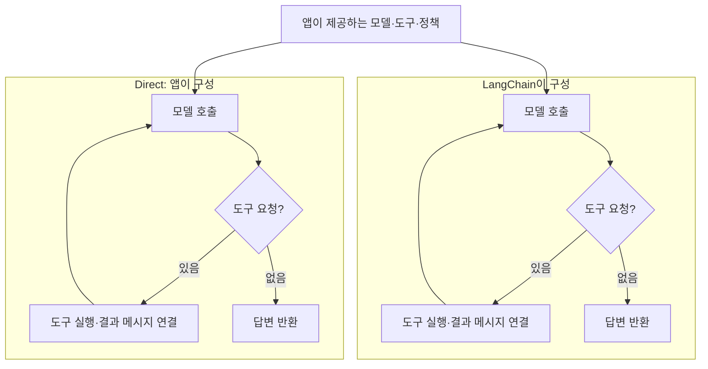
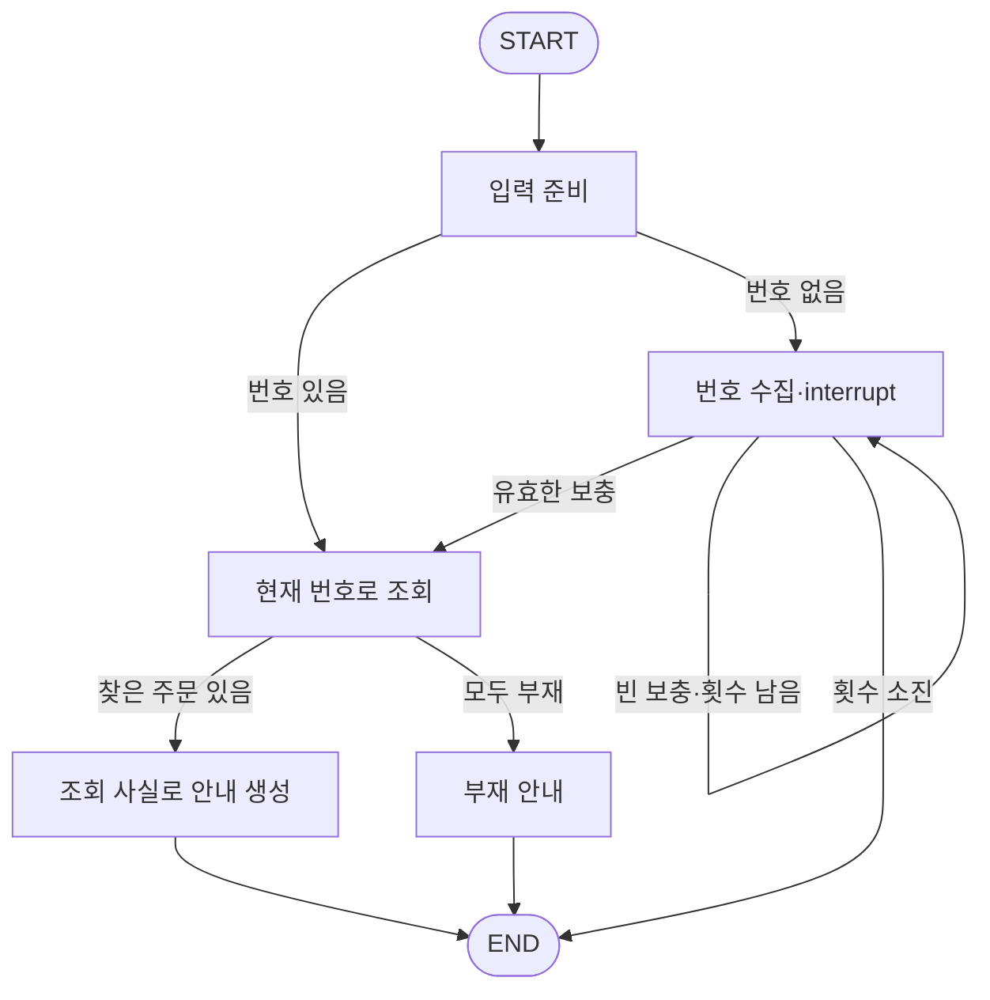

# 7주차 — Direct를 기준으로 LangChain·LangGraph를 설계·구현하고 비교하기

> 이 README가 이번 주차의 상세 학습 본문입니다. 루트 `CURRENT_WEEK.md`는 여기로 돌아오는 짧은 대시보드입니다.

- 기본 작업 폴더: [`framework_compare`](framework_compare/)
- 전체 과정: [루트 README](../README.md)
- 현재 위치와 다음 명령: [CURRENT_WEEK](../CURRENT_WEEK.md)


이번 주는 **같은 배송 문의를 처리하면서, 요구에 따라 직접 관리할 일과 프레임워크에 맡길 일이 어떻게 달라지는지 배우는 학습**입니다. 정상 답변이 같은 것은 비교의 출발점입니다. 결과를 만드는 코드, 단계 사이에 전달되는 정보, 요구 변경으로 추가되는 책임을 함께 확인합니다.

제공 업무는 주문 번호로 배송 상태를 안내하는 일입니다. 정해진 조회로 시작해 도구 실행, 주문 번호를 기다리는 요청의 보관·재개를 비교합니다. 자료는 `O-100: 배송 준비`, `O-200: 배송 중`이며 `O-999`는 없습니다. 같은 업무를 **LangChain과 LangGraph로 각각 설계·구현하고, 두 구성에 실제 모델 연결과 번호 정정 요구까지 적용합니다.** 주문 자료·조회 함수·모델 접점은 재사용합니다. Direct는 직접 관리하는 책임을 읽는 비교 기준입니다.

학습 목표는 예제 문법을 따라 쓰는 데서 끝나지 않습니다. **어떤 요구에 이 기술을 적용할지, 모델에 맡길 판단과 코드가 지킬 정책은 무엇인지, 상태·처리 경로를 어떻게 나눌지 설계할 수 있어야 합니다.** 필요한 깊이는 요구에서 정합니다. 공통 인터페이스부터 상태 갱신·middleware·체크포인트·실패 후 재개까지 실제 문제에 연결하고, 각 선택이 유리한 조건과 한계를 설명합니다.

Python은 실제 LangChain·LangGraph를 사용하는 부분에 씁니다. 개념은 입력·출력, 책임, 상태의 수명과 실행 정책을 중심으로 읽습니다.

## 시작 전에 알아둘 개념

### Direct — 필요한 실행 흐름을 직접 구성하는 방식

Direct는 이 교재에서 **처리 순서와 실행 제어를 애플리케이션 코드로 직접 작성하는 방식**을 부르는 이름입니다. 제품이나 프레임워크 이름이 아닙니다. 번호 확인 → 조회 → 안내처럼 절차가 짧으면 함수와 조건문으로 충분합니다. 코드의 동작을 한곳에서 읽기 쉽고, 프레임워크의 상태·연결 규칙을 추가로 배울 부담이 적습니다.

요구가 늘면 직접 관리하는 부분도 늘어납니다. 모델이 도구 실행을 요청하면 도구 선택·실행·결과 전달·모델 재호출을 연결해야 합니다. 다른 호출에서 번호를 보충받으려면 요청별 보관과 재개 처리가 필요합니다. Direct에서도 구현할 수 있으며, **그 코드와 유지보수 책임을 직접 소유할지**가 선택 기준입니다.

이 비교의 Direct도 모델·도구 어댑터를 사용할 수 있습니다. 예를 들어 Day 2의 두 방식은 같은 LangChain 모델 인터페이스와 조회 도구를 사용하고, 실행 루프를 누가 구성하는지만 바꿉니다. 모든 라이브러리를 제거한 구현과 비교하는 것은 아닙니다.

### LangChain — 모델·도구를 조합하고 제공되는 에이전트 흐름을 사용하는 프레임워크

LangChain은 모델·도구를 공통 인터페이스로 연결하는 구성요소와, 모델이 요청한 도구를 실행하고 결과를 돌려주는 에이전트 구성을 제공합니다. 부품마다 실행 방법을 따로 맞추는 부담과 반복되는 모델–도구 연결 코드를 줄이려는 목적입니다. 공통 인터페이스를 사용해도 모델별 지원 기능·옵션·응답의 의미까지 같아지지는 않습니다. [LangChain 개요](https://docs.langchain.com/oss/python/langchain/overview)

예를 들어 “O-100과 O-200의 배송 상태를 비교해 주세요”라는 문의에서 모델이 두 번의 조회를 요청하면, `create_agent`는 등록된 도구를 실행하고 결과를 해당 요청과 연결해 모델에게 전달합니다. 다음 응답에 도구 요청이 있으면 다시 처리합니다. 개발자는 도구의 업무 기능, 공개할 도구, 지침과 실행 한도를 정합니다. 모델의 잘못된 판단을 프레임워크가 자동으로 업무적으로 올바르게 고쳐 주지는 않습니다.

### Runnable — 구성요소를 같은 방법으로 실행하고 연결하는 계약

Runnable은 `invoke(입력)` 같은 공통 실행 인터페이스를 갖는 구성요소입니다. `RunnableLambda(lookup)`는 일반 함수를 감싸고, `A | B`는 A의 반환값을 B의 입력으로 보냅니다. `RunnableBranch`는 조건에 맞는 경로를 선택합니다. 단계마다 받는 값과 반환하는 값은 개발자가 맞춰야 합니다. [Runnable API](https://reference.langchain.com/python/langchain_core/runnables/)

`comparisons/flows.py`의 Runnable 연결은 짧은 고정 조회를 표현합니다. 이런 요구에서는 함수 호출보다 나아졌다고 느끼기 어려울 수 있습니다. 공통 인터페이스로 부품을 조합하는 방법을 여기서 확인하고, Day 2에서는 실제 모델–도구 루프를 비교해 LangChain이 대신 구성하는 일을 확인합니다.

### LangGraph — 업무 상태와 실행 경로를 명시해 제어하는 프레임워크

LangGraph는 **현재 상태를 읽는 처리와 다음 처리로 이동하는 규칙을 정의하고 실행하는 프레임워크**입니다. 상태를 사용하는 처리 단위를 노드, 처리 사이의 연결을 간선이라고 합니다. 정해진 코드 단계와 모델 판단을 섞거나, 반복·대기·재개 경로를 업무에 맞게 구성할 때 실행 제어를 맡길 수 있습니다. [LangGraph 개요](https://docs.langchain.com/oss/python/langgraph/overview)

배송 문의에서는 “번호가 없으면 질문하고, 원래 문의를 보관한 채 번호를 기다렸다가 조회한다”는 요구가 해당됩니다. 개발자가 보관할 정보와 대기·종료 조건을 정하면, 체크포인트를 구성한 그래프는 상태와 실행 위치를 보관하고 재개에 사용합니다. 모든 그래프에 저장 기능이 자동으로 생기는 것은 아닙니다.

### 상태 갱신·체크포인트·중단과 재개

**상태 갱신**은 처리 결과를 현재 상태의 해당 항목에 반영하는 일입니다. LangGraph 노드는 바뀐 항목만 반환할 수 있습니다. 기본 규칙에서 반환한 항목은 새 값으로 바뀌고, 반환하지 않은 항목은 유지됩니다. 목록 누적처럼 다른 동작이 필요하면 항목의 갱신 규칙인 reducer를 정합니다. 업무상 무엇을 보존·무효화할지는 개발자의 판단입니다. [상태 갱신 규칙](https://docs.langchain.com/oss/python/langgraph/graph-api#reducers)

**체크포인트**는 그래프의 상태와 실행 정보를 보관하는 기록입니다. **중단**은 실행 도중 보충 입력을 기다리는 것이며, **재개**는 보관한 요청에 그 입력을 전달해 처리를 잇는 것입니다. `thread_id`는 보관한 요청을 찾는 식별자이고 `interrupt`와 `Command(resume=...)`가 입력을 기다리고 전달하는 접점입니다. 여기서 thread는 운영체제의 실행 스레드라는 뜻이 아닙니다. [중단·재개](https://docs.langchain.com/oss/python/langgraph/interrupts)

예제의 `InMemorySaver`는 같은 객체를 사용하는 프로세스 안에서 상태를 보관합니다. 프로세스 종료 후 복원하려면 지속 저장소와 수명 관리가 필요합니다. 중단된 노드는 재개 시 처음부터 다시 실행되므로, 중복되면 안 되는 외부 작업을 `interrupt` 앞에 둘 때는 별도 설계가 필요합니다.

### 세 방식의 목적과 관계

| 방식 | 사용하는 목적 | 이점이 드러나는 요구 | 개발자가 계속 정할 부분 |
|---|---|---|---|
| Direct | 필요한 절차를 단순하게 직접 연결 | 짧고 정해진 조회와 분기 | 값 전달, 반복, 요청 보관·재개 코드 |
| LangChain | 공통 구성요소와 제공 에이전트 루프 활용 | 모델이 필요한 도구를 요청하고 결과를 받아 다시 처리 | 도구의 의미, 지침, 업무 규칙과 실행 한도 |
| LangGraph | 상태와 실행 경로를 업무에 맞게 명시하고 제어 | 여러 단계의 분기·반복·대기·재개 | 상태 항목·갱신, 경로, 요청 식별과 저장 수명 |

LangChain의 `create_agent`는 LangGraph를 기반으로 실행됩니다. 따라서 LangChain 에이전트도 체크포인트 등 기반 기능을 사용할 수 있고, LangGraph 노드에서 LangChain 구성요소를 사용할 수도 있습니다. **제공되는 에이전트 흐름을 활용할지, 업무의 단계와 전이를 직접 구성할지**가 중요한 차이입니다. LangGraph는 LangChain 없이도 사용할 수 있습니다. [LangChain과 LangGraph의 관계](https://docs.langchain.com/oss/python/langchain/overview)

선택은 복잡도가 높아질수록 무조건 Direct → LangChain → LangGraph로 이동하는 순서가 아닙니다. 정해진 조회는 Direct를 유지하고 자연어 도구 실행만 LangChain으로 구성할 수도 있습니다. 단순한 질문 대기는 앱의 세션으로 충분할 수 있고, 단계별 중단·재개가 많아지면 LangGraph의 역할이 커집니다.

## 실행 준비와 파일 역할

주차 폴더의 `framework_compare/`를 IDE에서 엽니다. [실행 프로젝트 README](framework_compare/README.md)의 가상환경·의존성 설치를 한 번 진행하고, IDE의 Python 인터프리터를 그 환경으로 선택합니다. 각 Day에서 안내하는 파일을 IDE의 실행 기능으로 실행할 수 있습니다. 인자를 반복해 비교하거나 실행 구성을 공유할 때 사용할 터미널 명령도 함께 제공합니다. 명령의 실행 위치는 모두 `framework_compare/`입니다.

실행할 파일은 `examples/`, 배송 업무의 구현과 모델 연결은 `shipping/`, 기초 비교용 상태·연결 부품은 `comparisons/`, 검사는 `tests/`에 둡니다. IDE에서 `examples/`의 파일을 열어 실행하며, 코드 설명에서는 해당 `shipping/` 또는 `comparisons/` 모듈을 따라갑니다.

| 파일 | 실제 역할과 사용하는 단계 |
|---|---|
| `comparisons/business.py`, `shipping/components.py` | 제공 주문 자료·조회·고정 안내. 모든 비교가 재사용하는 업무 부품 |
| `comparisons/flows.py`, `examples/run.py` | Day 1의 Direct·Runnable·그래프 고정 흐름과 실행 진입점 |
| `examples/state_updates.py` | Day 1의 부분 반환과 명시적 병합 비교 |
| `examples/tool_loop.py` | Day 2의 직접 모델–도구 루프와 실제 LangChain 에이전트 |
| `shipping/support.py` | 두 구성에서 재사용하는 입력 검사·제공 지침·모의 모델. 실행 흐름은 각 구현에 둠 |
| `shipping/agent.py` | Day 2의 도구·업무 상태·middleware·체크포인트를 연결한 LangChain 참고 구현 |
| `shipping/graph.py` | Day 3의 상태·조회·생성·대기·종료를 연결한 LangGraph 참고 구현 |
| `examples/workflow_demo.py` | Day 2~5의 같은 제공 사례를 두 참고 구현으로 실행하는 진입점 |
| `comparisons/waiting_graph.py`, `examples/waiting_compare.py` | 직접 세션 처리와 그래프의 중단·재개만 따로 읽는 작은 보조 예제 |
| `shipping/model_boundary.py` | Day 4에서 사용하는 실제 모델 접점 |
| `tests/test_comparison.py`, `tests/test_framework_purposes.py`, `tests/test_order_workflows.py` | 제공 예제의 결과·정책·상태 보존·실패 재개를 확인하는 제작용 검사 |

## 두 구성에 적용할 제공 업무

Day 2~5에서는 문의 입력란과 주문 번호 입력란이 있는 배송 안내 기능을 만듭니다. 예를 들어 문의는 “배송 상태와 도착 날짜가 궁금합니다”, 번호는 `O-100`, `O-200`입니다. **번호는 입력란에서 따로 받습니다.** 이 구성에서 모델의 역할은 허용된 번호의 도구 요청과 안내 생성이며, 자유 문장에서 번호를 추출하는 기능까지 확인한 것으로 보지 않습니다. Day 2의 짧은 `examples/tool_loop.py` 비교는 문장에서 번호를 받는 별도 예입니다.

참고 구현은 `issue`와 `order_ids` 목록, 호출자가 부여하는 요청 ID로 입력을 표현합니다. `start`·`supplement`·`correct`·`retry`는 참고 구현의 호출 방법입니다. 실제 LangChain·LangGraph의 필수 API가 아니므로 자기 구현의 접점은 다르게 정할 수 있습니다. 다음 업무 요구와 관찰할 결과를 대응시키면 됩니다.

| 제공 요구·입력 | 필요한 동작과 확인할 결과 |
|---|---|
| 한 주문 또는 `O-100`, `O-200` | 현재 번호를 조회하고 실제 배송 상태를 안내. 자료에 없는 도착 날짜는 확정하지 않음 |
| `O-999` 또는 `O-100`, `O-999` | 전체 부재와 일부 부재를 구분하고, 조회된 사실과 없는 자료를 함께 표현 |
| 번호 없이 시작한 문의 A·B에 B부터 번호 보충 | 서로 다른 요청으로 보관하고, 번호만 받아도 각 원래 문의에 이어 처리 |
| 보충 입력이 연속으로 두 번 비어 있음 | 정해진 한도에서 미해결로 종료. 횟수는 요청 상태로 관리 |
| 조회 뒤 안내 생성만 한 번 실패 | 조회 사실을 보관하고 생성 단계부터 재시도. 실패한 호출에서 옛 답변을 공개하지 않음 |
| 완료한 문의의 번호가 `O-100 → O-200 → O-999`로 정정 | 원래 문의는 보존하고 현재 조회 사실·답변은 새 번호에 맞게 갱신 |

공개 결과에는 현재 번호·조회 사실·처리 상태·안내가 필요합니다. 다음 실행 위치와 중단 여부는 구조를 이해하기 위한 관찰값입니다. 요청 ID는 이 예제에서 문의를 구분하는 값이며 실제 서비스의 사용자 인증이나 주문 열람 권한을 대신하지 않습니다.

## 실습 순서

| Day | 구체 행동 | 남길 결과와 완료 판단 |
|---:|---|---|
| 1 | 같은 조회와 부분 반환·병합 실행 | 값 전달과 상태 갱신, 직접 보존할 책임을 실제 결과로 설명 |
| 2 | 직접 루프를 읽고 LangChain 에이전트를 설계·구현·수정 | 도구 계약·업무 상태·정책 위치를 선택한 이유와 실제 보충 처리 |
| 3 | 같은 업무를 LangGraph로 설계·구현·수정 | 상태·노드·경로를 선택한 이유와 실제 대기·실패 재개, LangChain과의 대응 |
| 4 | 두 구성에 같은 실제 모델·입력 연결 | 답변의 근거·정책·상태 보존을 구분한 실제 비교 |
| 5 | 두 결과물에 번호 정정 적용 | 문의 보존과 파생값 무효화, 변경 위치와 요구별 선택 기준 |

기록은 `framework-note.md` 한 곳에 누적합니다. 코드와 실제 출력도 산출물입니다. 아래 요청문은 먼저 읽고 현재 코드·실행 결과에 맞춰 대화형 도구에서 사용합니다.

### Day 1 — 정해진 조회에서 값 전달과 상태 갱신 비교하기

`examples/run.py`를 실행하고 `comparisons/flows.py`의 세 builder를 읽습니다. 같은 번호·조회 함수·고정 생성기를 사용하므로 업무 결과가 같을 것이라는 예상을 실제 결과와 대조합니다. `O-100`의 기대 경로는 `prepare → lookup → draft`, 번호 누락은 `prepare → ask`, `O-999`는 `prepare → lookup → unavailable`입니다. 누락과 부재는 안내를 반환하고 종료하며, 같은 요청을 보관하고 기다리는 동작은 아닙니다.

| 실행 | Windows PowerShell | macOS·Linux·WSL |
|---|---|---|
| 정상 조회 | `.\.venv\Scripts\python.exe -B examples/run.py` | `.venv/bin/python -B examples/run.py` |
| 번호 누락 | `.\.venv\Scripts\python.exe -B examples/run.py --order-id=` | `.venv/bin/python -B examples/run.py --order-id=` |
| 없는 주문 | `.\.venv\Scripts\python.exe -B examples/run.py --order-id O-999` | `.venv/bin/python -B examples/run.py --order-id O-999` |
| 부분 반환·병합 | `.\.venv\Scripts\python.exe -B examples/state_updates.py` | `.venv/bin/python -B examples/state_updates.py` |

#### 짧은 고정 절차에서 Direct를 사용하는 이유

`build_direct`는 입력을 준비하고 번호가 없으면 질문, 조회 결과가 없으면 부재 안내, 있으면 답변 생성을 호출합니다. 이 조건은 이미 업무 요구로 정해져 있습니다. 모델에게 다음 행동을 선택시키거나 요청을 저장할 이유가 없으므로 함수와 조건문만으로 요구가 드러납니다.

`build_langchain`에서는 함수가 Runnable로 감싸지고 분기가 `RunnableBranch`에 놓입니다. `build_langgraph`에서는 같은 처리가 노드로 등록되고 조건 간선이 다음 노드를 고릅니다. 이 짧은 요구에서는 추가 선언과 API 학습의 부담이 생깁니다. 세 방식의 출력이 같다는 사실만으로 프레임워크 도입의 이점이 입증되지는 않습니다.

#### 문의가 사라져도 정상 답변처럼 보이는 이유

`comparisons.business.lookup`은 `{**state, ...}`로 기존 입력을 포함한 전체 묶음을 반환합니다. `examples.state_updates.partial_lookup`은 여기서 `order`, `status`, `path`만 반환하도록 반환 계약을 바꿉니다. `examples/state_updates.py`는 같은 입력을 넣고 **생성 함수가 받은 문의와 최종 결과의 문의**를 함께 출력합니다.

아래는 제공 입력 `issue="배송 예정일 문의"`의 기대 결과입니다. 자신의 실행 결과와 대조합니다.

| 조회의 반환 계약 | Direct의 생성 입력 | LangChain의 생성 입력 | LangGraph의 생성 입력 |
|---|---|---|---|
| 조회 결과·상태·경로만 반환 | 문의 없음 | 문의 없음 | 원래 문의 유지 |
| 기존 입력과 이번 갱신을 명시적으로 병합 | 원래 문의 유지 | 원래 문의 유지 | 원래 문의 유지 |

Direct의 `state = lookup_step(state)`와 Runnable 연결은 **앞 함수의 반환값 자체**를 다음 입력으로 사용합니다. LangGraph는 노드가 반환한 항목을 그래프 상태에 반영하므로 반환하지 않은 `issue`를 유지합니다. Direct와 Runnable에서도 다음과 같이 보존할 입력을 합치면 해결됩니다.

```python
def merge_lookup(state):
    return {**state, **partial_lookup(state)}
```

부분 반환은 기존 두 구현이 기대하던 계약을 바꾼 실험입니다. Direct·LangChain이 원래 정보를 보존할 수 없다는 뜻이 아닙니다. **정보를 남기는 책임이 전달 코드에 있는지, 상태 갱신 규칙에 있는지**가 다릅니다. 병합 한 번으로 해결되는 이 요구만으로 LangGraph의 도입을 결정할 이유도 충분하지 않습니다.

고정 생성 함수 `fixed_answer`는 조회 사실만 사용하고 `issue`를 읽지 않습니다. 따라서 문의가 사라져도 `ANSWERED`와 정상처럼 보이는 문장이 나옵니다. `examples/state_updates.py`가 별도로 `issue_at_draft`를 출력하는 이유입니다. 실제 모델 경계는 문의도 사용하므로 전달 누락이 이후 단계의 오류로 이어질 수 있습니다. 또한 `State`의 Python 타입 표기는 입력 검사를 대신하지 않으며, `prepare`의 검사가 실제 실행 조건을 확인합니다.

```text
Day 1의 실제 결과와 comparisons/flows.py, state_updates.py를 함께 읽어 주세요.
반환값이 다음 입력이 되는 곳과 반환 항목이 보관된 상태에 반영되는 곳을 코드로 짚으세요.
문의가 사라져도 고정 답변이 나온 이유와 명시적 병합으로 해결되는 범위를 설명해 주세요.
짧은 조회를 Direct로 유지할 이유와 다른 선택이 필요해지는 조건을 실제 코드에 연결해 주세요.
내가 결과와 대조해 판단한 내용을 framework-note.md에 이어 적도록 도와주세요.
```

**완료 확인:** 정상·누락·부재 경로와 부분 반환·병합의 실제 결과를 확인하고, 문의를 보존하는 책임이 어디에 놓였는지 설명합니다.

### Day 2 — LangChain의 구성요소로 주문 문의 에이전트 설계·구현하기

오늘의 목적은 **모델·도구·상태·실행 정책을 연결해 에이전트를 구성하고, LangChain이 제공하는 실행 루프와 개발자가 정할 업무 규칙을 구분하는 것**입니다. `create_agent` 한 줄을 호출한 사실보다, 어떤 도구를 공개하고 어떤 상태를 남기며 어디서 정책을 적용했는지가 설계의 근거입니다.

먼저 `examples/tool_loop.py`로 한 주문·두 주문·번호 누락·없는 주문의 작은 제공 사례를 실행합니다. 두 방식은 같은 모델 어댑터와 도구를 사용합니다. Direct의 `bound.invoke → tool_calls 확인 → tool.invoke → 결과 메시지 추가 → 모델 재호출`에 해당하는 반복과 연결을 LangChain의 `create_agent`가 구성합니다. 도구 호출의 `id`와 `tool_result_for`가 연결되고, 조회 결과 뒤에 최종 답변이 나오는 것을 봅니다.

| Windows PowerShell | macOS·Linux·WSL |
|---|---|
| `.\.venv\Scripts\python.exe -B examples/tool_loop.py` | `.venv/bin/python -B examples/tool_loop.py` |

이 실행의 `SCRIPTED_MODEL`은 제공 번호로 정해진 도구 요청을 만드는 모의 모델입니다. 실제 LangChain·업무 도구는 실행하지만 자연어 이해·모델 판단의 품질은 확인하지 않습니다. 앞 주차의 도구 호출 원리를 여기서는 **공통 실행 인터페이스와 제공 에이전트 루프를 사용해 구성하는 방법**에 연결합니다.

#### 모델·도구의 공통 인터페이스 — 부품을 교체할 때 유지할 경계를 정합니다

모델 어댑터는 메시지를 받아 응답하고, 도구는 이름·설명·입력 형태와 실행할 업무 함수를 연결합니다. `tool_loop.order_tool()`은 `lookup_order(order_id)`를 `StructuredTool`로 감싸 공개합니다. 함수 이름이 같아도 입력의 의미나 반환 형태를 바꾸면 모델에 공개한 계약과 결과를 읽는 코드도 함께 바뀝니다.

`create_agent(model=..., tools=..., system_prompt=...)`는 이 부품을 실행 가능한 에이전트로 묶습니다. 개발자가 모델–도구 루프를 다시 구현할 필요가 줄어들고, 같은 계약의 도구를 추가해 기존 루프를 재사용할 수 있습니다. 다만 Direct도 일반화한 루프를 재사용할 수 있으며, LangChain 도입의 판단은 그 공통 코드를 직접 유지할지에 관한 것입니다. 모든 작업 순서가 정해져 있으면 직접 조회하는 편이 더 단순할 수 있습니다. [LangChain 에이전트](https://docs.langchain.com/oss/python/langchain/agents)



그림의 경로가 같은 것은 자연스럽습니다. 반복과 연결을 구성·유지하는 주체가 다릅니다. 다음 구성에서는 이 기본 루프에 **요청별 상태와 업무 정책**을 연결합니다.

#### AgentState와 체크포인트 — 대화 기록과 업무 사실의 수명이 다릅니다

`AgentState`는 에이전트의 메시지와 실행에 필요한 상태를 담는 형태입니다. `shipping.agent.ShippingState`는 이를 확장해 원래 문의인 `issue`, 현재 번호인 `order_ids`, 조회 사실인 `orders`, 보충 횟수·처리 상태·공개 답변을 둡니다. 모델에 보낸 메시지가 있다고 해서 현재 업무 사실이 자동으로 정리되지는 않으므로, **대화 이력과 업무 상태를 구분해 보관합니다.**

예를 들어 처음에 번호 없이 “배송 예정일이 궁금합니다”라고 문의하고 다음 호출에서 `O-100`만 보충해도 원래 문의가 필요합니다. `create_agent(..., checkpointer=InMemorySaver())`와 같은 `thread_id`를 사용하면 에이전트 상태가 호출 사이에 유지됩니다. 다른 문의에는 다른 ID를 쓰고, 같은 문의를 이어갈 때 ID를 바꾸지 않습니다. LangChain도 이 방식으로 상태를 보관합니다. [대화 상태 보관](https://docs.langchain.com/oss/python/langchain/short-term-memory)

`ShippingAgent.start`는 최초 입력을 만들고, `supplement`는 저장된 문의를 읽어 번호만 보충하는 **새 대화 턴**을 실행합니다. 이 구성에서 `WAITING`은 업무상 보충을 기다린다는 뜻이며, 해당 에이전트 실행은 이미 끝났습니다. 따라서 `next=[]`여도 보관된 문의가 사라진 것은 아닙니다. Day 3의 실행 중단과 비교할 지점입니다.

#### ToolRuntime과 Command — 도구가 읽을 상태와 남길 결과를 연결합니다

`shipping.agent.shipping_tool()`은 실제 조회 함수를 `lookup_shipping` 도구로 공개합니다. 모델은 `order_id`를 요청하지만 `runtime: ToolRuntime`은 런타임이 주입합니다. 모델이 전달한 인자와 앱이 보관한 상태의 출처가 다릅니다. 도구는 `runtime.state["order_ids"]`로 현재 문의의 번호인지 확인한 뒤 조회합니다.

```python
facts = {order_id: lookup(order_id)}
return Command(update={"orders": facts, "messages": [ToolMessage(
    content=json.dumps(facts, ensure_ascii=False), tool_call_id=runtime.tool_call_id)]})
```

`Command(update=...)`는 조회 사실을 업무 상태에 반영하면서 모델이 받을 도구 결과 메시지도 남깁니다. `tool_call_id`가 요청과 결과를 연결합니다. 모델의 문장만 보고 “조회했다”고 판단하지 않고, 실제 도구가 남긴 사실을 다음 판단의 근거로 사용하는 구조입니다. `O-999: None`도 조회가 끝났지만 자료가 없다는 결과이므로 항목 자체를 지우지 않습니다. [도구와 상태 접근](https://docs.langchain.com/oss/python/langchain/tools)

두 주문의 도구가 각각 `{"O-100": ...}`, `{"O-200": ...}`를 반환하면 두 결과가 모두 남아야 합니다. 참고 구현은 `orders: Annotated[dict, merge_orders]`로 번호별 병합을 선택했습니다. 이것은 Python 문법 자체의 장점이 아니라 **여러 처리의 갱신을 어떻게 결합할지 정한 상태 계약**입니다. 병합 없이 한 항목을 덮어쓰는 규칙을 택한다면 결과를 하나로 모아 반환하는 다른 구조가 필요합니다.

#### Middleware — 반드시 지킬 정책을 실행 경계에 둡니다

Middleware는 에이전트의 실행 전후나 모델·도구 호출 주변에서 상태와 동작을 조정하는 확장 지점입니다. 지침은 모델의 판단을 유도하고, middleware나 도구의 코드는 실행 조건을 검사합니다. 둘을 같은 보장으로 읽지 않습니다. [Middleware 작성](https://docs.langchain.com/oss/python/langchain/middleware/custom)

`ShippingPolicy.before_model`은 번호가 없으면 모델을 호출하지 않고 질문을 반환해 이번 턴을 끝냅니다. 빈 보충이 정한 횟수에 도달하면 `UNRESOLVED`로 끝냅니다. 모든 조회가 끝났지만 주문을 하나도 찾지 못했다면 코드가 부재 안내를 만듭니다. `hook_config(can_jump_to=["end"])`와 `jump_to="end"`가 이 실행 제어를 연결합니다.

`ShippingPolicy.after_model`은 최종 응답에 필요한 조회가 모두 완료됐는지 확인합니다. 모델이 도구를 호출하지 않고 도착 날짜를 답해도, 조회 사실이 없으면 공개할 결과는 `INCOMPLETE`와 답변 보류 안내입니다. **조회 완료 여부를 확인하는 검사이지, 문장의 모든 주장이 사실임을 보증하는 검사는 아닙니다.** 최종 소비자는 이 구성의 검토된 `answer`를 사용하며, 내부 `messages`의 마지막 문장을 무조건 공개하지 않습니다. 실제 문장의 근거는 Day 4에서 확인합니다.

`ShippingPolicy.wrap_model_call`은 모델 호출을 감싸 최종 응답이 빈 문장이면 모델 단계에서 실패시킵니다. 응답 검사를 별도 `after_model` 단계에서 예외로 끝내면, 실패 후 재개 때 같은 빈 메시지만 다시 검사할 수 있습니다. **모델을 다시 불러야 해결되는 실패이므로 검사도 그 재실행 단위에 둡니다.** 실행 훅은 이름에 맞춰 코드를 넣는 슬롯이 아니라 실패·재시도 경계를 선택하는 도구이기도 합니다.

`ModelCallLimitMiddleware`의 한도는 한 턴의 모델 호출 반복을 제한합니다. `max_empty_replies`는 여러 턴에 걸친 빈 보충 횟수입니다. 비용·실행 반복과 업무 재질문은 단위와 수명이 달라 별도로 둡니다. 두 값을 정하는 것은 개발자의 정책 선택입니다.

#### 요구에서 LangChain 구성을 도출하고 만듭니다

공통 업무 요구를 `shipping/agent.py`의 참고 선택과 대조합니다. 이후 LangGraph에도 같은 요구를 적용하므로 입력 자료와 정책을 한쪽에만 유리하게 바꾸지 않습니다.

| 요구에서 도출할 선택 | 참고 구현의 선택 | 다른 선택이 필요한 조건 |
|---|---|---|
| 공개할 조회 기능과 결과 | 한 주문을 조회하는 도구, 번호별 사실 반환 | 묶음 조회 서비스가 있으면 여러 번호를 한 도구 호출로 처리할 수 있음 |
| 모델에게 맡길 판단 | 허용된 번호에 대한 도구 요청과 사실 기반 문장 생성 | 조회 순서가 고정이면 앱이나 그래프가 조회를 진행할 수 있음 |
| 보충을 이어받을 정보 | 원래 문의·현재 번호·보충 횟수를 요청 상태에 보관 | 프로세스 재시작을 견뎌야 하면 지속 저장소가 필요함 |
| 반드시 지킬 정책 | 도구에서 조회 대상 검사, middleware에서 생성 전후 조건 검사 | 정책이 여러 업무 단계를 연결하면 명시적 그래프가 읽기 쉬울 수 있음 |

먼저 AI에게 현재 코드·제공 입력에 근거한 구성과 이유·예상 결과를 추천받고, 짧게 수용·수정 의견을 냅니다. **도구의 단위와 입출력, 업무 상태, 정책을 적용할 위치**를 정한 뒤 실제 LangChain 구성으로 구현합니다. 참고 구현을 재사용할 수 있으며 내부 루프를 다시 만들 필요는 없습니다. 클래스·필드·파일 이름은 정답이 아닙니다. 이미 만든 코드가 있으면 그 위에 요구를 적용합니다.

초기 연결 후에는 번호 없는 문의에 다음 호출에서 번호만 보내도록 확장합니다. 이 변경은 출력 문구 수정과 다릅니다. 원래 문의를 보관할 책임, 다음 입력의 식별, 대기·종료 정책을 실행 코드에 연결해야 합니다. 이어 다른 요청도 대기시킨 뒤 역순으로 보충해 문의가 섞이지 않는지 확인합니다.

참고 구현은 `examples/workflow_demo.py --method langchain --case lookup`과 `--case waiting`, `--case empty`로 실행할 수 있습니다. 자기 구현은 선택한 진입점으로 같은 입력을 받게 합니다. 참고 시연의 클래스나 실행 API에 맞추려고 자기 구조를 바꿀 필요는 없습니다.

```text
제공 주문 문의를 처리할 LangChain 구성을 현재 작업에 설계·구현하려고 합니다.
도구의 단위·입출력, 원래 문의와 현재 사실의 보관, 정책을 적용할 위치를 실제 코드와 입력에 근거해 추천해 주세요.
각 선택으로 줄어드는 작업과 남는 책임, 다른 선택이 유리한 조건을 설명하세요.
내가 수용·수정 의견을 낸 뒤 실제 create_agent와 도구·상태·정책을 연결해 구현하고 실행해 주세요.
한 주문·복수 주문·부재를 확인한 다음, 번호 없는 문의에 나중에 번호만 보충하는 요구를 같은 구성에 적용하세요.
두 요청의 역순 보충과 빈 보충 종료를 실제로 확인하고, 예상과 다른 결과는 관련 코드와 연결해 설명하세요.
완성된 예제를 실행한 사실과 내가 선택·구현·확인한 범위를 구분해 framework-note.md에 이어 정리하도록 도와주세요.
```

**남길 결과·완료 판단:** 자기 작업에서 사용할 LangChain 구성과 보충 입력의 연결이 실제로 작동해야 합니다. 도구·상태·middleware 중 무엇을 왜 선택했는지, 보충 요구 때문에 어떤 책임을 추가했는지 코드와 결과로 설명합니다. 예제 호출이나 구성도만으로 제작이 완료됐다고 판단하지 않습니다.

### Day 3 — 같은 업무를 LangGraph의 상태와 경로로 설계·구현하기

오늘의 목적은 **업무의 상태 변화와 반드시 지킬 실행 순서를 도출하고, 그 구조를 LangGraph로 구현하는 것**입니다. Day 2와 같은 주문 자료·문의·보충·종료 요구를 사용합니다. LangChain 구성을 버리지 않고 함께 유지해 비교합니다.

`shipping/graph.py`는 같은 업무를 명시적 경로로 구성한 참고 구현입니다. 모델은 조회 뒤 안내를 생성하고, 번호 확인·조회·대기·종료는 코드가 결정합니다. LangChain 예제의 모델–도구 루프와 다른 책임 분담이며, LangGraph가 더 좋은 문장을 생성한다는 전제가 아닙니다.

#### 상태와 노드 — 보관할 사실과 다시 실행할 처리를 나눕니다

먼저 입력·중간 사실·공개 결과를 구분합니다. `issue`는 원래 문의, `order_ids`는 현재 처리 대상, `orders`는 실제 조회 사실입니다. `attempts`는 업무 재질문 정책, `status`는 현재 처리 결과, `answer`는 공개할 안내입니다. 서로 다른 수명을 갖는 값이므로 하나의 문자열 대화 이력으로만 관리하지 않습니다.

`StateGraph(ShippingState)`는 노드가 읽고 갱신할 상태의 형태를 정합니다. 노드는 상태를 읽고 변경 항목을 반환합니다. `TypedDict` 선언은 실제 입력 검사를 대신하지 않으며, 참고 구현의 `initial_state`·`normalize_ids`가 입력 형태를 검사합니다.

처리는 **다시 실행해도 되는 단위와 실패를 구분할 책임**을 기준으로 나눕니다. 참고 구현은 입력 준비, 번호 수집, 조회, 생성, 부재 안내를 나눕니다. 특히 조회와 생성을 다른 노드로 둔 이유는 생성 실패 시 이미 조회한 사실을 사용해 생성 단계만 다시 실행할 수 있기 때문입니다. 파일이나 함수 수를 늘리는 것이 목적은 아닙니다. 입력 검사를 별도 단계로 둘지, 조회와 결과 해석을 합칠지는 요구와 실패 조건으로 결정합니다.

#### 간선과 조건 간선 — 다음 행동을 업무 상태에 연결합니다

일반 간선은 정해진 다음 단계, 조건 간선은 상태를 읽어 선택하는 다음 단계입니다. 참고 구현의 경로는 다음과 같습니다.



`add_conditional_edges("collect", ...)`의 `READY → lookup`, `WAITING → collect`, `UNRESOLVED → END`가 재질문·종료 정책입니다. 분기 문법보다 **그 상태가 어느 입력에서 생겼고 다음 행동을 왜 결정하는지**를 읽습니다. 일부 주문만 없으면 찾은 사실과 부재를 함께 안내하는 `PARTIAL`이며, 전부 없으면 생성 단계로 가지 않습니다.

모델에게 “번호가 없으면 질문하라”고 지시하는 것과 이 경로는 보장하는 범위가 다릅니다. 이 구성은 모델을 호출하기 전에 다음 단계를 정합니다. LangChain에서도 middleware·도구 코드로 같은 정책을 적용할 수 있으며, 차이는 정책이 실행 훅에 분산되는지 업무 경로로 나타나는지입니다.

#### 부분 갱신과 reducer — 값이 남는 규칙도 설계입니다

`collect`는 보충한 번호·횟수·상태를 갱신하고 원래 문의는 반환하지 않습니다. 기본 갱신 규칙이 반환하지 않은 문의를 보존합니다. `lookup`은 이번 문의의 전체 조회 결과 묶음을 반환하므로 `orders`에 기본 교체 규칙을 사용합니다.

Day 2의 여러 도구는 각각 부분 결과를 반환해 `merge_orders`가 필요했습니다. 두 예제의 reducer 선택이 다른 이유는 프레임워크의 능력 차이가 아니라 **한 실행 단계가 전체 결과를 만드는지, 여러 실행이 일부씩 만드는지**가 다르기 때문입니다. LangGraph에서도 조회를 병렬 노드로 나누면 결과를 모으는 규칙이 필요합니다. 반대로 순차 계산으로 충분한 업무에 병렬 구조를 추가할 필요는 없습니다.

#### 체크포인트·interrupt·재개 — 업무상 대기와 실행 중단을 구분합니다

`graph.compile(checkpointer=InMemorySaver())`는 상태와 실행 정보를 보관하는 구성을 연결합니다. 번호가 없으면 `collect` 안의 `interrupt`가 질문을 반환하며 실행을 멈춥니다. `ShippingGraph.supplement`는 같은 요청 ID로 `Command(resume=...)`를 전달합니다. 중단한 노드는 처음부터 다시 실행되고 `interrupt`의 반환값으로 보충 입력을 받습니다.

```python
supplied = interrupt({"question": "주문 번호를 알려 주세요.", "issue": state["issue"]})
ids = normalize_ids(supplied)
attempts = state["attempts"] + 1
```

횟수를 `interrupt` 뒤에서 계산하는 이유는 재개 시 노드가 다시 시작하기 때문입니다. 외부 쓰기 작업처럼 반복되면 안 되는 처리의 위치는 별도로 설계해야 합니다. 현재 예제는 읽기 전용 주문 조회를 사용합니다. [중단·재개의 실행 규칙](https://docs.langchain.com/oss/python/langgraph/interrupts)

| 같은 번호 누락 문의 | LangChain 참고 구성 | LangGraph 참고 구성 |
|---|---|---|
| 질문 뒤 현재 실행 | 질문을 결과로 내고 턴 종료 | `collect`에서 실행 중단 |
| 원래 문의 보관 | 에이전트 체크포인트의 업무 상태 | 그래프 체크포인트의 업무 상태 |
| 다음 번호 보충 | 같은 ID로 새 입력 턴 실행 | 같은 ID로 `Command(resume=...)` |
| 대기 시 실행 위치 | `next=[]`, 업무 상태 `WAITING` | `next=["collect"]`, interrupt 있음 |

둘 다 문의를 기억하고 번호만 보충받을 수 있습니다. 표는 이번 두 구현이 선택한 실행 계약의 차이입니다. LangChain 에이전트도 기반 LangGraph의 중단 기능을 사용할 수 있으므로, 이 표를 기술 자체의 가능·불가능 표로 해석하지 않습니다.

#### 생성 실패 후 재시도 — 상태와 처리 경계를 나눈 효과를 확인합니다

`--case generation-failure`는 모의 모델이 안내 생성에서 한 번 실패하도록 만든 제공 사례입니다. 조회 사실은 남고 공개 답변은 비어 있어야 합니다. 참고 구현의 `retry`는 새 입력 없이 `app.invoke(None, config)`로 실패한 실행을 이어갑니다. 이 사례에서는 이미 성공한 조회를 반복하지 않고 생성이 완료됩니다. LangChain 에이전트에서도 같은 기반 런타임을 사용해 이 재개가 가능합니다.

모델이 예외 대신 빈 문장을 반환하는 경우에도 같은 원리가 적용됩니다. LangChain은 `wrap_model_call`에서, LangGraph는 `draft` 안에서 검사해 모델 호출과 함께 다시 실행되게 합니다. `tests/test_order_workflows.py`의 빈 응답 사례는 두 구성 모두 두 번째 생성에서 복구하고 조회는 반복하지 않는지 확인합니다. 검사 위치를 바꾸면 재실행 범위도 바뀐다는 설계 근거입니다.

번호 보충, 생성 실패 재시도, 완료 요청의 번호 정정은 서로 다른 입력입니다. `Command(resume=...)`는 interrupt에 대한 보충이며, 실패한 실행을 잇는 호출과 완료 요청을 새 입력으로 다시 처리하는 호출을 섞지 않습니다. 사용자에게 보여줄 실패 결과와 재시도 시점은 앱의 선택입니다. 저장된 배송 사실이 오래됐다면 생성만 다시 할지 재조회할지도 판단해야 합니다. [체크포인트와 실행](https://docs.langchain.com/oss/python/langgraph/persistence)

두 참고 구성은 모두 메모리 저장을 사용합니다. 재시작 후 복원, 여러 프로세스의 공유, 저장 수명·삭제가 요구되면 지속 저장소와 운영 정책까지 설계해야 합니다. 한 프로세스 안의 재개 확인을 그 운영 능력까지 검증한 결과로 기록하지 않습니다.

#### 요구에서 경로를 도출하고 LangGraph 구성을 만듭니다

Day 2에서 사용한 입력·공개 결과·정책을 유지하면서, AI와 **노드를 나눌 책임, 상태 갱신 규칙, 대기·종료·실패 재개의 경로**를 선택합니다. 추천은 현재 코드와 제공 입력을 근거로 받아 짧게 수용·수정 의견을 낸 뒤 구현합니다. 상태 필드나 노드 이름은 참고 구현과 달라도 됩니다.

같은 주문 자료·조회 함수를 재사용합니다. LangChain 구성에서 도구 안에 있던 정책을 그래프의 어느 단계에 둘지, 계속 도구로 재사용할 부분은 무엇인지 선택합니다. 모든 함수를 같은 모양으로 번역할 필요는 없습니다. 이 두 구성을 만드는 목적은 같은 요구를 두 기술의 실제 확장 지점에 배치해 보는 것입니다.

한 주문·복수 주문·부분 부재를 실행한 다음, 두 문의를 대기시키고 역순으로 번호만 보충합니다. 빈 보충 종료와 생성 실패 후 재시도도 현재 구현에서 확인합니다. 중간 상태나 다음 위치가 예상과 다르면 그 값을 만든 노드와 경로에 연결해 수정합니다.

```text
Day 2의 LangChain 구성과 같은 제공 업무를 LangGraph로도 설계·구현하려고 합니다.
입력·공개 결과·업무 정책은 대응시키고 주문 자료·조회 함수·모델은 재사용해 주세요.
요구에서 상태의 수명, 노드로 나눌 책임, 분기·대기·종료·실패 재개 경로를 도출해 추천하세요.
노드 분리와 갱신 규칙이 이 입력과 실패에서 어떤 효과를 내는지, 다른 선택이 필요한 조건도 설명하세요.
내가 수용·수정 의견을 낸 뒤 구현하고 정상·복수·부재·역순 보충·빈 보충 종료를 실제로 확인하세요.
생성만 한 번 실패하는 상황을 넣고 원래 문의와 조회 사실이 남는지, 어떤 단계가 다시 실행되는지 확인하세요.
같은 정책을 LangChain에서는 어디에 두었는지 비교하고, 실제 선택과 결과를 framework-note.md에 이어 정리하도록 도와주세요.
```

**남길 결과·완료 판단:** 자기 작업의 LangGraph 구성이 같은 업무를 수행하고 대기·실패 후 재개까지 작동해야 합니다. 노드·상태·간선의 선택을 실제 상태 변화와 재실행 범위로 설명하고, LangChain에서 대응되는 책임의 위치를 짚습니다. 두 구현 중 하나를 선택했다는 설명으로 나머지 구현을 대신하지 않습니다.

### Day 4 — 두 구성에 실제 모델을 연결하고 결과와 제어를 비교하기

오늘의 목적은 **프레임워크의 구조와 실제 모델의 행동이 만나는 지점을 확인하고, 답변과 처리의 품질을 근거로 해석하는 것**입니다. Day 2와 Day 3에서 만든 두 구성에 실제 모델을 연결합니다. 같은 제공 문의·번호·주문 자료와 같은 모델 설정을 사용합니다.

두 구성에서 모델의 역할은 다를 수 있습니다. LangChain 참고 구성은 허용된 도구 요청과 문장 생성을 모델에 맡기고, LangGraph 참고 구성은 코드가 조회한 뒤 문장 생성만 맡깁니다. 따라서 호출 횟수나 답변 차이를 라이브러리 자체의 능력 차이로 단정하지 않습니다. **어떤 판단을 모델에서 코드로 옮겼는지**를 함께 기록합니다.

OpenAI 참고 구현은 `shipping.model_boundary.live_model()`을 두 구성의 모델 접점에 연결합니다. 실제 호출 값은 IDE 실행 환경의 `AI_AX_LIVE=1`, `OPENAI_API_KEY`, `OPENAI_MODEL`로 설정하고, 값은 Git으로 공유하지 않는 로컬 환경에 둡니다. 실제 호출은 한 구성·제공 사례씩 실행하고 선택한 API의 요금·할당량을 적용받습니다.

**Gemini를 선택했다면:** API 키 발급과 모델 설정은 [6주차 README](../week06-llm-api-tool-calling/README.md)의 **「무료로 진행하려면 — Gemini 선택 경로」**를 참고합니다. 이번 주차에서는 기존 두 Python 구성에 같은 Gemini 모델 접점을 연결하고, 준비된 각 실행 파일을 VS Code의 **Run Python File in Terminal**로 실행합니다. OpenAI 참고 실행 명령에 Gemini 키를 넣는 것으로 연결을 대신하지 않습니다.

환경변수 파일과 키가 저장된 비공유 실행 설정은 학습자만 열어 값을 입력합니다. **AI는 이 파일을 직접 읽거나 검색하지 않으며, 파일을 읽는 프로그램을 실행해 간접 접근하지도 않습니다.** AI는 가짜 설정과 모의 응답으로 연결 코드를 점검하고, 실제 키를 읽는 앱과 API 호출은 학습자가 IDE에서 실행합니다. `.gitignore`는 Git 공유를 제어하며 AI의 파일 접근을 기술적으로 차단하는 장치는 아닙니다.

다음은 참고 구현의 실행 예입니다. 자기 구현도 선택한 진입점으로 같은 제공 입력을 실행합니다. 두 구현의 파일·클래스·입력 형태를 이 시연 도구에 맞출 필요는 없습니다.

| Windows PowerShell | macOS·Linux·WSL |
|---|---|
| `.\.venv\Scripts\python.exe -B examples/workflow_demo.py --method langchain --case lookup --live` | `.venv/bin/python -B examples/workflow_demo.py --method langchain --case lookup --live` |
| `.\.venv\Scripts\python.exe -B examples/workflow_demo.py --method langgraph --case lookup --live` | `.venv/bin/python -B examples/workflow_demo.py --method langgraph --case lookup --live` |

`lookup`의 제공 문의는 “배송 상태와 도착 날짜가 궁금합니다”이고 번호는 `O-100`, `O-200`입니다. 자료에는 배송 상태만 있으므로 도착 날짜를 확정할 근거가 없습니다. 이어 `partial`이나 `waiting` 사례도 두 구성으로 확인합니다. 이미 오프라인으로 확인한 모든 분기를 반복할 필요는 없지만, 실제 모델에 맡긴 도구 요청·문장 생성은 실제 연결 결과가 있어야 합니다.

| 비교할 것 | 실제로 확인할 근거 | 해석할 질문 |
|---|---|---|
| 답변의 근거 | 제공 주문값, 실제 도구·조회 결과, 최종 문장 | 상태는 일치하는가? 없는 도착 날짜를 만들었는가? |
| 업무 정책 | 번호 누락·부재에서 실행한 단계와 공개 결과 | 조건을 지침이 유도했는가, 코드가 적용했는가? |
| 상태 보존 | 원래 문의·현재 번호·요청 ID의 연결 | 보충 입력만으로 같은 문의를 처리하고 서로 섞이지 않는가? |
| 구성과 수정 위치 | 도구 계약·middleware·상태·노드·간선 | 같은 조건을 바꾸려면 어느 책임을 수정해야 하는가? |

두 답변이 모두 정확하면 차이가 없었다고 기록합니다. 이후 같은 정확성을 얻기 위해 작성한 제어와 남는 실패 가능성을 비교합니다. LangChain이 조회를 완료했더라도 문장에 추측이 섞일 수 있고, LangGraph가 실행 순서를 지켰더라도 생성 문장이 틀릴 수 있습니다. 구조가 보장하는 사실과 관찰한 모델 행동을 구분합니다.

문제가 있으면 두 구성 중 해당 책임이 있는 부분을 고치고 같은 입력으로 재확인합니다. 변경 이유는 “프롬프트를 강화했다”보다 “조회 사실에 없는 도착 날짜를 확정하지 않도록 생성 입력과 문장 정책을 나눴다”처럼 실제 원인·변경에 연결합니다. 작은 제공 사례의 결과를 통계 순위로 확대하지 않습니다.

```text
Day 2와 Day 3에서 만든 LangChain·LangGraph 구성에 같은 실제 모델과 제공 입력을 연결해 주세요.
두 구성에서 모델이 맡는 판단과 코드가 지키는 정책이 어디서 다른지 먼저 설명하세요.
환경변수 파일이나 실제 키는 읽지 말고, 가짜 설정과 모의 응답으로 연결 코드를 점검하세요.
배송 상태와 도착 날짜 문의, 부분 부재 또는 보충 문의를 내가 IDE에서 두 구성으로 실행하도록 안내하세요.
전달한 실제 결과를 대조하세요.
답변의 근거·정책 적용·상태 보존·수정 위치를 코드와 연결하고, 차이가 없는 항목도 그대로 기록하세요.
문제가 있으면 해당 구성의 책임 위치를 수정해 재확인하세요.
실제로 실행하지 못한 연결과 이유는 남겨 두고, 오프라인 실행을 실제 모델 연결 완료로 바꾸지 마세요.
```

**남길 결과·완료 판단:** 두 구성의 실제 모델 실행 결과와 근거 해석이 있어야 합니다. 확인하지 못한 구성은 그 연결 확인이 남습니다. 한쪽 실행이나 같은 모델 객체를 생성한 사실만으로 두 연결을 모두 완료했다고 판단하지 않습니다.

### Day 5 — 두 구현에 번호 정정을 적용하고 설계의 변경 비용 해석하기

오늘의 목적은 **기존 구조를 요구 변경에 적용하고, 보존할 정보와 무효화할 파생값을 설계할 수 있는지 확인하는 것**입니다. 같은 배송 문의에서 번호가 `O-100 → O-200 → O-999`로 정정됩니다. 원래 문의는 유지하지만 현재 조회 사실과 답변은 새 번호에 대응해야 합니다. LangChain과 LangGraph의 현재 결과물 둘 다 수정합니다.

#### 보존과 무효화 — 기억하는 것과 현재 사실로 쓰는 것은 다릅니다

`order_ids → orders → answer`의 의존성 때문에 번호만 바꾸고 옛 조회와 답변을 유지하면 잘못된 결과가 됩니다. LangChain의 메시지 목록이나 LangGraph의 상태가 알아서 오래된 사실의 업무상 유효성을 판단하지는 않습니다.

LangChain 참고 구현의 `_next_turn`은 `issue`를 업무 상태에서 읽어 보존하고, `orders`를 `Overwrite({})`로 비웁니다. `orders`에 병합 reducer가 있으므로 단순히 `{}`를 보내면 기존 항목이 남기 때문입니다. 메시지는 `RemoveMessage(id=REMOVE_ALL_MESSAGES)`로 이전 주문의 문맥을 지우고 현재 문의·번호로 다시 만듭니다. 대화 전체 보존이 필요한 업무라면 지우는 대신 기록을 따로 보관하거나 현재 유효한 부분을 선택해 모델에 제공하는 다른 설계가 필요합니다. [메시지 관리](https://docs.langchain.com/oss/python/langchain/short-term-memory)

LangGraph 참고 구현의 `correct`는 같은 문의와 새 번호, 빈 조회 사실·답변으로 `START`에서 다시 실행합니다. 그 상태의 `orders`는 기본 교체 규칙이라 빈 값이 기존 결과를 교체합니다. 조회·생성 노드가 새 번호로 다시 계산합니다. `Command(resume=...)`는 중단 입력을 보충하는 기능이므로, 완료한 요청의 정정을 그 호출로 대신하지 않습니다.

두 참고 구현의 `correct`는 이러한 설계 선택을 읽는 완성 예입니다. 자기 구현에서는 정정 입력을 받을 접점, 현재 상태를 갱신할 위치, 대화를 유지하는 범위를 선택해 실제로 반영합니다. 클래스·상태 형태에 맞는 다른 방법을 써도 되지만, 원래 문의 보존과 파생값 갱신은 실제 결과로 확인해야 합니다.

#### 바뀌는 조건에서 선택 이유를 설명합니다

| 요구가 달라지는 조건 | 유지할 원리 | 다시 선택할 구조 |
|---|---|---|
| 사용할 조회·계산 도구가 늘고 다음 도구 선택이 유동적 | 도구의 의미·입출력·허용 범위를 명시 | 제공 에이전트 루프와 도구·middleware 확장 |
| 반드시 지킬 순서와 중단 지점이 여러 단계로 늘어남 | 상태와 다음 행동·실패 재개를 구분 | 업무 경로를 명시한 그래프와 단계별 상태 갱신 |
| 일부 단계만 모델이 유연하게 탐색해야 함 | 전체 업무 정책과 탐색 책임을 분리 | 바깥 LangGraph의 한 노드에 LangChain 에이전트를 연결하는 혼합 구성 |
| 프로세스 종료 뒤 같은 요청을 이어야 함 | 요청 식별과 상태 수명을 명시 | 지속 체크포인트 저장소·복원·정리 정책 |
| 외부 쓰기 도구가 포함됨 | 실패·재실행의 효과를 판단 | 중복 실행 방지·업무 승인 등 실제 요구에 필요한 실행 정책 |

이 표의 다른 업무를 새 프로젝트로 구현하는 과제는 아닙니다. **이번 코드의 어느 경계를 재사용하고 어떤 선택을 바꿀지**를 설명하는 전이 학습입니다. 예를 들어 바깥 그래프가 종료 정책을 책임지고 내부 에이전트가 도구 탐색을 책임진다면, 내부 메시지·도구 결과 중 어떤 것을 바깥 업무 상태로 돌려줄지 입출력 계약이 필요합니다. 프레임워크를 함께 쓴다는 이름만으로 책임 분리가 완성되지는 않습니다.

AI에게 두 구현의 현재 코드를 근거로 변경 위치·이유·예상 결과를 추천받고, 짧게 수용·수정 의견을 낸 뒤 같은 결과물을 수정합니다. 원래 문의, 현재 번호, 조회 사실, 최종 답변을 정정 전후로 대조합니다. 과거 결과는 기록으로 남길 수 있으나 현재 주문의 근거로 사용하면 안 됩니다. 수정 후 번호 누락 또는 두 요청의 보충도 다시 확인해 현재 설계에서 관련된 동작이 유지되는지 봅니다.

```text
현재 LangChain과 LangGraph 구현 둘 다에 주문 번호 정정 요구를 적용하려고 합니다.
원래 문의는 보존하고 새 번호로 재조회하며, 옛 조회 사실·답변을 현재 결과에 재사용하면 안 됩니다.
각 구현의 상태·메시지·정책·경로를 근거로 정정 접점과 무효화할 값을 추천해 주세요.
내가 수용·수정 의견을 낸 뒤 두 결과물을 수정하고 O-100 → O-200 → O-999로 실제 확인하세요.
같은 정책을 바꾸기 위해 수정한 위치, 차이가 난 이유와 같았던 항목을 코드·결과로 설명하세요.
도구가 늘거나 대기 단계가 늘 때 이번 구조에서 무엇을 재사용하고 다시 설계할지도 설명해 주세요.
실제 선택·변경·결과와 그 근거를 framework-note.md에 이어 정리하도록 도와주세요.
```

**남길 결과·완료 판단:** 두 구현 모두 정정 처리가 동작하고, 문의 보존과 새 조회·답변의 연결이 확인돼야 합니다. 선택 이유, 다른 구성으로 같은 요구를 처리하는 방법, 예상과 실제 결과, 차이가 생긴 코드와 차이가 없던 항목을 하나의 노트에 연결합니다. 코드 줄 수·출력 품질 순위 대신 어떤 책임을 어디에서 제어하고 수정했는지로 비교합니다.

## 완료 기준

LangChain과 LangGraph로 같은 제공 업무를 각각 설계·구현하고, 두 구성에 실제 모델 연결·보충 처리·번호 정정을 적용한 결과가 있어야 합니다. Direct는 비교 기준으로 유지합니다. 실제 모델을 실행하지 못한 부분은 연결 확인이 남아 있는 것으로 구분합니다.

각 기술의 정의·역할·이점뿐 아니라 **요구 때문에 선택한 도구 계약·상태 수명·정책 위치·처리 경로를 실제 코드로 설명하고, 요구가 바뀌면 어떤 경계를 재사용하거나 바꿀지 판단합니다.** 프레임워크가 맡는 기능, 개발자가 계속 정할 업무 규칙, 현재 확인의 한계를 함께 설명합니다. 참고 구현의 존재·예제 실행·AI의 해설만으로 학습자의 설계·구현·이해를 확인했다고 기록하지 않습니다.
