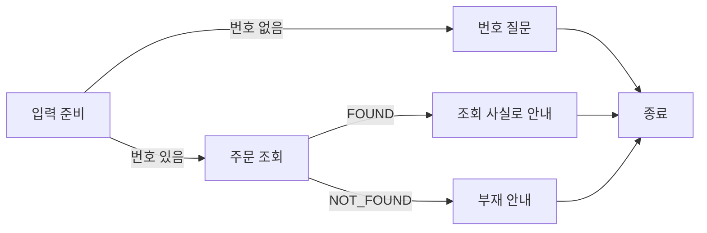

# 7주차 — Direct·LangChain·LangGraph에서 같은 흐름의 책임 비교하기

> 이 README가 이번 주차의 상세 학습 본문입니다. 루트 `CURRENT_WEEK.md`는 여기로 돌아오는 짧은 대시보드입니다.

- 기본 작업 폴더: [`framework_compare`](framework_compare/)
- 전체 과정: [루트 README](../README.md)
- 현재 위치와 다음 명령: [CURRENT_WEEK](../CURRENT_WEEK.md)


이번 주의 질문은 **“프레임워크는 어떤 복잡성을 줄이고, 어떤 결정은 여전히 개발자가 하는가?”**입니다. 제공된 주문 요구에서 입력·결과·상태·처리 책임·분기와 종료를 도출하고, 그 선택이 Direct, 실제 LangChain, 실제 LangGraph에서 어떻게 표현되는지 비교합니다. AI와 선택한 구조를 구현해 같은 제공 입력으로 사용합니다. 결과물은 세 방식의 비교와 요구를 근거로 설계한 작동하는 흐름입니다.

업무 함수와 자료는 제공하므로 주문 시스템을 새로 만들 필요가 없습니다. Python은 실제 LangChain·LangGraph의 API를 다루는 짧은 비교에 사용합니다. `framework_lab/`의 LangChain4j는 Java에서의 선택을 돕는 보조 자료이며 Python LangChain·LangGraph를 대체하는 이름이 아닙니다.

## 시작 전에 알아둘 개념

### SDK와 프레임워크 — 모델 연결과 흐름 연결의 책임

6주차의 SDK는 요청·응답 형식을 제공하고 애플리케이션이 다음 호출과 종료를 연결했습니다. 이번에는 **같은 업무 함수 사이의 순서·분기·값 전달**을 누가 표현하는지 비교합니다. Direct에서는 함수 호출과 `if`를 직접 쓰고, LangChain에서는 실행 가능한 구성요소를 연결하고, LangGraph에서는 상태를 읽고 바꾸는 노드와 다음 노드를 선택하는 간선을 선언합니다.

프레임워크를 사용한다고 주문 조회 규칙이나 실패의 의미가 생기지는 않습니다. 또한 그래프가 있다고 여러 AI가 일하는 것도 아닙니다. 이 실습의 조회는 일반 함수이고 모델은 조회된 사실을 안내 문장으로 표현할 때만 사용합니다. 도구 선택을 모델에 맡기는 agent 루프와, 정해진 업무 흐름을 실행하는 구성을 구분합니다. LangChain의 `create_agent`는 도구 호출 루프를 제공하는 별도 선택이며 이번 비교에서는 흐름의 연결을 드러내는 Runnable을 사용합니다. [LangChain 개요](https://docs.langchain.com/oss/python/langchain/overview), [LangChain agents](https://docs.langchain.com/oss/python/langchain/agents)

### Runnable과 연결 — 앞 단계의 결과를 다음 단계로 보냅니다

Runnable은 `invoke(입력)`으로 실행할 수 있는 구성요소입니다. `RunnableLambda(lookup)`는 기존 함수를 같은 실행 인터페이스로 감싸고, `A | B`는 A의 출력을 B의 입력으로 전달합니다. LangChain을 쓴다고 함수가 자동으로 서로 맞는 자료를 주고받지는 않습니다. `lookup`이 `order`를 만들고 뒤의 `draft`가 같은 이름을 읽어야 합니다.

### 상태·노드·간선 — 현재 사실과 다음 행동을 나눕니다

**상태**는 지금 처리하는 대상과 다음 판단에 필요한 값입니다. **노드**는 상태를 읽고 결과를 반환하는 처리이며, **간선**은 다음에 실행할 노드를 정합니다. 상태를 명시하면 답변이 어떤 주문의 어떤 조회 결과에 의존하는지 코드에서 찾을 수 있습니다. LangGraph는 이 상태를 사용하는 노드와 간선을 연결해 실행하며, 구체적인 상태 항목과 갱신은 Day 1의 결과에서 확인합니다.

### 실패와 종료 — 결과가 없는 이유에 따라 흐름이 달라집니다

번호가 없으면 사용자에게 정보를 받아야 하고, 번호는 있는데 자료가 없으면 조회 실패를 안내해야 합니다. 이 둘을 모두 빈 답변으로 반환하면 다음 행동을 정할 수 없습니다. 조회 성공일 때만 생성 단계로 보내면 모델이 없는 주문 정보를 만들어 답할 기회도 줄어듭니다.



질문은 이번 실행의 종료 결과입니다. 이후 사용자가 번호를 보충하면 입력과 기존 문의 내용을 다음 실행에 넣습니다. 제공 비교에는 영구 저장이나 자동 대화 재개가 없습니다. 필요한 상태와 분기를 먼저 이해한 뒤에 저장·재개 요구가 생겼을 때 체크포인트를 선택하는 이유가 여기에 있습니다.

## 제공 자료와 첫 실행

IDE에서 `week07-langchain-langgraph/framework_compare/`를 열고 Python 3.12 가상환경을 지정합니다. `requirements.txt`를 설치하고 `run.py`를 실행하면 됩니다. 명령이 필요하면 해당 폴더에서 다음을 사용합니다.

Windows PowerShell:

```powershell
python -m venv .venv
.\.venv\Scripts\python.exe -m pip install -r requirements.txt
.\.venv\Scripts\python.exe -B run.py
```

macOS·Linux·WSL:

```bash
python3 -m venv .venv
.venv/bin/python -m pip install -r requirements.txt
.venv/bin/python -B run.py
```

이후 예시의 `python`은 IDE에서 선택한 가상환경의 Python을 뜻합니다. 터미널에서는 위 운영체제별 실행 파일을 사용하거나 가상환경을 활성화합니다. 기본 실행은 실제 두 프레임워크와 업무 함수를 사용하고, 답변 생성만 `FIXED_OFFLINE`으로 고정합니다. 제공 버전은 LangChain 1.4.0, LangGraph 1.2.11, LangChain OpenAI 연결 1.6.2입니다.

| 파일 | 먼저 볼 부분 |
|---|---|
| `business.py` | `prepare`, `lookup`, `make_draft`, 상태 항목과 두 분기 함수 |
| `comparison.py` | 같은 함수를 세 방식으로 연결하는 `build_*` |
| `model_boundary.py` | 모든 방식에 공통인 실제 모델 요청·지침 |
| `run.py` | 입력을 받아 선택한 흐름에 전달하는 실행 진입점 |
| `components.py` | 전체 상태를 정하지 않는 조회·생성 부품 |
| `clarification.py` | 질문 후 같은 요청을 대기·재개하는 실제 SDK 비교 |
| `exercise.py` | 사용할 수 있는 초기 스케치. 상태·함수·진입점은 선택 가능 |
| `test_comparison.py` | 제공 계약의 동일성·정정·오류를 확인하는 기존 검사 |

## 실습 순서

| Day | 구체 행동 | 남길 결과와 완료 판단 |
|---:|---|---|
| 1 | 세 제공 흐름으로 같은 정상 입력 실행 | 입력·조회 사실·답변·실행 경로가 이어지는 해석 |
| 2 | 같은 누락·부재 입력으로 연결 책임 비교 | 직접 분기·Runnable·그래프의 대응과 차이 |
| 3 | 요구에서 입력·결과·상태 수명·책임·분기를 선택해 구현 | SDK 제약과 구별한 설계 판단, 작동하는 핵심 구조 |
| 4 | 같은 흐름에 실제 생성 경계 연결 | 조회 사실과 생성 문장의 관계 및 미확인 범위 |
| 5 | 번호 정정 상황으로 상태 의존성 확인 | 유지할 문의와 무효화할 조회·답변의 차이, 세 방식 선택 기준 |

기록은 `week07-langchain-langgraph/framework-note.md` 한 곳에 누적합니다. 핵심 코드 자체와 실제 출력도 결과물이며 별도 설계 보고서나 점수표를 만들지 않습니다.

### Day 1 — 같은 결과가 만들어지는 경로 읽기

첫 실행은 세 방식 모두 `O-100`을 조회합니다. `business.py`의 `ORDERS`에는 `O-100: 배송 준비`, `O-200: 배송 중`이 있습니다. 다음은 출력에서 확인할 **기대 값**이며 자기 실행 기록을 대신하지 않습니다.

```text
order_id: O-100
order: {order_id: O-100, shipping: 배송 준비}
status: ANSWERED
path: [prepare, lookup, draft]
generation: FIXED_OFFLINE
```

#### 실행 결과에서 상태의 역할 읽기

| 상태 항목 | 예 | 역할 |
|---|---|---|
| `order_id`, `issue` | `O-100`, 배송 문의 | 이번 입력과 사용자 주장 |
| `order` | 주문 번호와 `shipping=배송 준비` | 조회로 확인한 사실, 조회 전에는 없음 |
| `status` | `NEEDS_INPUT`, `FOUND`, `NOT_FOUND`, `ANSWERED` | 다음 처리에 쓰는 현재 상태 |
| `answer` | 안내 문장 | 사실과 상태를 바탕으로 만든 결과 |
| `path` | `prepare → lookup → draft` | 이번 사례에서 실제 실행된 업무 단계 |

`TypedDict`는 이 값의 이름과 형태를 코드 읽기·도구 지원에 알리는 Python 표기입니다. 그 자체가 실행 중 입력 검사를 해주지는 않으므로 `prepare`가 실제 문자열 형식을 확인합니다. `path`는 이 작은 사례의 분기를 보기 위한 값이며 전체 대화·모델 내부 추론을 기록하는 기능은 아닙니다.

LangGraph에서는 `StateGraph(State)`에 노드를 넣고 `START`, `END`, 일반 간선, 조건 간선을 연결한 뒤 `compile()`한 결과를 실행합니다. 기본 상태 항목은 노드가 반환한 값으로 교체됩니다. 따라서 이 예제의 `path`는 `[이전 값, 이번 단계]`를 직접 만들어 반환합니다. 누적·교체 규칙은 라이브러리가 업무 의미를 알아서 선택하는 것이 아닙니다. [LangGraph 개요](https://docs.langchain.com/oss/python/langgraph/overview), [Graph API](https://docs.langchain.com/oss/python/langgraph/graph-api)

`order_id`는 요청에서 왔고 배송 상태는 `lookup`에서 왔습니다. `draft`는 그 조회 결과를 입력으로 받습니다. 세 결과가 같은 이유는 프레임워크가 사실을 맞혔기 때문이 아니라 동일한 함수·자료·분기·고정 생성기를 연결했기 때문입니다. 이 실행으로 비교할 것은 연결 책임이고 실제 모델의 답변 품질은 아닙니다.

`comparison.py`의 `build_direct`에서 `prepare → if → lookup → if → draft`를 따라갑니다. 한 함수 안에 제어 흐름이 모여 있어 짧은 업무는 쉽게 읽힙니다. 반면 각 단계의 입출력을 별도 실행·합성 대상으로 다루려면 직접 인터페이스를 맞춰야 합니다. 파일 수나 코드 줄 수만으로 유지보수가 더 좋다고 결론내리지 않습니다.

```text
framework_compare의 첫 실행 결과와 business.py, comparison.py를 함께 읽어 주세요.
O-100 입력에서 각 값의 출처와 다음 단계로 전달되는 위치를 설명하세요.
Direct와 LangChain, LangGraph에서 같은 업무 함수를 연결한 부분을 대응해 보여 주세요.
고정 생성기가 확인하는 범위와 실제 모델이 필요한 범위를 구분해 주세요.
설명이 실제 코드·출력과 맞는지 내가 판단한 내용만 framework-note.md에 연결해 주세요.
```

**완료 확인:** 세 방식의 실제 출력과 코드에서 입력→조회→답변 경로를 찾아 설명합니다. 출력 전체를 세 번 복사할 필요 없이 같은 값과 연결 위치를 묶어 남깁니다.

### Day 2 — 필요한 분기가 어디에 표현되는지 비교하기

같은 실행 명령에서 `--order-id ''`와 `--order-id O-999`를 차례로 넣습니다. 각 명령의 기본 `--method all`로 세 방식이 같은 입력을 받습니다. 누락은 `prepare → ask`, 부재는 `prepare → lookup → unavailable`이 기대 경로입니다. 두 경우 모두 생성 함수를 실행할 사실이 없으므로 `generation=NONE`입니다.

#### 같은 분기를 표현하는 연결 코드

`RunnableBranch`는 조건을 순서대로 검사해 처음 맞는 경로를 실행하고, 아무 조건도 맞지 않으면 마지막 기본 경로를 실행합니다. 아래는 `comparison.py`의 실제 연결입니다.

```python
chain = RunnableLambda(prepare) | RunnableBranch(
    (lambda state: not state["order_id"], RunnableLambda(ask)),
    RunnableLambda(lookup) | found_or_missing,
)
```

번호가 비어 있으면 `ask`만 실행합니다. 번호가 있으면 조회한 뒤 `found_or_missing`에서 조회 성공 여부를 다시 판단합니다. 이름을 지은 함수와 입출력 계약이 있어야 이 짧은 연결도 읽을 수 있습니다. `|`는 이 라이브러리에서 실행 순서를 연결하는 표기이며 다른 언어의 일반 원리와 혼동할 필요는 없습니다.

| 책임 | Direct | LangChain | LangGraph |
|---|---|---|---|
| 단계 실행 순서 | 함수 본문의 호출 순서 | Runnable 연결 `|` | 노드와 간선 |
| 번호 누락 판단 | `if not state["order_id"]` | RunnableBranch의 조건 | `after_prepare`와 조건 간선 |
| 값 전달 | 반환값을 변수에 넣음 | 이전 출력이 다음 입력 | 상태 갱신을 다음 노드가 읽음 |
| 업무 사실·오류 의미 | `business.py` | 같은 함수 | 같은 함수 |

LangGraph의 다음 실제 코드에서 `after_lookup`는 `FOUND`이면 `draft`, 아니면 `unavailable`을 반환합니다.

```python
graph.add_conditional_edges("lookup", after_lookup,
                            {"draft": "draft", "unavailable": "unavailable"})
```

`after_lookup`가 판단하고 간선 맵이 그 결과와 노드를 연결합니다. 둘의 이름이 맞지 않으면 올바른 업무 함수가 있어도 실행할 수 없습니다. 단계가 많아질 때 그래프는 연결을 한곳에서 드러내지만, 이 작은 사례에서는 선언이 Direct보다 길어질 수 있습니다. 보이는 연결의 이점과 설정 부담을 함께 읽습니다.

**완료 확인:** 정상과 두 핵심 분기에서 같은 업무 계약을 확인하고, 무엇을 프레임워크에 맡겼으며 어떤 정책은 코드에 남았는지 노트에 연결합니다.

### Day 3 — 요구에서 핵심 구조를 설계하고 구현하기

Day 1~2의 실제 정상·번호 누락·조회 부재 결과를 바탕으로, 같은 제공 주문 요구의 구조를 AI와 정합니다. 다음 해설은 결과·사실의 출처·상태 수명에서 책임과 실행 순서를 도출합니다.

이번 요구를 API나 노드 이름 없이 먼저 읽습니다.

> 배송 문의를 받아 현재 주문의 상태를 안내한다. 번호를 모르면 필요한 정보를 묻는다. 없는 주문은 찾았다고 답하지 않는다. 번호가 정정되면 현재 주문의 사실을 사용한다. 사용자 주장만으로 결제·환불 사실을 확정하지 않는다.

#### 도구를 고르기 전에 외부에서 관찰할 결과를 구별합니다

“배송을 안내한다”만 읽으면 입력과 출력이 문자열 하나면 될 것 같습니다. 그러나 나머지 문장은 서로 다른 다음 행동을 요구합니다. 번호가 빠졌으면 정보를 받아야 하고, `O-999`면 조회 대상을 확인해야 하며, `O-100`의 조회 사실이 있으면 안내할 수 있습니다. 이 차이를 문자열 내용에만 숨길 수도 있지만 호출자가 다음 화면이나 재요청을 결정하려면 결과 종류를 구분하는 편이 낫습니다.

| 주어진 조건 | 다음 행동 | 결과에 필요한 정보 |
|---|---|---|
| 번호가 없다 | 번호 질문 | 부족한 입력과 질문, 이어 쓸 문의 |
| 번호는 있으나 조회 결과가 없다 | 부재 안내 | 조회한 번호와 부재라는 사실 |
| 현재 번호의 조회가 성공했다 | 사실을 바탕으로 안내 | 현재 주문과 조회 결과, 답변 |
| 번호가 바뀌었다 | 새 번호 조회 | 유지할 문의, 사용을 끝낼 옛 사실 |

이 표는 코드 클래스 이름을 지정하지 않습니다. 예를 들어 `kind + payload` 형태의 결과를 만들 수도 있고, 질문·부재·답변을 서로 다른 결과 타입으로 만들 수도 있습니다. 제공 비교는 학습 중 값을 따라가기 쉽도록 하나의 상태 객체에 `status`, `answer`를 둡니다. 중요한 조건은 호출자가 의미를 다시 추측하지 않아도 결과와 다음 행동이 연결되는 것입니다.

#### 필요한 사실의 출처를 정해 책임을 나눕니다

주문 번호와 문의는 입력에서 얻고, 배송 상태는 조회 함수에서 얻습니다. “결제가 두 번 된 것 같아요”는 사용자 주장으로 남깁니다. 모델이 잘 아는 일반 지식으로 주문 자료를 대신할 수 없으므로 **자료가 없으면 생성하지 않는 경계**가 먼저 필요합니다.

두 후보 구조를 생각할 수 있습니다. 모델에게 도구 선택과 다음 행동을 맡기는 agent는 서로 다른 종류의 요청을 유연하게 처리할 때 유용합니다. 반면 현재 요구는 조회 조건과 정상 경로가 명확합니다. 먼저 코드가 번호·조회 결과를 확인하고 마지막 문장 표현만 모델에 맡기면, 정보가 없는 경로에서 모델을 호출할 이유가 없어집니다. 제공 비교는 이 두 번째 방식을 택했습니다. 프레임워크가 요구해서가 아니라 **이번 요구의 판단이 이미 명시되어 있기 때문**입니다.

`components.lookup_order(order_id)`는 조회 부품, `fixed_reply(issue, facts)`와 `live_reply()`는 생성 경계입니다. 이 함수들은 학습자의 전체 상태 형태를 정하지 않습니다. 모델을 마지막에 둔다고 도구 사용 능력을 배제하는 것이 아니라, 앞서 배운 호출 루프가 필요한 조건과 불필요한 조건을 판단하는 것입니다.

#### 상태는 전달할 값과 보관할 기간에서 도출합니다

함수 한 번 안에서만 쓰는 번호·조회 결과라면 지역 변수로 충분합니다. 단계마다 같은 값을 읽고 갱신해야 하므로 명시적 상태에 둘 수도 있습니다. 질문을 반환한 뒤 별도 입력에서 이어 처리해야 한다면 **누가 이전 문의를 보관하는가**가 추가 결정입니다. 이 요구를 정하지 않은 채 먼저 체크포인트를 붙이면 무엇을 복원해야 하는지 알 수 없습니다.

| 후보 | 값의 보관 책임 | 맞는 조건과 부담 |
|---|---|---|
| 요청마다 계산 | 호출자가 문의와 현재 번호를 모두 전달 | 짧은 조회에 단순함. 보충 화면이 이전 문의를 유지해야 함 |
| 앱의 세션 상태 | 앱이 요청 ID별로 문의·대기 상태 저장 | 앱이 재개 경로·수명·정리를 직접 관리 |
| 그래프 체크포인트 | 그래프 상태와 실행 위치를 SDK에 맡김 | 중단한 단계부터 이어야 할 때 유용. 요청 식별과 저장 수명은 여전히 앱의 결정 |

기본 비교는 첫 후보입니다. `prepare`는 이번 `order_id`와 `issue`를 받아 조회·답변을 다시 준비합니다. 그래서 세 방식 모두 같은 입력을 독립적으로 비교할 수 있습니다. `business.State`에 적힌 필드는 이 설계의 선택이고 LangGraph가 요구하는 정해진 업무 상태가 아닙니다. 새 구조에서는 입력, 처리 상태, 출력 타입을 나누어도 됩니다.

번호 정정은 저장한 값 사이의 의존성을 드러냅니다. `issue → 안내 목적`은 유지되지만 `order_id → 조회 사실 → 답변`은 새 번호를 기준으로 다시 계산해야 합니다. “이전 답변을 잊으라”는 지침만 추가하면 코드에는 여전히 옛 사실이 남을 수 있습니다. 파생값을 지우는 방식과 결과에 대상 번호를 붙여 유효성을 검사하는 방식이 모두 가능하며, 제공 비교는 작은 조회이므로 다시 구하는 방식을 선택했습니다.

#### 대기·재개·교정 반복은 어떤 요구에서 필요한가

지금 질문을 반환하고 끝내도 되는 요구와, **원래 문의를 보관한 채 번호만 받아 같은 실행을 계속해야 하는 요구**는 다릅니다. 제공 `clarification.py`는 두 번째 요구의 비교 예제입니다. 입력 번호가 없으면 `interrupt`가 질문을 내보내고, 같은 `thread_id`의 `Command(resume="O-100")`가 답변을 그 노드에 돌려줍니다. `collect`는 재개 값을 상태에 반영하고 실제 조회·안내로 갑니다.

```python
supplied = interrupt({"question": "주문 번호를 알려 주세요.", "issue": state["issue"]})
# 반환된 보완값을 검사한 뒤 상태를 갱신
return {"order_id": supplied.strip(), "attempts": attempts, "status": "READY"}
```

위 발췌의 앞뒤에는 실제 입력 검사와 두 번의 보완 한도가 있습니다. 이 횟수는 SDK 고정값이 아니라 제공 예제가 선택한 종료 정책입니다. `InMemorySaver`는 같은 프로세스 안에서 상태를 보관하므로 앱을 종료했다 다시 시작하는 복원 요구까지 충족하지 않습니다. 재시작 후 복원이 필요하면 지속 저장이 가능한 checkpointer와 요청 ID의 보관을 함께 골라야 합니다.

재개 시 `interrupt`가 들어 있는 노드는 처음부터 다시 실행됩니다. 그래서 이 예제는 대기 전에 파일 저장·외부 전송을 하지 않습니다. 그 위치에 외부 효과를 둔 설계라면 중복 방지나 별도 단계가 필요합니다. 상태를 저장하는 것과 업무를 한 번만 수행하는 것은 서로 다른 책임입니다. [LangGraph interrupt와 재개](https://docs.langchain.com/oss/python/langgraph/interrupts), [체크포인트](https://docs.langchain.com/oss/python/langgraph/persistence)

외부 코드에서도 같은 책임을 다른 방식으로 표현할 수 있습니다. `rag-chatbot`의 고정 버전 `orchestrator.py`는 `clarify_hitl → END`로 실행을 끝내고 `_pending_sessions[session_id]`에 상태를 보관합니다. 보완 응답이 오면 그 상태를 꺼내 별도의 continuation graph를 실행합니다. **앱의 사전과 재개 그래프가 대기를 관리하는 구현**이며 SDK `interrupt`·checkpointer를 사용한 것으로 해석하지 않습니다. 코드에서 확인할 수 있는 범위는 이 연결이며 프로세스 재시작 복원까지 입증하지 않습니다. [실제 대기와 재개 코드](https://github.com/yundoun/rag-chatbot/blob/79fee3114fba6135884d492753dad9d40d443468/src/core/orchestrator.py#L130-L198)

반복도 같은 기준으로 도출합니다. `multi-agent-rag`의 `corrective_rag.py`는 질문 처리→평가→기준 충족 시 종료, 미충족 시 질문 재작성→재처리를 반복 상한 안에서 수행합니다. 다시 실행할 이유는 같은 함수를 더 부르는 데 있지 않고 **평가에서 얻은 피드백으로 다음 검색 입력이 바뀐다는 데** 있습니다. 반면 주문 번호 없는 입력은 재작성으로 새 번호가 생기지 않으므로 사람의 정보가 필요합니다. 노드나 재작성 함수가 존재하는 것과 실제 분기가 그 노드에 도달하는 것도 구분합니다. 이 사례들을 통째로 재구현하지 않고 다음 행동을 바꾸는 정보와 종료 근거를 읽습니다. [교정 반복의 실제 분기](https://github.com/yundoun/multi-agent-rag/blob/4e6eff268f8569b0f4e9af286114d32c1f918bb8/src/agents/corrective_rag.py#L267-L349)

#### 처리와 분기의 경계를 입력·출력으로 확정합니다

이제 단계가 필요한 이유를 코드에 연결할 수 있습니다.

```text
prepare: 이번 입력을 확인하고 이전 번호의 파생값을 제거
번호 판단: 입력이 없으면 ask, 있으면 lookup
lookup: 현재 주문을 조회해 사실 또는 부재를 반환
조회 판단: 사실이 있으면 draft, 없으면 unavailable
draft: 현재 사실과 문의로 안내를 생성
```

`lookup`이 먼저 실행되어야 `draft`의 근거가 생기므로 둘을 병렬로 실행하지 않습니다. `ask`는 조회 전, `unavailable`은 조회 후에 위치합니다. 둘 다 답변을 만들지 못한다는 이유로 하나의 실패 처리에 모으면 입력 부족과 자료 부재가 섞입니다. 노드 수를 늘리기 위한 분할이 아니라 **다음 처리의 입력이 준비됐는지 판단하는 경계**입니다.

실제 `comparison.py`의 Direct 구현은 `prepare → 번호 if → lookup → 결과 if → draft`로 이 결정을 표현합니다. LangChain은 같은 반환값을 Runnable 사이에 전달하고 분기를 `RunnableBranch`로 감쌉니다. LangGraph는 같은 처리 함수를 노드로 등록하고 상태값에서 다음 노드 이름을 구합니다. 세 구현이 공유하는 업무 계약을 먼저 읽어야 `if`, Runnable, 간선이 서로 다른 업무를 한다고 오해하지 않습니다.

#### 오류는 복구에 필요한 정보가 생기는지로 판단합니다

`O-999`를 다시 조회해도 제공 자료는 바뀌지 않습니다. 따라서 이 사례의 부재는 같은 호출 반복보다 사용자 확인으로 끝내는 편이 적절합니다. 모델 통신이 실패한 경우는 사실이 없는 것과 다릅니다. 제공 구현은 예외를 성공 답변으로 바꾸지 않고 호출자에게 전달합니다. 사용자 화면을 만든다면 생성 실패라는 결과로 변환할 수도 있습니다. 자동 재시도를 선택하려면 일시적 오류인지, 재시도 한도와 비용은 얼마인지, 외부 효과가 중복될 수 있는지를 그 요구에서 정해야 합니다.

숫자 제한은 종료를 보장하지만 성공을 보장하지 않습니다. 반복 뒤 성공 조건을 충족하지 못했으면 실패·보류라는 의미를 유지해야 합니다. “가장 높은 점수의 답변”도 업무 수용 기준에 못 미칠 수 있으므로 상대적 우수함과 허용 가능한 결과를 구분합니다.

#### 선택한 구성을 구현하기

번호를 별도 입력으로 받을지, 화면이나 대화에서 추출한 값을 받을지에 따라 입력 경계가 달라집니다. 이번에는 제공된 번호·문의로 실행합니다. 질문을 반환한 뒤 호출자가 원문을 다시 전달할지, 같은 요청의 상태를 보관해 보충할지도 선택합니다. 비교 예제의 `State`, 다섯 노드, `build_flow(draft)`는 참고 구현이 택한 구조이며, 요구에 맞는 입력·결과와 상태 수명을 정합니다.

`components.py`의 조회·생성 함수를 재사용하고, 입력을 받고 다음 행동을 결정해 결과를 반환하는 핵심 구조를 AI와 구현합니다. 기존 `exercise.py`를 바꿔도 되고 선택한 모듈과 IDE 실행 설정을 만들어도 됩니다. 제공 정상·핵심 분기 입력이 선택한 처리 경로에서 실행되도록 연결합니다. 선택한 구조가 보여야 하므로 완성된 비교 실행 함수를 그대로 호출하는 것으로 끝내지는 않습니다.

```text
제공 주문 요구와 components.py의 부품으로 작은 처리 흐름을 설계하겠습니다.
앞의 교재 해설과 실제 정상·번호 누락·부재 입력을 근거로, 필요한 입력·결과와 사실의 출처를 먼저 정리하세요.
상태를 어디에 얼마나 보관할지, 문의 보충을 누가 이어 줄지, 실패 뒤 어떤 행동을 할지
가능한 구성과 추천 이유·예상 경로를 설명해 주세요. 예제의 State나 함수 이름을 고정 조건으로 두지 마세요.
Direct·LangChain·LangGraph의 책임 차이를 비교한 뒤 선택할 구조를 제안하고 내 짧은 의견을 반영하세요.
그 구조의 핵심 코드와 실제 실행 진입점을 구현하고, 제공 정상·핵심 분기에서 결과를 해석해 주세요.
업무 함수·SDK는 재사용하고 별도 평가기·보고서나 세 앱의 중복 구현을 만들지 마세요.
이미 정한 구성 안의 단순 오류는 다시 설계를 묻지 말고 수정해 주세요.
```

제공 비교를 읽은 후 연결 API를 참고해 구현해도 됩니다. SDK가 요구하는 `invoke`·노드 반환·조건 간선의 규칙과, 업무가 요구해서 선택한 번호·질문·오류·상태 보관을 구분합니다. 결과적으로 참고 설계와 같은 선택을 해도 이유와 실제 구성이 연결되면 됩니다. 다른 모양을 만들었다는 사실 자체를 설계 능력으로 평가하지 않습니다.

**완료 확인:** 요구 때문에 필요한 구성과 선택 가능한 부분을 구별하고, 선택한 핵심 구조가 실제 입력을 받아 결과를 만듭니다. 결과·분기·상태 수명을 왜 그렇게 정했는지 코드와 실행에 연결합니다.

### Day 4 — 같은 생성 경계에 실제 모델 연결하기

참고 비교의 `make_draft`는 생성 함수를 전달받습니다. 학습자의 구조에서는 `components.live_reply()`가 만든 함수에 문의와 조회 사실을 넘길 수 있습니다. 이 접점을 선택한 입력·상태에 맞춰 연결하면 전체 상태를 예제의 필드명에 맞출 필요가 없습니다. 모델 연결을 한 곳에 두면 비교 대상의 프롬프트·자료가 달라지는 일을 피할 수 있습니다.

실제 연결은 IDE 실행 환경에 `AI_AX_LIVE=1`, `OPENAI_API_KEY`, `OPENAI_MODEL`을 설정합니다. 참고 실행은 가상환경에서 `python -B run.py --method langgraph --live`입니다. 직접 설계한 흐름에는 같은 생성 부품을 연결하고 Day 3에서 만든 진입점으로 실행합니다. PowerShell과 macOS·Linux·WSL의 Python 실행 파일은 앞의 환경 안내를 따릅니다. 다른 폴더의 `.env`가 자동으로 읽힌다고 가정하지 않습니다.

모델 입력에는 `issue`와 조회로 얻은 `order`가 들어갑니다. “결제가 두 번 된 것 같아요”라는 문의를 넣더라도 `shipping=배송 준비`는 배송 사실일 뿐 중복 결제를 증명하지 않습니다. 답변이 사용자 주장과 확인 사실을 구분하는지 실제 문장으로 읽습니다. 실패를 확인하려고 대량 호출하지 않으며 조회 부재에서 모델을 호출하지 않는 조건은 Day 2 결과를 재사용합니다.

```text
Day 3에서 구성한 흐름의 생성 경계를 model_boundary.py의 실제 모델에 연결해 주세요.
기존 조회·분기와 같은 입력 형식을 사용하고, 요청에 들어간 문의와 조회 사실을 짚어 주세요.
O-100의 배송 문의 한 건을 실행하고 실제 답변이 어떤 사실에 근거하는지 함께 읽겠습니다.
모델 오류가 발생하면 성공 답변으로 바꾸지 말고 처음 실패한 연결을 설명하세요.
결과는 기존 framework-note.md에 필요한 입력·조회 사실·답변과 함께 연결해 주세요.
```

이 비교의 Direct는 **업무 제어 흐름을 직접 구성**했다는 뜻입니다. 실제 모델 경계는 세 방식 모두 같은 `ChatOpenAI` 어댑터를 사용합니다. SDK의 HTTP 전송 성능을 비교하는 실험이 아닙니다. 실제 모델은 같은 요청에서도 표현이 달라질 수 있으므로 문구 차이를 프레임워크 효과로 단정하지 않습니다.

**완료 확인:** 직접 구성한 흐름에서 실제 모델의 입력 사실과 답변을 확인합니다. API가 준비되지 않았다면 오프라인 연결·설계 작업은 진행하고 `실제 생성 연결: NOT_VERIFIED`로 남깁니다. 고정 답변 확인을 실제 모델 확인으로 바꾸지 않습니다.

### Day 5 — 번호 정정에서 유지할 값과 다시 구할 값 판단하기

같은 문의의 번호를 `O-100`에서 `O-200`으로 고치면 어떤 값이 달라져야 하는지 예상합니다. `issue`는 유지할 수 있지만 `order`와 그 사실로 만든 `answer`는 다시 구해야 합니다. 이전 주문의 배송 준비라는 값은 사실이어도 새 주문의 근거가 아닙니다.

`business.py`의 `prepare`는 전달된 상태에서 입력값을 읽고 `order=None`, `answer=""`로 초기화합니다. 이 예제는 매 실행마다 조회하는 작은 흐름이므로 전체 파생값을 다시 구하는 선택이 단순합니다. 조회 비용 때문에 결과를 재사용한다면 최소한 결과의 주문 번호와 유효 조건이 현재 입력에 맞아야 합니다. 캐시를 이번 과제로 추가할 필요는 없습니다.

```python
old = run({"order_id": "O-100", "issue": "배송 문의"})
new = run({**old, "order_id": "O-200"})
```

위 두 입력은 참고 상태 형태의 시연입니다. 직접 만든 흐름에서는 선택한 입력 방식으로 같은 문의의 번호를 정정합니다. 요청마다 계산하는 설계라면 문의와 새 번호를 다음 입력으로 보내고, 상태를 보관하는 설계라면 해당 요청의 값을 갱신합니다. 두 번째 결과는 `O-200: 배송 중`을 사용해야 합니다. 같은 상태 모양을 복제하기보다 현재 대상의 사실을 사용한다는 불변 조건이 자기 구조에서 어디에 구현됐는지 봅니다.

```text
직접 구성한 흐름에서 같은 문의의 주문 번호를 O-100에서 O-200으로 정정해 실행해 주세요.
실행 전에 유지할 입력과 다시 구할 파생값을 추천하고 예상 결과를 설명하세요.
이미 적용된 초기화·조회 방식이 요구를 만족하면 그 코드를 근거로 확인해 주세요.
내 의견을 반영할 새로운 판단이 필요할 때만 기다린 뒤 수정하세요.
실제 상태와 답변을 대조하고, Direct·LangChain·LangGraph 중 이 작은 흐름에 무엇을 선택할지
연결을 읽는 비용, 상태·분기의 표현, 팀이 다룰 수 있는 도구를 근거로 정리해 주세요.
```

같은 입력에 대해 세 결과가 같아도 어느 구조가 항상 더 좋다고 결론 내리지 않습니다. 한눈에 읽는 짧은 순서에는 Direct가 간단할 수 있고, 기존 실행 요소의 합성에는 LangChain의 공통 인터페이스가 도움이 될 수 있으며, 현재 상태별 다음 단계와 대기를 드러내려면 LangGraph의 가치가 커집니다. 선택은 요구의 분기·상태 수명과 관리할 책임으로 설명합니다.

**완료 확인:** 같은 구현의 정정 입력에서 현재 주문의 조회 결과를 사용하고, 어떤 조건에서 각 방식을 선택할지 설명합니다. 번호만 바꿔도 같은 처리 경로를 사용할 수 있는 이유를 실제 입력과 상태로 설명합니다.

## 완료 기준

- [ ] 동일한 제공 요구·입력·업무 함수를 Direct·실제 LangChain·실제 LangGraph로 실행하고 순서·분기·값 전달의 책임을 비교했습니다.
- [ ] 상태와 노드·간선, Runnable 연결의 뜻을 실제 코드와 입출력으로 설명했습니다.
- [ ] 요구에서 입력·결과·사실의 출처·상태 수명·분기·종료를 도출하고, 가능한 구조를 비교해 AI와 핵심 구현을 만들었습니다.
- [ ] SDK가 요구하는 연결 규칙과 이번 업무 때문에 선택한 상태·노드·정책을 구분했습니다. 예제의 함수 모양을 채운 사실만으로 완료하지 않았습니다.
- [ ] 질문 반환·앱의 세션 보관·그래프의 대기와 재개 중 무엇이 현재 요구에 필요한지 코드와 입력 흐름으로 설명했습니다.
- [ ] 정상·번호 누락·조회 부재의 의미와 생성 실행 여부를 실제 결과로 확인했습니다.
- [ ] 직접 만든 흐름을 실제 모델에 연결하고, 전달한 조회 사실과 생성된 답변을 대조했습니다.
- [ ] 번호 정정에서 유지하는 문의와 다시 구하는 사실·답변을 구분하고, 세 방식의 선택 조건을 같은 노트에 정리했습니다.

실제 모델을 연결하지 못했다면 해당 항목은 미확인으로 두고, 이유와 재실행 위치를 기존 노트에 남깁니다. 오프라인으로 확인한 비교·구현 결과는 그대로 보존합니다.
