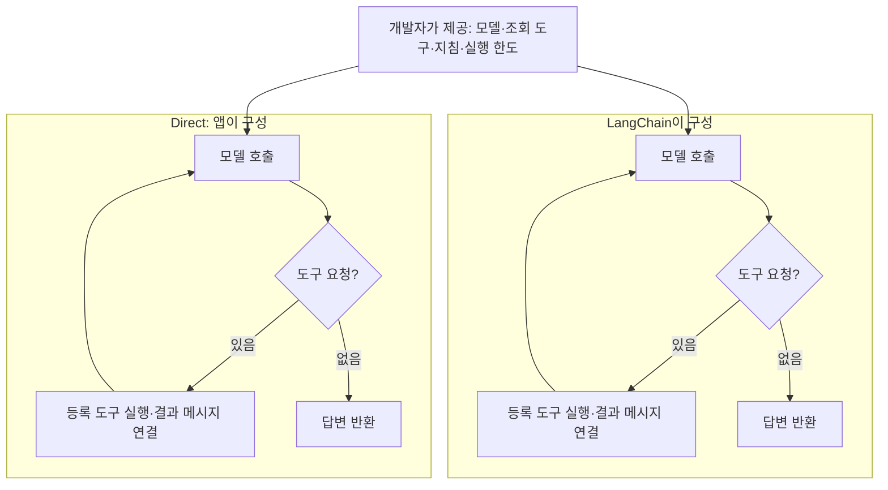
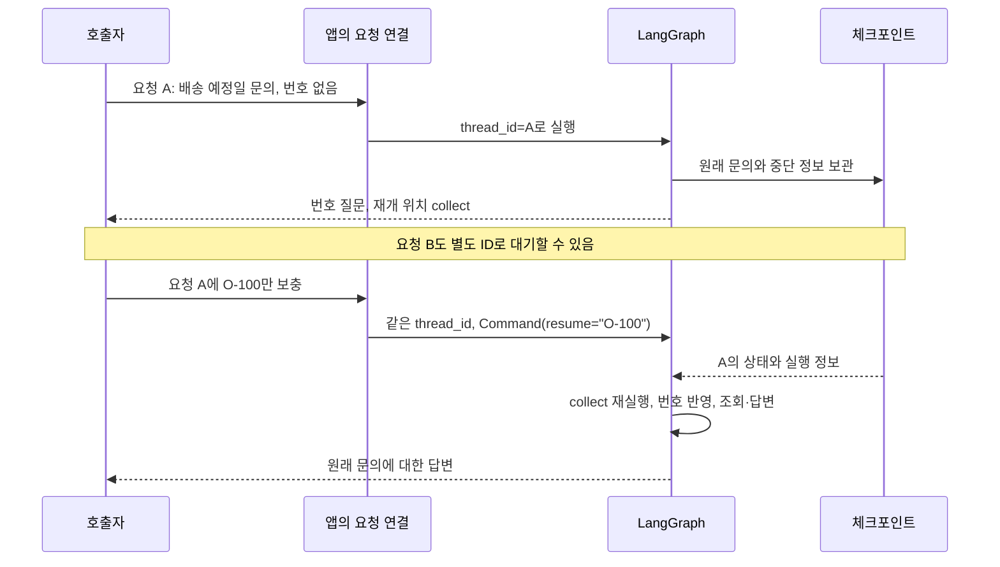

# 7주차 — Direct·LangChain·LangGraph를 왜 사용하는지 비교하기

> 이 README가 이번 주차의 상세 학습 본문입니다. 루트 `CURRENT_WEEK.md`는 여기로 돌아오는 짧은 대시보드입니다.

- 기본 작업 폴더: [`framework_compare`](framework_compare/)
- 전체 과정: [루트 README](../README.md)
- 현재 위치와 다음 명령: [CURRENT_WEEK](../CURRENT_WEEK.md)


이번 주는 **같은 배송 문의를 처리하면서, 요구에 따라 직접 관리할 일과 프레임워크에 맡길 일이 어떻게 달라지는지 배우는 학습**입니다. 정상 답변이 같은 것은 비교의 출발점입니다. 결과를 만드는 코드, 단계 사이에 전달되는 정보, 요구 변경으로 추가되는 책임을 함께 확인합니다.

제공 업무는 주문 번호로 배송 상태를 안내하는 일입니다. 정해진 조회로 시작해 자연어 문의의 도구 실행, 주문 번호를 기다리는 요청의 보관·재개를 비교합니다. 자료는 `O-100: 배송 준비`, `O-200: 배송 중`이며 `O-999`는 없습니다. 업무 함수는 재사용하고, AI와 선택한 구성 하나를 구현·수정합니다. 결과물은 실행 가능한 주문 문의 흐름과 선택 이유를 근거로 설명한 비교입니다.

Python은 실제 LangChain·LangGraph를 사용하는 부분에 씁니다. 개념은 입력·출력, 책임, 상태의 수명과 실행 정책을 중심으로 읽습니다. `framework_lab/`의 Java LangChain4j 예제는 Java에서의 선택을 돕는 보조 자료이며 Python LangChain·LangGraph의 대체 이름이 아닙니다.

## 시작 전에 알아둘 개념

### Direct — 필요한 실행 흐름을 직접 구성하는 방식

Direct는 이 교재에서 **처리 순서와 실행 제어를 애플리케이션 코드로 직접 작성하는 방식**을 부르는 이름입니다. 제품이나 프레임워크 이름이 아닙니다. 번호 확인 → 조회 → 안내처럼 절차가 짧으면 함수와 조건문으로 충분합니다. 코드의 동작을 한곳에서 읽기 쉽고, 프레임워크의 상태·연결 규칙을 추가로 배울 부담이 적습니다.

요구가 늘면 직접 관리하는 부분도 늘어납니다. 모델이 도구 실행을 요청하면 도구 선택·실행·결과 전달·모델 재호출을 연결해야 합니다. 다른 호출에서 번호를 보충받으려면 요청별 보관과 재개 처리가 필요합니다. Direct에서도 구현할 수 있으며, **그 코드와 유지보수 책임을 직접 소유할지**가 선택 기준입니다.

이 비교의 Direct도 모델·도구 어댑터를 사용할 수 있습니다. 예를 들어 Day 2의 두 방식은 같은 LangChain 모델 인터페이스와 조회 도구를 사용하고, 실행 루프를 누가 구성하는지만 바꿉니다. 모든 라이브러리를 제거한 구현과 비교하는 것은 아닙니다.

### LangChain — 모델·도구를 조합하고 제공되는 에이전트 흐름을 사용하는 프레임워크

LangChain은 모델·도구를 공통 인터페이스로 연결하는 구성요소와, 모델이 요청한 도구를 실행하고 결과를 돌려주는 에이전트 구성을 제공합니다. 부품마다 실행 방법을 따로 맞추는 부담과 반복되는 모델–도구 연결 코드를 줄이려는 목적입니다. 공통 인터페이스를 사용해도 모델별 지원 기능·옵션·응답의 의미까지 같아지지는 않습니다. [LangChain 개요](https://docs.langchain.com/oss/python/langchain/overview)

예를 들어 “O-100과 O-200의 배송 상태를 비교해 주세요”라는 문의에서 모델이 두 번의 조회를 요청하면, `create_agent`는 등록된 도구를 실행하고 결과를 해당 요청과 연결해 모델에게 전달합니다. 다음 응답에 도구 요청이 있으면 다시 처리합니다. 개발자는 도구의 업무 기능, 공개할 도구, 지침과 실행 한도를 정합니다. 모델의 잘못된 판단을 프레임워크가 자동으로 업무적으로 올바르게 고쳐 주지는 않습니다.

### Runnable — 구성요소를 같은 방법으로 실행하고 연결하는 계약

Runnable은 `invoke(입력)` 같은 공통 실행 인터페이스를 갖는 구성요소입니다. `RunnableLambda(lookup)`는 일반 함수를 감싸고, `A | B`는 A의 반환값을 B의 입력으로 보냅니다. `RunnableBranch`는 조건에 맞는 경로를 선택합니다. 단계마다 받는 값과 반환하는 값은 개발자가 맞춰야 합니다. [Runnable API](https://reference.langchain.com/python/langchain_core/runnables/)

`comparison.py`의 Runnable 연결은 짧은 고정 조회를 표현합니다. 이런 요구에서는 함수 호출보다 나아졌다고 느끼기 어려울 수 있습니다. 공통 인터페이스로 부품을 조합하는 방법을 여기서 확인하고, Day 2에서는 실제 모델–도구 루프를 비교해 LangChain이 대신 구성하는 일을 확인합니다.

### LangGraph — 업무 상태와 실행 경로를 명시해 제어하는 프레임워크

LangGraph는 **현재 상태를 읽는 처리와 다음 처리로 이동하는 규칙을 정의하고 실행하는 프레임워크**입니다. 상태를 사용하는 처리 단위를 노드, 처리 사이의 연결을 간선이라고 합니다. 정해진 코드 단계와 모델 판단을 섞거나, 반복·대기·재개 경로를 업무에 맞게 구성할 때 실행 제어를 맡길 수 있습니다. [LangGraph 개요](https://docs.langchain.com/oss/python/langgraph/overview)

배송 문의에서는 “번호가 없으면 질문하고, 원래 문의를 보관한 채 번호를 기다렸다가 조회한다”는 요구가 해당됩니다. 개발자가 보관할 정보와 대기·종료 조건을 정하면, 체크포인트를 구성한 그래프는 상태와 실행 위치를 보관하고 재개에 사용합니다. 모든 그래프에 저장 기능이 자동으로 생기는 것은 아닙니다.

### 상태 갱신·체크포인트·중단과 재개

**상태 갱신**은 처리 결과를 현재 상태의 해당 항목에 반영하는 일입니다. LangGraph 노드는 바뀐 항목만 반환할 수 있습니다. 기본 규칙에서 반환한 항목은 새 값으로 바뀌고, 반환하지 않은 항목은 유지됩니다. 목록 누적처럼 다른 동작이 필요하면 항목의 갱신 규칙인 reducer를 정합니다. 업무상 무엇을 보존·무효화할지는 개발자의 판단입니다. [상태 갱신 규칙](https://docs.langchain.com/oss/python/langgraph/graph-api#reducers)

**체크포인트**는 그래프의 상태와 실행 정보를 보관하는 기록입니다. **중단**은 실행 도중 보충 입력을 기다리는 것이며, **재개**는 보관한 요청에 그 입력을 전달해 처리를 잇는 것입니다. `thread_id`는 보관한 요청을 찾는 식별자이고 `interrupt`와 `Command(resume=...)`가 입력을 기다리고 전달하는 접점입니다. 여기서 thread는 운영체제의 실행 스레드라는 뜻이 아닙니다. [중단·재개](https://docs.langchain.com/oss/python/langgraph/interrupts)

예제의 `InMemorySaver`는 같은 객체를 사용하는 프로세스 안에서 상태를 보관합니다. 프로세스 종료 후 복원하려면 지속 저장소와 수명 관리가 필요합니다. 중단된 노드는 재개 시 처음부터 다시 실행되므로, 중복되면 안 되는 외부 작업을 `interrupt` 앞에 둘 때는 별도 설계가 필요합니다.

### 세 방식의 목적과 관계

| 방식 | 사용하는 목적 | 이점이 드러나는 요구 | 개발자가 계속 정할 부분 |
|---|---|---|---|
| Direct | 필요한 절차를 단순하게 직접 연결 | 짧고 정해진 조회와 분기 | 값 전달, 반복, 요청 보관·재개 코드 |
| LangChain | 공통 구성요소와 제공 에이전트 루프 활용 | 모델이 필요한 도구를 요청하고 결과를 받아 다시 처리 | 도구의 의미, 지침, 업무 규칙과 실행 한도 |
| LangGraph | 상태와 실행 경로를 업무에 맞게 명시하고 제어 | 여러 단계의 분기·반복·대기·재개 | 상태 항목·갱신, 경로, 요청 식별과 저장 수명 |

LangChain의 `create_agent`는 LangGraph를 기반으로 실행됩니다. 따라서 LangChain 에이전트도 체크포인트 등 기반 기능을 사용할 수 있고, LangGraph 노드에서 LangChain 구성요소를 사용할 수도 있습니다. **제공되는 에이전트 흐름을 활용할지, 업무의 단계와 전이를 직접 구성할지**가 중요한 차이입니다. LangGraph는 LangChain 없이도 사용할 수 있습니다. [LangChain과 LangGraph의 관계](https://docs.langchain.com/oss/python/langchain/overview)

선택은 복잡도가 높아질수록 무조건 Direct → LangChain → LangGraph로 이동하는 순서가 아닙니다. 정해진 조회는 Direct를 유지하고 자연어 도구 실행만 LangChain으로 구성할 수도 있습니다. 단순한 질문 대기는 앱의 세션으로 충분할 수 있고, 단계별 중단·재개가 많아지면 LangGraph의 역할이 커집니다.

## 실행 준비와 파일 역할

주차 폴더의 `framework_compare/`를 IDE에서 엽니다. [실행 프로젝트 README](framework_compare/README.md)의 가상환경·의존성 설치를 한 번 진행하고, IDE의 Python 인터프리터를 그 환경으로 선택합니다. 각 Day에서 안내하는 파일을 IDE의 실행 기능으로 실행할 수 있습니다. 인자를 반복해 비교하거나 실행 구성을 공유할 때 사용할 터미널 명령도 함께 제공합니다. 명령의 실행 위치는 모두 `framework_compare/`입니다.

| 파일 | 실제 역할과 사용하는 단계 |
|---|---|
| `business.py`, `components.py` | 제공 주문 자료·조회·고정 안내. 모든 비교가 재사용하는 업무 부품 |
| `comparison.py`, `run.py` | Day 1의 Direct·Runnable·그래프 고정 흐름과 실행 진입점 |
| `state_updates.py` | Day 1의 부분 반환과 명시적 병합 비교 |
| `tool_loop.py` | Day 2의 직접 모델–도구 루프와 실제 LangChain 에이전트 |
| `clarification.py` | Day 3의 LangGraph 상태·분기·중단·체크포인트 정의 |
| `waiting_compare.py` | Day 3의 직접 세션 처리와 그래프 실행·조회·재개 비교 |
| `exercise.py` | 설계 구현에 사용할 수 있는 초기 스케치. 상태·함수·진입점은 선택 가능 |
| `model_boundary.py` | Day 4에서 사용하는 실제 모델 접점 |
| `test_comparison.py`, `test_framework_purposes.py` | 제공 예제의 결과·정보 보존·도구 연결·재개를 확인하는 제작용 검사 |

## 실습 순서

| Day | 구체 행동 | 남길 결과와 완료 판단 |
|---:|---|---|
| 1 | 같은 조회와 부분 반환·병합 실행 | 값 전달과 상태 갱신, 직접 보존할 책임을 실제 결과로 설명 |
| 2 | 직접 루프와 LangChain 에이전트로 제공 문의 처리 | 실제 도구 요청·결과 연결과 프레임워크에 맡긴 코드의 관계 |
| 3 | 두 요청의 대기·재개 비교 후 구성 하나를 선택해 구현 | 상태 수명·실행 정책을 선택한 이유와 작동하는 핵심 구조 |
| 4 | 선택한 흐름에 실제 모델 연결 | 조회 사실·모델 판단·생성 문장을 구분한 실제 결과 |
| 5 | 같은 결과물에 번호 정정 적용 | 유지할 문의와 다시 계산할 사실·답변의 차이, 요구별 선택 기준 |

기록은 `framework-note.md` 한 곳에 누적합니다. 코드와 실제 출력도 산출물입니다. 아래 요청문은 먼저 읽고 현재 코드·실행 결과에 맞춰 대화형 도구에서 사용합니다.

### Day 1 — 정해진 조회에서 값 전달과 상태 갱신 비교하기

`run.py`를 실행하고 `comparison.py`의 세 builder를 읽습니다. 같은 번호·조회 함수·고정 생성기를 사용하므로 업무 결과가 같을 것이라는 예상을 실제 결과와 대조합니다. `O-100`의 기대 경로는 `prepare → lookup → draft`, 번호 누락은 `prepare → ask`, `O-999`는 `prepare → lookup → unavailable`입니다. 누락과 부재는 안내를 반환하고 종료하며, 같은 요청을 보관하고 기다리는 동작은 아닙니다.

| 실행 | Windows PowerShell | macOS·Linux·WSL |
|---|---|---|
| 정상 조회 | `.\.venv\Scripts\python.exe -B run.py` | `.venv/bin/python -B run.py` |
| 번호 누락 | `.\.venv\Scripts\python.exe -B run.py --order-id=` | `.venv/bin/python -B run.py --order-id=` |
| 없는 주문 | `.\.venv\Scripts\python.exe -B run.py --order-id O-999` | `.venv/bin/python -B run.py --order-id O-999` |
| 부분 반환·병합 | `.\.venv\Scripts\python.exe -B state_updates.py` | `.venv/bin/python -B state_updates.py` |

#### 짧은 고정 절차에서 Direct를 사용하는 이유

`build_direct`는 입력을 준비하고 번호가 없으면 질문, 조회 결과가 없으면 부재 안내, 있으면 답변 생성을 호출합니다. 이 조건은 이미 업무 요구로 정해져 있습니다. 모델에게 다음 행동을 선택시키거나 요청을 저장할 이유가 없으므로 함수와 조건문만으로 요구가 드러납니다.

`build_langchain`에서는 함수가 Runnable로 감싸지고 분기가 `RunnableBranch`에 놓입니다. `build_langgraph`에서는 같은 처리가 노드로 등록되고 조건 간선이 다음 노드를 고릅니다. 이 짧은 요구에서는 추가 선언과 API 학습의 부담이 생깁니다. 세 방식의 출력이 같다는 사실만으로 프레임워크 도입의 이점이 입증되지는 않습니다.

#### 문의가 사라져도 정상 답변처럼 보이는 이유

`business.lookup`은 `{**state, ...}`로 기존 입력을 포함한 전체 묶음을 반환합니다. `state_updates.partial_lookup`은 여기서 `order`, `status`, `path`만 반환하도록 반환 계약을 바꿉니다. `state_updates.py`는 같은 입력을 넣고 **생성 함수가 받은 문의와 최종 결과의 문의**를 함께 출력합니다.

아래는 제공 입력 `issue="배송 예정일 문의"`의 기대 결과입니다. 자신의 실행 결과와 대조합니다.

| 조회의 반환 계약 | Direct의 생성 입력 | LangChain의 생성 입력 | LangGraph의 생성 입력 |
|---|---|---|---|
| 조회 결과·상태·경로만 반환 | 문의 없음 | 문의 없음 | 원래 문의 유지 |
| 기존 입력과 이번 갱신을 명시적으로 병합 | 원래 문의 유지 | 원래 문의 유지 | 원래 문의 유지 |

Direct의 `state = lookup_step(state)`와 Runnable 연결은 **앞 함수의 반환값 자체**를 다음 입력으로 사용합니다. LangGraph는 노드가 반환한 항목을 그래프 상태에 반영하므로 반환하지 않은 `issue`를 유지합니다. Direct와 Runnable에서도 다음과 같이 보존할 입력을 합치면 해결됩니다.

```python
def merge_lookup(state):
    return {**state, **partial_lookup(state)}
```

부분 반환은 기존 두 구현이 기대하던 계약을 바꾼 실험입니다. Direct·LangChain이 원래 정보를 보존할 수 없다는 뜻이 아닙니다. **정보를 남기는 책임이 전달 코드에 있는지, 상태 갱신 규칙에 있는지**가 다릅니다. 병합 한 번으로 해결되는 이 요구만으로 LangGraph의 도입을 결정할 이유도 충분하지 않습니다.

고정 생성 함수 `fixed_answer`는 조회 사실만 사용하고 `issue`를 읽지 않습니다. 따라서 문의가 사라져도 `ANSWERED`와 정상처럼 보이는 문장이 나옵니다. `state_updates.py`가 별도로 `issue_at_draft`를 출력하는 이유입니다. 실제 모델 경계는 문의도 사용하므로 전달 누락이 이후 단계의 오류로 이어질 수 있습니다. 또한 `State`의 Python 타입 표기는 입력 검사를 대신하지 않으며, `prepare`의 검사가 실제 실행 조건을 확인합니다.

```text
Day 1의 실제 결과와 comparison.py, state_updates.py를 함께 읽어 주세요.
반환값이 다음 입력이 되는 곳과 반환 항목이 보관된 상태에 반영되는 곳을 코드로 짚으세요.
문의가 사라져도 고정 답변이 나온 이유와 명시적 병합으로 해결되는 범위를 설명해 주세요.
짧은 조회를 Direct로 유지할 이유와 다른 선택이 필요해지는 조건을 실제 코드에 연결해 주세요.
내가 결과와 대조해 판단한 내용을 framework-note.md에 이어 적도록 도와주세요.
```

**완료 확인:** 정상·누락·부재 경로와 부분 반환·병합의 실제 결과를 확인하고, 문의를 보존하는 책임이 어디에 놓였는지 설명합니다.

### Day 2 — 모델의 도구 요청을 누가 실행하고 이어 주는가

요구를 **“자연어 문의에 있는 주문을 필요한 만큼 조회하고 결과로 답한다”**로 바꿉니다. 정해진 번호 하나를 받아 조회하는 함수와 달리, 실행 중 모델이 어떤 번호를 조회할지 요청하고 그 결과를 받아 다시 응답합니다. 앞 주차에서 다룬 도구 호출 원리를 이번에는 직접 실행 코드와 프레임워크 코드에 대응시킵니다.

`tool_loop.py`를 실행합니다. 한 주문, 두 주문, 번호 누락, 없는 주문의 작은 제공 사례를 Direct와 LangChain으로 처리합니다.

| Windows PowerShell | macOS·Linux·WSL |
|---|---|
| `.\.venv\Scripts\python.exe -B tool_loop.py` | `.venv/bin/python -B tool_loop.py` |

이 실행의 `SCRIPTED_MODEL`은 입력에 있는 제공 번호를 읽어 정해진 도구 요청을 만드는 모의 모델입니다. **실제 LangChain 에이전트와 조회 함수는 실행하지만, 자연어 이해나 모델의 도구 선택 능력은 검증하지 않습니다.** 모의 모델을 제공하는 이유는 모델 판단의 변동과 실행 루프의 책임을 분리해 읽기 위해서입니다. 실제 모델은 Day 4에서 연결합니다.

#### 같은 모델과 도구인데 직접 작성할 코드가 달라집니다

`build_direct_agent`의 다음 부분은 모델 응답을 메시지 목록에 넣고, 도구 요청이 없으면 끝내는 직접 루프입니다. 그 뒤의 `registry` 조회와 `tool.invoke(call)`은 도구를 실행하고 `ToolMessage`를 목록에 넣습니다. 반복문의 다음 회차가 그 결과를 포함해 모델을 다시 호출합니다.

```python
response = bound.invoke(messages)
messages.append(response)
if not response.tool_calls:
    return {"messages": messages[1:]}
```

`build_langchain_agent`는 같은 모델·도구·지침을 `create_agent`에 전달합니다. 에이전트 런타임이 모델 호출, 등록 도구 실행, 요청과 결과 메시지의 연결, 다음 모델 호출을 구성합니다. `ModelCallLimitMiddleware`는 제공 호출 한도를 적용하는 구성요소입니다.

```python
agent = create_agent(model=model, tools=available, system_prompt=POLICY,
                     middleware=[ModelCallLimitMiddleware(run_limit=max_model_calls,
                                                          exit_behavior="error")])
```

두 방식 모두 같은 모델 어댑터와 `StructuredTool`을 사용합니다. 도구 입력 형태를 공개하고 결과 메시지를 만드는 공통 부품의 효과를 Direct에서 일부러 제거하지 않습니다. 비교할 부분은 **그 부품을 반복 실행하고 결과를 다음 모델 호출에 연결하는 코드의 소유자**입니다. LangChain에서도 호출 한도·공개 도구·지침은 개발자가 지정하며, 예제에서는 한 요청당 모델 호출을 최대 네 번으로 정합니다. 이는 프레임워크가 요구하는 고정 횟수가 아닙니다. [에이전트 구성](https://docs.langchain.com/oss/python/langchain/agents), [호출 한도](https://docs.langchain.com/oss/python/langchain/middleware/built-in#model-call-limit)



그림의 실행 경로는 비슷합니다. 사각형 안의 반복과 연결을 직접 작성하는지, 프레임워크가 구성하는지가 차이입니다. 이 LangChain 에이전트의 기반 런타임은 LangGraph입니다.

#### 실행 결과에서 위임한 책임을 확인합니다

두 주문 사례에서는 `events`에 `lookup_order(O-100)`과 `lookup_order(O-200)` 요청이 나타납니다. 각 요청의 `id`가 뒤의 `tool_result_for`와 연결되고, 두 배송 사실을 받은 뒤 마지막 모델 응답이 나와야 합니다. 번호 누락은 모의 모델이 도구 요청 없이 질문하므로 조회가 실행되지 않습니다. `O-999`는 조회를 실행했으나 결과가 `null`인 경우입니다. 호출하지 않은 것과 조회했지만 못 찾은 것을 구분합니다.

제공된 두 방식은 미등록 도구나 도구 입력 형식 오류를 오류 메시지로 모델에 돌려주고, 그 밖의 실행 오류는 전파합니다. 프레임워크가 반환한 오류 메시지가 업무상 어떤 다음 행동을 뜻할지는 앱의 정책입니다. 오류 응답 문구나 내부 이벤트 개수의 동일성을 도입 이점으로 비교하지 않습니다.

같은 인터페이스를 유지하는 조회 도구를 추가하면 LangChain에서는 도구 목록과 업무 지침을 바꾸어 기본 루프를 재사용할 수 있습니다. Direct도 `registry`처럼 일반화한 루프를 재사용할 수 있습니다. 차이는 매번 전체 루프를 새로 쓰느냐가 아니라, 그 공통 루프와 오류·호출 정책을 누가 제공하고 유지하느냐입니다. 반대로 모든 조회 대상과 순서가 이미 정해져 있으면, Day 1처럼 코드가 직접 조회하는 편이 더 단순할 수 있습니다.

```text
Day 2의 tool_loop.py와 실제 events를 함께 읽어 주세요.
같은 모델·도구를 사용한 두 방식에서 요청 ID와 결과 메시지가 연결된 부분을 보여 주세요.
직접 루프에서 관리하는 일과 create_agent가 구성하는 일을 실제 코드에 대응해 설명하세요.
모의 모델로 확인한 실행 책임과 실제 모델을 연결해야 확인할 판단을 구분해 주세요.
현재 업무에서 LangChain을 사용할 이유 또는 Direct를 유지할 이유를 내가 검토하도록 도와주세요.
```

**완료 확인:** 한 주문·두 주문·누락·부재의 실제 도구 실행을 확인하고, 직접 루프의 어느 책임을 LangChain에 맡겼는지 코드와 결과로 설명합니다.

### Day 3 — 문의를 보관하고 재개하는 구조 선택·구현하기

다음 요구는 **“번호가 없는 배송 문의를 보관하고, 나중에 같은 요청에 번호만 받으면 이어 처리한다”**입니다. 동시에 다른 문의도 기다릴 수 있어야 합니다. 질문 문장만 반환하고 종료하면 다음 입력이 어느 문의의 보충인지 알 수 없으므로, 요청 식별과 보관할 정보·대기 위치가 필요합니다.

`waiting_compare.py`를 실행합니다. 두 방식 모두 A와 B를 대기시키고, B에 `O-200`, A에 `O-100`을 역순으로 보충합니다. 제공 스크립트가 보충 입력을 보내는 시연이며 실제 사용자에게 응답을 받았다는 뜻은 아닙니다.

| Windows PowerShell | macOS·Linux·WSL |
|---|---|
| `.\.venv\Scripts\python.exe -B waiting_compare.py` | `.venv/bin/python -B waiting_compare.py` |

#### Direct에서는 앱이, LangGraph에서는 체크포인트가 보관합니다

`DirectWaitingFlow.start`는 `sessions[request_id]`에 문의와 `next=["collect"]`를 저장합니다. `resume`은 해당 요청을 찾아 번호와 시도 횟수를 반영하고, 조회·답변·종료를 직접 진행합니다. 요청별 사전과 다음 단계 표식은 이 앱의 설계입니다. 단순한 대기 한 단계라면 이 구조로 충분할 수 있습니다.

`GraphWaitingFlow`는 외부 호출을 `thread_id`, 그래프 실행, `Command(resume=...)`에 연결하는 어댑터입니다. 업무 흐름은 `clarification.build_waiting_flow`에 있습니다. `collect`는 번호가 없으면 `interrupt`로 중단하고, 재개 값이 유효하면 **번호·시도 횟수·상태를 갱신하고 이전 안내를 지웁니다.** 문의를 다시 반환하지 않아도 그래프 상태에 남습니다.

```python
supplied = interrupt({"question": "주문 번호를 알려 주세요.", "issue": state["issue"]})
attempts = state.get("attempts", 0) + 1
if isinstance(supplied, str) and supplied.strip():
    return {"order_id": supplied.strip(), "attempts": attempts, "status": "READY", "answer": ""}
```

`route`는 `READY`이면 답변 단계, `WAITING`이면 다시 입력 대기, 그 밖에는 종료를 선택합니다. 번호가 들어오면 이전 질문 안내를 지우고 답변 단계로 이동합니다. 이후 생성 함수가 실패하면 두 구현 모두 예외를 전파하고 `READY / next=["answer"]`로 남습니다. 이미 번호를 받았으므로 다시 번호를 기다리는 상태로 표시하지 않습니다. `resume`은 보충 입력의 접점이며 생성 오류 재시도는 별도의 실행 정책입니다.

`graph.compile(checkpointer=InMemorySaver())`가 상태·실행 정보를 보관하는 구성을 연결합니다. `GraphWaitingFlow.snapshot`은 그 실제 기록에서 `next`를 읽습니다. 출력의 모양을 맞추는 어댑터와 상태·실행 위치를 보관하는 런타임의 역할을 구분합니다.



두 방식의 기대 결과는 A의 문의에 `O-100: 배송 준비`, B의 문의에 `O-200: 배송 중`이 연결되는 것입니다. `waiting` 출력의 `issue`, `question`, `next`를 먼저 보고 `resumed`의 문의·번호·답변과 대조합니다. 완료 후 `next=[]`는 이 실행에서 다음 처리 위치가 없다는 뜻입니다.

두 예제는 메모리 안에서 동작합니다. LangGraph 예제만 프로세스 재시작을 견딘다고 비교하면 안 됩니다. LangGraph의 이점은 상태와 실행 위치를 보관·복원하는 공통 기능을 사용한다는 점입니다. 여러 단계에서 멈추고 재개해야 할 때 직접 작성하던 관리 코드가 늘어나는 반면, 그래프에서는 노드와 전이·저장 구성을 이어 사용할 수 있습니다. 저장소 선택, 요청 ID 전달, 종료한 요청의 수명과 정리는 앱의 책임입니다.

#### 결과와 상태의 수명을 요구에서 도출합니다

| 업무 요구 | 필요한 정보·결정 | 제공 구현의 선택 |
|---|---|---|
| 번호만 보충받아 원래 문의 처리 | 요청 식별, 원래 문의 보관 | 요청별 ID와 문의 저장 |
| 다음에 어떤 입력이 필요한지 안내 | 질문과 대기·완료의 구분 | 질문 내용과 다음 위치를 조회 가능하게 제공 |
| 빈 보충이 반복되어도 무한 대기하지 않음 | 재질문·종료 정책 | 첫 빈 보충은 다시 대기, 두 번째는 `UNRESOLVED` |
| 없는 주문을 사실처럼 안내하지 않음 | 조회 부재와 생성 경계 | `NOT_FOUND`, 생성 함수 호출 없이 종료 |

두 번이라는 횟수, `status`의 이름, 클래스와 메서드 이름은 참고 구현의 선택입니다. 반면 체크포인트를 쓰는 LangGraph에서 같은 `thread_id`로 재개 입력을 전달하고 노드의 재실행을 고려하는 것은 실제 실행 계약입니다. `interrupt` 앞에서 시도 횟수를 올리지 않은 이유도 재개 시 노드가 다시 시작하기 때문입니다.

이제 제공 요구를 사용할 **구성 하나**를 AI와 선택해 구현합니다. 현재 만든 흐름이 있으면 그 코드를 확장합니다. `exercise.py`는 초기 스케치로 사용할 수 있으며 클래스·상태 필드·진입점은 선택할 수 있습니다. `components.py`의 조회·생성 부품과 프레임워크를 재사용합니다. 직접 세션, LangGraph, LangChain 에이전트에 앱의 보관·재개를 연결하는 구성을 후보로 검토하되, 현재 요구에 불필요한 모델 판단이나 저장 기능을 억지로 추가하지 않습니다.

선택할 지점은 **호출자에게 공개할 시작·보충 입력과 결과, 문의를 보관할 곳, 대기·종료 조건**입니다. 질문을 출력한 뒤 호출자가 무엇을 보내야 하는지, 조회 오류가 나면 어떤 상태가 남는지까지 실제 입출력에 연결합니다. AI의 추천과 예상에 짧게 수용·수정 의견을 낸 뒤 구현·실행합니다. 완성된 builder를 호출한 사실만으로 설계 선택과 구현을 확인했다고 판단하지 않습니다.

```text
Day 3의 제공 배송 문의를 처리하는 구성 하나를 현재 작업에 구현하려고 합니다.
현재 코드와 두 대기·재개 예제를 근거로 입력·결과, 보관 책임, 대기·종료 정책을 추천해 주세요.
프레임워크의 필수 계약과 예제의 선택을 구분하고, 다른 구성이 유리한 조건도 설명하세요.
내가 짧게 수용·수정 의견을 낸 뒤 제공 업무 부품을 재사용해 구현하고 실제로 실행해 주세요.
두 요청을 대기시킨 뒤 역순으로 번호만 보충하고, 빈 보충·없는 주문의 선택한 정책도 확인하세요.
내가 선택한 구조를 사용해 실행할 수 있게 하며, 특정 클래스·노드 이름을 정답으로 강제하지 마세요.
예상과 실제 결과의 이유를 설명하고 내가 확인한 판단을 framework-note.md에 연결해 주세요.
```

**완료 확인:** 두 제공 구현의 대기·재개를 실제로 비교하고, 선택한 구성의 입출력·상태 수명·실행 정책을 코드에 반영해 사용합니다. 원래 문의 보존과 요청별 재개, 선택한 실패 처리를 실제 결과로 확인합니다.

### Day 4 — 선택한 흐름에서 실제 모델의 역할 확인하기

실제 모델을 연결할 위치를 Day 3의 구성에 맞춰 정합니다. 조회 절차가 정해져 있으면 조회 뒤 안내 생성에만 모델을 둘 수 있습니다. 자연어에 따라 도구를 선택하도록 구성했다면 같은 모델–도구 루프의 모델을 교체합니다. 모델의 역할이 다르므로 두 결과를 같은 능력의 검사로 해석하지 않습니다.

`model_boundary.live_model()`은 실제 모델 객체를 만들고 `live_generator()`는 문의·조회 사실을 안내 생성 입력에 맞춥니다. `components.live_reply()`는 이를 선택한 답변 함수 계약으로 연결하는 예입니다. API 키·모델 이름·실제 호출 허용 값은 IDE 실행 환경의 `OPENAI_API_KEY`, `OPENAI_MODEL`, `AI_AX_LIVE=1`로 설정합니다. 값은 Git으로 공유하지 않는 로컬 환경에 둡니다. 실제 호출은 과금되므로 사용할 방식과 입력을 지정합니다.

다음 명령은 제공 비교 코드에서 모델 접점을 확인하는 실행 예입니다. 자기 구현에서는 선택한 진입점·입력 계약에 같은 접점을 연결하고 그 구성으로 실행합니다.

| 확인할 모델 역할 | Windows PowerShell | macOS·Linux·WSL |
|---|---|---|
| 자연어 문의의 도구 선택·응답 | `.\.venv\Scripts\python.exe -B tool_loop.py --method langchain --issue "O-100과 O-200 배송 상태를 비교해 주세요." --live` | `.venv/bin/python -B tool_loop.py --method langchain --issue "O-100과 O-200 배송 상태를 비교해 주세요." --live` |
| 대기·재개 뒤 조회 사실로 안내 생성 | `.\.venv\Scripts\python.exe -B waiting_compare.py --method langgraph --live` | `.venv/bin/python -B waiting_compare.py --method langgraph --live` |

Direct로 구성한 경우 해당 명령의 method를 `direct`로 바꿀 수 있습니다. 실행한 모델의 도구 요청·조회 사실과 최종 문장을 대조합니다. 두 주문의 사실을 제대로 구별하는지, 문의에 포함된 주장을 조회 사실로 확정하지 않는지 확인합니다. 자연어 흐름에서는 누락·없는 주문 중 하나도 실제로 실행해 모의 모델에서 예상한 처리와 대조합니다. 정해진 흐름에서는 누락·부재에서 생성 함수가 호출되지 않는 경계도 확인합니다.

예를 들어 조회 결과가 `배송 준비`인데 답변이 도착 날짜를 확정했다면, 그 날짜는 제공 자료에서 온 사실이 아닙니다. 모델 지침만 바꿀지, 생성 입력에서 사실과 주장을 더 분명히 나눌지 현재 코드로 판단합니다. LangChain과 LangGraph는 그 실행을 구성하지만 배송 사실의 참·거짓을 자동으로 보증하지 않습니다.

```text
Day 3에서 선택한 실제 구성에 모델을 연결해 주세요.
모델이 마지막 안내만 생성하는지, 도구 요청과 후속 응답도 결정하는지 현재 코드에서 설명하세요.
제공 입력으로 실제 실행하고, 도구·조회 결과·생성 문장을 대조해 확인된 사실과 추측을 구분하세요.
필요한 수정은 같은 결과물에 반영하고 재확인해 주세요.
실행하지 못한 연결이 있으면 그 이유와 오프라인으로 확인한 범위를 구분해 주세요.
```

**완료 확인:** 선택한 구성에서 실제 모델 접점을 실행하고 사실과 응답의 관계를 설명합니다. 연결을 실행하지 못했다면 그 확인은 남아 있으며, 모의 모델의 성공을 실제 모델 연결 완료로 바꾸지 않습니다.

### Day 5 — 번호 정정으로 상태 의존성과 선택 기준 확인하기

같은 배송 문의에서 번호가 `O-100`에서 `O-200`으로 정정됐다는 후속 요구를 현재 결과물에 적용합니다. **문의는 유지하고 새 번호로 다시 조회해 답하며, 옛 주문의 조회 사실과 답변을 재사용하지 않아야 합니다.** 별도 프로젝트를 만들지 않고 현재 선택한 입력·상태·실행 경로를 수정합니다.

`order_id → 조회 사실 → 답변`의 의존성 때문에 번호가 바뀌면 뒤의 파생값도 다시 계산해야 합니다. LangGraph의 “반환하지 않은 항목은 유지” 규칙은 이때 주의할 지점입니다. 새 번호만 갱신해도 옛 `order`와 `answer`가 자동으로 무효화되지는 않습니다. Direct의 세션이나 LangChain 에이전트의 메시지에도 같은 의미의 오래된 정보가 남을 수 있습니다.

| 현재 구성 | 정정 요구에서 결정할 일 |
|---|---|
| 고정 조회 | 원래 문의와 새 번호로 다시 계산하고 결과 교체 |
| 모델–도구 루프 | 현재 조회 대상을 분명히 전달하고 새 도구 결과에 근거해 답하는지 확인 |
| 요청 보관·재개 | 완료 요청을 새 처리로 연결할지 상태를 갱신해 재조회할지, 무엇을 무효화할지 선택 |

`run.py`의 고정 흐름은 `prepare`가 조회·답변을 초기화하고 다시 계산합니다. 대기 예제의 `resume`은 보충을 기다리는 요청에 쓰는 접점이므로, 완료한 요청에 `Command(resume=...)`를 다시 보낸다고 번호 정정이 구현되지는 않습니다. 정정 입력을 받는 접점과 재조회 경로를 선택해야 합니다. 요청의 연속성을 보존하면서 새 실행을 시작하는 방법도, 기존 상태에 명시적 갱신·전이를 두는 방법도 가능합니다.

AI가 현재 코드에서 추천하는 변경 위치와 예상 결과를 보여 주면, 수용·수정 의견을 낸 뒤 구현합니다. 원래 문의로 `O-100`을 처리한 결과, `O-200`으로 정정한 결과, `O-999`로 바꿔 조회에 실패한 결과를 대조합니다. 문의는 유지되지만 최종 사실·답변에는 각각 배송 준비, 배송 중, 주문 부재가 반영되어야 합니다. 과거 결과는 기록으로 남길 수 있으나 현재 사실로 사용하면 안 됩니다.

```text
현재 배송 문의 흐름에 주문 번호 정정 요구를 적용하려고 합니다.
원래 문의는 유지하고 새 번호로 재조회하며 옛 조회 사실·답변을 현재 결과로 사용하면 안 됩니다.
현재 코드의 입력·상태·실행 정책을 근거로 수정할 위치와 예상 결과를 먼저 추천해 주세요.
내가 수용·수정 의견을 낸 뒤 같은 결과물을 변경하고 O-100 → O-200 → O-999로 확인하세요.
정보 보존과 파생값 무효화의 이유, 프레임워크가 맡은 일과 여전히 직접 정한 일을 설명하세요.
실제로 확인한 결과와 선택 이유를 framework-note.md에 이어 정리하도록 도와주세요.
```

**완료 확인:** 현재 구현에 정정 처리가 반영되고, 실제 결과에서 문의 보존과 새 조회·답변의 연결을 확인합니다. 세 방식의 선택은 코드 줄 수나 출력 품질 순위로 매기지 않고, 직접 관리할 책임과 프레임워크의 기능·제약으로 설명합니다.

## 완료 기준

정해진 조회에 Direct를 유지할 이유, 모델–도구 실행에서 LangChain에 맡기는 일, 보관·재개에서 LangGraph에 맡기는 일을 각각 실제 코드와 결과에 연결합니다. LangChain과 LangGraph를 함께 사용할 수 있다는 관계, 상태가 보존돼도 업무상 오래된 사실을 자동으로 무효화하지는 않는다는 한계까지 설명합니다.

선택한 주문 문의 구현, 실제 모델 연결 결과 또는 남은 연결 확인, 번호 정정의 결과와 선택 이유가 이번 주 산출물입니다. AI가 작성한 설명과 파일의 존재만으로 학습자의 선택·실행·이해가 확인된 것으로 기록하지 않습니다.
