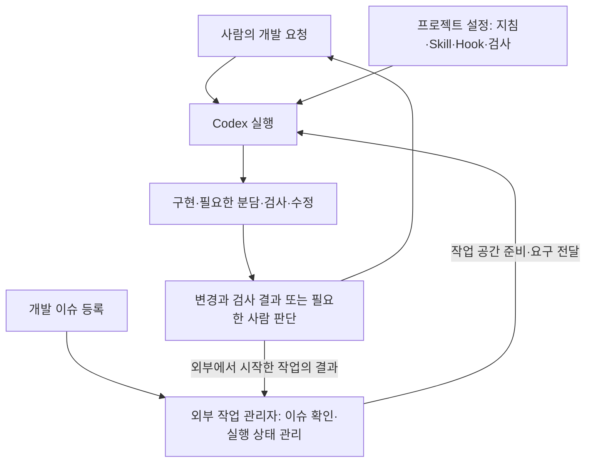

# 11주차 — 프로젝트 개발 하네스 구성과 활용

> 이 README가 이번 주차의 상세 학습 본문입니다. 루트 `CURRENT_WEEK.md`는 여기로 돌아오는 짧은 대시보드입니다.

- 기본 작업 폴더: [`development_harness`](development_harness/)
- 전체 과정: [루트 README](../README.md)
- 현재 위치와 다음 명령: [CURRENT_WEEK](../CURRENT_WEEK.md)


## 이번 주의 문제 — 변경 요청을 받아 개발을 이어 갈 환경 만들기

운영팀이 문의 목록을 CSV로 내려받습니다. 처음에는 단순한 제목만 처리했지만, 쉼표와 큰따옴표·줄바꿈 보존, 팀 선택, 날짜가 있는 파일 이름, 중복 처리가 필요해졌습니다. AI와 작업할 때는 현재 코드와 요구를 확인하고, 필요한 조건을 정하고, 구현한 결과를 검사해야 합니다. 작업을 나누거나 세션을 바꾸면 진행 정보도 이어져야 합니다.

개발 하네스는 **개발 AI가 작업에 필요한 정보를 받고, 도구로 변경을 수행하고, 결과를 확인하며 작업을 이어 가도록 구성한 실행 환경**입니다. 모델과 도구를 실행하는 코딩 도구 위에 작업 지침·프로젝트 문맥·Skill·검사·Hook·작업 상태를 연결할 수 있습니다. 이번에는 각 구성의 역할을 배우고, 같은 앱의 변경 요구를 처리하면서 AI와 직접 구축합니다. 마지막에는 메인 에이전트가 분담·인계·통합까지 관리하도록 연결해, 정한 품질 기준에 따라 중간 진행 지시 없이 개발을 이어가는지 확인합니다.

### 전체 구성에서 이번 주에 만드는 부분

아래 그림에서 Codex는 모델과 도구를 실행합니다. 프로젝트 설정은 그 작업에 필요한 정보·절차·검사를 연결합니다. 외부 작업 관리자는 작업을 접수하고 Codex 실행의 시작과 종료를 관리합니다. 하네스라는 말을 사용할 때는 어느 구성의 역할을 설명하는지 함께 살펴봅니다.



| 학습 구간 | 직접 구성하는 부분 | 작업을 시작하는 방법 |
|---|---|---|
| 5주차·10주차 | Codex 호출 뒤 독립 검사·재실행을 결정하는 Java 엔진과 개선 | 사람이 요청을 작성하고 엔진 실행 |
| 11주차 | 지침·Skill·Hook·검사·작업 인계를 연결한 프로젝트 개발 환경 | 사람이 Codex에 요청 |
| 12주차 | IT 문의 앱에 위 설정을 적용하고, 후속 개발 이슈를 처리하는 외부 실행 관리자 연결 | 사람이 실행 대상으로 지정한 이슈를 실행 관리자가 감지 |

5주차와 이번 주 모두 처음 요청은 사람이 시작합니다. 차이는 요청 이후의 실행 제어입니다. 5주차는 Java 엔진이 Codex의 결과를 받은 뒤 검사하고 재실행합니다. 이번 주는 진행 중인 Codex에 프로젝트 설정을 적용하고, Stop Hook으로 검사 실패를 수정에 연결합니다. 같은 프로젝트 설정을 준비하면 외부에서 시작한 Codex도 사용할 수 있습니다.

### 검사 실패와 실행 중단을 구분하기

CSV 줄바꿈 검사가 실패했다면 실패 입력과 기대값을 받은 Codex가 코드를 수정할 수 있습니다. Stop Hook이 종료 시 검사를 실행하고 피드백을 반환하면 이 흐름을 연결할 수 있습니다. [공식 Hook 안내](https://learn.chatgpt.com/docs/hooks)

반면 Codex 프로세스가 도중에 비정상 종료하면 정상적인 Stop 사건까지 도달하지 못할 수 있습니다. 바깥에서 실행 종료를 관찰하고 어떤 작업이 중단됐는지 기록할 주체가 필요합니다. 아직 시작되지 않은 이슈의 발견과 중복 실행 방지도 외부 작업 관리자의 역할입니다. OpenAI의 Symphony는 여러 개발 세션을 사람이 직접 시작하고 다시 진행시키던 문제를 이슈 기반 실행 관리로 풀었습니다. [공개 운영 사례](https://openai.com/index/open-source-codex-orchestration-symphony/)

| 발생한 상황 | 맡길 처리 |
|---|---|
| 코드 변경 뒤 업무 검사 실패 | Codex와 Hook이 실패 근거를 사용해 수정·재검사 |
| 새 개발 이슈가 실행 조건을 충족 | 외부 관리자가 작업을 접수하고 Codex 시작 |
| 같은 이슈를 다시 발견 | 외부 관리자가 기존 실행 상태를 확인 |
| Codex 프로세스 비정상 종료·시간 초과 | 외부 관리자가 중단을 기록하고 정한 정책으로 처리 |

검사와 재시도만 필요한 작업에는 Hook을 활용할 수 있습니다. 외부 관리자를 추가할 때는 작업 접수·실행 상태처럼 새로 필요한 책임을 맡깁니다. 두 곳에서 같은 실패를 각각 재시도하면 시도가 늘어나므로, 코드 수정의 반복과 프로세스 재시작의 담당·한도를 따로 정합니다. 이번 주에는 프로젝트 안의 개발 흐름을 연결하고, 12주차에는 그 흐름을 외부에서 시작해 봅니다.

```text
개발 요청 + 현재 코드
  → 관련 지침·문서 확인 → 필요한 조건과 변경 위치 판단
  → Skill의 절차와 개발 도구로 구현·검사
       ├─ 종료 Hook: 검사 → 실패 근거 → 수정·재검사 또는 중단
       └─ 작업 분리: 담당 범위 → 인계·재개 → 통합 검사
  → 메인 에이전트가 결과를 확인하고 다음 담당·통합·수정 실행
  → 실제 결과 확인 → 현재 구조와 남은 작업 갱신
```

### 이번 주에 적용하는 개념

| Day | 구성 | 실제로 확인할 역할 |
|---|---|---|
| 1 | 지침, 프로젝트 문맥, 개발 도구, 작업 범위 | 짧은 요청에서 필요한 코드·정보를 찾아 변경하고 검사 |
| 2 | Skill, 적용 조건, 재사용할 판단 절차 | 자연어 후속 요청에서 변경 위치와 검사 입력 선택 |
| 3 | 검사 실행, Hook, 피드백, 재시도·중단 | 실패 근거가 수정과 새 검사로 이어짐 |
| 4 | 작업 분리, Worktree·서브에이전트, 인계·재개 | 필요한 환경과 정보가 전달되고 변경이 통합됨 |
| 5 | 지침·Skill·Hook·검사의 연결, 오케스트레이션 | 저장한 기준에 따라 후속 요구를 중간 진행 지시 없이 구현·통합·검사 |

개발 MCP는 외부 정보·서비스가 필요한 상황의 연결 방법으로 살펴봅니다. 이 프로젝트의 코드·설명은 파일 도구로 읽고, 빌드와 검사는 IDE 또는 실행 도구로 수행합니다.

## 제공 자료와 준비

`week11-development-environment/development_harness`를 IDE의 Gradle 프로젝트로 엽니다. Java 17 이상으로 동기화하고 Gradle 창에서 `test`를 실행합니다. 기본 앱은 OPEN 문의를 선택해 CSV로 만들며, 초기 검사는 단순한 제목의 내보내기를 확인합니다. 각 Day의 업무 요청에서 필요한 조건을 정하고 그 조건을 확인할 검사를 추가합니다.

| 위치 | 역할 |
|---|---|
| `src/main/java/lab/export/` | 변경할 문의 내보내기 앱 |
| `src/test/java/lab/export/` | 업무 입력과 실제 결과를 대조하는 검사 |
| `ExportExample.java` | 파일 이름과 CSV를 IDE 콘솔에 출력하는 진입점 |
| `docs/project.md` | 현재 기능·코드 경로·검사 위치 |
| `build.gradle` | 앱 실행과 검사 작업. `acceptance`는 업무 검사, `test`는 전체 검사 |

지침·Skill·검사 연결·Hook·재개 방법은 각 Day에서 만듭니다. Java의 파일·프로세스 기능과 코딩 도구의 실행 기능을 활용하고, 필요한 라이브러리는 구현할 때 추가합니다. 모델 실행과 파일 편집은 코딩 도구가 맡고, 프로젝트에서 필요한 정보와 실행 정책을 직접 구성합니다.

설계에서는 AI의 추천·이유·예상 동작을 읽고 수용하거나 바꿀 부분을 짧게 말합니다. 이어서 구현·실행하고 실제 결과를 읽습니다. 주차 노트 한 곳에 선택 이유와 대표 입력·결과를 연결합니다. 구성 파일의 이름과 내부 클래스 배치는 선택한 구조에 맞춥니다.

## Day 1 — 작업 맥락과 실행 환경 구성하기

### 개념 — 지침·문맥·도구·검사의 역할

작업 지침은 반복해서 사용할 개발 원칙입니다. “공개 입력이나 결과가 달라지면 호출부와 검사도 확인한다”가 예입니다. 문맥은 현재 작업을 이해할 정보입니다. “CSV 열 순서는 id, team, status, title이다”는 이 앱의 문맥입니다. 도구는 코드 읽기·수정·실행을 수행하고, 검사는 요구한 동작을 구체적인 입력과 결과로 확인합니다.

상시 원칙은 지침에, 현재 구조와 실행 위치는 프로젝트 설명에, 확인할 입력과 결과는 검사에 담습니다. 확정한 업무 조건은 관련 설명에 남기면 다음 요청에서도 확인할 수 있습니다. 요구가 구체적이면 바로 변경을 제안하고, 결과가 달라지는 미정 조건이 있으면 그 조건을 확인합니다.

### 업무 요청에서 지침과 맥락 도출하기

> 제목에 쉼표가 들어가도 원래 제목이 한 셀로 보존되도록 수정해 주세요.

`TicketExport.csv`는 `TicketFilter`가 선택한 OPEN 문의의 필드를 `CsvCell`로 표현한 뒤 연결합니다. 제목 `VPN, 접속`을 그대로 연결하면 제목 안의 쉼표가 열 구분과 섞입니다. CSV에서는 셀을 `"VPN, 접속"`으로 감싸 이 쉼표를 값의 일부로 표현합니다. 이 입력은 셀 표현을 바꿀 이유를 보여 줍니다. 기존 단순 제목, OPEN 선택, 열 순서도 함께 확인하면 변경이 다른 동작에 영향을 줬는지 알 수 있습니다.

```text
문의 내보내기 앱에서 쉼표가 있는 제목을 원문 그대로 한 셀에 보존하려고 해.
현재 코드의 입력부터 출력까지 경로와 기존 검사가 확인하는 동작을 설명해 줘.
이번 개발에 필요한 지침·프로젝트 설명·검사 입력을 추천하면 내 의견을 말할게.
의견을 반영해 프로젝트의 AGENTS.md를 작성하고 docs/project.md를 현재 코드와 맞추자.
```

프로젝트의 파일 읽기·수정과 검사 실행에 필요한 작업 범위를 정합니다. 코딩 도구가 연 작업 폴더, 사용하는 Java, IDE의 검사 결과 위치를 확인합니다. 지침은 작업할 프로젝트의 `AGENTS.md`에 작성합니다. Codex의 지침 적용 위치는 [공식 지침 안내](https://learn.chatgpt.com/docs/agent-configuration/agents-md)를 참고합니다.

Codex에서 `development_harness`를 작업 폴더로 새 세션을 열고 위 업무 요청을 보냅니다. CLI로 시작할 때는 이 폴더에서 다음 명령을 사용합니다. Windows PowerShell / macOS·Linux·WSL:

```text
codex --sandbox workspace-write -a on-request
```

추천한 변경 위치와 검사 입력을 검토한 뒤 구현합니다. IDE에서 diff와 `acceptance` 결과를 읽고, `ExportExample.main`에 쉼표가 있는 제목을 넣어 실제 CSV도 확인합니다.

### 결과 해석과 완료 판단

`CsvCell.encode`가 바뀌고 쉼표 제목과 단순 제목이 함께 검사됐다면 지침이 구체적인 변경·검사로 이어진 것입니다. 어떤 자료를 읽어 어떤 판단을 했는지 실제 코드와 결과로 확인합니다. 빠진 부분이 있으면 적용된 지침과 자료 위치를 살펴 필요한 표현을 조정합니다.

완료 기준은 **지침과 프로젝트 문맥을 구성해 첫 변경에 사용하고, 적용된 원칙과 코드·검사·CSV를 연결한 것**입니다. 만든 지침과 실제 결과, 선택 이유를 남깁니다.

## Day 2 — 반복할 개발 절차를 Skill로 만들기

### 개념 — 적용 조건과 작업 절차

Skill은 특정 종류의 요청에서 사용할 판단 절차와 필요한 자료를 담습니다. `SKILL.md`의 `name`은 이름, `description`은 어떤 요청에 적용할지 알려 주는 설명입니다. 선택되면 본문을 읽고 작업합니다. [공식 Skill 작성 안내](https://learn.chatgpt.com/docs/build-skills)

예를 들어 “문의 내보내기 기능을 변경할 때 현재 처리와 요구를 비교하고 코드·검사를 함께 수정한다”는 설명은 개발 요청에 맞습니다. “OPS 문의를 내보내 줘”는 기능 실행 요청이고, “팀을 지정해 문의를 내보낼 수 있도록 기능을 추가해 줘”는 개발 요청입니다. 이 차이가 적용 조건을 정하는 근거입니다.

Day 1에서는 요청과 현재 출력의 차이를 찾고, 변경할 책임과 검사할 입력을 골랐습니다. 이 절차는 다음 요구에도 사용할 수 있습니다. 기존 문서와 코드에서 확인할 정보를 먼저 찾고, 결과를 바꿀 미정 조건이 있으면 구체화한 뒤 구현으로 이어지게 만듭니다.

### Skill Creator와 설계·작성하기

다음 업무 요청에 사용할 Skill을 만듭니다.

> 큰따옴표가 포함된 문의 제목도 원문 그대로 CSV에 보존하도록 수정해 주세요.

CSV 안에서 값의 큰따옴표는 두 번 써서 표현하고 셀 전체를 감쌉니다. 원문 `VPN, "접속"`의 셀 표현은 `"VPN, ""접속"""`입니다. 이는 이번 변경에 필요한 규칙입니다. 입력과 기대 결과는 이 규칙과 원문을 대조해 검사에 담습니다.

```text
$skill-creator
Day 1의 코드·검사·결과에서 반복할 개발 절차를 찾아 Skill로 만들고 싶어.
적용 범위는 이 앱의 문의 내보내기 기능 변경으로 생각하고 있어.
자연어 요청과 현재 코드를 읽고, 필요한 조건 확인·변경 위치·검사 입력을 정하는 방법을 추천해 줘.
상시 지침과 Skill에 각각 무엇을 담을지 실제 요청으로 설명하면 의견을 말할게.
의견을 반영해 .agents/skills/export-change/SKILL.md를 작성하자.
본문의 각 문장이 어떤 판단에 쓰이는지 설명해 줘.
```

처음에는 `SKILL.md` 한 파일로 시작할 수 있습니다. 파일·코드·검사는 이미 프로젝트에 있으므로 필요한 위치를 안내합니다. 별도 스크립트는 반복되는 처리를 코드로 실행할 필요가 생겼을 때 선택합니다.

본문의 “요청과 현재 출력의 차이를 확인한다”는 문장은 제목의 원문과 현재 `CsvCell` 처리를 대조하게 합니다. “변경한 조건과 관련된 기존 입력을 검사한다”는 문장은 큰따옴표 제목에 더해 단순 제목과 쉼표 제목을 확인하는 행동으로 이어집니다. “미정 조건을 확인한다”는 문장은 이후 날짜 기준처럼 결과가 달라지는 선택이 있을 때 사용합니다. 이런 연결을 보며 초안을 다듬고 Skill Creator의 형식 검사로 이름과 머리말을 확인합니다.

### 만든 Skill을 실제 변경에 사용하기

Skill 목록에서 `export-change`를 확인하고 명시적으로 선택해 요청합니다.

```text
export-change Skill을 사용해서 큰따옴표가 포함된 문의 제목도 원문 그대로 CSV에 보존하도록 수정해 줘.
```

AI가 제안한 처리와 검사 입력을 검토하고 구현합니다. 기존 코드가 이미 조건을 만족한다면 그 코드로 결과를 확인합니다. IDE에서 `acceptance`를 실행하고 실제 CSV를 원문과 대조합니다. 내부 따옴표를 바꾼 뒤 셀을 감싸는 구성이라면 그 순서가 결과에 어떤 영향을 주는지도 코드에서 확인합니다.

Skill의 어떤 문장이 자료 확인·변경 제안·검사 선택에 쓰였는지 읽습니다. 자연어 요청과 현재 코드에서 필요한 정보를 찾았는지, 부족한 조건이 있을 때 확인했는지 봅니다. 누락된 단계가 있으면 해당 문장을 고치고 이어지는 작업에서 사용합니다.

완료 기준은 **적용 범위와 절차를 정해 Skill을 작성하고, 자연어 후속 요청에 사용해 코드·검사·결과까지 연결한 것**입니다. Skill과 실제 변경, 유지하거나 수정한 이유를 남깁니다.

### 개발 도구와 MCP를 연결할 때

자료와 작업이 어디에 있는지에 따라 도구를 선택합니다. 이번 앱의 코드·문서는 파일 도구가 읽고, Gradle 검사는 실행 도구가 수행합니다. 외부 서비스에 필요한 정보가 있다면 그 서비스의 기존 연동이나 MCP를 검토할 수 있습니다.

| 개발 상황 | 연결할 기능의 예 | 개발에 사용하는 위치 |
|---|---|---|
| 이슈 서비스에 변경 요청과 논의가 있음 | 이슈 본문·상태·관련 댓글 조회 | 현재 요구와 확정된 조건 파악 |
| 문서 서비스가 API 명세를 관리함 | 문서 검색과 선택한 원문 조회 | 호출 입력·응답·오류 처리 결정 |
| 별도 빌드 환경에서만 검사가 가능함 | 허용된 작업 실행, 실행 ID로 상태·로그 조회 | 검사 결과를 읽고 수정 또는 다음 조치 결정 |

예를 들어 외부 이슈를 받는 하네스라면, 요청의 이슈 번호로 본문과 관련 논의를 가져오고 현재 코드와 비교합니다. 이슈 조회에 실패하면 접근 권한과 서비스 상태를 확인해 요구를 확보합니다. 빌드 실행처럼 상태를 바꾸는 도구는 실행할 대상과 허용 범위를 정합니다. 반환된 실행 ID는 같은 작업의 결과를 찾아 읽는 데 사용합니다.

MCP로 연결할 때는 사용할 서버와 공개 도구를 고르고, 필요한 인증·프로젝트 범위를 설정한 뒤 도구 목록과 대표 호출을 확인합니다. 그다음 Skill의 절차가 실제로 어떤 결과를 읽어 개발에 사용하는지 연결합니다. 서버 설정과 연결은 [공식 MCP 안내](https://learn.chatgpt.com/docs/extend/mcp?surface=cli)를 참고합니다. 이 사례들을 기준으로 자료 위치가 달라졌을 때 어느 연결을 바꿀지 이해합니다.

## Day 3 — 검사와 피드백을 연결하기

### 개념 — Hook은 언제, 누가 실행할까

Hook은 **프로그램에서 특정 사건이 발생했을 때 실행하도록 등록하는 처리**입니다. 코딩 도구에서는 세션 시작, 도구 실행 전후, 응답 종료 같은 사건을 이벤트라고 부릅니다. 등록 설정에 이벤트와 실행할 명령을 연결하면 코딩 도구가 그 시점에 명령을 실행하고 반환 결과를 읽습니다. 이번에는 Codex가 응답을 마치려는 `Stop` 이벤트에 Java 프로그램을 연결합니다.

지침에 “완료 전에 검사한다”라고 적으면 개발 AI가 그 원칙을 읽고 행동을 선택합니다. Hook에 검사를 연결하면 정한 이벤트에서 코딩 도구가 검사 프로그램을 실행합니다. 검사 코드는 실제 결과를 기대값과 대조하고, Hook의 처리 코드는 그 결과를 읽어 종료할지 수정을 요청할지 결정합니다.

```text
Codex가 응답을 마치려 함 → Stop 이벤트
  → 등록한 Java 프로그램 실행 + 사건 정보 전달
  → 프로그램이 처리 결과 반환
  → Codex가 결과를 읽고 응답 종료 또는 작업 계속
```

Hook 프로그램은 표준입력(`stdin`)으로 사건 정보를 받고 표준출력(`stdout`)으로 응답을 돌려줍니다. 표준오류(`stderr`)는 프로그램의 진단 메시지를 출력하는 통로입니다. `Stop` 처리의 응답은 JSON으로 작성합니다. 검사 로그는 별도 파일이나 표준오류로 보내 응답 JSON과 구분합니다.

아래는 `Stop` 입력 중 이번 처리에서 읽을 필드만 뽑은 설명용 예입니다.

```json
{"hook_event_name":"Stop","stop_hook_active":false}
```

`hook_event_name`은 발생한 사건입니다. `stop_hook_active`는 이 턴이 이미 Stop에 의해 이어졌는지를 알려 줍니다. 처음에는 `false`이고, Hook이 작업을 계속하도록 요청한 뒤에는 `true`가 될 수 있습니다. 수정 요청을 반복할지 결정할 때 이 정보를 사용합니다.

| Hook 프로그램의 응답 | Codex의 후속 행동 |
|---|---|
| 종료 코드 0과 `{}` | 이 Hook은 추가 작업을 요청하지 않음 |
| 종료 코드 0과 `{"decision":"block","reason":"줄바꿈 제목 검사 실패. 기대값과 실제값을 대조해 수정해 주세요."}` | `reason`을 이어지는 요청으로 전달해 작업을 계속함 |

`Stop`의 `block`은 응답 종료를 멈추고 작업을 이어 가게 하는 값입니다. **CSV 앱이 반환하는 결과**, **Gradle 검사의 결과**, **Hook이 Codex에 돌려주는 응답**은 이 순서로 연결됩니다. 이벤트별 입력·응답과 등록 위치는 [공식 Hook 안내](https://learn.chatgpt.com/docs/hooks)를 참고합니다.

### Hook을 만들고 연결부터 확인하기

먼저 사건 정보를 읽고 `{}`를 반환하는 Java 실행 진입점을 만듭니다. 이 코드에 다음 단계의 검사 실행과 결과 판단을 붙입니다. 입력을 읽는 부분과 응답을 만드는 부분을 구분하면 IDE에서 준비한 입력을 넣어 확인하기 쉽습니다.

```text
Stop 이벤트를 받아 처리하는 Hook을 Java로 만들자.
사건 발생부터 등록한 명령 실행, 입력 전달, 응답 처리까지의 흐름을 설명해 줘.
먼저 Stop 입력을 읽고 종료 코드 0과 JSON {}를 반환하는 진입점을 만들고 싶어.
이 진입점에 이후 CSV 앱의 검사와 실패 피드백을 붙일 수 있는 구성을 추천하면 의견을 말할게.
의견을 반영해 구현하고, 준비한 입력으로 입력 해석과 응답을 확인하자.
그다음 Codex에 등록해 실제 Stop에서 같은 코드가 실행되는지 확인하자.
```

IDE에서 준비한 Stop 입력을 처리 코드에 전달해 이벤트 이름과 `stop_hook_active`를 읽는지, 응답이 JSON `{}`인지 확인합니다. 실행 진입점에서는 표준입력으로 읽은 내용이 그 코드에 전달되고 종료 코드 0으로 끝나는지 확인합니다.

실제 연결을 확인할 수 있도록 받은 이벤트 이름·`turn_id`·`stop_hook_active`를 `.local/harness/last-hook-event.json` 같은 파일에 마지막 한 건으로 남깁니다. 뒤 단계에서도 이 파일로 어느 턴의 Hook이 실행됐는지 확인할 수 있습니다.

프로젝트의 `.codex/hooks.json`에 `Stop` 이벤트와 만든 프로그램의 실행 명령을 등록합니다. 명령은 Codex가 Hook 프로세스를 시작하는 데 사용합니다. JAR로 구성했다면 Windows PowerShell의 `java -jar .\build\libs\<실행파일>.jar`, macOS·Linux·WSL의 `java -jar ./build/libs/<실행파일>.jar` 형태에 실제 파일 이름과 필요한 인수를 넣습니다. 실행할 작업 폴더에서 이 경로가 만들어 둔 JAR를 가리키는지 확인합니다.

`/hooks`에서 등록한 명령을 검토·신뢰한 뒤 적용합니다. 사용 중인 환경에서 Hook을 지원하지 않으면 지원하는 Codex CLI에서 진행합니다. 연결한 세션에 “한 문장으로 연결 확인이라고 답해 줘”라고 요청하고, 응답이 끝날 때 마지막 이벤트 파일이 이번 실행의 `Stop`으로 갱신되는지 확인합니다. 파일이 갱신되지 않으면 Hook의 신뢰 상태·실행 명령·작업 폴더를, 응답 형식 오류가 나오면 출력 JSON과 로그가 섞였는지를 살펴봅니다.

준비한 입력의 검사는 처리 코드의 동작을, 실제 세션의 실행은 이벤트와 프로그램의 연결을 확인합니다. 여기까지 만든 코드와 등록 설정을 이어서 사용합니다.

### CSV 앱의 검사와 결과 판단 연결하기

검사 실행부는 명령·작업 폴더·제한 시간을 받아 프로세스를 실행하고 결과를 모읍니다. 판단부는 통과, 기대 결과와 다른 기능 실패, 검사 실행 불가를 구분합니다. Gradle 시작 오류와 기능 실패는 모두 종료 코드가 실패일 수 있으므로 결과 파일과 실행 오류도 함께 읽습니다. 기능 실패는 입력·기대값·실제값을 대조해 수정하고, 실행 불가는 환경과 설정을 확인하게 합니다.

이전 결과를 새 실행의 결과로 읽지 않도록 검사 재실행과 결과 갱신을 확인하거나 실행별 결과 위치를 사용합니다. 업무 변경에는 `acceptance`, 하네스와 공통 설정 변경에는 연결 검사를 포함한 `test`를 선택할 수 있습니다. 검사 실행부를 테스트할 때는 실제 Gradle 프로세스 대신 준비한 종료 코드와 결과 파일을 반환하는 대역을 사용합니다. 이렇게 하면 통과·실패 분기를 검사하면서 Gradle이 자기 검사를 다시 실행하는 재귀 호출을 피할 수 있습니다.

첫 기능 실패에 한 번 수정을 요청하고 다시 실패하면 사람에게 넘기는 정책으로 시작할 수 있습니다. 이때 `stop_hook_active`를 읽어 최초 검사와 수정 요청 뒤의 검사를 구별합니다. 더 많은 재시도가 필요한 구성에서는 턴별 횟수와 중단 조건을 함께 관리합니다. 실행 불가 상황의 다음 행동도 별도로 정합니다.

```text
방금 연결을 확인한 Hook에 CSV 앱의 업무 검사와 실패 피드백을 붙이자.
현재 검사 명령과 결과 위치를 읽고 실행부·판단부의 역할을 추천해 줘.
결과 갱신, 제한 시간, 기능 실패와 실행 불가, 재시도와 중단을 어떻게 처리할지 설명해 줘.
내 의견을 반영해 검사 실행부를 만들고, 검사 결과로 기존 Hook의 응답을 결정하게 하자.
대역으로 각 결과의 반환을 검사한 뒤 실제 acceptance를 실행해 연결을 확인하자.
```

선택한 구성을 Java로 구현합니다. IDE에서 검사 실행부를 실행해 실제 명령과 결과 위치를 확인하고, 대역 검사로 통과·기능 실패·실행 불가·재시도 소진을 확인합니다. 통과하면 `{}`, 수정할 기능 실패가 있고 재시도가 허용되면 실패 내용을 담은 `block` 응답을 반환하게 연결합니다. 실행 불가와 재시도 소진에는 정한 중단 정책을 적용합니다. 프로그램을 다시 빌드한 뒤 Hook의 명령과 제한 시간이 검사 실행에 맞는지 확인합니다.

### 실패 전달을 실제 수정에 사용하기

> 줄바꿈이 들어 있는 제목도 원문 그대로 CSV 한 셀에 보존해 주세요.

원문 `첫 줄\n다음 줄`의 LF를 유지하면서 셀 전체를 감싸야 합니다. 줄바꿈을 제거하면 원문이 달라집니다. 이 규칙에서 검사 입력과 기대 결과를 정해 추가하고 실행합니다.

준비 단계에서는 Hook을 비활성화합니다. 줄바꿈 검사에 실제 실패가 있으면 그 상태를 사용합니다. 이미 처리된다면 현재 변경을 보관하고 줄바꿈 감싸기만 빠지는 작은 결함으로 실패 경로를 재현합니다. Hook의 피드백 동작을 확인하기 위한 입력 상태입니다. 쉼표·큰따옴표 검사도 함께 확인합니다.

Hook을 활성화하고 다음 요청을 보냅니다.

```text
종료 Hook의 실패 전달을 확인하려고 해.
현재 변경을 짧게 요약하고 응답을 마쳐 줘.
Hook이 실패 근거를 전달하면 그 결과로 코드를 수정하고 재검사해 줘.
```

같은 턴에서 종료 검사 실패 → 수정 → 새 검사 통과가 이어지는지 확인합니다. 실패한 입력의 기대값·실제값과 수정 위치를 읽습니다. 임시 결함을 넣었다면 이 수정으로 해소하고 기존 검사도 통과해야 합니다. 재시도 한도에 도달하면 남은 실패를 해결한 뒤 연결 확인을 마칩니다.

완료 기준은 **Hook의 입력·응답과 실제 이벤트 연결을 확인하고, 같은 Hook에 업무 검사와 다음 행동을 결정하는 정책을 붙여 실패 전달·수정·재검사를 확인한 것**입니다. 노트에는 실제 Stop 입력이 어떤 코드로 들어가고 검사 결과가 어떤 응답으로 바뀌었는지 대표 결과와 연결합니다. 대역으로 확인한 분기는 해당 결과와 함께 구분합니다.

## Day 4 — 작업을 나누고 새 세션에서 이어 가기

### 개념 — 작업 공간·실행 주체·인계 정보

Worktree는 별도 브랜치의 파일 공간이고, 서브에이전트는 작업을 맡는 실행 주체입니다. 작업을 나눌 때는 담당 기능뿐 아니라 수정할 파일·주고받을 결과·통합 위치를 정합니다. 두 작업이 같은 호출부나 검사 파일을 바꾸면 합칠 때 조정할 부분이 생깁니다.

새 세션에는 목적·현재 변경·확인한 결과·남은 결정과 위치를 전달합니다. “팀 선택 함수와 전용 검사는 끝났고 CSV 생성 호출에는 아직 연결하지 않았다”는 메모는 다음 행동을 호출부 수정으로 좁힙니다. 현재 코드와 대조하면 메모 뒤에 진행된 작업도 반영할 수 있습니다.

### 변경 요구를 구체화하고 분담하기

> 팀을 지정해서 해당 팀의 OPEN 문의만 내보낼 수 있게 해 주세요. 내려받은 파일을 구별할 수 있도록 파일 이름에는 날짜도 넣어 주세요.

팀을 지정하지 않았을 때 모든 팀을 포함할지, 날짜는 실행 시점에서 얻을지 호출자가 전달할지 정합니다. 실행 시점의 날짜는 바로 사용하기 쉽고, 날짜를 입력으로 받으면 같은 입력으로 결과를 확인하거나 지난 날짜의 파일을 만들 수 있습니다. 필요한 사용 방식에서 선택합니다. 날짜 형식과 파일 이름도 정해 검사에 반영합니다.

```text
팀 선택과 날짜가 있는 파일 이름을 추가하고 싶어.
현재 코드와 요청에서 확정된 조건·결정할 조건을 설명하고 처리 방식을 추천해 줘.
의견을 반영한 뒤 독립적으로 바꿀 부분과 공유할 호출부·검사를 찾아 줘.
Worktree와 서브에이전트의 역할을 설명하고 이 두 변경의 분담 방법을 추천해 줘.
선택한 방식으로 진행하되 한 작업은 중간에 인계하고 새 세션에서 이어 통합하자.
```

예를 들어 팀 선택은 `TicketFilter`와 전용 검사, 파일 이름은 `ExportFilename`과 전용 검사로 나눌 수 있습니다. `TicketExport`·`ExportExample`과 전체 CSV 검사는 통합할 때 맞춥니다. 입력·반환값이 바뀌면 통합 전 빌드에 미칠 영향도 보고 작업 순서를 정합니다. `acceptance`는 `lab/export`의 모든 검사 클래스를 실행하므로 분리한 검사도 포함되는지 확인합니다.

### 시작 시 정보 전달 구현하기

상시 원칙은 지침에서 읽고, 작업마다 달라지는 진행 정보는 시작 시 전달하게 구성합니다. Codex의 `SessionStart`에 프로젝트 설명과 인계 메모를 읽는 처리를 연결할 수 있습니다. 메모가 없으면 프로젝트 설명으로 시작하고, 메모가 있으면 현재 코드·검사와 대조해 다음 행동을 정하도록 만듭니다.

```text
새 세션이 진행 중인 변경을 이어 갈 때 필요한 정보를 정하고 싶어.
상시 지침과 별도로 전달할 내용, 인계 파일 위치, 메모가 없거나 오래됐을 때의 처리를 추천해 줘.
내 의견을 반영해 SessionStart의 정보 전달을 구현하고 Hook에 등록하자.
메모 유무에 따른 전달을 로컬에서 검사하고 실제 새 세션에서 남은 작업을 찾는지 확인하자.
```

예를 들어 `.local/harness/checkpoint.md`에 진행 정보를 남길 수 있습니다. 여러 작업에서는 작업 폴더나 작업 ID로 메모를 구별합니다. 시작 코드를 IDE에서 실행해 전달할 내용을 읽고, 새 세션이 받은 문맥과 대조합니다. 도구 실행 후 사건에 기록을 연결하려면 어떤 결과를 찾는 데 필요한지 정하고 그 정보만 남깁니다.

Worktree에서는 지침·Skill·검사·Hook의 실행 대상과 자료 위치를 새 작업 폴더에 맞춥니다. `.codex`와 `.local`은 Git으로 공유되지 않아 각 위치에서 연결을 준비합니다. 서브에이전트에는 담당 범위·자료·검사 방법을 전달하고 결과를 받습니다. 주 세션의 종료 검사만 연결했다면 통합 후 그 세션에서 전체 결과를 확인합니다.

### 재개와 통합 확인하기

한 작업의 전용 검사를 끝낸 시점에 남은 연결·판단을 인계 파일에 적고 세션을 마칩니다. 같은 대화는 앱에서 다시 열거나 해당 폴더의 `codex resume`으로 이어 갈 수 있습니다. 이번에는 새 세션을 열어 “진행 중인 문의 내보내기 변경을 이어서 마무리해 줘”라고 요청합니다.

시작 시 전달한 정보가 남은 호출부와 검사를 찾는 데 쓰였는지 확인합니다. 두 변경을 합친 뒤 지정한 팀·팀 미지정·선택한 날짜 기준과 앞서 만든 CSV 입력을 검사합니다. 결정한 조건과 실제 결과가 일치하는지 읽습니다.

완료 기준은 **작업 환경과 시작 시 정보 전달을 구성하고, 새 세션에서 남은 작업을 찾아 변경을 통합한 것**입니다. 분담 이유·전달된 정보·통합 결과를 연결해 남깁니다.

## Day 5 — 개발 하네스를 연결해 후속 요구를 끝까지 처리하기

앞서 만든 지침·Skill·Hook·검사·작업 분리를 하나의 개발 흐름으로 연결합니다. 목표는 **업무 조건을 합의한 뒤에는 사람이 단계마다 다음 작업을 지시하지 않아도, 저장한 기준에 따라 구현·통합·검사와 필요한 수정이 이어지도록 구성하는 것**입니다. 중복 문의의 첫 기록·마지막 기록 선택과 팀별 파일 이름을 추가하면서 이 흐름을 확인합니다.

처음에는 업무 조건과 실행 정책을 선택합니다. 실행 중에는 메인 에이전트가 결과를 받아 다음 작업을 진행하고, 합의한 범위에서 해결할 수 없는 업무 판단이 필요할 때 사람에게 묻습니다. 오케스트레이션은 이 흐름을 연결하는 역할이며, Codex가 제공하는 담당 호출·대기·결과 전달 기능을 사용합니다.

### 개념 — 오케스트레이션

**오케스트레이션은 여러 작업의 실행 순서, 담당, 정보 전달과 다음 행동을 조정하는 것**입니다. 개발에서는 요구 분석, 코드 변경, 검사, 수정, 통합이 서로의 결과를 사용합니다. 각 작업을 언제 시작하고 어떤 결과가 있어야 다음으로 넘어갈지 관리하는 역할이 필요합니다. 이 역할을 맡는 프로그램이나 에이전트를 **오케스트레이터**라고 부릅니다.

예를 들어 중복 처리와 파일 이름을 각각 구현한 뒤 CSV 출력에 연결한다고 생각해 봅니다. 중복 처리 담당이 먼저 끝나도 파일 이름의 입력이 아직 정해지지 않았다면 통합 호출을 완성하기 어렵습니다. 두 결과가 준비되었는지 확인하고, 통합 담당에게 무엇을 전달할지 정하고, 통합 후 검사 실패를 어느 담당에게 돌려보낼지 선택하는 일이 오케스트레이션입니다.

사람이 담당별 결과를 읽고 “이제 합쳐 줘”라고 요청했다면 이 역할을 사람이 수행한 것입니다. 메인 에이전트가 같은 결과를 받아 다음 담당을 호출하도록 구성하면 단계마다 요청을 옮기는 일을 줄일 수 있습니다. 정한 업무 조건을 구현과 검사까지 일관되게 적용하면서 개발을 이어 가는 것이 목적입니다.

오케스트레이션은 한 에이전트가 구현 도구와 검사 도구를 순서대로 사용하는 흐름에도 있습니다. 여러 에이전트에 나누는 것은 독립적으로 진행할 일이 있을 때 선택하는 구성입니다. 이번에는 중복 처리와 파일 이름의 분담, 별도 담당의 통합을 사용해 작업 사이의 연결을 살펴봅니다.

#### 개발 하네스·지침·Skill·Hook과의 관계

개발 하네스는 개발에 필요한 문맥·도구·검사·실행 정책을 연결한 환경입니다. 오케스트레이션은 그 안에서 작업의 진행을 조정합니다. 같은 중복 처리 변경을 각 구성에 대입하면 역할이 구체적으로 드러납니다.

지침의 “공개 반환값을 바꾸면 호출부와 검사를 함께 확인한다”는 문장은 작업의 공통 기준입니다. Skill의 “요구와 현재 코드를 비교하고 조건을 구별하는 검사 입력을 정한다”는 절차는 변경 위치와 기대값을 판단하는 데 사용됩니다. 메인 에이전트는 이 기준과 절차를 적용해 중복 처리 담당의 범위를 정하고 필요한 파일과 요구를 전달합니다.

업무 검사는 `마지막 기록 선택`에서 실제로 남은 제목과 기대 제목을 비교합니다. Stop Hook은 응답 종료 시점에 정한 검사를 실행해 결과를 전달합니다. 오케스트레이션은 전달된 실패 근거와 현재 작업 상태를 보고 수정을 맡길 담당, 재검사 시점, 계속 진행할 범위를 정합니다.

`SessionStart`는 시작된 세션에 프로젝트 설명과 인계 정보를 제공합니다. 오케스트레이션은 언제 다음 담당을 시작할지 정하고 필요한 정보를 전달합니다. **정보를 받을 수 있게 준비하는 것과 그 정보를 사용할 다음 작업을 시작하는 것**이 함께 연결되어야 사람이 인계 메시지를 옮기지 않아도 진행됩니다.

#### 작업 의존성과 순차·병렬 실행

**작업 의존성**은 어떤 작업을 수행하려면 다른 작업의 결과가 먼저 필요한 관계입니다. 파일 이름 함수가 팀과 날짜를 받는다고 정했다면 그 함수의 구현과 중복 선택 처리의 구현은 별도로 진행할 수 있습니다. 두 결과를 사용하는 예제 호출과 통합 검사는 두 구현의 입력·반환값이 준비된 뒤 진행합니다.

독립적인 두 구현을 동시에 시작하는 것이 병렬 실행이고, 구현 결과를 받은 다음 통합을 시작하는 것이 순차 실행입니다. 병렬로 진행한 결과가 모두 준비될 때까지 기다리는 지점도 필요합니다. A가 끝났다는 사건만으로 통합을 시작하면 B의 미완료 코드나 이전 반환값을 사용할 수 있기 때문입니다.

파일을 나누는 것과 의존성을 나누는 것도 함께 살핍니다. 서로 다른 파일을 수정하더라도 한쪽이 만드는 반환 형식이 계속 바뀐다면 다른 작업은 그 결과를 기다려야 합니다. 공개 입력·반환값을 먼저 맞추고, 같은 호출부를 수정할 담당을 정한 뒤 나누는 이유입니다. Worktree는 각 담당의 파일 상태를 분리하며, 메인 에이전트는 어느 결과를 어느 위치에 합칠지 관리합니다.

#### 작업 상태와 단계 통과 조건

**작업 상태**는 지금까지 무엇이 진행되었고 다음에 무엇을 할 수 있는지 나타내는 정보입니다. 담당과 작업 위치, 받은 결과, 검사 여부, 남은 연결, 수정 시도 여부가 이에 해당합니다. 다음은 설명을 위한 한 시점의 상태 예입니다.

```text
중복 처리 담당 A: 구현 결과 도착, 관련 검사 확인됨
파일 이름 담당 B: 구현 중
통합 담당: 시작 전
다음 행동: B의 결과를 기다림
```

B도 구현 결과를 보냈다면 메인 에이전트는 B의 변경과 검사 결과를 확인합니다. 이 확인이 끝나면 통합 담당을 시작할 수 있습니다. B가 “완료”라고 말했지만 새 검사 결과가 없다면 결과 확인 단계가 남아 있습니다.

**단계 통과 조건**은 다음 작업을 시작해도 되는지를 판단하는 기준입니다. 이 실습에서는 각 구현의 변경과 관련 검사가 확인되어야 통합으로 넘어가고, 합쳐진 코드의 업무 검사와 대표 출력이 맞아야 전체 완료로 넘어가도록 구성합니다. 담당의 실행 종료, 개별 구현의 확인, 전체 요구 완료를 각각 구별합니다.

다음은 이 판단을 나타내는 의사코드입니다. 상태 이름과 표현 방식은 설명용 예입니다.

```text
담당 결과가 도착하면:
    해당 작업의 위치·변경·새 검사 결과를 확인한다
    검사가 실패했으면 실패 근거와 수정 가능 여부를 판단한다
    검사가 통과했으면 그 작업을 검증된 상태로 기록한다
    선행 작업이 모두 검증됐고 통합이 아직 시작 전이면:
        통합 담당을 시작하고 현재 상태와 결과 위치를 전달한다

통합 결과가 도착하면:
    합쳐진 코드에서 업무 검사와 대표 출력을 확인한다
    실패했으면 정한 정책에 따라 수정하거나 중단한다
    완료 조건을 충족하면 결과를 보고한다
```

완료 사건을 받는 것과 통과 조건을 확인하는 것이 이 순서로 연결됩니다. 이미 시작한 통합을 다시 시작하지 않는 조건도 현재 상태에서 판단합니다. 현재 실행의 상태는 메인 에이전트가 관리하고, 다른 담당이 이어받을 정보는 인계 메모와 실제 결과 위치에 남깁니다.

#### 실행 제어와 인계할 정보

오케스트레이션에는 **실행 제어**와 **정보 전달**이 함께 있습니다. 실행 제어는 “A와 B의 결과가 확인되면 C를 시작한다”는 관계입니다. 정보 전달은 C가 구현을 이어 가도록 확정된 조건, 변경 파일, 호출 방법, 검사 결과와 남은 연결을 넘기는 일입니다.

예를 들어 중복 담당이 첫 항목과 마지막 항목을 선택하는 처리를 만들었어도 통합 담당이 그 입력을 모르면 기존 첫 항목 경로만 호출할 수 있습니다. 그러면 개별 구현 검사는 통과해도 최종 CSV는 이전과 같을 수 있습니다. 통합 담당에게 선택 방식과 반환값을 전달하고, 통합 검사에서 실제로 마지막 제목이 출력되는지 확인해야 하는 이유입니다.

인계 메모의 “팀 파일 이름 구현 완료”만으로는 새 호출 위치와 필요한 인수를 알기 어렵습니다. “팀과 날짜를 받는 함수가 어느 파일에 있고, 예제의 기존 날짜 전용 호출을 연결해야 한다”는 정보라면 다음 담당이 작업할 위치를 찾을 수 있습니다. 원본 코드와 검사 결과의 위치를 함께 전달하면 설명이 현재 상태와 맞는지도 대조할 수 있습니다.

#### 품질 기준, 자동 수정과 중단

품질 기준은 합의한 업무 조건과 이를 확인할 근거에서 정합니다. 같은 ID의 마지막 OPEN 문의를 남기기로 했다면 해당 제목이 CSV에 포함되는지가 기준입니다. 실제 결과가 첫 제목이라면 선택 코드가 잘못됐는지, 호출부가 선택 인수를 전달하지 않았는지, 기대값이 합의한 규칙과 맞는지 확인합니다. 검사 성공 여부와 함께 어떤 입력·조건을 확인했는지가 중요합니다.

검사 통과 시 통합으로 가고 실패 시 수정으로 가는 것처럼 결과에 따라 다음 행동을 고르는 것을 **분기**라고 합니다. 수정 후 다시 검사하는 흐름은 **반복**입니다. 분기 조건에는 검사 결과를, 반복을 끝낼 조건에는 통과 여부와 수정 한도를 사용합니다.

오케스트레이션은 이 근거를 다음 행동에 사용합니다. 담당 구현의 검사 실패면 해당 담당에게 입력·기대값·실제값을 전달하고, 두 구현을 연결한 뒤의 실패면 호출 관계를 아는 통합 담당에게 확인을 맡길 수 있습니다. 어느 담당을 호출할지 정하는 근거가 실패 위치와 작업 책임입니다.

자동 수정에는 횟수와 중단 조건을 둡니다. 같은 실패에 한 번 수정 기회를 주기로 했다면 수정 요청 여부를 다음 판단에서도 알아야 합니다. Hook과 메인 에이전트가 각각 새 수정이라고 판단하면 합의한 횟수가 늘어날 수 있으므로, 시도 정보를 함께 읽거나 수정 요청을 한쪽이 맡게 구성합니다.

검사 실행 불가는 업무 결과의 실패와 원인이 다릅니다. 검사 프로세스가 시작되지 않아 결과가 없으면 실행 조건을 확인해야 합니다. 또 입력 순서의 마지막을 남길지 수정 시각이 가장 늦은 기록을 남길지 정하지 않았다면 업무 선택이 필요합니다. 사람에게 돌아오는 시점을 이런 조건으로 정하면, 정상 진행 중의 반복적인 “계속해 줘”와 필요한 업무 판단을 구별할 수 있습니다.

#### 도구가 제공하는 기능과 프로젝트에서 정할 기준

Codex는 서브에이전트를 시작하고, 후속 지시를 전달하고, 결과를 기다려 모으는 기능을 제공합니다. 일반적인 작업에서도 모델이 이 기능으로 분담과 통합을 진행할 수 있습니다. 이번 실습은 **기본 오케스트레이션 기능에 프로젝트의 작업 범위·인계 내용·품질 기준을 연결하는 활동**입니다. 에이전트 호출 기능을 새로 구현할 필요는 없습니다. [공식 서브에이전트 안내](https://learn.chatgpt.com/docs/agent-configuration/subagents)

Ultra는 서브에이전트를 활용하는 모드로 안내되며, 자발적인 위임의 적용 조건은 사용하는 환경과 지침에 따라 달라집니다. 이 실습은 Ultra를 전제로 하지 않습니다. 현재 선택한 모델과 추론 설정으로 시작하고, 서브에이전트를 사용할 범위와 절차를 요청·지침·Skill에 명시해 같은 기본 기능을 사용합니다. [모드 안내](https://learn.chatgpt.com/docs/models)

예를 들어 도구는 중복 처리 담당의 결과를 메인 에이전트에 전달할 수 있습니다. 그 결과에서 첫 기록·마지막 기록 선택이 맞는지, 통합 후 어떤 CSV와 건수를 확인해야 하는지는 이 프로젝트의 요구와 검사에서 정합니다. 기본 기능은 담당 호출과 결과 전달을 수행하고, 프로젝트 구성은 어떤 근거로 다음 작업에 넘어갈지 알려 줍니다.

#### 이번 실습에서 선택하는 구현 방식

이번에는 **Codex의 메인 에이전트를 오케스트레이터로 사용**합니다. 메인 에이전트가 지침과 Skill을 읽어 담당을 호출하고 결과를 기다린 뒤 후속 작업을 시작합니다. 분담·인계·완료 판단의 반복 절차는 프로젝트에 저장하고, 검사와 Hook은 실제 결과를 확인하는 실행 코드로 연결합니다.

메인 에이전트는 현재 코드와 실패 내용을 해석해 다음 도구를 선택합니다. 검사 코드와 Hook의 조건문은 정해진 입력·결과를 판정합니다. 이번 실습에서는 이 둘이 합의한 정책에 맞게 연결되는지를 실제 진행으로 확인합니다.

단계 전환 자체를 프로그램의 조건문으로 강제하거나 메인 세션이 종료된 뒤에도 다시 시작해야 한다면, 세션 밖에서 상태를 보관하고 실행을 시작할 관리 프로그램을 선택할 수 있습니다. 이는 실행 책임을 어디에 둘지의 차이입니다. 이번에는 메인 세션이 유지되는 동안 분담부터 통합까지 이어 가는 구성을 사용합니다.

#### 사용량을 고려한 분담 범위

각 서브에이전트는 전달받은 문맥을 읽고 자체 모델 호출과 도구 작업을 수행합니다. 병렬로 진행하면 기다리는 시간이 줄어들 수 있지만, 총사용량에는 각 담당의 작업과 인계 내용도 포함됩니다. 명시적으로 분담했다고 사용량이 자동으로 줄어드는 것은 아니므로, 필요한 담당과 반복 범위를 작게 정합니다.

이번에는 구현 담당 2명이 각 기능을 맡고, 그 결과를 별도 통합 담당 1명이 이어받는 구성으로 시작합니다. 생성할 서브에이전트는 총 3명 이내, 동시에 작업할 구현 담당은 2명 이내로 정합니다. 메인 에이전트가 배정을 맡고 각 담당은 맡은 작업을 직접 수행합니다. 수정이 필요하면 기존 담당에게 실패 근거를 전달합니다.

이 구성은 독립 작업의 분담과 별도 담당으로의 인계를 함께 확인하려고 선택한 이번 요구의 작업 계획입니다. 재사용할 지침·Skill에는 독립적으로 구현·검사할 수 있는 변경을 나누고, 같은 호출부에 집중된 변경은 한 담당이 처리하도록 분담 조건을 둡니다. 구현 2명·통합 1명의 배정은 이번 요구의 계획에 저장합니다. 이후 작은 수정은 한 담당이 끝까지 처리할 수 있습니다.

자료는 담당 업무에 필요한 확정 조건과 코드·검사 위치를 중심으로 전달합니다. 메인 에이전트는 이미 실행한 개별 검사의 결과를 확인하고, 통합된 코드에서는 두 변경을 함께 확인하는 검사를 실행합니다. 코드가 다시 바뀌거나 새로운 실패가 생겼을 때 필요한 검사를 추가로 실행합니다. 사용량 때문에 이번 실습에 비교 실행이나 별도 검토 담당을 더 붙이지 않습니다.

앞의 개념을 후속 요구에 연결하면 전체 흐름은 다음과 같습니다.

```text
업무 요구와 실행 정책 합의
  → 메인 에이전트가 작업 범위·입출력·완료 조건 확정
  → 구현 담당 A·B에 배정 → 완료 결과 대기
  → 결과 위치·변경·새 검사 확인
  → 별도 통합 담당에 현재 상태와 남은 연결 전달
  → 호출부 연결 → 통합된 코드의 업무 검사
       ├─ 통과: 실제 출력 확인 → 문서·인계 갱신 → 최종 보고
       └─ 실패: 근거를 담당에 전달 → 정한 범위에서 수정·재검사
                   └─ 한도 소진·실행 불가·업무 결정 필요: 이유를 남기고 중단
```

### 중복 제거와 건수 반환을 업무 기준으로 준비하기

> 같은 문의가 여러 번 들어오면 중복을 정리해서 내보내고, 제외한 중복 수와 실제로 내보낸 수를 함께 보여 주세요.

무엇을 같은 문의로 볼지, 중복 중 어느 항목을 채택할지 정합니다. 같은 ID의 첫 항목이 CLOSED이고 뒤 항목이 OPEN일 때, 먼저 첫 항목을 채택하면 그 문의는 내보내지 않습니다. OPEN만 고른 뒤 중복을 제거하면 뒤 항목이 남습니다. 이 차이를 업무 목적과 대조해 처리 순서와 건수의 집계 범위를 정합니다.

추천 기준은 OPEN·팀 조건을 적용한 뒤 같은 ID의 첫 항목을 남기고, 필터를 통과한 후보 안에서 중복 제외 수를 계산하는 것입니다. CSV와 두 건수를 함께 반환하고 예제 출력과 검사가 그 결과를 사용하게 만듭니다. 같은 ID의 상태가 다른 입력, 중복이 없는 입력, 선택 결과가 없는 입력으로 확인합니다. 현재 코드와 검사에 이 동작이 있으면 그 결과를 출발점으로 사용합니다.

### 후속 요구에서 분담할 변경과 완료 기준 도출하기

이어서 같은 앱에 다음 요구를 적용합니다.

> 중복 문의에서 첫 기록과 마지막 기록 중 어느 것을 남길지 선택할 수 있게 해 주세요. 선택하지 않으면 지금처럼 첫 기록을 남겨 주세요. 팀을 지정해 내보낼 때는 파일 이름에서도 그 팀을 알 수 있게 해 주세요.

`Ticket`에 수정 시각이 없다면 마지막 기록은 **필터를 통과한 입력 목록에서 같은 ID로 마지막에 나타난 항목**으로 정하는 것을 추천합니다. ID가 처음 나타난 순서는 유지하고 채택할 내용만 바꿉니다. 팀 지정 파일 이름은 `tickets-OPS-2026-09-03.csv`처럼 팀과 날짜를 포함하고, 팀 미지정은 기존 날짜 파일 이름을 사용합니다. 파일 이름에 사용할 수 없는 문자가 팀명에 들어온 경우의 처리도 현재 입력 범위와 대조해 정합니다.

다음은 동작 선택을 위한 제공 입력과 추천 규칙의 예상 결과입니다.

| 순서 | ID | 팀 | 상태 | 제목 |
|---|---|---|---|---|
| 1 | T-1 | OPS | CLOSED | 옛 기록 |
| 2 | T-1 | OPS | OPEN | 첫 제목 |
| 3 | T-2 | OPS | OPEN | 다른 문의 |
| 4 | T-1 | OPS | OPEN | 수정 제목 |
| 5 | T-3 | APP | OPEN | 다른 팀 |

OPS를 지정하면 후보는 3건입니다. 첫 기록을 선택하면 T-1의 `첫 제목`, 마지막 기록을 선택하면 T-1의 `수정 제목`이 남고, 두 경우 모두 T-1 다음 T-2 순서로 출력됩니다. 중복 제외 수는 1, 내보낸 수는 2입니다. 선택한 항목이 달라져도 중복 판단의 기준과 후보 수가 같으므로 건수는 같습니다. 제목에 쉼표·큰따옴표·줄바꿈이 있는 기존 사례도 함께 검사해 선택 이후의 CSV 표현을 확인합니다.

중복 채택 처리는 입력 목록·선택 방식에서 남길 문의와 건수를 정합니다. 파일 이름 처리는 팀·날짜에서 이름을 만듭니다. 이 두 처리를 구현 담당 A와 B에 나누고, 두 결과를 사용하는 `TicketExport`·예제·통합 검사는 뒤의 통합 담당이 맡도록 추천합니다. 구체적인 클래스·메서드와 반환 형식은 현재 코드에서 선택합니다. 먼저 공개 입력과 결과를 맞추고 공유 파일의 수정 담당을 정해야 두 작업이 서로의 구현을 기다리거나 같은 파일을 덮어쓰지 않습니다.

### 자동 진행 규칙을 구성하고 한 번의 요청으로 실행하기

`development_harness`를 작업 폴더로 사용하는 기존 세션에서 아래 구성 요청을 보냅니다. 업무 조건·분담·검사·중단 정책의 추천을 읽고 수용하거나 조정할 부분을 말합니다. 재사용할 진행 기준은 지침·Skill에, 이번 요구의 조건과 담당 배정은 기존 프로젝트 문서나 인계 메모에 기록하도록 구성합니다.

```text
현재 문의 내보내기 앱의 지침·Skill·Hook·검사·작업 분리를 연결해서,
업무 조건을 합의한 뒤에는 메인 에이전트가 구현·인계·통합·검사를
중간 진행 지시 없이 이어 가는 개발 흐름을 구성하자.

다음에 적용할 요구는 중복 문의의 첫 기록·마지막 기록 선택과
팀을 알 수 있는 파일 이름이야. 선택하지 않으면 지금처럼 첫 기록을 남길 거야.
현재 코드와 문서·검사를 읽고 업무 조건, 나눌 책임과 공개 입력·결과,
단계별 완료 기준, 자동 수정 범위와 중단 조건을 실제 입력으로 설명하고 추천해 줘.
내가 의견을 주면 다음 요청에도 쓸 분담 조건, 인계 내용, 검사와 수정·중단 기준을
지침이나 관련 Skill에 반영해 줘.
이번 요구의 업무 조건과 담당 배정은 기존 프로젝트 문서나 인계 메모에 따로 기록해 줘.

현재 모델과 추론 설정에서 Codex의 기본 위임 기능을 사용하자.
이번 요구는 구현 담당 2명과 그 결과를 이어받는 통합 담당 1명으로,
서브에이전트 총 3명 이내, 동시 구현 2명 이내의 작업 계획을 세워 줘.
이후 요청에서는 변경의 독립성과 공유 파일을 보고 분담 여부와 담당 수를 정하게 해 줘.
메인 에이전트가 담당 배정과 필요한 Worktree 준비를 맡고,
각 담당에게 필요한 조건과 코드·검사 위치를 전달하도록 구성해 줘.
담당들의 완료를 기다린 뒤 변경과 새 검사 결과를 확인하도록 구성하고 싶어.
그 결과와 남은 연결은 별도 통합 담당에게 전달해 실행하고,
메인 에이전트가 통합된 코드의 검사와 실제 출력을 확인하게 해 줘.
실패하면 합의한 정책 안에서 수정·재검사를 이어가고 중단 조건이면 이유를 알려 줘.
단계가 끝났다는 이유만으로 내게 다음 작업의 시작이나 요청 전달을 맡기지 않게 해 줘.
업무 기능 구현은 이 구성을 사용하는 다음 요청에서 진행하자.
```

합의한 규칙을 저장한 뒤 같은 프로젝트를 작업 폴더로 **검증용 새 메인 세션을 한 번 열어** 다음 업무 요청만 보냅니다.

```text
중복 문의에서 첫 기록과 마지막 기록 중 어느 것을 남길지 선택할 수 있게 해 줘.
선택하지 않으면 지금처럼 첫 기록을 남겨 줘.
팀을 지정해 내보낼 때는 파일 이름에서도 그 팀을 알 수 있게 해 줘.
```

이 요청에는 담당별 지시나 인계 순서를 다시 넣지 않습니다. 새 메인 세션이 저장된 지침·Skill과 확정된 조건을 읽어 분담부터 최종 확인까지 진행하게 합니다. 진행 중 결과를 다른 대화에 복사하거나 단계마다 계속하라고 요청하는 일도 메인 에이전트가 맡습니다. 서브에이전트 사용 권한과 적용 조건은 앞의 구성 단계에서 지침이나 Skill에 명시합니다.

합의할 실행 정책에는 다음 내용이 필요합니다.

- **작업 범위와 공간:** 담당 파일과 공개 입력·결과, 통합할 위치를 정합니다. 이번 요구의 계획에서는 기본 위임 기능으로 구현 2명·통합 1명 이내에서 배정하고, 동시 구현은 2명 이내로 둡니다. 사용할 수 있는 기존 Worktree가 있으면 재사용하고, 동시에 수정할 상태를 나눠야 할 때 추가로 준비합니다. 각 위치에서 지침·Skill과 검사 대상이 맞는지 확인합니다.
- **단계 통과:** 구현 담당은 변경 파일, 사용한 작업 폴더, 검사 입력·결과 위치, 남은 연결을 반환합니다. 메인 에이전트는 이 결과를 확인한 뒤 다음 담당을 실행합니다. 통합 후에는 합쳐진 코드에서 새 요구와 기존 동작을 검사합니다. 기대값은 합의한 업무 규칙에서 정하며, 실패를 고칠 때도 그 규칙과 입력·실제값을 대조해 구현과 검사 중 수정할 근거를 찾습니다.
- **실패와 수정:** 업무 검사 실패는 기대값·실제값과 실패 위치를 전달해 수정합니다. 추천 시작 정책은 같은 실패에 대한 자동 수정 요청을 한 번 허용하는 것입니다. Stop Hook이 이미 요청한 수정도 이 범위에 포함해, Hook과 메인 에이전트가 같은 실패를 서로 새 작업으로 넘기며 반복하지 않게 합니다.
- **중단과 완료:** 수정 후에도 같은 실패가 남거나 검사를 실행할 수 없을 때는 원인과 필요한 조치를 남깁니다. 요구의 의미를 바꾸는 선택은 사람에게 묻습니다. 통합 검사와 대표 출력이 합의한 조건에 맞고 남은 연결이 없으면 문서·인계 정보를 갱신하고 결과를 보고합니다.

이 규칙을 다음 요청에도 적용할 위치를 AI와 선택합니다. 상시 자동 진행 기준은 지침에, 분담·인계 순서를 반복할 절차는 관련 Skill에 둘 수 있습니다. 작업별 상태는 기존 인계 메모를 확장해 사용합니다. 담당·작업 위치·확인한 결과·남은 연결·수정 시도 여부가 있으면 메인 에이전트가 이어서 판단하는 데 쓸 수 있습니다. 같은 실패의 수정 시도를 Hook과 함께 제한하려면 작업 식별자·실패 항목·수정 요청 여부를 양쪽이 읽을 상태에 두거나, 수정 요청의 책임을 한쪽에 모읍니다. 현재 Hook의 턴별 값만으로 여러 담당의 시도를 함께 셀 수 있는지 코드와 대조해 필요한 연결을 정합니다.

서브에이전트의 완료를 기다리고 후속 지시를 전달하는 일에는 코딩 도구의 에이전트 기능을 사용합니다. 사람에게 새 대화를 만들게 하는 단계가 남았다면 그 지점을 메인 에이전트의 담당 호출로 연결합니다. 별도 통합 담당은 앞선 대화 전체를 안다고 가정하지 않고 결과 위치·선택한 조건·검사 근거를 받아 현재 코드와 대조합니다. 자식 에이전트에도 `SessionStart`가 같은 방식으로 실행되는지는 실제 문맥으로 확인하고, 필요한 인계 내용은 메인 에이전트가 명시적으로 전달합니다.

통합 중의 미완료 상태와 전체 완료 판정도 구분합니다. 각 작업에서는 그 담당의 검사를 사용하고, 완성한 앱의 검사는 통합된 작업 공간에서 실행합니다. 기존 Stop Hook이 어느 세션과 폴더의 코드를 검사하는지 맞춰 두면 독립 작업의 결과와 통합 결과가 섞이지 않습니다.

### 실제 진행에서 자동화한 연결과 품질 기준 확인하기

실행 중에는 메인 세션의 진행을 보고, 완료 또는 중단 후 변경과 결과를 IDE에서 읽습니다. **저장한 기준이 어떤 변경과 다음 행동으로 이어졌는지** 확인합니다. Skill에서 정한 절차가 마지막 기록 선택의 검사 입력에 어떻게 반영됐는지, 구현 담당의 결과와 인계 정보가 호출부 연결에 쓰였는지, Hook과 통합 검사의 결과로 완료·수정·중단을 정했는지를 따라갑니다. 사람이 요청을 옮기지 않아도 다음 담당이 시작됐는지도 이 흐름에서 확인합니다.

대표 입력에서 첫 기록·마지막 기록 선택에 따른 CSV 차이, 동일한 두 건수, 팀·날짜 파일 이름을 실제 결과와 대조합니다. 자동 진행 중 실패가 발생했다면 실패 근거가 어느 담당의 수정으로 이어졌는지 함께 읽습니다. 실패 없이 끝난 실행에서는 확인한 통과 경로를 기록하고, 재실패·실행 불가의 동작은 실제로 확인한 검사나 기존 Hook 결과와 구분합니다.

사람이 중간에 “통합해 줘”나 “다음 담당을 시작해 줘”라고 지시해야 했다면, 그 지점에 다음 담당·전달 내용·시작 조건 중 무엇이 빠졌는지 고칩니다. 이미 끝난 기능을 다시 구현하지 않고 남은 단계에서 연결을 확인합니다. 필요했던 개입이 업무 선택인지 진행 지시인지 구분해야 다음 요구에서 줄일 개입이 드러납니다.

주차 노트에는 선택한 진행 정책과 이유, 대표 업무 결과, 담당 결과가 다음 실행에 쓰인 경로를 기존 기록에 연결합니다. 별도의 대화 수집이나 개입 횟수 측정 없이 실제 인계 내용·변경 파일·검사 결과를 근거로 설명합니다.

완료 기준은 **저장한 지침·Skill과 Hook·검사를 연결해 후속 요구의 구현·통합·검사를 중간 진행 지시 없이 이어 가고, 실제 CSV·건수·파일 이름으로 합의한 업무 조건을 확인한 것**입니다. 이번에 선택한 분담과 별도 담당 인계가 실제로 이어졌는지, 다음 행동을 정할 때 어떤 기준과 결과를 사용했는지도 설명합니다.

12주차에서는 이 환경을 IT 문의 앱에 적용합니다. 프로젝트 문맥과 Skill의 적용 조건, 검사 대상, 인계 내용과 단계 통과 기준을 새 업무에 맞춥니다.

## 완료 기준

- 지침과 프로젝트 문맥을 직접 구성하고 첫 변경에서 사용된 위치를 확인했습니다.
- 자연어 개발 요청에 사용할 Skill을 작성하고 절차와 실제 변경·검사를 연결했습니다.
- 검사 실행·판정·재시도·중단을 구현하고 실제 Hook의 수정·재검사 경로를 확인했습니다.
- 작업 분리와 시작 시 정보 전달을 구성해 새 세션에서 변경을 이어 통합했습니다.
- 지침·Skill·Hook·검사와 메인 에이전트의 진행 관리를 연결해, 중간 진행 지시 없이 후속 요구를 구현·통합하고 실제 업무 결과를 확인했습니다.
- 실제 단계 전환과 업무 결과를 근거로 품질 기준·자동 수정 범위·중단 조건이 어디에 적용됐는지 설명했습니다.

검사 코드와 대역은 결과 판정·정보 전달을 확인합니다. 실제 코딩 도구에서의 Skill 사용·Hook 피드백·세션 재개는 해당 실행 결과로 확인합니다.
