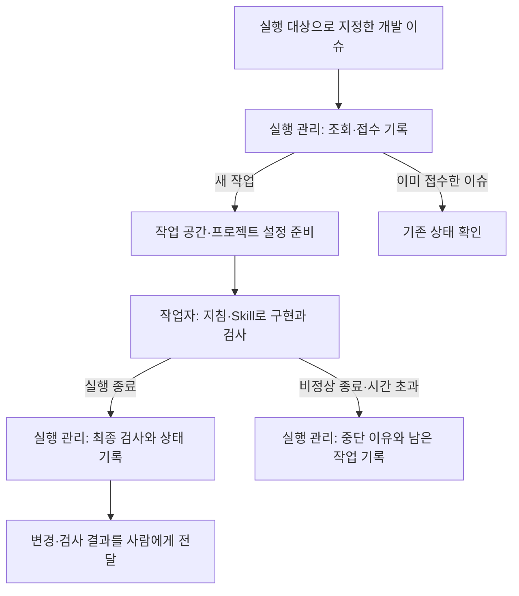

# 12주차 — AI 파이프라인·에이전트 통합 구현

> 이 README가 이번 주차의 상세 학습 본문입니다. 루트 `CURRENT_WEEK.md`는 여기로 돌아오는 짧은 대시보드입니다.

- 기본 작업 폴더: [`inquiry_desk`](inquiry_desk/)
- 전체 과정: [루트 README](../README.md)
- 현재 위치와 다음 명령: [CURRENT_WEEK](../CURRENT_WEEK.md)


## 이번 주의 문제 — IT 문의를 운영팀이 처리할 수 있는 요청으로 바꾸기

직원이 “접속이 안 돼요”라고 문의합니다. 담당자는 어떤 서비스인지 다시 묻고, 서비스 상태 화면과 운영 문서를 확인합니다. “VPN 인증서 만료”라는 답을 받으면 오류 내용과 발생 시각을 정리해 운영팀에 전달합니다. 직원이 나중에 “VPN이 아니라 통합 로그인 문제예요”라고 정정하면 확인할 자료도 바뀝니다.

현재 업무의 불편은 **자유로운 문의, 서비스 상태, 운영 문서, 전달할 요청이 따로 떨어져 있다는 것**입니다. 같은 정보를 옮겨 적는 동안 대상을 혼동하거나 오래된 상태로 요청을 보낼 수 있습니다. 이번 주에는 이 과정을 하나의 앱으로 직접 구현합니다. 목표는 **업무에서 필요한 처리를 찾아 전체 흐름을 설계하고, 배운 기술을 필요한 자리에 연결해 그 효과를 실제 결과로 판단하는 것**입니다.

다음은 만들 앱의 업무 요구입니다. 사례와 자료는 모두 가상입니다.

1. 직원은 자연어로 문의하고 빠진 정보를 이어서 알려 줄 수 있습니다.
2. 앱은 현재 서비스 상태와 관련 운영 문서를 함께 보여 주고 대응 초안을 만듭니다.
3. 여러 서비스 중 일부만 확인되어도 확인된 내용은 전달합니다.
4. 담당자가 초안을 검토·편집한 뒤 작업 요청으로 저장합니다. 운영팀의 별도 도구에서 그 요청을 읽을 수 있어야 합니다.
5. 검토 중 대상이나 서비스 상태가 바뀌면 새 사실로 다시 검토합니다. 저장 응답을 놓치고 재시도해도 같은 요청이 중복 생성되지 않아야 합니다.
6. 담당자 화면이 같은 분석과 저장을 쓸 수 있어야 하고, 처리 중임을 담당자가 알 수 있어야 합니다.

### 이번 주에 하는 일

앞 주차에서는 기술을 하나씩 익혔습니다. 이번 주에는 요구만 주어집니다. 어떤 처리를 누가 맡고, 서로 어떻게 연결하고, 어디에 어떤 라이브러리를 쓸지는 직접 정합니다. 진행은 세 가지를 따릅니다.

- **결정을 먼저 말합니다.** 각 Day에는 정해야 할 것, 그 결정이 나온 요구, 선택지와 각 선택지가 이 앱에서 만드는 결과의 차이가 적혀 있습니다. 결정과 이유를 먼저 말하면 AI가 빠진 경우와 대안을 검토합니다. 그 검토를 듣고 유지하거나 고친 뒤 구현합니다. 결정 전에 추천을 듣고 싶으면 그렇게 요청하고, 모르는 개념은 언제든 설명을 받습니다. 각 Day 끝의 “결정한 뒤 읽기”는 참고 구현이 같은 자리에서 고른 것과 그 이유이며, 결정을 마친 다음에 읽습니다.
- **작업을 맡기고 돌려받는 과정을 먼저 갖춥니다.** 구현은 AI 작업자에게 맡깁니다. 첫 업무 기능을 맡기기 전에 작업을 접수하고, 작업 공간을 나누고, 종료를 확인하고, 결과를 받고, 최종 검사를 하는 과정을 갖춥니다. 이후의 기능은 모두 이 과정을 거치는 작업 한 건입니다.
- **라이브러리는 기능이 필요로 할 때 정합니다.** 시작 프로젝트에는 AI 라이브러리가 들어 있지 않습니다. 업무 기능을 MCP로 공개하는 것은 이번 주의 필수 연결이므로, Day 1에 MCP 서버·클라이언트 연결에 필요한 SDK와 JSON 처리 의존성을 정해 추가합니다. 모델 호출이 처음 필요해지는 Day 2, 검색이 필요해지는 Day 3에서는 무엇을 직접 만들고 무엇을 라이브러리에 맡길지 정합니다.

### AI를 맡길 곳을 고르는 기준

서비스 ID로 상태를 조회하거나 검토한 본문을 저장하는 일은 코드로 처리할 수 있습니다. 모델이 유용할 것으로 보는 부분은 “사내망 연결이 계속 끊겨요” 같은 표현을 서비스와 증상으로 해석하고, 서로 다른 자료를 읽어 문의에 맞는 초안을 작성하는 일입니다. 이는 구현 전에 세우는 예상이며 실제 실행으로 확인합니다.

입력을 서비스 선택창과 오류 코드로 충분히 받을 수 있다면 정형 입력이 더 간단할 수 있습니다. 문서가 한 개이고 대응도 고정되어 있다면 문서 링크를 보여 주는 것으로 충분할 수 있습니다. 이번 요구는 자유로운 설명·추가 질문·여러 자료의 조합을 포함하므로 모델을 적용해 보고, 잘못된 해석을 고치는 부담까지 함께 살펴봅니다.

## 문의 한 건을 자료로 따라가 보기

제공 입력 “VPN이고 인증서 만료 메시지가 나와요”를 사람이 처리한다면 다음 순서입니다.

1. 문장에서 대상이 VPN이고 증상이 인증서 만료 메시지라는 것을 읽습니다. 대상이 없는 “접속이 안 돼요”였다면 여기서 되묻습니다.
2. `services.json`에서 VPN을 찾습니다. 공통 장애 공지가 없고, 개인 접속 환경은 별도로 확인하라고 되어 있습니다.
3. `runbooks.json`에서 VPN 문서를 찾습니다. VPN 문서는 두 개이고, 이 증상에는 일반 연결 오류 문서가 아니라 `RB-VPN-CERT`가 맞습니다. 메시지와 발생 시각을 확인하고 운영팀에 인증서 갱신 안내를 요청하라는 내용입니다.
4. 두 자료를 묶어 요청 문장을 씁니다.
5. 발생 시각을 보충해 운영팀에 넘깁니다.

상태 자료는 지금 공통으로 무슨 일이 있는지를, 운영 문서는 무엇을 확인하고 어떻게 전달할지를 알려 줍니다. 그래서 초안은 “공통 장애는 확인되지 않았고, 인증서 만료 메시지에 대해 갱신 안내 요청이 필요하다”는 방향이 됩니다. 공통 장애가 없다는 정보만으로 개인 연결도 정상이라고 쓰면 틀리고, 갱신이 끝났다고 쓰면 문서에 없는 말입니다. 이는 자료에서 도출한 예상이며 앱의 실행 결과가 아닙니다.

이 한 건에서 일이 다섯 가지 나왔습니다. 문장 읽기, 상태 확인, 문서 찾기, 문장 쓰기, 고쳐서 전달하기입니다. 이번 주의 결정은 이 다섯 가지를 누가 맡고 서로 어떻게 연결할지에서 나옵니다.

### 정할 것과 앞에서 다룬 곳

| 업무에서 필요한 일 | 이번 주에 정할 것 | 같은 판단을 다룬 곳 |
|---|---|---|
| 자유로운 표현에서 대상·증상 추출 | 모델에 맡길 일과 코드가 할 일, 모델 연결 방식 | 6주차 모델 호출과 구조화 출력 |
| 문의 앱과 운영 도구가 같은 업무 기능 사용 | 공개할 기능, 입출력, 없음과 실패의 표현 | 3주차 MCP 서버, 6주차 앱과 MCP 연결 |
| 정해진 대상의 사실 확보 | 조회를 모델이 요청할지 코드가 호출할지 | 6주차 Tool Calling, 7주차 고정 조회와 도구 루프 |
| 문의에 맞는 문서 확보 | 검색 방식, 호출 주체, 근거가 없을 때 다시 찾는 방법 | 8주차 검색과 실패 위치 |
| 정보 보충·정정과 일부 실패 | 보관할 상태, 반드시 지킬 순서를 관리할 곳 | 7주차 상태·분기·재개, 9주차 Workflow |
| 검토한 내용만 운영팀으로 전달 | 저장을 허용할 시점과 주체, 재전송의 처리 | 9주차 사람 확인 뒤 저장 |
| 담당자 화면에서 같은 흐름 사용 | 요청을 나누는 방법, 진행 중에 보낼 내용 | 이번 주에 처음 다룸 |
| 구현을 AI 작업자에게 맡기고 확인 | 작업 접수·작업 공간·종료 확인·최종 검사를 맡을 곳 | 5·10주차 하네스 엔진, 11주차 개발 환경 |

직원의 “VPN 인증서가 만료됐어요”는 완성할 앱에 들어가는 업무 문의입니다. “검토 중 서비스를 정정하면 오래된 검토본의 저장을 막아 주세요”는 이 앱의 코드를 바꾸는 개발 요청입니다. 업무 앱은 첫 번째를 접수·조회·검색·검토·저장으로 처리하고, 개발 하네스는 두 번째를 작업자에게 전달해 코드와 검사를 바꾸게 합니다.

## 제공 자료와 시작 프로젝트

`week12-ai-agent-integration/inquiry_desk`를 IDE에서 Gradle 프로젝트로 열고 Java 17 이상으로 동기화합니다. 실행 설정의 작업 폴더는 `inquiry_desk`입니다. 시작 프로젝트에는 Gradle 설정과 업무 자료만 있고 앱 소스는 없습니다.

| 위치 | 역할 |
|---|---|
| `data/services.json` | VPN·SSO·MAIL의 현재 상태와 변경 번호 `revision`. 서비스 상태 화면을 대신하는 자료 |
| `data/runbooks.json` | 서비스별 운영 문서의 ID·제목·본문. 사내 운영 문서를 대신하는 자료 |
| `data/cases.json` | 확인할 문의와 판단 기준. 앱이 읽는 자료가 아니라 검사 입력과 기대 결과를 정할 때 쓰는 목록 |
| `build.gradle` | Java와 검사 설정. 필요한 라이브러리는 그 기능을 구현할 때 추가 |

`cases.json`의 사례는 요구입니다. 사례를 만족시키는 방법은 정하기 나름입니다. 상태 자료가 파일이어서 Day 5에는 이 파일의 상태와 `revision`을 직접 고쳐 “검토하는 동안 상태가 바뀐 상황”을 만들 수 있습니다.

참고 구현은 `week12-ai-agent-integration/references/incident_desk`에 있습니다. 이 폴더가 아직 없으면 `CURRENT_WEEK.md`의 참고 구현 공개 안내를 따릅니다. 같은 요구를 LangChain4j와 MCP로 구현한 한 가지 구성입니다. 각 Day의 구현을 마친 뒤 같은 입력을 넣어 선택이 갈린 곳을 비교하고, 직접 구현하지 않은 쪽의 결과를 볼 때 씁니다. 참고 구현의 클래스 배치를 따라야 하는 것은 아닙니다. 비교할 때는 참고 구현을 별도 Gradle 프로젝트로 열고, 작업 폴더·프로그램 인수·실제 모델 설정은 그 프로젝트 README의 실행 안내를 따릅니다.

### 대역 실행과 실제 모델

자동 검사는 준비한 모델 응답(대역)과 임시 업무 자료로 실행합니다. 대역으로 확인할 수 있는 것은 값이 전달되는 경로와 분기입니다. 자연어 해석, 검색 품질, 초안 문장은 실제 모델로 실행해 판단합니다. 실제 키가 필요한 실행은 IDE의 비공유 실행 설정에 키를 지정해 직접 수행하고, 자동 검사와 작업자의 실행에는 넣지 않습니다. 노트에는 대역으로 확인한 범위와 실제 모델로 확인한 범위를 구별해 남깁니다.

주차 노트 한 곳에 결정과 이유, 대표 결과와 해석을 누적합니다. 교재에 있는 해설을 옮겨 적을 필요는 없습니다.

## 구현을 맡기는 방식 — 작업 한 건이 지나는 길

이번 주의 구현은 다음 길을 반복해서 지납니다.

```text
결정과 이유 → AI의 검토 → 확정
  → 작업 요청(합의한 조건, 대표 입력과 기대 결과, 담당 범위, 검사 방법, 돌려받을 항목)
  → 작업 접수 → 작업별 작업 공간 → 작업자 실행 → 종료 확인 → 결과 수집
  → 최종 검사 → 변경 검토 → 합치기 → 합친 코드에서 다시 검사
```

작업을 넘기는 쪽은 직접 맡아도 되고 대화형 AI 세션에 맡겨도 됩니다. 어느 쪽이든 공개 입출력과 실패했을 때의 동작은 직접 정하고, 패키지와 클래스 배치 같은 구현 세부는 작업자에게 맡길 수 있습니다. 작업자의 결과를 다른 세션에 검토시키는 구성도 선택할 수 있습니다. 앞 Day에서 이미 정한 선택은 이어서 쓰고, 새 요구 때문에 달라지는 결정만 다시 검토합니다.

### 이 과정이 없을 때 생기는 일

아래는 실제 개발 사례에서 착안해 재구성한 가상 상황입니다.

> 작업자를 시작했는데 10분이 지나도록 결과가 오지 않았다. 실행을 중단하고 같은 요청으로 작업자를 다시 시작했다. 그런데 중단한 실행의 프로세스는 종료되지 않았고, 두 작업자가 같은 폴더에서 같은 기능을 구현했다. 두 작업자는 자기가 쓰지 않은 변경을 발견하고 멈췄지만, 같은 이름의 타입이 서로 다른 형태로 남았고 빌드 설정에는 같은 항목이 두 번 들어갔다. 두 실행이 같은 결과 파일을 쓰도록 되어 있어 먼저 끝난 쪽의 보고는 덮어써졌다. 작업자의 실행 환경에는 네트워크가 없어서 두 작업자 모두 검사를 실행하지 못한 채 끝났다.

이 상황에서 AI 라이브러리는 한 줄도 쓰이지 않았습니다. 문제가 난 곳은 전부 작업을 맡기고 돌려받는 과정입니다. 지침과 Skill에는 작업자의 절차뿐 아니라 담당 배정이나 작업 공간 확인 같은 절차도 적을 수 있습니다. 다만 문장으로 정한 절차와, 접수 기록과 프로세스 상태를 읽어 중복 시작을 거절하는 처리는 다릅니다. 같은 작업이 이미 돌고 있는지, 어느 폴더에서 일하는지, 앞선 실행이 끝났는지는 여러 실행에 걸친 정보이고, 그것을 기록하고 확인하는 일을 맡은 곳이 있어야 합니다. 작업자는 충돌을 발견하고 멈출 수는 있어도 충돌을 막을 수는 없습니다.

| 일어난 일 | 갖춰야 할 처리 |
|---|---|
| 실행이 입력을 기다리며 멈춤 | 요청을 전달한 뒤 표준 입력을 닫고, 입력 전달 실패와 제한 시간 초과를 구분해 기록 |
| 중단한 프로세스가 살아남음 | 중단을 요청한 뒤 프로세스가 실제로 사라졌는지 확인. 확인되지 않으면 그 상태를 기록 |
| 같은 작업이 두 번 시작됨 | 작업과 실행 시도를 각각 식별해 기록하고, 앞선 시도의 종료가 확인되기 전에는 다시 시작하지 않음 |
| 두 작업자가 같은 파일을 편집함 | 작업마다 작업 폴더를 따로 둠. 브랜치 이름만 나누고 폴더를 같이 쓰면 분리되지 않음 |
| 한쪽 보고가 덮어써짐 | 결과와 로그를 실행 시도마다 따로 둠 |
| 검사를 실행하지 못한 채 끝남 | 작업자의 환경에서 검사가 실행되는지 미리 확인하고, 작업자의 보고와 별개로 최종 검사를 실행 |

이 표의 오른쪽이 Day 1에 갖출 것입니다. 한 사람이 대화형 세션 하나를 직접 지켜보며 개발한다면 시작·종료·중복은 사람이 보고 있으므로 11주차의 환경으로 충분합니다. 다른 세션이나 프로그램이 작업자를 대신 시작하거나, Day 5처럼 이슈가 작업을 시작하게 하려면 이 처리가 코드로 있어야 합니다. 이번 주는 그 방식으로 진행합니다.

## Day 1 — 구조를 정하고 작업을 맡길 준비 갖추기

### 개념 — 파이프라인과 책임 나누기

파이프라인은 입력을 결과로 바꾸는 처리들의 연결입니다. 이 사례에서는 문의를 읽는 일, 사실을 가져오는 일, 근거를 찾는 일, 초안을 쓰는 일, 저장하는 일을 나눌 수 있습니다. 나누는 이유는 변경되는 조건이 다르기 때문입니다. 모델을 바꿔도 업무 저장 규칙은 유지할 수 있고, 서비스 자료의 위치가 바뀌어도 문장을 해석하는 지침은 그대로 쓸 수 있습니다.

Workflow는 처리 순서와 분기를 코드나 화면에서 정하는 방법이고, 에이전트는 그중 모델이 다음 도구를 선택하는 구간입니다. 에이전트가 있어도 사람의 저장 확인 같은 필수 순서는 앱이 정합니다.

### 결정 1 — 다섯 가지 일을 누가 맡는가

문장 읽기, 상태 확인, 문서 찾기, 문장 쓰기, 고쳐서 전달하기를 모델, 코드, 사람 중 누구에게 맡길지 정합니다. 결정을 가르는 것은 두 가지입니다.

- 그 일의 입력과 결과가 정해져 있는가. 정해져 있으면 코드로 쓸 수 있습니다.
- 그 일을 건너뛰면 무엇이 잘못되는가. 6주차에 조회를 모델에 맡겼을 때 모델이 조회를 건너뛰고 답한 경우가 있었습니다. 지침으로 호출을 유도할 수는 있어도 강제할 수는 없습니다.

문서 찾기를 코드가 호출할지 모델이 도구로 요청할지는 Day 3에 정합니다. 오늘은 나머지 네 가지와 전체 순서를 정합니다.

### 결정 2 — 업무 기능을 어떻게 공개하고 무엇을 주고받는가

요구 4번에 따라 문의 앱과 운영팀 도구가 같은 조회와 저장을 씁니다. 한 프로그램 안에서만 쓰면 함수 호출로 충분하고, 호출하는 쪽이 명세를 미리 알고 정해진 기능을 부르면 일반 API를 쓸 수 있습니다. MCP는 서버가 도구 이름·설명·입력 형식을 함께 공개하고 클라이언트가 그 목록을 읽어 호출합니다. [MCP 구조와 도구 안내](https://modelcontextprotocol.io/docs/learn/architecture)

이번 주에는 업무 기능을 MCP 서버로 공개하고 두 프로그램이 MCP로 호출합니다. 기존 업무 API가 있는 조직이라면 MCP 서버가 그 API를 부르게 연결합니다. 오늘 정할 것은 그 위에 놓이는 내용입니다.

- **공개할 기능.** 요구에서 필요한 기능을 뽑습니다. 오늘 구현하는 것은 서비스 상태 조회 하나이고, 저장과 저장된 요청 조회는 Day 4에 더합니다.
- **조회 결과의 경우.** 서비스 ID를 받았을 때 결과는 세 가지로 갈립니다. 서비스가 있다(VPN), 자료에 없다(급여 시스템), 조회 자체를 못 했다(자료를 읽지 못함, 서버에 연결하지 못함). 자료에 없는 경우를 정상 응답 안의 “없음”으로 돌려줄지 오류로 알릴지 정합니다. 3주차의 상품 서버는 없는 상품을 도구 오류로 돌려줬고, 7주차의 배송 조회는 조회 성공과 자료 없음을 나눠 다뤘습니다.
- **호출한 쪽이 구별할 수 있는가.** “VPN과 급여 시스템이 안 돼요”에서 앱은 두 서비스를 차례로 조회하고 결과를 서비스별로 모읍니다. 어느 쪽을 고르든 자료에 없는 것과 조회하지 못한 것이 구별되어야 하고, 한 서비스의 결과가 다른 서비스의 결과를 지우지 않아야 합니다. MCP의 도구 오류에는 HTTP 상태 코드 같은 표준 구분 값이 없으므로, 오류로 알리는 경우에는 구분 값을 직접 정해 넣어야 합니다. 문구를 해석해야만 구별되는 형태는 문구가 바뀌면 깨집니다.
- **호출하는 주체.** 6주차에는 모델이 조회를 요청하고 결과를 모델이 읽었습니다. 이번 조회를 코드가 호출한다면 결과를 읽는 쪽도 코드입니다. 읽는 쪽이 모델인지 코드인지에 따라 알맞은 표현이 달라집니다.
- **잘못된 입력.** 빈 서비스 ID를 위 세 경우 중 어디에 둘지, 따로 둘지 정합니다.
- **조회하지 못한 경우를 앱 코드에 어떻게 돌려줄지.** 값으로 돌려주면 호출한 쪽이 성공·없음·실패를 값으로 나눕니다. 예외로 전달하면 서비스별 호출을 감싸 실패를 그 서비스의 결과로 바꿔야 합니다. 어느 경우든 한 서비스의 실패가 다른 결과를 지우지 않아야 합니다.

### 결정 3 — 작업을 맡기고 돌려받는 과정을 무엇으로 갖추는가

첫 업무 기능을 작업자에게 맡기기 전에 다음이 갖춰져 있어야 합니다.

- 작업 접수 기록: 작업과 실행 시도를 식별하고, 시작 전에 기록합니다. 같은 접수 기록을 쓰는 실행 관리가 겹쳐 실행되지 않게 하거나, 접수와 실행 권한 확보를 한 번의 처리로 묶습니다.
- 작업별 작업 공간: 기준이 되는 커밋에서 작업마다 Worktree를 만듭니다. `.codex`와 `.local`은 Git으로 전달되지 않으므로 새 폴더에서 다시 연결합니다. Hook 등록이 원래 폴더를 가리키면 종료 검사가 다른 폴더의 코드를 검사합니다.
- 작업자 실행: 요청을 전달하고 입력을 닫습니다. 제한 시간을 둡니다.
- 종료 확인: 정상 종료, 제한 시간 초과, 중단을 구별합니다. 중단을 요청한 뒤 프로세스가 사라졌는지 확인하고, 확인되지 않으면 새 작업자를 시작하지 않습니다.
- 실행 시도별 결과: 작업자의 보고, 로그, 검사 결과를 시도마다 따로 둡니다. 작업자의 보고는 변경 파일, 실행한 검사와 결과 위치, 스스로 정한 선택, 남은 일을 정해진 형식으로 받습니다.
- 최종 검사: 작업자의 보고와 별개로 검사를 실행해 통과하면 검토 대기로, 실패하거나 실행할 수 없으면 확인 필요로 기록합니다.
- 수정 요청의 주체: 검사 실패의 수정 요청을 누가 몇 번 낼지 한 곳으로 정합니다. Hook, 작업을 넘기는 쪽, 실행 관리 프로그램이 각각 수정을 요청하면 같은 실패에 요청이 겹칩니다.

이 책임을 무엇으로 채울지는 정하기 나름입니다. 앞 주차에 만든 것을 가져와 필요한 부분만 고쳐도 되고, 새로 구성해도 됩니다. 어느 쪽이든 완료는 같은 기준으로 판단합니다.

5주차에 제공된 프로세스 실행 코드(`ProcessRunner`)는 요청을 표준 입력에 쓰고 닫으며, 출력을 모으고, 제한 시간이 지나면 하위 프로세스까지 강제 종료를 요청합니다. 종료를 요청한 뒤 실제로 끝났는지 판정하는 처리와, 실행 도중 중단됐을 때 하위 프로세스를 정리하는 처리는 없습니다. 그 위에 직접 만든 엔진은 대개 실행마다 결과 폴더를 두고 별도의 검사를 연결하지만, 같은 작업의 중복 접수를 막거나 작업 공간을 준비하지는 않습니다. 11주차의 종료 Hook은 그 프로젝트의 검사 작업과 결과 폴더에 맞춰져 있고, 시작 Hook은 그 프로젝트의 설명과 인계 메모를 전달합니다. 직접 만든 부분은 사람마다 다르므로 자기 코드에서 다음을 확인합니다.

| 앞에서 만든 것 | 확인할 것 |
|---|---|
| 5주차 엔진의 프로세스 실행 | 요청을 전달한 뒤 입력을 닫는가. 제한 시간 뒤 하위 프로세스까지 종료를 요청하는가. 종료가 실제로 끝났는지 확인하는가. 사람이 중간에 중단했을 때 정리하는가 |
| 5주차 엔진의 실행과 검사 연결 | 실행마다 결과 폴더를 따로 두는가. 같은 작업의 중복 접수를 막는가. 작업 공간을 준비하는가 |
| 5·10주차의 복구 정책 | 검사 실패 뒤 작업자를 다시 실행하는가. 그렇다면 다른 수정 요청과 겹치지 않는가 |
| 5주차의 검사 실행 | 이번 실행의 새 결과로 실패와 실행 불가를 구분하는가. 이 앱의 검사 작업과 결과 위치를 받을 수 있는가 |
| 11주차 종료 Hook | 어느 검사 작업과 결과 폴더에 맞춰져 있는가. 실패했을 때 수정을 요청하는가, 멈추기만 하는가 |
| 11주차 시작 Hook과 인계 메모 | 어느 폴더의 설명과 메모를 전달하는가 |
| 11주차 지침과 Skill | 프로젝트가 달라져도 같은 원칙과 절차는 무엇이고, 이전 업무에만 해당하는 내용은 무엇인가 |

정할 것이 하나 더 있습니다. 작업자를 비대화형 실행으로 시작했을 때 종료 Hook이 실행되는지입니다. 프로젝트에 등록한 Hook은 신뢰 검토를 거쳐야 실행되므로 새 작업 폴더에서 직접 확인합니다. [Codex Hook 문서](https://learn.chatgpt.com/docs/hooks) 실행되지 않는다면 종료 검사를 누가 맡을지 정합니다. 종료 검사가 실패했을 때 그 결과를 누가 받아 다음 호출을 정하는지도 함께 정합니다. [Codex 비대화형 실행](https://learn.chatgpt.com/docs/non-interactive-mode)

### 구현과 확인

결정 3의 책임을 맡을 실행 경로가 아직 없다면 초기 구성은 대화형 세션 하나에서 진행합니다. 그 책임을 이미 갖춘 실행 경로가 있다면 그 경로를 써도 됩니다. 순서는 다음과 같습니다.

1. 지침·Skill·종료 검사를 이 앱에 맞춥니다. 지침에는 오늘 정한 조건을 넣습니다. 예를 들어 “문의를 처리하는 경로에서는 저장하지 않는다”, “서비스별 사실과 근거를 섞지 않는다”입니다.
2. 결정 3의 책임을 갖춥니다. 실행 진입점은 IDE에서 시작할 수 있게 둡니다. 작업자 호출은 프로그램이 CLI로 실행합니다. 사람이 지켜보지 않는 실행을 프로그램이 시작하고 종료까지 기다려야 하기 때문입니다.
3. 대역 프로세스로 실행 관리의 정책을 확인합니다. 실제 코딩 작업자를 충돌시키지 않고, 입력이 닫히기를 기다리거나 지정한 결과 파일에 실행 식별자만 쓰는 작은 프로그램을 씁니다.
   - 같은 작업의 두 번째 접수가 거절되는가
   - 제한 시간 뒤 프로세스의 종료가 확인되는가
   - 실행 중에 중단을 요청하면 하위 프로세스까지 종료되는가
   - 종료가 확인되지 않은 상태에서 같은 작업의 새 실행이 막히고 확인 필요로 남는가
   - 두 번 실행한 결과가 각각 남는가
   - 검사 실패와 검사 실행 불가가 다른 상태로 기록되는가
4. 서비스 상태 조회를 첫 작업으로 넘깁니다. 작업 요청에는 결정 1·2에서 정한 조건과, VPN·급여 시스템·자료를 읽지 못하는 경우의 기대 결과를 넣습니다. 검사는 서버 프로세스를 실제로 시작하는 MCP 연결로 확인하게 합니다.
5. 돌아온 변경을 검토하고 합친 뒤, IDE에서 운영 도구 역할의 진입점을 직접 실행합니다. 공개된 도구 목록, VPN 조회, 급여 시스템 조회, 자료 폴더가 없는 경우의 출력을 읽고, 값이 클라이언트에서 서버, 자료 파일까지 지나간 경로를 코드에서 따라갑니다.

새로 구성하는 쪽을 골라 시간이 더 든다면 4번과 5번을 Day 2의 앞으로 넘깁니다. 2번과 3번은 넘기지 않습니다.

```text
12주차 본문의 업무 요구와 data/의 자료를 읽었어. 구조와 연결 방식은 내가 먼저 정할게.
[다섯 가지 일을 누가 맡는지와 이유]
[자료에 없는 서비스와 조회하지 못한 경우를 어떻게 돌려줄지, 잘못된 입력을 어디에 둘지와 이유]
이 결정에서 빠진 경우와, 조건이 달라지면 반대 선택이 맞는 경우를 검토해 줘.
검토를 듣고 내가 유지하거나 고칠게. 결정 전에 추천이 필요하면 따로 요청할게.

다음으로 작업을 맡기고 돌려받는 과정을 갖추려고 해.
앞 주차에서 만든 지침·Skill·Hook·엔진이 본문의 책임 중 무엇을 이미 하고 무엇이 없는지 실제 코드로 정리해 줘.
새로 구성할지 고쳐 쓸지는 그 정리를 보고 내가 정할게.
정한 대로 이 세션에서 구성하고, 대역 프로세스로 중복 접수·종료 확인·실행별 결과·검사 실패와 실행 불가의 구분을 확인하자.
비대화형으로 시작한 작업자에게 종료 Hook이 걸리는지도 새 작업 폴더에서 확인해 줘.
준비가 끝나면 서비스 상태 조회를 첫 작업으로 넘길 요청문을 내가 정한 조건으로 정리해 줘.
```

**남길 결과·완료 판단:** 역할과 연결 방식을 정한 이유, 조회 결과의 경우를 나눈 방식과 이유를 노트에 남깁니다. 서비스 상태 조회 하나가 접수 → 분리된 작업 폴더의 실행 → 결과 수집 → 최종 검사 → 검토와 합치기를 통과하고, 실제 MCP 조회에서 있는 서비스·자료에 없는 서비스·조회하지 못한 경우가 구별되면 완료입니다. 대역으로 확인한 실행 관리 정책과 실제 작업자 실행에서 확인한 것을 구별해 적습니다. 첫 기능을 Day 2로 넘겼다면 오늘은 실행 관리의 책임과 대역 확인까지 마칩니다. Day 2의 모델 연결에 들어가기 전에 서비스 상태 조회 작업의 접수·실행·검토·합치기와 실제 MCP 조회를 끝냅니다.

### 결정한 뒤 읽기 — 참고 구현의 선택

참고 구현은 접수와 초안에 모델을 쓰고, 상태 조회는 접수가 끝난 뒤 코드가 서비스 목록을 돌며 호출합니다. 서비스 ID가 정해지면 모든 대상의 상태가 필요해서 모델이 고를 것이 없다고 본 것입니다. 이 구성은 접수 단계에서 모델이 서비스를 잘못 읽은 경우까지 해결하지는 않습니다.

`OperationsClient.main`에 `get VPN`과 `get PAYROLL`을 넣어 자기 구현과 비교합니다. 참고 구현은 자료에 없는 서비스를 정상 응답 안의 `not_found`로 돌려줍니다. 도구를 처리하다 생긴 예외는 원인과 관계없이 같은 문구의 도구 오류가 되고 클라이언트가 예외를 던지므로, 호출한 쪽이 원인을 구별하지 못합니다. 빈 서비스 ID는 자료를 읽을 수 있으면 `not_found`가 됩니다. 서버에 연결하지 못한 경우는 서버가 돌려준 도구 오류와 다른 실패이지만, 문의를 처리하는 코드는 두 경우 모두 예외로 받아 그 서비스만 `unavailable`로 표시하고 다른 서비스의 결과를 남깁니다. 원인 구분 값을 넣기로 했다면 이 부분이 자기 구현과 갈립니다. 운영자가 원인별로 다르게 대응해야 하는 조직이라면 구분 값이 필요하고, 어떤 실패든 “잠시 후 다시 시도”로 안내하는 업무라면 한 가지 오류로도 충분합니다.

## Day 2 — 자연어 문의를 이어 받는 접수 만들기

### 개념 — 구조화 출력과 대화 상태

“접속이 안 돼요”에는 서비스가 없습니다. 모델의 결과를 서비스 목록, 증상, 추가 질문 같은 값으로 받으면 앱은 질문하고 기다릴 수 있습니다. 구조화 출력은 앱이 다음 처리를 고를 수 있게 값을 정리하는 방법입니다. 형식이 맞아도 해석이 맞는지는 실제 발언과 대조해야 합니다.

다음 발언이 오면 앞의 문의와 이어서 처리해야 합니다. 대화마다 무엇을 보관하고 다음 모델 호출에 무엇을 보낼지가 대화 상태입니다.

### 결정 — 모델 연결과 보관할 상태

모델 호출이 처음 필요해지는 자리입니다. 다음을 정합니다.

- **모델을 어떻게 연결할까.** 6주차처럼 제공자 SDK나 HTTP로 직접 호출하고 응답을 직접 변환할 수 있습니다. LangChain4j 같은 프레임워크는 출력 변환과, 모델의 도구 요청 → 실행 → 결과 전달 → 재호출의 반복을 대신 연결합니다. 오늘 필요한 것은 모델 호출 한 번과 출력 변환입니다. Day 3에서 모델이 검색 도구를 고르게 할 가능성이 있다면 그때 필요한 것까지 함께 놓고 판단합니다. 프레임워크를 쓰지 않기로 했다면 필요한 연결만 구현하고 프레임워크 내부를 다시 만들지 않습니다.
- **접수 결과에 무엇을 담을까.** 제공 입력 “접속이 안 돼요” → “VPN이고 인증서 만료 메시지가 나와요”에서 앱이 다음 처리를 고르는 데 필요한 값을 뽑습니다.
- **대화마다 무엇을 보관할까.** 원시 대화 전체를 보관하면 정보는 남지만 입력이 커집니다. 접수 결과만 보관하면 작게 유지되지만 앞에서 말한 오류 메시지를 잃을 수 있습니다. 7주차에 원래 문의를 보관하고 빠진 값만 보충했던 것과 같은 판단입니다.
- **대상이 없을 때.** 질문하고 기다릴지, 추정한 대상을 표시하고 확인받을지 정합니다. 질문은 발언을 한 번 더 요구하고, 추정은 잘못된 대상으로 진행할 수 있어 확인받는 방법이 필요합니다.
- **모델의 응답이 형식에 맞지 않을 때.** 다시 호출할지, 실패로 돌려줄지 정합니다.

접수 뒤의 상태 조회는 Day 1에서 정한 대로 연결합니다.

```text
자연어 접수와 대화별 상태를 더하려고 해. 내가 먼저 정할게.
[모델 연결 방식과 이유, 접수 결과에 담을 값, 대화마다 보관할 것, 대상이 없을 때와 형식이 어긋날 때의 처리]
제공 입력으로 이 결정에서 빠진 경우를 검토해 줘.
확정한 조건으로 작업 요청문을 정리해 줘. 같은 대화의 정보 보충, 다른 대화의 같은 발언, 대상이 없는 문의를 대역 모델로 검사하게 해 줘.
작업이 돌아오면 변경과 검사 결과를 같이 보자.
실제 모델 실행은 내가 IDE에서 할게. 키를 어디에 지정하고 무엇을 입력할지 알려 줘.
```

구현 뒤 IDE에서 `a|접속이 안 돼요` → `a|VPN이고 인증서 만료 메시지가 나와요`를 실행합니다. 이어서 같은 대화에 `a|인증서 만료 메시지가 나와요`를 입력하면 VPN 문의를 이어 가야 합니다. 같은 발언을 새 대화 `b`에 입력하면 대상을 물어야 합니다. `a|…`는 대화 ID와 발언을 나타낸 입력 예이고, 실행 형식은 자기 구현에 맞춥니다. 실제 모델에서는 “사내망 연결이 자꾸 끊겨요”처럼 표현을 바꿔 대상과 증상의 해석을 확인합니다.

이 작업을 넘기기 전에 현재 구조와 확인한 사례, 남은 결정을 인계 메모에 남기고 개발 세션을 한 번 재개합니다. 재개한 세션이 메모와 현재 코드를 대조해 다음 작업을 찾는지 봅니다.

**남길 결과·완료 판단:** 모델의 해석이 실제 조회로 이어지고, 추가 질문 뒤 같은 문의를 계속 처리하며, 대화가 섞이지 않으면 완료입니다. 대역으로 확인한 값 전달과 실제 모델로 확인한 표현 해석을 구별해 적습니다.

### 결정한 뒤 읽기 — 참고 구현의 선택

참고 구현은 LangChain4j의 `AiServices`로 접수 결과를 타입으로 받고, 대화 ID별로 접수 결과만 보관합니다. 다음 호출에는 이전 접수 결과와 새 발언을 보냅니다. 서비스 목록이 비었거나 질문이 있으면 `needs_input`으로 돌려주고 조회로 가지 않습니다. 이 타입 변환은 제공자에게 엄격한 JSON Schema를 강제하는 기능과는 다릅니다. 접수 결과로 변환된 뒤 필수 값·서비스 ID·중복 검사에서 걸리면 `invalid_output`이고, 형식이 깨져 변환 자체가 실패하면 `processing_failed`로 끝납니다. 대화 전문이 필요한 업무라면 메시지를 유지하고 요약·절단 정책을 따로 정해야 합니다.

## Day 3 — 상태와 운영 문서를 묶어 대응 초안 만들기

### 개념 — 이 문제에서 RAG가 하는 일

서비스 상태는 지금 어떤 공통 문제가 있는지 알려 줍니다. 운영 문서는 어떤 정보를 확인하고 어떻게 전달해야 하는지 알려 줍니다. RAG는 관련 문서를 찾아 모델의 입력에 넣는 과정입니다. 모델이 기억하는 일반적인 VPN 설명 대신 조직의 운영 방법을 초안에 쓰게 합니다.

검색 결과를 판정한 뒤 검색을 바꿔 다시 시도하는 구성을 교정 검색(corrective retrieval)이라고 부릅니다. 8주차에서는 개발자가 실패한 질문을 보고 검색어와 문맥 범위를 고쳤습니다. 운영 중인 앱은 문의마다 사람이 개입할 수 없으므로, 실행 도중 근거 부족을 발견하고 정한 범위에서 다시 찾게 합니다.

### 결정 1 — 문서를 어떻게 찾고 누가 호출하는가

- **검색 방식.** 운영 문서는 네 개이고 VPN만 두 개(일반 연결 오류, 인증서 만료)입니다. 서비스별 문서를 직접 가져오는 방법, 8주차의 어휘 검색, 임베딩 검색, 둘의 결합이 있습니다. 서비스로 범위를 정한 뒤에도 증상에 맞는 문서를 골라야 한다는 점, 정확한 오류 코드 `CERT-EXPIRED`는 어휘 검색이 유리하고 “사내망 연결이 끊겨요”처럼 문서의 용어와 다른 표현은 불리하다는 점이 결정을 가릅니다. 문서가 수백 개로 늘면 어느 방식부터 바꿔야 할지도 함께 생각합니다.
- **호출 주체.** 접수한 증상 문장으로 코드가 검색할 수 있고, 모델에 검색 도구를 주어 모델이 검색어를 정하게 할 수 있습니다. 모델에 맡기면 검색어를 문서의 용어에 맞춰 바꿀 수 있지만 모델 호출이 늘고, 도구를 공개했다고 필요한 검색이 반드시 수행되는 것도 아닙니다. 모델이 도구를 반복해서 요청할 수 있으므로 한 문의에서 허용할 모델 호출 수도 정합니다.
- **모델에 넘길 근거의 범위.** 다른 서비스의 문서가 섞이지 않게 할 방법과 넘길 문서 수를 정합니다.

두 호출 방식 중 하나를 구현합니다. 다른 쪽은 구현을 마친 뒤 참고 구현에 같은 문의를 넣어 비교합니다.

### 결정 2 — 초안을 어떻게 검사하고, 근거가 없으면 무엇을 하는가

- **출처 검사.** 초안이 가리키는 문서가 실제 검색 결과에 있고 그 서비스의 문서인지는 코드가 검사할 수 있습니다. 8주차에서 확인한 대로 이 검사는 문서의 존재와 소속만 확인합니다. 출처가 맞아도 “갱신 완료”처럼 원문에 없는 사실을 쓸 수 있습니다. 이 부분은 원문과 대조해 읽어야 하고, 담당자의 검토가 구조에 들어가는 이유입니다.
- **근거가 없는 원인의 구분.** 검색은 됐지만 맞는 문서가 없는 경우와, 검색 호출 자체가 실패한 경우는 다음 행동이 다릅니다. 앞의 경우는 검색을 바꿔 볼 이유가 있고, 뒤의 경우는 검색어를 바꿔도 해결되지 않습니다. 모델이 검색 도구를 부르지 않아 근거가 없는 경우도 있습니다.
- **다시 찾기.** 근거를 찾지 못하면 정한 한도 안에서 다시 찾습니다. 무엇을 바꿔 다시 찾을지 정합니다. 검색어를 모델이 다시 쓰게 하는 방법, 어휘 검색을 결합하는 방법, 검색 범위를 넓히는 방법이 있습니다. 몇 번까지 다시 찾을지와, 무엇으로 부족을 판정할지도 정합니다. 근거의 유무는 코드가 판정할 수 있고, 근거의 내용이 증상에 맞는지를 모델에게 평가시키면 호출이 늘고 평가의 오판이 생깁니다.
- **끝내 없을 때.** 확인한 상태는 남기고 대응 방법은 검토가 필요하다고 표시합니다. 근거가 없는 것과 검색에 실패한 것을 다른 안내로 남깁니다. 담당자는 문서를 보충할지 검색 장애를 먼저 볼지 다르게 판단해야 하기 때문입니다.

검색을 바꿔도 해결되지 않는 원인도 있습니다. 자료에 해당 문서가 없거나 대상 서비스가 정해지지 않았다면 다시 찾는 대신 질문하거나 운영팀 확인으로 넘깁니다.

```text
운영 문서 검색과 초안 작성을 더하려고 해. 내가 먼저 정할게.
[검색 방식과 호출 주체, 모델에 넘길 근거의 범위와 호출 한도, 그렇게 정한 이유]
[출처 검사의 조건, 근거가 없는 원인을 나누는 방법, 다시 찾을 때 바꿀 것과 횟수, 끝내 없을 때의 결과]
'VPN이 자꾸 끊겨요', 'VPN이고 인증서 만료 메시지가 나와요', '사내망 연결이 자꾸 끊겨요'로 이 결정에서 빠진 경우를 검토해 줘.
검사 입력과 기대 결과를 먼저 정하고 작업 요청문을 정리해 줘. 다른 서비스의 출처가 섞인 초안, 근거가 없는 경우, 검색 호출이 실패하는 경우를 포함해 줘.
작업이 돌아오면 검색어·출처·모델 호출 수·초안을 같이 보자.
```

구현 뒤 세 문의를 실행해 검색어, 사용한 출처, 모델 호출 수, 초안을 확인합니다. 초안의 문장은 `RB-VPN`·`RB-VPN-CERT` 원문과 대조해 요청해야 할 일과 이미 끝난 일을 구별했는지 읽습니다.

“사내망 연결이 자꾸 끊겨요”가 다시 찾기를 확인하는 제공 사례입니다. 고른 검색이 이 문의에서 처음부터 근거를 찾으면 다시 찾기가 일어나지 않습니다. 그때는 오류 메시지만 담긴 문의처럼 다른 표현으로 확인합니다. 그래도 일어나지 않으면 첫 검색은 근거 없음, 바꾼 뒤의 검색은 근거 있음을 돌려주는 대역으로 다시 찾는 흐름을 검사합니다. 이 경우 실제 검색 품질로 확인한 것과 대역으로 확인한 흐름을 구별해 적습니다.

마지막으로 참고 구현의 `CompareFlows.main`에 같은 문의를 넣어 직접 구현하지 않은 호출 방식의 검색어, 출처, 모델 호출 수를 봅니다. 실제 모델 비교는 인수 `--live`로 실행합니다. 이 비교를 실행하기 직전에, 두 방식에서 찾는 문서와 모델 호출 수가 어떻게 다를지 예상을 먼저 적습니다. 참고 구현의 두 경로는 자료·임베딩·출력 검사 기준을 같게 두고 검색을 호출하는 주체와 검색어를 고르는 방식만 바꿉니다. 자기 구현과 참고 구현 사이에는 다른 요소도 함께 다를 수 있으므로, 그 차이를 호출 주체 하나의 효과로 단정하지 않습니다. 여기서 모델 호출 수는 접수·작성·재작성의 대화 모델 호출이며 임베딩 호출은 포함하지 않습니다.

**남길 결과·완료 판단:** 상태와 문서를 함께 쓴 초안을 얻고, 근거를 찾지 못한 문의에서 다시 찾아 근거를 얻는 경우와 끝내 검토로 넘기는 경우를 확인하고, 검색 실패가 근거 없음과 다른 결과가 되면 완료입니다. 노트에는 고른 검색 방식과 호출 주체의 이유, 참고 구현과의 비교에서 본 차이를 남깁니다.

### 결정한 뒤 읽기 — 참고 구현의 선택

참고 구현은 짧은 운영 문서를 문서 단위로 임베딩하고, 검색 뒤 요청한 서비스의 결과만 남겨 최대 2개를 전달합니다. 최소 점수 0.65는 시작값이며 임베딩 모델이 바뀌면 같은 점수가 같은 품질을 뜻하지 않습니다. 이 서비스 필터는 문서 선택 조건이고 접근 권한 검사를 대신하지 않습니다.

호출 주체는 두 가지를 모두 갖고 있습니다. `--fixed`에서는 코드가 증상 문장으로 검색하고, 기본 경로에서는 모델에 `find_runbook`을 공개합니다. 접수부터 합산한 모델 호출은 사용자 발언당 최대 6회입니다. 대역의 VPN 사례에서 고정 경로는 2회, 모델이 검색을 고르는 경로는 3회를 씁니다.

다시 찾기는 한 번입니다. 그 서비스의 근거가 하나도 없는지를 코드가 판정하고, 검색 기록에 근거 없음이 있고 검색 실패가 없으면 모델이 검색어를 한 번 다시 써서 검색합니다. 원래 증상은 초안 작성에 그대로 쓰고 다시 쓴 문장은 검색에만 씁니다. 검색 호출이 실패했다면 검색어를 바꾸지 않고 검색 실패로 안내합니다. 모델이 검색 도구를 부르지 않았다면 앱이 접수한 증상으로 한 번 검색합니다. 근거는 있는데 초안이 출처와 맞지 않는 경우는 다시 검색해도 해결되지 않으므로 사람의 검토로 보냅니다. 답변 내용을 평가해 다시 찾는 방식이 아니라 근거의 유무로 한 번 더 찾는 방식입니다. 어휘 검색을 결합하기로 했다면 이 부분이 자기 구현과 갈립니다.

## Day 4 — 검토한 요청을 운영팀에 전달하고 화면에 공개하기

### 개념 — 생성 결과를 업무의 다음 행동에 연결하기

초안은 작업 요청의 재료입니다. 담당자가 내용을 읽고 발생 시각을 보충하거나 문장을 고친 뒤 저장을 선택해야 운영팀에 전달할 요청이 됩니다. 9주차에 검사 통과와 저장 확인을 분리했던 것과 같은 원리입니다.

### 결정 1 — 저장을 언제 누가 하고, 무엇을 함께 보내는가

- **저장의 주체와 시점.** 모델에 저장 기능을 줄지, 담당자의 저장 동작 뒤에 코드가 호출할지 정합니다. 한 실행에서 초안 생성 직후 저장으로 바로 이어 붙이면 사람의 확인이 빠집니다.
- **저장할 수 있는 단위.** 요구 3번에 따라 일부 서비스만 준비돼도 확인된 항목은 전달할 수 있어야 합니다. 저장 대상을 서비스별로 고르게 할지, 준비된 항목을 한 요청으로 묶을지 정하고 미처리 항목을 함께 표시합니다. 9주차는 메모 전체가 준비돼야 저장했으므로 이 부분의 조건이 달라집니다.
- **어느 초안을 저장하는가.** 담당자가 읽은 초안과 저장하려는 초안이 같은 것인지 구별할 방법을 정합니다. 대상을 정정한 뒤 이전 화면의 저장 버튼을 누르는 경우가 있습니다.
- **재전송.** 저장 응답을 놓치고 다시 보냈을 때 같은 요청인지 알아볼 값과, 같은 값에 내용이 다를 때의 결과를 정합니다.
- **저장 요청에 함께 보낼 것.** 본문만 보내면 검토하는 동안 서비스 상태가 바뀐 것을 서버가 알 수 없습니다. 무엇을 함께 보내야 서버가 지금 자료와 대조할 수 있는지 정합니다.
- **MCP 도구.** Day 1의 서버에 저장과 저장된 요청 조회를 더합니다. 입력과 결과, 조회 때 정한 “없음”과 실패의 표현을 여기에도 맞춥니다.

처리 순서와 분기는 Java 코드로도, 9주차의 Dify로도 구성할 수 있습니다. 업무 담당자가 화면에서 분기를 자주 바꿔야 하면 Dify가 맞고, 대화 상태·MCP 호출·검토·저장을 한 프로그램 안에서 같은 검사로 확인하려면 코드가 맞습니다. 이번 주는 코드로 구성합니다.

### 결정 2 — 담당자 화면에 무엇을 어떻게 공개하는가

콘솔은 흐름을 확인하는 진입점입니다. 담당자 화면이나 다른 시스템이 같은 기능을 쓰려면 HTTP 같은 입력과 출력으로 공개해야 합니다.

- **요청의 구성.** 분석과 저장은 서로 다른 HTTP 요청으로 받습니다. 각 요청의 경로·입력·응답과, 분석에서 받은 검토본을 저장 요청이 어떻게 가리킬지 정합니다.
- **업무 상태와 HTTP 상태.** “추가 질문이 필요함”, “일부만 준비됨”을 HTTP 오류로 보낼지 정상 응답 안의 상태로 보낼지 정합니다. Day 1에서 자료에 없는 서비스를 어떻게 돌려줄지 정했던 것과 같은 판단입니다. HTTP에는 상태 코드가 있으므로 선택지가 달라집니다. 화면이 추가 질문과 요청 형식 오류를 구별할 수 있어야 합니다.
- **진행 중에 보낼 내용.** 한 문의에서 모델 호출 여러 번과 조회, 검색이 이어지므로 실제 모델에서는 수 초가 걸립니다. 응답이 끝날 때까지 아무것도 보내지 않으면 담당자는 멈춘 것인지 처리 중인지 알 수 없습니다. 완료 전에 무엇을 보낼지 정합니다. 처리 단계(접수, 조회, 검색), 모델이 만드는 토큰, 부분 결과가 있습니다. 검사를 통과하기 전의 초안을 먼저 보여 주면 근거가 확인되지 않은 문장이 담당자에게 보이고, 저장할 수 있는 결과로 오인될 수 있습니다.
- **전송 방식.** SSE(Server-Sent Events)는 서버가 한 HTTP 응답 안에서 `event:`와 `data:` 줄로 된 이벤트를 차례로 보내는 응답 형식입니다. GET으로 이벤트를 받는 구조에서는 브라우저의 `EventSource`를 쓸 수 있고, 문의 본문을 POST로 보내고 응답을 이어 받는 구조에서는 `fetch`의 응답 스트림을 읽습니다. 요청을 접수한 뒤 작업 ID를 돌려주고 화면이 상태를 주기적으로 조회하게 할 수도 있습니다. 이 방식은 연결을 계속 유지하지 않는 대신 상태 보관과 반복 조회가 필요합니다. [SSE 형식](https://html.spec.whatwg.org/multipage/server-sent-events.html)
- **화면이 연결을 끊었을 때.** 분석을 끝까지 진행할지 멈출지 정합니다.

```text
검토 후 저장과 HTTP 공개를 더하려고 해. 내가 먼저 정할게.
[저장의 주체와 시점, 저장할 수 있는 단위, 읽은 초안을 구별할 방법, 재전송의 처리, 저장 요청에 함께 보낼 것]
[분석과 저장 요청을 나누는 방법, 업무 상태와 HTTP 상태의 구분, 진행 중에 보낼 내용과 전송 방식]
이 결정에서 빠진 경우를 검토해 줘. 특히 정정 뒤의 오래된 저장 요청, 같은 요청의 재전송, 확인 전 초안의 노출을 봐 줘.
확정한 조건으로 작업 요청문을 정리해 줘. 저장 조건을 지침과 검사에도 반영하게 해 줘.
작업이 돌아오면 생성만으로 저장되지 않는지, 편집한 본문이 운영 도구에서 그대로 읽히는지 같이 확인하자.
```

구현 뒤 IDE에서 다음을 실행합니다. 먼저 `a|VPN이 자꾸 끊겨요`로 초안을 만들고, 담당자가 “오전 9시 인증서 만료 메시지”를 확인한 가상 상황으로 본문을 고쳐 저장합니다. 운영 도구 역할의 진입점으로 저장된 요청을 읽어 편집한 본문과 같은지 대조합니다. 같은 저장을 다시 보내고, 같은 식별 값에 본문만 바꿔 다시 보냅니다. 앱을 다시 실행한 뒤에도 운영 도구에서 저장된 요청을 읽을 수 있는지 봅니다.

HTTP는 서버 진입점을 IDE에서 실행하고 요청을 보냅니다. 이벤트가 도착하는 순서를 그대로 보려고 CLI를 씁니다. 요청 본문은 UTF-8 파일로 두면 셸마다 다른 따옴표와 한글 처리를 거치지 않습니다. Windows PowerShell에서는 `curl` 별칭 대신 `curl.exe`를 씁니다. 경로와 본문 파일 이름은 자기 구현에 맞춥니다.

```powershell
curl.exe -N -X POST http://127.0.0.1:8080/inquiries/stream -H "Content-Type: application/json" --data-binary "@http/inquiry.json"
```

macOS·Linux·WSL:

```bash
curl -N -X POST http://127.0.0.1:8080/inquiries/stream -H 'Content-Type: application/json' --data-binary @http/inquiry.json
```

**남길 결과·완료 판단:** 검토한 내용이 실제로 저장되고 다른 도구에서 읽히며, 재전송과 내용 충돌의 결과를 확인합니다. 분석과 저장을 서로 다른 HTTP 요청으로 사용하고, 완료 전에 진행 상황이 전달되며, 분석 요청으로는 저장되지 않으면 완료입니다. 최종 결과만 마지막에 보내는 것으로는 완료하지 않습니다. 노트에는 진행 중에 보낼 내용을 고른 이유와 실제로 도착한 순서를 남깁니다.

### 결정한 뒤 읽기 — 참고 구현의 선택

참고 구현은 모델에 쓰기 도구를 공개하지 않고, `ReviewDesk`가 미리보기와 저장을 나눕니다. 분석할 때마다 검토 ID를 새로 만들고, 저장은 그 대화의 가장 최근 검토 ID일 때만 받습니다. 미리보기 본문과 저장할 사실·출처는 준비된 서비스 항목으로 구성하므로 일부만 준비돼도 저장할 수 있습니다. 담당자가 편집한 본문은 그대로 저장하므로 그 문장의 사실 여부는 담당자가 확인합니다. 저장 요청에는 요청 ID, 검토한 본문, 검토 때 확인한 서비스 상태, 출처를 함께 보내고 서버가 현재 자료와 대조합니다. 비교에는 변경 번호뿐 아니라 상태와 설명도 포함됩니다. 같은 요청 ID에 같은 내용이면 이미 저장한 ID를 돌려주고, 내용이 다르면 충돌을 알립니다. 이 재확인은 정적인 학습 자료를 대상으로 합니다. 실제 업무 DB에서는 변경 번호 확인과 쓰기를 같은 트랜잭션으로 묶어 재확인 직후의 변경도 처리해야 합니다.

HTTP는 세 요청입니다. `POST /inquiries`는 검토본 전체를 한 번에 돌려주고, `POST /inquiries/stream`은 같은 분석을 하면서 처리 단계를 SSE의 `stage` 이벤트로 보낸 뒤 마지막에 `result`로 검토본을 보냅니다. `POST /requests`가 저장입니다. `needs_input`, `partial`, `review` 같은 업무 상태는 200 응답의 `analysis.status`로 전달합니다. 필수 문자열 누락·잘못된 형식·JSON 파싱 실패는 400, 허용하지 않은 메서드는 405, 일치하지 않는 경로는 404입니다. 초안은 서비스별 구조화 결과이고 출처 검사를 통과해야 저장할 수 있어서, 토큰을 흘려보내지 않고 처리 단계만 보냅니다. 자유 문장으로 답하는 채팅 앱이라면 토큰 스트리밍이 맞습니다. 화면이 연결을 끊어도 분석은 끝까지 진행하고 검토본을 남깁니다.

## Day 5 — 상황이 바뀌어도 업무가 이어지게 고치고, 이슈로 작업 시작하기

### 후속 요구 — 여러 대상과 검토 중 변경

운영팀은 “여러 서비스가 섞여 있고, 문의를 검토하는 동안 서비스 상태도 달라진다”고 알려 왔습니다. 일부를 확인하지 못했다고 확인한 정보까지 버리면 담당자는 처음부터 다시 조사해야 합니다. 반대로 이전 초안을 그대로 저장하면 정정 전 서비스나 오래된 장애 공지를 전달하게 됩니다.

다음 사례를 지금의 앱에 넣어 봅니다. Day 1~4의 결정으로 이미 처리되는 것과 그렇지 않은 것을 먼저 가립니다.

1. “VPN과 급여 시스템이 안 돼요”에서 확인된 VPN만 전달하고 급여 시스템의 미처리를 표시합니다.
2. VPN 문의 뒤 “VPN이 아니라 통합 로그인 문제예요”로 정정합니다. 새 출처가 SSO로 바뀌고 이전 검토본으로 저장되지 않아야 합니다.
3. VPN 초안 생성 뒤 IDE에서 `services.json`의 VPN 상태와 `revision`을 바꿉니다. 기존 사실로 저장하면 재확인을 요구하고, 다시 문의하고 검토한 뒤에는 저장됩니다. 실행 뒤 자료를 되돌립니다.
4. 조회 실패, 근거 없음, 모델 호출 한도에서 이미 확인한 상태와 처리하지 못한 부분을 구별해 돌려줍니다.

### 개념 — 이슈 감지와 작업 접수

이슈 감지는 지정한 저장소에서 실행 조건에 맞는 개발 요청을 찾는 일입니다. 일정 간격으로 목록을 읽는 방식을 폴링이라고 합니다. 발견한 이슈를 실행 대상으로 기록하는 단계가 작업 접수이고, Day 1에 갖춘 접수 기록이 그 자리입니다. OpenAI의 Symphony는 이슈를 읽어 작업 공간과 에이전트 실행을 준비하고 중단된 실행을 관리합니다. 여기서는 같은 원리를 이 앱의 이슈 한 건에 적용합니다. [Symphony 사례](https://openai.com/index/open-source-codex-orchestration-symphony/)

### 결정 — 남은 변경과 그것을 시작하는 방법

- **남은 변경.** 위 사례 중 현재 구현에서 기대와 다른 것을 실제 실행으로 찾고, 각 사례의 기대 결과를 정합니다. 네 사례가 모두 이미 처리된다면 같은 앱의 표시 요구를 변경으로 삼습니다. “검토 화면에 저장 가능한 서비스 수와 확인이 필요한 서비스 수를 각각 표시해 주세요. VPN과 급여 시스템 입력에서는 각각 1이며, 확인 가능한 서비스만 있으면 확인 필요 수는 0입니다.”
- **무엇이 작업을 시작하게 할까.** 지금까지는 작업 요청을 직접 넘겼습니다. 이번에는 이 변경을 개발 이슈로 등록하고, 실행 관리가 이슈에서 작업을 시작하게 합니다. 실행 대상을 고르는 조건, 조회 간격, 한 번에 처리할 작업 수를 정합니다.
- **같은 이슈를 다시 발견했을 때.** 조회할 때마다 같은 이슈가 보입니다. Day 1의 접수 기록을 무엇으로 식별할지 정합니다.
- **실행 관리를 다시 시작했을 때.** 완료·검토 대기 작업을 다시 실행하지 않아야 합니다. 실행 중으로 남은 기록은 프로세스를 확인하고, 상태가 불명확하면 자동으로 다시 접수하지 않고 확인 필요로 둡니다.
- **무엇을 막으려는가.** 검사가 실패한 변경이 커밋되는 것을 막으려는지, 검토 대기나 병합 같은 결과의 수락을 막으려는지 정합니다. Git의 `pre-commit`은 `--no-verify`로 건너뛸 수 있고, 실행 관리의 최종 검사는 그 전에 만들어진 커밋을 막지 않습니다.
- **수정의 담당.** 업무 검사 실패의 수정은 Day 1에서 정한 담당이 맡고, 실행 관리는 종료 뒤 최종 검사를 직접 실행해 통과하면 검토 대기로, 실패하거나 실행할 수 없으면 확인 필요로 기록합니다. 프로세스가 정상 종료했다는 사실만으로 완료를 기록하면 검사가 실패한 변경도 완료가 됩니다.



### 이슈가 참고할 API 명세를 코드와 실제 응답으로 확인하기

작업자는 이슈 본문과 저장소의 문서를 근거로 일합니다. 명세가 빠져 있으면 코드를 더 확인해야 하고, 확인 없이 구현하면 추측이 들어갑니다. 이번 변경은 일부만 준비된 결과가 나오는 경우를 늘리므로, 이 API를 쓰는 쪽이 어느 항목을 읽어야 하는지가 명세에 있어야 합니다. 11주차에서 읽은 “명세를 개발 자료로 쓰기 전에 실제 응답과 대조한다”를 분석 API 하나에 적용합니다.

프로젝트 문서의 입력·응답 설명을 코드와 대조하고, 서버를 실행한 상태에서 다음을 실제로 요청합니다. 정상 문의, 추가 질문이 필요한 문의, 필수 항목이 빠진 본문, JSON이 아닌 본문, 허용하지 않은 메서드입니다. `curl`의 `-i`는 상태 코드와 헤더를 함께 출력합니다. HTTP 상태, 업무 상태, 오류 안내가 응답의 어디에 담기는지 확인합니다. 화면이나 다른 시스템이 HTTP 상태 코드를 보지 않고 한 항목만 읽으면 업무 상태와 요청 오류 중 하나를 놓칩니다. 항목이 빠진 요청과 JSON이 아닌 요청의 안내를 나란히 읽고, 요청한 쪽이 두 원인을 구별할 수 있는지도 판단합니다.

코드에서 읽은 내용과 실제 응답이 같으면 확인한 요청과 응답을 명세에 더합니다. 다르면 실제 응답을 기준으로 명세를 고치고, 의도와 다르게 동작한 것이라면 그 수정을 이번 변경에 포함합니다. 이슈 본문에서는 확인한 명세의 위치를 참고자료로 가리킵니다.

### 이슈 등록과 조회

이슈는 학습 저장소의 GitHub Issues에 등록합니다. 저장소를 원격에 연결하지 않았다면 같은 학습 자료를 담은 실습 저장소를 준비합니다. 아래 본문에 오늘 정한 기대 결과를 반영해 작성하고, 실행 대상으로 삼을 라벨을 붙입니다.

> 제목: IT 문의의 일부 성공과 검토 중 정정 처리
>
> VPN과 자료에 없는 급여 시스템을 함께 문의하면 확인된 VPN과 미처리 대상을 구분해 주세요. 검토 중 VPN을 SSO로 정정하면 예전 검토본으로 저장되지 않아야 합니다. 서비스 상태의 변경 번호가 달라져도 재검토가 필요합니다. 현재 코드에서 필요한 변경과 해당 사례의 검사를 연결하고, 실제 변경 위치와 검사 결과를 반환해 주세요.

실행 관리는 GitHub CLI의 JSON 출력으로 이슈를 읽을 수 있습니다. CLI는 프로그램이 반복 호출해 기계가 읽을 결과를 받는 데 씁니다. 브라우저 로그인과 별도로, 실행할 계정에서 GitHub CLI와 Codex 인증을 준비합니다. 이슈 본문은 개발 요구로 전달하고, 실행 명령·작업 위치·허용 범위는 실행 관리의 설정에서 정합니다. [GitHub CLI 목록 조회](https://cli.github.com/manual/gh_issue_list)

```powershell
gh issue list --repo <소유자/학습저장소> --state open --label agent-ready --json number,title,body,url,updatedAt --limit 20
```

macOS·Linux·WSL도 같은 인수로 호출합니다. 시작 직전에는 선택한 번호를 `gh issue view <번호> --repo <소유자/학습저장소> --json number,body,state,labels,updatedAt`로 다시 읽어 지금도 열려 있고 라벨이 붙어 있는지 확인합니다. 인증 실패나 조회 실패는 빈 이슈 목록과 구분해 알립니다. [단일 이슈 조회](https://cli.github.com/manual/gh_issue_view)

```text
후속 요구를 지금 앱에 넣어 보려고 해. 네 사례를 실행해서 기대와 다른 것을 같이 찾자.
남은 변경의 기대 결과는 내가 정할게. [사례별 기대 결과]
이 변경은 개발 이슈로 등록해서 실행 관리가 시작하게 하려고 해. 내가 먼저 정할게.
[실행 대상의 조건과 조회 간격, 같은 이슈의 식별, 다시 시작했을 때의 처리, 막으려는 것, 수정의 담당]
Day 1에 갖춘 접수 기록과 실행 관리에 이슈 조회를 연결할 위치를 실제 코드로 짚고, 이 결정에서 빠진 경우를 검토해 줘.
이슈 조회와 작업자 실행은 대역으로 바꿔 검사할 수 있게 구성하자.
실제 인증이 필요한 실행은 내가 IDE에서 할게. 인수와 확인할 출력을 알려 줘.
준비가 끝나면 내가 이슈에 라벨을 붙여 작업 시작부터 결과 반환까지 확인할 거야.
```

### 자동 시작과 실행 중단을 확인하기

먼저 가짜 이슈 조회와 대역 프로세스로 확인합니다. 준비한 이슈를 두 번 반환해 실행이 한 번만 시작되는지, 실행 관리를 다시 시작한 뒤에도 기록이 쓰이는지 봅니다. 대역 프로세스의 비정상 종료와 시간 초과에서 확인 필요가 남는지, 그 상태에서 명시적으로 재개할 때 같은 작업과 기존 변경이 이어지는지 확인합니다.

실제 연결은 IDE에서 실행 관리의 진입점을 실행해 확인합니다. 대기하는 동안 브라우저에서 이슈에 라벨을 붙입니다. 따로 개발 요청을 보내지 않아도 이슈 번호가 접수되고 작업자가 시작되는지 봅니다. 완료 뒤 변경 코드와 최종 검사 결과를 읽고, 그 실행에서 프로젝트의 지침·Skill·Hook이 쓰인 근거를 확인합니다. 같은 이슈를 다음 조회에서 다시 발견하거나 실행 관리를 다시 실행해도 검토 대기 작업이 새로 시작되지 않아야 합니다. 실습을 마치면 실행 관리를 종료하고 이슈의 라벨을 뗍니다.

**남길 결과·완료 판단:** 후속 사례에서 확인된 항목을 잃지 않고 오래된 검토본의 저장이 막히면 업무 쪽은 완료입니다. 분석 API 하나의 명세를 코드와 실제 응답으로 확인하고 개발 이슈가 그 명세를 가리켜야 합니다. 개발 쪽은 실제 이슈 번호에서 작업 시작, 프로젝트 설정 적용, 변경, 최종 검사, 검토 대기까지 이어진 경로와, 대역으로 확인한 중복·실행 중단·재개의 정책을 노트에 남깁니다. 실제 작업자 실행으로 확인한 것과 대역으로 확인한 것을 구별합니다.

### 결정한 뒤 읽기 — 참고 구현의 선택

참고 구현은 서비스별로 상태·근거·초안을 따로 보관합니다. `partial`은 일부 항목만 준비됐다는 뜻이고, 담당자는 준비된 항목으로 구성된 저장 본문과 미처리 항목을 함께 봅니다. 대상을 정정하면 분석이 새 검토 ID를 만들므로 이전 검토 ID의 저장은 `stale_preview`로 거절됩니다. 저장 직전에 조회한 사실이 검토 때와 다르면 `stale_facts`를 돌려주고 새 상태로 다시 검토하게 합니다. 모델 호출 한도에 걸리면 `limit_reached`와 함께 그때까지 확인한 사실을 돌려줍니다. 참고 구현에는 이슈로 작업을 시작하는 부분이 없습니다.

## 완료 기준 — 포트폴리오로 이어가기

완료할 때는 대표 문의 하나를 접수 → 조회 → 검색 → 초안 → 검토 → 저장 → 운영 도구 조회 순서로 보여 줍니다. 정보 보충, 근거를 찾지 못한 문의의 다시 찾기, 일부 실패, 정정에서도 흐름이 이어지는지 함께 확인합니다. 같은 흐름을 HTTP 요청으로 쓰고 진행 상황이 먼저 전달되는 것도 확인합니다. 실제 모델을 실행한 결과와 대역으로 연결만 확인한 범위를 구별합니다.

개발 과정에서는 기능 하나하나가 접수, 분리된 작업 공간, 종료 확인, 최종 검사를 거쳐 합쳐진 경로를 확인합니다. 마지막 변경은 이슈 한 건이 접수되어 작업자 실행과 최종 검사로 이어진 결과를 확인합니다. 같은 작업의 중복 실행 방지, 실행 중단의 기록과 재개를 확인하고, 수정을 맡은 쪽과 실행 관리가 맡은 일을 구분해 설명합니다.

노트에는 결과를 바탕으로 다음 내용을 연결해 설명합니다.

- 어떤 업무의 불편을 해결하려고 어떤 처리를 연결했는가.
- 모델·검색·MCP·상태·검토 단계가 각각 무엇을 맡고, 실제로 어떤 도움이 되었는가.
- 각 결정을 어떤 근거로 내렸고, AI의 검토를 듣고 유지하거나 고친 것은 무엇인가.
- 라이브러리와 프레임워크를 어디에 쓰고 어디에 쓰지 않았으며 그 이유는 무엇인가.
- 근거가 부족할 때 앱이 스스로 다시 찾을 범위와 사람에게 넘길 지점을 어떻게 정했는가.
- 잘못된 답이나 오래된 정보가 남는 지점은 어디이며 사람이 무엇을 확인하는가.
- 작업을 맡기고 돌려받는 과정에서 코드가 맡은 일과 지침에 적어 둔 일은 각각 무엇인가.
- 입력이 정형화되거나 문서가 늘거나 운영 주체가 달라지면 어느 부분의 설계가 바뀌는가.

13주차에는 원하는 포트폴리오의 사용 장면에서 이 질문을 다시 시작합니다. 그 문제에 필요한 정보·처리·다음 행동을 먼저 정하고 적합한 기술과 구현 범위를 선택합니다.
