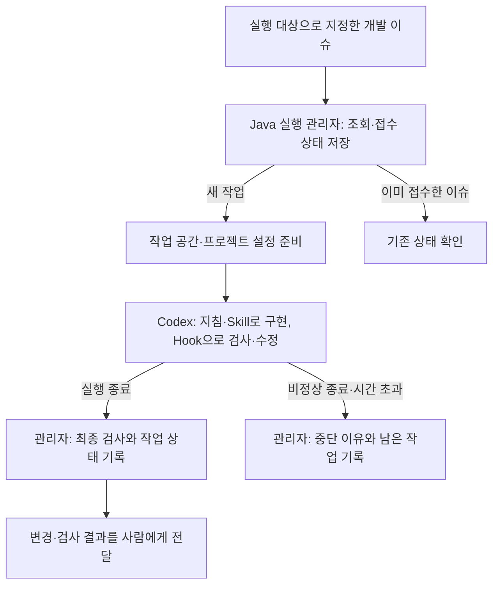

# 12주차 — AI 파이프라인·에이전트 통합 구현

> 이 README가 이번 주차의 상세 학습 본문입니다. 루트 `CURRENT_WEEK.md`는 여기로 돌아오는 짧은 대시보드입니다.

- 기본 작업 폴더: [`incident_desk`](incident_desk/)
- 전체 과정: [루트 README](../README.md)
- 현재 위치와 다음 명령: [CURRENT_WEEK](../CURRENT_WEEK.md)


## 이번 주의 문제 — IT 문의를 운영팀이 처리할 수 있는 요청으로 바꾸기

직원이 “접속이 안 돼요”라고 문의합니다. 담당자는 어떤 서비스인지 다시 묻고, 서비스 상태 화면과 운영 문서를 확인합니다. “VPN 인증서 만료”라는 답을 받으면 오류 내용과 발생 시각을 정리해 운영팀에 전달합니다. 직원이 나중에 “VPN이 아니라 통합 로그인 문제예요”라고 정정하면 확인할 자료도 바뀝니다.

현재 업무의 불편은 **자유로운 문의, 서비스 상태, 운영 문서, 전달할 요청이 따로 떨어져 있다는 것**입니다. 같은 정보를 옮겨 적는 동안 대상을 혼동하거나 오래된 상태로 요청을 보낼 수 있습니다. 이번에는 이 과정을 하나의 앱으로 연결합니다. 목표는 **업무에서 필요한 처리를 찾아 전체 흐름을 설계하고, 배운 기술을 적용한 효과를 실제 결과로 판단하는 것**입니다. Day 5의 후속 변경은 개발 이슈로 등록하고, 외부 실행 관리자가 그 이슈를 감지해 프로젝트의 개발 설정을 사용하는 Codex 작업을 시작하도록 연결합니다.

다음은 만들 앱의 업무 요구입니다. 사례와 자료는 모두 가상입니다.

- 직원은 자연어로 문의하고 빠진 정보를 이어서 알려 줄 수 있습니다.
- 앱은 현재 서비스 상태와 관련 운영 문서를 함께 보여 주고 대응 초안을 만듭니다.
- 여러 서비스 중 일부만 확인되어도 확인된 내용은 전달합니다.
- 담당자가 초안을 검토·편집한 뒤 작업 요청으로 저장합니다. 운영팀의 별도 도구에서 그 요청을 읽을 수 있어야 합니다.
- 검토 중 대상이나 서비스 상태가 바뀌면 새 사실로 다시 검토합니다. 저장 응답을 놓치고 재시도해도 같은 요청이 중복 생성되지 않아야 합니다.

`incident_desk/data/`의 제공 자료로 업무 흐름을 설계합니다. Day 1~5 동안 하나의 앱을 발전시킵니다. 참고 구현의 클래스 배치는 한 가지 예입니다. AI와 요구를 검토해 다른 구조를 선택해도 입력부터 결과까지 위 흐름이 이어져야 합니다.

### AI를 맡길 곳을 고르는 기준

서비스 ID로 상태를 조회하거나 검토한 본문을 저장하는 일은 코드로 처리할 수 있습니다. 모델이 유용할 것으로 보는 부분은 “사내망 연결이 계속 끊겨요” 같은 표현을 서비스와 증상으로 해석하고, 서로 다른 자료를 읽어 문의에 맞는 초안을 작성하는 일입니다. 이는 실습 전에 세우는 예상이며 실제 실행으로 확인합니다.

입력을 서비스 선택창과 오류 코드로 충분히 받을 수 있다면 정형 입력이 더 간단할 수 있습니다. 문서가 한 개이고 대응도 고정되어 있다면 문서 링크를 보여 주는 것으로 충분할 수 있습니다. 이번 요구는 자유로운 설명·추가 질문·여러 자료의 조합을 포함하므로 모델을 적용해 보고, 잘못된 해석을 고치는 부담까지 함께 살펴봅니다.

## 먼저 전체 흐름을 그려 보기

제공 입력 “VPN이고 인증서 만료 메시지가 나와요”는 아래와 같이 처리할 수 있습니다. 이는 자료에서 도출한 예상입니다.

```text
문의 + 이 대화의 앞선 접수
  → 서비스·증상 파악 → 대상이 없으면 질문하고 대기
  → VPN 현재 상태 조회
  → VPN 운영 문서 검색
  → 현재 상태·출처·대응 초안 표시
  → 담당자가 수정하고 저장 선택
  → 현재 상태 재확인·같은 요청 중복 확인 → 작업 요청 저장
  → 운영 도구에서 저장된 요청 조회
```

`services.json`의 VPN에는 공통 장애 공지가 없습니다. `runbooks.json`의 `RB-VPN-CERT`에는 인증서 만료라면 운영팀에 갱신 안내를 요청하라고 되어 있습니다. 따라서 “공통 장애는 확인되지 않으며, 인증서 만료 메시지에 대해 갱신 안내가 필요하다”는 방향으로 초안을 만들 수 있습니다. 공통 장애가 없다는 정보만으로 개인 연결도 정상이라고 결론 내릴 수는 없습니다.

### 필요한 연결과 배운 기술의 역할

| 업무에서 필요한 일 | 적용할 지식·기술 | 적용 후 확인할 변화 |
|---|---|---|
| 자유로운 표현에서 대상·증상 추출 | 프롬프트, 모델 호출, 구조화 출력 | 코드가 읽을 서비스 목록과 추가 질문이 만들어지는가 |
| 문의 앱과 운영 도구가 같은 업무 기능 사용 | MCP 서버·클라이언트, 도구 입출력 | 두 프로그램이 같은 서비스 상태와 저장 결과를 읽는가 |
| 문의에 맞는 문서 확보 | 임베딩, 검색 범위, RAG, 근거 검사 | 서비스별 원문이 초안에 전달되고 출처와 설명이 맞는가 |
| 필요한 문서를 추가로 찾기 | Tool Calling, 에이전트 반복 실행, LangChain4j | 모델의 검색 요청이 실행되고 결과를 받아 초안을 완성하는가 |
| 정보 보충·정정과 일부 실패 처리 | 상태·분기·재개, Workflow 설계 | 이어 말한 내용을 반영하고 확인한 항목을 잃지 않는가 |
| 검토한 내용만 운영팀으로 전달 | 구조화 결과와 후속 처리, 쓰기 도구 | 생성과 저장이 구분되고 편집한 본문이 실제로 전달되는가 |
| AI와 구현하고 변경을 확인 | 작업 지침, Skill, 작업 분담, 하네스, 개발 방식 비교 | 요구를 바꿀 때 관련 코드·검사·실제 결과를 함께 확인하는가 |
| 개발 이슈를 받아 변경 작업 시작 | 외부 실행 엔진, 이슈 조회, 작업 상태와 중복 실행 방지 | 이슈 등록 뒤 직접 개발 요청을 옮기지 않아도 작업이 시작되고 결과가 연결되는가 |

Skill과 작업 지침은 개발 AI가 이 앱을 만드는 방법에 사용합니다. MCP는 업무 기능의 연결에, RAG는 모델에 줄 자료를 마련하는 데 사용합니다. Workflow는 처리 순서와 분기를 정하는 방법이고, 에이전트는 그중 모델이 다음 도구를 선택하는 구간에 해당합니다.

직원의 “VPN 인증서가 만료됐어요”는 완성할 앱에 들어가는 업무 문의입니다. “검토 중 서비스를 정정하면 오래된 검토본의 저장을 막아 주세요”는 이 앱의 코드를 바꾸는 개발 이슈입니다. 업무 앱은 첫 요청을 접수·조회·검색·검토·저장으로 처리하고, 개발 실행 관리자는 두 번째 요청을 Codex에 전달해 코드와 검사를 변경합니다.

## 제공 자료와 실행

`week12-ai-agent-integration/incident_desk`를 IDE에서 Gradle 프로젝트로 열고 Java 17 이상으로 의존성을 동기화합니다. 실행 설정의 작업 폴더는 `incident_desk`입니다.

| 위치 | 역할 |
|---|---|
| `data/services.json` | VPN·SSO·MAIL의 현재 상태와 변경 번호 `revision` |
| `data/runbooks.json` | 서비스별 운영 문서의 ID·제목·본문 |
| `data/cases.json` | 정상·질문·정정·일부 실패·저장·상태 변경의 제공 입력과 판단 기준 |
| `src/main/java/lab/desk/DeskApp.java` | IDE 콘솔에서 문의와 검토 후 저장을 실행하는 진입점 |
| `IncidentFlow.java`, `ReviewDesk.java` | 조회·생성의 처리 흐름과 검토·저장 분리 |
| `ModelWork.java`, `EvidenceSearch.java` | 실제 LangChain4j AI Services와 검색 |
| `OperationsServer.java`, `OperationsClient.java`, `OperationsStore.java` | 실제 MCP 연결과 공유 업무 기능 |
| `src/test/java/lab/desk/IncidentDeskTest.java` | 대역 모델과 임시 자료로 확인하는 처리·저장·MCP 연결 검사 |

LangChain은 모델·도구·검색을 연결하는 프레임워크입니다. 여기서는 Java에서 이 역할을 수행하는 LangChain4j를 사용합니다. `AiServices`는 출력 변환과 모델의 도구 요청 → 실행 → 결과 전달 → 재호출을 연결하고, `InMemoryEmbeddingStore`는 임베딩과 원문을 저장·검색합니다. 업무의 저장 조건과 대화별 처리는 앱이 정합니다.

### 실행 모드와 입력

`DeskApp.main`을 실행하면 기본값은 대역 모드입니다. 제공 문의에 대한 준비된 모델 응답과 벡터를 써서 연결을 확인합니다. 검색과 MCP, 저장 코드는 실제로 실행됩니다. 자연어 이해·임베딩 의미·초안 품질은 실제 모델 실행에서 판단합니다.

IDE 콘솔에 다음을 입력합니다.

```text
a|접속이 안 돼요
a|VPN이고 인증서 만료 메시지가 나와요
b|VPN이 끊기고 통합 로그인도 느려요
/quit
```

결과의 `analysis.items`에서 서비스별 상태·출처·초안을, `trace`에서 실제 업무 조회와 검색 호출을 확인합니다. `modelCalls`는 이번 발언을 처리하면서 수행한 모델 호출 수입니다. 대화 상태와 미저장 검토본은 앱 실행 중 메모리에 있고, 저장한 요청은 `.local/requests`에 남습니다.

실제 실행은 IDE 실행 설정에 `OPENAI_API_KEY`, `OPENAI_MODEL`, `OPENAI_EMBEDDING_MODEL`을 지정하고 프로그램 인수 `--live`로 시작합니다. 이 참고 구현은 OpenAI 어댑터를 사용합니다. 다른 제공자를 선택하면 모델·임베딩 연결을 바꾸고 같은 업무 입력으로 다시 확인합니다. 실제 키가 필요한 실행은 학습자가 IDE에서 수행합니다.

주차 노트 한 곳에 선택한 구조·예상·대표 결과와 해석을 누적합니다. 참고 구현을 먼저 실행해 흐름을 살펴보거나, 자료와 요구부터 AI와 구현한 뒤 참고 코드와 비교할 수 있습니다. 각 Day의 요구를 자기 구현에서 추적하고 변경한 결과가 학습 근거가 됩니다.

### 이번 주에 사용할 개발 환경

11주차에서 만든 지침·Skill·검사·Hook·재개 연결을 이 앱에 맞춥니다. 개발 AI는 현재 업무 요청과 프로젝트의 코드·설명을 읽고 필요한 조건과 검사를 정합니다. 앱의 MCP는 실행 중인 문의 앱에 서비스 상태 조회와 작업 요청 저장 기능을 제공합니다.

| Day | 제품을 구성하는 개념 | 개발 환경에서 확인할 일 |
|---|---|---|
| 1 | 파이프라인·역할 분리·MCP 조회 | 프로젝트 지침·Skill·업무 검사를 맞추고 Hook 발동 확인 |
| 2 | 프롬프트·구조화 출력·대화 상태 | 정보 보충과 대화 분리 사례로 변경 검사, 중간 인계 후 재개 |
| 3 | RAG·Tool Calling·에이전트 | 검색 경로 변경 전 예상과 검사 범위를 정하고 실제 모델 결과 해석 |
| 4 | 사람의 검토·쓰기·재요청 | 저장 조건에 맞는 검사와 도구 공개 범위를 함께 검토 |
| 5 | 정정·부분 성공·상태 변화 | 개발 이슈 감지·자동 시작, 실행 상태 관리, 전체 흐름 검사 |

이 프로젝트의 Gradle `test`는 대역 모델과 임시 업무 자료로 검사하며 결과는 `build/test-results/test`에 남깁니다. 만든 하네스에서 검사 작업·작업 폴더·결과 위치를 이 앱에 맞춰 정합니다. 실제 모델의 표현 해석과 검색 품질은 IDE의 `--live` 실행에서 확인합니다. 자동 검사에 실제 키가 필요한 프로그램 실행을 넣지 않습니다.

## Day 1 — 흩어진 업무를 연결할 구조 정하기

### 개념 — 파이프라인과 책임 나누기

파이프라인은 입력을 결과로 바꾸는 처리들의 연결입니다. 이 사례에서는 문의를 읽는 일, 사실을 가져오는 일, 근거를 찾는 일, 초안을 쓰는 일, 저장하는 일을 나눌 수 있습니다. 나누는 이유는 변경되는 조건이 다르기 때문입니다. 모델을 바꿔도 업무 저장 규칙은 유지할 수 있고, 서비스 자료의 위치가 바뀌어도 문장을 해석하는 지침은 그대로 쓸 수 있습니다.

먼저 사람이 수행하던 경로를 따라가 봅니다. VPN 문의를 읽고 상태 자료와 VPN 운영 문서를 찾아, 어떤 사실과 문장을 요청에 남길지 생각합니다. 이 과정에서 필요한 입력은 서비스·증상이고, 결과에는 상태·근거·다음 행동이 함께 있어야 한다는 점이 드러납니다. 서비스가 없는 문의에는 곧바로 초안을 만드는 대신 질문해야 합니다.

### 구조 선택 — 고정 순서와 에이전트

대상을 알면 언제나 상태와 운영 문서를 찾는다면 코드가 검색을 호출하는 고정 흐름이 간단합니다. 증상에 따라 검색어를 바꾸거나 추가 자료가 필요할지 판단해야 한다면 모델에 검색 도구를 줄 수 있습니다. 이 구간에서는 모델 → 검색 요청 → 도구 결과 → 모델의 반복이 생깁니다. 에이전트가 있어도 사람의 저장 확인 같은 필수 순서는 앱이 정합니다.

참고 구현은 두 검색 경로를 같은 앱에서 선택합니다. Day 3에 같은 입력으로 차이를 확인한 뒤 기본 경로를 정합니다. 처음부터 에이전트가 유리하다고 가정하지 않고 검색에 필요한 유연성과 호출·검토 부담을 함께 봅니다.

### 구현 — 공유 업무 기능부터 연결하기

문의 앱은 현재 서비스 상태가 필요하고, 운영 도구는 검토 후 전달된 요청을 읽어야 합니다. 이 요구에서 상태 조회·검토한 요청 저장·저장 결과 조회라는 기능을 도출합니다. 앱 내부 함수는 같은 프로그램 안에서 기능을 사용할 때 간단하고, 일반 API는 다른 서비스의 정해진 기능을 호출할 때 사용할 수 있습니다. MCP는 이런 업무 기능을 도구 설명·입력 형식과 함께 공개하고 MCP 클라이언트가 도구 목록을 확인해 호출하는 연결에 사용할 수 있습니다. [MCP 구조와 도구 안내](https://modelcontextprotocol.io/docs/learn/architecture)

이번에는 업무 기능을 MCP 서버로 공개해 문의 앱과 별도 운영 도구에서 사용합니다. 기존 업무 API가 있다면 서버가 그 API를 호출하도록 연결할 수 있습니다. 제공 JSON은 서비스와 운영 문서의 가상 원본이며, 업무 기능의 입출력과 오류를 설계하는 데 사용합니다. 어떤 연결을 선택하든 조회 결과의 의미와 저장을 허용할 조건은 업무 요구에서 정합니다.

이번 Day에는 `get_service_status(serviceId)`로 조회부터 연결합니다. 이 호출은 앱 코드가 실행할 수 있습니다. `OperationsClient.main`의 프로그램 인수를 `get VPN`으로 실행하면 실제 MCP 초기화·도구 호출·결과 반환을 확인합니다. 인수 없이 실행하면 서버가 공개한 도구 목록을 읽습니다. 모델이 선택할 도구와 앱이 정해진 시점에 호출할 기능은 따로 정합니다. 대상 서비스가 확정되면 필요한 상태를 순서대로 조회하고, 저장은 사람의 확인 뒤 실행하는 구성을 다음 Day에서 연결합니다.

앱의 다음 구조와 개발 방법을 AI와 정합니다. 11주차에서 만든 개발 환경을 이 프로젝트에 맞게 연결합니다. 예를 들어 프로젝트 지침에는 “문의 처리 중에는 저장하지 않는다”, “서비스별 근거를 섞지 않는다”, “변경한 처리의 제공 입력과 검사 결과를 확인한다”를 적을 수 있습니다. 하네스는 이런 지침·실행 진입점·검사를 개발 AI가 반복해서 사용할 수 있게 묶은 환경입니다. IDE의 테스트 실행 또는 Gradle `test`를 확인 경로로 연결합니다.

IDE에서 `docs/project.md`와 업무 자료를 읽고, 11주차에서 만든 구성의 어느 부분을 재사용할지 정합니다. CSV 셀 표현을 확인하던 Skill은 서비스별 사실·근거·검토 후 저장을 살피는 절차로 바꿉니다. 예를 들어 “문의에 서비스가 없으면 물어봐야 한다”는 요구에서 서비스 미지정 입력과 추가 질문 결과를 검사로 연결합니다. 참고 앱의 `data/cases.json`은 실행에 사용할 문의와 판단 기준을 제공합니다. 자기 구현의 출력과 확인할 조건은 선택한 구조에 맞춥니다.

검사 판정과 재시도 정책은 재사용할 수 있지만, CSV 프로젝트의 `acceptance` 명령과 결과 위치를 그대로 쓰면 이 앱을 검사하지 못합니다. 실행 대상·검사 작업·제한 시간·결과 위치를 이 앱에 맞춰 설정하고, 시작 Hook이 읽을 설명과 인계 위치도 바꿉니다. 재사용할 코드가 특정 CSV 경로에 묶여 있으면 그 경로를 입력이나 설정으로 받을 수 있게 수정합니다.

선택한 실행 진입점으로 Hook을 등록합니다. 명령·인수는 11주차에서 만든 실행 형태에 맞추고, 새 개발 세션에서 적용된 지침·Skill과 `/hooks`의 연결을 확인합니다. 종료 검사의 결과 경로와 시작 시 받은 문맥이 이번 앱을 가리키는지 봅니다. 앱의 업무 MCP 서버는 `OperationsClient`가 별도로 시작합니다. 문의에서 나온 서비스 ID가 MCP 입력으로 전달되고 반환된 상태가 다음 처리에 쓰이는 경로를 읽습니다.


```text
제공 IT 문의 업무와 자료를 읽고 입력부터 운영팀 전달까지 필요한 처리를 설명해 줘.
한 문의를 사람이 처리하는 예에서 모델·일반 코드·검색·MCP·검토 단계가 맡을 일을 도출해 줘.
고정 검색과 모델이 선택하는 검색의 예상 차이, Java Workflow와 Dify를 고르는 조건도 설명해 줘.
실제 요구를 근거로 구조와 개발 지침·검사 방법을 추천하면 내가 수용하거나 바꿀 부분을 말할게.
앱 내부 함수·일반 API·MCP가 적합한 조건과, 이 업무에서 공개할 기능·입출력·오류 처리를 설명해 줘.
그 의견을 반영해 프로젝트 지침·Skill·Hook 검사를 이 앱에 연결하고 앱의 골조와 MCP 서비스 조회를 구현하자.
업무 MCP 호출의 주체와 시점을 정하고 VPN 조회가 어떤 프로세스에서 실행되는지 확인하자.
공개 도구 목록과 VPN 조회 결과를 확인하고 입력이 어떤 코드를 거쳐 결과로 오는지 보여 줘.
```

완료 기준은 **필요한 역할과 연결 방식을 선택한 이유를 설명하고, 실제 MCP 조회 경로를 확인한 것**입니다. 노트에는 선택한 구조와 그 이유를 남깁니다. 개발 세션에서는 맞춘 지침·Skill·종료 전 검사가 이 앱에 적용되는지 확인합니다.

## Day 2 — 자연어 문의를 이어 받는 접수 만들기

### 개념 — 구조화 출력과 대화 상태

“접속이 안 돼요”에는 서비스가 없습니다. 모델의 결과를 `serviceIds=[]`, `symptom="접속 불가"`, `question="어떤 서비스에서 발생했나요?"`처럼 받으면 앱은 질문하고 기다릴 수 있습니다. 다음 발언을 이전 접수와 함께 전달하면 대상이 채워집니다. 구조화 출력은 앱이 다음 처리를 고를 수 있게 값을 정리하는 방법입니다. 형식이 맞아도 해석이 맞는지는 실제 발언과 대조해야 합니다.

참고 구현은 원시 대화 전체 대신 접수 결과를 대화 ID별로 보관합니다. 다음 호출에는 이전 접수와 새 발언을 보냅니다. 필요한 정보를 작게 유지할 수 있지만 이전 오류 메시지를 지워 버리지 않는지 확인해야 합니다. 대화 전문이 필요한 업무라면 메시지를 유지하고 요약·절단 정책을 별도로 정할 수 있습니다.

### 설계와 실행

접수 뒤 서비스 목록을 코드가 순회해 MCP를 호출합니다. 서비스 ID가 정해졌고 모든 대상의 상태가 필요하므로 이 조회 순서를 모델이 다시 선택하게 할 이유는 적습니다. 6주차의 출력 변환과 7주차의 상태·분기를 적용하는 위치입니다. LangChain4j는 `Reception.receive` 결과를 `Intake`로 변환하고, 앱은 대상·중복·질문 유무를 확인합니다. 참고 구현의 타입 변환은 제공자에게 엄격한 JSON Schema를 강제하는 기능과는 구별합니다.

`a|접속이 안 돼요` → `a|VPN이고 인증서 만료 메시지가 나와요`를 실행합니다. 별도 대화 `b|인증서 만료 메시지가 나와요`에서는 a의 VPN 정보가 넘어오면 안 됩니다. 실제 모델에서는 “사내망 연결이 자꾸 끊겨요”처럼 표현을 바꿔 대상과 증상 해석도 확인합니다.

```text
Day 1에서 고른 구조에 자연어 접수와 대화별 상태를 연결하자.
제공 입력에서 필요한 출력 필드와 보관할 정보를 추천하고, 질문 후 재개 경로를 예로 설명해 줘.
내 의견을 반영해 실제 모델 연결과 MCP 조회를 구현해 줘.
같은 대화의 정보 보충, 다른 대화의 같은 발언, 대상 정정을 실행하고 입력·접수·조회 결과를 대조하자.
대역으로 확인한 값 전달과 실제 모델로 확인할 표현 해석을 구별해 줘.
현재 상태 구조·확인한 사례·남은 선택을 인계 메모에 남기고 개발 세션을 한 번 재개하자.
재개 후 현재 코드와 메모를 대조하고 Hook 검사 결과를 확인해 줘.
```

완료 기준은 **모델의 해석이 실제 조회로 이어지고, 추가 질문 후 같은 문의를 계속 처리하며, 대화가 섞이지 않는 것**입니다. 상태 조회만으로 대응 방법까지 알 수 있는지는 다음 Day의 원문과 연결해 판단합니다.

## Day 3 — 상태와 운영 문서를 묶어 대응 초안 만들기

### 개념 — 이 문제에서 RAG가 하는 일

서비스 상태는 지금 어떤 공통 문제가 있는지 알려 줍니다. 운영 문서는 어떤 정보를 확인하고 어떻게 전달해야 하는지 알려 줍니다. RAG는 관련 문서를 찾아 모델의 입력에 넣는 과정입니다. 모델이 기억하는 일반적인 VPN 설명 대신 조직의 운영 방법을 초안에 사용할 수 있게 합니다.

참고 구현은 짧은 운영 문서를 문서 단위로 임베딩합니다. `EvidenceSearch`는 임베딩 검색 후 요청한 서비스의 결과만 남기고 최대 2개를 전달합니다. 제공 문서가 4개라 전체 후보를 받아 서비스 범위를 거릅니다. 문서가 많아지면 저장소 단계의 필터와 후보 수를 조정해야 합니다. 이 서비스 필터는 문서 선택 조건이며 실제 서비스의 접근 권한 검사를 대신하지 않습니다.

VPN의 일반 연결 오류 문서와 인증서 만료 문서는 같은 서비스지만 필요한 증상이 다릅니다. “VPN이 자꾸 끊겨요”와 “VPN이고 인증서 만료 메시지가 나와요”에서 검색 순위와 초안이 사용한 출처를 대조합니다. 서비스만으로 범위를 정한 뒤에도 증상에 맞는 문서를 골라야 함을 확인할 수 있습니다.

최소 점수 0.65는 참고 실행의 시작값입니다. 임베딩 모델이 바뀌면 같은 점수가 같은 품질을 뜻하지 않습니다. 예컨대 정확한 오류 코드 `CERT-EXPIRED`를 찾기 어렵다면 8주차의 BM25와 임베딩 검색을 결합하는 선택이 생깁니다. 반대로 지금처럼 문서가 적고 서비스가 확정됐다면 서비스별 문서 직접 조회도 가능합니다. 무엇을 적용할지는 원문을 놓치는 실제 질문을 보고 정합니다.

### 설계 비교 — 누가 검색을 호출할까

`--fixed` 경로에서는 접수 뒤 코드가 서비스와 증상으로 검색합니다. 기본 경로에서는 `ModelWork.SearchTool.find_runbook`을 모델에 공개합니다. 모델이 검색을 요청하면 AI Services가 실제 검색 함수를 실행하고 결과를 다시 모델에 전달합니다. 모델의 마지막 응답을 받을 때까지 반복하며, 접수부터 합산한 모델 호출은 사용자 발언당 최대 6회입니다. 임베딩 호출은 이 모델 호출 수에 포함되지 않습니다.

`CompareFlows.main`을 실행하면 같은 입력을 두 경로에 보냅니다. 기본 입력은 “VPN이 자꾸 끊겨요”이며, 실제 모델 비교는 인수 `--live`로 실행합니다. 입력을 바꾸려면 인수에 문의 문장을 하나의 문자열로 지정합니다. 바뀌는 요소는 **검색을 호출할 주체와 검색어 선택 방법**입니다. 자료·임베딩·출력 검사 기준은 같습니다.

대역의 VPN 사례에서는 고정 흐름은 접수와 작성 2회, 에이전트 흐름은 검색 요청을 포함해 3회의 모델 호출을 사용하도록 준비되어 있습니다. 실제 모델의 횟수와 질의는 실행에서 확인합니다. 에이전트가 같은 자료를 한 번 더 돌아 얻었다면 고정 흐름이 충분할 수 있습니다. 증상에 맞게 질의를 바꿔 빠진 문서를 찾았다면 그 유연성이 도움이 된 지점입니다.

### 결과 해석 — 출처가 맞는 것과 설명이 맞는 것

앱은 반환된 출처 ID가 실제 검색 결과에 있고 해당 서비스의 문서인지 검사합니다. 이 검사는 다른 서비스의 출처를 섞는 일을 줄입니다. 그러나 ID가 맞아도 “갱신 완료”처럼 원문에 없는 사실을 문장으로 쓸 수 있습니다. `RB-VPN`·`RB-VPN-CERT`와 실제 초안을 대조해 요청해야 할 일과 이미 완료된 일을 구별했는지 읽습니다.

근거가 없으면 상태 조회 결과를 남기고 대응 방법은 검토가 필요하다고 표시합니다. 모델이 더 검색하는 선택을 할 수 있지만, 계속 반복하면 호출 한도에서 종료합니다. 남은 문제를 반환해야 사용자가 다음 행동을 정할 수 있습니다.

```text
현재 문의 처리에 운영 문서 검색과 초안 작성을 연결하자.
VPN 공통 상태와 RB-VPN-CERT의 인증서 안내가 각각 어떤 문장을 뒷받침하는지 먼저 설명해 줘.
문서 분할·서비스 필터·후보 수·근거 부족 처리에 대한 추천을 듣고 내가 선택할게.
같은 입력에서 고정 검색과 모델의 검색 선택을 비교할 수 있게 연결해 줘.
두 경로의 검색어·출처·모델 호출·초안을 확인하고 더 적절한 기본 경로를 정하자.
근거가 없는 경우와 잘못된 서비스 출처도 검사하고, 출처 검사로 잡을 수 없는 문장 오류는 원문과 대조하자.
```

완료 기준은 **사실과 문서를 함께 사용하는 초안을 얻고, 같은 입력의 두 검색 경로를 근거로 구조를 선택한 것**입니다. 노트에는 실제 차이와 선택 이유를 남깁니다.

### 개발 환경에서 확인하기

검색 결과가 없거나 다른 서비스의 근거가 섞였을 때 기대하는 응답을 업무 요구에서 정하고 검사합니다. 고정 검색과 에이전트를 비교하기 전에 어떤 요소를 바꿀지 정하고 그 변경을 담당할 코드와 검사를 함께 선택합니다. Hook의 대역 검사 통과 뒤 실제 모델 결과를 별도로 대조합니다. 실제 실행에서 새로운 실패 입력을 발견하면 그 동작을 재현할 업무 검사를 추가합니다.

## Day 4 — 검토한 요청을 운영팀에 전달하기

### 개념 — 생성 결과를 업무의 다음 행동에 연결하기

초안은 작업 요청의 재료입니다. 담당자가 내용을 읽고 발생 시각을 보충하거나 문장을 고친 뒤 저장을 선택해야 운영팀에 전달할 요청이 됩니다. 앱은 `ready` 항목의 초안과 근거를 보여 주고, 사람이 확인한 본문을 MCP `save_work_request`로 저장합니다. 생성 모델에는 이 쓰기 도구를 공개하지 않습니다. 업무 요구가 검토 후 전달이기 때문에 선택한 처리 순서입니다.

여기서 9주차의 Workflow가 연결됩니다. 준비됨 → 검토 대기 → 명시적 저장 → 저장 결과 표시의 분기는 Java 코드로도, Dify의 조건 분기와 외부 호출로도 구현할 수 있습니다. 이번 참고 구현은 Java의 `ReviewDesk`가 맡습니다. 업무 담당자가 분기를 화면에서 자주 바꿔야 한다면 Dify가 적합할 수 있습니다. 그 경우 첫 Workflow는 `conversationId`, `text`를 받아 `previewId`, `canSave`, `items`, `text`를 반환하고, 검토 화면의 별도 저장 요청이 `previewId`, `requestId`, `reviewedText`를 전달하도록 나눕니다. 한 실행에서 초안 생성 직후 저장 도구로 바로 이어 붙이면 사람의 확인이 빠집니다.

### 저장 결과와 재시도

`requestId`는 같은 저장 시도를 구별하는 값입니다. 같은 ID와 같은 내용을 재전송하면 이미 저장한 ID를 돌려주고, 같은 ID로 다른 내용을 보내면 충돌을 알립니다. `OperationsStore`가 요청 ID와 내용을 대조하므로 응답을 놓친 뒤 같은 저장을 다시 요청해도 하나의 저장 건을 반환합니다.

먼저 `a|VPN이 자꾸 끊겨요`로 초안을 만듭니다. 담당자가 추가로 “오전 9시 인증서 만료 메시지”를 확인한 가상 상황을 적용합니다. 출력의 원문과 상태를 검토하고, 출력 최상위의 `id`를 아래 `<검토ID>`에 넣어 저장합니다.

```text
/save|a|<검토ID>|it-001|VPN 연결 끊김. 오전 9시 인증서 만료 메시지 확인. 갱신 안내 요청.
```

검토 ID는 방금 읽은 초안을 가리킵니다. 대상을 정정한 뒤 이전 명령을 다시 보내면 이 ID로 오래된 검토본을 구별합니다. 콘솔의 `/save` 입력이 담당자의 명시적 저장 동작입니다. 반환된 `id`를 복사해 별도 실행 설정의 `OperationsClient.main`에 `read <저장ID>`로 전달합니다. 두 프로그램은 실제 MCP를 통해 같은 저장소를 사용합니다. 저장한 본문이 편집한 내용과 같은지 확인한 뒤 같은 저장 입력을 재전송합니다. 같은 `it-001`로 본문만 바꿔 충돌도 확인합니다. 앱을 다시 실행해도 운영 도구에서 저장 요청을 읽을 수 있습니다.

```text
초안을 사람이 검토·편집한 뒤 운영팀에 전달하는 요구를 연결하자.
현재 구현에서 Workflow 분기를 누가 관리할지 추천하고 Java 처리와 Dify가 적합한 조건을 설명해 줘.
선택한 한 경로로 미리보기와 저장을 분리하고 MCP 쓰기 기능을 연결해 줘.
생성만 했을 때 저장되지 않는지, 수정한 본문이 별도 운영 도구에 전달되는지 실행하자.
같은 요청 재전송과 다른 본문 충돌도 확인하고, 저장 응답을 놓쳤을 때 다음 행동을 정리하자.
```

완료 기준은 **검토한 내용이 실제로 저장되고 다른 도구에서 읽히며, 재시도 결과를 해석한 것**입니다. 편집한 본문과 운영 도구에서 읽은 본문을 대조합니다.

### 개발 환경에서 확인하기

사람이 검토·편집한 내용만 저장한다는 조건을 개발 지침과 검사에 반영합니다. 앱이 사용하는 쓰기 도구에서 저장을 허용하는 주체와 시점을 코드로 확인합니다. 쓰기 결과 확인은 임시 자료로 반복할 수 있는 MCP 검사에 연결합니다. 이 변경 뒤 Hook이 실행한 결과에서 검토·저장·재시도 중 무엇이 확인됐는지 설명합니다.

## Day 5 — 상황이 바뀌어도 업무가 이어지게 고치기

### 후속 요구 — 여러 대상과 검토 중 변경

운영팀은 “여러 서비스가 섞여 있고, 문의를 검토하는 동안 서비스 상태도 달라진다”고 알려 왔습니다. 일부를 확인하지 못했다고 확인한 정보까지 버리면 담당자는 처음부터 다시 조사해야 합니다. 반대로 이전 초안을 그대로 저장하면 정정 전 서비스나 오래된 장애 공지를 전달할 수 있습니다.

서비스별 상태·근거·초안을 따로 보관하면 확인된 항목만 요청으로 만들 수 있습니다. 참고 구현에서 `partial`은 일부 항목만 준비됐다는 뜻입니다. 담당자는 `ready` 항목으로 구성된 저장 본문과 미처리 항목을 함께 확인합니다. “VPN과 급여 시스템이 안 돼요”는 VPN은 확인되고 급여 시스템은 자료에 없는 제공 사례입니다.

대상 정정 뒤에는 이전 검토본을 무효로 합니다. 또 `services.json`의 `revision`과 내용을 변경하면 저장 직전에 조회한 사실이 달라집니다. `stale_facts`이면 새 상태를 확인해 초안을 다시 검토합니다. 참고 구현의 재확인은 정적인 학습 자료를 대상으로 합니다. 실제 업무 DB에서는 변경 번호 확인과 쓰기를 같은 트랜잭션으로 묶어 재확인 직후의 변경도 처리해야 합니다.

### 변경 전 예상 → 구현 → 확인

다음 사례를 기존 앱에 적용합니다. 참고 구현에는 결과를 비교할 수 있는 처리와 검사가 들어 있습니다. 자기 구현에서 필요한 상태와 검사 위치를 선택하고 같은 입력으로 확인합니다.

1. “VPN과 급여 시스템이 안 돼요”에서 확인된 VPN만 전달하고 급여의 미처리를 표시합니다.
2. VPN 문의 뒤 “VPN이 아니라 통합 로그인 문제예요”로 정정합니다. 새 출처가 SSO로 바뀌고 이전 검토본으로 저장되지 않아야 합니다.
3. VPN 초안 생성 후 IDE에서 가상 상태 자료의 VPN 상태와 `revision`을 바꿉니다. 기존 사실로 저장하면 재확인을 요구하고, 다시 문의·검토한 뒤에는 저장됩니다. 실행 후 제공 자료로 되돌립니다.
4. 제공 검사에서 조회 오류, 근거 없음, 반복 검색 한도를 확인합니다. 종료되더라도 이미 확인한 상태와 처리하지 못한 부분을 구별합니다.

위 사례 중 현재 구현에서 바꿀 부분을 AI와 확인하고, 업무 선택과 기대 결과를 먼저 합의합니다. 그 변경을 아래 개발 이슈의 본문으로 사용합니다. Day 1에서 구성한 개발 지침·Skill·검사를 외부에서 시작한 Codex에도 연결합니다. 관련 코드·원문·문의가 실제 차이와 원인 확인으로 이어지는지 보고, 제안한 영향 범위와 실제 변경을 대조합니다.

작업을 나누는 경우에는 예를 들어 상태 변경 검토와 검색 근거 검토를 독립적으로 맡기고, 구현은 정해진 입력·결과와 통합 사례를 기준으로 합칩니다. 같은 파일을 동시에 수정한다면 Worktree로 작업 내용을 분리할 수 있습니다. 각 작업에 필요한 정보와 통합할 결과를 정합니다. 선택한 개발 방식을 적용하고, 제안한 변경 범위와 실제 수정·검사 결과를 대조합니다.

```text
현재 앱에 여러 서비스의 일부 성공과 검토 중 대상·상태 변경 요구를 적용하려고 해.
기존 상태와 저장 흐름에서 무엇이 잘못될 수 있는지 실제 코드와 입력으로 설명하고 변경 위치를 추천해 줘.
내 의견을 반영해 기대 결과와 필요한 변경을 개발 이슈 본문으로 정리하자.
기능 변경은 아래에서 구성할 외부 실행 관리자가 이 이슈를 받아 시작하도록 준비해 줘.
```

### 개발 이슈에서 작업을 시작하는 외부 실행 관리자

**이슈 감지**는 지정한 저장소에서 실행 조건에 맞는 개발 요청을 찾는 일입니다. 일정 간격으로 목록을 읽는 방식을 폴링이라고 합니다. **작업 접수**는 발견한 이슈를 실행 대상으로 기록하는 단계입니다. 실행하기 전에 접수 상태를 저장하면 다음 조회에서 같은 이슈를 다시 보더라도 새 작업으로 시작하지 않을 수 있습니다.

OpenAI의 Symphony는 이슈를 읽어 작업 공간과 에이전트 실행을 준비하고 중단된 실행을 관리합니다. 여기서는 같은 원리를 IT 문의 앱의 개발 이슈 한 건에 적용합니다. 외부 프로그램이 맡을 필요가 생긴 책임은 작업 발견·중복 실행 방지·프로세스 종료 관찰입니다. [Symphony 사례](https://openai.com/index/open-source-codex-orchestration-symphony/)



이번에는 Java 실행 관리자가 한 번에 한 작업을 처리하도록 구성합니다. 5·10주차 엔진의 작업 입력·프로세스 실행·결과 분류를 읽고 재사용할 부분을 선택합니다. 업무 검사 실패의 수정은 Codex와 Hook이 맡고, 관리자는 프로세스 실행과 최종 결과를 관리하는 구성을 추천합니다. 기존 엔진의 검사 실패 재실행은 이 경로에서 끄거나 해당 정책을 분리합니다. 최종 검사는 작업을 검토 대기로 넘겨도 되는지 확인하며, 실패하면 결과와 이유를 남깁니다.

다음 요구에서 보관할 정보와 처리를 도출합니다.

| 요구 | 구성할 처리와 그 이유 |
|---|---|
| 지정한 이슈만 실행 | 저장소와 실행 라벨을 선택하고 시작 직전에도 이슈가 열려 있는지 확인 |
| 같은 이슈를 반복 조회 | 저장소·이슈 번호로 작업을 식별하고 실행 전에 접수 기록 저장 |
| 실행 관리자를 다시 시작 | 로컬 기록을 읽어 완료·검토 대기 작업의 재실행 방지. 실행 중으로 남은 작업은 기존 프로세스를 확인하고 상태가 불명확하면 확인 대기로 전환 |
| Codex가 변경할 환경 준비 | 작업 폴더·기준 코드·지침·Skill·Hook·검사 도구를 연결하고 준비 실패와 업무 실패를 구분 |
| 작업이 정상 종료 | 해당 변경의 최종 검사 결과와 변경 위치를 이슈 번호에 연결해 검토 대기로 기록 |
| 프로세스 비정상 종료·시간 초과 | 실행 중단으로 기록하고 자동 재접수를 막음. 원인과 남은 작업을 확인한 뒤 같은 작업 공간에서 명시적으로 재개 |

추천 상태는 `접수 → 실행 중 → 검토 대기`이며 실행 중단·검사 실패·업무 결정이 필요하면 `확인 필요`로 둡니다. 이름은 선택한 구현에 맞춰 정합니다. 프로세스가 정상 종료했다는 사실만으로 업무 완료를 기록하면 검사가 실패한 변경도 완료로 처리되므로, 실행 결과와 검사 결과를 각각 읽어야 합니다. 접수 기록은 학습 저장소의 `.local/`에 두고 엔진 시작 시 한 실행 관리자만 사용하도록 확인합니다.

### 이슈 조회와 프로젝트 설정 연결하기

이슈는 학습 저장소의 GitHub Issues에 등록합니다. 저장소를 원격에 연결하지 않았다면 같은 학습 자료를 담은 실습 저장소를 준비합니다. 브라우저에서 아래 제공 본문을 읽고 합의한 조건을 반영해 이슈를 작성합니다. `agent-ready` 라벨을 붙인 열린 이슈를 실행 대상으로 삼습니다.

> 제목: IT 문의의 일부 성공과 검토 중 정정 처리
>
> VPN과 자료에 없는 급여 시스템을 함께 문의하면 확인된 VPN과 미처리 대상을 구분해 주세요. 검토 중 VPN을 SSO로 정정하면 예전 검토본으로 저장되지 않아야 합니다. 서비스 상태의 변경 번호가 달라져도 재검토가 필요합니다. 현재 코드에서 필요한 변경과 해당 사례의 검사를 연결하고, 실제 변경 위치와 검사 결과를 반환해 주세요.

위 기능이 이미 완성된 구현에서는 같은 앱의 표시 요구를 사용합니다. “검토 화면에 저장 가능한 서비스 수와 확인이 필요한 서비스 수를 각각 표시해 주세요. VPN과 급여 시스템 입력에서는 각각 1이며, 확인 가능한 서비스만 있으면 확인 필요 수는 0입니다.” 실제 남아 있는 변경 한 건을 선택하고 이미 확인한 기능은 그 변경의 회귀 검사로 사용합니다.

실행 관리자는 GitHub CLI의 JSON 출력을 받아 이슈를 읽을 수 있습니다. CLI는 외부 프로그램이 반복 호출해 기계가 읽을 결과를 받는 데 사용합니다. 브라우저 로그인과 별도로, 학습자가 실행할 계정에서 GitHub CLI와 Codex 인증을 준비합니다. 이슈 본문은 개발 요구로 전달하고 실행 명령·작업 위치·허용 범위는 관리자의 설정에서 정합니다. [GitHub CLI 목록 조회](https://cli.github.com/manual/gh_issue_list)

Windows PowerShell에서 실행 관리자가 호출할 목록 조회 예:

```powershell
gh issue list --repo <소유자/학습저장소> --state open --label agent-ready --json number,title,body,url,updatedAt --limit 20
```

macOS·Linux·WSL에서 실행 관리자가 호출할 목록 조회 예:

```bash
gh issue list --repo <소유자/학습저장소> --state open --label agent-ready --json number,title,body,url,updatedAt --limit 20
```

실습 라벨의 열린 이슈가 조회 한도를 넘으면 페이지 조회나 대상 축소가 필요합니다. 시작 직전에는 선택한 번호를 `gh issue view <번호> --repo <소유자/학습저장소> --json number,body,state,labels,updatedAt`로 다시 읽어 현재 조건을 확인합니다. 이 명령은 두 셸에서 같은 인수로 호출하며, Java에서는 인수를 나누어 프로세스에 전달합니다. 인증 실패나 조회 실패는 빈 이슈 목록과 구분해 알립니다. [단일 이슈 조회](https://cli.github.com/manual/gh_issue_view)

Codex 시작에는 기존 엔진의 프로세스 호출을 활용합니다. 이슈 본문과 완료 조건은 표준 입력으로 전달하고, 작업 폴더는 이 앱을 가리키게 합니다. 별도 Worktree를 선택했다면 현재 학습 코드와 공유되지 않는 Hook 설정을 포함해 필요한 실행 환경을 그 위치에 준비합니다. 경로·검사 대상·Hook 연결을 그 공간에서 확인한 뒤 작업을 시작합니다. [Codex 비대화형 실행](https://learn.chatgpt.com/docs/non-interactive-mode)

```text
이 앱의 후속 개발 이슈를 받아 실행하는 Java 관리자를 구성하자.
5·10주차 엔진의 입력·프로세스 실행·결과 분류와 지금 앱의 지침·Skill·Hook·검사를 읽고,
재사용할 부분과 이슈 접수·상태 기록을 연결할 위치를 실제 코드로 추천해 줘.
실행 대상, 작업 공간, 중복 방지, 최종 검사, 중단·재개 정책을 설명하고 내 의견을 받아 구현해 줘.
업무 검사 실패의 수정은 Codex와 Hook이 맡고, 관리자는 실행과 최종 결과를 관리하게 하자.
IDE에서 시작할 진입점을 마련하고, 이슈 조회와 Codex 실행은 대역으로 바꿔 검사할 수 있게 해 줘.
실제 인증이 필요한 실행은 내가 IDE에서 할 수 있도록 인수와 확인할 출력을 안내해 줘.
준비가 끝나면 내가 이슈에 실행 라벨을 붙여 작업 시작부터 결과 반환까지 확인할 거야.
```

### 자동 시작과 실행 중단을 확인하기

먼저 가짜 이슈 조회·설정과 작은 대역 프로세스로 접수·종료 처리를 검사합니다. 준비한 이슈를 두 번 반환해 실행이 한 번만 시작되는지, 관리자 재시작 뒤에도 기록이 사용되는지 확인합니다. 대역 프로세스의 비정상 종료와 시간 초과에서는 `확인 필요`가 남아야 합니다. 그 결과에서 명시적으로 재개할 때 동일 작업과 기존 변경이 이어지는지도 확인합니다. 실제 작업을 수행 중인 Codex를 종료하는 대신 대역 프로세스로 이 경로를 재현합니다.

실제 연결은 학습자가 IDE에서 관리자의 진입점을 실행해 확인합니다. 저장소·앱 작업 폴더·검사 명령·상태 저장 위치를 지정하고, 추천 시작값으로 30초 간격 조회와 동시 작업 1개를 사용합니다. 관리자가 대기하는 동안 브라우저에서 합의한 이슈에 `agent-ready`를 붙입니다. 별도 개발 요청을 보내지 않아도 이슈 번호가 접수되고 Codex가 시작되는지 봅니다.

완료 후 IDE에서 변경 코드와 최종 검사 결과를 읽고, 해당 실행에서 프로젝트 지침·Skill·Hook이 사용된 근거를 확인합니다. 같은 이슈를 다음 조회에서 다시 발견하거나 관리자를 다시 실행해도 검토 대기 작업이 새로 시작되지 않아야 합니다. 실습을 마치면 관리자를 종료하고 이슈의 실행 라벨을 해제합니다.

**남길 결과·완료 판단:** 실제 이슈 번호에서 작업 시작·프로젝트 설정 적용·변경·최종 검사·검토 대기까지 이어진 경로와, 대역에서 확인한 중복·실행 중단·재개 정책을 기존 주차 노트에 연결합니다. 실제 Codex 실행과 대역의 프로세스 실패 검사는 확인한 범위를 구분합니다. 제품 모델의 의미 해석·검색 품질은 기존 IDE 실행으로 확인합니다.

### 개발한 흐름과 환경 함께 검토하기

여러 서비스의 일부 성공과 검토 중 상태 변경을 구현할 때, 조회·검색 처리와 저장 전 상태 확인 중 독립적으로 맡길 수 있는 부분을 고릅니다. 공개 입력을 먼저 맞춘 뒤 11주차에서 사용한 작업 분리 방식으로 구현하고 통합 검사를 수행합니다. 같은 상태 코드를 함께 바꿔야 한다면 그 부분은 한 작업에서 맡습니다. 인계에는 확인한 업무 입력과 남은 연결을 담습니다.

종료 전 검사 결과와 IDE에서 실행한 실제 문의를 대조합니다. 반복된 실패가 자료 부족, 잘못된 상태 처리, 누락된 검사, 불완전한 인계 중 어디에서 시작했는지 실제 근거로 찾습니다. 필요한 지침·Skill·검사·재개 정보만 조정하고 같은 입력으로 바뀐 결과를 확인합니다. 개발 하네스의 검사 통과와 제품 모델의 답변 품질은 각각의 실행 결과로 설명합니다.

## 완료 기준 — 포트폴리오로 이어가기

완료할 때는 대표 문의 하나를 접수 → 조회 → 검색 → 초안 → 검토 → 저장 → 운영 도구 조회 순서로 보여 줍니다. 정보 보충, 일부 실패, 정정에서도 흐름이 이어지는지 함께 확인합니다. 실제 모델을 실행한 결과와 대역으로 연결만 확인한 범위를 구별합니다.

개발 과정에서는 이슈 한 건이 자동으로 접수되어 프로젝트 설정을 사용한 Codex 실행과 최종 검사로 이어진 결과를 확인합니다. 같은 이슈의 중복 실행 방지, 실행 중단의 기록과 재개를 확인하고, Hook이 맡은 코드 수정과 외부 관리자가 맡은 실행 관리를 구분해 설명합니다.

노트에는 결과를 바탕으로 다음 내용을 연결해 설명합니다.

- 어떤 업무의 불편을 해결하려고 어떤 처리를 연결했는가.
- 모델·검색·MCP·상태·검토 단계가 각각 무엇을 맡고, 실제로 어떤 도움이 되었는가.
- 고정 처리와 에이전트 중 무엇을 선택했고 실제 비교가 그 선택을 어떻게 뒷받침하는가.
- 잘못된 답이나 오래된 정보가 남는 지점은 어디이며 사람이 무엇을 확인하는가.
- 입력이 정형화되거나 문서가 늘거나 운영 주체가 달라지면 어느 부분의 설계가 바뀌는가.

13주차에는 원하는 포트폴리오의 사용 장면에서 이 질문을 다시 시작합니다. 그 문제에 필요한 정보·처리·다음 행동을 먼저 정하고 적합한 기술과 구현 범위를 선택합니다.
